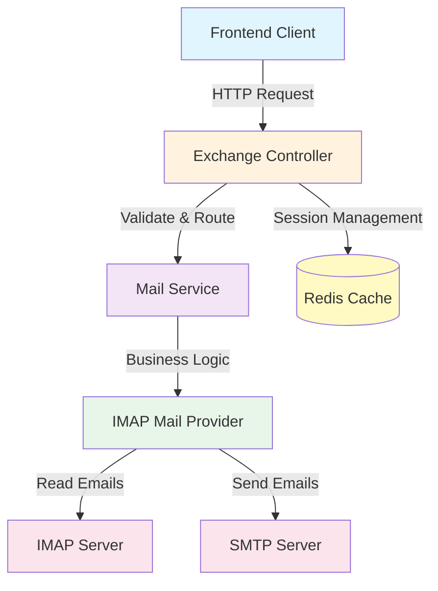
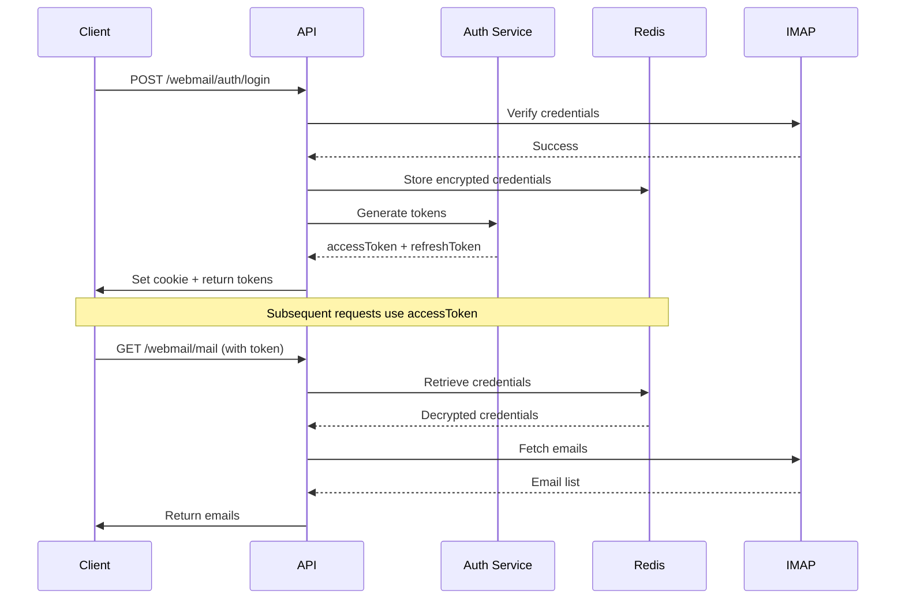

# Exchange Webmail API Documentation

> **Tài liệu API cho Module Exchange Webmail**  
> Phiên bản: 1.0.0 | Cập nhật: 2026-02-09

---

## 📋 Mục Lục

1. [Giới Thiệu](#giới-thiệu)
2. [Kiến Trúc](#kiến-trúc)
3. [Bắt Đầu Nhanh](#bắt-đầu-nhanh)
4. [Authentication APIs](#authentication-apis)
5. [Mail Operations APIs](#mail-operations-apis)
6. [Data Models](#data-models)
7. [Error Handling](#error-handling)
8. [Frontend Integration Guide](#frontend-integration-guide)
9. [Testing Guide](#testing-guide)

---

## Giới Thiệu

Exchange Webmail Module cung cấp một bộ RESTful APIs hoàn chỉnh để xây dựng ứng dụng webmail tích hợp với Exchange Server thông qua IMAP/SMTP protocol.

### Tính Năng Chính

- ✅ **Authentication** với JWT tokens và refresh tokens
- ✅ **Email Management** - Đọc, gửi, tìm kiếm, di chuyển email
- ✅ **Folder Management** - Quản lý các thư mục (Inbox, Sent, Drafts, Trash, Spam)
- ✅ **Attachment Support** - Gửi và nhận file đính kèm
- ✅ **Search Functionality** - Tìm kiếm email theo subject, from, body
- ✅ **Auto-save Sent Items** - Tự động lưu email đã gửi vào Sent folder

### Base URL

```
Development: http://localhost:3000
Production: https://your-domain.com
```

Tất cả endpoints đều có prefix: `/webmail`

---

## Kiến Trúc

### Architecture Overview



### Authentication Flow



### Session Management

- **Access Token**: JWT token, expires in 1 hour
- **Refresh Token**: Stored in Redis, expires in 7 days
- **Credentials**: Encrypted and stored in Redis with session token
- **Cookie**: `exchange_session` cookie for browser clients (optional)

---

## Bắt Đầu Nhanh

### 1. Login và Lấy Token

```bash
curl -X POST http://localhost:3000/webmail/auth/login \
  -H "Content-Type: application/json" \
  -d '{
    "email": "user@company.com",
    "password": "your-password"
  }'
```

**Response:**

```json
{
  "success": true,
  "accessToken": "eyJhbGciOiJIUzI1NiIsInR5cCI6IkpXVCJ9...",
  "refreshToken": "550e8400-e29b-41d4-a716-446655440000.abc123..."
}
```

### 2. Sử Dụng Token Để Gọi API

**Option 1: Authorization Header (Recommended)**

```bash
curl -X GET http://localhost:3000/webmail/folders \
  -H "Authorization: Bearer YOUR_ACCESS_TOKEN"
```

**Option 2: Cookie (Auto-set by login)**

```bash
curl -X GET http://localhost:3000/webmail/folders \
  --cookie "exchange_session=YOUR_ACCESS_TOKEN"
```

### 3. Ví Dụ JavaScript/TypeScript

```typescript
// Login
const loginResponse = await fetch('http://localhost:3000/webmail/auth/login', {
  method: 'POST',
  headers: { 'Content-Type': 'application/json' },
  body: JSON.stringify({
    email: 'user@company.com',
    password: 'your-password',
  }),
  credentials: 'include', // Important for cookies
});

const { accessToken, refreshToken } = await loginResponse.json();

// Store tokens
localStorage.setItem('accessToken', accessToken);
localStorage.setItem('refreshToken', refreshToken);

// Use token in subsequent requests
const foldersResponse = await fetch('http://localhost:3000/webmail/folders', {
  headers: {
    Authorization: `Bearer ${accessToken}`,
  },
  credentials: 'include',
});

const folders = await foldersResponse.json();
```

---

## Authentication APIs

### 1. Login

Xác thực người dùng với Exchange server và tạo session.

**Endpoint:** `POST /webmail/auth/login`

**Request Body:**

```typescript
{
  email: string; // Email Exchange của user
  password: string; // Mật khẩu Exchange
}
```

**Response:**

```typescript
{
  success: boolean;
  accessToken: string; // JWT token, expires in 1h
  refreshToken: string; // Refresh token, expires in 7d
}
```

**Example:**

```bash
curl -X POST http://localhost:3000/webmail/auth/login \
  -H "Content-Type: application/json" \
  -d '{
    "email": "john.doe@company.com",
    "password": "SecurePass123"
  }'
```

**Success Response (200):**

```json
{
  "success": true,
  "accessToken": "eyJhbGciOiJIUzI1NiIsInR5cCI6IkpXVCJ9.eyJlbWFpbCI6ImpvaG4uZG9lQGNvbXBhbnkuY29tIiwiaWF0IjoxNzA3NDc2NDAwLCJleHAiOjE3MDc0ODAwMDB9.xyz",
  "refreshToken": "550e8400-e29b-41d4-a716-446655440000.abc123def456"
}
```

**Error Response (401):**

```json
{
  "statusCode": 401,
  "message": "Invalid credentials",
  "error": "Unauthorized"
}
```

---

### 2. Refresh Token

Làm mới access token khi hết hạn.

**Endpoint:** `POST /webmail/auth/refresh`

**Request Body:**

```typescript
{
  refreshToken: string;
}
```

**Response:**

```typescript
{
  accessToken: string;
  refreshToken: string; // New refresh token
}
```

**Example:**

```bash
curl -X POST http://localhost:3000/webmail/auth/refresh \
  -H "Content-Type: application/json" \
  -d '{
    "refreshToken": "550e8400-e29b-41d4-a716-446655440000.abc123def456"
  }'
```

**Success Response (200):**

```json
{
  "accessToken": "eyJhbGciOiJIUzI1NiIsInR5cCI6IkpXVCJ9...",
  "refreshToken": "660f9511-f39c-52e5-b827-557766551111.def789ghi012"
}
```

**JavaScript Example:**

```typescript
async function refreshAccessToken() {
  const refreshToken = localStorage.getItem('refreshToken');

  const response = await fetch('http://localhost:3000/webmail/auth/refresh', {
    method: 'POST',
    headers: { 'Content-Type': 'application/json' },
    body: JSON.stringify({ refreshToken }),
    credentials: 'include',
  });

  if (response.ok) {
    const { accessToken, refreshToken: newRefreshToken } =
      await response.json();
    localStorage.setItem('accessToken', accessToken);
    localStorage.setItem('refreshToken', newRefreshToken);
    return accessToken;
  }

  throw new Error('Failed to refresh token');
}
```

---

### 3. Logout

Đăng xuất và xóa session.

**Endpoint:** `POST /webmail/auth/logout`

**Authentication:** Required (Cookie or Header)

**Request Body:**

```typescript
{
  refreshToken?: string;  // Optional
}
```

**Response:**

```typescript
{
  success: boolean;
  message: string;
}
```

**Example:**

```bash
curl -X POST http://localhost:3000/webmail/auth/logout \
  -H "Authorization: Bearer YOUR_ACCESS_TOKEN" \
  -H "Content-Type: application/json" \
  -d '{
    "refreshToken": "550e8400-e29b-41d4-a716-446655440000.abc123def456"
  }'
```

**Success Response (200):**

```json
{
  "success": true,
  "message": "Đăng xuất thành công"
}
```

---

## Mail Operations APIs

### 1. Get Folders

Lấy danh sách các thư mục email.

**Endpoint:** `GET /webmail/folders`

**Authentication:** Required

**Response:**

```typescript
Array<{
  id: string; // e.g., "INBOX", "Sent Items", "Drafts"
  name: string; // Tên hiển thị tiếng Việt
}>;
```

**Example:**

```bash
curl -X GET http://localhost:3000/webmail/folders \
  -H "Authorization: Bearer YOUR_ACCESS_TOKEN"
```

**Success Response (200):**

```json
[
  { "id": "INBOX", "name": "Hộp thư đến" },
  { "id": "Sent Items", "name": "Đã gửi" },
  { "id": "Drafts", "name": "Thư nháp" },
  { "id": "Spam", "name": "Thùng rác" }
]
```

**JavaScript Example:**

```typescript
async function getFolders() {
  const response = await fetch('http://localhost:3000/webmail/folders', {
    headers: {
      Authorization: `Bearer ${localStorage.getItem('accessToken')}`,
    },
  });

  return await response.json();
}
```

---

### 2. List Emails

Lấy danh sách email từ một folder với phân trang.

**Endpoint:** `GET /webmail/mail`

**Authentication:** Required

**Query Parameters:**

```typescript
{
  folder?: string;    // Default: "inbox" (inbox, sent, drafts, trash, spam)
  page?: number;      // Default: 1
  pageSize?: number;  // Default: 20
}
```

**Response:**

```typescript
{
  items: Array<{
    id: string; // Base64 encoded ID
    subject: string;
    from: { name: string; email: string };
    receivedAt: Date;
    isRead: boolean;
    hasAttachments: boolean;
    preview: string;
  }>;
  total: number;
}
```

**Example:**

```bash
# Get inbox emails, page 1
curl -X GET "http://localhost:3000/webmail/mail?folder=inbox&page=1&pageSize=20" \
  -H "Authorization: Bearer YOUR_ACCESS_TOKEN"

# Get sent emails
curl -X GET "http://localhost:3000/webmail/mail?folder=sent&page=1" \
  -H "Authorization: Bearer YOUR_ACCESS_TOKEN"
```

**Success Response (200):**

```json
{
  "items": [
    {
      "id": "SU5CT1g6MTIzNDU=",
      "subject": "Meeting Tomorrow",
      "from": {
        "name": "Jane Smith",
        "email": "jane.smith@company.com"
      },
      "receivedAt": "2026-02-09T08:30:00.000Z",
      "isRead": false,
      "hasAttachments": true,
      "preview": "Hi team, just a reminder about our meeting..."
    }
  ],
  "total": 145
}
```

**TypeScript Example:**

```typescript
interface EmailListParams {
  folder?: 'inbox' | 'sent' | 'drafts' | 'trash' | 'spam';
  page?: number;
  pageSize?: number;
}

async function getEmails(params: EmailListParams = {}) {
  const queryParams = new URLSearchParams({
    folder: params.folder || 'inbox',
    page: String(params.page || 1),
    pageSize: String(params.pageSize || 20),
  });

  const response = await fetch(
    `http://localhost:3000/webmail/mail?${queryParams}`,
    {
      headers: {
        Authorization: `Bearer ${localStorage.getItem('accessToken')}`,
      },
    },
  );

  return await response.json();
}

// Usage
const inboxEmails = await getEmails({ folder: 'inbox', page: 1 });
const sentEmails = await getEmails({ folder: 'sent', page: 1, pageSize: 50 });
```

---

### 3. Get Single Email

Lấy chi tiết đầy đủ của một email.

**Endpoint:** `GET /webmail/mail/:id`

**Authentication:** Required

**Path Parameters:**

- `id`: Email ID (base64 encoded, lấy từ list emails)

**Response:**

```typescript
{
  id: string;
  subject: string;
  from: {
    name: string;
    email: string;
  }
  to: Array<{ name: string; email: string }>;
  cc: Array<{ name: string; email: string }>;
  receivedAt: Date;
  body: string; // HTML or plain text
  isHtml: boolean;
  hasAttachments: boolean;
  isRead: boolean;
  preview: string;
}
```

**Example:**

```bash
curl -X GET "http://localhost:3000/webmail/mail/SU5CT1g6MTIzNDU=" \
  -H "Authorization: Bearer YOUR_ACCESS_TOKEN"
```

**Success Response (200):**

```json
{
  "id": "SU5CT1g6MTIzNDU=",
  "subject": "Meeting Tomorrow",
  "from": {
    "name": "Jane Smith",
    "email": "jane.smith@company.com"
  },
  "to": [{ "name": "John Doe", "email": "john.doe@company.com" }],
  "cc": [{ "name": "Team Lead", "email": "lead@company.com" }],
  "receivedAt": "2026-02-09T08:30:00.000Z",
  "body": "<html><body><p>Hi team,</p><p>Just a reminder about our meeting tomorrow at 10 AM.</p></body></html>",
  "isHtml": true,
  "hasAttachments": true,
  "isRead": true,
  "preview": "Hi team, just a reminder about our meeting..."
}
```

**Note:** Email sẽ tự động được đánh dấu là đã đọc (`isRead: true`) sau khi gọi endpoint này.

---

### 4. Search Emails

Tìm kiếm email theo subject, from, hoặc body.

**Endpoint:** `GET /webmail/mail/search`

**Authentication:** Required

**Query Parameters:**

```typescript
{
  q: string;       // Search query (required)
  page?: number;   // Default: 1
}
```

**Response:** Same as List Emails

**Example:**

```bash
curl -X GET "http://localhost:3000/webmail/mail/search?q=meeting&page=1" \
  -H "Authorization: Bearer YOUR_ACCESS_TOKEN"
```

**Success Response (200):**

```json
{
  "items": [
    {
      "id": "SU5CT1g6MTIzNDU=",
      "subject": "Meeting Tomorrow",
      "from": { "name": "Jane Smith", "email": "jane.smith@company.com" },
      "receivedAt": "2026-02-09T08:30:00.000Z",
      "isRead": false,
      "hasAttachments": true
    }
  ],
  "total": 3
}
```

**TypeScript Example:**

```typescript
async function searchEmails(query: string, page: number = 1) {
  const params = new URLSearchParams({ q: query, page: String(page) });

  const response = await fetch(
    `http://localhost:3000/webmail/mail/search?${params}`,
    {
      headers: {
        Authorization: `Bearer ${localStorage.getItem('accessToken')}`,
      },
    },
  );

  return await response.json();
}

// Usage
const results = await searchEmails('meeting', 1);
```

---

### 5. Send Email

Gửi email mới (hỗ trợ HTML, plain text, và attachments).

**Endpoint:** `POST /webmail/mail/send`

**Authentication:** Required

**Request Body:**

```typescript
{
  to: string[];              // Required, email addresses
  cc?: string[];             // Optional
  bcc?: string[];            // Optional
  replyTo?: string[];        // Optional
  subject: string;           // Required
  text?: string;             // Plain text version
  html?: string;             // HTML version
  attachments?: Array<{
    filename: string;
    contentType?: string;
    content: string;         // Base64 encoded
  }>;
}
```

**Response:**

```typescript
{
  success: boolean;
  messageId?: string;
}
```

**Example 1: Simple Text Email**

```bash
curl -X POST http://localhost:3000/webmail/mail/send \
  -H "Authorization: Bearer YOUR_ACCESS_TOKEN" \
  -H "Content-Type: application/json" \
  -d '{
    "to": ["recipient@company.com"],
    "subject": "Test Email",
    "text": "This is a test email."
  }'
```

**Example 2: HTML Email with CC**

```bash
curl -X POST http://localhost:3000/webmail/mail/send \
  -H "Authorization: Bearer YOUR_ACCESS_TOKEN" \
  -H "Content-Type: application/json" \
  -d '{
    "to": ["recipient@company.com"],
    "cc": ["manager@company.com"],
    "subject": "Project Update",
    "html": "<h1>Project Update</h1><p>The project is on track.</p>"
  }'
```

**Example 3: Email with Attachment**

```javascript
// Convert file to base64
function fileToBase64(file) {
  return new Promise((resolve, reject) => {
    const reader = new FileReader();
    reader.onload = () => {
      const base64 = reader.result.split(',')[1];
      resolve(base64);
    };
    reader.onerror = reject;
    reader.readAsDataURL(file);
  });
}

// Send email with attachment
async function sendEmailWithAttachment(file) {
  const base64Content = await fileToBase64(file);

  const response = await fetch('http://localhost:3000/webmail/mail/send', {
    method: 'POST',
    headers: {
      Authorization: `Bearer ${localStorage.getItem('accessToken')}`,
      'Content-Type': 'application/json',
    },
    body: JSON.stringify({
      to: ['recipient@company.com'],
      subject: 'Document Attached',
      html: '<p>Please find the attached document.</p>',
      attachments: [
        {
          filename: file.name,
          contentType: file.type,
          content: base64Content,
        },
      ],
    }),
  });

  return await response.json();
}
```

**Success Response (200):**

```json
{
  "success": true,
  "messageId": "<abc123@mail.company.com>"
}
```

**Note:** Email đã gửi sẽ tự động được lưu vào folder "Sent Items" của người gửi.

---

### 6. Move Email

Di chuyển email từ folder này sang folder khác.

**Endpoint:** `POST /webmail/mail/move`

**Authentication:** Required

**Request Body:**

```typescript
{
  messageId: string; // Email ID to move
  targetFolder: string; // Target folder (inbox, sent, drafts, trash, spam)
}
```

**Response:**

```typescript
{
  success: boolean;
}
```

**Example:**

```bash
# Move email to trash
curl -X POST http://localhost:3000/webmail/mail/move \
  -H "Authorization: Bearer YOUR_ACCESS_TOKEN" \
  -H "Content-Type: application/json" \
  -d '{
    "messageId": "SU5CT1g6MTIzNDU=",
    "targetFolder": "trash"
  }'

# Move email to drafts
curl -X POST http://localhost:3000/webmail/mail/move \
  -H "Authorization: Bearer YOUR_ACCESS_TOKEN" \
  -H "Content-Type: application/json" \
  -d '{
    "messageId": "SU5CT1g6MTIzNDU=",
    "targetFolder": "drafts"
  }'
```

**Success Response (200):**

```json
{
  "success": true
}
```

**TypeScript Example:**

```typescript
async function moveEmail(messageId: string, targetFolder: string) {
  const response = await fetch('http://localhost:3000/webmail/mail/move', {
    method: 'POST',
    headers: {
      Authorization: `Bearer ${localStorage.getItem('accessToken')}`,
      'Content-Type': 'application/json',
    },
    body: JSON.stringify({ messageId, targetFolder }),
  });

  return await response.json();
}

// Usage
await moveEmail('SU5CT1g6MTIzNDU=', 'trash'); // Delete email
await moveEmail('SU5CT1g6MTIzNDU=', 'inbox'); // Restore from trash
```

**Folder Mapping:**

- `inbox` → `INBOX`
- `sent` → `Sent Items`
- `drafts` → `Drafts`
- `trash` → `Deleted Items`
- `spam` → `Spam`

---

## Data Models

### MailMessage (Full)

```typescript
interface MailMessage {
  id: string; // Base64(folder:uid)
  subject: string;
  from: { name: string; email: string };
  to: { name: string; email: string }[];
  cc: { name: string; email: string }[];
  receivedAt: Date;
  body: string; // HTML or plain text
  isHtml: boolean;
  hasAttachments: boolean;
  isRead: boolean;
  preview: string; // First 100 chars
  importance?: string;
}
```

### MailMessage (List View)

```typescript
interface MailMessagePreview {
  id: string;
  subject: string;
  from: { name: string; email: string };
  receivedAt: Date;
  isRead: boolean;
  hasAttachments: boolean;
  preview: string;
}
```

### MailFolder

```typescript
interface MailFolder {
  id: string; // "INBOX", "Sent Items", "Drafts", etc.
  name: string; // Display name in Vietnamese
}
```

### SendMailDto

```typescript
interface SendMailDto {
  to: string[]; // Required, valid email addresses
  cc?: string[];
  bcc?: string[];
  replyTo?: string[];
  subject: string; // Required, not empty
  text?: string;
  html?: string;
  attachments?: Attachment[];
}
```

### Attachment

```typescript
interface Attachment {
  filename: string; // Required
  contentType?: string; // e.g., "application/pdf", "image/png"
  content: string; // Required, base64 encoded
}
```

### MoveMailDto

```typescript
interface MoveMailDto {
  messageId: string; // Required
  targetFolder: string; // Required (inbox, sent, drafts, trash, spam)
}
```

---

## Error Handling

### Error Response Format

Tất cả errors đều follow chuẩn NestJS exception format:

```typescript
{
  statusCode: number;
  message: string | string[];
  error: string;
}
```

### Common HTTP Status Codes

| Code | Meaning               | Common Causes                          |
| ---- | --------------------- | -------------------------------------- |
| 400  | Bad Request           | Invalid input, validation failed       |
| 401  | Unauthorized          | Missing/invalid token, session expired |
| 403  | Forbidden             | Insufficient permissions               |
| 404  | Not Found             | Email/folder not found                 |
| 500  | Internal Server Error | Server/IMAP connection error           |

### Error Examples

**Validation Error (400):**

```json
{
  "statusCode": 400,
  "message": ["to must be an array", "subject should not be empty"],
  "error": "Bad Request"
}
```

**Authentication Error (401):**

```json
{
  "statusCode": 401,
  "message": "Session expired or invalid. Please login again.",
  "error": "Unauthorized"
}
```

**IMAP Connection Error (500):**

```json
{
  "statusCode": 500,
  "message": "Client not connected. Call connect() first.",
  "error": "Internal Server Error"
}
```

### Handling Errors in Frontend

```typescript
async function apiCall(url: string, options: RequestInit) {
  try {
    const response = await fetch(url, options);

    if (!response.ok) {
      const error = await response.json();

      // Handle specific error codes
      if (response.status === 401) {
        // Token expired, try refresh
        const newToken = await refreshAccessToken();
        // Retry with new token
        return apiCall(url, {
          ...options,
          headers: {
            ...options.headers,
            Authorization: `Bearer ${newToken}`,
          },
        });
      }

      throw new Error(error.message);
    }

    return await response.json();
  } catch (error) {
    console.error('API Error:', error);
    throw error;
  }
}
```

### Common Issues & Solutions

| Issue                  | Cause                   | Solution                                  |
| ---------------------- | ----------------------- | ----------------------------------------- |
| "Session expired"      | Access token expired    | Use refresh token to get new access token |
| "Invalid credentials"  | Wrong email/password    | Verify Exchange credentials               |
| "Client not connected" | IMAP connection lost    | Retry the request (auto-reconnects)       |
| "Message not found"    | Email was deleted/moved | Refresh email list                        |
| Validation errors      | Invalid request data    | Check request body matches DTO schema     |

---

## Frontend Integration Guide

### Complete API Client Example

```typescript
// api-client.ts
class ExchangeAPIClient {
  private baseURL = 'http://localhost:3000/webmail';
  private accessToken: string | null = null;
  private refreshToken: string | null = null;

  constructor() {
    this.accessToken = localStorage.getItem('accessToken');
    this.refreshToken = localStorage.getItem('refreshToken');
  }

  // Authentication
  async login(email: string, password: string) {
    const response = await fetch(`${this.baseURL}/auth/login`, {
      method: 'POST',
      headers: { 'Content-Type': 'application/json' },
      body: JSON.stringify({ email, password }),
      credentials: 'include',
    });

    if (!response.ok) throw new Error('Login failed');

    const data = await response.json();
    this.accessToken = data.accessToken;
    this.refreshToken = data.refreshToken;

    localStorage.setItem('accessToken', data.accessToken);
    localStorage.setItem('refreshToken', data.refreshToken);

    return data;
  }

  async logout() {
    await this.request('/auth/logout', {
      method: 'POST',
      body: JSON.stringify({ refreshToken: this.refreshToken }),
    });

    this.accessToken = null;
    this.refreshToken = null;
    localStorage.removeItem('accessToken');
    localStorage.removeItem('refreshToken');
  }

  async refreshAccessToken() {
    const response = await fetch(`${this.baseURL}/auth/refresh`, {
      method: 'POST',
      headers: { 'Content-Type': 'application/json' },
      body: JSON.stringify({ refreshToken: this.refreshToken }),
      credentials: 'include',
    });

    if (!response.ok) {
      this.logout();
      throw new Error('Refresh failed');
    }

    const data = await response.json();
    this.accessToken = data.accessToken;
    this.refreshToken = data.refreshToken;

    localStorage.setItem('accessToken', data.accessToken);
    localStorage.setItem('refreshToken', data.refreshToken);

    return data.accessToken;
  }

  // Generic request handler with auto-refresh
  private async request(endpoint: string, options: RequestInit = {}) {
    const url = `${this.baseURL}${endpoint}`;
    const headers = {
      'Content-Type': 'application/json',
      ...options.headers,
      ...(this.accessToken && { Authorization: `Bearer ${this.accessToken}` }),
    };

    let response = await fetch(url, {
      ...options,
      headers,
      credentials: 'include',
    });

    // Auto-refresh on 401
    if (response.status === 401 && this.refreshToken) {
      await this.refreshAccessToken();
      response = await fetch(url, {
        ...options,
        headers: {
          ...headers,
          Authorization: `Bearer ${this.accessToken}`,
        },
        credentials: 'include',
      });
    }

    if (!response.ok) {
      const error = await response.json();
      throw new Error(error.message);
    }

    return response.json();
  }

  // Mail operations
  async getFolders() {
    return this.request('/folders');
  }

  async getEmails(folder = 'inbox', page = 1, pageSize = 20) {
    const params = new URLSearchParams({
      folder,
      page: String(page),
      pageSize: String(pageSize),
    });
    return this.request(`/mail?${params}`);
  }

  async getEmail(id: string) {
    return this.request(`/mail/${id}`);
  }

  async searchEmails(query: string, page = 1) {
    const params = new URLSearchParams({ q: query, page: String(page) });
    return this.request(`/mail/search?${params}`);
  }

  async sendEmail(data: any) {
    return this.request('/mail/send', {
      method: 'POST',
      body: JSON.stringify(data),
    });
  }

  async moveEmail(messageId: string, targetFolder: string) {
    return this.request('/mail/move', {
      method: 'POST',
      body: JSON.stringify({ messageId, targetFolder }),
    });
  }
}

// Export singleton instance
export const exchangeAPI = new ExchangeAPIClient();
```

### React Hook Example

```typescript
// useExchangeAPI.ts
import { useState, useEffect } from 'react';
import { exchangeAPI } from './api-client';

export function useEmails(folder = 'inbox', page = 1) {
  const [emails, setEmails] = useState([]);
  const [total, setTotal] = useState(0);
  const [loading, setLoading] = useState(true);
  const [error, setError] = useState(null);

  useEffect(() => {
    async function fetchEmails() {
      try {
        setLoading(true);
        const data = await exchangeAPI.getEmails(folder, page);
        setEmails(data.items);
        setTotal(data.total);
        setError(null);
      } catch (err) {
        setError(err.message);
      } finally {
        setLoading(false);
      }
    }

    fetchEmails();
  }, [folder, page]);

  return { emails, total, loading, error };
}

// Usage in component
function EmailList() {
  const { emails, total, loading, error } = useEmails('inbox', 1);

  if (loading) return <div>Loading...</div>;
  if (error) return <div>Error: {error}</div>;

  return (
    <div>
      <h2>Emails ({total})</h2>
      {emails.map(email => (
        <div key={email.id}>
          <h3>{email.subject}</h3>
          <p>{email.from.name} - {email.receivedAt}</p>
        </div>
      ))}
    </div>
  );
}
```

### Best Practices

1. **Token Management**
   - Store tokens in localStorage or sessionStorage
   - Implement auto-refresh logic
   - Clear tokens on logout

2. **Error Handling**
   - Always handle 401 errors with token refresh
   - Show user-friendly error messages
   - Log errors for debugging

3. **Performance**
   - Implement pagination for email lists
   - Cache folder list (rarely changes)
   - Debounce search queries

4. **Security**
   - Use HTTPS in production
   - Don't log sensitive data (passwords, tokens)
   - Implement CSRF protection if using cookies

---

## Testing Guide

### Manual Testing Checklist

#### Authentication Flow

- [ ] Login with valid credentials → Success
- [ ] Login with invalid credentials → 401 error
- [ ] Refresh token before expiry → New tokens
- [ ] Refresh with invalid token → Error
- [ ] Logout → Session cleared

#### Email Operations

- [ ] List inbox emails → Returns paginated list
- [ ] Get single email → Returns full details + marks as read
- [ ] Search emails → Returns matching results
- [ ] Send plain text email → Success + appears in Sent folder
- [ ] Send HTML email → Success
- [ ] Send email with attachment → Success
- [ ] Move email to trash → Email moved
- [ ] Move email back to inbox → Email restored

### Postman Collection

Create a collection with these requests:

**1. Login**

```
POST {{baseUrl}}/webmail/auth/login
Body:
{
  "email": "{{email}}",
  "password": "{{password}}"
}

Tests:
pm.test("Login successful", function() {
  pm.response.to.have.status(200);
  const json = pm.response.json();
  pm.environment.set("accessToken", json.accessToken);
  pm.environment.set("refreshToken", json.refreshToken);
});
```

**2. Get Folders**

```
GET {{baseUrl}}/webmail/folders
Headers:
Authorization: Bearer {{accessToken}}

Tests:
pm.test("Folders returned", function() {
  pm.response.to.have.status(200);
  const folders = pm.response.json();
  pm.expect(folders).to.be.an('array');
});
```

**3. List Emails**

```
GET {{baseUrl}}/webmail/mail?folder=inbox&page=1&pageSize=10
Headers:
Authorization: Bearer {{accessToken}}

Tests:
pm.test("Emails returned", function() {
  pm.response.to.have.status(200);
  const data = pm.response.json();
  pm.expect(data).to.have.property('items');
  pm.expect(data).to.have.property('total');
  if (data.items.length > 0) {
    pm.environment.set("testEmailId", data.items[0].id);
  }
});
```

**4. Send Email**

```
POST {{baseUrl}}/webmail/mail/send
Headers:
Authorization: Bearer {{accessToken}}
Body:
{
  "to": ["test@example.com"],
  "subject": "Test from Postman",
  "text": "This is a test email"
}

Tests:
pm.test("Email sent", function() {
  pm.response.to.have.status(200);
  const json = pm.response.json();
  pm.expect(json.success).to.be.true;
});
```

### Environment Variables

```json
{
  "baseUrl": "http://localhost:3000",
  "email": "your-email@company.com",
  "password": "your-password",
  "accessToken": "",
  "refreshToken": "",
  "testEmailId": ""
}
```

### Test Scenarios

**Scenario 1: Complete Email Workflow**

1. Login
2. Get folders
3. List inbox emails
4. Get first email details
5. Send a reply
6. Move original email to trash
7. Logout

**Scenario 2: Token Refresh**

1. Login
2. Wait for token to expire (or manually expire)
3. Make API call → Should auto-refresh
4. Verify new token works

**Scenario 3: Search and Filter**

1. Login
2. Search for "meeting"
3. Verify results contain keyword
4. Try different folders
5. Test pagination

---

## Appendix

### Folder ID Mapping

| Short Name | Full Folder ID | Vietnamese Name |
| ---------- | -------------- | --------------- |
| inbox      | INBOX          | Hộp thư đến     |
| sent       | Sent Items     | Đã gửi          |
| drafts     | Drafts         | Thư nháp        |
| trash      | Deleted Items  | Thùng rác       |
| spam       | Spam           | Thư rác         |

### Message ID Format

Email IDs are base64 encoded strings in format: `folder:uid`

Example:

- Original: `INBOX:12345`
- Encoded: `SU5CT1g6MTIzNDU=`

To decode in JavaScript:

```javascript
const decoded = atob('SU5CT1g6MTIzNDU='); // "INBOX:12345"
const [folder, uid] = decoded.split(':');
```

### Rate Limiting

Currently no rate limiting is implemented. Consider implementing in production:

- Login: 5 attempts per 15 minutes
- API calls: 100 requests per minute per user

### CORS Configuration

For frontend development, ensure CORS is enabled in backend:

```typescript
// main.ts
app.enableCors({
  origin: ['http://localhost:3000', 'http://localhost:5173'],
  credentials: true,
});
```

---

## Support & Contact

For issues or questions:

- **Backend Team**: backend@company.com
- **Documentation**: [GitHub Wiki](https://github.com/your-repo/wiki)
- **Bug Reports**: [GitHub Issues](https://github.com/your-repo/issues)

---

**Last Updated:** 2026-02-09  
**Version:** 1.0.0  
**Maintainer:** Backend Team
