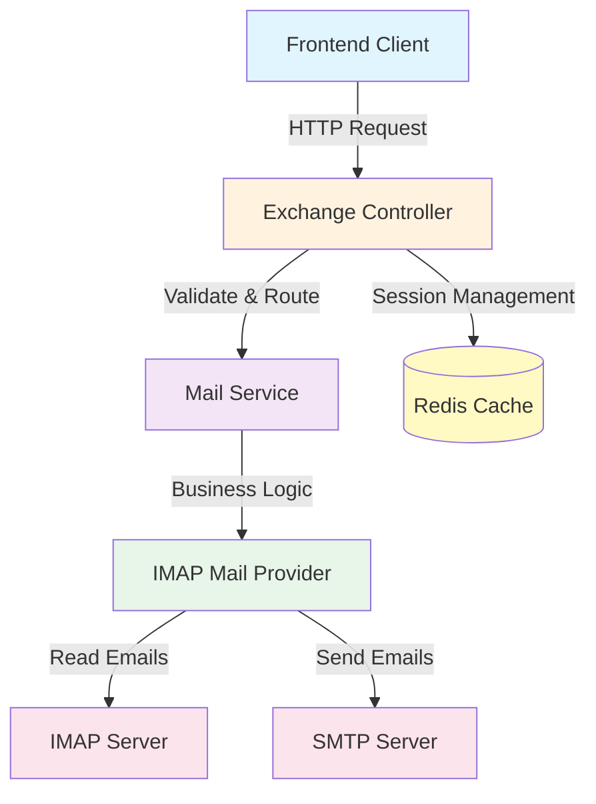
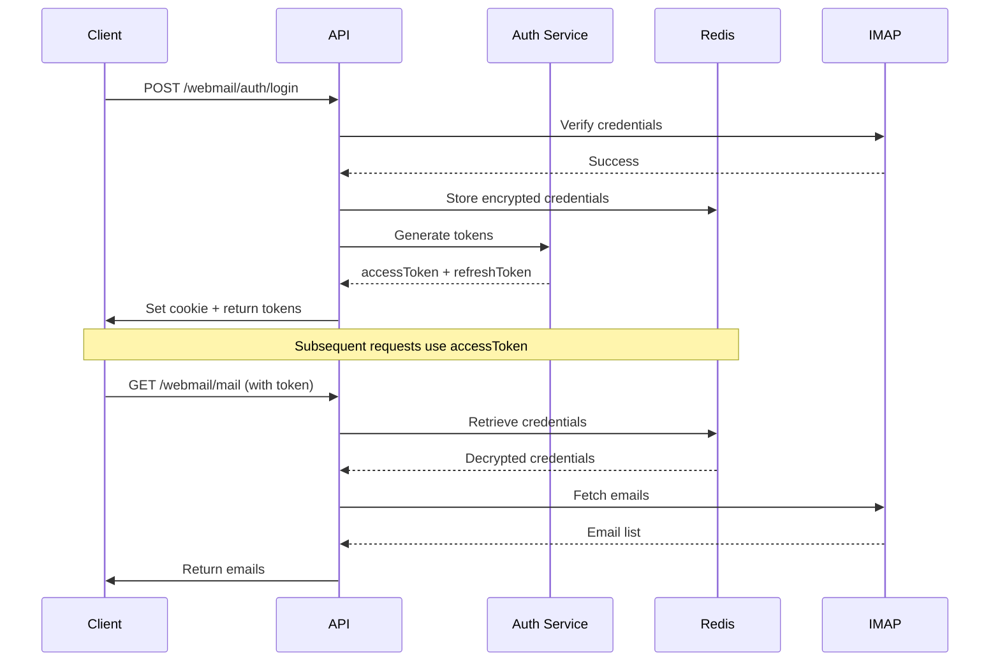

This file is a merged representation of the entire codebase, combined into a single document by Repomix.

# File Summary

## Purpose
This file contains a packed representation of the entire repository's contents.
It is designed to be easily consumable by AI systems for analysis, code review,
or other automated processes.

## File Format
The content is organized as follows:
1. This summary section
2. Repository information
3. Directory structure
4. Repository files (if enabled)
5. Multiple file entries, each consisting of:
  a. A header with the file path (## File: path/to/file)
  b. The full contents of the file in a code block

## Usage Guidelines
- This file should be treated as read-only. Any changes should be made to the
  original repository files, not this packed version.
- When processing this file, use the file path to distinguish
  between different files in the repository.
- Be aware that this file may contain sensitive information. Handle it with
  the same level of security as you would the original repository.

## Notes
- Some files may have been excluded based on .gitignore rules and Repomix's configuration
- Binary files are not included in this packed representation. Please refer to the Repository Structure section for a complete list of file paths, including binary files
- Files matching patterns in .gitignore are excluded
- Files matching default ignore patterns are excluded
- Files are sorted by Git change count (files with more changes are at the bottom)

# Directory Structure
```
.dockerignore
.env.example
.gitignore
.prettierrc
audit_log_implementation_notes.md
docker-compose.yml
dockerfile
docs/BATCH_MAIL_APIS.md
docs/contacts-api.md
docs/EXCHANGE_API_DOCUMENTATION.md
docs/MAILBOX_MODULE_GUIDE.md
docs/PERMANENT_DELETE_MAIL_API.md
docs/PROJECT_IMPLEMENTED_FEATURES.md
docs/RSPAMD_SSH_SYNC_GUIDE.md
eslint.config.mjs
mikro-orm.config.ts
MOVE_MAIL_API.md
nest-cli.json
package.json
scripts/dev-clean.mjs
scripts/mailbox/create-mailbox.ps1
scripts/mailbox/create-mailbox.py
scripts/mailbox/delete-mailbox.ps1
scripts/mailbox/delete-mailbox.py
scripts/mailbox/disable-mailbox.ps1
scripts/mailbox/disable-mailbox.py
scripts/mailbox/exchange-worker.py
scripts/mailbox/restore-mailbox.ps1
scripts/mailbox/restore-mailbox.py
scripts/mailbox/update-mailbox.ps1
scripts/mailbox/update-mailbox.py
scripts/shared-mailbox/add-mailbox-permission.ps1
scripts/shared-mailbox/create-shared-mailbox.ps1
scripts/shared-mailbox/delete-shared-mailbox.ps1
scripts/shared-mailbox/disable-shared-mailbox.ps1
scripts/shared-mailbox/remove-mailbox-permission.ps1
scripts/shared-mailbox/update-shared-mailbox.ps1
src/app.controller.spec.ts
src/app.controller.ts
src/app.module.ts
src/app.service.ts
src/audit/audit-log.interceptor.ts
src/audit/audit.controller.ts
src/audit/audit.module.ts
src/audit/audit.service.ts
src/auth/auth-cookie.util.ts
src/auth/auth.controller.ts
src/auth/auth.module.ts
src/auth/auth.service.ts
src/auth/decorators/current-user.decorator.ts
src/auth/dto/login.dto.ts
src/auth/dto/register.dto.ts
src/auth/dto/reset-password.dto.ts
src/auth/guards/exchange-auth.guard.ts
src/auth/guards/jwt-auth.guard.ts
src/auth/strategies/jwt.strategy.ts
src/common/cache/cache.module.ts
src/common/cache/dragonfly.service.ts
src/common/common.module.ts
src/common/context/request.context.ts
src/common/decorators/audit-action.decorator.ts
src/common/exceptions/invalid-query.exception.ts
src/common/interceptors/request-context.interceptor.ts
src/common/localization/vi.ts
src/common/permissions/permission.service.ts
src/config/auth.config.ts
src/config/database.config.ts
src/config/dragonfly.config.ts
src/config/ews.config.ts
src/config/query.config.ts
src/config/storage.config.ts
src/database/entities/audit-log.entity.ts
src/database/entities/file.entity.ts
src/database/entities/global-blocklist.entity.ts
src/database/entities/organization-unit.entity.ts
src/database/entities/permission.entity.ts
src/database/entities/role.entity.ts
src/database/entities/rss-article.entity.ts
src/database/entities/rss-feed.entity.ts
src/database/entities/security-policy.entity.ts
src/database/entities/shared-mailbox-member.entity.ts
src/database/entities/shared-mailbox.entity.ts
src/database/entities/spam-report.entity.ts
src/database/entities/user-rss-state.entity.ts
src/database/entities/user-rss-subscription.entity.ts
src/database/entities/user.entity.ts
src/database/migrations/.snapshot-postgres.json
src/database/migrations/Migration20260204095049.ts
src/database/migrations/Migration20260223120000.ts
src/database/migrations/Migration20260312044513.ts
src/database/migrations/Migration20260316070430.ts
src/database/migrations/Migration20260316070909.ts
src/database/migrations/Migration20260317011911.ts
src/database/migrations/Migration20260317044849.ts
src/dto/post/create-post.dto.ts
src/dto/post/update-post.dto.ts
src/exchange/constants/mail-folders.constant.ts
src/exchange/controllers/admin-moderation.controller.ts
src/exchange/controllers/contacts.controller.ts
src/exchange/controllers/exchange.controller.ts
src/exchange/controllers/notes.controller.ts
src/exchange/dto/calendar.dto.ts
src/exchange/dto/contact-note.dto.ts
src/exchange/dto/exchange.dto.ts
src/exchange/exchange.module.ts
src/exchange/interceptors/exchange-error.interceptor.ts
src/exchange/interfaces/contact-note.interface.ts
src/exchange/interfaces/mail-provider.interface.ts
src/exchange/services/contact-note.service.ts
src/exchange/services/ews-mail.provider.ts
src/exchange/services/exchange-auth.service.ts
src/exchange/services/imap-mail.provider.ts
src/exchange/services/mail.service.ts
src/exchange/services/rspamd-sync.service.ts
src/exchange/services/smtp-sender.service.ts
src/exchange/services/spam-moderation.service.ts
src/exchange/utils/json.helper.ts
src/files/dto/commit-file.dto.ts
src/files/dto/temp-upload-response.dto.ts
src/files/files.controller.ts
src/files/files.module.ts
src/files/files.scheduler.ts
src/files/files.service.ts
src/mailbox/gal.service.ts
src/mailbox/mailbox.controller.ts
src/mailbox/mailbox.dto.ts
src/mailbox/mailbox.module.ts
src/mailbox/mailbox.service.ts
src/mailbox/script-runner.service.ts
src/main.ts
src/meta/entity-registry.service.ts
src/meta/meta.module.ts
src/meta/metadata-reader.service.ts
src/organization/organization.controller.spec.ts
src/organization/organization.controller.ts
src/organization/organization.dto.ts
src/organization/organization.module.ts
src/organization/organization.service.spec.ts
src/organization/organization.service.ts
src/rss/dto/rss-articles-query.dto.ts
src/rss/dto/rss-scope-query.dto.ts
src/rss/dto/subscribe-rss-feed.dto.ts
src/rss/rss-crawler.service.ts
src/rss/rss-queue.service.ts
src/rss/rss.constants.ts
src/rss/rss.controller.ts
src/rss/rss.module.ts
src/rss/rss.service.ts
src/shared-mailbox/shared-mailbox.controller.ts
src/shared-mailbox/shared-mailbox.dto.ts
src/shared-mailbox/shared-mailbox.module.ts
src/shared-mailbox/shared-mailbox.runner.ts
src/shared-mailbox/shared-mailbox.service.ts
src/storage/local-storage.adapter.ts
src/storage/storage.interface.ts
src/storage/storage.service.ts
storage/temp/01KFQ0PEXVFWHRZ9ZFDM75E8DZ
storage/temp/01KFQ1GENRTN714S1EQM13ZJJ1
storage/uploads/01KFQ3SQA8JEBXYGP6AZNJBNZ8
storage/uploads/f2efddd8-26e6-4ad8-89ae-eef6e40a33b8
test/app.e2e-spec.ts
test/jest-e2e.json
test/jest-unit.json
test/webmail-list-read-pagination.e2e-spec.ts
test/webmail-send-receive.e2e-spec.ts
test/webmail-sent-append.spec.ts
tsconfig.build.json
tsconfig.json
```

# Files

## File: scripts/dev-clean.mjs
````javascript
import { execFileSync } from 'node:child_process';

const repoRoot = process.cwd();
const repoRootPattern = repoRoot.replace(/'/g, "''");
const currentPid = process.pid;

function runPowerShell(command) {
  return execFileSync('powershell', ['-NoProfile', '-Command', command], {
    cwd: repoRoot,
    encoding: 'utf8',
    stdio: ['ignore', 'pipe', 'pipe'],
  }).trim();
}

function stopProcess(processId) {
  try {
    execFileSync(
      'powershell',
      ['-NoProfile', '-Command', `Stop-Process -Id ${processId} -Force`],
      {
        cwd: repoRoot,
        stdio: 'ignore',
      },
    );
    console.log(`[dev-clean] Stopped stale backend process ${processId}.`);
  } catch {
    console.log(
      `[dev-clean] Skipped backend process ${processId}; it already exited.`,
    );
  }
}

function main() {
  if (process.platform !== 'win32') {
    return;
  }

  const command = [
    `$repo = '${repoRootPattern}';`,
    `$currentPid = ${currentPid};`,
    '$repoProcessIds = Get-CimInstance Win32_Process |',
    '  Where-Object {',
    "    $_.Name -eq 'node.exe' -and",
    '    $_.ProcessId -ne $currentPid -and',
    '    $_.CommandLine -like "*$repo*" -and',
    "    ($_.CommandLine -like '*@nestjs*' -or $_.CommandLine -like '*nest start*' -or $_.CommandLine -like '*dist\\src\\main*')",
    '  } |',
    '  Select-Object -ExpandProperty ProcessId;',
    '$portProcessIds = Get-NetTCPConnection -LocalPort 3005 -State Listen -ErrorAction SilentlyContinue |',
    '  ForEach-Object {',
    '    $procId = $_.OwningProcess;',
    '    $proc = Get-CimInstance Win32_Process -Filter "ProcessId = $procId";',
    '    if ($proc -and $proc.Name -eq \'node.exe\' -and $proc.CommandLine -like "*$repo*") { $procId }',
    '  };',
    '($repoProcessIds + $portProcessIds) | Sort-Object -Unique',
  ].join(' ');

  const output = runPowerShell(command);
  const processIds = output
    .split(/\r?\n/)
    .map((value) => value.trim())
    .filter(Boolean)
    .filter((value) => /^\d+$/.test(value));

  for (const value of processIds) {
    stopProcess(value);
  }
}

try {
  main();
} catch (error) {
  console.error('[dev-clean] Failed to clean backend dev state.');
  console.error(error instanceof Error ? error.message : error);
  process.exit(1);
}
````

## File: src/auth/auth-cookie.util.ts
````typescript
import type { CookieOptions } from 'express';

const parseSameSite = (): CookieOptions['sameSite'] => {
  const value = (process.env.COOKIE_SAME_SITE ?? 'lax').toLowerCase();

  if (value === 'strict' || value === 'lax' || value === 'none') {
    return value;
  }

  return 'lax';
};

const parseSecure = (sameSite: CookieOptions['sameSite']) => {
  if (process.env.COOKIE_SECURE === 'true') {
    return true;
  }

  if (process.env.COOKIE_SECURE === 'false') {
    return false;
  }

  return sameSite === 'none' || process.env.NODE_ENV === 'production';
};

export const buildAuthCookieOptions = (maxAge: number): CookieOptions => {
  const sameSite = parseSameSite();

  return {
    httpOnly: true,
    secure: parseSecure(sameSite),
    sameSite,
    maxAge,
    path: '/',
  };
};
````

## File: src/database/entities/rss-article.entity.ts
````typescript
import { Entity, PrimaryKey, Property, ManyToOne, Index } from '@mikro-orm/core';
import { randomUUID } from 'crypto';
import { RssFeed } from './rss-feed.entity';

@Entity({ tableName: 'rss_articles' })
export class RssArticle {
  @PrimaryKey({ type: 'uuid' })
  id: string = randomUUID();

  @ManyToOne(() => RssFeed, { nullable: true })
  @Index()
  feed?: RssFeed;

  @Index()
  @Property({ nullable: true, length: 1024, unique: true })
  guid?: string;

  @Index()
  @Property({ nullable: true, length: 2048, unique: true })
  link?: string;

  @Property({ nullable: true })
  title?: string;

  @Property({ type: 'text' })
  summary: string = '';

  @Property({ default: false })
  isRead: boolean = false;

  @Property({ nullable: true })
  readAt?: Date;

  @Property({ nullable: true })
  publishedAt?: Date;

  @Property({ onCreate: () => new Date() })
  createdAt: Date = new Date();

  @Property({ onUpdate: () => new Date() })
  updatedAt: Date = new Date();
}
````

## File: src/database/entities/rss-feed.entity.ts
````typescript
import { Entity, PrimaryKey, Property, Index } from '@mikro-orm/core';
import { randomUUID } from 'crypto';

@Entity({ tableName: 'rss_feeds' })
export class RssFeed {
  @PrimaryKey({ type: 'uuid' })
  id: string = randomUUID();

  @Property({ unique: true })
  @Index()
  url!: string;

  @Property({ nullable: true })
  name?: string;

  @Property({ fieldName: 'title', nullable: true })
  legacyTitle?: string;

  @Property({ default: true })
  isActive: boolean = true;

  @Property({ onCreate: () => new Date() })
  createdAt: Date = new Date();

  @Property({ onUpdate: () => new Date() })
  updatedAt: Date = new Date();
}
````

## File: src/database/entities/user-rss-state.entity.ts
````typescript
import { Entity, ManyToOne, PrimaryKey, Property, Unique } from '@mikro-orm/core';
import { randomUUID } from 'crypto';
import { User } from './user.entity';
import { RssArticle } from './rss-article.entity';

@Entity({ tableName: 'user_rss_states' })
@Unique({ properties: ['user', 'article'] })
export class UserRssState {
  @PrimaryKey({ type: 'uuid' })
  id: string = randomUUID();

  @ManyToOne(() => User, { fieldName: 'user_id' })
  user!: User;

  @ManyToOne(() => RssArticle, { fieldName: 'article_id' })
  article!: RssArticle;

  @Property({ fieldName: 'is_read', default: false })
  isRead: boolean = false;

  @Property({ fieldName: 'is_starred', default: false })
  isStarred: boolean = false;

  @Property({ fieldName: 'updated_at', onCreate: () => new Date(), onUpdate: () => new Date() })
  updatedAt: Date = new Date();
}
````

## File: src/database/entities/user-rss-subscription.entity.ts
````typescript
import { Entity, ManyToOne, PrimaryKey, Property, Unique } from '@mikro-orm/core';
import { randomUUID } from 'crypto';
import { User } from './user.entity';
import { RssFeed } from './rss-feed.entity';

@Entity({ tableName: 'user_rss_subscriptions' })
@Unique({ properties: ['user', 'feed'] })
export class UserRssSubscription {
  @PrimaryKey({ type: 'uuid' })
  id: string = randomUUID();

  @ManyToOne(() => User, { fieldName: 'user_id' })
  user!: User;

  @ManyToOne(() => RssFeed, { fieldName: 'feed_id' })
  feed!: RssFeed;

  @Property({ fieldName: 'folder_name', nullable: true })
  folderName?: string;

  @Property({ fieldName: 'created_at', onCreate: () => new Date() })
  createdAt: Date = new Date();
}
````

## File: src/rss/dto/rss-articles-query.dto.ts
````typescript
import { Transform } from 'class-transformer';
import { IsInt, IsOptional, IsUUID, Max, Min } from 'class-validator';

export class RssArticlesQueryDto {
  @IsOptional()
  scope?: 'server';

  @IsOptional()
  @Transform(({ value }) => Number(value))
  @IsInt()
  @Min(1)
  page?: number = 1;

  @IsOptional()
  @Transform(({ value }) => Number(value))
  @IsInt()
  @Min(1)
  @Max(100)
  limit?: number = 20;

  @IsOptional()
  @IsUUID()
  feedId?: string;
}
````

## File: src/rss/dto/rss-scope-query.dto.ts
````typescript
import { IsIn, IsOptional } from 'class-validator';

export class RssScopeQueryDto {
  @IsOptional()
  @IsIn(['server'])
  scope?: 'server';
}
````

## File: src/rss/dto/subscribe-rss-feed.dto.ts
````typescript
import { IsNotEmpty, IsOptional, IsString, IsUrl, MaxLength } from 'class-validator';

export class SubscribeRssFeedDto {
  @IsUrl({ require_tld: false })
  @IsNotEmpty()
  url!: string;

  @IsOptional()
  @IsString()
  @MaxLength(255)
  name?: string;
}
````

## File: src/rss/rss-crawler.service.ts
````typescript
import { Injectable, Logger } from '@nestjs/common';
import { Cron } from '@nestjs/schedule';
import { EntityManager } from '@mikro-orm/core';
import { RssFeed } from '../database/entities/rss-feed.entity';
import { RssQueueService } from './rss-queue.service';

@Injectable()
export class RssCrawlerService {
  private readonly logger = new Logger(RssCrawlerService.name);

  constructor(
    private readonly em: EntityManager,
    private readonly rssQueueService: RssQueueService,
  ) { }

  @Cron('0 */30 * * * *', {
    name: 'rss-news-pooling',
    timeZone: 'UTC',
  })
  async crawlFeeds(): Promise<void> {
    this.logger.log('Starting RSS news pooling');

    const feedRows = await this.em.find(RssFeed, {});
    const uniqueFeeds = new Map<string, RssFeed>();

    for (const feed of feedRows) {
      const normalizedUrl = feed.url?.trim();
      if (!normalizedUrl) {
        continue;
      }

      if (!uniqueFeeds.has(normalizedUrl)) {
        uniqueFeeds.set(normalizedUrl, feed);
      }
    }

    for (const [url, feed] of uniqueFeeds) {
      try {
        await this.rssQueueService.enqueueFeedCrawl(feed);
      } catch (error) {
        const message = error instanceof Error ? error.message : String(error);
        this.logger.warn(`RSS queue enqueue failed for ${url}: ${message}`);
      }
    }

    this.logger.log(
      `Finished RSS crawl enqueue. feeds=${uniqueFeeds.size}`,
    );
  }
}
````

## File: src/rss/rss-queue.service.ts
````typescript
import { EntityManager } from '@mikro-orm/core';
import { Injectable, Logger, OnModuleDestroy, OnModuleInit } from '@nestjs/common';
import { ConfigService } from '@nestjs/config';
import { JobsOptions, Queue, Worker } from 'bullmq';
import { load } from 'cheerio';
import Parser from 'rss-parser';
import sanitizeHtml from 'sanitize-html';
import { RssArticle } from '../database/entities/rss-article.entity';
import { RssFeed } from '../database/entities/rss-feed.entity';
import {
    RSS_ARTICLE_PERSIST_JOB,
    RSS_ARTICLE_QUEUE,
    RSS_FEED_CRAWL_JOB,
    RSS_FEED_QUEUE,
} from './rss.constants';

type FeedCrawlJobData = {
    feedId: string;
    url: string;
};

type ArticlePersistJobData = {
    feedId: string;
    guid?: string;
    link?: string;
    title?: string;
    summary: string;
    publishedAt?: string;
};

@Injectable()
export class RssQueueService implements OnModuleInit, OnModuleDestroy {
    private readonly logger = new Logger(RssQueueService.name);
    private readonly parser = new Parser({ timeout: 15000 });
    private readonly articleContentMinimumLength = 600;
    private readonly queueEnabled: boolean;
    private readonly connection?: {
        host: string;
        port: number;
        password?: string;
        maxRetriesPerRequest: null;
        enableReadyCheck: boolean;
    };
    private readonly feedJobOptions: JobsOptions = {
        removeOnComplete: 100,
        removeOnFail: 100,
        attempts: 3,
        backoff: {
            type: 'exponential',
            delay: 5000,
        },
    };
    private readonly articleJobOptions: JobsOptions = {
        removeOnComplete: 500,
        removeOnFail: 500,
        attempts: 2,
        backoff: {
            type: 'fixed',
            delay: 2000,
        },
    };

    private feedQueue: Queue<FeedCrawlJobData> | null = null;
    private articleQueue: Queue<ArticlePersistJobData> | null = null;
    private feedWorker: Worker<FeedCrawlJobData> | null = null;
    private articleWorker: Worker<ArticlePersistJobData> | null = null;

    constructor(
        private readonly em: EntityManager,
        private readonly configService: ConfigService,
    ) {
        const enabled =
            this.configService.get<string>('DRAGONFLY_ENABLED') === 'true';
        this.queueEnabled = enabled;

        if (enabled) {
            this.connection = {
                host: this.configService.get<string>('DRAGONFLY_HOST') || 'localhost',
                port: Number(this.configService.get<string>('DRAGONFLY_PORT') || 6379),
                password:
                    this.configService.get<string>('DRAGONFLY_PASSWORD') || undefined,
                maxRetriesPerRequest: null,
                enableReadyCheck: false,
            };
        }
    }

    async onModuleInit(): Promise<void> {
        if (!this.queueEnabled || !this.connection) {
            this.logger.warn(
                'Redis queue is disabled. RSS jobs will run inline on the API/Cron process.',
            );
            return;
        }

        this.feedQueue = new Queue<FeedCrawlJobData>(RSS_FEED_QUEUE, {
            connection: this.connection,
            defaultJobOptions: this.feedJobOptions,
        });

        this.articleQueue = new Queue<ArticlePersistJobData>(RSS_ARTICLE_QUEUE, {
            connection: this.connection,
            defaultJobOptions: this.articleJobOptions,
        });

        this.feedWorker = new Worker<FeedCrawlJobData>(
            RSS_FEED_QUEUE,
            async (job) => this.processFeedJob(job.data),
            {
                connection: this.connection,
                concurrency: 2,
            },
        );

        this.articleWorker = new Worker<ArticlePersistJobData>(
            RSS_ARTICLE_QUEUE,
            async (job) => this.processArticleJob(job.data),
            {
                connection: this.connection,
                concurrency: 1,
            },
        );

        this.feedWorker.on('failed', (job, error) => {
            this.logger.warn(
                `RSS feed job failed (${job?.id ?? 'unknown'}): ${error.message}`,
            );
        });

        this.articleWorker.on('failed', (job, error) => {
            this.logger.warn(
                `RSS article job failed (${job?.id ?? 'unknown'}): ${error.message}`,
            );
        });

        this.logger.log('RSS Redis queues are ready');
    }

    async onModuleDestroy(): Promise<void> {
        await this.feedWorker?.close();
        await this.articleWorker?.close();
        await this.feedQueue?.close();
        await this.articleQueue?.close();
    }

    async enqueueFeedCrawl(feed: RssFeed): Promise<void> {
        const url = feed.url?.trim();
        if (!url) {
            return;
        }

        const payload: FeedCrawlJobData = {
            feedId: feed.id,
            url,
        };

        if (!this.feedQueue) {
            await this.processFeedJob(payload);
            return;
        }

        await this.feedQueue.add(RSS_FEED_CRAWL_JOB, payload, this.feedJobOptions);
    }

    private async processFeedJob(data: FeedCrawlJobData): Promise<void> {
        const em = this.em.fork();
        const feed = await em.findOne(RssFeed, { id: data.feedId });

        if (!feed?.isActive) {
            return;
        }

        const parsedFeed = await this.parser.parseURL(data.url);
        const feedTitle = parsedFeed.title?.trim();
        if (feedTitle) {
            feed.name = feedTitle;
            feed.legacyTitle = feedTitle;
            feed.updatedAt = new Date();
            await em.flush();
        }

        for (const item of parsedFeed.items ?? []) {
            const guid = this.normalize(item.guid);
            const link = this.normalize(item.link);

            if (!guid && !link) {
                continue;
            }

            const payload: ArticlePersistJobData = {
                feedId: feed.id,
                guid,
                link,
                title: this.normalize(item.title),
                summary: this.buildArticleContent(item),
                publishedAt: this.parseDate(item.pubDate)?.toISOString(),
            };

            if (!this.articleQueue) {
                await this.processArticleJob(payload);
                continue;
            }

            const dedupeKey = guid ? `guid:${guid}` : `link:${link}`;
            await this.articleQueue.add(RSS_ARTICLE_PERSIST_JOB, payload, {
                ...this.articleJobOptions,
                jobId: `article:${feed.id}:${dedupeKey}`,
            });
        }
    }

    private async processArticleJob(data: ArticlePersistJobData): Promise<void> {
        const em = this.em.fork();
        const feed = await em.findOne(RssFeed, { id: data.feedId });

        if (!feed) {
            return;
        }

        const resolvedSummary = await this.resolveArticleContent(data);

        const where =
            data.guid && data.link
                ? { $or: [{ guid: data.guid }, { link: data.link }] }
                : data.guid
                    ? { guid: data.guid }
                    : { link: data.link };

        const existingArticle = await em.findOne(RssArticle, where);
        if (existingArticle) {
            const nextSummary = resolvedSummary;
            const shouldUpdateSummary =
                nextSummary.length > (existingArticle.summary?.trim()?.length ?? 0);
            const shouldUpdateTitle =
                !!data.title && data.title !== existingArticle.title;
            const shouldUpdatePublishedAt =
                !!data.publishedAt && !existingArticle.publishedAt;

            if (shouldUpdateSummary || shouldUpdateTitle || shouldUpdatePublishedAt) {
                if (shouldUpdateSummary) {
                    existingArticle.summary = nextSummary;
                }
                if (shouldUpdateTitle) {
                    existingArticle.title = data.title;
                }
                if (shouldUpdatePublishedAt) {
                    existingArticle.publishedAt = new Date(data.publishedAt!);
                }
                existingArticle.updatedAt = new Date();
                await em.flush();
            }

            return;
        }

        const article = em.create(RssArticle, {
            feed,
            guid: data.guid,
            link: data.link,
            title: data.title,
            summary: resolvedSummary,
            isRead: false,
            publishedAt: data.publishedAt ? new Date(data.publishedAt) : undefined,
            createdAt: new Date(),
            updatedAt: new Date(),
        });

        await em.persistAndFlush(article);
    }

    private buildArticleContent(item: Parser.Item): string {
        const rawItem = item as Record<string, unknown>;
        const rawCandidates = [
            rawItem['content:encoded'],
            item.content,
            rawItem.description,
            item.contentSnippet,
        ];

        for (const candidate of rawCandidates) {
            const normalized = this.toSanitizedText(candidate);
            if (normalized) {
                return normalized;
            }
        }

        return '';
    }

    private toSanitizedText(rawValue: unknown): string {
        const rawText = typeof rawValue === 'string' ? rawValue : '';
        if (!rawText.trim()) {
            return '';
        }

        const normalizedBreaks = rawText
            .replace(/<\s*br\s*\/?>/gi, '\n')
            .replace(/<\s*\/p\s*>/gi, '\n\n')
            .replace(/<\s*\/div\s*>/gi, '\n');

        const sanitized = sanitizeHtml(normalizedBreaks, {
            allowedTags: [],
            allowedAttributes: {},
        })
            .replace(/\r/g, '')
            .replace(/\n{3,}/g, '\n\n')
            .replace(/[ \t]+/g, ' ')
            .trim();

        return sanitized;
    }

    private async resolveArticleContent(data: ArticlePersistJobData): Promise<string> {
        const feedContent = data.summary?.trim() ?? '';

        if (!data.link) {
            return feedContent;
        }

        if (feedContent.length >= this.articleContentMinimumLength) {
            return feedContent;
        }

        const articleContent = await this.fetchArticleContent(data.link);
        if (!articleContent) {
            return feedContent;
        }

        return articleContent.length > feedContent.length ? articleContent : feedContent;
    }

    private async fetchArticleContent(url: string): Promise<string> {
        try {
            const response = await fetch(url, {
                headers: {
                    'User-Agent': 'SimaxWebMailRSSBot/1.0 (+http://localhost)',
                    Accept: 'text/html,application/xhtml+xml',
                },
                signal: AbortSignal.timeout(15000),
            });

            if (!response.ok) {
                this.logger.warn(`Cannot fetch article content ${url}: ${response.status}`);
                return '';
            }

            const html = await response.text();
            return this.extractMainArticleText(html);
        } catch (error) {
            const message = error instanceof Error ? error.message : String(error);
            this.logger.warn(`Cannot fetch article content ${url}: ${message}`);
            return '';
        }
    }

    private extractMainArticleText(html: string): string {
        if (!html.trim()) {
            return '';
        }

        const $ = load(html);
        $('script, style, noscript, iframe, svg, nav, footer, header, aside, form').remove();

        const candidates = ['article', 'main', '[role="main"]', '.article-content', '.entry-content', '.post-content', '.content-detail'];
        let bestText = '';

        for (const selector of candidates) {
            $(selector).each((_, element) => {
                const text = this.extractElementText($, $(element));
                if (text.length > bestText.length) {
                    bestText = text;
                }
            });
        }

        if (!bestText) {
            bestText = this.extractElementText($, $('body'));
        }

        return bestText;
    }

    private extractElementText($: ReturnType<typeof load>, root: ReturnType<ReturnType<typeof load>>): string {
        const paragraphs = root
            .find('p, h1, h2, h3, li, blockquote')
            .map((_, element) => this.toSanitizedText($(element).html() ?? $(element).text()))
            .get()
            .filter(Boolean);

        if (paragraphs.length > 0) {
            return paragraphs.join('\n\n').trim();
        }

        return this.toSanitizedText(root.html() ?? root.text());
    }

    private parseDate(pubDate?: string): Date | undefined {
        if (!pubDate) {
            return undefined;
        }

        const parsed = new Date(pubDate);
        return Number.isNaN(parsed.getTime()) ? undefined : parsed;
    }

    private normalize(value?: string): string | undefined {
        const normalized = value?.trim();
        return normalized ? normalized : undefined;
    }
}
````

## File: src/rss/rss.constants.ts
````typescript
export const RSS_FEED_QUEUE = 'rss-feed-crawl';
export const RSS_ARTICLE_QUEUE = 'rss-article-persist';

export const RSS_FEED_CRAWL_JOB = 'rss-feed-crawl-job';
export const RSS_ARTICLE_PERSIST_JOB = 'rss-article-persist-job';
````

## File: src/rss/rss.controller.ts
````typescript
import {
  Body,
  Controller,
  Delete,
  Get,
  Param,
  Post,
  Put,
  Query,
  UseGuards,
} from '@nestjs/common';
import { ApiHeader, ApiOperation, ApiQuery, ApiTags } from '@nestjs/swagger';
import { CurrentUser } from '../auth/decorators/current-user.decorator';
import { ExchangeAuthGuard } from '../auth/guards/exchange-auth.guard';
import { SubscribeRssFeedDto } from './dto/subscribe-rss-feed.dto';
import { RssArticlesQueryDto } from './dto/rss-articles-query.dto';
import { RssScopeQueryDto } from './dto/rss-scope-query.dto';
import { RssService } from './rss.service';

@ApiTags('Webmail RSS')
@Controller(['webmail/rss', 'api/rss', 'rss'])
@UseGuards(ExchangeAuthGuard)
@ApiHeader({ name: 'Cookie', description: 'exchange_session cookie' })
export class RssController {
  constructor(private readonly rssService: RssService) { }

  @Get('sidebar')
  @ApiOperation({ summary: 'Lay sidebar RSS feeds' })
  @ApiQuery({ name: 'scope', required: false, enum: ['server'] })
  async getSidebar(
    @CurrentUser() user: { id: string; email: string },
    @Query() query: RssScopeQueryDto,
  ) {
    return this.rssService.getSidebar(user.id, query.scope);
  }

  @Get('articles')
  @ApiOperation({ summary: 'Lay danh sach RSS articles co phan trang' })
  @ApiQuery({ name: 'page', required: false })
  @ApiQuery({ name: 'limit', required: false })
  @ApiQuery({ name: 'feedId', required: false })
  @ApiQuery({ name: 'scope', required: false, enum: ['server'] })
  async getArticles(
    @CurrentUser() user: { id: string; email: string },
    @Query() query: RssArticlesQueryDto,
  ) {
    return this.rssService.getArticles(
      user.id,
      query.page,
      query.limit,
      query.feedId,
      query.scope,
    );
  }

  @Post('subscribe')
  @ApiOperation({ summary: 'Dang ky RSS feed moi' })
  async subscribe(
    @CurrentUser() user: { id: string; email: string },
    @Body() dto: SubscribeRssFeedDto,
  ) {
    return this.rssService.subscribe(user.id, dto);
  }

  @Delete('feeds/:feedId')
  @ApiOperation({ summary: 'Bo theo doi RSS feed' })
  async unsubscribe(
    @CurrentUser() user: { id: string; email: string },
    @Param('feedId') feedId: string,
  ) {
    return this.rssService.unsubscribe(user.id, feedId);
  }

  @Put('articles/:id/read')
  @ApiOperation({ summary: 'Danh dau RSS article da doc' })
  async markArticleAsRead(
    @CurrentUser() user: { id: string; email: string },
    @Param('id') id: string,
  ) {
    return this.rssService.markArticleAsRead(user.id, id);
  }
}
````

## File: src/rss/rss.module.ts
````typescript
import { Module } from '@nestjs/common';
import { MikroOrmModule } from '@mikro-orm/nestjs';
import { AuthModule } from '../auth/auth.module';
import { RssFeed } from '../database/entities/rss-feed.entity';
import { RssArticle } from '../database/entities/rss-article.entity';
import { UserRssSubscription } from '../database/entities/user-rss-subscription.entity';
import { UserRssState } from '../database/entities/user-rss-state.entity';
import { RssCrawlerService } from './rss-crawler.service';
import { RssController } from './rss.controller';
import { RssQueueService } from './rss-queue.service';
import { RssService } from './rss.service';

@Module({
  imports: [
    MikroOrmModule.forFeature([
      RssFeed,
      RssArticle,
      UserRssSubscription,
      UserRssState,
    ]),
    AuthModule,
  ],
  controllers: [RssController],
  providers: [RssCrawlerService, RssQueueService, RssService],
  exports: [RssCrawlerService, RssQueueService, RssService],
})
export class RssModule { }
````

## File: src/rss/rss.service.ts
````typescript
import { EntityManager, FilterQuery } from '@mikro-orm/core';
import { BadRequestException, Injectable, Logger, NotFoundException } from '@nestjs/common';
import Parser from 'rss-parser';
import { RssFeed } from '../database/entities/rss-feed.entity';
import { RssArticle } from '../database/entities/rss-article.entity';
import { UserRssSubscription } from '../database/entities/user-rss-subscription.entity';
import { UserRssState } from '../database/entities/user-rss-state.entity';
import { User } from '../database/entities/user.entity';
import { RssQueueService } from './rss-queue.service';
import { SubscribeRssFeedDto } from './dto/subscribe-rss-feed.dto';

@Injectable()
export class RssService {
  private readonly parser = new Parser({ timeout: 15000 });
  private readonly logger = new Logger(RssService.name);

  constructor(
    private readonly em: EntityManager,
    private readonly rssQueueService: RssQueueService,
  ) { }

  async getSidebar(userId: string, scope?: 'server') {
    this.assertSupportedScope(scope);

    const subscriptions = await this.em.find(
      UserRssSubscription,
      { user: userId },
      {
        populate: ['feed'],
        orderBy: { createdAt: 'DESC' },
      },
    );

    const channels = await Promise.all(
      subscriptions.map(async (subscription) => {
        const feed = subscription.feed;
        const totalArticles = await this.em.count(RssArticle, {
          feed: { id: feed.id },
        });
        const readStates = await this.em.count(UserRssState, {
          user: { id: userId },
          article: { feed: { id: feed.id } },
          isRead: true,
        });

        return {
          id: feed.id,
          name: feed.name || feed.legacyTitle || feed.url,
          url: feed.url,
          unreadCount: Math.max(totalArticles - readStates, 0),
        };
      }),
    );

    return { scope: scope ?? 'user', channels, total: channels.length };
  }

  async getArticles(
    userId: string,
    page = 1,
    limit = 20,
    feedId?: string,
    scope?: 'server',
  ) {
    this.assertSupportedScope(scope);

    const subscriptionWhere: FilterQuery<UserRssSubscription> = {
      user: { id: userId },
    };

    if (feedId) {
      subscriptionWhere.feed = { id: feedId };
    }

    const subscriptions = await this.em.find(UserRssSubscription, subscriptionWhere, {
      populate: ['feed'],
    });

    const feedIds = subscriptions.map((subscription) => subscription.feed.id);
    if (feedIds.length === 0) {
      return {
        scope: scope ?? 'user',
        data: [],
        page: 1,
        limit,
        total: 0,
        totalPages: 0,
      };
    }

    const safePage = Number.isFinite(page) && page > 0 ? page : 1;
    const safeLimit = Number.isFinite(limit) && limit > 0 ? Math.min(limit, 100) : 20;
    const offset = (safePage - 1) * safeLimit;
    const where: FilterQuery<RssArticle> = {
      feed: { id: { $in: feedIds } },
    };

    const [articles, total] = await this.em.findAndCount(
      RssArticle,
      where,
      {
        offset,
        limit: safeLimit,
        orderBy: {
          publishedAt: 'DESC',
          createdAt: 'DESC',
        },
        populate: ['feed'],
      },
    );

    const articleIds = articles.map((article) => article.id);
    const states = articleIds.length
      ? await this.em.find(UserRssState, {
        user: { id: userId },
        article: { id: { $in: articleIds } },
      })
      : [];
    const stateByArticleId = new Map(
      states.map((state) => [state.article.id, state]),
    );

    return {
      scope: scope ?? 'user',
      data: articles.map((article) => {
        const state = stateByArticleId.get(article.id);

        return {
          id: article.id,
          from:
            article.feed?.name ||
            article.feed?.legacyTitle ||
            article.feed?.url ||
            'RSS Feed',
          subject: article.title || '(No title)',
          preview: article.summary,
          isRead: state?.isRead ?? false,
          isStarred: state?.isStarred ?? false,
          receivedAt: article.publishedAt || article.createdAt,
          originalLink: article.link,
          feedId: article.feed?.id,
        };
      }),
      page: safePage,
      limit: safeLimit,
      total,
      totalPages: Math.ceil(total / safeLimit) || 1,
    };
  }

  private assertSupportedScope(scope?: 'server') {
    if (scope && scope !== 'server') {
      throw new BadRequestException('Only scope=server is supported for RSS');
    }
  }

  async subscribe(userId: string, dto: SubscribeRssFeedDto) {
    const user = await this.em.findOne(User, { id: userId });
    if (!user) {
      throw new NotFoundException('User not found');
    }

    const normalizedUrl = dto.url.trim();
    let parsedFeedTitle: string | undefined;

    try {
      const parsedFeed = await this.parser.parseURL(normalizedUrl);
      parsedFeedTitle = parsedFeed.title?.trim() || undefined;
    } catch (error) {
      const message = error instanceof Error ? error.message : String(error);
      throw new BadRequestException(`Invalid RSS feed URL: ${message}`);
    }

    const existing = await this.em.findOne(RssFeed, {
      url: normalizedUrl,
    });

    if (existing) {
      existing.name = dto.name?.trim() || parsedFeedTitle || existing.name;
      existing.legacyTitle =
        dto.name?.trim() || parsedFeedTitle || existing.legacyTitle;
      existing.isActive = true;
      existing.updatedAt = new Date();

      await this.em.flush();
      await this.ensureUserSubscription(user, existing);
      await this.enqueueFeedCrawlSafely(existing);
      return {
        success: true,
        subscribed: true,
        feed: this.toFeedResponse(existing),
      };
    }

    const feed = this.em.create(RssFeed, {
      url: normalizedUrl,
      name: dto.name?.trim() || parsedFeedTitle,
      legacyTitle: dto.name?.trim() || parsedFeedTitle || normalizedUrl,
      isActive: true,
      createdAt: new Date(),
      updatedAt: new Date(),
    });

    await this.em.persistAndFlush(feed);
    await this.ensureUserSubscription(user, feed);
    await this.enqueueFeedCrawlSafely(feed);
    return {
      success: true,
      subscribed: true,
      feed: this.toFeedResponse(feed),
    };
  }

  async unsubscribe(userId: string, feedId: string) {
    const subscription = await this.em.findOne(
      UserRssSubscription,
      {
        user: { id: userId },
        feed: { id: feedId },
      },
      { populate: ['feed'] },
    );

    if (!subscription) {
      throw new NotFoundException('RSS subscription not found');
    }

    const articleIds = await this.em.find(
      RssArticle,
      { feed: { id: feedId } },
      { fields: ['id'] as never },
    );

    if (articleIds.length > 0) {
      await this.em.nativeDelete(UserRssState, {
        user: { id: userId },
        article: { id: { $in: articleIds.map((article) => article.id) } },
      });
    }

    await this.em.removeAndFlush(subscription);

    return {
      success: true,
      unsubscribed: true,
      feedId,
    };
  }

  async markArticleAsRead(userId: string, id: string) {
    const article = await this.em.findOne(RssArticle, { id }, { populate: ['feed'] });

    if (!article) {
      throw new NotFoundException('RSS article not found');
    }

    const subscription = await this.em.findOne(UserRssSubscription, {
      user: { id: userId },
      feed: { id: article.feed?.id },
    });

    if (!subscription) {
      throw new NotFoundException('RSS article not found for current user');
    }

    const existingState = await this.em.findOne(UserRssState, {
      user: { id: userId },
      article: { id },
    });

    if (existingState) {
      existingState.isRead = true;
      existingState.updatedAt = new Date();
      await this.em.flush();

      return {
        success: true,
        articleId: id,
        isRead: true,
      };
    }

    const state = this.em.create(UserRssState, {
      user: { id: userId } as any,
      article: { id } as any,
      isRead: true,
      isStarred: false,
      updatedAt: new Date(),
    });

    await this.em.persistAndFlush(state);

    return {
      success: true,
      articleId: id,
      isRead: true,
    };
  }

  private async ensureUserSubscription(user: User, feed: RssFeed): Promise<void> {
    const existingSubscription = await this.em.findOne(UserRssSubscription, {
      user: { id: user.id },
      feed: { id: feed.id },
    });

    if (existingSubscription) {
      return;
    }

    try {
      const subscription = this.em.create(UserRssSubscription, {
        user,
        feed,
        createdAt: new Date(),
      });

      await this.em.persistAndFlush(subscription);
    } catch (error) {
      const message = error instanceof Error ? error.message : String(error);
      if (
        message.includes('user_rss_subscriptions_user_id_feed_id_key') ||
        message.includes('duplicate key value')
      ) {
        this.logger.warn(
          `RSS subscription already exists for user=${user.id} feed=${feed.id}`,
        );
        return;
      }

      throw error;
    }
  }

  private async enqueueFeedCrawlSafely(feed: RssFeed): Promise<void> {
    try {
      await this.rssQueueService.enqueueFeedCrawl(feed);
    } catch (error) {
      const message = error instanceof Error ? error.message : String(error);
      this.logger.warn(`RSS crawl enqueue failed for ${feed.url}: ${message}`);
    }
  }

  private toFeedResponse(feed: RssFeed) {
    return {
      id: feed.id,
      url: feed.url,
      name: feed.name,
      legacyTitle: feed.legacyTitle,
      isActive: feed.isActive,
    };
  }
}
````

## File: .dockerignore
````
docs
*.md
````

## File: .prettierrc
````
{
  "singleQuote": true,
  "trailingComma": "all"
}
````

## File: audit_log_implementation_notes.md
````markdown
# Audit Log Implementation Notes and Justification

This document explains the rationale behind the approach chosen for integrating `AuditLogService` into the application, specifically addressing the interaction between singleton services and request-scoped contexts in NestJS.

## The Problem: Scope Mismatch between Singleton Service and Request-Scoped Context

When implementing the audit logging feature, the goal was to log user actions (`create`, `update`, `delete`) within the `ItemsService`. The `AuditLogService` requires information about the `User` performing the action. This user information is available in the `RequestContext` (managed by `RequestContextInterceptor`) and is `Scope.REQUEST`, meaning a new instance is created for each incoming HTTP request.

`ItemsService`, by default, is a **singleton** in NestJS. This means only one instance of `ItemsService` is created and reused throughout the application's lifecycle.

A fundamental rule in NestJS dependency injection is that a **singleton service cannot reliably inject a request-scoped provider.** If `ItemsService` were to directly inject `RequestContext`, NestJS would resolve `RequestContext` only once when `ItemsService` is first instantiated (e.g., at application startup). At that time, there is no active HTTP request, so the `RequestContext` would be empty or contain stale data. All subsequent requests processed by this singleton `ItemsService` would then operate with the same, incorrect `RequestContext` instance, leading to inaccurate audit logs (e.g., logging the wrong user or no user at all).

## Why Passing UserContext from the Controller is the Solution

The `ItemsController` (like all controllers) is inherently **request-scoped**. This means for every incoming HTTP request, a new instance of the controller (or at least its methods) is invoked, and it has direct access to the context of *that specific request*.

The solution implemented involves:

1.  **Extracting `UserContext` in the Controller:** The `@CurrentUser()` decorator is used in the `ItemsController`'s `create`, `update`, and `delete` methods to reliably extract the `UserContext` (which correctly originates from `request.user` populated by `JwtStrategy` and `RequestContextInterceptor`) for the current request.

2.  **Passing `UserContext` as a Method Argument to the Service:** The extracted `UserContext` is then explicitly passed as an argument to the corresponding `ItemsService` methods (`itemsService.create(user, collection, data)`).

This approach ensures:

*   **Scope Safety:** The singleton `ItemsService` does not directly inject a request-scoped `RequestContext`. Instead, it receives the *already resolved and request-specific* `UserContext` as a method parameter. This completely avoids the scope mismatch problem.
*   **Explicitness:** The method signatures of `ItemsService` (`async create(user: UserContext, collection: string, data: any)`) clearly indicate that these operations depend on user context. This improves code readability and maintainability.
*   **Testability:** `ItemsService` methods become easier to unit test, as `UserContext` can be directly mocked and passed as an argument, without needing to simulate the entire NestJS request lifecycle.
*   **Handling Anonymous/Public Actions:** If an endpoint does not require authentication (e.g., if `JwtAuthGuard` is not applied or the user is not logged in), the `@CurrentUser()` decorator will provide `null` (or an object indicating no user). This `null` can then be passed to the `AuditLogService`, allowing it to correctly log actions by anonymous users or simply ignore logging if no user is present.
*   **Preserving Singleton Benefits:** `ItemsService` remains a singleton, benefiting from better performance and resource utilization by avoiding re-instantiation for every request.

## Alternatives Considered (and why they were not chosen)

*   **Making `ItemsService` Request-Scoped:** While this would resolve the scope mismatch, it would mean `ItemsService` (and potentially other services that depend on it) would be instantiated for every request, which can have performance implications. It also complicates the overall service architecture by introducing more request-scoped components than necessary.
*   **Using `ModuleRef` to Dynamically Resolve `RequestContext`:** NestJS provides `ModuleRef` which can be used within a singleton service to dynamically resolve request-scoped providers. However, this adds more boilerplate code and complexity (`this.moduleRef.resolve(RequestContext, { strict: false })`) compared to the straightforward method parameter passing. For this specific use case, direct parameter passing is cleaner.

In conclusion, while `JwtStrategy` and `RequestContextInterceptor` correctly prepare the user context, the most robust and idiomatic way for a singleton service to access this request-specific information is to have it explicitly passed down from a request-scoped component like a controller.
````

## File: docker-compose.yml
````yaml
version: '3.8'

services:
  webmail_be:
    image: web_mail_be:latest
    container_name: web_mail_be
    restart: always
    ports:
      - '3001:3001'
    environment:
      - NODE_TLS_REJECT_UNAUTHORIZED=0
      - REDIS_URL=redis://redis-service:6379
      - JWT_SECRET=123
      - DB_HOST=10.10.20.109
      - DB_PORT=5555
      - DB_USER=postgres
      - DB_PASSWORD=123
      - DB_NAME=postgres
      - DB_ALLOW_GLOBAL_CONTEXT=false
      - RUN_SEEDING=false
      - JWT_EXPIRES_IN=15m
      - AUTH_MAX_FAILED_REFRESH=5
      - REFRESH_EXPIRES_IN=7d
      - DRAGONFLY_ENABLED=true
      - DRAGONFLY_HOST=10.10.20.70
      - DRAGONFLY_PORT=6379
      - DRAGONFLY_TTL=300
      - EXCHANGE_CRED_SECRET=123456
      - EWS_URL=https://10.10.20.179/EWS/Exchange.asmx
      - EWS_VERSION=Exchange2019
      - EWS_IMPERSONATE=true
      - EWS_VALIDATE_ON_LOGIN=false
      - EWS_SSO_ENABLED=false
      - EWS_TLS_REJECT_UNAUTHORIZED=false
      - SMTP_HOST=10.10.20.179
      - SMTP_PORT=587
      - SMTP_SECURE=false
      - SMTP_POOL_IDLE_TTL_MS=1800000
      - SMTP_POOL_MAX_CONNECTIONS=2
      - SMTP_POOL_MAX_MESSAGES=100
      - SMTP_RATE_LIMIT=3
      - SMTP_RATE_DELTA_MS=1000
      - MAILBOX_SCRIPT_CREATE=./scripts/mailbox/create-mailbox.py
      - MAILBOX_SCRIPT_UPDATE=./scripts/mailbox/update-mailbox.py
      - MAILBOX_SCRIPT_DISABLE=./scripts/mailbox/disable-mailbox.py
      - MAILBOX_SCRIPT_RESTORE=./scripts/mailbox/restore-mailbox.py
      - MAILBOX_SCRIPT_DELETE=./scripts/mailbox/delete-mailbox.py
      - MAILBOX_SCRIPT_TIMEOUT_MS=60000

    # Bỏ comment cục dưới nếu Server VPS KHÔNG TỰ PHÂN GIẢI được tên miền mail.exchange.local
    # extra_hosts:
    #   - "mail.exchange.local:192.168.1.50" # Thay domain và IP bằng IP của máy chủ Exchange
````

## File: docs/BATCH_MAIL_APIS.md
````markdown
# Batch Mail APIs (Dev + QA Guide)

Tai lieu nhanh cho 2 API moi:
- `POST /webmail/mail/mark-as-read`
- `POST /webmail/mail/move-batch`

## 1. Preconditions

- Da login Exchange, co `accessToken` hop le.
- Header:
  - `Authorization: Bearer <ACCESS_TOKEN>`
  - `Content-Type: application/json`
- Co it nhat 1 email id de test (`id` dang base64 `folder:uid`, lay tu API list mail).

## 2. API: Mark As Read

### Endpoint

`POST /webmail/mail/mark-as-read`

### Mode A: Mark theo danh sach ids

```json
{
  "ids": ["SU5CT1g6MTIzNDU=", "SU5CT1g6MTIzNDY="],
  "isRead": true
}
```

### Mode B: Mark toan bo folder

```json
{
  "all": true,
  "folder": "inbox",
  "isRead": false
}
```

### Success response

```json
{
  "success": true
}
```

### Curl test

```bash
curl -X POST http://localhost:3000/webmail/mail/mark-as-read \
  -H "Authorization: Bearer YOUR_ACCESS_TOKEN" \
  -H "Content-Type: application/json" \
  -d '{
    "ids": ["SU5CT1g6MTIzNDU="],
    "isRead": true
  }'
```

## 3. API: Move Batch

### Endpoint

`POST /webmail/mail/move-batch`

### Mode A: Move theo danh sach ids

```json
{
  "ids": ["SU5CT1g6MTIzNDU=", "SU5CT1g6MTIzNDY="],
  "targetFolder": "trash"
}
```

### Mode B: Move toan bo email trong source folder

```json
{
  "all": true,
  "sourceFolder": "spam",
  "targetFolder": "inbox"
}
```

### Success response

```json
{
  "success": true
}
```

### Curl test

```bash
curl -X POST http://localhost:3000/webmail/mail/move-batch \
  -H "Authorization: Bearer YOUR_ACCESS_TOKEN" \
  -H "Content-Type: application/json" \
  -d '{
    "ids": ["SU5CT1g6MTIzNDU="],
    "targetFolder": "trash"
  }'
```

## 4. Folder Mapping

- `inbox` -> `INBOX`
- `sent` -> `Sent Items`
- `starred` -> `Starred`
- `drafts` -> `Drafts`
- `trash` -> `Trash`
- `spam` -> `Spam`

## 5. QA Checklist

- Mark 1 email as read -> list API tra ve `isRead = true`.
- Mark 1 email as unread -> list API tra ve `isRead = false`.
- Mark all inbox as read -> random sample trong inbox deu `isRead = true`.
- Move selected emails to trash -> khong con trong source folder, co trong trash.
- Move all spam to inbox -> spam giam, inbox tang.
- Goi API voi token het han -> tra `401`.
- Goi API voi payload thieu field bat buoc -> tra `400`.

## 6. Dev Notes

- Controller:
  - `src/exchange/controllers/exchange.controller.ts`
- DTO:
  - `src/exchange/dto/exchange.dto.ts` (`MarkReadDto`, `MoveBatchDto`)
- Service:
  - `src/exchange/services/mail.service.ts`
- Provider:
  - `src/exchange/services/imap-mail.provider.ts`
````

## File: docs/contacts-api.md
````markdown
# Contacts API (Webmail)

Base path: `{{API_BASE}}/webmail/contacts`

Auth:
- Cookie `exchange_session`
- Or header `Authorization: Bearer <token>`

Model:
- `ExchangeContact`
  - `id`: string (encoded, use as-is)
  - `displayName`: string
  - `email`: string
  - `givenName?`: string
  - `surname?`: string
  - `company?`: string
  - `jobTitle?`: string
  - `phone?`: string
  - `address?`: object

- `ExchangeContactAddress`
  - `street?`: string
  - `city?`: string
  - `state?`: string
  - `postalCode?`: string
  - `country?`: string
- `ExchangeSearchResult<T>`
  - `items`: T[]
  - `total`: number

Notes:
- `id` is base64 with internal prefix `CONTACTS:`. FE should not decode.
- Create returns optional fields as empty strings if not provided.
- Update behavior:
  - If `phone` is omitted: keep current value.
  - If `phone` is `""`: clear the phone.
- `email` must be unique (checked against EmailAddress1/2/3).

---

## 1) Create contact
`POST {{API_BASE}}/webmail/contacts`

Body:
```json
{
  "email": "user@example.com",
  "displayName": "User Name",
  "givenName": "User",
  "surname": "Name",
  "company": "ACME",
  "jobTitle": "Engineer",
  "phone": "0900000000",
  "address": {
    "street": "123 Nguyen Trai",
    "city": "HCM",
    "state": "Q1",
    "postalCode": "70000",
    "country": "VN"
  }
}
```

Response 200:
```json
{
  "id": "Q09OVEFDVFM6AAMk...==",
  "displayName": "User Name",
  "email": "user@example.com",
  "givenName": "User",
  "surname": "Name",
  "company": "ACME",
  "jobTitle": "Engineer",
  "phone": "0900000000",
  "address": {
    "street": "123 Nguyen Trai",
    "city": "HCM",
    "state": "Q1",
    "postalCode": "70000",
    "country": "VN"
  }
}
```

Errors:
- 400 `Email is required`
- 400 `Contact email already exists`
- 401 Unauthorized (missing/invalid session)

---

## 2) Update contact
`PUT {{API_BASE}}/webmail/contacts/:id`

Body (all optional):
```json
{
  "displayName": "New Name",
  "email": "new@example.com",
  "givenName": "New",
  "surname": "Name",
  "company": "New Co",
  "jobTitle": "Lead",
  "phone": "",
  "address": {
    "street": "",
    "city": "",
    "state": "",
    "postalCode": "",
    "country": ""
  }
}
```

Response 200:
```json
{
  "id": "Q09OVEFDVFM6AAMk...==",
  "displayName": "New Name",
  "email": "new@example.com",
  "givenName": "New",
  "surname": "Name",
  "company": "New Co",
  "jobTitle": "Lead",
  "phone": "",
  "address": {
    "street": "",
    "city": "",
    "state": "",
    "postalCode": "",
    "country": ""
  }
}
```

Errors:
- 400 `Contact email already exists`
- 401 Unauthorized (missing/invalid session)

---

## 3) Delete contact
`DELETE {{API_BASE}}/webmail/contacts/:id`

Response 200:
```json
{ "success": true }
```

Errors:
- 401 Unauthorized (missing/invalid session)

---

## 4) Get contact by email
`GET {{API_BASE}}/webmail/contacts/by-email?email=user@example.com`

Response 200:
```json
{
  "id": "Q09OVEFDVFM6AAMk...==",
  "displayName": "User Name",
  "email": "user@example.com",
  "givenName": "User",
  "surname": "Name",
  "company": "ACME",
  "jobTitle": "Engineer",
  "phone": "0900000000",
  "address": {
    "street": "123 Nguyen Trai",
    "city": "HCM",
    "state": "Q1",
    "postalCode": "70000",
    "country": "VN"
  }
}
```

If not found: `null`

Errors:
- 401 Unauthorized (missing/invalid session)

---

## 5) Get contacts count
`GET {{API_BASE}}/webmail/contacts/count`

Response 200:
```json
{ "total": 123 }
```

Errors:
- 401 Unauthorized (missing/invalid session)

---

## 6) Get contact by id
`GET {{API_BASE}}/webmail/contacts/:id`

Response 200:
```json
{
  "id": "Q09OVEFDVFM6AAMk...==",
  "displayName": "User Name",
  "email": "user@example.com",
  "givenName": "User",
  "surname": "Name",
  "company": "ACME",
  "jobTitle": "Engineer",
  "phone": "0900000000",
  "address": {
    "street": "123 Nguyen Trai",
    "city": "HCM",
    "state": "Q1",
    "postalCode": "70000",
    "country": "VN"
  }
}
```

If not found: `null`

Errors:
- 401 Unauthorized (missing/invalid session)

---

## 7) Search contacts
`GET {{API_BASE}}/webmail/contacts`

Query:
- `q` string, optional (search by display name or email)
- `page` number, optional, default `1`
- `pageSize` number, optional, default `20`

Response 200:
```json
{
  "items": [
    {
      "id": "Q09OVEFDVFM6AAMk...==",
      "displayName": "User Name",
      "email": "user@example.com",
      "givenName": "User",
      "surname": "Name",
      "company": "ACME",
      "jobTitle": "Engineer",
      "phone": "0900000000",
      "address": {
        "street": "123 Nguyen Trai",
        "city": "HCM",
        "state": "Q1",
        "postalCode": "70000",
        "country": "VN"
      }
    }
  ],
  "total": 1
}
```

If `q` is empty, returns all contacts with pagination.
````

## File: docs/MAILBOX_MODULE_GUIDE.md
````markdown
# Hướng Dẫn Triển Khai Module Mailbox (Backend + Frontend)

## 1. Tổng quan
Module quản lý user/mailbox cho Exchange on‑prem:
- CRUD mailbox thật thông qua script.
- Tra cứu GAL qua EWS.
- Đồng bộ DB → Exchange.
- Xóa = disable mailbox.

## 2. Cấu hình Backend

### 2.1. Biến môi trường
Thêm vào `.env` (tham khảo `.env.example`):
```
MAILBOX_SCRIPT_CREATE=<path-to-create-script>
MAILBOX_SCRIPT_UPDATE=<path-to-update-script>
MAILBOX_SCRIPT_DISABLE=<path-to-disable-script>
MAILBOX_SCRIPT_TIMEOUT_MS=60000

# Dùng cho GAL khi không bật SSO
EWS_ADMIN_EMAIL=<admin@domain.local>
EWS_ADMIN_PASSWORD=<admin_password>
```

### 2.2. Hợp đồng Script
Backend gọi script qua stdin với JSON payload:

Create:
```json
{ "action": "create", "email": "user@domain.local", "name": "User Name", "password": "Temp@123" }
```
Update:
```json
{ "action": "update", "email": "new@domain.local", "oldEmail": "old@domain.local", "name": "New Name", "isActive": true }
```
Disable:
```json
{ "action": "disable", "email": "user@domain.local" }
```

Script cần:
- đọc JSON từ stdin
- trả exit code 0 nếu thành công
- ghi lỗi vào stderr nếu thất bại

### 2.3. Kết nối Module
Module đã được mount sẵn trong `AppModule`:
- `src/mailbox/*`
- `src/app.module.ts`

### 2.4. GAL (EWS)
GAL search dùng EWS ResolveName.
Nếu `EWS_SSO_ENABLED=false`, cần `EWS_ADMIN_EMAIL` và `EWS_ADMIN_PASSWORD`.

## 3. API cho Frontend

### Auth (Cookie)
Tất cả endpoint yêu cầu cookie đăng nhập (JWT cookie do backend set).
Header:
```
Cookie: exchange_session=<token>
```

### 3.1. Danh sách mailbox
`GET /mailbox`
Query: `page`, `pageSize`, `search`

Response:
```json
{ "items": [ { "id": "...", "email": "...", "name": "..." } ], "total": 12, "page": 1, "pageSize": 20 }
```

### 3.2. Chi tiết mailbox
`GET /mailbox/:id`

### 3.3. Tạo mailbox
`POST /mailbox`
Body:
```json
{ "email": "user@domain.local", "name": "User Name", "password": "Temp@123" }
```

### 3.4. Cập nhật mailbox
`PUT /mailbox/:id`
Body:
```json
{ "name": "New Name", "email": "new@domain.local", "isActive": true }
```

### 3.5. Vô hiệu hóa mailbox
`DELETE /mailbox/:id`

### 3.6. Import CSV
`POST /mailbox/import`
Body:
```json
{ "csv": "email,name,password\nuser@domain.local,User Name,Temp@123" }
```
Response:
```json
{ "results": [ { "email": "user@domain.local", "success": true } ] }
```

### 3.7. Tra cứu GAL
`GET /mailbox/gal/search?q=<keyword>`

Response:
```json
[ { "name": "User Name", "email": "user@domain.local" } ]
```

### 3.8. Đồng bộ mailbox
`POST /mailbox/sync/:id`
Body (optional):
```json
{ "password": "Temp@123" }
```

## 4. Ghi chú cho Frontend
- Khi tạo user, UI nên yêu cầu `email`, `name`, `password`.
- Update cho phép đổi email/name.
- Delete chỉ là disable, không xóa DB record.
- CSV import: FE chỉ cần gửi string raw.

## 5. Xử lý lỗi
- `409 Conflict` nếu email đã tồn tại.
- `404 Not Found` nếu user không có.
- `400 Bad Request` nếu CSV thiếu header hoặc sync thiếu password.
- Lỗi script sẽ trả `500` với message từ stderr.

## 6. Ví dụ Script PowerShell (Pseudo)
```powershell
# Read JSON payload
$inputJson = [Console]::In.ReadToEnd()
$data = $inputJson | ConvertFrom-Json

switch ($data.action) {
  'create' { New-Mailbox -UserPrincipalName $data.email -Name $data.name -Password (ConvertTo-SecureString $data.password -AsPlainText -Force) }
  'update' { Set-Mailbox -Identity $data.oldEmail -PrimarySmtpAddress $data.email -DisplayName $data.name }
  'disable' { Disable-Mailbox -Identity $data.email -Confirm:$false }
}
```

## 7. Checklist triển khai
- [ ] Cấu hình env script path
- [ ] Cấu hình EWS admin nếu cần
- [ ] Kiểm tra script chạy thủ công OK
- [ ] Test API create/update/delete
- [ ] Test GAL search

## Script cấu hình mẫu
Các script PowerShell mẫu đã được đặt trong `scripts/mailbox/`:
- `create-mailbox.ps1`
- `update-mailbox.ps1`
- `disable-mailbox.ps1`

Trong `.env` dùng các path mặc định:
```
MAILBOX_SCRIPT_CREATE=./scripts/mailbox/create-mailbox.ps1
MAILBOX_SCRIPT_UPDATE=./scripts/mailbox/update-mailbox.ps1
MAILBOX_SCRIPT_DISABLE=./scripts/mailbox/disable-mailbox.ps1
```

Lưu ý:
- Các script này yêu cầu chạy trong môi trường có Exchange Management Shell.
- Nếu chạy trên server khác, cần mở remote session hoặc cài tool phù hợp.
````

## File: docs/PERMANENT_DELETE_MAIL_API.md
````markdown
# Permanent Delete Mail API (Dev FE + QA Guide)

Tai lieu nhanh cho API xoa vinh vien email:
- `POST /webmail/mail/permanent-delete`

## 1. Preconditions

- Da login Exchange thanh cong.
- Co session hop le qua:
  - Cookie `exchange_session`, hoac
  - Header `Authorization: Bearer <accessToken>` (neu FE dang truyen token theo header).
- Header `Content-Type: application/json`.
- Co it nhat 1 email id de test (`id` dang base64 `folder:uid`, lay tu API list mail).

## 2. Endpoint

`POST /webmail/mail/permanent-delete`

## 3. Request Modes

Chi duoc gui dung 1 mode trong 3 mode sau.

### Mode A: Xoa 1 email cu the

```json
{
  "messageId": "SU5CT1g6MTIzNDU="
}
```

### Mode B: Xoa theo danh sach ids

```json
{
  "ids": ["SU5CT1g6MTIzNDU=", "SU5CT1g6MTIzNDY="]
}
```

Co the kem `sourceFolder` de backend validate tat ca ids thuoc cung folder:

```json
{
  "ids": ["U3BhbToxMDA=", "U3BhbToxMDE="],
  "sourceFolder": "spam"
}
```

### Mode C: Xoa toan bo email trong 1 folder

```json
{
  "all": true,
  "sourceFolder": "trash"
}
```

## 4. Success Response

```json
{
  "success": true,
  "deletedCount": 2
}
```

- `deletedCount`: so email da duoc xoa vinh vien.

## 5. Error Responses

### 400 Bad Request (payload khong hop le)

Vi du:
- Gui dong thoi `messageId` va `ids`.
- Gui `all: true` nhung thieu `sourceFolder`.
- Gui `ids` + `sourceFolder` nhung co id khong thuoc folder da khai bao.

Mau response:

```json
{
  "statusCode": 400,
  "message": "Payload khong hop le. Chon dung 1 mode: messageId, ids, hoac all + sourceFolder",
  "error": "Bad Request"
}
```

### 401 Unauthorized

- Session het han/khong hop le.
- Chua login.

## 6. Folder Mapping

- `inbox` -> `INBOX`
- `sent` -> `Sent Items`
- `starred` -> `Starred` (virtual folder)
- `drafts` -> `Drafts`
- `trash` -> `Trash`
- `spam` -> `Spam`

## 7. cURL Samples (QA)

### Xoa 1 email

```bash
curl -X POST http://localhost:3000/webmail/mail/permanent-delete \
  -H "Content-Type: application/json" \
  -H "Cookie: exchange_session=YOUR_SESSION_TOKEN" \
  -d '{
    "messageId": "SU5CT1g6MTIzNDU="
  }'
```

### Xoa nhieu email

```bash
curl -X POST http://localhost:3000/webmail/mail/permanent-delete \
  -H "Content-Type: application/json" \
  -H "Cookie: exchange_session=YOUR_SESSION_TOKEN" \
  -d '{
    "ids": ["U3BhbToxMDA=", "U3BhbToxMDE="],
    "sourceFolder": "spam"
  }'
```

### Xoa toan bo folder

```bash
curl -X POST http://localhost:3000/webmail/mail/permanent-delete \
  -H "Content-Type: application/json" \
  -H "Cookie: exchange_session=YOUR_SESSION_TOKEN" \
  -d '{
    "all": true,
    "sourceFolder": "trash"
  }'
```

## 8. FE Integration Notes

- API nay la hard-delete: email bi xoa khoi mailbox, khong move qua folder khac.
- Sau khi goi thanh cong, FE nen:
  - Reload danh sach mail folder hien tai.
  - Reload folder counts (`GET /webmail/folders/counts`).
  - Clear selected ids trong UI.
- Neu co trang chi tiet mail dang mo va mail vua xoa, dieu huong ve list page.

## 9. QA Checklist

- Xoa 1 email trong inbox -> email bien mat khoi list inbox, `deletedCount = 1`.
- Xoa nhieu email trong spam -> cac email do khong con trong spam, `deletedCount` dung so luong.
- Xoa toan bo trash -> list trash rong, `deletedCount` >= 0 dung voi so mail truoc do.
- Gui payload sai mode (vi du co ca `messageId` va `all`) -> tra `400`.
- Gui `all: true` nhung thieu `sourceFolder` -> tra `400`.
- Gui id khong thuoc `sourceFolder` khi co validate -> tra `400`.
- Dung session het han -> tra `401`.

## 10. Backend References

- Controller: `src/exchange/controllers/exchange.controller.ts`
- DTO: `src/exchange/dto/exchange.dto.ts` (`PermanentDeleteMailDto`)
- Service: `src/exchange/services/mail.service.ts` (`permanentDelete`)
- Provider: `src/exchange/services/imap-mail.provider.ts` (`permanentlyDeleteMessages`, `permanentlyDeleteAllMessages`)
````

## File: docs/PROJECT_IMPLEMENTED_FEATURES.md
````markdown
# Project Implemented Features

Cap nhat den: 2026-02-12

Tai lieu nay tong hop cac chuc nang da duoc trien khai trong du an `nestjs-base-be`.

## 1. Nen tang he thong

- Framework backend: NestJS.
- ORM: MikroORM voi PostgreSQL.
- Cache: Dragonfly/Redis (qua `DragonflyService`).
- Global request context interceptor da duoc ap dung.
- Global audit interceptor da duoc ap dung cho CUD requests.

## 2. Module Auth (`/auth`)

Chuc nang hien co:
- `GET /auth/me`
- Xac thuc bang JWT (`JwtAuthGuard`).
- Tra thong tin user hien tai tu database.

Ghi chu:
- Cac endpoint login/refresh/logout khong nam o module `auth`, ma nam trong module `exchange` voi prefix `/webmail/auth`.

## 3. Module Exchange Webmail (`/webmail`)

### 3.1 Exchange Authentication

- `POST /webmail/auth/login`
  - Dang nhap Exchange (email/password).
  - Tao `accessToken` + `refreshToken`.
  - Set cookie `exchange_session`.
  - Tu dong khoi tao mailbox folders neu chua co.
- `POST /webmail/auth/refresh`
  - Rotate refresh token.
  - Cap lai access token va cookie session.
- `POST /webmail/auth/logout`
  - Xoa session token va revoke refresh token.

### 3.2 Mailbox APIs

- `GET /webmail/folders`
  - Lay danh sach folder tieu chuan.
- `GET /webmail/folders/counts`
  - Lay tong so mail va so unread theo folder.
  - Co cache theo user/folder.
- `GET /webmail/mail?folder=&page=&pageSize=`
  - Lay danh sach mail co phan trang.
- `GET /webmail/mail/search?q=&page=`
  - Tim kiem mail.
- `GET /webmail/mail/:id`
  - Lay chi tiet 1 mail.

### 3.3 Mail Actions

- `POST /webmail/mail/send`
  - Gui email (to/cc/bcc/replyTo/attachments).
  - Append vao Sent Items.
- `POST /webmail/mail/move`
  - Move 1 email sang folder khac.
- `POST /webmail/mail/mark-as-read`
  - Danh dau read/unread theo ids hoac all trong folder.
- `POST /webmail/mail/move-batch`
  - Move hang loat theo ids hoac all trong source folder.
- `POST /webmail/mail/permanent-delete`
  - Xoa vinh vien theo 3 mode:
    - 1 message (`messageId`)
    - danh sach ids (`ids[]`)
    - toan bo mail trong folder (`all + sourceFolder`)

### 3.4 Bao mat va ky thuat trong Exchange

- Session credentials duoc ma hoa trong cache.
- Refresh token duoc hash va rotate.
- Folder alias mapping (`inbox/sent/drafts/spam/trash/starred`) da ho tro.
- Starred duoc xu ly theo flagged mails.
- Co interceptor chuan hoa loi Exchange API.

## 4. Module Files (`/files`, `/assets`)

### 4.1 Upload va quan ly file

- `POST /files/upload`
  - Upload file vao temp storage.
  - Validate mime type va max file size.
- `GET /files/temp/:id/preview`
  - Preview file temp (stream).
- `POST /files/commit`
  - Commit file tu temp sang permanent storage.
  - Cap nhat metadata (extraMetadata, originalName).
- `GET /files/:id`
  - Lay metadata file.
- `GET /assets/:id`
  - Stream file permanent (inline/download).

### 4.2 Storage

- Local storage adapter da trien khai:
  - Save temp
  - Move to permanent
  - Stream file
  - Delete file
  - Check exists
  - Get size

### 4.3 Scheduler

- Job cleanup temp files da trien khai.
- Chu ky: 5 ngay/lan (UTC midnight theo cron cau hinh hien tai).
- Xoa temp files cu hon 5 ngay va don record database.

## 5. Module Audit

- Audit log interceptor global cho cac request POST/PATCH/PUT/DELETE.
- Dev logs + user audit logs da phan tach.
- Mask sensitive fields trong logs (`password`, `token`, `refreshToken`, ...).
- Luu audit trail vao bang `audit_log`.
- Audit service ho tro truy van logs theo user, action, collection, time range.

## 6. Module Meta

- Da co `EntityRegistryService` va `MetadataReaderService` de ho tro metadata/entity registry cho he thong.

## 7. Database Entities da dung

- `User`
- `File`
- `AuditLog`

## 8. Tai lieu API da co trong repo

- `docs/EXCHANGE_API_DOCUMENTATION.md`
- `docs/BATCH_MAIL_APIS.md`
- `docs/PERMANENT_DELETE_MAIL_API.md`
````

## File: docs/RSPAMD_SSH_SYNC_GUIDE.md
````markdown
# Hướng dẫn cấu hình kết nối SSH cho Rspamd Sync

Tài liệu này hướng dẫn cách Admin cấu hình **SSH Private Key** để Node.js Backend có thể tự động đăng nhập vào máy chủ Gateway (Rspamd) `10.10.20.70` và cập nhật các file whitelist/blacklist, sau đó reload container thông qua lệnh `docker compose`.

---

## 1. Cấu hình biến môi trường trên Backend

Backend sẽ cần các biến môi trường sau trong file `.env` để kết nối SSH. Đảm bảo bạn đã thêm vào file `.env` của `nestjs-base-be`:

```env
# ==============================================================================
# RSPAMD SSH SYNC CONFIGURATION
# ==============================================================================
# Địa chỉ IP/Hostname của máy chủ chạy thư mục Rspamd
RSPAMD_SSH_HOST=10.10.20.70
# Port SSH (mặc định là 22)
RSPAMD_SSH_PORT=22
# User đăng nhập (thường là root do cần quyền sửa file và chạy docker compose)
RSPAMD_SSH_USER=root
# Đường dẫn absolute tới file Private Key (.pem, .key) hoặc id_rsa trên máy chạy Backend Nodejs.
# Lưu ý: Cần dùng Window Path (C:\\Users\\...) hoặc đường dẫn tương đối từ gốc project Backend.
RSPAMD_SSH_PRIVATE_KEY_PATH=./secrets/rspamd-ssh-key.pem

# Tuỳ chọn: Mật khẩu giải mã Private Key (Nếu có passphrase)
# RSPAMD_SSH_PASSPHRASE=

# Đường dẫn GỐC của project Mail Gateway trên máy chủ 10.10.20.70
RSPAMD_PROJECT_PATH=/root/webmail_exchange/mail-gateway
```

## 2. Thiết lập Private Key cho NodeJS

Do hệ thống sử dụng **SSH Private Key**, mã nguồn Backend cần có file key để kết nối. Bạn thực hiện các bước sau:

**Bước 2.1**: Tại máy chủ phát triển (máy đang chạy NestJS / Windows), tạo một thư mục tên `secrets` ở gốc `nestjs-base-be`:
```bash
mkdir secrets
```

**Bước 2.2**: Copy file private key (thường là `id_rsa` hoặc file `.pem` bạn dùng để login vào `10.10.20.70`) và dán vào thư mục `secrets`. Ví dụ:
```
nestjs-base-be/
 ├── secrets/
 │   └── rspamd-ssh-key.pem 
```

**Bước 2.3**: Đảm bảo file key KHÔNG được push lên git. Trong file `.gitignore` của máy Backend, bạn hãy kiểm tra xem thư mục `secrets/` đã được ignore chưa:
```gitignore
# Thêm dòng này vào .gitignore
secrets/
*.pem
*.key
```

## 3. Xác thực khóa Public tại máu chủ Rspamd (10.10.20.70)

Chỉ cần làm bước này NẾU máy chủ `10.10.20.70` chưa cấu hình sẵn private/public key hoặc key mới sinh. Đảm bảo rằng nội dung Public Key (ví dụ `id_rsa.pub` tương ứng với private key) đã được thêm vào file `~/.ssh/authorized_keys` của tài khoản `root` trên server `10.10.20.70`!

---

## 4. Cách hệ thống Reload Rspamd tự động

Sau khi API tại file Backend hoàn tất thao tác `echo` / `sed` thêm bớt email/domain vào file cấu hình trên server remote, SSH Client từ NodeJS sẽ thực thi ngay câu lệnh sau để tự động Reload `rspamd`:
```bash
docker exec -t rspamd rspamadm control reload
```
*(Ghi chú: Đã bỏ cờ `-i` để lệnh có thể chạy ngầm tốt nhất qua SSH non-interactive)*

Từ thời điểm này luật kiểm duyệt chặn (black)/gỡ (white) sẽ có hiệu lực ngay lập tức. CSDL PostgreSQL của dự án sẽ đóng vai trò Audit lưu trữ thông tin quản trị và giao diện UI Web. File Remote sẽ là Nguồn cấu hình chạy thực tế của Gateway.
````

## File: eslint.config.mjs
````javascript
// @ts-check
import eslint from '@eslint/js';
import eslintPluginPrettierRecommended from 'eslint-plugin-prettier/recommended';
import globals from 'globals';
import tseslint from 'typescript-eslint';

export default tseslint.config(
  {
    ignores: ['eslint.config.mjs'],
  },
  eslint.configs.recommended,
  ...tseslint.configs.recommendedTypeChecked,
  eslintPluginPrettierRecommended,
  {
    languageOptions: {
      globals: {
        ...globals.node,
        ...globals.jest,
      },
      sourceType: 'commonjs',
      parserOptions: {
        projectService: true,
        tsconfigRootDir: import.meta.dirname,
      },
    },
  },
  {
    rules: {
      '@typescript-eslint/no-explicit-any': 'off',
      '@typescript-eslint/no-floating-promises': 'warn',
      '@typescript-eslint/no-unsafe-argument': 'warn',
      "prettier/prettier": ["error", { endOfLine: "auto" }],
    },
  },
);
````

## File: nest-cli.json
````json
{
  "$schema": "https://json.schemastore.org/nest-cli",
  "collection": "@nestjs/schematics",
  "sourceRoot": "src",
  "compilerOptions": {
    "deleteOutDir": true
  }
}
````

## File: scripts/mailbox/create-mailbox.py
````python
#!/usr/bin/env python3
"""
Fallback script tạo Mailbox — dùng pypsrp kết nối trực tiếp /PowerShell/ endpoint.
"""
import sys
import json
from pypsrp.powershell import PowerShell, RunspacePool
from pypsrp.wsman import WSMan

def main():
    input_data = sys.stdin.read()
    if not input_data:
        print("No input provided", file=sys.stderr)
        sys.exit(1)

    data = json.loads(input_data)
    email = data.get("email", "").replace("'", "''")
    name = data.get("name", "").replace("'", "''")
    password = data.get("password", "").replace("'", "''")

    if not email or not name or not password:
        print("Missing email, name, or password", file=sys.stderr)
        sys.exit(1)

    exchange_server = data.get("ExchangeServer", "mail-ex.mailex.local")
    user_admin = data.get("UserAdmin", "mailex\\Administrator")
    admin_password = data.get("AdminPassword", "123456a@")

    wsman = WSMan(
        server=exchange_server, port=443, path="/PowerShell/",
        auth="negotiate", username=user_admin, password=admin_password,
        ssl=True, cert_validation=False,
        resource_uri="http://schemas.microsoft.com/powershell/Microsoft.Exchange"
    )
    with RunspacePool(wsman, configuration_name="Microsoft.Exchange") as pool:
        ps = PowerShell(pool)
        ps.add_script(f"""
            $secure = ConvertTo-SecureString '{password}' -AsPlainText -Force
            New-Mailbox -UserPrincipalName '{email}' -Name '{name}' -Password $secure
        """)
        ps.invoke()

        if ps.had_errors:
            errors = "\n".join(str(e) for e in ps.streams.error)
            print(f"Lỗi: {errors}", file=sys.stderr)
            sys.exit(1)
        else:
            print(f"created:{data['email']}")

if __name__ == "__main__":
    main()
````

## File: scripts/mailbox/delete-mailbox.py
````python
#!/usr/bin/env python3
"""Fallback script xóa Mailbox — dùng pypsrp."""
import sys, json
from pypsrp.powershell import PowerShell, RunspacePool
from pypsrp.wsman import WSMan

def main():
    data = json.loads(sys.stdin.read())
    email = data.get("email", "").replace("'", "''")
    if not email: print("Missing email", file=sys.stderr); sys.exit(1)

    wsman = WSMan(
        server=data.get("ExchangeServer", "mail-ex.mailex.local"), port=443, path="/PowerShell/",
        auth="negotiate", username=data.get("UserAdmin", "mailex\\Administrator"),
        password=data.get("AdminPassword", "123456a@"),
        ssl=True, cert_validation=False,
        resource_uri="http://schemas.microsoft.com/powershell/Microsoft.Exchange"
    )
    with RunspacePool(wsman, configuration_name="Microsoft.Exchange") as pool:
        ps = PowerShell(pool)
        ps.add_script(f"Remove-Mailbox -Identity '{email}' -Permanent $true -Confirm:$false")
        ps.invoke()
        if ps.had_errors:
            print(f"Lỗi: {'; '.join(str(e) for e in ps.streams.error)}", file=sys.stderr); sys.exit(1)
        else:
            print(f"successfully_deleted:{data['email']}")

if __name__ == "__main__": main()
````

## File: scripts/mailbox/disable-mailbox.py
````python
#!/usr/bin/env python3
"""Fallback script vô hiệu hóa Mailbox — dùng pypsrp."""
import sys, json
from pypsrp.powershell import PowerShell, RunspacePool
from pypsrp.wsman import WSMan

def main():
    data = json.loads(sys.stdin.read())
    email = data.get("email", "").replace("'", "''")
    if not email: print("Missing email", file=sys.stderr); sys.exit(1)

    wsman = WSMan(
        server=data.get("ExchangeServer", "mail-ex.mailex.local"), port=443, path="/PowerShell/",
        auth="negotiate", username=data.get("UserAdmin", "mailex\\Administrator"),
        password=data.get("AdminPassword", "123456a@"),
        ssl=True, cert_validation=False,
        resource_uri="http://schemas.microsoft.com/powershell/Microsoft.Exchange"
    )
    with RunspacePool(wsman, configuration_name="Microsoft.Exchange") as pool:
        ps = PowerShell(pool)
        ps.add_script(f"Disable-Mailbox -Identity '{email}' -Confirm:$false")
        ps.invoke()
        if ps.had_errors:
            print(f"Lỗi: {'; '.join(str(e) for e in ps.streams.error)}", file=sys.stderr); sys.exit(1)
        else:
            print(f"successfully_disabled:{data['email']}")

if __name__ == "__main__": main()
````

## File: scripts/mailbox/restore-mailbox.py
````python
#!/usr/bin/env python3
"""Fallback script khôi phục Mailbox — dùng pypsrp."""
import sys, json
from pypsrp.powershell import PowerShell, RunspacePool
from pypsrp.wsman import WSMan

def main():
    data = json.loads(sys.stdin.read())
    email = data.get("email", "").replace("'", "''")
    if not email: print("Missing email", file=sys.stderr); sys.exit(1)

    wsman = WSMan(
        server=data.get("ExchangeServer", "mail-ex.mailex.local"), port=443, path="/PowerShell/",
        auth="negotiate", username=data.get("UserAdmin", "mailex\\Administrator"),
        password=data.get("AdminPassword", "123456a@"),
        ssl=True, cert_validation=False,
        resource_uri="http://schemas.microsoft.com/powershell/Microsoft.Exchange"
    )
    with RunspacePool(wsman, configuration_name="Microsoft.Exchange") as pool:
        ps = PowerShell(pool)
        ps.add_script(f"Enable-Mailbox -Identity '{email}' -Confirm:$false")
        ps.invoke()
        if ps.had_errors:
            print(f"Lỗi: {'; '.join(str(e) for e in ps.streams.error)}", file=sys.stderr); sys.exit(1)
        else:
            print(f"successfully_restored:{data['email']}")

if __name__ == "__main__": main()
````

## File: scripts/mailbox/update-mailbox.py
````python
#!/usr/bin/env python3
"""Fallback script cập nhật Mailbox — dùng pypsrp."""
import sys, json
from pypsrp.powershell import PowerShell, RunspacePool
from pypsrp.wsman import WSMan

def main():
    data = json.loads(sys.stdin.read())
    email = data.get("email", "").replace("'", "''")
    if not email: print("Missing email", file=sys.stderr); sys.exit(1)

    wsman = WSMan(
        server=data.get("ExchangeServer", "mail-ex.mailex.local"), port=443, path="/PowerShell/",
        auth="negotiate", username=data.get("UserAdmin", "mailex\\Administrator"),
        password=data.get("AdminPassword", "123456a@"),
        ssl=True, cert_validation=False,
        resource_uri="http://schemas.microsoft.com/powershell/Microsoft.Exchange"
    )
    cmds = []
    old_email = data.get("oldEmail", "")
    name = data.get("name", "")
    is_active = data.get("isActive")
    if old_email and old_email != email:
        cmds.append(f"Set-Mailbox -Identity '{old_email.replace(chr(39), chr(39)*2)}' -PrimarySmtpAddress '{email}'")
    if name:
        cmds.append(f"Set-Mailbox -Identity '{email}' -DisplayName '{name.replace(chr(39), chr(39)*2)}'")
    if is_active is not None and not is_active:
        cmds.append(f"Disable-Mailbox -Identity '{email}' -Confirm:$false")
    if not cmds: print(f"updated:{data['email']}"); return

    with RunspacePool(wsman, configuration_name="Microsoft.Exchange") as pool:
        ps = PowerShell(pool)
        ps.add_script("; ".join(cmds))
        ps.invoke()
        if ps.had_errors:
            print(f"Lỗi: {'; '.join(str(e) for e in ps.streams.error)}", file=sys.stderr); sys.exit(1)
        else:
            print(f"updated:{data['email']}")

if __name__ == "__main__": main()
````

## File: scripts/shared-mailbox/add-mailbox-permission.ps1
````powershell
param (
    [Parameter(Mandatory=$true)]
    [string]$InputJson
)

$ErrorActionPreference = "Stop"
$progressPreference = 'silentlyContinue'

try {
    # 1. Parse Input
    $data = $InputJson | ConvertFrom-Json

    # 2. Add Exchange Snapin if needed
    if (-not (Get-PSSnapin -Name Microsoft.Exchange.Management.PowerShell.SnapIn -ErrorAction SilentlyContinue)) {
        Add-PSSnapin Microsoft.Exchange.Management.PowerShell.SnapIn
    }

    # 3. Add Permissions
    $mailboxIdentity = $data.mailboxEmail
    $userIdentity = $data.userEmail
    $role = $data.role # "OWNER" or "MEMBER"
    
    # Always grant FullAccess
    Add-MailboxPermission -Identity $mailboxIdentity -User $userIdentity -AccessRights FullAccess -InheritanceType All -AutoMapping $true -Confirm:$false
    
    # If Owner, grant SendAs
    if ($role -eq "OWNER") {
        Add-RecipientPermission -Identity $mailboxIdentity -Trustee $userIdentity -AccessRights SendAs -Confirm:$false
    }
    
    $result = @{
        Success = $true
        Action = "AddMailboxPermission"
        Message = "Permissions granted successfully for $userIdentity on $mailboxIdentity"
    }
    
    $result | ConvertTo-Json -Depth 5 -Compress
    exit 0
} catch {
    $errorResult = @{
        Success = $false
        Action = "AddMailboxPermission"
        Error = $_.Exception.Message
    }
    $errorResult | ConvertTo-Json -Depth 5 -Compress
    
    [Console]::Error.WriteLine($_.Exception.Message)
    exit 1
}
````

## File: scripts/shared-mailbox/create-shared-mailbox.ps1
````powershell
param (
    [Parameter(Mandatory=$true)]
    [string]$InputJson
)

$ErrorActionPreference = "Stop"
$progressPreference = 'silentlyContinue'

try {
    # 1. Parse Input
    $data = $InputJson | ConvertFrom-Json

    # 2. Add Exchange Snapin if needed
    if (-not (Get-PSSnapin -Name Microsoft.Exchange.Management.PowerShell.SnapIn -ErrorAction SilentlyContinue)) {
        Add-PSSnapin Microsoft.Exchange.Management.PowerShell.SnapIn
    }

    # 3. Create Shared Mailbox
    # Note: Exchange on-premise requires Name and Alias
    $alias = $data.email.Split('@')[0]
    
    $mailbox = New-Mailbox -Shared -Name $data.name -Alias $alias -PrimarySmtpAddress $data.email -DisplayName $data.displayName
    
    # Wait for propagation just to be safe
    Start-Sleep -Seconds 2
    
    $result = @{
        Success = $true
        Action = "CreateSharedMailbox"
        Mailbox = @{
            Name = $mailbox.Name
            Alias = $mailbox.Alias
            PrimarySmtpAddress = $mailbox.PrimarySmtpAddress.ToString()
            ExchangeGuid = $mailbox.ExchangeGuid.ToString()
        }
    }
    
    $result | ConvertTo-Json -Depth 5 -Compress
    exit 0
} catch {
    $errorResult = @{
        Success = $false
        Action = "CreateSharedMailbox"
        Error = $_.Exception.Message
    }
    $errorResult | ConvertTo-Json -Depth 5 -Compress
    
    [Console]::Error.WriteLine($_.Exception.Message)
    exit 1
}
````

## File: scripts/shared-mailbox/delete-shared-mailbox.ps1
````powershell
param (
    [string]$InputJson
)

$ErrorActionPreference = "Stop"

try {
    $params = $InputJson | ConvertFrom-Json
    $identity = $params.exchangeGuid
    if (-not $identity) { $identity = $params.email }

    if (-not (Get-PSSnapin -Name Microsoft.Exchange.Management.PowerShell.E2010 -ErrorAction SilentlyContinue)) {
        Add-PSSnapin Microsoft.Exchange.Management.PowerShell.E2010
    }

    # Remove-Mailbox
    Remove-Mailbox -Identity $identity -Confirm:$false

    $result = @{
        Success = $true
        Message = "Shared mailbox deleted successfully"
    }
} catch {
    $result = @{
        Success = $false
        Error = $_.Exception.Message
    }
}

$result | ConvertTo-Json
````

## File: scripts/shared-mailbox/disable-shared-mailbox.ps1
````powershell
param (
    [Parameter(Mandatory=$true)]
    [string]$InputJson
)

$ErrorActionPreference = "Stop"
$progressPreference = 'silentlyContinue'

try {
    # 1. Parse Input
    $data = $InputJson | ConvertFrom-Json

    # 2. Add Exchange Snapin if needed
    if (-not (Get-PSSnapin -Name Microsoft.Exchange.Management.PowerShell.SnapIn -ErrorAction SilentlyContinue)) {
        Add-PSSnapin Microsoft.Exchange.Management.PowerShell.SnapIn
    }

    # 3. Disable Shared Mailbox
    $identity = $data.exchangeGuid
    if (-not $identity) {
        $identity = $data.email
    }

    Disable-Mailbox -Identity $identity -Confirm:$false
    
    $result = @{
        Success = $true
        Action = "DisableSharedMailbox"
        Message = "Shared Mailbox disabled successfully"
    }
    
    $result | ConvertTo-Json -Depth 5 -Compress
    exit 0
} catch {
    $errorResult = @{
        Success = $false
        Action = "DisableSharedMailbox"
        Error = $_.Exception.Message
    }
    $errorResult | ConvertTo-Json -Depth 5 -Compress
    
    [Console]::Error.WriteLine($_.Exception.Message)
    exit 1
}
````

## File: scripts/shared-mailbox/remove-mailbox-permission.ps1
````powershell
param (
    [Parameter(Mandatory=$true)]
    [string]$InputJson
)

$ErrorActionPreference = "Stop"
# For Remove-RecipientPermission, errors can happen if the permission doesn't exist
# We capture them manually
$progressPreference = 'silentlyContinue'

try {
    # 1. Parse Input
    $data = $InputJson | ConvertFrom-Json

    # 2. Add Exchange Snapin if needed
    if (-not (Get-PSSnapin -Name Microsoft.Exchange.Management.PowerShell.SnapIn -ErrorAction SilentlyContinue)) {
        Add-PSSnapin Microsoft.Exchange.Management.PowerShell.SnapIn
    }

    # 3. Remove Permissions
    $mailboxIdentity = $data.mailboxEmail
    $userIdentity = $data.userEmail
    
    # Revoke FullAccess
    Remove-MailboxPermission -Identity $mailboxIdentity -User $userIdentity -AccessRights FullAccess -InheritanceType All -Confirm:$false -ErrorAction SilentlyContinue
    
    # Revoke SendAs
    Remove-RecipientPermission -Identity $mailboxIdentity -Trustee $userIdentity -AccessRights SendAs -Confirm:$false -ErrorAction SilentlyContinue
    
    $result = @{
        Success = $true
        Action = "RemoveMailboxPermission"
        Message = "Permissions revoked successfully for $userIdentity on $mailboxIdentity"
    }
    
    $result | ConvertTo-Json -Depth 5 -Compress
    exit 0
} catch {
    $errorResult = @{
        Success = $false
        Action = "RemoveMailboxPermission"
        Error = $_.Exception.Message
    }
    $errorResult | ConvertTo-Json -Depth 5 -Compress
    
    [Console]::Error.WriteLine($_.Exception.Message)
    exit 1
}
````

## File: scripts/shared-mailbox/update-shared-mailbox.ps1
````powershell
param (
    [Parameter(Mandatory=$true)]
    [string]$InputJson
)

$ErrorActionPreference = "Stop"
$progressPreference = 'silentlyContinue'

try {
    # 1. Parse Input
    $data = $InputJson | ConvertFrom-Json

    # 2. Add Exchange Snapin if needed
    if (-not (Get-PSSnapin -Name Microsoft.Exchange.Management.PowerShell.SnapIn -ErrorAction SilentlyContinue)) {
        Add-PSSnapin Microsoft.Exchange.Management.PowerShell.SnapIn
    }

    # 3. Update Shared Mailbox
    # Note: ExchangeGuid is the most reliable identifier, fallback to oldEmail
    $identity = $data.exchangeGuid
    if (-not $identity) {
        $identity = $data.oldEmail
    }

    $mailbox = Set-Mailbox -Identity $identity -PrimarySmtpAddress $data.email -DisplayName $data.displayName
    
    $result = @{
        Success = $true
        Action = "UpdateSharedMailbox"
        Message = "Shared Mailbox updated successfully"
    }
    
    $result | ConvertTo-Json -Depth 5 -Compress
    exit 0
} catch {
    $errorResult = @{
        Success = $false
        Action = "UpdateSharedMailbox"
        Error = $_.Exception.Message
    }
    $errorResult | ConvertTo-Json -Depth 5 -Compress
    
    [Console]::Error.WriteLine($_.Exception.Message)
    exit 1
}
````

## File: src/app.controller.spec.ts
````typescript
import { Test, TestingModule } from '@nestjs/testing';
import { AppController } from './app.controller';
import { AppService } from './app.service';

describe('AppController', () => {
  let appController: AppController;

  beforeEach(async () => {
    const app: TestingModule = await Test.createTestingModule({
      controllers: [AppController],
      providers: [AppService],
    }).compile();

    appController = app.get<AppController>(AppController);
  });

  describe('root', () => {
    it('should return "Hello World!"', () => {
      expect(appController.getHello()).toBe('Hello World!');
    });
  });
});
````

## File: src/app.controller.ts
````typescript
import { Controller, Get } from '@nestjs/common';
import { AppService } from './app.service';

@Controller()
export class AppController {
  constructor(private readonly appService: AppService) {}

  @Get()
  getHello(): string {
    return this.appService.getHello();
  }
}
````

## File: src/app.service.ts
````typescript
import { Injectable } from '@nestjs/common';

@Injectable()
export class AppService {
  getHello(): string {
    return 'Hello World!';
  }
}
````

## File: src/audit/audit.controller.ts
````typescript
import {
  Controller,
  Get,
  Query,
  Delete,
  ParseIntPipe,
  UseGuards,
} from '@nestjs/common';
import { AuditLogService } from './audit.service';
import {
  ApiBearerAuth,
  ApiOperation,
  ApiQuery,
  ApiTags,
} from '@nestjs/swagger';
import { AuditAction } from '../common/decorators/audit-action.decorator';
import { ExchangeAuthGuard } from 'src/auth/guards/exchange-auth.guard';

@ApiTags('Audit Logs')
@Controller('audit-logs')
@UseGuards(ExchangeAuthGuard)
@ApiBearerAuth('jwt')
export class AuditController {
  constructor(private readonly auditLogService: AuditLogService) {}

  @Get()
  @ApiOperation({ summary: 'Lấy danh sách audit logs' })
  @ApiQuery({ name: 'search', required: false, description: 'Tìm theo text' })
  @ApiQuery({ name: 'fromDate', required: false, description: 'Từ ngày' })
  @ApiQuery({ name: 'toDate', required: false, description: 'Đến ngày' })
  @ApiQuery({ name: 'page', required: false, description: 'Trang' })
  @ApiQuery({ name: 'pageSize', required: false, description: 'Số lượng / trang' })
  async getLogs(
    @Query('search') search?: string,
    @Query('fromDate') fromDate?: string,
    @Query('toDate') toDate?: string,
    @Query('page', new ParseIntPipe({ optional: true })) page = 1,
    @Query('pageSize', new ParseIntPipe({ optional: true })) pageSize = 25,
  ) {
    const limit = pageSize;
    const offset = (page - 1) * limit;

    const result = await this.auditLogService.findLogs({
      search,
      fromDate,
      toDate,
      limit,
      offset,
    });

    return {
      success: true,
      items: result.data,
      total: result.total,
      page,
      pageSize: limit,
    };
  }

  @Delete('cleanup')
  @AuditAction('Dọn dẹp nhật ký hệ thống')
  @ApiOperation({ summary: 'Dọn dẹp logs cũ' })
  @ApiQuery({ name: 'months', required: true, description: 'Số tháng muốn giữ lại (1, 3, 6, 12)' })
  async cleanup(@Query('months', ParseIntPipe) months: number) {
    const result = await this.auditLogService.cleanupLogs(months);
    return {
      success: true,
      message: `Đã xóa ${result.deletedCount} bản ghi logs cũ hơn ${months} tháng`,
      deletedCount: result.deletedCount,
    };
  }
}
````

## File: src/auth/decorators/current-user.decorator.ts
````typescript
import { createParamDecorator, ExecutionContext } from '@nestjs/common';

export const CurrentUser = createParamDecorator(
  (data: unknown, ctx: ExecutionContext) => {
    const request = ctx.switchToHttp().getRequest();
    return request.user;
  },
);
````

## File: src/auth/dto/register.dto.ts
````typescript
import { IsEmail, IsOptional, IsString, MinLength } from 'class-validator';
import { ApiProperty } from '@nestjs/swagger';

export class RegisterDto {
  @ApiProperty({ example: 'user@example.com' })
  @IsEmail()
  email!: string;

  @ApiProperty({ example: 'P@ssw0rd123' })
  @IsString()
  @MinLength(6)
  password!: string;

  @ApiProperty({ example: 'Nguyen Van A', required: false })
  @IsString()
  @IsOptional()
  name?: string;
}
````

## File: src/auth/dto/reset-password.dto.ts
````typescript
import { IsString, MinLength } from 'class-validator';

export class ResetPasswordDto {
  @IsString()
  token!: string;

  @IsString()
  @MinLength(6)
  newPassword!: string;
}
````

## File: src/common/cache/cache.module.ts
````typescript
import { Module, Global } from '@nestjs/common';
import { ConfigModule } from '@nestjs/config';
import dragonflyConfig from '../../config/dragonfly.config';
import { DragonflyService } from './dragonfly.service';

@Global()
@Module({
  imports: [ConfigModule.forFeature(dragonflyConfig)],
  providers: [DragonflyService],
  exports: [DragonflyService],
})
export class CacheModule {}
````

## File: src/common/decorators/audit-action.decorator.ts
````typescript
import { SetMetadata } from '@nestjs/common';

export const AUDIT_ACTION_KEY = 'audit_action';
export const AuditAction = (action: string) => SetMetadata(AUDIT_ACTION_KEY, action);
````

## File: src/common/exceptions/invalid-query.exception.ts
````typescript
import { BadRequestException } from '@nestjs/common';

export class InvalidQueryException extends BadRequestException {
  constructor(message: string) {
    super(message);
  }
}
````

## File: src/common/localization/vi.ts
````typescript
export const collectionTranslations: Record<string, string> = {
  posts: 'Bài viết',
  users: 'Người dùng',
  comments: 'Bình luận',
  roles: 'Vai trò',
  permissions: 'Quyền',
  files: 'Tệp tin',
  reports: 'Báo cáo',
  items: 'Dữ liệu',
};

export const actionTranslations: Record<string, string> = {
  read: 'Xem',
  create: 'Tạo mới',
  update: 'Cập nhật',
  delete: 'Xóa',
  publish: 'Xuất bản',
  generate: 'Tạo',
  export_pdf: 'Xuất file PDF',
  view_sales: 'Xem doanh số',
  manage_users: 'Quản lý người dùng',
};
````

## File: src/config/dragonfly.config.ts
````typescript
import { registerAs } from '@nestjs/config';

export default registerAs('dragonfly', () => ({
  enabled: process.env.DRAGONFLY_ENABLED === 'true' || false,
  host: process.env.DRAGONFLY_HOST || 'localhost',
  port: parseInt(process.env.DRAGONFLY_PORT || '6379', 10),
  password: process.env.DRAGONFLY_PASSWORD || '',
  ttl: parseInt(process.env.DRAGONFLY_TTL || '300', 10), // Default 5 minutes
}));
````

## File: src/config/ews.config.ts
````typescript
import { registerAs } from '@nestjs/config';

export default registerAs('ews', () => ({
  url: process.env.EWS_URL || '',
  tokenUrl: process.env.EWS_TOKEN_URL || '',
  clientId: process.env.EWS_CLIENT_ID || '',
  clientSecret: process.env.EWS_CLIENT_SECRET || '',
  scope: process.env.EWS_SCOPE || '',
  resource: process.env.EWS_RESOURCE || '',
  version: process.env.EWS_VERSION || 'Exchange2016',
  impersonate: process.env.EWS_IMPERSONATE === 'true',
  validateOnLogin: process.env.EWS_VALIDATE_ON_LOGIN === 'true',
  ssoEnabled: process.env.EWS_SSO_ENABLED !== 'false',
  tlsRejectUnauthorized: process.env.EWS_TLS_REJECT_UNAUTHORIZED !== 'false',
}));
````

## File: src/config/query.config.ts
````typescript
import { registerAs } from '@nestjs/config';

export default registerAs('query', () => ({
  maxDepth: parseInt(process.env.QUERY_MAX_DEPTH || '3', 10),
  maxConditions: parseInt(process.env.QUERY_MAX_CONDITIONS || '20', 10),
  maxSortFields: parseInt(process.env.QUERY_MAX_SORT_FIELDS || '3', 10),
  allowRegex: process.env.QUERY_ALLOW_REGEX === 'true',
}));
````

## File: src/config/storage.config.ts
````typescript
import { registerAs } from '@nestjs/config';

export default registerAs('storage', () => ({
  driver: process.env.STORAGE_DRIVER || 'local',
  path: process.env.FILE_STORAGE_PATH || './storage',
}));
````

## File: src/database/entities/global-blocklist.entity.ts
````typescript
import { Entity, PrimaryKey, Property, Unique } from '@mikro-orm/core';

/**
 * Entity lưu trữ danh sách chặn toàn cục (Global Blacklist).
 * Dữ liệu ở đây là nguồn chính để rebuild sang Redis.
 */
@Entity({ tableName: 'global_blocklist' })
export class GlobalBlocklist {
  @PrimaryKey({ type: 'uuid', defaultRaw: 'gen_random_uuid()' })
  id!: string;

  @Property()
  @Unique()
  senderEmail: string;

  @Property()
  blockedBy: string; // Email của Admin thực hiện chặn

  @Property({ nullable: true })
  reason?: string;

  @Property()
  createdAt: Date = new Date();

  constructor(senderEmail: string, blockedBy: string, reason?: string) {
    this.senderEmail = senderEmail;
    this.blockedBy = blockedBy;
    this.reason = reason;
  }
}
````

## File: src/database/entities/organization-unit.entity.ts
````typescript
import {
  Entity,
  PrimaryKey,
  Property,
  ManyToOne,
  OneToMany,
  Collection,
  Enum,
} from '@mikro-orm/core';

export enum UnitLevel {
  BO = 'BO',             // Cấp 1: Bộ Giáo Dục và Đào Tạo
  DON_VI = 'DON_VI',     // Cấp 2: Cục, Vụ, Viện
  PHONG_BAN = 'PHONG_BAN' // Cấp 3: Các phòng trực thuộc Cục, Vụ, Viện
}

@Entity({ tableName: 'organization_units' })
export class OrganizationUnit {
  @PrimaryKey({ type: 'uuid', defaultRaw: 'gen_random_uuid()' })
  id!: string;

  @Property()
  name!: string;

  @Property({ nullable: true })
  code?: string;

  @Enum({ items: () => UnitLevel })
  level!: UnitLevel;

  @ManyToOne(() => OrganizationUnit, { nullable: true })
  parent?: OrganizationUnit;

  @OneToMany(() => OrganizationUnit, (unit) => unit.parent)
  children = new Collection<OrganizationUnit>(this);

  @Property({ onCreate: () => new Date() })
  createdAt = new Date();

  @Property({ onUpdate: () => new Date() })
  updatedAt = new Date();
}
````

## File: src/database/entities/security-policy.entity.ts
````typescript
import { Entity, PrimaryKey, Property, Enum } from '@mikro-orm/core';

export enum SecurityPolicyType {
  WHITELIST = 'WHITELIST',
  BLACKLIST = 'BLACKLIST',
}

export enum SecurityTargetType {
  DOMAIN = 'DOMAIN',
  EMAIL = 'EMAIL',
}

/**
 * Entity lưu trữ các chính sách bảo mật mở rộng.
 * Dùng để cấu hình Whitelist/Blacklist theo Domain hoặc Email.
 */
@Entity({ tableName: 'security_policies' })
export class SecurityPolicy {
  @PrimaryKey({ type: 'uuid', defaultRaw: 'gen_random_uuid()' })
  id!: string;

  @Enum({ items: () => SecurityPolicyType })
  type!: SecurityPolicyType;

  @Enum({ items: () => SecurityTargetType })
  targetType!: SecurityTargetType;

  @Property()
  value!: string; // Email address or Domain name

  @Property()
  createdBy!: string; // Email của Admin tạo rule

  @Property({ nullable: true })
  reason?: string;

  @Property()
  createdAt: Date = new Date();

  constructor(
    type: SecurityPolicyType,
    targetType: SecurityTargetType,
    value: string,
    createdBy: string,
    reason?: string,
  ) {
    this.type = type;
    this.targetType = targetType;
    this.value = value;
    this.createdBy = createdBy;
    this.reason = reason;
  }
}
````

## File: src/database/entities/spam-report.entity.ts
````typescript
import { Entity, PrimaryKey, Property } from '@mikro-orm/core';

/**
 * Entity lưu trữ thông tin báo cáo thư rác từ người dùng.
 * BẮT BUỘC: Dùng để Admin kiểm duyệt và quyết định chặn Global.
 */
@Entity({ tableName: 'spam_reports' })
export class SpamReport {
  @PrimaryKey({ type: 'uuid', defaultRaw: 'gen_random_uuid()' })
  id!: string;

  @Property()
  reporterEmail: string;

  @Property()
  senderEmail: string;

  @Property()
  messageId: string;

  @Property()
  createdAt: Date = new Date();

  constructor(reporterEmail: string, senderEmail: string, messageId: string) {
    this.reporterEmail = reporterEmail;
    this.senderEmail = senderEmail;
    this.messageId = messageId;
  }
}
````

## File: src/database/migrations/Migration20260312044513.ts
````typescript
import { Migration } from '@mikro-orm/migrations';

export class Migration20260312044513 extends Migration {

  override async up(): Promise<void> {
    this.addSql(`create table "permissions" ("id" serial primary key, "collection" varchar(255) not null, "action" varchar(255) not null, "description" varchar(255) null);`);
    this.addSql(`create index "permissions_collection_action_index" on "permissions" ("collection", "action");`);

    this.addSql(`create table "roles" ("id" serial primary key, "name" varchar(255) not null, "description" varchar(255) null);`);
    this.addSql(`alter table "roles" add constraint "roles_name_unique" unique ("name");`);

    this.addSql(`create table "roles_permissions" ("role_id" int not null, "permission_id" int not null, constraint "roles_permissions_pkey" primary key ("role_id", "permission_id"));`);

    this.addSql(`create table "user_roles" ("user_id" varchar(255) not null, "role_id" int not null, constraint "user_roles_pkey" primary key ("user_id", "role_id"));`);

    this.addSql(`alter table "roles_permissions" add constraint "roles_permissions_role_id_foreign" foreign key ("role_id") references "roles" ("id") on update cascade on delete cascade;`);
    this.addSql(`alter table "roles_permissions" add constraint "roles_permissions_permission_id_foreign" foreign key ("permission_id") references "permissions" ("id") on update cascade on delete cascade;`);

    this.addSql(`alter table "user_roles" add constraint "user_roles_user_id_foreign" foreign key ("user_id") references "users" ("id") on update cascade on delete cascade;`);
    this.addSql(`alter table "user_roles" add constraint "user_roles_role_id_foreign" foreign key ("role_id") references "roles" ("id") on update cascade on delete cascade;`);

    this.addSql(`alter table "users" add column "name" varchar(255) null, add column "password" varchar(255) null;`);
  }

  override async down(): Promise<void> {
    this.addSql(`alter table "roles_permissions" drop constraint "roles_permissions_permission_id_foreign";`);

    this.addSql(`alter table "roles_permissions" drop constraint "roles_permissions_role_id_foreign";`);

    this.addSql(`alter table "user_roles" drop constraint "user_roles_role_id_foreign";`);

    this.addSql(`drop table if exists "permissions" cascade;`);

    this.addSql(`drop table if exists "roles" cascade;`);

    this.addSql(`drop table if exists "roles_permissions" cascade;`);

    this.addSql(`drop table if exists "user_roles" cascade;`);

    this.addSql(`alter table "users" drop column "name", drop column "password";`);
  }

}
````

## File: src/database/migrations/Migration20260316070430.ts
````typescript
import { Migration } from '@mikro-orm/migrations';

export class Migration20260316070430 extends Migration {

  override async up(): Promise<void> {
    this.addSql(`create table "global_blocklist" ("id" varchar(255) not null, "sender_email" varchar(255) not null, "blocked_by" varchar(255) not null, "reason" varchar(255) null, "created_at" timestamptz not null, constraint "global_blocklist_pkey" primary key ("id"));`);
    this.addSql(`alter table "global_blocklist" add constraint "global_blocklist_sender_email_unique" unique ("sender_email");`);

    this.addSql(`create table "shared_mailboxes" ("id" varchar(255) not null, "name" varchar(255) not null, "email" varchar(255) not null, "display_name" varchar(255) not null, "exchange_guid" varchar(255) null, "is_active" boolean not null default true, "created_by" varchar(255) null, "created_at" timestamptz not null, "updated_at" timestamptz not null, constraint "shared_mailboxes_pkey" primary key ("id"));`);
    this.addSql(`alter table "shared_mailboxes" add constraint "shared_mailboxes_email_unique" unique ("email");`);

    this.addSql(`create table "shared_mailbox_members" ("id" varchar(255) not null, "mailbox_id" varchar(255) not null, "user_id" varchar(255) not null, "role" varchar(255) not null default 'MEMBER', "added_by" varchar(255) null, "created_at" timestamptz not null, "updated_at" timestamptz not null, constraint "shared_mailbox_members_pkey" primary key ("id"));`);
    this.addSql(`alter table "shared_mailbox_members" add constraint "shared_mailbox_members_mailbox_id_user_id_unique" unique ("mailbox_id", "user_id");`);

    this.addSql(`create table "spam_reports" ("id" varchar(255) not null, "reporter_email" varchar(255) not null, "sender_email" varchar(255) not null, "message_id" varchar(255) not null, "created_at" timestamptz not null, constraint "spam_reports_pkey" primary key ("id"));`);

    this.addSql(`alter table "shared_mailbox_members" add constraint "shared_mailbox_members_mailbox_id_foreign" foreign key ("mailbox_id") references "shared_mailboxes" ("id") on update cascade;`);
  }

  override async down(): Promise<void> {
    this.addSql(`alter table "shared_mailbox_members" drop constraint "shared_mailbox_members_mailbox_id_foreign";`);

    this.addSql(`drop table if exists "global_blocklist" cascade;`);

    this.addSql(`drop table if exists "shared_mailboxes" cascade;`);

    this.addSql(`drop table if exists "shared_mailbox_members" cascade;`);

    this.addSql(`drop table if exists "spam_reports" cascade;`);
  }

}
````

## File: src/database/migrations/Migration20260316070909.ts
````typescript
import { Migration } from '@mikro-orm/migrations';

export class Migration20260316070909 extends Migration {

  override async up(): Promise<void> {
    this.addSql(`alter table "global_blocklist" alter column "id" drop default;`);
    this.addSql(`alter table "global_blocklist" alter column "id" type uuid using ("id"::text::uuid);`);
    this.addSql(`alter table "global_blocklist" alter column "id" set default gen_random_uuid();`);

    this.addSql(`alter table "spam_reports" alter column "id" drop default;`);
    this.addSql(`alter table "spam_reports" alter column "id" type uuid using ("id"::text::uuid);`);
    this.addSql(`alter table "spam_reports" alter column "id" set default gen_random_uuid();`);
  }

  override async down(): Promise<void> {
    this.addSql(`alter table "global_blocklist" alter column "id" type text using ("id"::text);`);

    this.addSql(`alter table "spam_reports" alter column "id" type text using ("id"::text);`);

    this.addSql(`alter table "global_blocklist" alter column "id" drop default;`);
    this.addSql(`alter table "global_blocklist" alter column "id" type varchar(255) using ("id"::varchar(255));`);

    this.addSql(`alter table "spam_reports" alter column "id" drop default;`);
    this.addSql(`alter table "spam_reports" alter column "id" type varchar(255) using ("id"::varchar(255));`);
  }

}
````

## File: src/database/migrations/Migration20260317011911.ts
````typescript
import { Migration } from '@mikro-orm/migrations';

export class Migration20260317011911 extends Migration {

  override async up(): Promise<void> {
    this.addSql(`create table "security_policies" ("id" uuid not null default gen_random_uuid(), "type" text check ("type" in ('WHITELIST', 'BLACKLIST')) not null, "target_type" text check ("target_type" in ('DOMAIN', 'EMAIL')) not null, "value" varchar(255) not null, "created_by" varchar(255) not null, "reason" varchar(255) null, "created_at" timestamptz not null, constraint "security_policies_pkey" primary key ("id"));`);

    this.addSql(`alter table "audit_logs" drop constraint "audit_logs_user_id_foreign";`);

    this.addSql(`alter table "shared_mailbox_members" drop constraint "shared_mailbox_members_mailbox_id_foreign";`);

    this.addSql(`alter table "user_roles" drop constraint "user_roles_user_id_foreign";`);

    this.addSql(`drop index "audit_log_user_id_index";`);
    this.addSql(`alter table "audit_logs" drop column "user_id";`);

    this.addSql(`alter table "audit_logs" add column "user_email" varchar(255) null;`);
    this.addSql(`create index "audit_log_user_email_index" on "audit_logs" ("user_email");`);

    this.addSql(`alter table "shared_mailboxes" alter column "id" drop default;`);
    this.addSql(`alter table "shared_mailboxes" alter column "id" type uuid using ("id"::text::uuid);`);
    this.addSql(`alter table "shared_mailboxes" alter column "id" set default gen_random_uuid();`);

    this.addSql(`alter table "shared_mailbox_members" alter column "id" drop default;`);
    this.addSql(`alter table "shared_mailbox_members" alter column "id" type uuid using ("id"::text::uuid);`);
    this.addSql(`alter table "shared_mailbox_members" alter column "id" set default gen_random_uuid();`);
    this.addSql(`alter table "shared_mailbox_members" alter column "mailbox_id" drop default;`);
    this.addSql(`alter table "shared_mailbox_members" alter column "mailbox_id" type uuid using ("mailbox_id"::text::uuid);`);
    this.addSql(`alter table "shared_mailbox_members" alter column "user_id" drop default;`);
    this.addSql(`alter table "shared_mailbox_members" alter column "user_id" type uuid using ("user_id"::text::uuid);`);
    this.addSql(`alter table "shared_mailbox_members" add constraint "shared_mailbox_members_mailbox_id_foreign" foreign key ("mailbox_id") references "shared_mailboxes" ("id") on update cascade;`);

    this.addSql(`alter table "users" alter column "id" drop default;`);
    this.addSql(`alter table "users" alter column "id" type uuid using ("id"::text::uuid);`);
    this.addSql(`alter table "users" alter column "id" set default gen_random_uuid();`);

    this.addSql(`alter table "user_roles" alter column "user_id" drop default;`);
    this.addSql(`alter table "user_roles" alter column "user_id" type uuid using ("user_id"::text::uuid);`);
    this.addSql(`alter table "user_roles" add constraint "user_roles_user_id_foreign" foreign key ("user_id") references "users" ("id") on update cascade on delete cascade;`);
  }

  override async down(): Promise<void> {
    this.addSql(`drop table if exists "security_policies" cascade;`);

    this.addSql(`alter table "shared_mailboxes" alter column "id" type text using ("id"::text);`);

    this.addSql(`alter table "shared_mailbox_members" alter column "id" type text using ("id"::text);`);
    this.addSql(`alter table "shared_mailbox_members" alter column "mailbox_id" type text using ("mailbox_id"::text);`);
    this.addSql(`alter table "shared_mailbox_members" alter column "user_id" type text using ("user_id"::text);`);

    this.addSql(`alter table "shared_mailbox_members" drop constraint "shared_mailbox_members_mailbox_id_foreign";`);

    this.addSql(`alter table "users" alter column "id" type text using ("id"::text);`);

    this.addSql(`alter table "user_roles" alter column "user_id" type text using ("user_id"::text);`);

    this.addSql(`alter table "user_roles" drop constraint "user_roles_user_id_foreign";`);

    this.addSql(`alter table "shared_mailboxes" alter column "id" drop default;`);
    this.addSql(`alter table "shared_mailboxes" alter column "id" type varchar(255) using ("id"::varchar(255));`);

    this.addSql(`alter table "shared_mailbox_members" alter column "id" drop default;`);
    this.addSql(`alter table "shared_mailbox_members" alter column "id" type varchar(255) using ("id"::varchar(255));`);
    this.addSql(`alter table "shared_mailbox_members" alter column "mailbox_id" type varchar(255) using ("mailbox_id"::varchar(255));`);
    this.addSql(`alter table "shared_mailbox_members" alter column "user_id" type varchar(255) using ("user_id"::varchar(255));`);
    this.addSql(`alter table "shared_mailbox_members" add constraint "shared_mailbox_members_mailbox_id_foreign" foreign key ("mailbox_id") references "shared_mailboxes" ("id") on update cascade;`);

    this.addSql(`alter table "users" alter column "id" drop default;`);
    this.addSql(`alter table "users" alter column "id" type varchar(255) using ("id"::varchar(255));`);

    this.addSql(`drop index "audit_log_user_email_index";`);
    this.addSql(`alter table "audit_logs" drop column "user_email";`);

    this.addSql(`alter table "audit_logs" add column "user_id" varchar(255) null;`);
    this.addSql(`alter table "audit_logs" add constraint "audit_logs_user_id_foreign" foreign key ("user_id") references "users" ("id") on update cascade on delete set null;`);
    this.addSql(`create index "audit_log_user_id_index" on "audit_logs" ("user_id");`);

    this.addSql(`alter table "user_roles" alter column "user_id" type varchar(255) using ("user_id"::varchar(255));`);
    this.addSql(`alter table "user_roles" add constraint "user_roles_user_id_foreign" foreign key ("user_id") references "users" ("id") on update cascade on delete cascade;`);
  }

}
````

## File: src/database/migrations/Migration20260317044849.ts
````typescript
import { Migration } from '@mikro-orm/migrations';

export class Migration20260317044849 extends Migration {

  override async up(): Promise<void> {
    this.addSql(`create table "organization_units" ("id" uuid not null default gen_random_uuid(), "name" varchar(255) not null, "code" varchar(255) null, "level" text check ("level" in ('BO', 'DON_VI', 'PHONG_BAN')) not null, "parent_id" uuid null, "created_at" timestamptz not null, "updated_at" timestamptz not null, constraint "organization_units_pkey" primary key ("id"));`);

    this.addSql(`alter table "organization_units" add constraint "organization_units_parent_id_foreign" foreign key ("parent_id") references "organization_units" ("id") on update cascade on delete set null;`);

    this.addSql(`alter table "shared_mailboxes" add column "org_unit_id" uuid null;`);
    this.addSql(`alter table "shared_mailboxes" add constraint "shared_mailboxes_org_unit_id_foreign" foreign key ("org_unit_id") references "organization_units" ("id") on update cascade on delete set null;`);

    this.addSql(`alter table "users" add column "org_unit_id" uuid null, add column "unit_admin_level" text check ("unit_admin_level" in ('BO', 'DON_VI', 'PHONG_BAN')) null;`);
    this.addSql(`alter table "users" add constraint "users_org_unit_id_foreign" foreign key ("org_unit_id") references "organization_units" ("id") on update cascade on delete set null;`);
  }

  override async down(): Promise<void> {
    this.addSql(`alter table "organization_units" drop constraint "organization_units_parent_id_foreign";`);

    this.addSql(`alter table "shared_mailboxes" drop constraint "shared_mailboxes_org_unit_id_foreign";`);

    this.addSql(`alter table "users" drop constraint "users_org_unit_id_foreign";`);

    this.addSql(`drop table if exists "organization_units" cascade;`);

    this.addSql(`alter table "shared_mailboxes" drop column "org_unit_id";`);

    this.addSql(`alter table "users" drop column "org_unit_id", drop column "unit_admin_level";`);
  }

}
````

## File: src/dto/post/update-post.dto.ts
````typescript
import { PartialType } from '@nestjs/mapped-types';
import { CreatePostDto } from './create-post.dto';

export class UpdatePostDto extends PartialType(CreatePostDto) {}
````

## File: src/exchange/controllers/admin-moderation.controller.ts
````typescript
import {
  Controller,
  Post,
  Body,
  Get,
  UseGuards,
  Delete,
  Param,
  Query,
  Req,
} from '@nestjs/common';
import { SpamModerationService } from '../services/spam-moderation.service';
import {
  ApiBearerAuth,
  ApiBody,
  ApiOperation,
  ApiQuery,
  ApiTags,
} from '@nestjs/swagger';
import { SecurityPolicyType, SecurityTargetType } from '../../database/entities/security-policy.entity';
import { ExchangeAuthGuard } from 'src/auth/guards/exchange-auth.guard';

@ApiTags('Admin Moderation')
@ApiBearerAuth()
@UseGuards(ExchangeAuthGuard) // Giả định admin cũng dùng JWT chung hoặc có cơ chế phân quyền Role sau này
@Controller('admin/moderation')
export class AdminModerationController {
  constructor(private readonly moderationService: SpamModerationService) {}

  @Post('global-block')
  @ApiOperation({ summary: 'Chặn một địa chỉ email trên toàn hệ thống (Legacy)' })
  @ApiBody({
    schema: {
      type: 'object',
      properties: {
        email: { type: 'string' },
        reason: { type: 'string' },
      },
      required: ['email'],
    },
  })
  async blockGlobal(@Body() dto: { email: string; reason?: string }, @Req() req: any) {
    const adminEmail = req.user.email;
    return this.moderationService.blockGlobal(dto.email, adminEmail, dto.reason);
  }

  @Delete('global-block/:email')
  @ApiOperation({ summary: 'Bỏ chặn một địa chỉ email (Legacy)' })
  async unblockGlobal(@Param('email') email: string) {
    return this.moderationService.unblockGlobal(email);
  }

  @Post('rebuild-blacklist')
  @ApiOperation({ summary: 'Rebuild lại danh sách chặn trong Redis từ Database' })
  async rebuildBlacklist() {
    await this.moderationService.ensureRedisCache();
    return { success: true, message: 'Rebuild triggered' };
  }

  // ================= SECURITY POLICIES (WHITELIST/BLACKLIST) =================

  @Get('security-policies')
  @ApiOperation({ summary: 'Lấy danh sách các chính sách bảo mật' })
  @ApiQuery({ name: 'type', enum: SecurityPolicyType })
  @ApiQuery({ name: 'targetType', enum: SecurityTargetType })
  async getPolicies(
    @Query('type') type: SecurityPolicyType,
    @Query('targetType') targetType: SecurityTargetType,
  ) {
    const policies = await this.moderationService.getPolicies(type, targetType);
    return { success: true, data: policies };
  }

  @Post('security-policies')
  @ApiOperation({ summary: 'Thêm mới một chính sách bảo mật' })
  @ApiBody({
    schema: {
      type: 'object',
      properties: {
        type: { type: 'string', enum: ['WHITELIST', 'BLACKLIST'] },
        targetType: { type: 'string', enum: ['DOMAIN', 'EMAIL'] },
        value: { type: 'string' },
        reason: { type: 'string' },
      },
      required: ['type', 'targetType', 'value'],
    },
  })
  async addPolicy(
    @Body() dto: { type: SecurityPolicyType; targetType: SecurityTargetType; value: string; reason?: string },
    @Req() req: any,
  ) {
    const adminEmail = req.user?.upn || 'admin@system.local';
    return this.moderationService.addPolicy(
      dto.type,
      dto.targetType,
      dto.value,
      adminEmail,
      dto.reason,
    );
  }

  @Delete('security-policies/:id')
  @ApiOperation({ summary: 'Xóa một chính sách bảo mật' })
  async removePolicy(@Param('id') id: string) {
    return this.moderationService.removePolicy(id);
  }
}
````

## File: src/exchange/interfaces/contact-note.interface.ts
````typescript
export interface ExchangeContact {
  id: string;
  displayName: string;
  email: string;
  givenName?: string;
  surname?: string;
  company?: string;
  jobTitle?: string;
  phone?: string;
  address?: ExchangeContactAddress;
}

export interface ExchangeContactAddress {
  street?: string;
  city?: string;
  state?: string;
  postalCode?: string;
  country?: string;
}

export interface ExchangeNote {
  id: string;
  subject?: string;
  content: string;
  createdAt?: Date;
  updatedAt?: Date;
}

export interface ExchangeSearchResult<T> {
  items: T[];
  total: number;
}
````

## File: src/exchange/services/rspamd-sync.service.ts
````typescript
import { Injectable, Logger, OnModuleInit } from '@nestjs/common';
import { ConfigService } from '@nestjs/config';
import { Client } from 'ssh2';
import * as fs from 'fs';

@Injectable()
export class RspamdSyncService implements OnModuleInit {
  private readonly logger = new Logger(RspamdSyncService.name);
  
  private sshConfig: any;
  private rspamdLocalDPath: string;

  constructor(private readonly config: ConfigService) {}

  onModuleInit() {
    const host = this.config.get<string>('RSPAMD_SSH_HOST');
    const port = this.config.get<number>('RSPAMD_SSH_PORT', 22);
    const username = this.config.get<string>('RSPAMD_SSH_USER', 'root');
    const privateKeyPath = this.config.get<string>('RSPAMD_SSH_PRIVATE_KEY_PATH');
    const projectPath = this.config.get<string>('RSPAMD_PROJECT_PATH') || '/root/webmail_exchange/mail-gateway';
    
    this.rspamdLocalDPath = `${projectPath}/rspamd/local.d`;

    if (!host || !privateKeyPath) {
      this.logger.warn('RSPAMD_SSH_HOST or RSPAMD_SSH_PRIVATE_KEY_PATH is missing. SSH Sync will be offline.');
      return;
    }

    try {
      const privateKey = fs.readFileSync(privateKeyPath, 'utf8');
      this.sshConfig = {
        host,
        port,
        username,
        privateKey,
        readyTimeout: 10000,
      };
      this.logger.log(`RspamdSyncService configured for SSH to ${host}:${port} as ${username}. Target path: ${this.rspamdLocalDPath}`);
    } catch (err) {
      this.logger.error(`Failed to read SSH private key from ${privateKeyPath}: ${err.message}`);
    }
  }

  /**
   * Thực thi một lệnh qua SSH
   */
  private async execCommand(command: string): Promise<string> {
    if (!this.sshConfig) {
      throw new Error('SSH Service is not properly configured.');
    }

    return new Promise((resolve, reject) => {
      const conn = new Client();
      let output = '';
      let errorOutput = '';

      conn
        .on('ready', () => {
          this.logger.debug(`SSH Client ready. Executing: ${command}`);
          conn.exec(command, (err, stream) => {
            if (err) {
              conn.end();
              return reject(err);
            }
            stream
              .on('close', (code: any, signal: any) => {
                conn.end();
                if (code !== 0) {
                  return reject(new Error(`Command failed with code ${code}. Error: ${errorOutput}`));
                }
                resolve(output.trim());
              })
              .on('data', (data: any) => {
                output += data;
              })
              .stderr.on('data', (data: any) => {
                errorOutput += data;
              });
          });
        })
        .on('error', (err) => {
          this.logger.error(`SSH Connection Error: ${err.message}`);
          reject(err);
        })
        .connect(this.sshConfig);
    });
  }

  /**
   * Thêm một policy (domain/email) vào file cấu hình
   * Hàm này sẽ kiểm tra xem giá trị đã tồn tại chưa bằng grep trước khi thêm vào
   */
  async appendToPolicyFile(fileName: string, value: string): Promise<void> {
    const filePath = `${this.rspamdLocalDPath}/${fileName}`;
    // Kiểm tra đã tồn tại hay chưa, nếu chưa thì thêm mới vào.
    const command = `grep -q -F -x "${value}" ${filePath} || echo "${value}" >> ${filePath}`;
    await this.execCommand(command);
  }

  /**
   * Xoá một policy khỏi file cấu hình
   */
  async removeFromPolicyFile(fileName: string, value: string): Promise<void> {
    const filePath = `${this.rspamdLocalDPath}/${fileName}`;
    // Sử dụng sed để xoá chính xác dòng đó. Escape `/` nếu có trong chuỗi (ít gặp ở email/domain nhưng an toàn)
    const escapedValue = value.replace(/\//g, '\\/');
    const command = `sed -i '/^${escapedValue}$/d' ${filePath}`;
    await this.execCommand(command);
  }

  /**
   * Sync toàn bộ mảng dữ liệu đè vào file (dành cho Force Sync)
   */
  async syncFullFile(fileName: string, values: string[]): Promise<void> {
    const filePath = `${this.rspamdLocalDPath}/${fileName}`;
    // Ghi toàn bộ nội dung mảng thành chuỗi phân ranh bằng newline, dùng printf để ghi đè vào file
    const joined = values.join('\\n');
    const command = `printf "${joined}\\n" > ${filePath}`;
    await this.execCommand(command);
  }

  /**
   * Reload Rspamd (Apply thay đổi file map)
   */
  async reloadRspamd(): Promise<void> {
    const command = `docker exec -t rspamd rspamadm control reload`;
    try {
      await this.execCommand(command);
      this.logger.log('Reloaded rspamd successfully.');
    } catch (err) {
      this.logger.error(`Failed to reload rspamd: ${err.message}`);
      throw err;
    }
  }
}
````

## File: src/exchange/services/spam-moderation.service.ts
````typescript
import { Injectable, Logger, OnModuleInit } from '@nestjs/common';
import { InjectRepository } from '@mikro-orm/nestjs';
import { EntityRepository } from '@mikro-orm/postgresql';
import { Cron, CronExpression } from '@nestjs/schedule';
import { SpamReport } from '../../database/entities/spam-report.entity';
import { GlobalBlocklist } from '../../database/entities/global-blocklist.entity';
import {
  SecurityPolicy,
  SecurityPolicyType,
  SecurityTargetType,
} from '../../database/entities/security-policy.entity';
import { DragonflyService } from '../../common/cache/dragonfly.service';
import { ConfigService } from '@nestjs/config';
import { RspamdSyncService } from './rspamd-sync.service';

@Injectable()
export class SpamModerationService implements OnModuleInit {
  private readonly logger = new Logger(SpamModerationService.name);
  
  // Redis keys
  private readonly globalBlacklistKey: string;
  private readonly wlDomainKey: string;
  private readonly wlEmailKey: string;
  private readonly blDomainKey: string;
  private readonly blEmailKey: string;
  private readonly lockKey: string;

  constructor(
    @InjectRepository(SpamReport)
    private readonly spamReportRepo: EntityRepository<SpamReport>,
    @InjectRepository(GlobalBlocklist)
    private readonly blocklistRepo: EntityRepository<GlobalBlocklist>,
    @InjectRepository(SecurityPolicy)
    private readonly policyRepo: EntityRepository<SecurityPolicy>,
    private readonly cache: DragonflyService,
    private readonly config: ConfigService,
    private readonly rspamdSync: RspamdSyncService,
  ) {
    this.globalBlacklistKey = this.config.get<string>('REDIS_BLACKLIST_KEY', 'rspamd:global_blacklist');
    this.wlDomainKey = this.config.get<string>('REDIS_WL_DOMAIN_KEY', 'rspamd:whitelist:domain');
    this.wlEmailKey = this.config.get<string>('REDIS_WL_EMAIL_KEY', 'rspamd:whitelist:email');
    this.blDomainKey = this.config.get<string>('REDIS_BL_DOMAIN_KEY', 'rspamd:blacklist:domain');
    this.blEmailKey = this.config.get<string>('REDIS_BL_EMAIL_KEY', 'rspamd:blacklist:email');
    
    this.lockKey = 'security:rebuild:lock';
  }

  async onModuleInit() {
    await this.ensureRedisCache();
  }

  // ============== SPAM REPORT ==============
  async reportSpam(reporterEmail: string, senderEmail: string, messageId: string) {
    try {
      const report = new SpamReport(reporterEmail, senderEmail, messageId);
      await this.spamReportRepo.getEntityManager().persistAndFlush(report);
      this.logger.log(`Spam reported by ${reporterEmail} for sender ${senderEmail}`);
      return { success: true };
    } catch (error) {
      this.logger.error(`Failed to report spam: ${error.message}`);
      throw error;
    }
  }

  // ============== GLOBAL BLOCKLIST (Legacy) ==============
  async blockGlobal(senderEmail: string, adminEmail: string, reason?: string) {
    try {
      let block = await this.blocklistRepo.findOne({ senderEmail });
      if (!block) {
        block = new GlobalBlocklist(senderEmail, adminEmail, reason);
        await this.blocklistRepo.getEntityManager().persistAndFlush(block);
      }
      await this.cache.sadd(this.globalBlacklistKey, senderEmail);
      this.logger.log(`Global block added for ${senderEmail} by ${adminEmail}`);
      return { success: true };
    } catch (error) {
      this.logger.error(`Failed to block global: ${error.message}`);
      throw error;
    }
  }

  async unblockGlobal(senderEmail: string) {
    try {
      const block = await this.blocklistRepo.findOne({ senderEmail });
      if (block) {
        await this.blocklistRepo.getEntityManager().removeAndFlush(block);
      }
      await this.cache.srem(this.globalBlacklistKey, senderEmail);
      this.logger.log(`Global block removed for ${senderEmail}`);
      return { success: true };
    } catch (error) {
      this.logger.error(`Failed to unblock global: ${error.message}`);
      throw error;
    }
  }

  // ============== SECURITY POLICIES ==============
  
  getRedisKeyForPolicy(type: SecurityPolicyType, targetType: SecurityTargetType): string {
    if (type === SecurityPolicyType.WHITELIST) {
      return targetType === SecurityTargetType.DOMAIN ? this.wlDomainKey : this.wlEmailKey;
    } else {
      return targetType === SecurityTargetType.DOMAIN ? this.blDomainKey : this.blEmailKey;
    }
  }

  getFileNameForPolicy(type: SecurityPolicyType, targetType: SecurityTargetType): string {
    if (type === SecurityPolicyType.WHITELIST) {
      return targetType === SecurityTargetType.DOMAIN ? 'global_whitelist_domains.map' : 'global_whitelist.map';
    } else {
      return targetType === SecurityTargetType.DOMAIN ? 'global_blacklist_domains.map' : 'global_blacklist.map';
    }
  }

  async getPolicies(type: SecurityPolicyType, targetType: SecurityTargetType) {
    return this.policyRepo.find(
      { type, targetType },
      { orderBy: { createdAt: 'DESC' } }
    );
  }

  async addPolicy(
    type: SecurityPolicyType,
    targetType: SecurityTargetType,
    value: string,
    adminEmail: string,
    reason?: string,
  ) {
    const em = this.policyRepo.getEntityManager().fork(); // Create a fork for transaction
    
    try {
      const existing = await em.findOne(SecurityPolicy, { type, targetType, value });
      if (existing) {
        return { success: false, message: 'Chính sách này đã tồn tại trong hệ thống.' };
      }

      const policy = new SecurityPolicy(type, targetType, value, adminEmail, reason);
      await em.persistAndFlush(policy);

      const redisKey = this.getRedisKeyForPolicy(type, targetType);
      await this.cache.sadd(redisKey, value);
      
      // Update Remote File via SSH
      const fileName = this.getFileNameForPolicy(type, targetType);
      try {
        await this.rspamdSync.appendToPolicyFile(fileName, value);
        await this.rspamdSync.reloadRspamd();
        this.logger.log(`SSH Sync: Synced ${value} to ${fileName} and reloaded rspamd`);
      } catch (sshErr) {
        this.logger.error(`SSH Sync failed on addPolicy. Rolling back DB & Redis... Details: ${sshErr.message}`);
        
        // --- ROLLBACK LOGIC ---
        await em.removeAndFlush(policy); // Rollback DB
        await this.cache.srem(redisKey, value); // Rollback Redis
        
        throw new Error(`Đồng bộ luật chặn email sang hệ thống Rspamd thất bại. Chi tiết lỗi: ${sshErr.message}`);
      }

      this.logger.log(`Security policy added: [${type}] ${targetType}=${value}`);
      return { success: true };
    } catch (error) {
      this.logger.error(`Failed to add policy: ${error.message}`);
      throw error;
    }
  }

  async removePolicy(id: string) {
    const em = this.policyRepo.getEntityManager().fork();
    
    try {
      const policy = await em.findOne(SecurityPolicy, { id });
      if (policy) {
        await em.removeAndFlush(policy);
        
        const redisKey = this.getRedisKeyForPolicy(policy.type, policy.targetType);
        await this.cache.srem(redisKey, policy.value);

        // Remove from Remote File via SSH
        const fileName = this.getFileNameForPolicy(policy.type, policy.targetType);
        try {
          await this.rspamdSync.removeFromPolicyFile(fileName, policy.value);
          await this.rspamdSync.reloadRspamd();
          this.logger.log(`SSH Sync: Removed ${policy.value} from ${fileName} and reloaded rspamd`);
        } catch (sshErr) {
          this.logger.error(`SSH Sync failed on removePolicy. Rolling back DB & Redis... Details: ${sshErr.message}`);
          
          // --- ROLLBACK LOGIC ---
          // Khôi phục lại dữ liệu vì thao tác xóa file thất bại
          const restoredPolicy = new SecurityPolicy(policy.type, policy.targetType, policy.value, policy.createdBy, policy.reason);
          restoredPolicy.id = policy.id; // Giữ nguyên ID cũ
          restoredPolicy.createdAt = policy.createdAt; // Giữ nguyên thời gian tạo
          await em.persistAndFlush(restoredPolicy);
          await this.cache.sadd(redisKey, policy.value);
          
          throw new Error(`Xoá cấu hình trên Gateway thất bại (${sshErr.message}). Quy tắc đã được khôi phục trên hệ thống.`);
        }

        this.logger.log(`Security policy removed: ${policy.id}`);
      }
      return { success: true };
    } catch (error) {
      this.logger.error(`Failed to remove policy: ${error.message}`);
      throw error;
    }
  }

  // ============== SYNC & HEALING ==============
  
  async ensureRedisCache() {
    const lock = await this.cache.setIfNotExist(this.lockKey, '1', 30);
    if (!lock) {
      return;
    }

    try {
      // Rebuild Global Blocklist
      if (!(await this.cache.exists(this.globalBlacklistKey))) {
        const globalBlocks = await this.blocklistRepo.findAll();
        if (globalBlocks.length > 0) {
          const emails = globalBlocks.map(item => item.senderEmail);
          await this.cache.sadd(this.globalBlacklistKey, ...emails);
        }
      }

      // Rebuild Security Policies
      const policies = await this.policyRepo.findAll();
      
      const keysConfig = [
        { type: SecurityPolicyType.WHITELIST, targetType: SecurityTargetType.DOMAIN, key: this.wlDomainKey },
        { type: SecurityPolicyType.WHITELIST, targetType: SecurityTargetType.EMAIL, key: this.wlEmailKey },
        { type: SecurityPolicyType.BLACKLIST, targetType: SecurityTargetType.DOMAIN, key: this.blDomainKey },
        { type: SecurityPolicyType.BLACKLIST, targetType: SecurityTargetType.EMAIL, key: this.blEmailKey },
      ];

      for (const config of keysConfig) {
        if (!(await this.cache.exists(config.key))) {
          const values = policies
            .filter(p => p.type === config.type && p.targetType === config.targetType)
            .map(p => p.value);
            
          if (values.length > 0) {
            await this.cache.sadd(config.key, ...values);
          }
        }
      }

      this.logger.log('Redis cache verified and rebuilt if necessary.');
    } catch (error) {
      this.logger.error(`Failed to rebuild Redis cache: ${error.message}`);
    } finally {
      await this.cache.del(this.lockKey);
    }
  }

  async forceSyncAllToRemote() {
    try {
      this.logger.log('Starting Force Sync of all Security Policies to Remote Rspamd');
      const policies = await this.policyRepo.findAll();
      
      const fileConfig = [
        { type: SecurityPolicyType.WHITELIST, targetType: SecurityTargetType.DOMAIN, fileName: 'global_whitelist_domains' },
        { type: SecurityPolicyType.WHITELIST, targetType: SecurityTargetType.EMAIL, fileName: 'global_whitelist' },
        { type: SecurityPolicyType.BLACKLIST, targetType: SecurityTargetType.DOMAIN, fileName: 'global_blacklist_domains' },
        { type: SecurityPolicyType.BLACKLIST, targetType: SecurityTargetType.EMAIL, fileName: 'global_blacklist' },
      ];

      for (const config of fileConfig) {
        const values = policies
          .filter(p => p.type === config.type && p.targetType === config.targetType)
          .map(p => p.value);
        
        await this.rspamdSync.syncFullFile(config.fileName, values);
        this.logger.log(`SSH Force Sync: Updated ${config.fileName} with ${values.length} records`);
      }

      await this.rspamdSync.reloadRspamd();
      this.logger.log('Force Sync completed and rspamd reloaded');
      return { success: true };
    } catch (error) {
      this.logger.error(`Force Sync to Remote failed: ${error.message}`);
      throw error;
    }
  }

  @Cron('0 */15 * * * *')
  async handleCron() {
    this.logger.debug('Running 15-minute scheduled moderation tasks');
    await this.ensureRedisCache();
    // Optional: We can also run ForceSync randomly or daily if requested.
  }
}
````

## File: src/exchange/utils/json.helper.ts
````typescript
/**
 * Safely stringify objects that may contain BigInt values
 * @param obj - The object to stringify
 * @returns JSON string with BigInt values converted to strings
 */
export function safeStringify(obj: any): string {
  return JSON.stringify(obj, (_, value) =>
    typeof value === 'bigint' ? value.toString() : value,
  );
}
````

## File: src/files/files.scheduler.ts
````typescript
import { Injectable, Logger } from '@nestjs/common';
import { Cron, CronExpression } from '@nestjs/schedule';
import { FilesService } from './files.service';

/**
 * Scheduled task for cleanup of old temporary files
 * Runs every 5 days
 */
@Injectable()
export class FilesScheduler {
  private readonly logger = new Logger(FilesScheduler.name);

  constructor(private readonly filesService: FilesService) {}

  /**
   * Delete temp files older than 5 days
   * Runs every 5 days at midnight
   */
  @Cron('0 0 */5 * *', {
    name: 'cleanup-temp-files',
    timeZone: 'UTC',
  })
  async handleTempFileCleanup() {
    this.logger.log('Starting temp file cleanup task');

    const fiveDaysAgo = new Date();
    fiveDaysAgo.setDate(fiveDaysAgo.getDate() - 5);

    try {
      const deletedCount =
        await this.filesService.cleanupTempFiles(fiveDaysAgo);
      this.logger.log(`Deleted ${deletedCount} old temp files`);
    } catch (error) {
      this.logger.error('Error during temp file cleanup:', error);
    }
  }
}
````

## File: src/meta/meta.module.ts
````typescript
import { Module, Global } from '@nestjs/common';
import { MikroOrmModule } from '@mikro-orm/nestjs';
import { EntityRegistryService } from './entity-registry.service';
import { MetadataReaderService } from './metadata-reader.service';

@Global()
@Module({
  imports: [MikroOrmModule.forFeature([])], // No specific entities here, just need provider access
  providers: [EntityRegistryService, MetadataReaderService],
  exports: [EntityRegistryService, MetadataReaderService],
})
export class MetaModule {}
````

## File: src/organization/organization.controller.spec.ts
````typescript
import { Test, TestingModule } from '@nestjs/testing';
import { OrganizationController } from './organization.controller';

describe('OrganizationController', () => {
  let controller: OrganizationController;

  beforeEach(async () => {
    const module: TestingModule = await Test.createTestingModule({
      controllers: [OrganizationController],
    }).compile();

    controller = module.get<OrganizationController>(OrganizationController);
  });

  it('should be defined', () => {
    expect(controller).toBeDefined();
  });
});
````

## File: src/organization/organization.controller.ts
````typescript
import {
  Controller,
  Get,
  Post,
  Body,
  Patch,
  Param,
  Delete,
  UseGuards,
  Req,
  Query,
} from '@nestjs/common';
import { ApiTags, ApiOperation, ApiBearerAuth, ApiCookieAuth, ApiQuery } from '@nestjs/swagger';
import { OrganizationService } from './organization.service';
import { CreateOrganizationUnitDto, UpdateOrganizationUnitDto } from './organization.dto';
import { ExchangeAuthGuard } from '../auth/guards/exchange-auth.guard';

@ApiTags('Organization Units')
@ApiCookieAuth('exchange_session')
@ApiBearerAuth()
@UseGuards(ExchangeAuthGuard)
@Controller('api/organization-units')
export class OrganizationController {
  constructor(private readonly orgService: OrganizationService) {}

  @Get('tree')
  @ApiOperation({ summary: 'Lấy cấu trúc Cây Đơn vị (Phân quyền theo Admin)' })
  getTree(@Req() req: any) {
    const userEmail = req.user.email;
    return this.orgService.getTree(userEmail);
  }

  @Post()
  @ApiOperation({ summary: 'Tạo mới Đơn vị / Phòng ban' })
  create(@Body() createDto: CreateOrganizationUnitDto, @Req() req: any) {
    const adminEmail = req.user.email;
    return this.orgService.create(createDto, adminEmail);
  }

  @Patch(':id')
  @ApiOperation({ summary: 'Cập nhật Tên, Mã Đơn vị' })
  update(
    @Param('id') id: string,
    @Body() updateDto: UpdateOrganizationUnitDto,
    @Req() req: any,
  ) {
    const adminEmail = req.user.email;
    return this.orgService.update(id, updateDto, adminEmail);
  }

  @Delete(':id')
  @ApiOperation({ summary: 'Xóa một Đơn vị / Phòng ban (Nếu không có Unit con)' })
  remove(@Param('id') id: string, @Req() req: any) {
    const adminEmail = req.user.email;
    return this.orgService.remove(id, adminEmail);
  }

  @Get('users/search')
  @ApiOperation({ summary: 'Tìm kiếm User theo Email (Auto-complete)' })
  @ApiQuery({ name: 'q', required: true, description: 'Từ khóa email' })
  searchUsers(@Query('q') q: string, @Req() req: any) {
    return this.orgService.searchUsers(q, req.user.email);
  }

  @Get(':id/users')
  @ApiOperation({ summary: 'Lấy các User thuộc về 1 Đơn vị cụ thể (Có phân trang)' })
  @ApiQuery({ name: 'page', required: false, type: Number })
  @ApiQuery({ name: 'pageSize', required: false, type: Number })
  @ApiQuery({ name: 'search', required: false, type: String })
  getUsersByUnit(
    @Param('id') unitId: string, 
    @Query('page') page: string,
    @Query('pageSize') pageSize: string,
    @Query('search') search: string,
    @Req() req: any
  ) {
    return this.orgService.getUsersByUnit(
      unitId, 
      req.user.email,
      page ? parseInt(page) : 1,
      pageSize ? parseInt(pageSize) : 10,
      search
    );
  }

  @Patch('users/:userId/assign')
  @ApiOperation({ summary: 'Gán User vào Đơn vị / Phòng ban' })
  assignUser(
    @Param('userId') userId: string,
    @Body('orgUnitId') unitId: string | null,
    @Req() req: any
  ) {
    return this.orgService.assignUser(userId, unitId, req.user.email);
  }
}
````

## File: src/organization/organization.dto.ts
````typescript
import { ApiProperty } from '@nestjs/swagger';
import { IsString, IsNotEmpty, IsEnum, IsOptional, IsUUID } from 'class-validator';
import { UnitLevel } from '../database/entities/organization-unit.entity';

export class CreateOrganizationUnitDto {
  @ApiProperty({ example: 'Phòng Kỹ thuật' })
  @IsString()
  @IsNotEmpty()
  name!: string;

  @ApiProperty({ example: 'KT01', required: false })
  @IsString()
  @IsOptional()
  code?: string;

  @ApiProperty({ enum: UnitLevel })
  @IsEnum(UnitLevel)
  level!: UnitLevel;

  @ApiProperty({ description: 'ID của Đơn vị cha', required: false })
  @IsUUID()
  @IsOptional()
  parentId?: string;
}

export class UpdateOrganizationUnitDto {
  @ApiProperty({ example: 'Phòng Công nghệ', required: false })
  @IsString()
  @IsOptional()
  name?: string;

  @ApiProperty({ example: 'CN01', required: false })
  @IsString()
  @IsOptional()
  code?: string;
}
````

## File: src/organization/organization.module.ts
````typescript
import { Module } from '@nestjs/common';
import { MikroOrmModule } from '@mikro-orm/nestjs';
import { OrganizationController } from './organization.controller';
import { OrganizationService } from './organization.service';
import { OrganizationUnit } from '../database/entities/organization-unit.entity';
import { User } from '../database/entities/user.entity';
import { AuditLog } from '../database/entities/audit-log.entity';
import { ExchangeModule } from '../exchange/exchange.module';

@Module({
  imports: [
    MikroOrmModule.forFeature([OrganizationUnit, User, AuditLog]),
    ExchangeModule,
  ],
  controllers: [OrganizationController],
  providers: [OrganizationService],
  exports: [OrganizationService],
})
export class OrganizationModule {}
````

## File: src/organization/organization.service.spec.ts
````typescript
import { Test, TestingModule } from '@nestjs/testing';
import { OrganizationService } from './organization.service';

describe('OrganizationService', () => {
  let service: OrganizationService;

  beforeEach(async () => {
    const module: TestingModule = await Test.createTestingModule({
      providers: [OrganizationService],
    }).compile();

    service = module.get<OrganizationService>(OrganizationService);
  });

  it('should be defined', () => {
    expect(service).toBeDefined();
  });
});
````

## File: src/organization/organization.service.ts
````typescript
import { Injectable, NotFoundException, ForbiddenException, BadRequestException } from '@nestjs/common';
import { EntityManager } from '@mikro-orm/core';
import { OrganizationUnit, UnitLevel } from '../database/entities/organization-unit.entity';
import { User } from '../database/entities/user.entity';
import { CreateOrganizationUnitDto, UpdateOrganizationUnitDto } from './organization.dto';
import { AuditLog } from '../database/entities/audit-log.entity';

@Injectable()
export class OrganizationService {
  constructor(private readonly em: EntityManager) {}

  async getTree(userEmail: string) {
    const user = await this.em.findOne(User, { email: userEmail }, { populate: ['orgUnit'] as any });
    if (!user) throw new NotFoundException('User not found');

    // Scoped RBAC logic: Nếu không có unitAdminLevel nhưng cũng không có orgUnit -> Super Admin (BO)
    const adminLevel = user.unitAdminLevel || (!user.orgUnit ? UnitLevel.BO : null);
    
    // Nếu là admin cấp Bộ hoặc SuperAdmin không bị giới hạn orgUnit -> Lấy toàn bộ cây
    if (adminLevel === UnitLevel.BO || !user.orgUnit) {
      const allUnits = await this.em.find(OrganizationUnit, {}, { orderBy: { level: 'ASC', name: 'ASC' } });
      return this.buildTree(allUnits);
    }

    // Nếu là admin cấp Đơn Vị (Vụ/Cục) -> Chỉ lấy Đơn vị của họ và các phòng trực thuộc
    if (adminLevel === UnitLevel.DON_VI) {
      if (!user.orgUnit) return []; // An toàn

      const orgs = await this.em.find(OrganizationUnit, {
        $or: [
          { id: user.orgUnit.id }, // Chính Đơn vị đó
          { parent: user.orgUnit.id } // Các phòng trực thuộc Đơn vị
        ]
      }, { orderBy: { level: 'ASC', name: 'ASC' } });
      
      return this.buildTree(orgs);
    }

    // Nếu là Cấp Phòng Ban hoặc Nhân viên bình thường -> Có thể trả về rỗng hoặc chỉ thông tin phòng ban hiện tại
     if (adminLevel === UnitLevel.PHONG_BAN) {
        if (!user.orgUnit) return [];
        const orgs = await this.em.find(OrganizationUnit, { id: user.orgUnit.id });
        return this.buildTree(orgs);
     }

    return [];
  }

  private buildTree(units: OrganizationUnit[]): any[] {
    const unitMap = new Map();
    const tree: any[] = [];

    // Khởi tạo map
    units.forEach(unit => {
      unitMap.set(unit.id, { ...unit, children: [] });
    });

    // Lắp ráp cây
    units.forEach(unit => {
      const node = unitMap.get(unit.id);
      if (unit.parent) {
         // Nếu parent có trong mảng trả về (vì có thể query bị cắt nhánh)
         const parentNode = unitMap.get(unit.parent.id);
         if (parentNode) {
            parentNode.children.push(node);
         } else {
            tree.push(node); // Nếu cha không load được, tự lên rễ
         }
      } else {
        tree.push(node);
      }
    });

    return tree;
  }

  async create(dto: CreateOrganizationUnitDto, adminEmail: string) {
    const adminUser = await this.em.findOne(User, { email: adminEmail }, { populate: ['orgUnit'] as any });
    if (!adminUser) throw new NotFoundException('User not found');

    const adminLevel = adminUser.unitAdminLevel || (!adminUser.orgUnit ? UnitLevel.BO : null);

    // Xác thực quyền:
    if (adminLevel !== UnitLevel.BO && adminLevel !== UnitLevel.DON_VI) {
      throw new ForbiddenException('Bạn không có quyền tạo đơn vị.');
    }

    let parentUnit: OrganizationUnit | null = null;

    if (dto.parentId) {
      parentUnit = await this.em.findOne(OrganizationUnit, { id: dto.parentId });
      if (!parentUnit) throw new NotFoundException('Đơn vị cha không tồn tại');
      
      // Admin Đơn vị chỉ được phép tạo Phòng ban dưới Đơn vị của mình
      if (adminLevel === UnitLevel.DON_VI) {
         if (parentUnit.id !== adminUser.orgUnit?.id) {
           throw new ForbiddenException('Bạn chỉ được tạo Phòng ban trực thuộc Đơn vị của mình.');
         }
         if (dto.level !== UnitLevel.PHONG_BAN) {
           throw new BadRequestException('Bạn chỉ được phép tạo Cấp Phòng Ban.');
         }
      }

      // Logic Cấp bậc cố định
      if (dto.level === UnitLevel.BO && parentUnit) {
         throw new BadRequestException('Cấp Bộ phải là cấp cao nhất (Không có cha).');
      }
      if (dto.level === UnitLevel.DON_VI && parentUnit.level !== UnitLevel.BO) {
         throw new BadRequestException('Cấp Đơn vị (Cục/Vụ) phải thuộc trực tiếp cấp Bộ.');
      }
      if (dto.level === UnitLevel.PHONG_BAN && parentUnit.level !== UnitLevel.DON_VI) {
         throw new BadRequestException('Cấp Phòng ban phải thuộc trực tiếp cấp Đơn vị (Cục/Vụ).');
      }
    } else {
      // Không có parent
      if (dto.level !== UnitLevel.BO) {
        throw new BadRequestException('Chỉ Cấp Bộ mới được phép không có đơn vị cha.');
      }
      if (adminLevel !== UnitLevel.BO) {
        throw new ForbiddenException('Bạn không có quyền tạo cấp Bộ.');
      }
    }

    const newUnit = this.em.create(OrganizationUnit, {
      name: dto.name,
      code: dto.code || undefined,
      level: dto.level,
      parent: parentUnit || undefined,
      createdAt: new Date(),
      updatedAt: new Date(),
    } as any);
    await this.em.persistAndFlush(newUnit);

    const audit = this.em.create(AuditLog, {
      collection: 'organization_units',
      targetId: newUnit.id,
      action: 'CREATE',
      userEmail: adminEmail,
      details: { name: dto.name, level: dto.level },
      timestamp: new Date(),
    });

    await this.em.persistAndFlush(audit);
    return newUnit;
  }

  async update(id: string, dto: UpdateOrganizationUnitDto, adminEmail: string) {
    const unit = await this.em.findOne(OrganizationUnit, { id }, { populate: ['parent'] as any });
    if (!unit) throw new NotFoundException('Không tìm thấy đơn vị.');

    const adminUser = await this.em.findOne(User, { email: adminEmail }, { populate: ['orgUnit'] as any });
    const adminLevel = adminUser ? (adminUser.unitAdminLevel || (!adminUser.orgUnit ? UnitLevel.BO : null)) : null;

    // Phân quyền sửa
    if (adminLevel === UnitLevel.DON_VI) {
       // UnitAdmin chỉ được sửa phòng ban của mình hoặc sửa Đơn vị của chính mình
       const isSelf = unit.id === adminUser?.orgUnit?.id;
       const isChild = unit.parent?.id === adminUser?.orgUnit?.id;
       if (!isSelf && !isChild) {
          throw new ForbiddenException('Bạn không có thẩm quyền sửa đơn vị này.');
       }
    } else if (adminLevel !== UnitLevel.BO) {
       throw new ForbiddenException('Bạn không có quyền sửa đổi cơ cấu.');
    }

    if (dto.name) unit.name = dto.name;
    if (dto.code) unit.code = dto.code;
    unit.updatedAt = new Date();

    const audit = this.em.create(AuditLog, {
      collection: 'organization_units',
      targetId: unit.id,
      action: 'UPDATE',
      userEmail: adminEmail,
      details: dto,
      timestamp: new Date(),
    });

    await this.em.persistAndFlush([unit, audit]);
    return unit;
  }

  async remove(id: string, adminEmail: string) {
    const unit = await this.em.findOne(OrganizationUnit, { id }, { populate: ['children'] as any });
    if (!unit) throw new NotFoundException('Không tìm thấy đơn vị.');

    if (unit.children.length > 0) {
      throw new BadRequestException('Không thể xoá đơn vị đang có đơn vị con. Hãy dọn dẹp đơn vị con trước.');
    }

    const adminUser = await this.em.findOne(User, { email: adminEmail }, { populate: ['orgUnit'] as any });
    const adminLevel = adminUser ? (adminUser.unitAdminLevel || (!adminUser.orgUnit ? UnitLevel.BO : null)) : null;

    // Phân quyền sửa
    if (adminLevel === UnitLevel.DON_VI) {
       // UnitAdmin chỉ được xóa phòng ban của đơn vị mình
       if (unit.parent?.id !== adminUser?.orgUnit?.id) {
          throw new ForbiddenException('Bạn không có quyền xóa đơn vị này.');
       }
    } else if (adminLevel !== UnitLevel.BO) {
       throw new ForbiddenException('Bạn không có quyền xóa cơ cấu tổ chức.');
    }

    // TODO: Cần kiểm tra xem có User hoặc SharedMailbox nào đang thuộc về Unit này nữa không.
    // Tạm thời bỏ qua hoặc throw Error nếu có entity liên quan.
    const usersCount = await this.em.count(User, { orgUnit: id });
    const mailboxesCount = await this.em.count('SharedMailbox', { orgUnit: id }); // Tránh circular depend

    if (usersCount > 0 || mailboxesCount > 0) {
       throw new BadRequestException('Đang có Tài khoản User hoặc Mailbox dùng chung thuộc Đơn vị này. Không thể xóa.');
    }

    const audit = this.em.create(AuditLog, {
      collection: 'organization_units',
      targetId: unit.id,
      action: 'DELETE',
      userEmail: adminEmail,
      details: { name: unit.name },
      timestamp: new Date(),
    });

    await this.em.begin();
    try {
      this.em.remove(unit);
      await this.em.persistAndFlush(audit);
      await this.em.commit();
      return { success: true };
    } catch (e) {
      await this.em.rollback();
      throw new BadRequestException('Không thể xoá vào lúc này.');
    }
  }

  // --- Users & Mailbox scoped management ---

  async searchUsers(query: string, adminEmail: string) {
    if (!query || query.length < 2) return [];

    const adminUser = await this.em.findOne(User, { email: adminEmail }, { populate: ['orgUnit'] as any });
    // Nếu có Scoped Role, trong tương lai có thể chặn search ra người ngoại bang. Hiện tại Admin được phép search email.
    
    const users = await this.em.find(User, {
       email: { $ilike: `%${query}%` }
    }, { limit: 20 });
    
    return users.map(u => ({
       id: u.id,
       email: u.email,
       name: u.name,
       orgUnit: u.orgUnit ? { id: u.orgUnit.id, name: u.orgUnit.name } : null
    }));
  }

  async getUsersByUnit(unitId: string, adminEmail: string, page = 1, pageSize = 10, search?: string) {
    const query: any = { orgUnit: unitId };
    
    // Nếu có search, tìm theo email hoặc tên
    if (search && search.trim() !== '') {
      query.$or = [
        { email: { $ilike: `%${search}%` } },
        { name: { $ilike: `%${search}%` } }
      ];
    }

    const [users, total] = await this.em.findAndCount(User, query, {
      limit: pageSize,
      offset: (page - 1) * pageSize,
      orderBy: { createdAt: 'DESC' } // hoặc orderBy email
    });

    return {
      items: users.map(u => ({
        id: u.id,
        email: u.email,
        name: u.name,
        unitAdminLevel: u.unitAdminLevel
      })),
      total
    };
  }

  async assignUser(userId: string, unitId: string | null, adminEmail: string) {
    const targetUser = await this.em.findOne(User, { id: userId });
    if (!targetUser) throw new NotFoundException('User không tồn tại');

    const adminUser = await this.em.findOne(User, { email: adminEmail }, { populate: ['orgUnit'] as any });
    // RBAC check: Bạn chỉ có thể gán người dùng vào Unit của bạn hoặc con của bạn.
    
    if (unitId) {
       const unitToAssign = await this.em.findOne(OrganizationUnit, { id: unitId }, { populate: ['parent'] as any });
       if (!unitToAssign) throw new NotFoundException('Organization Unit không tồn tại');
       
       if (adminUser?.unitAdminLevel === UnitLevel.DON_VI) {
          if (unitToAssign.id !== adminUser.orgUnit?.id && unitToAssign.parent?.id !== adminUser.orgUnit?.id) {
             throw new ForbiddenException('Bạn không được gán User sang Tổ chức ngoại bang.');
          }
       }
       targetUser.orgUnit = unitToAssign;
    } else {
       targetUser.orgUnit = undefined;
    }

    const audit = this.em.create(AuditLog, {
      collection: 'users',
      targetId: targetUser.id,
      action: 'UPDATE_ORG_UNIT',
      userEmail: adminEmail,
      details: {
        newOrgUnit: unitId
      },
      timestamp: new Date()
    });

    await this.em.persistAndFlush([targetUser, audit]);
    return { success: true };
  }
}
````

## File: src/shared-mailbox/shared-mailbox.dto.ts
````typescript
import { ApiProperty } from '@nestjs/swagger';
import {
  IsEmail,
  IsNotEmpty,
  IsOptional,
  IsString,
  IsEnum,
} from 'class-validator';
import { SharedMailboxRole } from '../database/entities/shared-mailbox-member.entity';

export class CreateSharedMailboxDto {
  @ApiProperty({ example: 'support@domain.local' })
  @IsEmail()
  email!: string;

  @ApiProperty({ example: 'support' })
  @IsString()
  @IsNotEmpty()
  name!: string;

  @ApiProperty({ example: 'Support Mailbox' })
  @IsString()
  @IsNotEmpty()
  displayName!: string;
}

export class UpdateSharedMailboxDto {
  @ApiProperty({ example: 'Support Mailbox 2', required: false })
  @IsString()
  @IsOptional()
  displayName?: string;

  @ApiProperty({ example: 'support2@domain.local', required: false })
  @IsEmail()
  @IsOptional()
  email?: string;
}

export class AddSharedMailboxMemberDto {
  @ApiProperty({ example: 'userA@domain.local', description: 'User email' })
  @IsEmail()
  @IsNotEmpty()
  userEmail!: string;

  @ApiProperty({ example: 'MEMBER', enum: SharedMailboxRole })
  @IsEnum(SharedMailboxRole)
  role: SharedMailboxRole = SharedMailboxRole.MEMBER;
}
````

## File: src/shared-mailbox/shared-mailbox.module.ts
````typescript
import { Module } from '@nestjs/common';
import { MikroOrmModule } from '@mikro-orm/nestjs';
import { SharedMailbox } from '../database/entities/shared-mailbox.entity';
import { SharedMailboxMember } from '../database/entities/shared-mailbox-member.entity';
import { User } from '../database/entities/user.entity';
import { AuditLog } from '../database/entities/audit-log.entity';
import { SharedMailboxScriptRunner } from './shared-mailbox.runner';
import { ExchangeModule } from '../exchange/exchange.module';
import { SharedMailboxService } from './shared-mailbox.service';
import { SharedMailboxController } from './shared-mailbox.controller';

@Module({
  imports: [
    MikroOrmModule.forFeature([
      SharedMailbox,
      SharedMailboxMember,
      User,
      AuditLog,
    ]),
    ExchangeModule,
  ],
  controllers: [SharedMailboxController],
  providers: [SharedMailboxService, SharedMailboxScriptRunner],
  exports: [SharedMailboxService],
})
export class SharedMailboxModule {}
````

## File: src/storage/storage.service.ts
````typescript
import { Injectable } from '@nestjs/common';
import { ReadStream } from 'fs';
import { IStorageAdapter, StorageResult } from './storage.interface';
import { LocalStorageAdapter } from './local-storage.adapter';

/**
 * Storage service wrapper
 * Provides high-level storage operations
 */
@Injectable()
export class StorageService {
  constructor(private readonly adapter: LocalStorageAdapter) {}

  async saveTemp(
    file: Express.Multer.File,
    id: string,
  ): Promise<StorageResult> {
    return this.adapter.saveTemp(file, id);
  }

  async moveToPermanent(
    tempPath: string,
    permanentPath: string,
  ): Promise<void> {
    return this.adapter.moveToPermanent(tempPath, permanentPath);
  }

  async getStream(path: string): Promise<ReadStream> {
    return this.adapter.getStream(path);
  }

  async delete(path: string): Promise<void> {
    return this.adapter.delete(path);
  }

  async exists(path: string): Promise<boolean> {
    return this.adapter.exists(path);
  }

  async getSize(path: string): Promise<number> {
    return this.adapter.getSize(path);
  }
}
````

## File: test/app.e2e-spec.ts
````typescript
import { Test, TestingModule } from '@nestjs/testing';
import { INestApplication } from '@nestjs/common';
import request from 'supertest';
import { App } from 'supertest/types';
import { AppModule } from './../src/app.module';

describe('AppController (e2e)', () => {
  let app: INestApplication<App>;

  beforeEach(async () => {
    const moduleFixture: TestingModule = await Test.createTestingModule({
      imports: [AppModule],
    }).compile();

    app = moduleFixture.createNestApplication();
    await app.init();
  });

  it('/ (GET)', () => {
    return request(app.getHttpServer())
      .get('/')
      .expect(200)
      .expect('Hello World!');
  });
});
````

## File: test/jest-unit.json
````json
{
  "moduleFileExtensions": ["js", "json", "ts"],
  "rootDir": "..",
  "testEnvironment": "node",
  "testRegex": "test/.*\\.spec\\.ts$",
  "testPathIgnorePatterns": ["\\.e2e-spec\\.ts$"],
  "moduleNameMapper": {
    "^src/(.*)$": "<rootDir>/src/$1"
  },
  "transform": {
    "^.+\\.(t|j)s$": "ts-jest"
  }
}
````

## File: test/webmail-send-receive.e2e-spec.ts
````typescript
import { INestApplication, ValidationPipe } from '@nestjs/common';
import { Test, TestingModule } from '@nestjs/testing';
import cookieParser from 'cookie-parser';
import request from 'supertest';
import { App } from 'supertest/types';
import { ExchangeController } from '../src/exchange/controllers/exchange.controller';
import { ExchangeAuthService } from '../src/exchange/services/exchange-auth.service';
import { MailService } from '../src/exchange/services/mail.service';
import { ExchangeAuthGuard } from '../src/auth/guards/exchange-auth.guard';

describe('Webmail send/receive (e2e)', () => {
  let app: INestApplication<App>;

  const authServiceMock = {
    login: jest.fn().mockResolvedValue({
      email: 'test.user1@mailex.local',
      accessToken: 'access-token',
      refreshToken: 'refresh-token',
    }),
    rotateRefreshToken: jest.fn(),
    logout: jest.fn(),
    validateSession: jest.fn().mockResolvedValue(true),
    refreshSession: jest.fn().mockResolvedValue(true),
  };

  const messageId = Buffer.from('INBOX:123').toString('base64');

  const mailServiceMock = {
    getFolders: jest.fn(),
    getFolderCounts: jest.fn(),
    getMessages: jest.fn().mockResolvedValue({
      items: [
        {
          id: messageId,
          subject: 'Hello',
          from: { name: 'User 2', email: 'test.user2@mailex.local' },
          receivedAt: new Date('2026-02-26T00:00:00.000Z'),
          isRead: false,
          hasAttachments: false,
          preview: 'Hello there',
        },
      ],
      total: 1,
    }),
    getMessage: jest.fn().mockResolvedValue({
      id: messageId,
      subject: 'Hello',
      from: { name: 'User 2', email: 'test.user2@mailex.local' },
      to: [{ name: 'User 1', email: 'test.user1@mailex.local' }],
      cc: [],
      receivedAt: new Date('2026-02-26T00:00:00.000Z'),
      body: '<p>Hello there</p>',
      isHtml: true,
      hasAttachments: false,
      isRead: true,
      preview: 'Hello there',
    }),
    sendMessage: jest.fn().mockResolvedValue({
      success: true,
      messageId: 'smtp-msg-1',
    }),
    searchMessages: jest.fn(),
    moveMessage: jest.fn(),
    markAsRead: jest.fn(),
    moveMessagesBatch: jest.fn(),
    permanentDelete: jest.fn(),
    markStar: jest.fn(),
    unmarkStar: jest.fn(),
  };

  beforeAll(async () => {
    const moduleFixture: TestingModule = await Test.createTestingModule({
      controllers: [ExchangeController],
      providers: [
        { provide: ExchangeAuthService, useValue: authServiceMock },
        { provide: MailService, useValue: mailServiceMock },
        { provide: ExchangeAuthGuard, useValue: { canActivate: () => true } },
      ],
    }).compile();

    app = moduleFixture.createNestApplication();
    app.use(cookieParser());
    app.useGlobalPipes(
      new ValidationPipe({
        whitelist: true,
        transform: true,
        stopAtFirstError: true,
      }),
    );
    await app.init();
  });

  afterAll(async () => {
    await app.close();
  });

  beforeEach(() => {
    jest.clearAllMocks();
  });

  it('POST /webmail/mail/send sends an email', async () => {
    const payload = {
      to: ['test.user2@mailex.local'],
      subject: 'Smoke send',
      text: 'Hello',
    };

    const response = await request(app.getHttpServer())
      .post('/webmail/mail/send')
      .set('Cookie', ['exchange_session=access-token'])
      .send(payload)
      .expect(201);

    expect(response.body).toEqual({ success: true, messageId: 'smtp-msg-1' });
    expect(mailServiceMock.sendMessage).toHaveBeenCalledWith(payload);
  });

  it('GET /webmail/mail lists inbox messages (receive)', async () => {
    const response = await request(app.getHttpServer())
      .get('/webmail/mail?folder=inbox&page=1&pageSize=20')
      .set('Cookie', ['exchange_session=access-token'])
      .expect(200);

    expect(response.body.total).toBe(1);
    expect(response.body.items).toHaveLength(1);
    expect(response.body.items[0].id).toBe(messageId);
    expect(mailServiceMock.getMessages).toHaveBeenCalledWith('inbox', 1, 20);
  });

  it('GET /webmail/mail/:id reads message detail', async () => {
    const response = await request(app.getHttpServer())
      .get(`/webmail/mail/${messageId}`)
      .set('Cookie', ['exchange_session=access-token'])
      .expect(200);

    expect(response.body.id).toBe(messageId);
    expect(response.body.subject).toBe('Hello');
    expect(mailServiceMock.getMessage).toHaveBeenCalledWith(messageId);
  });

  it('POST /webmail/mail/send validates required fields', async () => {
    await request(app.getHttpServer())
      .post('/webmail/mail/send')
      .set('Cookie', ['exchange_session=access-token'])
      .send({ subject: 'Missing to' })
      .expect(400);
  });
});
````

## File: tsconfig.build.json
````json
{
  "extends": "./tsconfig.json",
  "exclude": ["node_modules", "test", "dist", "**/*spec.ts"]
}
````

## File: tsconfig.json
````json
{
  "compilerOptions": {
    "module": "nodenext",
    "moduleResolution": "nodenext",
    "resolvePackageJsonExports": true,
    "esModuleInterop": true,
    "isolatedModules": true,
    "declaration": true,
    "removeComments": true,
    "emitDecoratorMetadata": true,
    "experimentalDecorators": true,
    "allowSyntheticDefaultImports": true,
    "target": "ES2023",
    "sourceMap": true,
    "outDir": "./dist",
    "baseUrl": "./",
    "incremental": true,
    "skipLibCheck": true,
    "strictNullChecks": true,
    "forceConsistentCasingInFileNames": true,
    "noImplicitAny": false,
    "strictBindCallApply": false,
    "noFallthroughCasesInSwitch": false
  }
}
````

## File: docs/EXCHANGE_API_DOCUMENTATION.md
````markdown
# Exchange Webmail API Documentation

> **Tài liệu API cho Module Exchange Webmail**  
> Phiên bản: 1.0.0 | Cập nhật: 2026-02-09

---

## 📋 Mục Lục

1. [Giới Thiệu](#giới-thiệu)
2. [Kiến Trúc](#kiến-trúc)
3. [Bắt Đầu Nhanh](#bắt-đầu-nhanh)
4. [Authentication APIs](#authentication-apis)
5. [Mail Operations APIs](#mail-operations-apis)
6. [Data Models](#data-models)
7. [Error Handling](#error-handling)
8. [Frontend Integration Guide](#frontend-integration-guide)
9. [Testing Guide](#testing-guide)

---

## Giới Thiệu

Exchange Webmail Module cung cấp một bộ RESTful APIs hoàn chỉnh để xây dựng ứng dụng webmail tích hợp với Exchange Server thông qua IMAP/SMTP protocol.

### Tính Năng Chính

- ✅ **Authentication** với JWT tokens và refresh tokens
- ✅ **Email Management** - Đọc, gửi, tìm kiếm, di chuyển email
- ✅ **Folder Management** - Quản lý các thư mục (Inbox, Sent, Starred, Drafts, Spam, Trash)
- ✅ **Attachment Support** - Gửi và nhận file đính kèm
- ✅ **Search Functionality** - Tìm kiếm email theo subject, from, body
- ✅ **Auto-save Sent Items** - Tự động lưu email đã gửi vào Sent folder

### Base URL

```
Development: http://localhost:3000
Production: https://your-domain.com
```

Tất cả endpoints đều có prefix: `/webmail`

---

## Kiến Trúc

### Architecture Overview



### Authentication Flow



### Session Management

- **Access Token**: JWT token, expires in 1 hour
- **Refresh Token**: Stored in Redis, expires in 7 days
- **Credentials**: Encrypted and stored in Redis with session token
- **Cookie**: `exchange_session` cookie for browser clients (optional)

---

## Bắt Đầu Nhanh

### 1. Login và Lấy Token

```bash
curl -X POST http://localhost:3000/webmail/auth/login \
  -H "Content-Type: application/json" \
  -d '{
    "email": "user@company.com",
    "password": "your-password"
  }'
```

**Response:**

```json
{
  "success": true,
  "accessToken": "eyJhbGciOiJIUzI1NiIsInR5cCI6IkpXVCJ9...",
  "refreshToken": "550e8400-e29b-41d4-a716-446655440000.abc123..."
}
```

### 2. Sử Dụng Token Để Gọi API

**Option 1: Authorization Header (Recommended)**

```bash
curl -X GET http://localhost:3000/webmail/folders \
  -H "Authorization: Bearer YOUR_ACCESS_TOKEN"
```

**Option 2: Cookie (Auto-set by login)**

```bash
curl -X GET http://localhost:3000/webmail/folders \
  --cookie "exchange_session=YOUR_ACCESS_TOKEN"
```

### 3. Ví Dụ JavaScript/TypeScript

```typescript
// Login
const loginResponse = await fetch('http://localhost:3000/webmail/auth/login', {
  method: 'POST',
  headers: { 'Content-Type': 'application/json' },
  body: JSON.stringify({
    email: 'user@company.com',
    password: 'your-password',
  }),
  credentials: 'include', // Important for cookies
});

const { accessToken, refreshToken } = await loginResponse.json();

// Store tokens
localStorage.setItem('accessToken', accessToken);
localStorage.setItem('refreshToken', refreshToken);

// Use token in subsequent requests
const foldersResponse = await fetch('http://localhost:3000/webmail/folders', {
  headers: {
    Authorization: `Bearer ${accessToken}`,
  },
  credentials: 'include',
});

const folders = await foldersResponse.json();
```

---

## Authentication APIs

### 1. Login

Xác thực người dùng với Exchange server và tạo session.

**Endpoint:** `POST /webmail/auth/login`

**Request Body:**

```typescript
{
  email: string; // Email Exchange của user
  password: string; // Mật khẩu Exchange
}
```

**Response:**

```typescript
{
  success: boolean;
  accessToken: string; // JWT token, expires in 1h
  refreshToken: string; // Refresh token, expires in 7d
}
```

**Example:**

```bash
curl -X POST http://localhost:3000/webmail/auth/login \
  -H "Content-Type: application/json" \
  -d '{
    "email": "john.doe@company.com",
    "password": "SecurePass123"
  }'
```

**Success Response (200):**

```json
{
  "success": true,
  "accessToken": "eyJhbGciOiJIUzI1NiIsInR5cCI6IkpXVCJ9.eyJlbWFpbCI6ImpvaG4uZG9lQGNvbXBhbnkuY29tIiwiaWF0IjoxNzA3NDc2NDAwLCJleHAiOjE3MDc0ODAwMDB9.xyz",
  "refreshToken": "550e8400-e29b-41d4-a716-446655440000.abc123def456"
}
```

**Error Response (401):**

```json
{
  "statusCode": 401,
  "message": "Invalid credentials",
  "error": "Unauthorized"
}
```

---

### 2. Refresh Token

Làm mới access token khi hết hạn.

**Endpoint:** `POST /webmail/auth/refresh`

**Request Body:**

```typescript
{
  refreshToken: string;
}
```

**Response:**

```typescript
{
  accessToken: string;
  refreshToken: string; // New refresh token
}
```

**Example:**

```bash
curl -X POST http://localhost:3000/webmail/auth/refresh \
  -H "Content-Type: application/json" \
  -d '{
    "refreshToken": "550e8400-e29b-41d4-a716-446655440000.abc123def456"
  }'
```

**Success Response (200):**

```json
{
  "accessToken": "eyJhbGciOiJIUzI1NiIsInR5cCI6IkpXVCJ9...",
  "refreshToken": "660f9511-f39c-52e5-b827-557766551111.def789ghi012"
}
```

**JavaScript Example:**

```typescript
async function refreshAccessToken() {
  const refreshToken = localStorage.getItem('refreshToken');

  const response = await fetch('http://localhost:3000/webmail/auth/refresh', {
    method: 'POST',
    headers: { 'Content-Type': 'application/json' },
    body: JSON.stringify({ refreshToken }),
    credentials: 'include',
  });

  if (response.ok) {
    const { accessToken, refreshToken: newRefreshToken } =
      await response.json();
    localStorage.setItem('accessToken', accessToken);
    localStorage.setItem('refreshToken', newRefreshToken);
    return accessToken;
  }

  throw new Error('Failed to refresh token');
}
```

---

### 3. Logout

Đăng xuất và xóa session.

**Endpoint:** `POST /webmail/auth/logout`

**Authentication:** Required (Cookie or Header)

**Request Body:**

```typescript
{
  refreshToken?: string;  // Optional
}
```

**Response:**

```typescript
{
  success: boolean;
  message: string;
}
```

**Example:**

```bash
curl -X POST http://localhost:3000/webmail/auth/logout \
  -H "Authorization: Bearer YOUR_ACCESS_TOKEN" \
  -H "Content-Type: application/json" \
  -d '{
    "refreshToken": "550e8400-e29b-41d4-a716-446655440000.abc123def456"
  }'
```

**Success Response (200):**

```json
{
  "success": true,
  "message": "Đăng xuất thành công"
}
```

---

## Mail Operations APIs

### 1. Get Folders

Lấy danh sách các thư mục email.

**Endpoint:** `GET /webmail/folders`

**Authentication:** Required

**Response:**

```typescript
Array<{
  id: string; // e.g., "INBOX", "Sent Items", "Starred", "Drafts", "Spam", "Trash"
  name: string; // Tên hiển thị tiếng Việt
}>;
```

**Example:**

```bash
curl -X GET http://localhost:3000/webmail/folders \
  -H "Authorization: Bearer YOUR_ACCESS_TOKEN"
```

**Success Response (200):**

```json
[
  { "id": "INBOX", "name": "Hộp thư đến" },
  { "id": "Sent Items", "name": "Đã gửi" },
  { "id": "Starred", "name": "Có gắn dấu sao" },
  { "id": "Drafts", "name": "Thư nháp" },
  { "id": "Spam", "name": "Thư rác" },
  { "id": "Trash", "name": "Thùng rác" }
]
```

**JavaScript Example:**

```typescript
async function getFolders() {
  const response = await fetch('http://localhost:3000/webmail/folders', {
    headers: {
      Authorization: `Bearer ${localStorage.getItem('accessToken')}`,
    },
  });

  return await response.json();
}
```

---

### 2. List Emails

Lấy danh sách email từ một folder với phân trang.

**Endpoint:** `GET /webmail/mail`

**Authentication:** Required

**Query Parameters:**

```typescript
{
  folder?: string;    // Default: "inbox" (inbox, sent, starred, drafts, spam, trash)
  page?: number;      // Default: 1
  pageSize?: number;  // Default: 20
}
```

**Response:**

```typescript
{
  items: Array<{
    id: string; // Base64 encoded ID
    subject: string;
    from: { name: string; email: string };
    receivedAt: Date;
    isRead: boolean;
    hasAttachments: boolean;
    preview: string;
  }>;
  total: number;
}
```

**Example:**

```bash
# Get inbox emails, page 1
curl -X GET "http://localhost:3000/webmail/mail?folder=inbox&page=1&pageSize=20" \
  -H "Authorization: Bearer YOUR_ACCESS_TOKEN"

# Get sent emails
curl -X GET "http://localhost:3000/webmail/mail?folder=sent&page=1" \
  -H "Authorization: Bearer YOUR_ACCESS_TOKEN"
```

**Success Response (200):**

```json
{
  "items": [
    {
      "id": "SU5CT1g6MTIzNDU=",
      "subject": "Meeting Tomorrow",
      "from": {
        "name": "Jane Smith",
        "email": "jane.smith@company.com"
      },
      "receivedAt": "2026-02-09T08:30:00.000Z",
      "isRead": false,
      "hasAttachments": true,
      "preview": "Hi team, just a reminder about our meeting..."
    }
  ],
  "total": 145
}
```

**TypeScript Example:**

```typescript
interface EmailListParams {
  folder?: 'inbox' | 'sent' | 'starred' | 'drafts' | 'spam' | 'trash';
  page?: number;
  pageSize?: number;
}

async function getEmails(params: EmailListParams = {}) {
  const queryParams = new URLSearchParams({
    folder: params.folder || 'inbox',
    page: String(params.page || 1),
    pageSize: String(params.pageSize || 20),
  });

  const response = await fetch(
    `http://localhost:3000/webmail/mail?${queryParams}`,
    {
      headers: {
        Authorization: `Bearer ${localStorage.getItem('accessToken')}`,
      },
    },
  );

  return await response.json();
}

// Usage
const inboxEmails = await getEmails({ folder: 'inbox', page: 1 });
const sentEmails = await getEmails({ folder: 'sent', page: 1, pageSize: 50 });
```

---

### 3. Get Single Email

Lấy chi tiết đầy đủ của một email.

**Endpoint:** `GET /webmail/mail/:id`

**Authentication:** Required

**Path Parameters:**

- `id`: Email ID (base64 encoded, lấy từ list emails)

**Response:**

```typescript
{
  id: string;
  subject: string;
  from: {
    name: string;
    email: string;
  }
  to: Array<{ name: string; email: string }>;
  cc: Array<{ name: string; email: string }>;
  receivedAt: Date;
  body: string; // HTML or plain text
  isHtml: boolean;
  hasAttachments: boolean;
  isRead: boolean;
  preview: string;
}
```

**Example:**

```bash
curl -X GET "http://localhost:3000/webmail/mail/SU5CT1g6MTIzNDU=" \
  -H "Authorization: Bearer YOUR_ACCESS_TOKEN"
```

**Success Response (200):**

```json
{
  "id": "SU5CT1g6MTIzNDU=",
  "subject": "Meeting Tomorrow",
  "from": {
    "name": "Jane Smith",
    "email": "jane.smith@company.com"
  },
  "to": [{ "name": "John Doe", "email": "john.doe@company.com" }],
  "cc": [{ "name": "Team Lead", "email": "lead@company.com" }],
  "receivedAt": "2026-02-09T08:30:00.000Z",
  "body": "<html><body><p>Hi team,</p><p>Just a reminder about our meeting tomorrow at 10 AM.</p></body></html>",
  "isHtml": true,
  "hasAttachments": true,
  "isRead": true,
  "preview": "Hi team, just a reminder about our meeting..."
}
```

**Note:** Email sẽ tự động được đánh dấu là đã đọc (`isRead: true`) sau khi gọi endpoint này.

---

### 4. Search Emails

Tìm kiếm email theo subject, from, hoặc body.

**Endpoint:** `GET /webmail/mail/search`

**Authentication:** Required

**Query Parameters:**

```typescript
{
  q: string;       // Search query (required)
  page?: number;   // Default: 1
}
```

**Response:** Same as List Emails

**Example:**

```bash
curl -X GET "http://localhost:3000/webmail/mail/search?q=meeting&page=1" \
  -H "Authorization: Bearer YOUR_ACCESS_TOKEN"
```

**Success Response (200):**

```json
{
  "items": [
    {
      "id": "SU5CT1g6MTIzNDU=",
      "subject": "Meeting Tomorrow",
      "from": { "name": "Jane Smith", "email": "jane.smith@company.com" },
      "receivedAt": "2026-02-09T08:30:00.000Z",
      "isRead": false,
      "hasAttachments": true
    }
  ],
  "total": 3
}
```

**TypeScript Example:**

```typescript
async function searchEmails(query: string, page: number = 1) {
  const params = new URLSearchParams({ q: query, page: String(page) });

  const response = await fetch(
    `http://localhost:3000/webmail/mail/search?${params}`,
    {
      headers: {
        Authorization: `Bearer ${localStorage.getItem('accessToken')}`,
      },
    },
  );

  return await response.json();
}

// Usage
const results = await searchEmails('meeting', 1);
```

---

### 5. Send Email

Gửi email mới (hỗ trợ HTML, plain text, và attachments).

**Endpoint:** `POST /webmail/mail/send`

**Authentication:** Required

**Request Body:**

```typescript
{
  to: string[];              // Required, email addresses
  cc?: string[];             // Optional
  bcc?: string[];            // Optional
  replyTo?: string[];        // Optional
  subject: string;           // Required
  text?: string;             // Plain text version
  html?: string;             // HTML version
  attachments?: Array<{
    filename: string;
    contentType?: string;
    content: string;         // Base64 encoded
  }>;
}
```

**Response:**

```typescript
{
  success: boolean;
  messageId?: string;
}
```

**Example 1: Simple Text Email**

```bash
curl -X POST http://localhost:3000/webmail/mail/send \
  -H "Authorization: Bearer YOUR_ACCESS_TOKEN" \
  -H "Content-Type: application/json" \
  -d '{
    "to": ["recipient@company.com"],
    "subject": "Test Email",
    "text": "This is a test email."
  }'
```

**Example 2: HTML Email with CC**

```bash
curl -X POST http://localhost:3000/webmail/mail/send \
  -H "Authorization: Bearer YOUR_ACCESS_TOKEN" \
  -H "Content-Type: application/json" \
  -d '{
    "to": ["recipient@company.com"],
    "cc": ["manager@company.com"],
    "subject": "Project Update",
    "html": "<h1>Project Update</h1><p>The project is on track.</p>"
  }'
```

**Example 3: Email with Attachment**

```javascript
// Convert file to base64
function fileToBase64(file) {
  return new Promise((resolve, reject) => {
    const reader = new FileReader();
    reader.onload = () => {
      const base64 = reader.result.split(',')[1];
      resolve(base64);
    };
    reader.onerror = reject;
    reader.readAsDataURL(file);
  });
}

// Send email with attachment
async function sendEmailWithAttachment(file) {
  const base64Content = await fileToBase64(file);

  const response = await fetch('http://localhost:3000/webmail/mail/send', {
    method: 'POST',
    headers: {
      Authorization: `Bearer ${localStorage.getItem('accessToken')}`,
      'Content-Type': 'application/json',
    },
    body: JSON.stringify({
      to: ['recipient@company.com'],
      subject: 'Document Attached',
      html: '<p>Please find the attached document.</p>',
      attachments: [
        {
          filename: file.name,
          contentType: file.type,
          content: base64Content,
        },
      ],
    }),
  });

  return await response.json();
}
```

**Success Response (200):**

```json
{
  "success": true,
  "messageId": "<abc123@mail.company.com>"
}
```

**Note:** Email đã gửi sẽ tự động được lưu vào folder "Sent Items" của người gửi.

---

### 6. Move Email

Di chuyển email từ folder này sang folder khác.

**Endpoint:** `POST /webmail/mail/move`

**Authentication:** Required

**Request Body:**

```typescript
{
  messageId: string; // Email ID to move
  targetFolder: string; // Target folder (inbox, sent, starred, drafts, spam, trash)
}
```

**Response:**

```typescript
{
  success: boolean;
}
```

**Example:**

```bash
# Move email to trash
curl -X POST http://localhost:3000/webmail/mail/move \
  -H "Authorization: Bearer YOUR_ACCESS_TOKEN" \
  -H "Content-Type: application/json" \
  -d '{
    "messageId": "SU5CT1g6MTIzNDU=",
    "targetFolder": "trash"
  }'

# Move email to drafts
curl -X POST http://localhost:3000/webmail/mail/move \
  -H "Authorization: Bearer YOUR_ACCESS_TOKEN" \
  -H "Content-Type: application/json" \
  -d '{
    "messageId": "SU5CT1g6MTIzNDU=",
    "targetFolder": "drafts"
  }'
```

**Success Response (200):**

```json
{
  "success": true
}
```

**TypeScript Example:**

```typescript
async function moveEmail(messageId: string, targetFolder: string) {
  const response = await fetch('http://localhost:3000/webmail/mail/move', {
    method: 'POST',
    headers: {
      Authorization: `Bearer ${localStorage.getItem('accessToken')}`,
      'Content-Type': 'application/json',
    },
    body: JSON.stringify({ messageId, targetFolder }),
  });

  return await response.json();
}

// Usage
await moveEmail('SU5CT1g6MTIzNDU=', 'trash'); // Delete email
await moveEmail('SU5CT1g6MTIzNDU=', 'inbox'); // Restore from trash
```

**Folder Mapping:**

- `inbox` → `INBOX`
- `sent` → `Sent Items`
- `starred` → `Starred`
- `drafts` → `Drafts`
- `trash` → `Trash`
- `spam` → `Spam`

---

## Data Models

### MailMessage (Full)

```typescript
interface MailMessage {
  id: string; // Base64(folder:uid)
  subject: string;
  from: { name: string; email: string };
  to: { name: string; email: string }[];
  cc: { name: string; email: string }[];
  receivedAt: Date;
  body: string; // HTML or plain text
  isHtml: boolean;
  hasAttachments: boolean;
  isRead: boolean;
  preview: string; // First 100 chars
  importance?: string;
}
```

### MailMessage (List View)

```typescript
interface MailMessagePreview {
  id: string;
  subject: string;
  from: { name: string; email: string };
  receivedAt: Date;
  isRead: boolean;
  hasAttachments: boolean;
  preview: string;
}
```

### MailFolder

```typescript
interface MailFolder {
  id: string; // "INBOX", "Sent Items", "Drafts", etc.
  name: string; // Display name in Vietnamese
}
```

### SendMailDto

```typescript
interface SendMailDto {
  to: string[]; // Required, valid email addresses
  cc?: string[];
  bcc?: string[];
  replyTo?: string[];
  subject: string; // Required, not empty
  text?: string;
  html?: string;
  attachments?: Attachment[];
}
```

### Attachment

```typescript
interface Attachment {
  filename: string; // Required
  contentType?: string; // e.g., "application/pdf", "image/png"
  content: string; // Required, base64 encoded
}
```

### MoveMailDto

```typescript
interface MoveMailDto {
  messageId: string; // Required
  targetFolder: string; // Required (inbox, sent, drafts, trash, spam)
}
```

---

## Error Handling

### Error Response Format

Tất cả errors đều follow chuẩn NestJS exception format:

```typescript
{
  statusCode: number;
  message: string | string[];
  error: string;
}
```

### Common HTTP Status Codes

| Code | Meaning               | Common Causes                          |
| ---- | --------------------- | -------------------------------------- |
| 400  | Bad Request           | Invalid input, validation failed       |
| 401  | Unauthorized          | Missing/invalid token, session expired |
| 403  | Forbidden             | Insufficient permissions               |
| 404  | Not Found             | Email/folder not found                 |
| 500  | Internal Server Error | Server/IMAP connection error           |

### Error Examples

**Validation Error (400):**

```json
{
  "statusCode": 400,
  "message": ["to must be an array", "subject should not be empty"],
  "error": "Bad Request"
}
```

**Authentication Error (401):**

```json
{
  "statusCode": 401,
  "message": "Session expired or invalid. Please login again.",
  "error": "Unauthorized"
}
```

**IMAP Connection Error (500):**

```json
{
  "statusCode": 500,
  "message": "Client not connected. Call connect() first.",
  "error": "Internal Server Error"
}
```

### Handling Errors in Frontend

```typescript
async function apiCall(url: string, options: RequestInit) {
  try {
    const response = await fetch(url, options);

    if (!response.ok) {
      const error = await response.json();

      // Handle specific error codes
      if (response.status === 401) {
        // Token expired, try refresh
        const newToken = await refreshAccessToken();
        // Retry with new token
        return apiCall(url, {
          ...options,
          headers: {
            ...options.headers,
            Authorization: `Bearer ${newToken}`,
          },
        });
      }

      throw new Error(error.message);
    }

    return await response.json();
  } catch (error) {
    console.error('API Error:', error);
    throw error;
  }
}
```

### Common Issues & Solutions

| Issue                  | Cause                   | Solution                                  |
| ---------------------- | ----------------------- | ----------------------------------------- |
| "Session expired"      | Access token expired    | Use refresh token to get new access token |
| "Invalid credentials"  | Wrong email/password    | Verify Exchange credentials               |
| "Client not connected" | IMAP connection lost    | Retry the request (auto-reconnects)       |
| "Message not found"    | Email was deleted/moved | Refresh email list                        |
| Validation errors      | Invalid request data    | Check request body matches DTO schema     |

---

## Frontend Integration Guide

### Complete API Client Example

```typescript
// api-client.ts
class ExchangeAPIClient {
  private baseURL = 'http://localhost:3000/webmail';
  private accessToken: string | null = null;
  private refreshToken: string | null = null;

  constructor() {
    this.accessToken = localStorage.getItem('accessToken');
    this.refreshToken = localStorage.getItem('refreshToken');
  }

  // Authentication
  async login(email: string, password: string) {
    const response = await fetch(`${this.baseURL}/auth/login`, {
      method: 'POST',
      headers: { 'Content-Type': 'application/json' },
      body: JSON.stringify({ email, password }),
      credentials: 'include',
    });

    if (!response.ok) throw new Error('Login failed');

    const data = await response.json();
    this.accessToken = data.accessToken;
    this.refreshToken = data.refreshToken;

    localStorage.setItem('accessToken', data.accessToken);
    localStorage.setItem('refreshToken', data.refreshToken);

    return data;
  }

  async logout() {
    await this.request('/auth/logout', {
      method: 'POST',
      body: JSON.stringify({ refreshToken: this.refreshToken }),
    });

    this.accessToken = null;
    this.refreshToken = null;
    localStorage.removeItem('accessToken');
    localStorage.removeItem('refreshToken');
  }

  async refreshAccessToken() {
    const response = await fetch(`${this.baseURL}/auth/refresh`, {
      method: 'POST',
      headers: { 'Content-Type': 'application/json' },
      body: JSON.stringify({ refreshToken: this.refreshToken }),
      credentials: 'include',
    });

    if (!response.ok) {
      this.logout();
      throw new Error('Refresh failed');
    }

    const data = await response.json();
    this.accessToken = data.accessToken;
    this.refreshToken = data.refreshToken;

    localStorage.setItem('accessToken', data.accessToken);
    localStorage.setItem('refreshToken', data.refreshToken);

    return data.accessToken;
  }

  // Generic request handler with auto-refresh
  private async request(endpoint: string, options: RequestInit = {}) {
    const url = `${this.baseURL}${endpoint}`;
    const headers = {
      'Content-Type': 'application/json',
      ...options.headers,
      ...(this.accessToken && { Authorization: `Bearer ${this.accessToken}` }),
    };

    let response = await fetch(url, {
      ...options,
      headers,
      credentials: 'include',
    });

    // Auto-refresh on 401
    if (response.status === 401 && this.refreshToken) {
      await this.refreshAccessToken();
      response = await fetch(url, {
        ...options,
        headers: {
          ...headers,
          Authorization: `Bearer ${this.accessToken}`,
        },
        credentials: 'include',
      });
    }

    if (!response.ok) {
      const error = await response.json();
      throw new Error(error.message);
    }

    return response.json();
  }

  // Mail operations
  async getFolders() {
    return this.request('/folders');
  }

  async getEmails(folder = 'inbox', page = 1, pageSize = 20) {
    const params = new URLSearchParams({
      folder,
      page: String(page),
      pageSize: String(pageSize),
    });
    return this.request(`/mail?${params}`);
  }

  async getEmail(id: string) {
    return this.request(`/mail/${id}`);
  }

  async searchEmails(query: string, page = 1) {
    const params = new URLSearchParams({ q: query, page: String(page) });
    return this.request(`/mail/search?${params}`);
  }

  async sendEmail(data: any) {
    return this.request('/mail/send', {
      method: 'POST',
      body: JSON.stringify(data),
    });
  }

  async moveEmail(messageId: string, targetFolder: string) {
    return this.request('/mail/move', {
      method: 'POST',
      body: JSON.stringify({ messageId, targetFolder }),
    });
  }
}

// Export singleton instance
export const exchangeAPI = new ExchangeAPIClient();
```

### React Hook Example

```typescript
// useExchangeAPI.ts
import { useState, useEffect } from 'react';
import { exchangeAPI } from './api-client';

export function useEmails(folder = 'inbox', page = 1) {
  const [emails, setEmails] = useState([]);
  const [total, setTotal] = useState(0);
  const [loading, setLoading] = useState(true);
  const [error, setError] = useState(null);

  useEffect(() => {
    async function fetchEmails() {
      try {
        setLoading(true);
        const data = await exchangeAPI.getEmails(folder, page);
        setEmails(data.items);
        setTotal(data.total);
        setError(null);
      } catch (err) {
        setError(err.message);
      } finally {
        setLoading(false);
      }
    }

    fetchEmails();
  }, [folder, page]);

  return { emails, total, loading, error };
}

// Usage in component
function EmailList() {
  const { emails, total, loading, error } = useEmails('inbox', 1);

  if (loading) return <div>Loading...</div>;
  if (error) return <div>Error: {error}</div>;

  return (
    <div>
      <h2>Emails ({total})</h2>
      {emails.map(email => (
        <div key={email.id}>
          <h3>{email.subject}</h3>
          <p>{email.from.name} - {email.receivedAt}</p>
        </div>
      ))}
    </div>
  );
}
```

### Best Practices

1. **Token Management**
   - Store tokens in localStorage or sessionStorage
   - Implement auto-refresh logic
   - Clear tokens on logout

2. **Error Handling**
   - Always handle 401 errors with token refresh
   - Show user-friendly error messages
   - Log errors for debugging

3. **Performance**
   - Implement pagination for email lists
   - Cache folder list (rarely changes)
   - Debounce search queries

4. **Security**
   - Use HTTPS in production
   - Don't log sensitive data (passwords, tokens)
   - Implement CSRF protection if using cookies

---

## Testing Guide

### Manual Testing Checklist

#### Authentication Flow

- [ ] Login with valid credentials → Success
- [ ] Login with invalid credentials → 401 error
- [ ] Refresh token before expiry → New tokens
- [ ] Refresh with invalid token → Error
- [ ] Logout → Session cleared

#### Email Operations

- [ ] List inbox emails → Returns paginated list
- [ ] Get single email → Returns full details + marks as read
- [ ] Search emails → Returns matching results
- [ ] Send plain text email → Success + appears in Sent folder
- [ ] Send HTML email → Success
- [ ] Send email with attachment → Success
- [ ] Move email to trash → Email moved
- [ ] Move email back to inbox → Email restored

### Postman Collection

Create a collection with these requests:

**1. Login**

```
POST {{baseUrl}}/webmail/auth/login
Body:
{
  "email": "{{email}}",
  "password": "{{password}}"
}

Tests:
pm.test("Login successful", function() {
  pm.response.to.have.status(200);
  const json = pm.response.json();
  pm.environment.set("accessToken", json.accessToken);
  pm.environment.set("refreshToken", json.refreshToken);
});
```

**2. Get Folders**

```
GET {{baseUrl}}/webmail/folders
Headers:
Authorization: Bearer {{accessToken}}

Tests:
pm.test("Folders returned", function() {
  pm.response.to.have.status(200);
  const folders = pm.response.json();
  pm.expect(folders).to.be.an('array');
});
```

**3. List Emails**

```
GET {{baseUrl}}/webmail/mail?folder=inbox&page=1&pageSize=10
Headers:
Authorization: Bearer {{accessToken}}

Tests:
pm.test("Emails returned", function() {
  pm.response.to.have.status(200);
  const data = pm.response.json();
  pm.expect(data).to.have.property('items');
  pm.expect(data).to.have.property('total');
  if (data.items.length > 0) {
    pm.environment.set("testEmailId", data.items[0].id);
  }
});
```

**4. Send Email**

```
POST {{baseUrl}}/webmail/mail/send
Headers:
Authorization: Bearer {{accessToken}}
Body:
{
  "to": ["test@example.com"],
  "subject": "Test from Postman",
  "text": "This is a test email"
}

Tests:
pm.test("Email sent", function() {
  pm.response.to.have.status(200);
  const json = pm.response.json();
  pm.expect(json.success).to.be.true;
});
```

### Environment Variables

```json
{
  "baseUrl": "http://localhost:3000",
  "email": "your-email@company.com",
  "password": "your-password",
  "accessToken": "",
  "refreshToken": "",
  "testEmailId": ""
}
```

### Test Scenarios

**Scenario 1: Complete Email Workflow**

1. Login
2. Get folders
3. List inbox emails
4. Get first email details
5. Send a reply
6. Move original email to trash
7. Logout

**Scenario 2: Token Refresh**

1. Login
2. Wait for token to expire (or manually expire)
3. Make API call → Should auto-refresh
4. Verify new token works

**Scenario 3: Search and Filter**

1. Login
2. Search for "meeting"
3. Verify results contain keyword
4. Try different folders
5. Test pagination

---

## Appendix

### Folder ID Mapping

| Short Name | Full Folder ID | Vietnamese Name |
| ---------- | -------------- | --------------- |
| inbox      | INBOX          | Hộp thư đến     |
| sent       | Sent Items     | Đã gửi          |
| starred    | Starred        | Có gắn dấu sao  |
| drafts     | Drafts         | Thư nháp        |
| spam       | Spam           | Thư rác         |
| trash      | Trash          | Thùng rác       |

### Message ID Format

Email IDs are base64 encoded strings in format: `folder:uid`

Example:

- Original: `INBOX:12345`
- Encoded: `SU5CT1g6MTIzNDU=`

To decode in JavaScript:

```javascript
const decoded = atob('SU5CT1g6MTIzNDU='); // "INBOX:12345"
const [folder, uid] = decoded.split(':');
```

### Rate Limiting

Currently no rate limiting is implemented. Consider implementing in production:

- Login: 5 attempts per 15 minutes
- API calls: 100 requests per minute per user

### CORS Configuration

For frontend development, ensure CORS is enabled in backend:

```typescript
// main.ts
app.enableCors({
  origin: ['http://localhost:3000', 'http://localhost:5173'],
  credentials: true,
});
```

---

## Support & Contact

For issues or questions:

- **Backend Team**: backend@company.com
- **Documentation**: [GitHub Wiki](https://github.com/your-repo/wiki)
- **Bug Reports**: [GitHub Issues](https://github.com/your-repo/issues)

---

**Last Updated:** 2026-02-09  
**Version:** 1.0.0  
**Maintainer:** Backend Team
````

## File: MOVE_MAIL_API.md
````markdown
# Move Mail API Documentation

## Endpoint

```
POST /webmail/mail/move
```

## Description

Di chuyển email từ folder này sang folder khác sử dụng IMAP MOVE command native.

## Authentication

Yêu cầu `ExchangeAuthGuard` - cần có session token hợp lệ trong cookie hoặc Authorization header.

## Request Body

```typescript
{
  "messageId": string,    // ID của email cần di chuyển (base64 encoded: folder:uid)
  "targetFolder": string  // Folder đích (có thể dùng tên ngắn hoặc tên đầy đủ)
}
```

### Supported Target Folders

Bạn có thể sử dụng tên ngắn (sẽ được map tự động):

- `inbox` → `INBOX`
- `sent` → `Sent Items`
- `starred` → `Starred`
- `drafts` → `Drafts`
- `trash` → `Trash`
- `spam` → `Spam`

Hoặc sử dụng tên folder đầy đủ trực tiếp (ví dụ: `Sent Items`, `Drafts`, etc.)

## Example Requests

### 1. Di chuyển email từ Inbox sang Trash

```bash
curl -X POST http://localhost:3000/webmail/mail/move \
  -H "Content-Type: application/json" \
  -H "Cookie: exchange_session=YOUR_SESSION_TOKEN" \
  -d '{
    "messageId": "SU5CT1g6MTIzNDU=",
    "targetFolder": "trash"
  }'
```

### 2. Di chuyển email từ Inbox sang Drafts

```bash
curl -X POST http://localhost:3000/webmail/mail/move \
  -H "Content-Type: application/json" \
  -H "Cookie: exchange_session=YOUR_SESSION_TOKEN" \
  -d '{
    "messageId": "SU5CT1g6MTIzNDU=",
    "targetFolder": "drafts"
  }'
```

### 3. Di chuyển email sang folder với tên đầy đủ

```bash
curl -X POST http://localhost:3000/webmail/mail/move \
  -H "Content-Type: application/json" \
  -H "Cookie: exchange_session=YOUR_SESSION_TOKEN" \
  -d '{
    "messageId": "SU5CT1g6MTIzNDU=",
    "targetFolder": "Sent Items"
  }'
```

## Response

### Success Response

```json
{
  "success": true
}
```

### Error Response

```json
{
  "statusCode": 400,
  "message": "Error message here",
  "error": "Bad Request"
}
```

## Implementation Details

### Backend Flow

1. **Controller** (`exchange.controller.ts`):
   - Nhận request với `MoveMailDto`
   - Validate dữ liệu đầu vào
   - Gọi `mailService.moveMessage()`

2. **Service** (`mail.service.ts`):
   - Map folder type sang folder ID thực tế
   - Gọi provider với connection management (`withProvider`)

3. **Provider** (`imap-mail.provider.ts`):
   - Decode messageId để lấy source folder và UID
   - Sử dụng `client.messageMove()` với native IMAP MOVE command
   - Lock source folder trong quá trình di chuyển
   - Log kết quả

### Technical Notes

- Sử dụng **native IMAP MOVE command** (RFC 6851) - hiệu quả hơn COPY + DELETE
- Tự động lock mailbox trong quá trình di chuyển để tránh race conditions
- Message ID được encode dưới dạng base64: `folder:uid`
- Hỗ trợ đầy đủ error handling và logging

## Validation Rules

- `messageId`: Bắt buộc, phải là string không rỗng
- `targetFolder`: Bắt buộc, phải là string không rỗng

## Error Cases

- Message không tồn tại
- Folder đích không tồn tại
- Không có quyền truy cập folder
- Session hết hạn hoặc không hợp lệ
- IMAP connection error
````

## File: scripts/mailbox/create-mailbox.ps1
````powershell
param()

# 1. Đọc dữ liệu từ NestJS
$inputJson = [Console]::In.ReadToEnd()
if (-not $inputJson) { Write-Error 'No input provided'; exit 1 }
$data = $inputJson | ConvertFrom-Json

if (-not $data.email -or -not $data.name -or -not $data.password) {
  Write-Error 'Missing email, name, or password'
  exit 1
}

# --- CẤU HÌNH KẾT NỐI EXCHANGE ON-PREM ---
$ExchangeServer = $data.ExchangeServer
# Giữ nguyên định dạng domain\user cho Negotiate/NTLM auth
$UserAdmin = $data.UserAdmin
$Password = $data.AdminPassword | ConvertTo-SecureString -AsPlainText -Force
$Credential = New-Object System.Management.Automation.PSCredential($UserAdmin, $Password)

try {
    # 2. Tạo Session tới thư mục ảo PowerShell của Exchange trên IIS
    # Sử dụng Negotiate (NTLM) qua HTTP — đây là cách Exchange mặc định chấp nhận
    $SessionOption = New-PSSessionOption -SkipCACheck -SkipCNCheck

    $Session = New-PSSession `
        -ConfigurationName Microsoft.Exchange `
        -ConnectionUri "http://$ExchangeServer/PowerShell/" `
        -Authentication Negotiate `
        -Credential $Credential `
        -SessionOption $SessionOption `
        -AllowRedirection `
        -ErrorAction Stop

    # 3. Chạy lệnh New-Mailbox trực tiếp trên Session đó bằng Invoke-Command
    Invoke-Command -Session $Session -ScriptBlock {
        param($email, $name, $password)
        $secure = ConvertTo-SecureString $password -AsPlainText -Force
        New-Mailbox -UserPrincipalName $email -Name $name -Password $secure
    } -ArgumentList $data.email, $data.name, $data.password

    Write-Output "created:$($data.email)"

    # 4. Dọn dẹp session
    Remove-PSSession $Session
    exit 0

} catch {
    Write-Error "Lỗi: $($_.Exception.Message)"
    if ($Session) { Remove-PSSession $Session }
    exit 1
}
````

## File: scripts/mailbox/delete-mailbox.ps1
````powershell
param()

# 1. Đọc dữ liệu từ NestJS
$inputJson = [Console]::In.ReadToEnd()
if (-not $inputJson) { Write-Error 'No input provided'; exit 1 }
$data = $inputJson | ConvertFrom-Json

if (-not $data.email) {
    Write-Error 'Missing email'
    exit 1
}

# --- CẤU HÌNH KẾT NỐI EXCHANGE ON-PREM ---
$ExchangeServer = $data.ExchangeServer
# Giữ nguyên định dạng domain\user cho Negotiate/NTLM auth
$UserAdmin = $data.UserAdmin
$Password = $data.AdminPassword | ConvertTo-SecureString -AsPlainText -Force
$Credential = New-Object System.Management.Automation.PSCredential($UserAdmin, $Password)

try {
    # 2. Tạo Session tới thư mục ảo PowerShell của Exchange trên IIS
    # Sử dụng Negotiate (NTLM) qua HTTP
    $SessionOption = New-PSSessionOption -SkipCACheck -SkipCNCheck

    $Session = New-PSSession `
        -ConfigurationName Microsoft.Exchange `
        -ConnectionUri "http://$ExchangeServer/PowerShell/" `
        -Authentication Negotiate `
        -Credential $Credential `
        -SessionOption $SessionOption `
        -AllowRedirection `
        -ErrorAction Stop

    # 3. Chạy lệnh Remove-Mailbox vĩnh viễn
    Invoke-Command -Session $Session -ScriptBlock {
        param($email)
        Remove-Mailbox -Identity $email -Permanent $true -Confirm:$false
    } -ArgumentList $data.email

    Write-Output "successfully_deleted:$($data.email)"

    # 4. Dọn dẹp session
    Remove-PSSession $Session
    exit 0

} catch {
    Write-Error "Lỗi: $($_.Exception.Message)"
    if ($Session) { Remove-PSSession $Session }
    exit 1
}
````

## File: scripts/mailbox/disable-mailbox.ps1
````powershell
param()

# 1. Đọc dữ liệu từ NestJS
$inputJson = [Console]::In.ReadToEnd()
if (-not $inputJson) { Write-Error 'No input provided'; exit 1 }
$data = $inputJson | ConvertFrom-Json

if (-not $data.email) {
    Write-Error 'Missing email'
    exit 1
}

# --- CẤU HÌNH KẾT NỐI EXCHANGE ON-PREM ---
$ExchangeServer = $data.ExchangeServer
# Giữ nguyên định dạng domain\user cho Negotiate/NTLM auth
$UserAdmin = $data.UserAdmin
$Password = $data.AdminPassword | ConvertTo-SecureString -AsPlainText -Force
$Credential = New-Object System.Management.Automation.PSCredential($UserAdmin, $Password)

try {
    # 2. Tạo Session tới thư mục ảo PowerShell của Exchange trên IIS
    # Sử dụng Negotiate (NTLM) qua HTTP
    $SessionOption = New-PSSessionOption -SkipCACheck -SkipCNCheck

    $Session = New-PSSession `
        -ConfigurationName Microsoft.Exchange `
        -ConnectionUri "http://$ExchangeServer/PowerShell/" `
        -Authentication Negotiate `
        -Credential $Credential `
        -SessionOption $SessionOption `
        -AllowRedirection `
        -ErrorAction Stop

    # 3. Chạy lệnh Disable-Mailbox trực tiếp trên Session đó bằng Invoke-Command
    Invoke-Command -Session $Session -ScriptBlock {
        param($email)
        Disable-Mailbox -Identity $email -Confirm:$false
    } -ArgumentList $data.email

    Write-Output "successfully_disabled:$($data.email)"

    # 4. Dọn dẹp session
    Remove-PSSession $Session
    exit 0

} catch {
    Write-Error "Lỗi: $($_.Exception.Message)"
    if ($Session) { Remove-PSSession $Session }
    exit 1
}
````

## File: scripts/mailbox/restore-mailbox.ps1
````powershell
param()

# 1. Đọc dữ liệu từ NestJS
$inputJson = [Console]::In.ReadToEnd()
if (-not $inputJson) { Write-Error 'No input provided'; exit 1 }
$data = $inputJson | ConvertFrom-Json

if (-not $data.email) {
    Write-Error 'Missing email'
    exit 1
}

# --- CẤU HÌNH KẾT NỐI EXCHANGE ON-PREM ---
$ExchangeServer = $data.ExchangeServer
# Giữ nguyên định dạng domain\user cho Negotiate/NTLM auth
$UserAdmin = $data.UserAdmin
$Password = $data.AdminPassword | ConvertTo-SecureString -AsPlainText -Force
$Credential = New-Object System.Management.Automation.PSCredential($UserAdmin, $Password)

try {
    # 2. Tạo Session tới thư mục ảo PowerShell của Exchange trên IIS
    # Sử dụng Negotiate (NTLM) qua HTTP
    $SessionOption = New-PSSessionOption -SkipCACheck -SkipCNCheck

    $Session = New-PSSession `
        -ConfigurationName Microsoft.Exchange `
        -ConnectionUri "http://$ExchangeServer/PowerShell/" `
        -Authentication Negotiate `
        -Credential $Credential `
        -SessionOption $SessionOption `
        -AllowRedirection `
        -ErrorAction Stop

    # 3. Chạy lệnh Enable-Mailbox trực tiếp trên Session đó bằng Invoke-Command
    Invoke-Command -Session $Session -ScriptBlock {
        param($email)
        Enable-Mailbox -Identity $email -Confirm:$false
    } -ArgumentList $data.email

    Write-Output "successfully_restored:$($data.email)"

    # 4. Dọn dẹp session
    Remove-PSSession $Session
    exit 0

} catch {
    Write-Error "Lỗi: $($_.Exception.Message)"
    if ($Session) { Remove-PSSession $Session }
    exit 1
}
````

## File: scripts/mailbox/update-mailbox.ps1
````powershell
param()

# 1. Đọc dữ liệu từ NestJS
$inputJson = [Console]::In.ReadToEnd()
if (-not $inputJson) { Write-Error 'No input provided'; exit 1 }
$data = $inputJson | ConvertFrom-Json

if (-not $data.email) {
  Write-Error 'Missing email'
  exit 1
}

# --- CẤU HÌNH KẾT NỐI EXCHANGE ON-PREM ---
$ExchangeServer = $data.ExchangeServer
# Giữ nguyên định dạng domain\user cho Negotiate/NTLM auth
$UserAdmin = $data.UserAdmin
$Password = $data.AdminPassword | ConvertTo-SecureString -AsPlainText -Force
$Credential = New-Object System.Management.Automation.PSCredential($UserAdmin, $Password)

try {
    # 2. Tạo Session tới thư mục ảo PowerShell của Exchange trên IIS
    # Sử dụng Negotiate (NTLM) qua HTTP
    $SessionOption = New-PSSessionOption -SkipCACheck -SkipCNCheck

    $Session = New-PSSession `
        -ConfigurationName Microsoft.Exchange `
        -ConnectionUri "http://$ExchangeServer/PowerShell/" `
        -Authentication Negotiate `
        -Credential $Credential `
        -SessionOption $SessionOption `
        -AllowRedirection `
        -ErrorAction Stop

    # 3. Chạy lệnh Update trực tiếp trên Session đó bằng Invoke-Command
    Invoke-Command -Session $Session -ScriptBlock {
        param($email, $oldEmail, $name, $isActive)
        
        if ($oldEmail -and $oldEmail -ne $email) {
            Set-Mailbox -Identity $oldEmail -PrimarySmtpAddress $email
        }

        if ($name) {
            Set-Mailbox -Identity $email -DisplayName $name
        }

        if ($null -ne $isActive -and -not $isActive) {
            Disable-Mailbox -Identity $email -Confirm:$false
        }
    } -ArgumentList $data.email, $data.oldEmail, $data.name, $data.isActive

    Write-Output "updated:$($data.email)"

    # 4. Dọn dẹp session
    Remove-PSSession $Session
    exit 0

} catch {
    Write-Error "Lỗi: $($_.Exception.Message)"
    if ($Session) { Remove-PSSession $Session }
    exit 1
}
````

## File: src/auth/dto/login.dto.ts
````typescript
import { IsEmail, IsString, MinLength } from 'class-validator';
import { ApiProperty } from '@nestjs/swagger';

export class LoginDto {
  @ApiProperty({ example: 'user@example.com' })
  @IsEmail()
  email!: string;

  @ApiProperty({ example: 'P@ssw0rd123' })
  @IsString()
  @MinLength(6)
  password!: string;
}
````

## File: src/common/interceptors/request-context.interceptor.ts
````typescript
import {
  Injectable,
  NestInterceptor,
  ExecutionContext,
  CallHandler,
  Scope,
  Inject,
} from '@nestjs/common';
import { Observable } from 'rxjs';
import { RequestContext } from '../context/request.context';

@Injectable({ scope: Scope.REQUEST })
export class RequestContextInterceptor implements NestInterceptor {
  constructor(
    @Inject(RequestContext) private readonly requestContext: RequestContext,
  ) { }

  intercept(context: ExecutionContext, next: CallHandler): Observable<any> {
    const request = context.switchToHttp().getRequest();

    // ✅ Sau khi JwtStrategy validate, gắn user từ request.user vào RequestContext
    if (request.user) {
      this.requestContext.user = request.user;
    }

    return next.handle();
  }
}
````

## File: src/database/entities/file.entity.ts
````typescript
import { Entity, PrimaryKey, Property, Enum, Index } from '@mikro-orm/core';

/**
 * File status enum for tracking lifecycle
 * TEMP - Temporary upload, not yet committed
 * ACTIVE - Committed and available
 * DELETED - Soft-deleted (for cleanup)
 */
export enum FileStatus {
  TEMP = 'TEMP',
  ACTIVE = 'ACTIVE',
  DELETED = 'DELETED',
}

/**
 * File entity for managing uploaded files
 * Uses ULID as primary key for globally unique, sortable IDs
 */
@Entity({ tableName: 'files' })
export class File {
  /**
   * Primary key using PostgreSQL UUID
   * Auto-generated by database using gen_random_uuid()
   */
  @PrimaryKey({ type: 'uuid', defaultRaw: 'gen_random_uuid()' })
  id!: string;

  /**
   * Original filename from user upload
   */
  @Property()
  originalName!: string;

  /**
   * Stored filename on filesystem (typically same as ID)
   */
  @Property()
  storedName!: string;

  /**
   * MIME type of the file (e.g., 'image/jpeg', 'application/pdf')
   */
  @Property()
  mimeType!: string;

  /**
   * File size in bytes
   * Using bigint to support large files (though enforced max is 100MB)
   */
  @Property({ type: 'bigint' })
  size!: bigint;

  /**
   * Relative storage path from storage root
   * e.g., 'temp/{id}' or 'uploads/{id}'
   */
  @Property()
  storagePath!: string;

  /**
   * File lifecycle status
   * Indexed for efficient cleanup queries
   */
  @Enum(() => FileStatus)
  @Index()
  status: FileStatus = FileStatus.TEMP;

  /**
   * Optional custom metadata as JSON
   * Can store user-provided tags, descriptions, etc.
   */
  @Property({ type: 'jsonb', nullable: true })
  customMetadata?: Record<string, any>;

  /**
   * Timestamp when file was created
   */
  @Property()
  createdAt: Date = new Date();

  /**
   * Timestamp when file was last updated
   */
  @Property({ onUpdate: () => new Date() })
  updatedAt: Date = new Date();
}
````

## File: src/database/entities/shared-mailbox-member.entity.ts
````typescript
import { Entity, PrimaryKey, Property, ManyToOne, Unique } from '@mikro-orm/core';
import { SharedMailbox } from './shared-mailbox.entity';

export enum SharedMailboxRole {
  OWNER = 'OWNER', // FullAccess + SendAs
  MEMBER = 'MEMBER', // FullAccess
}

@Entity({ tableName: 'shared_mailbox_members' })
@Unique({ properties: ['mailbox', 'userId'] }) // Ngăn chặn duplicate membership
export class SharedMailboxMember {
  @PrimaryKey({ type: 'uuid', defaultRaw: 'gen_random_uuid()' })
  id!: string;

  @ManyToOne(() => SharedMailbox)
  mailbox!: SharedMailbox;

  @Property({ type: 'uuid' })
  userId!: string; // Reference to User ID (UUID)

  @Property({ type: 'string' })
  role: SharedMailboxRole = SharedMailboxRole.MEMBER;

  @Property({ nullable: true })
  addedBy?: string; // Reference to Admin User ID

  @Property({ onCreate: () => new Date() })
  createdAt: Date = new Date();

  @Property({ onUpdate: () => new Date() })
  updatedAt: Date = new Date();
}
````

## File: src/database/entities/shared-mailbox.entity.ts
````typescript
import { Entity, PrimaryKey, Property, ManyToOne } from '@mikro-orm/core';
import { OrganizationUnit } from './organization-unit.entity';

@Entity({ tableName: 'shared_mailboxes' })
export class SharedMailbox {
  @PrimaryKey({ type: 'uuid', defaultRaw: 'gen_random_uuid()' })
  id!: string;

  @Property()
  name!: string;

  @Property({ unique: true })
  email!: string;

  @Property()
  displayName!: string;

  @Property({ nullable: true })
  exchangeGuid?: string;

  @Property({ default: true })
  isActive: boolean = true;

  @Property({ nullable: true })
  createdBy?: string;

  @ManyToOne(() => OrganizationUnit, { nullable: true })
  orgUnit?: OrganizationUnit;

  @Property({ onCreate: () => new Date() })
  createdAt = new Date();

  @Property({ onUpdate: () => new Date() })
  updatedAt = new Date();
}
````

## File: src/database/migrations/Migration20260204095049.ts
````typescript
import { Migration } from '@mikro-orm/migrations';

export class Migration20260204095049 extends Migration {
  override async up(): Promise<void> {
    this.addSql(
      `alter table "roles_permissions" drop constraint "roles_permissions_permission_id_foreign";`,
    );

    this.addSql(
      `alter table "roles_permissions" drop constraint "roles_permissions_role_id_foreign";`,
    );

    this.addSql(
      `create table "users" ("id" varchar(255) not null, "email" varchar(255) not null, "is_active" boolean not null default true, "mailbox_initialized" boolean not null default false, "created_at" timestamptz not null, "updated_at" timestamptz not null, constraint "users_pkey" primary key ("id"));`,
    );
    this.addSql(
      `alter table "users" add constraint "users_email_unique" unique ("email");`,
    );

    this.addSql(
      `create table "audit_logs" ("id" bigserial primary key, "user_id" varchar(255) null, "collection" varchar(100) not null, "action" varchar(50) not null, "target_id" varchar(255) not null, "details" jsonb null, "timestamp" timestamptz not null);`,
    );
    this.addSql(
      `create index "audit_log_user_id_index" on "audit_logs" ("user_id");`,
    );
    this.addSql(
      `create index "audit_log_collection_index" on "audit_logs" ("collection");`,
    );
    this.addSql(
      `create index "audit_log_target_id_index" on "audit_logs" ("target_id");`,
    );
    this.addSql(
      `create index "audit_logs_collection_target_id_index" on "audit_logs" ("collection", "target_id");`,
    );

    this.addSql(
      `alter table "audit_logs" add constraint "audit_logs_user_id_foreign" foreign key ("user_id") references "users" ("id") on update cascade on delete set null;`,
    );

    this.addSql(`drop table if exists "permissions" cascade;`);

    this.addSql(`drop table if exists "roles" cascade;`);

    this.addSql(`drop table if exists "roles_permissions" cascade;`);

    this.addSql(`alter table "files" alter column "id" drop default;`);
    this.addSql(
      `alter table "files" alter column "id" type uuid using ("id"::text::uuid);`,
    );
    this.addSql(
      `alter table "files" alter column "id" set default gen_random_uuid();`,
    );
  }

  override async down(): Promise<void> {
    this.addSql(
      `alter table "audit_logs" drop constraint "audit_logs_user_id_foreign";`,
    );

    this.addSql(
      `create table "permissions" ("id" serial primary key, "collection" varchar(255) not null, "action" varchar(255) not null, "description" varchar(255) null);`,
    );
    this.addSql(
      `create index "permissions_collection_action_index" on "permissions" ("collection", "action");`,
    );

    this.addSql(
      `create table "roles" ("id" serial primary key, "name" varchar(255) not null, "description" varchar(255) null);`,
    );
    this.addSql(
      `alter table "roles" add constraint "roles_name_unique" unique ("name");`,
    );

    this.addSql(
      `create table "roles_permissions" ("role_id" int4 not null, "permission_id" int4 not null, constraint "roles_permissions_pkey" primary key ("role_id", "permission_id"));`,
    );

    this.addSql(
      `alter table "roles_permissions" add constraint "roles_permissions_permission_id_foreign" foreign key ("permission_id") references "permissions" ("id") on update cascade on delete cascade;`,
    );
    this.addSql(
      `alter table "roles_permissions" add constraint "roles_permissions_role_id_foreign" foreign key ("role_id") references "roles" ("id") on update cascade on delete cascade;`,
    );

    this.addSql(`drop table if exists "users" cascade;`);

    this.addSql(`drop table if exists "audit_logs" cascade;`);

    this.addSql(`alter table "files" alter column "id" drop default;`);
    this.addSql(`alter table "files" alter column "id" drop default;`);
    this.addSql(
      `alter table "files" alter column "id" type uuid using ("id"::text::uuid);`,
    );
  }
}
````

## File: src/database/migrations/Migration20260223120000.ts
````typescript
import { Migration } from '@mikro-orm/migrations';

export class Migration20260223120000 extends Migration {
  override async up(): Promise<void> {
    this.addSql(
      `create table "roles" ("id" serial primary key, "name" varchar(255) not null, "description" varchar(255) null);`,
    );
    this.addSql(
      `alter table "roles" add constraint "roles_name_unique" unique ("name");`,
    );

    this.addSql(
      `create table "permissions" ("id" serial primary key, "collection" varchar(255) not null, "action" varchar(255) not null, "description" varchar(255) null);`,
    );
    this.addSql(
      `create index "permissions_collection_action_index" on "permissions" ("collection", "action");`,
    );

    this.addSql(
      `create table "roles_permissions" ("role_id" int4 not null, "permission_id" int4 not null, constraint "roles_permissions_pkey" primary key ("role_id", "permission_id"));`,
    );
    this.addSql(
      `alter table "roles_permissions" add constraint "roles_permissions_role_id_foreign" foreign key ("role_id") references "roles" ("id") on update cascade on delete cascade;`,
    );
    this.addSql(
      `alter table "roles_permissions" add constraint "roles_permissions_permission_id_foreign" foreign key ("permission_id") references "permissions" ("id") on update cascade on delete cascade;`,
    );

    this.addSql(
      `create table "user_roles" ("user_id" varchar(255) not null, "role_id" int4 not null, constraint "user_roles_pkey" primary key ("user_id", "role_id"));`,
    );
    this.addSql(
      `alter table "user_roles" add constraint "user_roles_user_id_foreign" foreign key ("user_id") references "users" ("id") on update cascade on delete cascade;`,
    );
    this.addSql(
      `alter table "user_roles" add constraint "user_roles_role_id_foreign" foreign key ("role_id") references "roles" ("id") on update cascade on delete cascade;`,
    );

    this.addSql(`alter table "users" add column "name" varchar(255) null;`);
    this.addSql(`alter table "users" add column "password" varchar(255) null;`);
  }

  override async down(): Promise<void> {
    this.addSql(
      `alter table "user_roles" drop constraint "user_roles_role_id_foreign";`,
    );
    this.addSql(
      `alter table "user_roles" drop constraint "user_roles_user_id_foreign";`,
    );
    this.addSql(
      `alter table "roles_permissions" drop constraint "roles_permissions_permission_id_foreign";`,
    );
    this.addSql(
      `alter table "roles_permissions" drop constraint "roles_permissions_role_id_foreign";`,
    );

    this.addSql(`drop table if exists "user_roles" cascade;`);
    this.addSql(`drop table if exists "roles_permissions" cascade;`);
    this.addSql(`drop table if exists "permissions" cascade;`);
    this.addSql(`drop table if exists "roles" cascade;`);

    this.addSql(`alter table "users" drop column "name";`);
    this.addSql(`alter table "users" drop column "password";`);
  }
}
````

## File: src/exchange/dto/calendar.dto.ts
````typescript
import { ApiProperty, ApiPropertyOptional } from '@nestjs/swagger';
import {
  IsString,
  IsOptional,
  IsBoolean,
  IsNumber,
  IsISO8601,
  ValidateIf,
  registerDecorator,
  ValidationOptions,
  ValidationArguments,
} from 'class-validator';

/**
 * Custom decorator: kiểm tra field hiện tại (end) phải sau field tham chiếu (start).
 * Dùng để đảm bảo end > start trước khi tạo / cập nhật sự kiện.
 */
function IsDateAfter(
  property: string,
  validationOptions?: ValidationOptions,
) {
  return function (object: object, propertyName: string) {
    registerDecorator({
      name: 'isDateAfter',
      target: (object as any).constructor,
      propertyName,
      constraints: [property],
      options: validationOptions,
      validator: {
        validate(value: any, args: ValidationArguments) {
          const [relatedPropertyName] = args.constraints;
          const relatedValue = (args.object as any)[relatedPropertyName];
          if (!value || !relatedValue) return true; // bỏ qua nếu một trong hai rỗng
          // Cho phép end = start (event cả ngày trùng ngày), chỉ từ chối khi end < start
          return new Date(value).getTime() >= new Date(relatedValue).getTime();
        },
        defaultMessage(args: ValidationArguments) {
          return `${args.property} phải sau ${args.constraints[0]}`;
        },
      },
    });
  };
}

export class CreateEventDto {
  @ApiProperty()
  @IsString()
  subject: string;

  @ApiProperty({ description: 'Nội dung sự kiện' })
  @IsString()
  body: string;

  @ApiProperty({ description: 'ISO 8601 Datetime string' })
  @IsISO8601({}, { message: 'start phải là ISO 8601 hợp lệ (VD: 2026-03-04T10:00:00.000Z)' })
  start: string;

  @ApiProperty({ description: 'ISO 8601 Datetime string' })
  @IsISO8601({}, { message: 'end phải là ISO 8601 hợp lệ' })
  @IsDateAfter('start', { message: 'Thời gian kết thúc phải sau thời gian bắt đầu' })
  end: string;

  @ApiPropertyOptional()
  @IsString()
  @IsOptional()
  location?: string;

  @ApiPropertyOptional()
  @IsBoolean()
  @IsOptional()
  isAllDayEvent?: boolean;

  @ApiPropertyOptional()
  @IsBoolean()
  @IsOptional()
  isReminderSet?: boolean;

  @ApiPropertyOptional()
  @IsNumber()
  @IsOptional()
  reminderMinutesBeforeStart?: number;
}

export class UpdateEventDto {
  @ApiPropertyOptional()
  @IsString()
  @IsOptional()
  subject?: string;

  @ApiPropertyOptional()
  @IsString()
  @IsOptional()
  body?: string;

  @ApiPropertyOptional()
  @IsISO8601({}, { message: 'start phải là ISO 8601 hợp lệ' })
  @IsOptional()
  start?: string;

  @ApiPropertyOptional()
  @IsISO8601({}, { message: 'end phải là ISO 8601 hợp lệ' })
  @IsOptional()
  // Chỉ validate end > start khi cả hai đều được truyền vào
  @ValidateIf((o) => !!o.start && !!o.end)
  @IsDateAfter('start', { message: 'Thời gian kết thúc phải sau thời gian bắt đầu' })
  end?: string;

  @ApiPropertyOptional()
  @IsString()
  @IsOptional()
  location?: string;

  @ApiPropertyOptional()
  @IsBoolean()
  @IsOptional()
  isAllDayEvent?: boolean;

  @ApiPropertyOptional()
  @IsBoolean()
  @IsOptional()
  isReminderSet?: boolean;

  @ApiPropertyOptional()
  @IsNumber()
  @IsOptional()
  reminderMinutesBeforeStart?: number;
}
````

## File: src/files/dto/commit-file.dto.ts
````typescript
import { IsString, IsOptional, IsObject } from 'class-validator';
import { ApiProperty } from '@nestjs/swagger';

export class CommitFileDto {
  @ApiProperty({ example: '01KFQ3SQA8JEBXYGP6AZNJBNZ8' })
  @IsString()
  id!: string;

  @ApiProperty({ example: 'report.pdf', required: false })
  @IsOptional()
  @IsString()
  originalName?: string;

  @ApiProperty({ example: { category: 'contract' }, required: false })
  @IsOptional()
  @IsObject()
  extraMetadata?: Record<string, any>;
}
````

## File: src/files/dto/temp-upload-response.dto.ts
````typescript
import { ApiProperty } from '@nestjs/swagger';

export class TempUploadResponseDto {
  @ApiProperty({ example: '01KFQ3SQA8JEBXYGP6AZNJBNZ8' })
  id!: string;
  @ApiProperty({ example: 'report.pdf' })
  originalName!: string;
  @ApiProperty({ example: 'application/pdf' })
  mimeType!: string;
  @ApiProperty({ example: 123456 })
  size!: number;
  @ApiProperty({ example: '/files/temp/01KFQ3SQA8JEBXYGP6AZNJBNZ8/preview' })
  previewUrl!: string;

  constructor(partial: Partial<TempUploadResponseDto>) {
    Object.assign(this, partial);
  }
}
````

## File: src/files/files.module.ts
````typescript
import { Module } from '@nestjs/common';
import { MikroOrmModule } from '@mikro-orm/nestjs';
import { ScheduleModule } from '@nestjs/schedule';
import { File } from '../database/entities/file.entity';
import { FilesController, AssetsController } from './files.controller';
import { FilesService } from './files.service';
import { FilesScheduler } from './files.scheduler';
import { StorageService } from '../storage/storage.service';
import { LocalStorageAdapter } from '../storage/local-storage.adapter';

@Module({
  imports: [MikroOrmModule.forFeature([File]), ScheduleModule.forRoot()],
  controllers: [FilesController, AssetsController],
  providers: [
    FilesService,
    FilesScheduler,
    StorageService,
    LocalStorageAdapter,
  ],
  exports: [FilesService],
})
export class FilesModule {}
````

## File: src/files/files.service.ts
````typescript
import {
  Injectable,
  NotFoundException,
  BadRequestException,
} from '@nestjs/common';
import { InjectRepository } from '@mikro-orm/nestjs';
import { EntityRepository } from '@mikro-orm/postgresql';
import { File, FileStatus } from '../database/entities/file.entity';
import { StorageService } from '../storage/storage.service';
import { ConfigService } from '@nestjs/config';
import { TempUploadResponseDto } from './dto/temp-upload-response.dto';
import { ReadStream } from 'fs';

@Injectable()
export class FilesService {
  private readonly maxFileSize: number;
  private readonly allowedMimeTypes: string[];

  constructor(
    @InjectRepository(File)
    private readonly fileRepository: EntityRepository<File>,
    private readonly storageService: StorageService,
    private readonly configService: ConfigService,
  ) {
    // Default 100MB = 104857600 bytes
    this.maxFileSize =
      this.configService.get<number>('FILE_MAX_SIZE') || 104857600;

    const allowedTypes = this.configService.get<string>('FILE_ALLOWED_TYPES');
    this.allowedMimeTypes = allowedTypes
      ? allowedTypes.split(',')
      : [
          'image/jpeg',
          'image/png',
          'image/gif',
          'application/pdf',
          'text/plain',
        ];
  }

  /**
   * Upload file to temporary storage
   * Creates temp database record for tracking
   */
  async uploadTemp(file: Express.Multer.File): Promise<TempUploadResponseDto> {
    // Validate file size
    if (file.size > this.maxFileSize) {
      throw new BadRequestException(
        `File size exceeds maximum allowed size of ${this.maxFileSize} bytes`,
      );
    }

    // Validate MIME type
    if (!this.allowedMimeTypes.includes(file.mimetype)) {
      throw new BadRequestException(
        `File type ${file.mimetype} is not allowed. Allowed types: ${this.allowedMimeTypes.join(', ')}`,
      );
    }

    // Create temp database record (id will be auto-generated by database)
    const tempFile = this.fileRepository.create({
      originalName: file.originalname,
      storedName: '', // Will be updated after we get the id
      mimeType: file.mimetype,
      size: BigInt(file.size),
      storagePath: '', // Will be updated after we get the id
      status: FileStatus.TEMP,
      customMetadata: null,
      createdAt: new Date(),
      updatedAt: new Date(),
    });

    await this.fileRepository.getEntityManager().persistAndFlush(tempFile);

    // Now we have the auto-generated id, save file to storage
    const storageResult = await this.storageService.saveTemp(file, tempFile.id);

    // Update the record with storage info
    tempFile.storedName = storageResult.storedName;
    tempFile.storagePath = storageResult.storagePath;
    await this.fileRepository.getEntityManager().flush();

    return new TempUploadResponseDto({
      id: tempFile.id,
      originalName: file.originalname,
      mimeType: file.mimetype,
      size: file.size,
      previewUrl: `/files/temp/${tempFile.id}/preview`,
    });
  }

  /**
   * Commit file from temp to permanent storage
   * Updates database record status
   */
  async commitFile(
    id: string,
    extraMetadata?: Record<string, any>,
    originalName?: string,
  ): Promise<File> {
    // Find existing temp file
    const tempFile = await this.fileRepository.findOne({
      id,
      status: FileStatus.TEMP,
    });

    if (!tempFile) {
      throw new NotFoundException(
        'Temporary file not found or already committed',
      );
    }

    const tempPath = `temp/${id}`;
    const permanentPath = `uploads/${id}`;

    // Verify temp file exists in storage
    const exists = await this.storageService.exists(tempPath);
    if (!exists) {
      throw new NotFoundException('Temporary file not found in storage');
    }

    // Move to permanent storage
    await this.storageService.moveToPermanent(tempPath, permanentPath);

    // Update record to active status
    tempFile.storagePath = permanentPath;
    tempFile.status = FileStatus.ACTIVE;
    if (originalName) {
      tempFile.originalName = originalName;
    }
    tempFile.customMetadata = extraMetadata || tempFile.customMetadata;
    tempFile.updatedAt = new Date();

    await this.fileRepository.getEntityManager().persistAndFlush(tempFile);

    return tempFile;
  }

  /**
   * Get file metadata from database
   */
  async getMetadata(id: string): Promise<File> {
    const file = await this.fileRepository.findOne({ id });
    if (!file) {
      throw new NotFoundException('File not found');
    }
    return file;
  }

  /**
   * Get file stream for downloading/previewing
   */
  async getFileStream(id: string): Promise<{ file: File; stream: ReadStream }> {
    const file = await this.getMetadata(id);

    const stream = await this.storageService.getStream(file.storagePath);

    return { file, stream };
  }

  /**
   * Get temp file stream for preview
   */
  async getTempFileStream(id: string): Promise<ReadStream> {
    const tempPath = `temp/${id}`;

    const exists = await this.storageService.exists(tempPath);
    if (!exists) {
      throw new NotFoundException('Temporary file not found');
    }

    return this.storageService.getStream(tempPath);
  }

  /**
   * Cleanup old temporary files
   * Called by scheduled task
   */
  async cleanupTempFiles(olderThan: Date): Promise<number> {
    // Find temp files older than threshold
    const oldTempFiles = await this.fileRepository.find({
      status: FileStatus.TEMP,
      createdAt: { $lt: olderThan },
    });

    let deletedCount = 0;

    for (const file of oldTempFiles) {
      try {
        // Delete from storage
        await this.storageService.delete(file.storagePath);

        // Delete from database
        await this.fileRepository.getEntityManager().removeAndFlush(file);

        deletedCount++;
      } catch (error) {
        console.error(`Failed to delete temp file ${file.id}:`, error);
      }
    }

    return deletedCount;
  }
}
````

## File: src/mailbox/gal.service.ts
````typescript
import { Injectable, UnauthorizedException } from '@nestjs/common';
import { ConfigService } from '@nestjs/config';
import {
  ExchangeService,
  ExchangeVersion,
  OAuthCredentials,
  WebCredentials,
  Uri,
  ResolveNameSearchLocation,
} from 'ews-javascript-api';
import { XhrApi } from '@ewsjs/xhr';

(ExchangeService as any).XHRApi = new XhrApi();

@Injectable()
export class GalService {
  constructor(private readonly configService: ConfigService) {}

  async search(query: string): Promise<{ name: string; email: string }[]> {
    if (!query?.trim()) return [];
    const service = await this.createService();

    const response = await service.ResolveName(
      query,
      ResolveNameSearchLocation.DirectoryOnly,
      true,
    );

    const resolutions = response?.GetEnumerator?.() ?? [];
    return resolutions
      .map((r: any) => ({
        name: r?.Mailbox?.Name ?? '',
        email: r?.Mailbox?.Address ?? '',
      }))
      .filter((r: any) => r.email);
  }

  private async createService(): Promise<ExchangeService> {
    const rejectUnauthorized =
      this.configService.get<string>('EWS_TLS_REJECT_UNAUTHORIZED') !== 'false';
    if (!rejectUnauthorized) {
      process.env.NODE_TLS_REJECT_UNAUTHORIZED = '0';
    }

    const url = this.configService.get<string>('EWS_URL');
    if (!url) {
      throw new Error('EWS_URL is not configured');
    }

    const version =
      this.configService.get<string>('EWS_VERSION') || 'Exchange2016';

    const service = new ExchangeService(
      ExchangeVersion[version as keyof typeof ExchangeVersion] ||
        ExchangeVersion.Exchange2016,
    );
    service.Url = new Uri(url);

    const ssoEnabled =
      this.configService.get<string>('EWS_SSO_ENABLED') !== 'false';
    if (ssoEnabled) {
      const tokenUrl = this.configService.get<string>('EWS_TOKEN_URL');
      const clientId = this.configService.get<string>('EWS_CLIENT_ID');
      const clientSecret = this.configService.get<string>('EWS_CLIENT_SECRET');
      const scope = this.configService.get<string>('EWS_SCOPE');
      const resource = this.configService.get<string>('EWS_RESOURCE');

      if (!tokenUrl || !clientId || !clientSecret) {
        throw new Error('EWS OAuth2 config is missing');
      }

      const body = new URLSearchParams();
      body.set('client_id', clientId);
      body.set('client_secret', clientSecret);
      body.set('grant_type', 'client_credentials');
      if (scope) {
        body.set('scope', scope);
      } else if (resource) {
        body.set('resource', resource);
      }

      const response = await fetch(tokenUrl, {
        method: 'POST',
        headers: { 'Content-Type': 'application/x-www-form-urlencoded' },
        body: body.toString(),
      });

      if (!response.ok) {
        const text = await response.text();
        throw new UnauthorizedException(`Failed to fetch EWS token: ${text}`);
      }

      const payload = (await response.json()) as { access_token: string };
      service.Credentials = new OAuthCredentials(payload.access_token);
      return service;
    }

    const adminEmail = this.configService.get<string>('EWS_ADMIN_EMAIL');
    const adminPassword = this.configService.get<string>('EWS_ADMIN_PASSWORD');
    if (!adminEmail || !adminPassword) {
      throw new Error('EWS_ADMIN_EMAIL/EWS_ADMIN_PASSWORD is not configured');
    }

    service.Credentials = new WebCredentials(adminEmail, adminPassword);
    return service;
  }
}
````

## File: src/meta/metadata-reader.service.ts
````typescript
import { Injectable } from '@nestjs/common';
import { EntityMetadata, ReferenceKind } from '@mikro-orm/core';
import { EntityRegistryService } from './entity-registry.service';

@Injectable()
export class MetadataReaderService {
  constructor(private readonly registry: EntityRegistryService) {}

  getRelationType(
    collection: string,
    field: string,
  ): 'm:1' | '1:m' | 'm:n' | '1:1' | null {
    const meta = this.registry.getMetadata(collection);
    const prop = meta.properties[field] as any;

    if (!prop) return null;

    if (prop.reference === ReferenceKind.MANY_TO_ONE) return 'm:1';
    if (prop.reference === ReferenceKind.ONE_TO_MANY) return '1:m';
    if (prop.reference === ReferenceKind.MANY_TO_MANY) return 'm:n';
    if (prop.reference === ReferenceKind.ONE_TO_ONE) return '1:1';

    return null;
  }

  isRelation(collection: string, field: string): boolean {
    return this.getRelationType(collection, field) !== null;
  }

  getRelatedCollection(collection: string, field: string): string | null {
    const meta = this.registry.getMetadata(collection);
    const prop = meta.properties[field] as any;

    if (!prop || !prop.target) return null;

    // Resolve target entity metadata to get its table name
    // Note: MikroORM metadata target can be a function or string or class
    // We assume standard usage where the ORM has resolved it or we can resolve it via registry if needed
    // For now, let's treat it as the EntityName (className) and find the tableName from registry if possible
    // or relying on how MikroORM exposes it.

    // Actually, prop.targetMeta is the safest if populated
    if (prop.targetMeta) {
      return prop.targetMeta.tableName;
    }

    return null;
  }
}
````

## File: src/shared-mailbox/shared-mailbox.controller.ts
````typescript
import {
  Controller,
  Get,
  Post,
  Put,
  Delete,
  Body,
  Param,
  Query,
  UseGuards,
  Req,
} from '@nestjs/common';
import { ApiTags, ApiOperation, ApiBearerAuth } from '@nestjs/swagger';
import { SharedMailboxService } from './shared-mailbox.service';
import {
  CreateSharedMailboxDto,
  UpdateSharedMailboxDto,
  AddSharedMailboxMemberDto,
} from './shared-mailbox.dto';
import { SharedMailbox } from '../database/entities/shared-mailbox.entity';
import { ExchangeAuthGuard } from '../auth/guards/exchange-auth.guard';
import { AuditAction } from '../common/decorators/audit-action.decorator';

@ApiTags('Shared Mailbox')
@Controller('shared-mailbox')
@UseGuards(ExchangeAuthGuard)
@ApiBearerAuth()
export class SharedMailboxController {
  constructor(private readonly sharedMailboxService: SharedMailboxService) {}

  @Get()
  @ApiOperation({ summary: 'Lấy danh sách Shared Mailbox (Admin)' })
  async list(
    @Query('page') page = 1,
    @Query('pageSize') pageSize = 10,
    @Query('search') search?: string,
  ) {
    return this.sharedMailboxService.list(Number(page), Number(pageSize), search);
  }

  @Get('me')
  @ApiOperation({ summary: 'Lấy danh sách các Shared Mailbox mà user hiện tại được quyền truy cập' })
  async getMe(@Req() req: any): Promise<SharedMailbox[]> {
    return this.sharedMailboxService.getForUserByEmail(req.user.email);
  }

  @Post()
  @AuditAction('Tạo Shared Mailbox')
  @ApiOperation({ summary: 'Tạo Shared Mailbox mới' })
  async create(@Body() dto: CreateSharedMailboxDto, @Req() req: any) {
    return this.sharedMailboxService.create(dto, req.user.email);
  }

  @Get(':id')
  @ApiOperation({ summary: 'Lấy chi tiết Shared Mailbox' })
  async get(@Param('id') id: string) {
    return this.sharedMailboxService.get(id);
  }

  @Put(':id')
  @AuditAction('Cập nhật Shared Mailbox')
  @ApiOperation({ summary: 'Cập nhật thông tin Shared Mailbox' })
  async update(
    @Param('id') id: string,
    @Body() dto: UpdateSharedMailboxDto,
    @Req() req: any,
  ) {
    return this.sharedMailboxService.update(id, dto, req.user.email);
  }

  @Delete(':id')
  @AuditAction('Vô hiệu hóa Shared Mailbox')
  @ApiOperation({ summary: 'Vô hiệu hóa Shared Mailbox' })
  async disable(@Param('id') id: string, @Req() req: any) {
    return this.sharedMailboxService.disable(id, req.user.email);
  }

  @Post(':id/restore')
  @AuditAction('Khôi phục Shared Mailbox')
  @ApiOperation({ summary: 'Khôi phục Shared Mailbox' })
  async restore(@Param('id') id: string, @Req() req: any) {
    return this.sharedMailboxService.restore(id, req.user.email);
  }

  @Delete(':id/permanent')
  @AuditAction('Xóa vĩnh viễn Shared Mailbox')
  @ApiOperation({ summary: 'Xóa vĩnh viễn Shared Mailbox' })
  async permanentDelete(@Param('id') id: string, @Req() req: any) {
    return this.sharedMailboxService.permanentDelete(id, req.user.email);
  }

  @Post(':id/members')
  @AuditAction('Thêm thành viên Shared Mailbox')
  @ApiOperation({ summary: 'Thêm thành viên vào Shared Mailbox' })
  async addMember(
    @Param('id') id: string,
    @Body() dto: AddSharedMailboxMemberDto,
    @Req() req: any,
  ) {
    return this.sharedMailboxService.addMember(id, dto, req.user.email);
  }

  @Delete(':id/members/:userId')
  @AuditAction('Xóa thành viên Shared Mailbox')
  @ApiOperation({ summary: 'Xóa thành viên khỏi Shared Mailbox' })
  async removeMember(
    @Param('id') id: string,
    @Param('userId') userId: string,
    @Req() req: any,
  ) {
    return this.sharedMailboxService.removeMember(id, userId, req.user.email);
  }
}
````

## File: src/shared-mailbox/shared-mailbox.runner.ts
````typescript
import { Injectable, Logger } from '@nestjs/common';
import { ConfigService } from '@nestjs/config';
import { exec } from 'child_process';
import { promisify } from 'util';
import * as path from 'path';

const execAsync = promisify(exec);

export type SharedMailboxAction =
  | 'create'
  | 'update'
  | 'disable'
  | 'restore'
  | 'delete'
  | 'add-permission'
  | 'remove-permission';

@Injectable()
export class SharedMailboxScriptRunner {
  private readonly logger = new Logger(SharedMailboxScriptRunner.name);
  private readonly timeoutMs: number;
  private readonly scriptsPath: string;

  constructor(private readonly configService: ConfigService) {
    this.timeoutMs = parseInt(this.configService.get<string>('MAILBOX_SCRIPT_TIMEOUT_MS', '120000'), 10);
    this.scriptsPath = path.resolve('./scripts/shared-mailbox');
  }

  async run(action: SharedMailboxAction, payload: Record<string, any>): Promise<any> {
    const scriptMap: Record<SharedMailboxAction, string> = {
      'create': 'create-shared-mailbox.ps1',
      'update': 'update-shared-mailbox.ps1',
      'disable': 'disable-shared-mailbox.ps1',
      'restore': 'update-shared-mailbox.ps1', // Reuse update or create restore script if needed, here just set active
      'delete': 'delete-shared-mailbox.ps1',
      'add-permission': 'add-mailbox-permission.ps1',
      'remove-permission': 'remove-mailbox-permission.ps1',
    };

    const scriptName = scriptMap[action];
    if (!scriptName) {
      throw new Error(`Unsupported action: ${action}`);
    }

    const scriptPath = path.join(this.scriptsPath, scriptName);
    
    // Convert payload to JSON string and escape quotes for PowerShell
    const jsonPayload = JSON.stringify(payload).replace(/"/g, '\\"');
    
    // Command to execute PowerShell script (use pwsh on Linux/Standard, powershell.exe as fallback on Win)
    const isWin = process.platform === 'win32';
    const shellCommand = isWin ? 'powershell.exe' : 'pwsh';
    const command = `${shellCommand} -NoProfile -ExecutionPolicy Bypass -File "${scriptPath}" -InputJson "${jsonPayload}"`;

    this.logger.debug(`Executing PowerShell script via ${shellCommand}: ${scriptName}`);

    try {
      const { stdout, stderr } = await execAsync(command, { timeout: this.timeoutMs });

      if (stderr) {
        this.logger.warn(`PowerShell Stderr (${scriptName}): ${stderr}`);
      }

      // Try to parse JSON output
      try {
        const result = JSON.parse(stdout.trim());
        if (!result.Success && result.Success !== true) {
           throw new Error(result.Error || 'Unknown error occurred in Script');
        }
        return result;
      } catch (parseError) {
        this.logger.error(`Failed to parse PowerShell JSON Output: ${stdout}`);
        throw new Error(`Invalid JSON response from Exchange script: ${parseError.message}`);
      }

    } catch (error) {
       this.logger.error(`Execution failed for ${scriptName}: ${error.message}`);
       throw error;
    }
  }
}
````

## File: src/shared-mailbox/shared-mailbox.service.ts
````typescript
import {
  Injectable,
  NotFoundException,
  ConflictException,
  BadRequestException,
  Logger,
} from '@nestjs/common';
import { EntityManager, QueryOrder } from '@mikro-orm/core';
import { SharedMailbox } from '../database/entities/shared-mailbox.entity';
import { SharedMailboxMember, SharedMailboxRole } from '../database/entities/shared-mailbox-member.entity';
import { User } from '../database/entities/user.entity';
import { AuditLog } from '../database/entities/audit-log.entity';
import { SharedMailboxScriptRunner } from './shared-mailbox.runner';
import {
  CreateSharedMailboxDto,
  UpdateSharedMailboxDto,
  AddSharedMailboxMemberDto,
} from './shared-mailbox.dto';

@Injectable()
export class SharedMailboxService {
  private readonly logger = new Logger(SharedMailboxService.name);

  constructor(
    private readonly em: EntityManager,
    private readonly scriptRunner: SharedMailboxScriptRunner,
  ) {}

  async list(page: number, pageSize: number, search?: string) {
    const limit = Math.max(1, Math.min(pageSize || 20, 100));
    const offset = Math.max(0, (page - 1) * limit);

    const where: any = {};
    if (search?.trim()) {
      where.$or = [
        { email: { $ilike: `%${search}%` } },
        { name: { $ilike: `%${search}%` } },
        { displayName: { $ilike: `%${search}%` } },
      ];
    }

    const [items, total] = await this.em.findAndCount(SharedMailbox, where, {
      limit,
      offset,
      orderBy: { createdAt: QueryOrder.DESC },
    });

    return { items, total, page, pageSize: limit };
  }

  async create(dto: CreateSharedMailboxDto, adminEmail: string) {
    const existing = await this.em.findOne(SharedMailbox, { email: dto.email });
    if (existing) {
      throw new ConflictException('Email already exists');
    }

    const adminUser = await this.em.findOne(User, { email: adminEmail });

    // Transactional Workflow: Run PS Script first, then save to DB
    const scriptResult = await this.scriptRunner.run('create', {
      name: dto.name,
      email: dto.email,
      displayName: dto.displayName,
    });

    const exchangeGuid = scriptResult.Mailbox?.ExchangeGuid;

    const mailbox = this.em.create(SharedMailbox, {
      name: dto.name,
      email: dto.email,
      displayName: dto.displayName,
      exchangeGuid,
      createdBy: adminUser?.id || adminEmail,
      isActive: true,
      createdAt: new Date(),
      updatedAt: new Date(),
    });

    const audit = this.em.create(AuditLog, {
      collection: 'shared_mailbox',
      targetId: mailbox.id,
      action: 'CREATE',
      userEmail: adminEmail,
      details: { email: dto.email, displayName: dto.displayName },
      timestamp: new Date(),
    });

    // Commit to DB after Script is successful
    await this.em.begin();
    try {
      await this.em.persistAndFlush([mailbox, audit]);
      await this.em.commit();
      return mailbox;
    } catch (e) {
      await this.em.rollback();
      this.logger.error(`DB Save Failed after PS Create: ${e.message}`, e.stack);
      throw new BadRequestException('Exchange mailbox created but DB failed to save.');
    }
  }

  async addMember(mailboxId: string, dto: AddSharedMailboxMemberDto, adminEmail: string) {
    const mailbox = await this.em.findOne(SharedMailbox, { id: mailboxId });
    if (!mailbox) throw new NotFoundException('Shared Mailbox not found');

    const targetUser = await this.em.findOne(User, { email: dto.userEmail });
    if (!targetUser) throw new NotFoundException('Target User not found');

    const adminUser = await this.em.findOne(User, { email: adminEmail });

    const existingMember = await this.em.findOne(SharedMailboxMember, {
      mailbox,
      userId: targetUser.id,
    });
    if (existingMember) {
      throw new ConflictException('User is already a member of this Shared Mailbox');
    }

    // Call PowerShell
    await this.scriptRunner.run('add-permission', {
      mailboxEmail: mailbox.email,
      userEmail: targetUser.email,
      role: dto.role, // 'OWNER' or 'MEMBER'
    });

    const member = this.em.create(SharedMailboxMember, {
      mailbox,
      userId: targetUser.id,
      role: dto.role,
      addedBy: adminUser?.id || adminEmail,
      createdAt: new Date(),
      updatedAt: new Date(),
    });

    const audit = this.em.create(AuditLog, {
      collection: 'shared_mailbox',
      targetId: mailbox.id,
      action: 'ADD_MEMBER',
      userEmail: adminEmail,
      details: { targetUserId: targetUser.id, targetUserEmail: targetUser.email, role: dto.role },
      timestamp: new Date(),
    });

    await this.em.begin();
    try {
      await this.em.persistAndFlush([member, audit]);
      await this.em.commit();
      return member;
    } catch (e) {
      await this.em.rollback();
      throw new BadRequestException('Failed to save to Database');
    }
  }

  async removeMember(mailboxId: string, targetUserId: string, adminEmail: string) {
    const mailbox = await this.em.findOne(SharedMailbox, { id: mailboxId });
    if (!mailbox) throw new NotFoundException('Shared Mailbox not found');

    const targetUser = await this.em.findOne(User, { id: targetUserId });
    if (!targetUser) throw new NotFoundException('Target User not found');

    const member = await this.em.findOne(SharedMailboxMember, {
      mailbox: mailbox.id,
      userId: targetUser.id,
    });

    if (!member) throw new NotFoundException('User is not a member of this Shared Mailbox');

    // Call PowerShell to remove both FullAccess and SendAs
    await this.scriptRunner.run('remove-permission', {
      mailboxEmail: mailbox.email,
      userEmail: targetUser.email,
    });

    const audit = this.em.create(AuditLog, {
       collection: 'shared_mailbox',
       targetId: mailbox.id,
       action: 'REMOVE_MEMBER',
       userEmail: adminEmail,
       details: { targetUserId: targetUser.id, targetUserEmail: targetUser.email, previousRole: member.role },
       timestamp: new Date(),
    });

    await this.em.begin();
    try {
       this.em.remove(member);
       await this.em.persistAndFlush(audit);
       await this.em.commit();
       return { success: true };
    } catch(e) {
       await this.em.rollback();
       throw new BadRequestException('Failed to remove member record from Database');
    }
  }

  async get(id: string) {
    const mailbox = await this.em.findOne(SharedMailbox, { id }, { populate: ['members' as any] });
    if (!mailbox) throw new NotFoundException('Shared Mailbox not found');
    return mailbox;
  }

  async update(id: string, dto: UpdateSharedMailboxDto, adminEmail: string) {
    const mailbox = await this.em.findOne(SharedMailbox, { id });
    if (!mailbox) throw new NotFoundException('Shared Mailbox not found');

    const oldEmail = mailbox.email;
    const nextEmail = dto.email ?? mailbox.email;
    const nextDisplayName = dto.displayName ?? mailbox.displayName;

    if (dto.email && dto.email !== oldEmail) {
      const existing = await this.em.findOne(SharedMailbox, { email: dto.email });
      if (existing) throw new ConflictException('Email already exists');
    }

    await this.scriptRunner.run('update', {
      exchangeGuid: mailbox.exchangeGuid,
      oldEmail,
      email: nextEmail,
      displayName: nextDisplayName,
    });

    mailbox.email = nextEmail;
    mailbox.displayName = nextDisplayName;

    const audit = this.em.create(AuditLog, {
      collection: 'shared_mailbox',
      targetId: mailbox.id,
      action: 'UPDATE',
      userEmail: adminEmail,
      details: { email: nextEmail, displayName: nextDisplayName },
      timestamp: new Date(),
    });

    await this.em.persistAndFlush([mailbox, audit]);
    return mailbox;
  }

  async disable(id: string, adminEmail: string) {
    const mailbox = await this.em.findOne(SharedMailbox, { id });
    if (!mailbox) throw new NotFoundException('Shared Mailbox not found');

    await this.scriptRunner.run('disable', {
      exchangeGuid: mailbox.exchangeGuid,
      email: mailbox.email,
    });

    mailbox.isActive = false;

    const audit = this.em.create(AuditLog, {
      collection: 'shared_mailbox',
      targetId: mailbox.id,
      action: 'DISABLE',
      userEmail: adminEmail,
      timestamp: new Date(),
    });

    await this.em.persistAndFlush([mailbox, audit]);
    return { success: true };
  }

  async getForUserByEmail(email: string): Promise<SharedMailbox[]> {
    const user = await this.em.findOne(User, { email });
    if (!user) return [];
    const memberships = await this.em.find(SharedMailboxMember, { userId: user.id }, { populate: ['mailbox'] as any });
    return memberships.map(m => m.mailbox) as SharedMailbox[];
  }

  async restore(id: string, adminEmail: string) {
    const mailbox = await this.em.findOne(SharedMailbox, { id });
    if (!mailbox) throw new NotFoundException('Shared Mailbox not found');

    await this.scriptRunner.run('restore', {
      exchangeGuid: mailbox.exchangeGuid,
      email: mailbox.email,
    });

    mailbox.isActive = true;

    const audit = this.em.create(AuditLog, {
      collection: 'shared_mailbox',
      targetId: mailbox.id,
      action: 'RESTORE',
      userEmail: adminEmail,
      timestamp: new Date(),
    });

    await this.em.persistAndFlush([mailbox, audit]);
    return { success: true };
  }

  async permanentDelete(id: string, adminEmail: string) {
    const mailbox = await this.em.findOne(SharedMailbox, { id });
    if (!mailbox) throw new NotFoundException('Shared Mailbox not found');

    await this.scriptRunner.run('delete', {
      exchangeGuid: mailbox.exchangeGuid,
      email: mailbox.email,
    });

    const audit = this.em.create(AuditLog, {
      collection: 'shared_mailbox',
      targetId: mailbox.id,
      action: 'PERMANENT_DELETE',
      userEmail: adminEmail,
      timestamp: new Date(),
    });

    await this.em.begin();
    try {
      // Remove all members first due to FK or orphan removal
      await this.em.nativeDelete(SharedMailboxMember, { mailbox: mailbox.id });
      this.em.remove(mailbox);
      await this.em.persistAndFlush(audit);
      await this.em.commit();
      return { success: true };
    } catch (e) {
      await this.em.rollback();
      throw new BadRequestException('Failed to delete from Database');
    }
  }
}
````

## File: src/storage/storage.interface.ts
````typescript
import { ReadStream } from 'fs';

export interface StorageResult {
  storedName: string;
  storagePath: string;
  size: number;
}

/**
 * Storage adapter interface for abstracting file storage operations
 * Enables swapping between local filesystem, S3, GCS, etc.
 */
export interface IStorageAdapter {
  /**
   * Save file to storage (Generic Upload)
   * This is the preferred method for general upload usage.
   */
  upload?(file: Express.Multer.File, path: string): Promise<StorageResult>;

  /**
   * Get a signed URL for public or temporary access.
   * For local storage, this might return a relative publicly accessible path.
   */
  getSignedUrl?(path: string, expiresIn?: number): Promise<string>;

  /**
   * Save file to temporary storage
   * @param file Multer file object
   * @param id ULID identifier for the file
   * @returns Storage metadata
   */
  saveTemp(file: Express.Multer.File, id: string): Promise<StorageResult>;

  /**
   * Move file from temporary to permanent storage
   * @param tempPath Temporary storage path
   * @param permanentPath Permanent storage path
   */
  moveToPermanent(tempPath: string, permanentPath: string): Promise<void>;

  /**
   * Get a readable stream for a file
   * @param path Storage path
   * @returns Readable stream
   */
  getStream(path: string): Promise<ReadStream>;

  /**
   * Delete a file from storage
   * @param path Storage path
   */
  delete(path: string): Promise<void>;

  /**
   * Check if file exists in storage
   * @param path Storage path
   * @returns True if file exists
   */
  exists(path: string): Promise<boolean>;

  /**
   * Get file size
   * @param path Storage path
   * @returns File size in bytes
   */
  getSize(path: string): Promise<number>;
}
````

## File: test/jest-e2e.json
````json
{
  "moduleFileExtensions": ["js", "json", "ts"],
  "rootDir": ".",
  "testEnvironment": "node",
  "testRegex": ".e2e-spec.ts$",
  "moduleNameMapper": {
    "^src/(.*)$": "<rootDir>/../src/$1"
  },
  "transform": {
    "^.+\\.(t|j)s$": "ts-jest"
  }
}
````

## File: test/webmail-list-read-pagination.e2e-spec.ts
````typescript
import {
  INestApplication,
  NotFoundException,
  ValidationPipe,
} from '@nestjs/common';
import { Test, TestingModule } from '@nestjs/testing';
import cookieParser from 'cookie-parser';
import request from 'supertest';
import { App } from 'supertest/types';
import { ExchangeController } from '../src/exchange/controllers/exchange.controller';
import { ExchangeAuthService } from '../src/exchange/services/exchange-auth.service';
import { MailService } from '../src/exchange/services/mail.service';
import { ExchangeAuthGuard } from '../src/auth/guards/exchange-auth.guard';

describe('Webmail list/read pagination (e2e)', () => {
  let app: INestApplication<App>;

  const authServiceMock = {
    login: jest.fn(),
    rotateRefreshToken: jest.fn(),
    logout: jest.fn(),
    validateSession: jest.fn().mockResolvedValue(true),
    refreshSession: jest.fn().mockResolvedValue(true),
  };

  const inboxMessages = Array.from({ length: 5 }, (_, index) => {
    const seq = index + 1;
    const id = Buffer.from(`INBOX:${seq}`).toString('base64');
    return {
      id,
      subject: `Mail ${seq}`,
      from: { name: 'Sender', email: `sender${seq}@mailex.local` },
      receivedAt: new Date(`2026-02-2${seq}T00:00:00.000Z`),
      isRead: false,
      hasAttachments: false,
      preview: `Preview ${seq}`,
    };
  });

  const mailServiceMock = {
    getFolders: jest.fn(),
    getFolderCounts: jest.fn(),
    getMessages: jest.fn(),
    getMessage: jest.fn(),
    sendMessage: jest.fn(),
    searchMessages: jest.fn(),
    moveMessage: jest.fn(),
    markAsRead: jest.fn(),
    moveMessagesBatch: jest.fn(),
    permanentDelete: jest.fn(),
    markStar: jest.fn(),
    unmarkStar: jest.fn(),
  };

  beforeAll(async () => {
    const moduleFixture: TestingModule = await Test.createTestingModule({
      controllers: [ExchangeController],
      providers: [
        { provide: ExchangeAuthService, useValue: authServiceMock },
        { provide: MailService, useValue: mailServiceMock },
        { provide: ExchangeAuthGuard, useValue: { canActivate: () => true } },
      ],
    }).compile();

    app = moduleFixture.createNestApplication();
    app.use(cookieParser());
    app.useGlobalPipes(
      new ValidationPipe({
        whitelist: true,
        transform: true,
        stopAtFirstError: true,
      }),
    );
    await app.init();
  });

  afterAll(async () => {
    await app.close();
  });

  beforeEach(() => {
    jest.clearAllMocks();

    mailServiceMock.getMessages.mockImplementation(
      async (_folder: string, page: number, pageSize: number) => {
        const start = (page - 1) * pageSize;
        const items = inboxMessages.slice(start, start + pageSize);
        return {
          items,
          total: inboxMessages.length,
        };
      },
    );

    mailServiceMock.getMessage.mockImplementation(async (id: string) => {
      const found = inboxMessages.find((message) => message.id === id);
      if (!found) {
        throw new NotFoundException('Message not found');
      }

      return {
        ...found,
        to: [{ name: 'Receiver', email: 'test.user1@mailex.local' }],
        cc: [],
        body: `<p>${found.subject}</p>`,
        isHtml: true,
      };
    });
  });

  it('lists first page with pageSize=2 and keeps total count', async () => {
    const response = await request(app.getHttpServer())
      .get('/webmail/mail?folder=inbox&page=1&pageSize=2')
      .set('Cookie', ['exchange_session=access-token'])
      .expect(200);

    expect(response.body.total).toBe(5);
    expect(response.body.items).toHaveLength(2);
    expect(response.body.items[0].subject).toBe('Mail 1');
    expect(response.body.items[1].subject).toBe('Mail 2');
    expect(mailServiceMock.getMessages).toHaveBeenCalledWith('inbox', 1, 2);
  });

  it('lists third page with pageSize=2 and returns only remaining item', async () => {
    const response = await request(app.getHttpServer())
      .get('/webmail/mail?folder=inbox&page=3&pageSize=2')
      .set('Cookie', ['exchange_session=access-token'])
      .expect(200);

    expect(response.body.total).toBe(5);
    expect(response.body.items).toHaveLength(1);
    expect(response.body.items[0].subject).toBe('Mail 5');
  });

  it('returns empty items when page is out of range', async () => {
    const response = await request(app.getHttpServer())
      .get('/webmail/mail?folder=inbox&page=4&pageSize=2')
      .set('Cookie', ['exchange_session=access-token'])
      .expect(200);

    expect(response.body.total).toBe(5);
    expect(response.body.items).toEqual([]);
  });

  it('reads a mail detail by id', async () => {
    const targetId = inboxMessages[0].id;

    const response = await request(app.getHttpServer())
      .get(`/webmail/mail/${targetId}`)
      .set('Cookie', ['exchange_session=access-token'])
      .expect(200);

    expect(response.body.id).toBe(targetId);
    expect(response.body.subject).toBe('Mail 1');
    expect(response.body.body).toContain('Mail 1');
    expect(mailServiceMock.getMessage).toHaveBeenCalledWith(targetId);
  });

  it('returns 404 when reading a non-existing mail id', async () => {
    await request(app.getHttpServer())
      .get(`/webmail/mail/${Buffer.from('INBOX:9999').toString('base64')}`)
      .set('Cookie', ['exchange_session=access-token'])
      .expect(404);
  });
});
````

## File: test/webmail-sent-append.spec.ts
````typescript
import { ImapMailProvider } from '../src/exchange/services/imap-mail.provider';

describe('ImapMailProvider sent append', () => {
  function createProvider() {
    const configService = { get: jest.fn() } as any;
    const authService = { getCredentials: jest.fn() } as any;
    const smtpSenderService = { sendMail: jest.fn() } as any;
    const request = { cookies: {} } as any;

    const provider = new ImapMailProvider(
      configService,
      authService,
      smtpSenderService,
      request,
    );

    (provider as any).credentials = {
      email: 'test.user1@mailex.local',
      password: 'secret',
    };

    (provider as any).client = {
      append: jest.fn().mockResolvedValue({ uid: 123 }),
    };

    jest
      .spyOn(provider as any, 'resolveMailboxPath')
      .mockResolvedValue('Sent Items');

    return { provider, smtpSenderService };
  }

  it('appends to Sent Items after SMTP send success', async () => {
    const { provider, smtpSenderService } = createProvider();

    smtpSenderService.sendMail.mockResolvedValue({
      messageId: '<msg-1@mailex.local>',
    });

    const result = await provider.sendMessage({
      to: ['test.user2@mailex.local'],
      subject: 'Append test',
      text: 'hello',
    });

    expect(result).toEqual({
      success: true,
      messageId: '<msg-1@mailex.local>',
    });
    expect((provider as any).client.append).toHaveBeenCalledTimes(1);
    expect((provider as any).client.append).toHaveBeenCalledWith(
      'Sent Items',
      expect.any(String),
      ['\\Seen'],
      expect.any(Date),
    );
  });

  it('does not append when SMTP response has no messageId', async () => {
    const { provider, smtpSenderService } = createProvider();

    smtpSenderService.sendMail.mockResolvedValue({});

    const result = await provider.sendMessage({
      to: ['test.user2@mailex.local'],
      subject: 'No message id',
      text: 'hello',
    });

    expect(result).toEqual({ success: false, messageId: undefined });
    expect((provider as any).client.append).not.toHaveBeenCalled();
  });
});
````

## File: dockerfile
````dockerfile
# ----------------------------------------------------------------
# Stage 1: Base Image & Dependencies (deps)
# Cài đặt dependencies để tận dụng Docker layer caching
# ----------------------------------------------------------------
FROM node:22-alpine AS base
FROM base AS deps

# Cần libc6-compat cho một số package Node.js trên Alpine
RUN apk add --no-cache libc6-compat
WORKDIR /app

# Sao chép các file quản lý dependency
COPY package.json yarn.lock* package-lock.json* pnpm-lock.yaml* .npmrc* ./

# Cài đặt dependencies dựa trên lockfile được tìm thấy
RUN \
  if [ -f yarn.lock ]; then yarn --frozen-lockfile; \
  elif [ -f package-lock.json ]; then npm ci; \
  elif [ -f pnpm-lock.yaml ]; then corepack enable pnpm && pnpm i --frozen-lockfile; \
  else echo "Lockfile not found." && exit 1; \
  fi

# ----------------------------------------------------------------
# Stage 2: Builder
# Thực hiện quá trình build (tsc)
# ----------------------------------------------------------------
FROM base AS builder
WORKDIR /app

# Sao chép node_modules từ stage deps
COPY --from=deps /app/node_modules ./node_modules
# Sao chép source code
COPY . .

# Thực hiện build NestJS (chuyển TypeScript sang JavaScript)
RUN \
  if [ -f yarn.lock ]; then yarn run build; \
  elif [ -f package-lock.json ]; then npm run build; \
  elif [ -f pnpm-lock.yaml ]; then corepack enable pnpm && pnpm run build; \
  else echo "Build command not found." && exit 1; \
  fi

# ----------------------------------------------------------------
# Stage 3: Runner (Final Image)
# Sử dụng Debian-slim + Python3 + pywinrm thay vì PowerShell.
# pywinrm kết nối trực tiếp tới WinRM (NTLM) trên Exchange Server,
# không cần pwsh/PSWSMan/OMI — loại bỏ hoàn toàn lỗi MI_RESULT_FAILED.
# ----------------------------------------------------------------
FROM node:22-slim AS runner
WORKDIR /app

ENV NODE_ENV=production

# Cài đặt Python3 + pip + pywinrm cho xác thực WinRM/NTLM tới Exchange
RUN apt-get update && apt-get install -y --no-install-recommends \
    ca-certificates \
    python3 \
    python3-pip \
    && apt-get clean \
    && rm -rf /var/lib/apt/lists/*

# pypsrp 0.9.0 stable: ket noi WinRM toi Exchange Server
RUN pip3 install --no-cache-dir --break-system-packages "pypsrp==0.9.0"

# Tạo user bảo mật
RUN groupadd --system --gid 1001 nodejs
RUN useradd --system --uid 1001 --gid nodejs --no-create-home nestjs

# CHỈ copy những thứ cần thiết
COPY --from=builder /app/node_modules ./node_modules
COPY --from=builder --chown=nestjs:nodejs /app/dist ./dist
COPY --from=builder /app/package.json ./package.json
COPY --from=builder --chown=nestjs:nodejs /app/scripts ./scripts

# Chuyển sang user nestjs
USER nestjs

EXPOSE 3001
ENV PORT=3001

# Chạy trực tiếp file đã build bằng node
CMD ["node", "dist/src/main.js"]
````

## File: scripts/mailbox/exchange-worker.py
````python
#!/usr/bin/env python3
# -*- coding: utf-8 -*-
"""
Exchange Worker - Ket noi PSRP/WinRM toi Exchange Server.
Tuong thich hoan hao voi pypsrp 0.9.0 stable.

SU DUNG BÍ QUYẾT: TaggedValue("SS", password)
pypsrp 0.9.0 khong co PSSecureString ngoai mat, nhung thuc chat loi Serializer
cua no ho tro the <SS> (SecureString) bang cach dung TaggedValue(). 
Cach nay ma hoa mat khau truc tiep bang AES/PKCS7 qua SessionKey cua RunspacePool 
phia client (Python) roi gui thang vao Exchange ma khong can bat ky cmdlet nao
thuoc Microsoft.PowerShell.Security nhu ConvertTo-SecureString xep hang tren server.
"""
import sys
import json
import time
from pypsrp.powershell import PowerShell, RunspacePool
from pypsrp.wsman import WSMan
from pypsrp.serializer import TaggedValue

def create_pool(exchange_server, user_admin, admin_password):
    """Ket noi truc tiep vao Exchange endpoint (/PowerShell/)."""
    resource_uri = "http://schemas.microsoft.com/powershell/Microsoft.Exchange"
    wsman = WSMan(
        server=exchange_server,
        port=443,
        path="/PowerShell/",
        auth="negotiate",
        username=user_admin,
        password=admin_password,
        ssl=True,
        cert_validation=False,
        resource_uri=resource_uri,
    )
    pool = RunspacePool(wsman, configuration_name="Microsoft.Exchange")
    pool.open()
    # PSRP Protocol yeu cau exchange key de ma hoa SecureString phia client.
    # Phải gọi hàm này trước khi dùng TaggedValue("SS")
    pool.exchange_keys()
    return pool

def run_cmdlet(pool, cmdlet_name, params=None):
    """Chay Exchange cmdlet qua pypsrp trong ConstrainedLanguage mode."""
    ps = PowerShell(pool)
    cmd = ps.add_cmdlet(cmdlet_name)
    if params:
        for key, value in params.items():
            if value is not None:
                cmd.add_parameter(key, value)
    ps.invoke()
    return ps.output, ps.streams.error, ps.had_errors

def handle_create(pool, data):
    email = data.get("email", "")
    name = data.get("name", "")
    password = data.get("password", "")

    mb_output, _, _ = run_cmdlet(pool, "Get-Mailbox", {
        "Identity": email, "ErrorAction": "SilentlyContinue",
    })
    if mb_output:
        return {"success": True, "message": f"already_exists:{email}"}

    user_output, _, _ = run_cmdlet(pool, "Get-User", {
        "Identity": email, "ErrorAction": "SilentlyContinue",
    })
    if user_output:
        _, errors, had_errors = run_cmdlet(pool, "Enable-Mailbox", {"Identity": email})
        if had_errors:
            err_msg = str(errors[0]) if errors else "Unknown error"
            return {"success": False, "message": err_msg}
        return {"success": True, "message": f"created:{email}"}

    # "Bí mật" nằm ở đây: Gói chuỗi văn bản thành TaggedValue("SS", ...)
    # pypsrp sẽ tự biết đây là SecureString và mã hóa nó trước khi gửi qua mạng!
    secure_pwd = TaggedValue("SS", password)

    _, errors, had_errors = run_cmdlet(pool, "New-Mailbox", {
        "UserPrincipalName": email, 
        "Name": name, 
        "Password": secure_pwd,
    })
    
    if had_errors:
        err_msg = str(errors[0]) if errors else "Unknown error"
        if "already exists" in err_msg.lower():
            return {"success": True, "message": f"already_exists:{email}"}
        return {"success": False, "message": err_msg}

    for _ in range(3):
        time.sleep(2)
        verify_output, _, _ = run_cmdlet(pool, "Get-Mailbox", {
            "Identity": email, "ErrorAction": "SilentlyContinue",
        })
        if verify_output:
            return {"success": True, "message": f"created:{email}"}
            
    return {"success": True, "message": f"created_with_delay:{email}"}

def handle_update(pool, data):
    email = data.get("email", "")
    old_email = data.get("oldEmail", "")
    name = data.get("name", "")
    is_active = data.get("isActive")

    if old_email and old_email != email:
        _, errors, had_errors = run_cmdlet(pool, "Set-Mailbox", {
            "Identity": old_email, "PrimarySmtpAddress": email,
        })
        if had_errors:
            return {"success": False, "message": str(errors[0]) if errors else "Unknown"}
            
    if name:
        _, errors, had_errors = run_cmdlet(pool, "Set-Mailbox", {
            "Identity": email, "DisplayName": name,
        })
        if had_errors:
            return {"success": False, "message": str(errors[0]) if errors else "Unknown"}
            
    if is_active is not None:
        cmdlet = "Enable-Mailbox" if is_active else "Disable-Mailbox"
        params = {"Identity": email}
        if not is_active:
            params["Confirm"] = False
        _, errors, had_errors = run_cmdlet(pool, cmdlet, params)
        if had_errors:
            return {"success": False, "message": str(errors[0]) if errors else "Unknown"}
            
    return {"success": True, "message": f"updated:{email}"}

def handle_disable(pool, data):
    email = data.get("email", "")
    _, errors, had_errors = run_cmdlet(pool, "Disable-Mailbox", {
        "Identity": email, "Confirm": False,
    })
    if had_errors:
        return {"success": False, "message": str(errors[0]) if errors else "Unknown"}
    return {"success": True, "message": f"successfully_disabled:{email}"}

def handle_restore(pool, data):
    email = data.get("email", "")
    _, errors, had_errors = run_cmdlet(pool, "Enable-Mailbox", {
        "Identity": email, "Confirm": False,
    })
    if had_errors:
        return {"success": False, "message": str(errors[0]) if errors else "Unknown"}
    return {"success": True, "message": f"successfully_restored:{email}"}

def handle_delete(pool, data):
    email = data.get("email", "")
    # Remove-Mailbox -Identity ... -Confirm:$false se xoa ca Mailbox va User AD.
    # Tham so -Permanent chi dung cho Soft-Deleted mailbox, dung cho mailbox active se gay loi binding.
    _, errors, had_errors = run_cmdlet(pool, "Remove-Mailbox", {
        "Identity": email, "Confirm": False,
    })
    if had_errors:
        err_msg = str(errors[0]) if errors else "Unknown error"
        # Neu mailbox khong ton tai tren Exchange, chung ta van coi nhu thanh cong de xoa DB
        if "wasn't found" in err_msg.lower() or "không tìm thấy" in err_msg.lower():
             return {"success": True, "message": f"not_found_on_exchange_but_proceed:{email}"}
        return {"success": False, "message": err_msg}
    return {"success": True, "message": f"successfully_deleted:{email}"}

def main():
    pool = None
    for line in sys.stdin:
        line = line.strip()
        if not line:
            continue
        try:
            data = json.loads(line)
        except Exception:
            continue

        action = data.get("action", "")

        if pool is None:
            exchange_server = data.get("ExchangeServer", "mail-ex.mailex.local")
            user_admin = data.get("UserAdmin", "mailex\\Administrator")
            admin_password = data.get("AdminPassword", "123456a@")
            try:
                pool = create_pool(exchange_server, user_admin, admin_password)
            except Exception as e:
                print(json.dumps({"success": False, "message": f"PSRP connection failed: {str(e)}"}), flush=True)
                continue

        handlers = {
            "create": handle_create,
            "update": handle_update,
            "disable": handle_disable,
            "restore": handle_restore,
            "delete": handle_delete,
        }

        handler = handlers.get(action)
        if handler:
            try:
                response = handler(pool, data)
            except Exception as e:
                try:
                    pool.close()
                except Exception:
                    pass
                pool = None
                response = {"success": False, "message": f"Error: {str(e)}"}
        else:
            response = {"success": False, "message": f"Unknown action: {action}"}

        print(json.dumps(response), flush=True)

if __name__ == "__main__":
    main()
````

## File: src/audit/audit.module.ts
````typescript
import { Module, forwardRef } from '@nestjs/common';
import { MikroOrmModule } from '@mikro-orm/nestjs';
import { APP_INTERCEPTOR } from '@nestjs/core';
import { AuditLog } from '../database/entities/audit-log.entity';
import { AuditLogService } from './audit.service';
import { AuditLogInterceptor } from './audit-log.interceptor';
import { CommonModule } from '../common/common.module';
import { AuditController } from './audit.controller';
import { AuthModule } from '../auth/auth.module';
import { ExchangeAuthService } from '../exchange/services/exchange-auth.service';

@Module({
  imports: [
    MikroOrmModule.forFeature([AuditLog]),
    CommonModule,
    forwardRef(() => AuthModule),
  ],
  providers: [
    AuditLogService,
    ExchangeAuthService,
    {
      provide: APP_INTERCEPTOR,
      useClass: AuditLogInterceptor,
    },
  ],
  controllers: [AuditController],
  exports: [AuditLogService],
})
export class AuditLogModule {}
````

## File: src/auth/guards/jwt-auth.guard.ts
````typescript
import { Injectable, UnauthorizedException } from '@nestjs/common';
import { AuthGuard } from '@nestjs/passport';

@Injectable()
export class JwtAuthGuard extends AuthGuard('jwt') {
  handleRequest(err, user, info) {
    if (err || !user) {
      console.log('🔴 [DEBUG] JwtAuthGuard Failure:');
      console.log('   Error:', err);
      console.log('   Info:', info?.message || info);
      let message = (info?.message || info).toLowerCase();
      if (message === 'jwt expired') {
        message = 'Token hết hạn vui lòng đăng nhập lại !';
      } else if (
        message === 'invalid signature' ||
        message === 'jwt malformed' ||
        message === 'no auth token'
      ) {
        message = 'Token không hợp lệ !';
      }
      throw err || new UnauthorizedException(message);
    }
    return user;
  }
}
````

## File: src/config/auth.config.ts
````typescript
import { registerAs } from '@nestjs/config';

export default registerAs('auth', () => ({
  jwtSecret: process.env.JWT_SECRET || 'your-secret-key-change-in-production',
  jwtExpiresIn: process.env.JWT_EXPIRES_IN || '15m',
  refreshExpiresIn: process.env.REFRESH_EXPIRES_IN || '7d',
  maxFailedRefreshInfo: parseInt(
    process.env.AUTH_MAX_FAILED_REFRESH || '5',
    10,
  ),
  logLevel: process.env.AUTH_LOG_LEVEL || 'basic',
}));
````

## File: src/config/database.config.ts
````typescript
import { registerAs } from '@nestjs/config';

export default registerAs('database', () => ({
  host: process.env.DB_HOST || 'localhost',
  port: parseInt(process.env.DB_PORT || '5432', 10),
  user: process.env.DB_USER || 'postgres',
  password: process.env.DB_PASSWORD || '123',
  name: process.env.DB_NAME || 'postgres',
  allowGlobalContext:
    process.env.DB_ALLOW_GLOBAL_CONTEXT === 'true' ||
    process.env.NODE_ENV !== 'production',
}));
````

## File: src/database/entities/audit-log.entity.ts
````typescript
import {
  Entity,
  PrimaryKey,
  Property,
  ManyToOne,
  Index,
} from '@mikro-orm/core';
import { User } from './user.entity';

@Entity({ tableName: 'audit_logs' })
@Index({ properties: ['collection', 'targetId'] })
export class AuditLog {
  @PrimaryKey({ type: 'bigint' })
  id!: string;

  @Property({ length: 255, nullable: true, index: 'audit_log_user_email_index' })
  userEmail?: string;

  @Property({ length: 100, index: 'audit_log_collection_index' })
  collection!: string;

  @Property({ length: 50 })
  action!: string;

  @Property({ length: 255, index: 'audit_log_target_id_index' })
  targetId!: string;

  @Property({ type: 'json', nullable: true })
  details?: Record<string, any>;

  @Property({ onCreate: () => new Date() })
  timestamp = new Date();
}
````

## File: src/dto/post/create-post.dto.ts
````typescript
import {
  IsString,
  IsNotEmpty,
  IsOptional,
} from 'class-validator';

export class CreatePostDto {
  @IsString({ message: 'Tiêu đề phải là chuỗi' })
  @IsOptional()
  title?: string;

  @IsString({ message: 'Nội dung phải là chuỗi' })
  @IsOptional()
  content?: string;

  @IsNotEmpty({ message: 'Tác giả không được để trống' })
  author: number;
}
````

## File: src/exchange/constants/mail-folders.constant.ts
````typescript
export type MailFolderType =
  | 'inbox'
  | 'sent'
  | 'starred'
  | 'drafts'
  | 'spam'
  | 'trash'
  | 'outbox';

export type MailFolderDefinition = {
  id: string;
  type: MailFolderType;
  name: string;
  aliases: string[];
};

export const MAIL_FOLDERS: MailFolderDefinition[] = [
  {
    id: 'INBOX',
    type: 'inbox',
    name: 'Hộp thư đến',
    aliases: ['INBOX'],
  },
  {
    id: 'Outbox',
    type: 'outbox',
    name: 'Thư chờ gửi',
    aliases: ['Outbox'],
  },
  {
    id: 'Sent Items',
    type: 'sent',
    name: 'Đã gửi',
    aliases: ['Sent Items', 'Sent'],
  },
  {
    id: 'Starred',
    type: 'starred',
    name: 'Có gắn dấu sao',
    aliases: ['Starred'],
  },
  {
    id: 'Drafts',
    type: 'drafts',
    name: 'Thư nháp',
    aliases: ['Drafts'],
  },
  {
    id: 'Spam',
    type: 'spam',
    name: 'Thư rác',
    aliases: ['Spam', 'Junk Email'],
  },
  {
    id: 'Trash',
    type: 'trash',
    name: 'Thùng rác',
    aliases: ['Trash', 'Deleted Items'],
  },
];

export const DEFAULT_FOLDER_ID = 'INBOX';

function normalize(input: string): string {
  return input.trim().toLowerCase();
}

export function resolveFolderId(
  input: string,
  fallback = DEFAULT_FOLDER_ID,
): string {
  const normalized = normalize(input);

  for (const folder of MAIL_FOLDERS) {
    if (
      normalize(folder.id) === normalized ||
      normalize(folder.type) === normalized ||
      folder.aliases.some((alias) => normalize(alias) === normalized)
    ) {
      return folder.id;
    }
  }

  return input;
}

export function resolveFolderType(input: string): string {
  const normalized = normalize(input);

  for (const folder of MAIL_FOLDERS) {
    if (
      normalize(folder.id) === normalized ||
      normalize(folder.type) === normalized ||
      folder.aliases.some((alias) => normalize(alias) === normalized)
    ) {
      return folder.type;
    }
  }

  return normalized.replace(/\s+/g, '_');
}

export function getFolderAliases(input: string): string[] {
  const folderId = resolveFolderId(input, input);
  const folder = MAIL_FOLDERS.find((item) => item.id === folderId);
  if (!folder) return [input];
  return Array.from(new Set([folder.id, ...folder.aliases]));
}
````

## File: src/exchange/controllers/notes.controller.ts
````typescript
import {
  Body,
  Controller,
  Delete,
  Get,
  Param,
  Post,
  Put,
  Query,
  UseGuards,
} from '@nestjs/common';
import {
  ApiBearerAuth,
  ApiBody,
  ApiOperation,
  ApiQuery,
  ApiTags,
} from '@nestjs/swagger';
import { ExchangeAuthGuard } from '../../auth/guards/exchange-auth.guard';
import { ContactNoteService } from '../services/contact-note.service';
import { CreateNoteDto, UpdateNoteDto } from '../dto/contact-note.dto';

@ApiTags('Notes')
@Controller('webmail/notes')
@UseGuards(ExchangeAuthGuard)
export class NotesController {
  constructor(private readonly contactNoteService: ContactNoteService) {}

  @Get()
  @ApiBearerAuth('exchange_cookie')
  @ApiOperation({ summary: 'List notes' })
  @ApiQuery({ name: 'page', required: false })
  @ApiQuery({ name: 'pageSize', required: false })
  async listNotes(
    @Query('page') page: number = 1,
    @Query('pageSize') pageSize: number = 20,
  ) {
    return this.contactNoteService.listNotes(Number(page), Number(pageSize));
  }

  @Post()
  @ApiBearerAuth('exchange_cookie')
  @ApiOperation({ summary: 'Create note' })
  @ApiBody({ type: CreateNoteDto })
  async createNote(@Body() dto: CreateNoteDto) {
    return this.contactNoteService.createNote(dto);
  }

  @Put(':id')
  @ApiBearerAuth('exchange_cookie')
  @ApiOperation({ summary: 'Update note' })
  @ApiBody({ type: UpdateNoteDto })
  async updateNote(@Param('id') id: string, @Body() dto: UpdateNoteDto) {
    return this.contactNoteService.updateNote(id, dto);
  }

  @Delete(':id')
  @ApiBearerAuth('exchange_cookie')
  @ApiOperation({ summary: 'Delete note' })
  async deleteNote(@Param('id') id: string) {
    return this.contactNoteService.deleteNote(id);
  }
}
````

## File: src/exchange/dto/contact-note.dto.ts
````typescript
import { ApiProperty } from '@nestjs/swagger';
import {
  IsEmail,
  IsNotEmpty,
  IsOptional,
  IsString,
  MaxLength,
  ValidateNested,
} from 'class-validator';
import { Type } from 'class-transformer';

export class ContactAddressDto {
  @ApiProperty({ required: false })
  @IsString()
  @IsOptional()
  street?: string;

  @ApiProperty({ required: false })
  @IsString()
  @IsOptional()
  city?: string;

  @ApiProperty({ required: false })
  @IsString()
  @IsOptional()
  state?: string;

  @ApiProperty({ required: false })
  @IsString()
  @IsOptional()
  postalCode?: string;

  @ApiProperty({ required: false })
  @IsString()
  @IsOptional()
  country?: string;
}

export class CreateContactDto {
  @ApiProperty({ example: 'user@example.com' })
  @IsEmail()
  email!: string;

  @ApiProperty({ example: 'User Name' })
  @IsString()
  @IsNotEmpty()
  @MaxLength(255)
  displayName!: string;

  @ApiProperty({ required: false })
  @IsString()
  @IsOptional()
  givenName?: string;

  @ApiProperty({ required: false })
  @IsString()
  @IsOptional()
  surname?: string;

  @ApiProperty({ required: false })
  @IsString()
  @IsOptional()
  company?: string;

  @ApiProperty({ required: false })
  @IsString()
  @IsOptional()
  jobTitle?: string;

  @ApiProperty({ required: false })
  @IsString()
  @IsOptional()
  phone?: string;

  @ApiProperty({ required: false, type: ContactAddressDto })
  @IsOptional()
  @ValidateNested()
  @Type(() => ContactAddressDto)
  address?: ContactAddressDto;
}

export class UpdateContactDto {
  @ApiProperty({ required: false })
  @IsString()
  @IsOptional()
  @MaxLength(255)
  displayName?: string;

  @ApiProperty({ required: false })
  @IsEmail()
  @IsOptional()
  email?: string;

  @ApiProperty({ required: false })
  @IsString()
  @IsOptional()
  givenName?: string;

  @ApiProperty({ required: false })
  @IsString()
  @IsOptional()
  surname?: string;

  @ApiProperty({ required: false })
  @IsString()
  @IsOptional()
  company?: string;

  @ApiProperty({ required: false })
  @IsString()
  @IsOptional()
  jobTitle?: string;

  @ApiProperty({ required: false })
  @IsString()
  @IsOptional()
  phone?: string;

  @ApiProperty({ required: false, type: ContactAddressDto })
  @IsOptional()
  @ValidateNested()
  @Type(() => ContactAddressDto)
  address?: ContactAddressDto;
}

export class CreateNoteDto {
  @ApiProperty({ required: false })
  @IsString()
  @IsOptional()
  subject?: string;

  @ApiProperty({ example: 'My note content' })
  @IsString()
  @IsNotEmpty()
  content!: string;
}

export class UpdateNoteDto {
  @ApiProperty({ required: false })
  @IsString()
  @IsOptional()
  subject?: string;

  @ApiProperty({ required: false })
  @IsString()
  @IsOptional()
  content?: string;
}
````

## File: src/files/files.controller.ts
````typescript
import {
  Controller,
  Post,
  Get,
  Body,
  Param,
  UseInterceptors,
  UploadedFile,
  Res,
  Query,
  BadRequestException,
  StreamableFile,
  Header,
} from '@nestjs/common';
import { FileInterceptor } from '@nestjs/platform-express';
import type { Response } from 'express';
import { FilesService } from './files.service';
import { CommitFileDto } from './dto/commit-file.dto';
import { TempUploadResponseDto } from './dto/temp-upload-response.dto';
import {
  ApiBody,
  ApiConsumes,
  ApiOperation,
  ApiResponse,
  ApiTags,
} from '@nestjs/swagger';

@ApiTags('Files')
@Controller('files')
export class FilesController {
  constructor(private readonly filesService: FilesService) {}

  /**
   * POST /files/upload
   * Upload file to temporary storage
   */
  @Post('upload')
  @UseInterceptors(FileInterceptor('file'))
  @ApiOperation({ summary: 'Upload file tạm' })
  @ApiConsumes('multipart/form-data')
  @ApiBody({
    schema: {
      type: 'object',
      properties: {
        file: { type: 'string', format: 'binary' },
      },
      required: ['file'],
    },
  })
  @ApiResponse({ status: 201, type: TempUploadResponseDto })
  async uploadTemp(
    @UploadedFile() file: Express.Multer.File,
  ): Promise<TempUploadResponseDto> {
    if (!file) {
      throw new BadRequestException('No file provided');
    }

    return this.filesService.uploadTemp(file);
  }

  /**
   * GET /files/temp/:id/preview
   * Stream temporary file for preview
   */
  @Get('temp/:id/preview')
  @ApiOperation({ summary: 'Preview file tạm' })
  async previewTemp(@Param('id') id: string, @Res() res: Response) {
    const fileMetadata = await this.filesService.getMetadata(id);
    const stream = await this.filesService.getTempFileStream(id);

    // Set headers for inline preview with full info for Postman
    res.setHeader('Content-Type', fileMetadata.mimeType);
    res.setHeader(
      'Content-Disposition',
      `inline; filename="${fileMetadata.originalName}"`,
    );
    res.setHeader('Content-Length', fileMetadata.size.toString());
    res.setHeader('Cache-Control', 'public, max-age=3600'); // 1 hour cache for temp preview
    res.setHeader('Accept-Ranges', 'bytes');

    stream.pipe(res);
  }

  /**
   * POST /files/commit
   * Commit file from temp to permanent storage
   */
  @Post('commit')
  @ApiOperation({ summary: 'Commit file từ temp sang permanent' })
  @ApiResponse({ status: 200, description: 'Commit thành công' })
  async commitFile(@Body() dto: CommitFileDto) {
    return this.filesService.commitFile(
      dto.id,
      dto.extraMetadata,
      dto.originalName,
    );
  }

  /**
   * GET /files/:id
   * Get file metadata only (no streaming)
   */
  @Get(':id')
  @ApiOperation({ summary: 'Lấy metadata file' })
  async getFileMetadata(@Param('id') id: string) {
    const file = await this.filesService.getMetadata(id);

    // Convert bigint to string for JSON serialization
    return {
      ...file,
      size: file.size.toString(),
    };
  }
}

@ApiTags('Assets')
@Controller('assets')
export class AssetsController {
  constructor(private readonly filesService: FilesService) {}

  /**
   * GET /assets/:id
   * Stream permanent file with Range support
   */
  @Get(':id')
  @ApiOperation({ summary: 'Stream file permanent' })
  async streamAsset(
    @Param('id') id: string,
    @Query('download') download: string,
    @Res() res: Response,
  ) {
    const { file, stream } = await this.filesService.getFileStream(id);

    // Set Content-Disposition based on download parameter
    const disposition = download === 'true' ? 'attachment' : 'inline';
    res.setHeader(
      'Content-Disposition',
      `${disposition}; filename="${file.originalName}"`,
    );

    // Set Content-Type
    res.setHeader('Content-Type', file.mimeType);

    // Set Content-Length
    res.setHeader('Content-Length', file.size.toString());

    // Set Cache-Control as requested
    res.setHeader('Cache-Control', 'public, max-age=31536000'); // 1 year cache

    // Enable Range requests
    res.setHeader('Accept-Ranges', 'bytes');

    // For now, stream entire file (Range handling can be added here)
    stream.pipe(res);
  }
}
````

## File: src/mailbox/mailbox.dto.ts
````typescript
import { ApiProperty } from '@nestjs/swagger';
import {
  IsBoolean,
  IsEmail,
  IsNotEmpty,
  IsOptional,
  IsString,
} from 'class-validator';

export class CreateMailboxDto {
  @ApiProperty({ example: 'user@domain.local' })
  @IsEmail()
  email!: string;

  @ApiProperty({ example: 'User Name' })
  @IsString()
  @IsNotEmpty()
  name!: string;

  @ApiProperty({ example: 'Temp@123' })
  @IsString()
  @IsNotEmpty()
  password!: string;

  @ApiProperty({ example: 'unit-id-123', required: false })
  @IsString()
  @IsOptional()
  orgUnitId?: string;

  @ApiProperty({ example: false, required: false })
  @IsBoolean()
  @IsOptional()
  isAdmin?: boolean;
}

export class UpdateMailboxDto {
  @ApiProperty({ example: 'User Name', required: false })
  @IsString()
  @IsOptional()
  name?: string;

  @ApiProperty({ example: 'user@domain.local', required: false })
  @IsEmail()
  @IsOptional()
  email?: string;

  @ApiProperty({ example: true, required: false })
  @IsBoolean()
  @IsOptional()
  isActive?: boolean;
}

export class ImportMailboxDto {
  @ApiProperty({
    example: 'email,name,password\nuser@domain.local,User Name,Temp@123',
  })
  @IsString()
  @IsNotEmpty()
  csv!: string;
}
````

## File: src/mailbox/mailbox.module.ts
````typescript
import { Module } from '@nestjs/common';
import { AuthModule } from '../auth/auth.module';
import { MailboxController } from './mailbox.controller';
import { MailboxService } from './mailbox.service';
import { ScriptRunnerService } from './script-runner.service';
import { GalService } from './gal.service';
import { ExchangeAuthService } from '../exchange/services/exchange-auth.service';

@Module({
  imports: [AuthModule],
  controllers: [MailboxController],
  providers: [
    MailboxService,
    ScriptRunnerService,
    GalService,
    ExchangeAuthService,
  ],
})
export class MailboxModule {}
````

## File: src/meta/entity-registry.service.ts
````typescript
import {
  Injectable,
  OnModuleInit,
  Logger,
  NotFoundException,
} from '@nestjs/common';
import { MikroORM, EntityMetadata } from '@mikro-orm/core';

@Injectable()
export class EntityRegistryService implements OnModuleInit {
  private readonly logger = new Logger(EntityRegistryService.name);
  private readonly collectionMap = new Map<string, string>(); // collectionName -> EntityClassName
  private readonly entityMap = new Map<string, EntityMetadata>(); // EntityClassName -> Metadata

  constructor(private readonly orm: MikroORM) {}

  async onModuleInit() {
    this.scanEntities();
  }

  private scanEntities() {
    const metadata = this.orm.getMetadata().getAll();
    for (const meta of Object.values(metadata)) {
      // Use tableName as the collection identifier
      const collectionName = meta.tableName;
      const entityName = meta.className;

      if (!collectionName) {
        continue;
      }

      this.collectionMap.set(collectionName, entityName);
      this.entityMap.set(entityName, meta);

      this.logger.log(
        `Registered collection: ${collectionName} -> ${entityName}`,
      );
    }
  }

  getEntityName(collection: string): string {
    const entityName = this.collectionMap.get(collection);
    if (!entityName) {
      throw new NotFoundException(`Collection ${collection} not found`);
    }
    return entityName;
  }

  getMetadata(collection: string): EntityMetadata {
    const entityName = this.getEntityName(collection);
    return this.entityMap.get(entityName)!;
  }

  hasCollection(collection: string): boolean {
    console.log('collectionMap', this.collectionMap);
    return this.collectionMap.has(collection);
  }
}
````

## File: src/storage/local-storage.adapter.ts
````typescript
import { Injectable } from '@nestjs/common';
import { ConfigService } from '@nestjs/config';
import { promises as fs, createReadStream, ReadStream } from 'fs';
import { join, dirname } from 'path';
import { pipeline } from 'stream/promises';
import { IStorageAdapter, StorageResult } from './storage.interface';

/**
 * Local filesystem storage adapter
 * Handles file operations using Node.js fs module with streaming
 */
@Injectable()
export class LocalStorageAdapter implements IStorageAdapter {
  private readonly storagePath: string;

  constructor(private readonly configService: ConfigService) {
    this.storagePath =
      this.configService.get<string>('FILE_STORAGE_PATH') || './storage';
  }

  async upload(
    file: Express.Multer.File,
    path: string,
  ): Promise<StorageResult> {
    const fullPath = join(this.storagePath, path);
    await this.ensureDir(dirname(fullPath));
    await fs.writeFile(fullPath, file.buffer);
    return {
      storedName: path.split('/').pop() || path,
      storagePath: path,
      size: file.size,
    };
  }

  async getSignedUrl(path: string): Promise<string> {
    // For local storage, we just return the relative path.
    // In a real app, this might need to be prefixed with the API host URL
    // or mapped to a static file serve route.
    return path;
  }

  /**
   * Save uploaded file to temporary storage
   */
  async saveTemp(
    file: Express.Multer.File,
    id: string,
  ): Promise<StorageResult> {
    const tempDir = join(this.storagePath, 'temp');
    await this.ensureDir(tempDir);

    const storedName = id;
    const storagePath = `temp/${storedName}`;
    const fullPath = join(this.storagePath, storagePath);

    // Write file using stream (no memory buffering)
    await fs.writeFile(fullPath, file.buffer);

    return {
      storedName,
      storagePath,
      size: file.size,
    };
  }

  /**
   * Move file from temp to permanent storage
   * Uses atomic rename operation when possible
   */
  async moveToPermanent(
    tempPath: string,
    permanentPath: string,
  ): Promise<void> {
    const fullTempPath = join(this.storagePath, tempPath);
    const fullPermanentPath = join(this.storagePath, permanentPath);

    // Ensure permanent directory exists
    await this.ensureDir(dirname(fullPermanentPath));

    // Atomic move (rename syscall)
    await fs.rename(fullTempPath, fullPermanentPath);
  }

  /**
   * Get readable stream for file
   * Enables streaming without loading entire file into memory
   */
  async getStream(path: string): Promise<ReadStream> {
    const fullPath = join(this.storagePath, path);

    // Verify file exists before creating stream
    await fs.access(fullPath);

    return createReadStream(fullPath);
  }

  /**
   * Delete file from storage
   */
  async delete(path: string): Promise<void> {
    const fullPath = join(this.storagePath, path);
    await fs.unlink(fullPath);
  }

  /**
   * Check if file exists
   */
  async exists(path: string): Promise<boolean> {
    try {
      const fullPath = join(this.storagePath, path);
      await fs.access(fullPath);
      return true;
    } catch {
      return false;
    }
  }

  /**
   * Get file size in bytes
   */
  async getSize(path: string): Promise<number> {
    const fullPath = join(this.storagePath, path);
    const stats = await fs.stat(fullPath);
    return stats.size;
  }

  /**
   * Ensure directory exists, create if it doesn't
   */
  private async ensureDir(dir: string): Promise<void> {
    try {
      await fs.mkdir(dir, { recursive: true });
    } catch (error) {
      // Ignore if directory already exists
      if ((error as NodeJS.ErrnoException).code !== 'EEXIST') {
        throw error;
      }
    }
  }
}
````

## File: src/audit/audit-log.interceptor.ts
````typescript
import {
  Injectable,
  NestInterceptor,
  ExecutionContext,
  CallHandler,
  Logger,
  Scope,
} from '@nestjs/common';
import { Observable } from 'rxjs';
import { tap, catchError } from 'rxjs/operators';
import { AuditLogService } from './audit.service';
import { RequestContext } from '../common/context/request.context';
import { Reflector } from '@nestjs/core';
import { AUDIT_ACTION_KEY } from '../common/decorators/audit-action.decorator';

/**
 * AuditLogInterceptor - Tự động ghi log cho các thao tác CUD
 *
 * Phân loại logs:
 * 1. DEV LOGS (Console/Logger): Chi tiết kỹ thuật, response time, errors
 * 2. USER LOGS (Database): Audit trail cho business - ai làm gì, lúc nào
 *
 * Chỉ ghi User Log cho các thao tác thay đổi dữ liệu (POST, PATCH, PUT, DELETE)
 * GET requests chỉ ghi Dev Log
 */
@Injectable({ scope: Scope.REQUEST })
export class AuditLogInterceptor implements NestInterceptor {
  private readonly logger = new Logger('AuditLog');

  constructor(
    private readonly auditLogService: AuditLogService,
    private readonly requestContext: RequestContext,
    private readonly reflector: Reflector,
  ) {}

  intercept(context: ExecutionContext, next: CallHandler): Observable<any> {
    const request = context.switchToHttp().getRequest();
    const { method, url, body, params, ip, headers } = request;
    const userAgent = headers['user-agent'] || 'Unknown';
    const startTime = Date.now();

    // Extract collection and id from params (for /items/:collection/:id routes)
    const collection = params.collection || this.extractCollectionFromUrl(url);
    const targetId = params.id || null;

    // Get user from context
    const user = this.requestContext.user;
    const userEmail = user?.email || 'anonymous';

    // ========== DEV LOG: Request Start ==========
    this.logger.log(`📥 [${method}] ${url} | User: ${userEmail} | IP: ${ip}`);

    if (method !== 'GET' && body && Object.keys(body).length > 0) {
      // Mask sensitive fields in dev log
      const sanitizedBody = this.sanitizeForDevLog(body);
      this.logger.debug(`   Body: ${JSON.stringify(sanitizedBody)}`);
    }

    return next.handle().pipe(
      tap(async (response) => {
        const duration = Date.now() - startTime;

        // ========== DEV LOG: Request Success ==========
        this.logger.log(
          `✅ [${method}] ${url} | ${duration}ms | User: ${userEmail}`,
        );

        // ========== USER LOG: Only for CUD operations ==========
        if (this.shouldLogToDatabase(method, context)) {
          const actionMetadata = this.reflector.get<string>(
            AUDIT_ACTION_KEY,
            context.getHandler(),
          );

          await this.logUserAction({
            userEmail,
            method,
            collection,
            targetId: targetId || this.extractIdFromResponse(response),
            action: actionMetadata || this.mapMethodToAction(method),
            success: true,
            ip,
            userAgent,
            // Don't log full body to DB - only essential info
            details: this.sanitizeForUserLog(body, response),
          });
        }
      }),
      catchError(async (error) => {
        const duration = Date.now() - startTime;

        // ========== DEV LOG: Request Error ==========
        this.logger.error(
          `❌ [${method}] ${url} | ${duration}ms | User: ${userEmail} | Error: ${error.message}`,
        );
        this.logger.debug(`   Stack: ${error.stack}`);

        // ========== USER LOG: Failed CUD operations ==========
        if (this.shouldLogToDatabase(method, context)) {
          const actionMetadata = this.reflector.get<string>(
            AUDIT_ACTION_KEY,
            context.getHandler(),
          );

          await this.logUserAction({
            userEmail,
            method,
            collection,
            targetId,
            action: actionMetadata || this.mapMethodToAction(method),
            success: false,
            ip,
            userAgent,
            details: {
              error: error.message,
              errorCode: error.status || 500,
            },
          });
        }

        throw error;
      }),
    );
  }

  /**
   * Xác định có nên ghi vào database không
   * Chỉ ghi cho các thao tác thay đổi dữ liệu
   */
  private shouldLogToDatabase(
    method: string,
    context: ExecutionContext,
  ): boolean {
    const hasDecorator = this.reflector.get<string>(
      AUDIT_ACTION_KEY,
      context.getHandler(),
    );
    if (hasDecorator) return true;

    return ['POST', 'PATCH', 'PUT', 'DELETE'].includes(method.toUpperCase());
  }

  /**
   * Map HTTP method sang action name cho User Log
   */
  private mapMethodToAction(method: string): string {
    const actionMap: Record<string, string> = {
      POST: 'create',
      PATCH: 'update',
      PUT: 'update',
      DELETE: 'delete',
    };
    return actionMap[method.toUpperCase()] || method.toLowerCase();
  }

  /**
   * Extract collection name from URL nếu không có trong params
   * Ví dụ: /items/posts/1 -> posts, /auth/login -> auth
   */
  private extractCollectionFromUrl(url: string): string {
    const parts = url.split('/').filter(Boolean);
    // Remove query params
    const cleanParts = parts.map((p) => p.split('?')[0]);

    // If URL starts with /items/, the collection is the next part
    if (cleanParts[0] === 'items' && cleanParts[1]) {
      return cleanParts[1];
    }

    // Otherwise use the first part as collection (e.g., /auth/login -> auth)
    return cleanParts[0] || 'unknown';
  }

  /**
   * Extract ID từ response nếu là create operation
   */
  private extractIdFromResponse(response: any): string | null {
    if (response && typeof response === 'object') {
      return String(response.id || response.data?.id || null);
    }
    return null;
  }

  /**
   * Sanitize body cho DEV LOG - ẩn sensitive fields
   */
  private sanitizeForDevLog(body: any): any {
    if (!body || typeof body !== 'object') return body;

    const sensitiveFields = [
      'password',
      'token',
      'refreshToken',
      'secret',
      'apiKey',
      'accessToken',
    ];
    const sanitized = { ...body };

    for (const field of sensitiveFields) {
      if (sanitized[field]) {
        sanitized[field] = '***HIDDEN***';
      }
    }

    return sanitized;
  }

  /**
   * Sanitize data cho USER LOG - chỉ giữ thông tin cần thiết
   * Không lưu passwords, tokens, hoặc data quá lớn
   */
  private sanitizeForUserLog(body: any, response: any): Record<string, any> {
    const details: Record<string, any> = {};

    // Chỉ log các fields quan trọng, không log sensitive data
    if (body && typeof body === 'object') {
      const allowedFields = [
        'title',
        'name',
        'email',
        'status',
        'role',
        'collection',
      ];
      for (const field of allowedFields) {
        if (body[field] !== undefined) {
          details[`input_${field}`] = body[field];
        }
      }
    }

    // Log result ID nếu có
    if (response?.id) {
      details.resultId = response.id;
    }

    return Object.keys(details).length > 0 ? details : {};
  }

  /**
   * Ghi User Log vào database
   */
  private async logUserAction(data: {
    userEmail: string;
    method: string;
    collection: string;
    targetId: string | null;
    action: string;
    success: boolean;
    ip: string;
    userAgent: string;
    details?: Record<string, any>;
  }): Promise<void> {
    try {
      await this.auditLogService.logAction(
        data.userEmail,
        data.action,
        data.collection,
        data.targetId || 'new',
        {
          ...data.details,
          success: data.success,
          ip: data.ip,
          userAgent: data.userAgent,
        },
      );
    } catch (error) {
      // Không để audit log failure làm fail request chính
      this.logger.error(`Failed to save audit log: ${error.message}`);
    }
  }
}
````

## File: src/audit/audit.service.ts
````typescript
import { Injectable, Logger } from '@nestjs/common';
import { InjectRepository } from '@mikro-orm/nestjs';
import { EntityRepository, EntityManager, FilterQuery } from '@mikro-orm/core';
import { AuditLog } from '../database/entities/audit-log.entity';

/**
 * AuditLogService - Quản lý User Logs (Business Audit Trail)
 *
 * User Logs được lưu vào database để:
 * - Tracking ai đã làm gì, lúc nào
 * - Compliance và security audit
 * - Rollback/debugging khi cần
 */
@Injectable()
export class AuditLogService {
  private readonly logger = new Logger('AuditLogService');

  constructor(
    @InjectRepository(AuditLog)
    private readonly auditLogRepository: EntityRepository<AuditLog>,
    private readonly em: EntityManager,
  ) {}

  /**
   * Ghi một User Log entry vào database
   *
   * @param userEmail - Email của người dùng hoặc 'anonymous'
   * @param action - Hành động: 'create', 'update', 'delete', 'login', 'logout', etc.
   * @param collection - Collection/entity bị ảnh hưởng
   * @param targetId - ID của record bị ảnh hưởng
   * @param details - Chi tiết bổ sung (không chứa sensitive data)
   */
  async logAction(
    userEmail: string | null,
    action: string,
    collection: string,
    targetId: string,
    details?: Record<string, any>,
  ): Promise<void> {
    try {
      const logEntry = this.em.create(AuditLog, {
        userEmail: userEmail || 'Không xác định',
        action,
        collection,
        targetId: String(targetId),
        details,
        timestamp: new Date(),
      });

      await this.em.persistAndFlush(logEntry);

      this.logger.debug(
        `📝 Audit: [${action}] ${collection}/${targetId} by user ${userEmail || 'Không xác định'}`,
      );
    } catch (error) {
      // Log error but don't throw - audit should not break main flow
      this.logger.error(`Failed to save audit log: ${error.message}`);
    }
  }

  /**
   * Ghi log cho authentication events
   */
  async logAuth(
    userEmail: string | null,
    action:
      | 'login'
      | 'logout'
      | 'login_failed'
      | 'token_refresh'
      | 'password_reset',
    details?: Record<string, any>,
  ): Promise<void> {
    await this.logAction(
      userEmail,
      action,
      'auth',
      userEmail || 'anonymous',
      details,
    );
  }

  /**
   * Query User Logs với filters
   * Useful cho admin dashboard hoặc compliance reports
   */
  async findLogs(options: {
    userEmail?: string;
    collection?: string;
    action?: string;
    search?: string;
    fromDate?: Date | string;
    toDate?: Date | string;
    limit?: number;
    offset?: number;
  }): Promise<{ data: AuditLog[]; total: number }> {
    const where: FilterQuery<AuditLog> = {};

    if (options.userEmail) {
      where.userEmail = options.userEmail;
    }
    if (options.collection) {
      where.collection = options.collection;
    }
    if (options.action) {
      where.action = options.action;
    }

    if (options.search?.trim()) {
      const search = options.search.trim();
      where.$or = [
        { userEmail: { $ilike: `%${search}%` } },
        { action: { $ilike: `%${search}%` } },
        { collection: { $ilike: `%${search}%` } },
        { targetId: { $ilike: `%${search}%` } },
      ];
    }

    if (options.fromDate || options.toDate) {
      where.timestamp = {};
      if (options.fromDate) {
        where.timestamp.$gte = new Date(options.fromDate);
      }
      if (options.toDate) {
        where.timestamp.$lte = new Date(options.toDate);
      }
    }

    const [data, total] = await this.auditLogRepository.findAndCount(where, {
      orderBy: { timestamp: 'DESC' },
      limit: options.limit || 25,
      offset: options.offset || 0,
    });

    return { data, total };
  }

  /**
   * Xóa logs theo mốc thời gian (1, 3, 6, 12 tháng gần nhất)
   * @param months - Số tháng gần nhất muốn GIỮ LẠI. Xóa các logs trước mốc này.
   */
  async cleanupLogs(months: number): Promise<{ deletedCount: number }> {
    const dateLimit = new Date();
    dateLimit.setMonth(dateLimit.getMonth() - months);

    const deletedCount = await this.em.nativeDelete(AuditLog, {
      timestamp: { $lt: dateLimit },
    });

    this.logger.log(`🧹 Cleaned up ${deletedCount} audit logs older than ${months} months.`);
    return { deletedCount };
  }

  /**
   * Lấy logs của một email cụ thể
   */
  async getLogsByUser(userEmail: string, limit = 20): Promise<AuditLog[]> {
    return this.auditLogRepository.find(
      { userEmail },
      {
        orderBy: { timestamp: 'DESC' },
        limit,
      },
    );
  }

  /**
   * Lấy logs của một record cụ thể (history của 1 item)
   */
  async getLogsByTarget(
    collection: string,
    targetId: string,
  ): Promise<AuditLog[]> {
    return this.auditLogRepository.find(
      { collection, targetId },
      {
        orderBy: { timestamp: 'DESC' },
      },
    );
  }
}
````

## File: src/auth/guards/exchange-auth.guard.ts
````typescript
// guards/exchange-auth.guard.ts
import {
  Injectable,
  CanActivate,
  ExecutionContext,
  UnauthorizedException,
} from '@nestjs/common';
import { EntityManager } from '@mikro-orm/core';
import { User } from '../../database/entities/user.entity';
import { ExchangeAuthService } from '../../exchange/services/exchange-auth.service';

@Injectable()
export class ExchangeAuthGuard implements CanActivate {
  constructor(
    private readonly authService: ExchangeAuthService,
    private readonly em: EntityManager,
  ) { }

  async canActivate(context: ExecutionContext): Promise<boolean> {
    const request = context.switchToHttp().getRequest<any>();
    const cookieToken = request.cookies?.['exchange_session'];
    const authHeader = request.headers?.authorization;
    const bearerToken =
      authHeader && authHeader.startsWith('Bearer ')
        ? authHeader.slice('Bearer '.length).trim()
        : undefined;
    const sessionToken = cookieToken || bearerToken;

    if (!sessionToken) {
      throw new UnauthorizedException('No session token provided');
    }

    const credentials = await this.authService.getCredentials(sessionToken);

    if (!credentials) {
      throw new UnauthorizedException('Invalid or expired session');
    }

    // Lấy thông tin user từ DB để có ID (cần cho RSS)
    const user = await this.em.findOne(User, { email: credentials.email });
    if (!user) {
      throw new UnauthorizedException('User not found in database');
    }

    // Refresh session on each request
    await this.authService.refreshSession(sessionToken);

    // Attach user and session token to request
    request.user = {
      id: user.id,
      email: credentials.email,
    };
    request['exchangeSession'] = sessionToken;

    return true;
  }
}
````

## File: src/auth/strategies/jwt.strategy.ts
````typescript
import { Injectable } from '@nestjs/common';
import { PassportStrategy } from '@nestjs/passport';
import { ExtractJwt, Strategy } from 'passport-jwt';
import { ConfigService } from '@nestjs/config';

type JwtRequest = {
  cookies?: Record<string, string | undefined>;
  headers?: Record<string, string | string[] | undefined>;
};

const normalizeJwt = (value?: string | null) => {
  if (!value) {
    return null;
  }

  const token = value.trim().replace(/^"|"$/g, '');

  if (!token || token === 'null' || token === 'undefined') {
    return null;
  }

  const segments = token.split('.');
  if (segments.length !== 3 || segments.some((segment) => !segment)) {
    return null;
  }

  return token;
};

const jwtCookieExtractor = (request: JwtRequest) =>
  normalizeJwt(request?.cookies?.access_token ?? null);

const jwtBearerExtractor = (request: JwtRequest) => {
  const authorization = request?.headers?.authorization;
  const header = Array.isArray(authorization)
    ? authorization[0]
    : authorization;

  if (!header) {
    return null;
  }

  const [scheme, token, ...rest] = header.trim().split(/\s+/);
  if (scheme !== 'Bearer' || rest.length > 0) {
    return null;
  }

  return normalizeJwt(token);
};

@Injectable()
export class JwtStrategy extends PassportStrategy(Strategy, 'jwt') {
  constructor(private readonly configService: ConfigService) {
    super({
      jwtFromRequest: ExtractJwt.fromExtractors([
        jwtBearerExtractor,
        jwtCookieExtractor,
      ]),
      ignoreExpiration: false,
      secretOrKey:
        configService.get<string>('JWT_SECRET') ||
        'your-secret-key-change-in-production',
    });
  }

  async validate(payload: any) {
    if (!payload || !payload.sub) {
      return null;
    }

    const user = {
      id: payload.sub,
      email: payload.email,
    };

    return user;
  }
}
````

## File: src/common/context/request.context.ts
````typescript
import { Injectable, Scope } from '@nestjs/common';

export interface UserContext {
  id: string | number;
  role?: string;
  email?: string;
  permissions?: any[];
}

@Injectable({ scope: Scope.REQUEST })
export class RequestContext {
  private _user: UserContext | null = null;
  private _tenantId: string | null = null;

  get user(): UserContext | null {
    return this._user;
  }

  set user(user: UserContext | null) {
    this._user = user;
  }

  get tenantId(): string | null {
    return this._tenantId;
  }

  set tenantId(id: string | null) {
    this._tenantId = id;
  }
}
````

## File: src/exchange/controllers/contacts.controller.ts
````typescript
import {
  Body,
  Controller,
  Delete,
  Get,
  Param,
  Post,
  Put,
  Query,
  UseGuards,
} from '@nestjs/common';
import {
  ApiBearerAuth,
  ApiBody,
  ApiOperation,
  ApiParam,
  ApiQuery,
  ApiTags,
} from '@nestjs/swagger';
import { ExchangeAuthGuard } from '../../auth/guards/exchange-auth.guard';
import { ContactNoteService } from '../services/contact-note.service';
import { CreateContactDto, UpdateContactDto } from '../dto/contact-note.dto';

@ApiTags('Contacts')
@Controller('webmail/contacts')
@UseGuards(ExchangeAuthGuard)
export class ContactsController {
  constructor(private readonly contactNoteService: ContactNoteService) {}

  @Post()
  @ApiBearerAuth('exchange_cookie')
  @ApiOperation({ summary: 'Create contact' })
  @ApiBody({ type: CreateContactDto })
  async createContact(@Body() dto: CreateContactDto) {
    return this.contactNoteService.createContact(dto);
  }

  @Put(':id')
  @ApiBearerAuth('exchange_cookie')
  @ApiOperation({ summary: 'Update contact' })
  @ApiBody({ type: UpdateContactDto })
  async updateContact(@Param('id') id: string, @Body() dto: UpdateContactDto) {
    return this.contactNoteService.updateContact(id, dto);
  }

  @Delete(':id')
  @ApiBearerAuth('exchange_cookie')
  @ApiOperation({ summary: 'Delete contact' })
  async deleteContact(@Param('id') id: string) {
    return this.contactNoteService.deleteContact(id);
  }

  @Get('by-email')
  @ApiBearerAuth('exchange_cookie')
  @ApiOperation({ summary: 'Get contact by email' })
  @ApiQuery({ name: 'email', required: true })
  async getContactByEmail(@Query('email') email: string) {
    return this.contactNoteService.getContactByEmail(email);
  }

  @Get(['count', 'counts'])
  @ApiBearerAuth('exchange_cookie')
  @ApiOperation({ summary: 'Get contacts count' })
  async getContactsCount() {
    console.log('[ContactsController] Getting contacts count...');
    const result = await this.contactNoteService.getContactsCount();
    console.log('[ContactsController] Count result:', result);
    return result;
  }

  @Get(':id')
  @ApiBearerAuth('exchange_cookie')
  @ApiOperation({ summary: 'Get contact by id' })
  @ApiParam({ name: 'id', required: true })
  async getContactById(@Param('id') id: string) {
    return this.contactNoteService.getContactById(id);
  }

  @Get()
  @ApiBearerAuth('exchange_cookie')
  @ApiOperation({ summary: 'Search contacts' })
  @ApiQuery({ name: 'q', required: false })
  @ApiQuery({ name: 'page', required: false })
  @ApiQuery({ name: 'pageSize', required: false })
  async searchContacts(
    @Query('q') q: string = '',
    @Query('page') page: number = 1,
    @Query('pageSize') pageSize: number = 20,
  ) {
    return this.contactNoteService.searchContacts(
      q,
      Number(page),
      Number(pageSize),
    );
  }
}
````

## File: src/exchange/interceptors/exchange-error.interceptor.ts
````typescript
import {
  Injectable,
  NestInterceptor,
  ExecutionContext,
  CallHandler,
  HttpException,
  Logger,
} from '@nestjs/common';
import { Observable, throwError } from 'rxjs';
import { catchError } from 'rxjs/operators';

@Injectable()
export class ExchangeErrorInterceptor implements NestInterceptor {
  intercept(context: ExecutionContext, next: CallHandler): Observable<any> {
    return next.handle().pipe(
      catchError((err) => {
        if (err instanceof HttpException) {
          return throwError(() => err);
        }

        // Map EWS errors to HTTP Status
        // err.name or err.message often contains the code
        const msg = err.message || '';

        if (
          msg.includes('ErrorInvalidCredentials') ||
          msg.includes('401') ||
          msg.includes('No session token') ||
          msg.includes('Session expired or invalid')
        ) {
          return throwError(
            () => new HttpException('Sai thông tin đăng nhập Exchange', 401),
          );
        }
        if (
          msg.includes('AccountIsLocked') ||
          msg.includes('ErrorImpersonationDenied')
        ) {
          return throwError(
            () =>
              new HttpException(
                'Tài khoản bị khóa hoặc không có quyền truy cập',
                403,
              ),
          );
        }
        if (msg.includes('ErrorServerBusy')) {
          return throwError(
            () =>
              new HttpException('Máy chủ đang bận, vui lòng thử lại sau', 429),
          );
        }
        if (msg.includes('ETIMEDOUT') || msg.includes('timeout')) {
          return throwError(
            () => new HttpException('Mất kết nối đến Exchange Server', 504),
          );
        }

        // Lỗi Postfix reject do Rspamd nhận diện là Spam
        if (
          msg.includes('rejected as spam') ||
          msg.includes('Message rejected') ||
          msg.includes('5.7.1') ||
          msg.includes('Policy Rejection') ||
          msg.includes('spam score')
        ) {
          return throwError(
            () =>
              new HttpException(
                'Email bị từ chối do bị nhận diện là Spam. Vui lòng kiểm tra lại nội dung.',
                451,
              ),
          );
        }

        // Lỗi Postfix reject do ClamAV phát hiện Virus trong attachment
        if (
          msg.includes('infected') ||
          msg.toLowerCase().includes('virus') ||
          msg.includes('malware') ||
          msg.includes('5.7.0') ||
          msg.includes('content rejected')
        ) {
          return throwError(
            () =>
              new HttpException(
                'Email bị từ chối do file đính kèm chứa mã độc (Virus). Vui lòng kiểm tra lại file.',
                422,
              ),
          );
        }

        // Default
        Logger.error(`EWS Error: ${msg}`, err.stack);
        return throwError(
          () => new HttpException('Lỗi kết nối Exchange Webmail', 500),
        );
      }),
    );
  }
}
````

## File: src/exchange/services/contact-note.service.ts
````typescript
import {
  Injectable,
  Logger,
  Scope,
  BadRequestException,
  Inject,
} from '@nestjs/common';
import { REQUEST } from '@nestjs/core';
import { EwsMailProvider } from './ews-mail.provider';
import { DragonflyService } from '../../common/cache/dragonfly.service';
import { ExchangeAuthService } from './exchange-auth.service';
import {
  ExchangeContact,
  ExchangeNote,
  ExchangeSearchResult,
} from '../interfaces/contact-note.interface';

@Injectable({ scope: Scope.REQUEST })
export class ContactNoteService {
  private readonly logger = new Logger(ContactNoteService.name);
  private readonly CONTACT_COUNT_TTL = 300;

  constructor(
    private readonly provider: EwsMailProvider,
    private readonly dragonfly: DragonflyService,
    private readonly authService: ExchangeAuthService,
    @Inject(REQUEST) private readonly request: any,
  ) {}

  private async withProvider<T>(operation: () => Promise<T>): Promise<T> {
    try {
      await this.provider.connect();
      return await operation();
    } catch (error) {
      this.logger.error(
        `Exchange operation failed: ${error.message}`,
        error.stack,
      );
      throw error;
    } finally {
      await this.provider.disconnect();
    }
  }

  private async getEmailFromSession(): Promise<string | null> {
    const token = this.request.cookies?.['exchange_session'];
    if (!token) return null;
    const creds = await this.authService.getCredentials(token);
    return creds?.email || null;
  }

  private getContactsCountCacheKey(email: string): string {
    return `exchange:contacts:count:${email}`;
  }

  private async refreshContactsCountCache(email: string): Promise<void> {
    if (!this.dragonfly.enabled) return;
    const total = await this.withProvider(() =>
      this.provider.getContactsCount(),
    );
    await this.dragonfly.set(
      this.getContactsCountCacheKey(email),
      total,
      this.CONTACT_COUNT_TTL,
    );
  }

  async createContact(payload: {
    displayName: string;
    email: string;
    givenName?: string;
    surname?: string;
    company?: string;
    jobTitle?: string;
    phone?: string;
    address?: {
      street?: string;
      city?: string;
      state?: string;
      postalCode?: string;
      country?: string;
    };
  }): Promise<ExchangeContact> {
    if (!payload.email) {
      throw new BadRequestException('Email is required');
    }
    const result = await this.withProvider(() =>
      this.provider.createContact(payload),
    );

    const email = await this.getEmailFromSession();
    if (email && this.dragonfly.enabled) {
      await this.refreshContactsCountCache(email);
    }

    return result;
  }

  async updateContact(
    id: string,
    payload: {
      displayName?: string;
      email?: string;
      givenName?: string;
      surname?: string;
      company?: string;
      jobTitle?: string;
      phone?: string;
      address?: {
        street?: string;
        city?: string;
        state?: string;
        postalCode?: string;
        country?: string;
      };
    },
  ): Promise<ExchangeContact> {
    return this.withProvider(() => this.provider.updateContact(id, payload));
  }

  async deleteContact(id: string): Promise<{ success: boolean }> {
    await this.withProvider(() => this.provider.deleteContact(id));

    const email = await this.getEmailFromSession();
    if (email && this.dragonfly.enabled) {
      await this.refreshContactsCountCache(email);
    }

    return { success: true };
  }

  async getContactByEmail(email: string): Promise<ExchangeContact | null> {
    return this.withProvider(() => this.provider.getContactByEmail(email));
  }

  async getContactById(id: string): Promise<ExchangeContact | null> {
    return this.withProvider(() => this.provider.getContactById(id));
  }

  async searchContacts(
    keyword: string,
    page: number,
    pageSize: number,
  ): Promise<ExchangeSearchResult<ExchangeContact>> {
    return this.withProvider(() =>
      this.provider.searchContacts(keyword, page, pageSize),
    );
  }

  async getContactsCount(): Promise<{ total: number }> {
    const email = await this.getEmailFromSession();
    console.log('email==', email);  
    if (email && this.dragonfly.enabled) {
      const key = this.getContactsCountCacheKey(email);
      const cached = await this.dragonfly.get<number>(key);
      if (cached !== null) {
        return { total: Math.max(0, cached) };
      }

      const total = await this.withProvider(() =>
        this.provider.getContactsCount(),
      );
      await this.dragonfly.set(key, total, this.CONTACT_COUNT_TTL);
      return { total };
    }

    const total = await this.withProvider(() =>
      this.provider.getContactsCount(),
    );
    return { total };
  }

  async listNotes(
    page: number,
    pageSize: number,
  ): Promise<ExchangeSearchResult<ExchangeNote>> {
    return this.withProvider(() => this.provider.listNotes(page, pageSize));
  }

  async createNote(payload: {
    subject?: string;
    content: string;
  }): Promise<ExchangeNote> {
    if (!payload.content) {
      throw new BadRequestException('Content is required');
    }
    return this.withProvider(() => this.provider.createNote(payload));
  }

  async updateNote(
    id: string,
    payload: { subject?: string; content?: string },
  ): Promise<ExchangeNote> {
    return this.withProvider(() => this.provider.updateNote(id, payload));
  }

  async deleteNote(id: string): Promise<{ success: boolean }> {
    await this.withProvider(() => this.provider.deleteNote(id));
    return { success: true };
  }
}
````

## File: src/mailbox/mailbox.controller.ts
````typescript
import {
  Body,
  Controller,
  Delete,
  Get,
  Param,
  Post,
  Put,
  Query,
  UseGuards,
} from '@nestjs/common';
import { ApiBody, ApiOperation, ApiQuery, ApiTags } from '@nestjs/swagger';
import { GalService } from './gal.service';
import { MailboxService } from './mailbox.service';
import {
  CreateMailboxDto,
  ImportMailboxDto,
  UpdateMailboxDto,
} from './mailbox.dto';
import { ExchangeAuthGuard } from '../auth/guards/exchange-auth.guard';
import { AuditAction } from '../common/decorators/audit-action.decorator';

@ApiTags('Mailbox')
@Controller('mailbox')
@UseGuards(ExchangeAuthGuard)
export class MailboxController {
  constructor(
    private readonly mailboxService: MailboxService,
    private readonly galService: GalService,
  ) {}

  @Get()
  @ApiOperation({ summary: 'List users/mailboxes' })
  @ApiQuery({ name: 'page', required: false })
  @ApiQuery({ name: 'pageSize', required: false })
  @ApiQuery({ name: 'search', required: false })
  async list(
    @Query('page') page = 1,
    @Query('pageSize') pageSize = 20,
    @Query('search') search?: string,
  ) {
    return this.mailboxService.list(Number(page), Number(pageSize), search);
  }

  @Post()
  @AuditAction('Tạo Mailbox')
  @ApiOperation({ summary: 'Create user/mailbox' })
  @ApiBody({ type: CreateMailboxDto })
  async create(@Body() dto: CreateMailboxDto) {
    return this.mailboxService.create(dto);
  }

  @Put(':id')
  @AuditAction('Cập nhật Mailbox')
  @ApiOperation({ summary: 'Update user/mailbox' })
  @ApiBody({ type: UpdateMailboxDto })
  async update(@Param('id') id: string, @Body() dto: UpdateMailboxDto) {
    return this.mailboxService.update(id, dto);
  }

  @Delete(':id')
  @AuditAction('Vô hiệu hóa Mailbox')
  @ApiOperation({ summary: 'Disable user/mailbox' })
  async remove(@Param('id') id: string) {
    return this.mailboxService.remove(id);
  }

  @Post(':id/restore')
  @AuditAction('Khôi phục Mailbox')
  @ApiOperation({ summary: 'Restore user/mailbox' })
  async restore(@Param('id') id: string) {
    return this.mailboxService.restore(id);
  }

  @Delete(':id/permanent')
  @AuditAction('Xóa vĩnh viễn Mailbox')
  @ApiOperation({ summary: 'Permanently delete user/mailbox' })
  async destroy(@Param('id') id: string) {
    return this.mailboxService.destroy(id);
  }

  @Post('import')
  @AuditAction('Import Mailbox từ CSV')
  @ApiOperation({ summary: 'Import users/mailboxes from CSV' })
  @ApiBody({ type: ImportMailboxDto })
  async importCsv(@Body() dto: ImportMailboxDto) {
    return this.mailboxService.importCsv(dto.csv);
  }

  @Get('gal/search')
  @ApiOperation({ summary: 'Search GAL via EWS' })
  @ApiQuery({ name: 'q', required: true })
  async galSearch(@Query('q') q: string) {
    return this.galService.search(q);
  }

  @Get(':id')
  @ApiOperation({ summary: 'Get user/mailbox detail' })
  async get(@Param('id') id: string) {
    return this.mailboxService.get(id);
  }

  @Post('sync/:id')
  @AuditAction('Đồng bộ Mailbox')
  @ApiOperation({ summary: 'Sync mailbox for user' })
  @ApiBody({ schema: { properties: { password: { type: 'string' } } } })
  async sync(@Param('id') id: string, @Body('password') password?: string) {
    return this.mailboxService.sync(id, password);
  }
}
````

## File: src/mailbox/mailbox.service.ts
````typescript
import {
  BadRequestException,
  ConflictException,
  Injectable,
  NotFoundException,
} from '@nestjs/common';
import { EntityManager, QueryOrder } from '@mikro-orm/core';
import { User } from '../database/entities/user.entity';
import { OrganizationUnit } from '../database/entities/organization-unit.entity';
import { ScriptRunnerService } from './script-runner.service';
import { CreateMailboxDto, UpdateMailboxDto } from './mailbox.dto';
import * as argon2 from 'argon2';

@Injectable()
export class MailboxService {
  constructor(
    private readonly em: EntityManager,
    private readonly scriptRunner: ScriptRunnerService,
  ) {}

  async list(page: number, pageSize: number, search?: string) {
    const limit = Math.max(1, Math.min(pageSize || 20, 100));
    const offset = Math.max(0, (page - 1) * limit);

    const where: any = {};
    if (search?.trim()) {
      where.$or = [
        { email: { $ilike: `%${search}%` } },
        { name: { $ilike: `%${search}%` } },
      ];
    }

    const [items, total] = await this.em.findAndCount(User, where, {
      limit,
      offset,
      orderBy: { createdAt: QueryOrder.DESC },
    });

    return { items, total, page, pageSize: limit };
  }

  async get(id: string) {
    const user = await this.em.findOne(User, { id });
    if (!user) throw new NotFoundException('User not found');
    return user;
  }

  async create(dto: CreateMailboxDto) {
    const existing = await this.em.findOne(User, { email: dto.email });
    if (existing) throw new ConflictException('Email already exists');

    await this.scriptRunner.run('create', {
      action: 'create',
      email: dto.email,
      name: dto.name,
      password: dto.password,
    });

    const now = new Date();
    const hashedPassword = await argon2.hash(dto.password);
    
    const user = this.em.create(User, {
      email: dto.email,
      name: dto.name,
      password: hashedPassword,
      isActive: true,
      mailboxInitialized: true,
      createdAt: now,
      updatedAt: now,
    });

    if (dto.orgUnitId) {
      const unit = await this.em.findOne(OrganizationUnit, { id: dto.orgUnitId });
      if (unit) {
        user.orgUnit = unit;
        if (dto.isAdmin) {
          user.unitAdminLevel = unit.level;
        }
      }
    }

    await this.em.persistAndFlush(user);

    return user;
  }

  async update(id: string, dto: UpdateMailboxDto) {
    const user = await this.em.findOne(User, { id });
    if (!user) throw new NotFoundException('User not found');

    if (dto.email && dto.email !== user.email) {
      const existing = await this.em.findOne(User, { email: dto.email });
      if (existing) throw new ConflictException('Email already exists');
    }

    const oldEmail = user.email;
    const nextName = dto.name ?? user.name;
    const nextEmail = dto.email ?? user.email;
    const nextIsActive = dto.isActive ?? user.isActive;

    await this.scriptRunner.run('update', {
      action: 'update',
      email: nextEmail,
      oldEmail,
      name: nextName,
      isActive: nextIsActive,
    });

    user.name = nextName;
    user.email = nextEmail;
    user.isActive = nextIsActive;
    await this.em.persistAndFlush(user);

    return user;
  }

  async remove(id: string) {
    const user = await this.em.findOne(User, { id });
    if (!user) throw new NotFoundException('User not found');

    await this.scriptRunner.run('disable', {
      action: 'disable',
      email: user.email,
    });

    user.isActive = false;
    await this.em.persistAndFlush(user);

    return { success: true };
  }

  async restore(id: string) {
    const user = await this.em.findOne(User, { id });
    if (!user) throw new NotFoundException('User not found');

    await this.scriptRunner.run('restore', {
      action: 'restore',
      email: user.email,
    });

    user.isActive = true;
    await this.em.persistAndFlush(user);

    return { success: true };
  }

  async destroy(id: string) {
    const user = await this.em.findOne(User, { id });
    if (!user) throw new NotFoundException('User not found');

    await this.scriptRunner.run('delete', {
      action: 'delete',
      email: user.email,
    });

    await this.em.removeAndFlush(user);

    return { success: true };
  }

  async importCsv(csv: string) {
    const records = this.parseCsv(csv);
    const results: { email: string; success: boolean; error?: string }[] = [];

    for (const record of records) {
      try {
        await this.create({
          email: record.email,
          name: record.name,
          password: record.password,
        });
        results.push({ email: record.email, success: true });
      } catch (error) {
        results.push({
          email: record.email,
          success: false,
          error: error.message,
        });
      }
    }

    return { results };
  }

  async sync(id: string, password?: string) {
    const user = await this.em.findOne(User, { id });
    if (!user) throw new NotFoundException('User not found');

    if (!user.isActive) {
      await this.scriptRunner.run('disable', {
        action: 'disable',
        email: user.email,
      });
      return { success: true, action: 'disable' };
    }

    if (!user.mailboxInitialized) {
      if (!password) {
        throw new BadRequestException('Password is required to create mailbox');
      }
      await this.scriptRunner.run('create', {
        action: 'create',
        email: user.email,
        name: user.name ?? '',
        password,
      });
      user.mailboxInitialized = true;
      await this.em.persistAndFlush(user);
      return { success: true, action: 'create' };
    }

    await this.scriptRunner.run('update', {
      action: 'update',
      email: user.email,
      name: user.name ?? '',
      isActive: user.isActive,
    });

    return { success: true, action: 'update' };
  }

  private parseCsv(
    csv: string,
  ): { email: string; name: string; password: string }[] {
    const lines = csv
      .split(/\r?\n/)
      .map((l) => l.trim())
      .filter(Boolean);
    if (!lines.length) return [];

    const header = this.parseCsvLine(lines[0]);
    const emailIndex = header.indexOf('email');
    const nameIndex = header.indexOf('name');
    const passwordIndex = header.indexOf('password');

    if (emailIndex < 0 || nameIndex < 0 || passwordIndex < 0) {
      throw new BadRequestException(
        'CSV must include headers: email,name,password',
      );
    }

    const records: { email: string; name: string; password: string }[] = [];
    for (const line of lines.slice(1)) {
      const cols = this.parseCsvLine(line);
      const email = cols[emailIndex]?.trim();
      const name = cols[nameIndex]?.trim();
      const password = cols[passwordIndex]?.trim();
      if (!email || !name || !password) continue;
      records.push({ email, name, password });
    }

    return records;
  }

  private parseCsvLine(line: string): string[] {
    const result: string[] = [];
    let current = '';
    let inQuotes = false;

    for (let i = 0; i < line.length; i++) {
      const char = line[i];

      if (char === '"') {
        if (inQuotes && line[i + 1] === '"') {
          current += '"';
          i++;
        } else {
          inQuotes = !inQuotes;
        }
        continue;
      }

      if (char === ',' && !inQuotes) {
        result.push(current);
        current = '';
        continue;
      }

      current += char;
    }

    result.push(current);
    return result;
  }
}
````

## File: src/mailbox/script-runner.service.ts
````typescript
import { Injectable, Logger, OnModuleInit, OnModuleDestroy } from '@nestjs/common';
import { ConfigService } from '@nestjs/config'; // Updated scripts
import { spawn, ChildProcess } from 'child_process';
import * as readline from 'readline';
import * as path from 'path';

export type ScriptAction =
  | 'create'
  | 'update'
  | 'disable'
  | 'restore'
  | 'delete';

@Injectable()
export class ScriptRunnerService implements OnModuleInit, OnModuleDestroy {
  private readonly logger = new Logger(ScriptRunnerService.name);
  private readonly timeoutMs: number;
  private readonly workerEnabled: boolean;

  private workerProcess: ChildProcess | null = null;
  private responseReader: readline.Interface | null = null;
  private pendingRequests: Map<
    number,
    { resolve: (value: any) => void; reject: (reason: any) => void; timer: NodeJS.Timeout }
  > = new Map();
  private requestCounter = 0;
  private isWorkerReady = false;
  private workerCommand: string | null = null;
  private restartTimer: NodeJS.Timeout | null = null;
  private pythonMissingDetected = false;

  constructor(private readonly configService: ConfigService) {
    this.timeoutMs = this.configService.get<number>(
      'MAILBOX_SCRIPT_TIMEOUT_MS',
      120000,
    );
    this.workerEnabled =
      this.configService.get<string>('MAILBOX_WORKER_ENABLED') !== 'false';
  }

  onModuleInit() {
    if (!this.workerEnabled) {
      this.logger.log('Mailbox worker is disabled by configuration');
      return;
    }

    void this.startWorker();
  }

  onModuleDestroy() {
    this.stopWorker();
  }

  private async startWorker() {
    if (!this.workerEnabled || this.workerProcess) {
      return;
    }

    const workerPath = path.resolve('./scripts/mailbox/exchange-worker.py');
    const isWin = process.platform === 'win32';
    const configuredCommand = this.configService.get<string>('MAILBOX_PYTHON_CMD');
    const commandsToTry = configuredCommand
      ? [configuredCommand]
      : isWin
        ? ['py', 'python', 'python3']
        : ['python3', 'python'];

    const resolvedCommand = await this.resolvePythonCommand(commandsToTry);
    if (!resolvedCommand) {
      this.logger.warn(
        'Mailbox worker is disabled because no usable Python interpreter was found',
      );
      return;
    }

    this.workerCommand = resolvedCommand;
    this.trySpawnWorker(resolvedCommand, workerPath);
  }

  private trySpawnWorker(currentCmd: string, workerPath: string) {
    this.pythonMissingDetected = false;
    this.logger.log(`🚀 Đang khởi động Exchange Worker với: ${currentCmd}`);

    try {
      const child = spawn(currentCmd, [workerPath], {
        stdio: ['pipe', 'pipe', 'pipe'],
        windowsHide: true,
      });

      child.on('error', (err: any) => {
        this.logger.error(`❌ Worker process error (${currentCmd}): ${err.message}`);
        this.isWorkerReady = false;
      });

      child.on('spawn', () => {
        this.workerProcess = child;
        this.isWorkerReady = true;
        this.logger.log(`✅ Exchange Worker đã khởi động thành công với: ${currentCmd}`);
        this.setupWorkerCommunication();
      });

      child.on('close', (code) => {
        const missingPython = this.pythonMissingDetected || code === 9009;
        const wasReady = this.isWorkerReady;

        this.isWorkerReady = false;
        this.workerProcess = null;
        this.cleanupWorker();

        if (missingPython) {
          this.logger.error(
            `Mailbox worker disabled because Python is not available for command '${currentCmd}'`,
          );
          return;
        }

        if (wasReady) {
          this.logger.warn(`⚠️ Exchange Worker đã thoát (code: ${code}). Tự khởi động lại sau 5s...`);
          this.restartTimer = setTimeout(() => {
            this.restartTimer = null;
            void this.startWorker();
          }, 5000);
        }
      });
    } catch (error) {
      this.logger.error(`❌ Lỗi khi spawn worker: ${error.message}`);
    }
  }

  private async resolvePythonCommand(commands: string[]): Promise<string | null> {
    for (const command of commands) {
      const isUsable = await this.isPythonCommandUsable(command);
      if (isUsable) {
        return command;
      }
    }

    return null;
  }

  private isPythonCommandUsable(command: string): Promise<boolean> {
    return new Promise((resolve) => {
      const probe = spawn(command, ['--version'], {
        windowsHide: true,
        stdio: ['ignore', 'pipe', 'pipe'],
      });

      let output = '';

      probe.stdout?.on('data', (chunk) => {
        output += chunk.toString();
      });

      probe.stderr?.on('data', (chunk) => {
        output += chunk.toString();
      });

      probe.on('error', () => resolve(false));
      probe.on('close', (code) => {
        const normalized = output.toLowerCase();
        const missingAlias =
          normalized.includes('python was not found') ||
          normalized.includes('microsoft store') ||
          normalized.includes('app execution aliases');
        resolve(code === 0 && normalized.includes('python') && !missingAlias);
      });
    });
  }

  private setupWorkerCommunication() {
    if (!this.workerProcess) return;

    this.responseReader = readline.createInterface({
      input: this.workerProcess.stdout!,
    });

    this.responseReader.on('line', (line) => {
      try {
        const response = JSON.parse(line);
        const firstKey = this.pendingRequests.keys().next().value;
        if (firstKey !== undefined) {
          const pending = this.pendingRequests.get(firstKey);
          if (pending) {
            clearTimeout(pending.timer);
            this.pendingRequests.delete(firstKey);
            if (response.success) {
              pending.resolve({ stdout: response.message, stderr: '' });
            } else {
              pending.reject(new Error(response.message));
            }
          }
        }
      } catch (e) {
        this.logger.warn(`Lỗi phân giải kết quả worker: ${e.message}`);
      }
    });

    this.workerProcess.stderr?.on('data', (chunk) => {
      const msg = chunk.toString().trim();
      if (!msg) {
        return;
      }

      const normalized = msg.toLowerCase();
      if (
        normalized.includes('python was not found') ||
        normalized.includes('microsoft store') ||
        normalized.includes('app execution aliases')
      ) {
        this.pythonMissingDetected = true;
      }

      this.logger.debug(`[Worker Debug]: ${msg}`);
    });
  }

  private cleanupWorker() {
    if (this.responseReader) {
      this.responseReader.close();
      this.responseReader = null;
    }
    // Reject all pending
    for (const [id, pending] of this.pendingRequests) {
      clearTimeout(pending.timer);
      pending.reject(new Error('Worker connection closed'));
    }
    this.pendingRequests.clear();
  }

  private stopWorker() {
    this.isWorkerReady = false;
    if (this.restartTimer) {
      clearTimeout(this.restartTimer);
      this.restartTimer = null;
    }
    if (this.workerProcess) {
      this.workerProcess.stdin?.end();
      this.workerProcess.kill();
      this.workerProcess = null;
    }
    this.cleanupWorker();
  }

  async run(action: ScriptAction, payload: Record<string, any>): Promise<{ stdout: string; stderr: string }> {
    if (!this.isWorkerReady || !this.workerProcess) {
      throw new Error('Exchange Worker chưa sẵn sàng. Vui lòng đợi trong giây lát.');
    }

    return new Promise((resolve, reject) => {
      const requestId = ++this.requestCounter;
      const timer = setTimeout(() => {
        this.pendingRequests.delete(requestId);
        reject(new Error(`Thao tác Mailbox (${action}) bị quá hạn sau ${this.timeoutMs}ms`));
      }, this.timeoutMs);

      this.pendingRequests.set(requestId, { resolve, reject, timer });

      const enrichedPayload = {
        action,
        ...payload,
        ExchangeServer: this.configService.get('EXCHANGE_SERVER') || 'mail-ex.mailex.local',
        UserAdmin: this.configService.get('EXCHANGE_USER_ADMIN') || 'mailex\\Administrator',
        AdminPassword: this.configService.get('EXCHANGE_PASSWORD') || '123456a@',
      };

      try {
        this.workerProcess!.stdin!.write(JSON.stringify(enrichedPayload) + '\n');
      } catch (error) {
        clearTimeout(timer);
        this.pendingRequests.delete(requestId);
        reject(new Error(`Lỗi gửi lệnh tới worker: ${error.message}`));
      }
    });
  }
}
````

## File: .env.example
````
# ==============================================================================
# SERVER CONFIGURATION
# ==============================================================================
PORT=3000
NODE_ENV=development
FRONTEND_ORIGIN=http://localhost:3001
COOKIE_SAME_SITE=lax
COOKIE_SECURE=false
# Set to 'true' to run seed data on startup (creates default admin/roles)
RUN_SEEDING=false

# ==============================================================================
# DATABASE CONFIGURATION (PostgreSQL)
# ==============================================================================
DB_HOST=localhost
DB_PORT=5432
DB_USER=postgres
DB_PASSWORD=your_password
DB_NAME=nestjs_base_db
# Allow global context for simpler MikroORM usage (default false for strictness)
DB_ALLOW_GLOBAL_CONTEXT=false

# ==============================================================================
# AUTHENTICATION & SECURITY
# ==============================================================================
# JWT Secret Key - CHANGE THIS IN PRODUCTION!
JWT_SECRET=your-super-secret-key-change-it-now
# Access Token Lifetime
JWT_EXPIRES_IN=15m
# Refresh Token Lifetime
REFRESH_EXPIRES_IN=7d
# Max number of failed refresh attempts before blocking context (optional)
AUTH_MAX_FAILED_REFRESH=5
# Logging level for auth events: 'basic' or 'verbose'
AUTH_LOG_LEVEL=basic

# ==============================================================================
# CACHE CONFIGURATION (DragonflyDB / Redis)
# ==============================================================================
# Cấu hình DragonflyDB / Redis dùng chung cho:
# - lưu session + refresh token của Exchange
# - cache số lượng thư mục mail
# - hàng chờ BullMQ của RSS (crawl feed + lưu bài viết)
#
# Nếu DRAGONFLY_ENABLED=false:
# - phần auth/cache sẽ fallback sang bộ nhớ trong process backend
# - RSS vẫn hoạt động, nhưng job sẽ chạy trực tiếp thay vì qua BullMQ/Redis
#
# Nếu DRAGONFLY_ENABLED=true:
# - cần bảo đảm Dragonfly/Redis đang chạy và truy cập được ở host/port bên dưới
DRAGONFLY_ENABLED=false
# Host Dragonfly/Redis dùng cho cache + kết nối BullMQ queue
DRAGONFLY_HOST=localhost
# Port Dragonfly/Redis
DRAGONFLY_PORT=6379
# Để trống nếu Dragonfly/Redis local của bạn không có mật khẩu
DRAGONFLY_PASSWORD=
# TTL cache mặc định tính theo giây (ví dụ: 300 = 5 phút)
# Biến này cũng ảnh hưởng tới một số giá trị cache tạm của backend
DRAGONFLY_TTL=300

# ==============================================================================
# QUERY ENGINE CONFIGURATION
# ==============================================================================
# Max nested depth for filtering/relations
QUERY_MAX_DEPTH=3
# Max number of conditions in a single query (hard limit for safety)
QUERY_MAX_CONDITIONS=50
# Max number of fields allowed in sort
QUERY_MAX_SORT_FIELDS=3
# Allow regex in filters? (Warning: performance impact)
QUERY_ALLOW_REGEX=false

# ==============================================================================
# FILE STORAGE
# ==============================================================================
# Driver: 'local' | 's3' (future support)
STORAGE_DRIVER=local
FILE_STORAGE_PATH=./storage

# ==============================================================================
# EXCHANGE WEBMAIL CONFIGURATION (MVP)
# ==============================================================================
# Secret used to derive encryption keys for storing Exchange credentials in Redis
# MUST be a long, random string. NEVER use JWT_SECRET for this.
EXCHANGE_CRED_SECRET=change_this_to_a_complex_random_string_mvp_only

# EWS Endpoint URL (e.g., Office 365)
# Default: https://outlook.office365.com/EWS/Exchange.asmx
EWS_URL=https://outlook.office365.com/EWS/Exchange.asmx
EWS_TOKEN_URL=
EWS_CLIENT_ID=
EWS_CLIENT_SECRET=
# Use either EWS_SCOPE (OAuth2 v2) or EWS_RESOURCE (OAuth2 v1/ADFS)
EWS_SCOPE=
EWS_RESOURCE=
# Example: Exchange2013, Exchange2016, Exchange2019
EWS_VERSION=Exchange2016
# Impersonate mailbox by SMTP address (app-only OAuth2)
EWS_IMPERSONATE=true
# Validate EWS connectivity on login
EWS_VALIDATE_ON_LOGIN=false
# Temporarily disable SSO (EWS OAuth2)
EWS_SSO_ENABLED=true
# Allow self-signed certificates (dev only)
EWS_TLS_REJECT_UNAUTHORIZED=true

# ==============================================================================
# MAILBOX MANAGEMENT (SCRIPT + GAL)
# ==============================================================================
# Paths to mailbox management scripts (PowerShell or executable)
MAILBOX_SCRIPT_CREATE=./scripts/mailbox/create-mailbox.ps1
MAILBOX_SCRIPT_UPDATE=./scripts/mailbox/update-mailbox.ps1
MAILBOX_SCRIPT_DISABLE=./scripts/mailbox/disable-mailbox.ps1
MAILBOX_SCRIPT_RESTORE=./scripts/mailbox/restore-mailbox.ps1
MAILBOX_SCRIPT_DELETE=./scripts/mailbox/delete-mailbox.ps1
# Script timeout in milliseconds
MAILBOX_SCRIPT_TIMEOUT_MS=60000
# Admin credentials for GAL lookup when EWS_SSO_ENABLED=false
EWS_ADMIN_EMAIL=
EWS_ADMIN_PASSWORD=

# Exchange Connection for PowerShell Scripts
EXCHANGE_SERVER=mail-ex.mailex.local
EXCHANGE_USER_ADMIN=mailex\Administrator
EXCHANGE_PASSWORD=123456a@
````

## File: .gitignore
````
# compiled output
/dist
/node_modules
/build

# Logs
logs
*.log
npm-debug.log*
pnpm-debug.log*
yarn-debug.log*
yarn-error.log*
lerna-debug.log*

# OS
.DS_Store

# Tests
/coverage
/.nyc_output

# IDEs and editors
/.idea
.project
.classpath
.c9/
*.launch
.settings/
*.sublime-workspace

# IDE - VSCode
.vscode/*
!.vscode/settings.json
!.vscode/tasks.json
!.vscode/launch.json
!.vscode/extensions.json

# dotenv environment variable files
.env
.env.development.local
.env.test.local
.env.production.local
.env.local

# temp directory
.temp
.tmp

# Runtime data
pids
*.pid
*.seed
*.pid.lock

# Diagnostic reports (https://nodejs.org/api/report.html)
report.[0-9]*.[0-9]*.[0-9]*.[0-9]*.json

*.tar*
*.venv*
*repomix-output.md*

secrets/
*.pem
*.key
````

## File: src/common/cache/dragonfly.service.ts
````typescript
import { Injectable, OnModuleDestroy, Logger, Inject } from '@nestjs/common';
import Redis from 'ioredis';
import dragonflyConfig from '../../config/dragonfly.config';

type MemoryCacheEntry = {
  value: string;
  expiresAt: number | null;
};

@Injectable()
export class DragonflyService implements OnModuleDestroy {
  private readonly logger = new Logger(DragonflyService.name);
  private client: Redis | null = null;
  private readonly memoryStore = new Map<string, MemoryCacheEntry>();
  private isConnected = false;
  private lastErrorMessage: string | null = null;
  private lastErrorLoggedAt = 0;
  private suppressedErrorCount = 0;
  private readonly errorThrottleMs = 30000;

  constructor(
    @Inject(dragonflyConfig.KEY)
    private readonly config: any,
  ) {
    if (this.config.enabled) {
      this.initClient();
    } else {
      this.logger.warn(
        'DragonflyDB is disabled. Falling back to in-memory cache for the current process.',
      );
    }
  }

  private get shouldUseMemoryFallback(): boolean {
    return !this.config.enabled || !this.client || !this.isConnected;
  }

  private getExpiresAt(ttlSeconds?: number): number | null {
    const effectiveTTL = ttlSeconds ?? this.config.ttl;

    if (!effectiveTTL || effectiveTTL <= 0) {
      return null;
    }

    return Date.now() + effectiveTTL * 1000;
  }

  private readMemoryEntry(key: string): MemoryCacheEntry | null {
    const entry = this.memoryStore.get(key);
    if (!entry) {
      return null;
    }

    if (entry.expiresAt !== null && entry.expiresAt <= Date.now()) {
      this.memoryStore.delete(key);
      return null;
    }

    return entry;
  }

  private writeMemoryEntry(key: string, value: string, ttlSeconds?: number): void {
    this.memoryStore.set(key, {
      value,
      expiresAt: this.getExpiresAt(ttlSeconds),
    });
  }

  private initClient() {
    this.logger.log(
      `Initializing DragonflyDB connection to ${this.config.host}:${this.config.port}`,
    );

    this.client = new Redis({
      host: this.config.host,
      port: this.config.port,
      password: this.config.password,
      connectTimeout: 5000,
      // Retry strategy: keep trying to reconnect but don't block
      retryStrategy: (times) => {
        const delay = Math.min(times * 250, 5000);
        return delay;
      },
      maxRetriesPerRequest: 1,
      // Don't crash on connection error
      enableOfflineQueue: false,
      lazyConnect: true, // Don't connect immediately in constructor
    });

    this.client.connect().catch((err) => {
      this.logger.error(
        `Failed to connect to DragonflyDB initialy: ${err.message}`,
      );
    });

    this.client.on('connect', () => {
      if (this.suppressedErrorCount > 0) {
        this.logger.warn(
          `DragonflyDB reconnected after ${this.suppressedErrorCount} suppressed connection errors`,
        );
        this.suppressedErrorCount = 0;
      }
      this.logger.log('✅ Connected to DragonflyDB');
      this.isConnected = true;
      this.lastErrorMessage = null;
      this.lastErrorLoggedAt = 0;
    });

    this.client.on('error', (err) => {
      this.logConnectionError(err);
      this.isConnected = false;
    });

    this.client.on('close', () => {
      if (this.isConnected) {
        this.logger.warn('DragonflyDB connection closed');
        this.isConnected = false;
      }
    });
  }

  async onModuleDestroy() {
    if (this.client) {
      try {
        await this.client.quit();
      } catch {
        this.client.disconnect();
      }
    }
  }

  private logConnectionError(err: Error) {
    const message = err.message || 'Unknown DragonflyDB error';
    const now = Date.now();
    const shouldLog =
      this.lastErrorMessage !== message ||
      now - this.lastErrorLoggedAt >= this.errorThrottleMs;

    if (shouldLog) {
      if (this.suppressedErrorCount > 0) {
        this.logger.warn(
          `Suppressed ${this.suppressedErrorCount} repeated DragonflyDB connection errors`,
        );
        this.suppressedErrorCount = 0;
      }

      this.logger.error(
        `❌ DragonflyDB unavailable. Cache is temporarily disabled: ${message}`,
      );
      this.lastErrorMessage = message;
      this.lastErrorLoggedAt = now;
      return;
    }

    this.suppressedErrorCount += 1;
  }

  get enabled(): boolean {
    return !this.shouldUseMemoryFallback;
  }

  /**
   * Get value from cache safely. Returns null if error or miss.
   */
  async get<T>(key: string): Promise<T | null> {
    if (this.shouldUseMemoryFallback) {
      const entry = this.readMemoryEntry(key);
      if (!entry) {
        return null;
      }

      try {
        return JSON.parse(entry.value) as T;
      } catch (error) {
        this.logger.warn(`Failed to parse memory cache key ${key}: ${error.message}`);
        this.memoryStore.delete(key);
        return null;
      }
    }

    const client = this.client;
    if (!client) {
      return null;
    }

    try {
      const data = await client.get(key);
      if (!data) return null;
      return JSON.parse(data) as T;
    } catch (error) {
      this.logger.warn(`Failed to get cache key ${key}: ${error.message}`);
      return null;
    }
  }

  /**
   * Set value to cache safely.
   */
  async set(key: string, value: any, ttl?: number): Promise<void> {
    if (this.shouldUseMemoryFallback) {
      try {
        this.writeMemoryEntry(key, JSON.stringify(value), ttl);
      } catch (error) {
        this.logger.warn(`Failed to set memory cache key ${key}: ${error.message}`);
      }
      return;
    }

    const client = this.client;
    if (!client) {
      return;
    }

    try {
      const serialized = JSON.stringify(value);
      const effectiveTTL = ttl || this.config.ttl;

      if (effectiveTTL > 0) {
        await client.set(key, serialized, 'EX', effectiveTTL);
      } else {
        await client.set(key, serialized);
      }
    } catch (error) {
      this.logger.warn(`Failed to set cache key ${key}: ${error.message}`);
    }
  }

  /**
   * Delete key from cache safely
   */
  async del(key: string): Promise<void> {
    if (this.shouldUseMemoryFallback) {
      this.memoryStore.delete(key);
      return;
    }

    const client = this.client;
    if (!client) {
      return;
    }

    try {
      await client.del(key);
    } catch (error) {
      this.logger.warn(`Failed to del cache key ${key}: ${error.message}`);
    }
  }
  /**
   * Check if a key exists in cache
   * @param key - The cache key to check
   * @returns true if key exists, false otherwise
   */
  async exists(key: string): Promise<boolean> {
    if (this.shouldUseMemoryFallback) {
      return this.readMemoryEntry(key) !== null;
    }

    const client = this.client;
    if (!client) {
      return false;
    }

    try {
      const result = await client.exists(key);
      return result === 1; // Redis EXISTS returns number of keys that exist (1 or 0 for single key)
    } catch (error) {
      this.logger.warn(
        `Failed to check existence of key ${key}: ${error.message}`,
      );
      return false;
    }
  }
  /**
   * Set expiration time for a key (in seconds)
   * @param key - The cache key
   * @param ttl - Time to live in seconds
   * @returns true if expiration was set, false otherwise
   */
  async expire(key: string, ttl: number): Promise<boolean> {
    if (this.shouldUseMemoryFallback) {
      const entry = this.readMemoryEntry(key);
      if (!entry) {
        return false;
      }

      this.memoryStore.set(key, {
        ...entry,
        expiresAt: this.getExpiresAt(ttl),
      });
      return true;
    }

    const client = this.client;
    if (!client) {
      return false;
    }

    try {
      const result = await client.expire(key, ttl);
      return result === 1; // Redis EXPIRE returns 1 if successful, 0 if key doesn't exist
    } catch (error) {
      this.logger.warn(
        `Failed to set expiration for key ${key}: ${error.message}`,
      );
      return false;
    }
  }
  /**
   * Set value ONLY if it does not exist (SET NX).
   * @returns true if set, false if already exists
   */
  async setIfNotExist(
    key: string,
    value: any,
    ttlSeconds: number,
  ): Promise<boolean> {
    if (this.shouldUseMemoryFallback) {
      if (this.readMemoryEntry(key)) {
        return false;
      }

      try {
        this.writeMemoryEntry(key, JSON.stringify(value), ttlSeconds);
        return true;
      } catch (error) {
        this.logger.warn(`Failed to set NX memory cache key ${key}: ${error.message}`);
        return false;
      }
    }

    const client = this.client;
    if (!client) {
      return false;
    }

    try {
      const serialized = JSON.stringify(value);
      const result = await client.set(
        key,
        serialized,
        'EX',
        ttlSeconds,
        'NX',
      );
      return result === 'OK';
    } catch (error) {
      this.logger.warn(`Failed to set NX cache key ${key}: ${error.message}`);
      return false;
    }
  }

  /**
   * Add members to a set safely
   */
  async sadd(key: string, ...members: string[]): Promise<number> {
    if (!this.enabled || !this.client) return 0;
    try {
      return await this.client.sadd(key, ...members);
    } catch (error) {
      this.logger.warn(`Failed to sadd to key ${key}: ${error.message}`);
      return 0;
    }
  }

  /**
   * Remove members from a set safely
   */
  async srem(key: string, ...members: string[]): Promise<number> {
    if (!this.enabled || !this.client) return 0;
    try {
      return await this.client.srem(key, ...members);
    } catch (error) {
      this.logger.warn(`Failed to srem from key ${key}: ${error.message}`);
      return 0;
    }
  }

  /**
   * Get all members of a set safely
   */
  async smembers(key: string): Promise<string[]> {
    if (!this.enabled || !this.client) return [];
    try {
      return await this.client.smembers(key);
    } catch (error) {
      this.logger.warn(`Failed to smembers for key ${key}: ${error.message}`);
      return [];
    }
  }
}
````

## File: src/common/common.module.ts
````typescript
import { Module, Global } from '@nestjs/common';
import { RequestContext } from './context/request.context';
import { RequestContextInterceptor } from './interceptors/request-context.interceptor';
import { APP_INTERCEPTOR } from '@nestjs/core';
import { DragonflyService } from './cache/dragonfly.service';
import { CacheModule } from './cache/cache.module';
import { PermissionService } from './permissions/permission.service';

@Global()
@Module({
  imports: [CacheModule],
  providers: [
    RequestContext,
    {
      provide: APP_INTERCEPTOR,
      useClass: RequestContextInterceptor,
    },
    PermissionService,
  ],
  exports: [RequestContext, CacheModule, PermissionService],
})
export class CommonModule {}
````

## File: src/database/entities/permission.entity.ts
````typescript
import {
  Entity,
  PrimaryKey,
  Property,
  ManyToMany,
  Collection,
  Index,
} from '@mikro-orm/core';
import { Role } from './role.entity';

@Entity({ tableName: 'permissions' })
@Index({
  name: 'permissions_collection_action_index',
  properties: ['collection', 'action'],
})
export class Permission {
  @PrimaryKey()
  id!: number;

  @Property()
  collection!: string;

  @Property()
  action!: string;

  @Property({ nullable: true })
  description?: string;

  @ManyToMany(() => Role, (role) => role.permissions)
  roles = new Collection<Role>(this);
}
````

## File: src/database/entities/role.entity.ts
````typescript
import {
  Entity,
  PrimaryKey,
  Property,
  ManyToMany,
  Collection,
} from '@mikro-orm/core';
import { Permission } from './permission.entity';
import { User } from './user.entity';

@Entity({ tableName: 'roles' })
export class Role {
  @PrimaryKey()
  id!: number;

  @Property({ unique: true })
  name!: string;

  @Property({ nullable: true })
  description?: string;

  @ManyToMany(() => Permission, (permission) => permission.roles, {
    owner: true,
    pivotTable: 'roles_permissions',
  })
  permissions = new Collection<Permission>(this);

  @ManyToMany(() => User, (user) => user.roles)
  users = new Collection<User>(this);
}
````

## File: src/database/migrations/.snapshot-postgres.json
````json
{
  "namespaces": [
    "public"
  ],
  "name": "public",
  "tables": [
    {
      "columns": {
        "id": {
          "name": "id",
          "type": "bigserial",
          "unsigned": false,
          "autoincrement": true,
          "primary": true,
          "nullable": false,
          "mappedType": "bigint"
        },
        "user_email": {
          "name": "user_email",
          "type": "varchar(255)",
          "unsigned": false,
          "autoincrement": false,
          "primary": false,
          "nullable": true,
          "length": 255,
          "mappedType": "string"
        },
        "collection": {
          "name": "collection",
          "type": "varchar(100)",
          "unsigned": false,
          "autoincrement": false,
          "primary": false,
          "nullable": false,
          "length": 100,
          "mappedType": "string"
        },
        "action": {
          "name": "action",
          "type": "varchar(50)",
          "unsigned": false,
          "autoincrement": false,
          "primary": false,
          "nullable": false,
          "length": 50,
          "mappedType": "string"
        },
        "target_id": {
          "name": "target_id",
          "type": "varchar(255)",
          "unsigned": false,
          "autoincrement": false,
          "primary": false,
          "nullable": false,
          "length": 255,
          "mappedType": "string"
        },
        "details": {
          "name": "details",
          "type": "jsonb",
          "unsigned": false,
          "autoincrement": false,
          "primary": false,
          "nullable": true,
          "mappedType": "json"
        },
        "timestamp": {
          "name": "timestamp",
          "type": "timestamptz",
          "unsigned": false,
          "autoincrement": false,
          "primary": false,
          "nullable": false,
          "length": 6,
          "mappedType": "datetime"
        }
      },
      "name": "audit_logs",
      "schema": "public",
      "indexes": [
        {
          "columnNames": [
            "user_email"
          ],
          "composite": false,
          "keyName": "audit_log_user_email_index",
          "constraint": false,
          "primary": false,
          "unique": false
        },
        {
          "columnNames": [
            "collection"
          ],
          "composite": false,
          "keyName": "audit_log_collection_index",
          "constraint": false,
          "primary": false,
          "unique": false
        },
        {
          "columnNames": [
            "target_id"
          ],
          "composite": false,
          "keyName": "audit_log_target_id_index",
          "constraint": false,
          "primary": false,
          "unique": false
        },
        {
          "keyName": "audit_logs_collection_target_id_index",
          "columnNames": [
            "collection",
            "target_id"
          ],
          "composite": true,
          "constraint": false,
          "primary": false,
          "unique": false
        },
        {
          "keyName": "audit_logs_pkey",
          "columnNames": [
            "id"
          ],
          "composite": false,
          "constraint": true,
          "primary": true,
          "unique": true
        }
      ],
      "checks": [],
      "foreignKeys": {},
      "nativeEnums": {}
    },
    {
      "columns": {
        "id": {
          "name": "id",
          "type": "uuid",
          "unsigned": false,
          "autoincrement": false,
          "primary": false,
          "nullable": false,
          "default": "gen_random_uuid()",
          "mappedType": "uuid"
        },
        "original_name": {
          "name": "original_name",
          "type": "varchar(255)",
          "unsigned": false,
          "autoincrement": false,
          "primary": false,
          "nullable": false,
          "length": 255,
          "mappedType": "string"
        },
        "stored_name": {
          "name": "stored_name",
          "type": "varchar(255)",
          "unsigned": false,
          "autoincrement": false,
          "primary": false,
          "nullable": false,
          "length": 255,
          "mappedType": "string"
        },
        "mime_type": {
          "name": "mime_type",
          "type": "varchar(255)",
          "unsigned": false,
          "autoincrement": false,
          "primary": false,
          "nullable": false,
          "length": 255,
          "mappedType": "string"
        },
        "size": {
          "name": "size",
          "type": "bigint",
          "unsigned": false,
          "autoincrement": false,
          "primary": false,
          "nullable": false,
          "mappedType": "bigint"
        },
        "storage_path": {
          "name": "storage_path",
          "type": "varchar(255)",
          "unsigned": false,
          "autoincrement": false,
          "primary": false,
          "nullable": false,
          "length": 255,
          "mappedType": "string"
        },
        "status": {
          "name": "status",
          "type": "text",
          "unsigned": false,
          "autoincrement": false,
          "primary": false,
          "nullable": false,
          "default": "'TEMP'",
          "enumItems": [
            "TEMP",
            "ACTIVE",
            "DELETED"
          ],
          "mappedType": "enum"
        },
        "custom_metadata": {
          "name": "custom_metadata",
          "type": "jsonb",
          "unsigned": false,
          "autoincrement": false,
          "primary": false,
          "nullable": true,
          "mappedType": "json"
        },
        "created_at": {
          "name": "created_at",
          "type": "timestamptz",
          "unsigned": false,
          "autoincrement": false,
          "primary": false,
          "nullable": false,
          "length": 6,
          "mappedType": "datetime"
        },
        "updated_at": {
          "name": "updated_at",
          "type": "timestamptz",
          "unsigned": false,
          "autoincrement": false,
          "primary": false,
          "nullable": false,
          "length": 6,
          "mappedType": "datetime"
        }
      },
      "name": "files",
      "schema": "public",
      "indexes": [
        {
          "columnNames": [
            "status"
          ],
          "composite": false,
          "keyName": "files_status_index",
          "constraint": false,
          "primary": false,
          "unique": false
        },
        {
          "keyName": "files_pkey",
          "columnNames": [
            "id"
          ],
          "composite": false,
          "constraint": true,
          "primary": true,
          "unique": true
        }
      ],
      "checks": [],
      "foreignKeys": {},
      "nativeEnums": {}
    },
    {
      "columns": {
        "id": {
          "name": "id",
          "type": "uuid",
          "unsigned": false,
          "autoincrement": false,
          "primary": false,
          "nullable": false,
          "default": "gen_random_uuid()",
          "mappedType": "uuid"
        },
        "sender_email": {
          "name": "sender_email",
          "type": "varchar(255)",
          "unsigned": false,
          "autoincrement": false,
          "primary": false,
          "nullable": false,
          "length": 255,
          "mappedType": "string"
        },
        "blocked_by": {
          "name": "blocked_by",
          "type": "varchar(255)",
          "unsigned": false,
          "autoincrement": false,
          "primary": false,
          "nullable": false,
          "length": 255,
          "mappedType": "string"
        },
        "reason": {
          "name": "reason",
          "type": "varchar(255)",
          "unsigned": false,
          "autoincrement": false,
          "primary": false,
          "nullable": true,
          "length": 255,
          "mappedType": "string"
        },
        "created_at": {
          "name": "created_at",
          "type": "timestamptz",
          "unsigned": false,
          "autoincrement": false,
          "primary": false,
          "nullable": false,
          "length": 6,
          "mappedType": "datetime"
        }
      },
      "name": "global_blocklist",
      "schema": "public",
      "indexes": [
        {
          "columnNames": [
            "sender_email"
          ],
          "composite": false,
          "keyName": "global_blocklist_sender_email_unique",
          "constraint": true,
          "primary": false,
          "unique": true
        },
        {
          "keyName": "global_blocklist_pkey",
          "columnNames": [
            "id"
          ],
          "composite": false,
          "constraint": true,
          "primary": true,
          "unique": true
        }
      ],
      "checks": [],
      "foreignKeys": {},
      "nativeEnums": {}
    },
    {
      "columns": {
        "id": {
          "name": "id",
          "type": "uuid",
          "unsigned": false,
          "autoincrement": false,
          "primary": false,
          "nullable": false,
          "default": "gen_random_uuid()",
          "mappedType": "uuid"
        },
        "name": {
          "name": "name",
          "type": "varchar(255)",
          "unsigned": false,
          "autoincrement": false,
          "primary": false,
          "nullable": false,
          "length": 255,
          "mappedType": "string"
        },
        "code": {
          "name": "code",
          "type": "varchar(255)",
          "unsigned": false,
          "autoincrement": false,
          "primary": false,
          "nullable": true,
          "length": 255,
          "mappedType": "string"
        },
        "level": {
          "name": "level",
          "type": "text",
          "unsigned": false,
          "autoincrement": false,
          "primary": false,
          "nullable": false,
          "enumItems": [
            "BO",
            "DON_VI",
            "PHONG_BAN"
          ],
          "mappedType": "enum"
        },
        "parent_id": {
          "name": "parent_id",
          "type": "uuid",
          "unsigned": false,
          "autoincrement": false,
          "primary": false,
          "nullable": true,
          "mappedType": "uuid"
        },
        "created_at": {
          "name": "created_at",
          "type": "timestamptz",
          "unsigned": false,
          "autoincrement": false,
          "primary": false,
          "nullable": false,
          "length": 6,
          "mappedType": "datetime"
        },
        "updated_at": {
          "name": "updated_at",
          "type": "timestamptz",
          "unsigned": false,
          "autoincrement": false,
          "primary": false,
          "nullable": false,
          "length": 6,
          "mappedType": "datetime"
        }
      },
      "name": "organization_units",
      "schema": "public",
      "indexes": [
        {
          "keyName": "organization_units_pkey",
          "columnNames": [
            "id"
          ],
          "composite": false,
          "constraint": true,
          "primary": true,
          "unique": true
        }
      ],
      "checks": [],
      "foreignKeys": {
        "organization_units_parent_id_foreign": {
          "constraintName": "organization_units_parent_id_foreign",
          "columnNames": [
            "parent_id"
          ],
          "localTableName": "public.organization_units",
          "referencedColumnNames": [
            "id"
          ],
          "referencedTableName": "public.organization_units",
          "deleteRule": "set null",
          "updateRule": "cascade"
        }
      },
      "nativeEnums": {}
    },
    {
      "columns": {
        "id": {
          "name": "id",
          "type": "serial",
          "unsigned": false,
          "autoincrement": true,
          "primary": true,
          "nullable": false,
          "mappedType": "integer"
        },
        "collection": {
          "name": "collection",
          "type": "varchar(255)",
          "unsigned": false,
          "autoincrement": false,
          "primary": false,
          "nullable": false,
          "length": 255,
          "mappedType": "string"
        },
        "action": {
          "name": "action",
          "type": "varchar(255)",
          "unsigned": false,
          "autoincrement": false,
          "primary": false,
          "nullable": false,
          "length": 255,
          "mappedType": "string"
        },
        "description": {
          "name": "description",
          "type": "varchar(255)",
          "unsigned": false,
          "autoincrement": false,
          "primary": false,
          "nullable": true,
          "length": 255,
          "mappedType": "string"
        }
      },
      "name": "permissions",
      "schema": "public",
      "indexes": [
        {
          "keyName": "permissions_collection_action_index",
          "columnNames": [
            "collection",
            "action"
          ],
          "composite": true,
          "constraint": false,
          "primary": false,
          "unique": false
        },
        {
          "keyName": "permissions_pkey",
          "columnNames": [
            "id"
          ],
          "composite": false,
          "constraint": true,
          "primary": true,
          "unique": true
        }
      ],
      "checks": [],
      "foreignKeys": {},
      "nativeEnums": {}
    },
    {
      "columns": {
        "id": {
          "name": "id",
          "type": "serial",
          "unsigned": false,
          "autoincrement": true,
          "primary": true,
          "nullable": false,
          "mappedType": "integer"
        },
        "name": {
          "name": "name",
          "type": "varchar(255)",
          "unsigned": false,
          "autoincrement": false,
          "primary": false,
          "nullable": false,
          "length": 255,
          "mappedType": "string"
        },
        "description": {
          "name": "description",
          "type": "varchar(255)",
          "unsigned": false,
          "autoincrement": false,
          "primary": false,
          "nullable": true,
          "length": 255,
          "mappedType": "string"
        }
      },
      "name": "roles",
      "schema": "public",
      "indexes": [
        {
          "columnNames": [
            "name"
          ],
          "composite": false,
          "keyName": "roles_name_unique",
          "constraint": true,
          "primary": false,
          "unique": true
        },
        {
          "keyName": "roles_pkey",
          "columnNames": [
            "id"
          ],
          "composite": false,
          "constraint": true,
          "primary": true,
          "unique": true
        }
      ],
      "checks": [],
      "foreignKeys": {},
      "nativeEnums": {}
    },
    {
      "columns": {
        "role_id": {
          "name": "role_id",
          "type": "int",
          "unsigned": false,
          "autoincrement": false,
          "primary": false,
          "nullable": false,
          "mappedType": "integer"
        },
        "permission_id": {
          "name": "permission_id",
          "type": "int",
          "unsigned": false,
          "autoincrement": false,
          "primary": false,
          "nullable": false,
          "mappedType": "integer"
        }
      },
      "name": "roles_permissions",
      "schema": "public",
      "indexes": [
        {
          "keyName": "roles_permissions_pkey",
          "columnNames": [
            "role_id",
            "permission_id"
          ],
          "composite": true,
          "constraint": true,
          "primary": true,
          "unique": true
        }
      ],
      "checks": [],
      "foreignKeys": {
        "roles_permissions_role_id_foreign": {
          "constraintName": "roles_permissions_role_id_foreign",
          "columnNames": [
            "role_id"
          ],
          "localTableName": "public.roles_permissions",
          "referencedColumnNames": [
            "id"
          ],
          "referencedTableName": "public.roles",
          "deleteRule": "cascade",
          "updateRule": "cascade"
        },
        "roles_permissions_permission_id_foreign": {
          "constraintName": "roles_permissions_permission_id_foreign",
          "columnNames": [
            "permission_id"
          ],
          "localTableName": "public.roles_permissions",
          "referencedColumnNames": [
            "id"
          ],
          "referencedTableName": "public.permissions",
          "deleteRule": "cascade",
          "updateRule": "cascade"
        }
      },
      "nativeEnums": {}
    },
    {
      "columns": {
        "id": {
          "name": "id",
          "type": "uuid",
          "unsigned": false,
          "autoincrement": false,
          "primary": false,
          "nullable": false,
          "mappedType": "uuid"
        },
        "url": {
          "name": "url",
          "type": "varchar(255)",
          "unsigned": false,
          "autoincrement": false,
          "primary": false,
          "nullable": false,
          "length": 255,
          "mappedType": "string"
        },
        "name": {
          "name": "name",
          "type": "varchar(255)",
          "unsigned": false,
          "autoincrement": false,
          "primary": false,
          "nullable": true,
          "length": 255,
          "mappedType": "string"
        },
        "title": {
          "name": "title",
          "type": "varchar(255)",
          "unsigned": false,
          "autoincrement": false,
          "primary": false,
          "nullable": true,
          "length": 255,
          "mappedType": "string"
        },
        "is_active": {
          "name": "is_active",
          "type": "boolean",
          "unsigned": false,
          "autoincrement": false,
          "primary": false,
          "nullable": false,
          "default": "true",
          "mappedType": "boolean"
        },
        "created_at": {
          "name": "created_at",
          "type": "timestamptz",
          "unsigned": false,
          "autoincrement": false,
          "primary": false,
          "nullable": false,
          "length": 6,
          "mappedType": "datetime"
        },
        "updated_at": {
          "name": "updated_at",
          "type": "timestamptz",
          "unsigned": false,
          "autoincrement": false,
          "primary": false,
          "nullable": false,
          "length": 6,
          "mappedType": "datetime"
        }
      },
      "name": "rss_feeds",
      "schema": "public",
      "indexes": [
        {
          "columnNames": [
            "url"
          ],
          "composite": false,
          "keyName": "rss_feeds_url_index",
          "constraint": false,
          "primary": false,
          "unique": false
        },
        {
          "columnNames": [
            "url"
          ],
          "composite": false,
          "keyName": "rss_feeds_url_unique",
          "constraint": true,
          "primary": false,
          "unique": true
        },
        {
          "keyName": "rss_feeds_pkey",
          "columnNames": [
            "id"
          ],
          "composite": false,
          "constraint": true,
          "primary": true,
          "unique": true
        }
      ],
      "checks": [],
      "foreignKeys": {},
      "nativeEnums": {}
    },
    {
      "columns": {
        "id": {
          "name": "id",
          "type": "uuid",
          "unsigned": false,
          "autoincrement": false,
          "primary": false,
          "nullable": false,
          "mappedType": "uuid"
        },
        "feed_id": {
          "name": "feed_id",
          "type": "uuid",
          "unsigned": false,
          "autoincrement": false,
          "primary": false,
          "nullable": true,
          "mappedType": "uuid"
        },
        "guid": {
          "name": "guid",
          "type": "varchar(1024)",
          "unsigned": false,
          "autoincrement": false,
          "primary": false,
          "nullable": true,
          "length": 1024,
          "mappedType": "string"
        },
        "link": {
          "name": "link",
          "type": "varchar(2048)",
          "unsigned": false,
          "autoincrement": false,
          "primary": false,
          "nullable": true,
          "length": 2048,
          "mappedType": "string"
        },
        "title": {
          "name": "title",
          "type": "varchar(255)",
          "unsigned": false,
          "autoincrement": false,
          "primary": false,
          "nullable": true,
          "length": 255,
          "mappedType": "string"
        },
        "summary": {
          "name": "summary",
          "type": "text",
          "unsigned": false,
          "autoincrement": false,
          "primary": false,
          "nullable": false,
          "default": "''",
          "mappedType": "text"
        },
        "is_read": {
          "name": "is_read",
          "type": "boolean",
          "unsigned": false,
          "autoincrement": false,
          "primary": false,
          "nullable": false,
          "default": "false",
          "mappedType": "boolean"
        },
        "read_at": {
          "name": "read_at",
          "type": "timestamptz",
          "unsigned": false,
          "autoincrement": false,
          "primary": false,
          "nullable": true,
          "length": 6,
          "mappedType": "datetime"
        },
        "published_at": {
          "name": "published_at",
          "type": "timestamptz",
          "unsigned": false,
          "autoincrement": false,
          "primary": false,
          "nullable": true,
          "length": 6,
          "mappedType": "datetime"
        },
        "created_at": {
          "name": "created_at",
          "type": "timestamptz",
          "unsigned": false,
          "autoincrement": false,
          "primary": false,
          "nullable": false,
          "length": 6,
          "mappedType": "datetime"
        },
        "updated_at": {
          "name": "updated_at",
          "type": "timestamptz",
          "unsigned": false,
          "autoincrement": false,
          "primary": false,
          "nullable": false,
          "length": 6,
          "mappedType": "datetime"
        }
      },
      "name": "rss_articles",
      "schema": "public",
      "indexes": [
        {
          "columnNames": [
            "feed_id"
          ],
          "composite": false,
          "keyName": "rss_articles_feed_id_index",
          "constraint": false,
          "primary": false,
          "unique": false
        },
        {
          "columnNames": [
            "guid"
          ],
          "composite": false,
          "keyName": "rss_articles_guid_index",
          "constraint": false,
          "primary": false,
          "unique": false
        },
        {
          "columnNames": [
            "guid"
          ],
          "composite": false,
          "keyName": "rss_articles_guid_unique",
          "constraint": true,
          "primary": false,
          "unique": true
        },
        {
          "columnNames": [
            "link"
          ],
          "composite": false,
          "keyName": "rss_articles_link_index",
          "constraint": false,
          "primary": false,
          "unique": false
        },
        {
          "columnNames": [
            "link"
          ],
          "composite": false,
          "keyName": "rss_articles_link_unique",
          "constraint": true,
          "primary": false,
          "unique": true
        },
        {
          "keyName": "rss_articles_pkey",
          "columnNames": [
            "id"
          ],
          "composite": false,
          "constraint": true,
          "primary": true,
          "unique": true
        }
      ],
      "checks": [],
      "foreignKeys": {
        "rss_articles_feed_id_foreign": {
          "constraintName": "rss_articles_feed_id_foreign",
          "columnNames": [
            "feed_id"
          ],
          "localTableName": "public.rss_articles",
          "referencedColumnNames": [
            "id"
          ],
          "referencedTableName": "public.rss_feeds",
          "deleteRule": "set null",
          "updateRule": "cascade"
        }
      },
      "nativeEnums": {}
    },
    {
      "columns": {
        "id": {
          "name": "id",
          "type": "uuid",
          "unsigned": false,
          "autoincrement": false,
          "primary": false,
          "nullable": false,
          "default": "gen_random_uuid()",
          "mappedType": "uuid"
        },
        "type": {
          "name": "type",
          "type": "text",
          "unsigned": false,
          "autoincrement": false,
          "primary": false,
          "nullable": false,
          "enumItems": [
            "WHITELIST",
            "BLACKLIST"
          ],
          "mappedType": "enum"
        },
        "target_type": {
          "name": "target_type",
          "type": "text",
          "unsigned": false,
          "autoincrement": false,
          "primary": false,
          "nullable": false,
          "enumItems": [
            "DOMAIN",
            "EMAIL"
          ],
          "mappedType": "enum"
        },
        "value": {
          "name": "value",
          "type": "varchar(255)",
          "unsigned": false,
          "autoincrement": false,
          "primary": false,
          "nullable": false,
          "length": 255,
          "mappedType": "string"
        },
        "created_by": {
          "name": "created_by",
          "type": "varchar(255)",
          "unsigned": false,
          "autoincrement": false,
          "primary": false,
          "nullable": false,
          "length": 255,
          "mappedType": "string"
        },
        "reason": {
          "name": "reason",
          "type": "varchar(255)",
          "unsigned": false,
          "autoincrement": false,
          "primary": false,
          "nullable": true,
          "length": 255,
          "mappedType": "string"
        },
        "created_at": {
          "name": "created_at",
          "type": "timestamptz",
          "unsigned": false,
          "autoincrement": false,
          "primary": false,
          "nullable": false,
          "length": 6,
          "mappedType": "datetime"
        }
      },
      "name": "security_policies",
      "schema": "public",
      "indexes": [
        {
          "keyName": "security_policies_pkey",
          "columnNames": [
            "id"
          ],
          "composite": false,
          "constraint": true,
          "primary": true,
          "unique": true
        }
      ],
      "checks": [],
      "foreignKeys": {},
      "nativeEnums": {}
    },
    {
      "columns": {
        "id": {
          "name": "id",
          "type": "uuid",
          "unsigned": false,
          "autoincrement": false,
          "primary": false,
          "nullable": false,
          "default": "gen_random_uuid()",
          "mappedType": "uuid"
        },
        "name": {
          "name": "name",
          "type": "varchar(255)",
          "unsigned": false,
          "autoincrement": false,
          "primary": false,
          "nullable": false,
          "length": 255,
          "mappedType": "string"
        },
        "email": {
          "name": "email",
          "type": "varchar(255)",
          "unsigned": false,
          "autoincrement": false,
          "primary": false,
          "nullable": false,
          "length": 255,
          "mappedType": "string"
        },
        "display_name": {
          "name": "display_name",
          "type": "varchar(255)",
          "unsigned": false,
          "autoincrement": false,
          "primary": false,
          "nullable": false,
          "length": 255,
          "mappedType": "string"
        },
        "exchange_guid": {
          "name": "exchange_guid",
          "type": "varchar(255)",
          "unsigned": false,
          "autoincrement": false,
          "primary": false,
          "nullable": true,
          "length": 255,
          "mappedType": "string"
        },
        "is_active": {
          "name": "is_active",
          "type": "boolean",
          "unsigned": false,
          "autoincrement": false,
          "primary": false,
          "nullable": false,
          "default": "true",
          "mappedType": "boolean"
        },
        "created_by": {
          "name": "created_by",
          "type": "varchar(255)",
          "unsigned": false,
          "autoincrement": false,
          "primary": false,
          "nullable": true,
          "length": 255,
          "mappedType": "string"
        },
        "org_unit_id": {
          "name": "org_unit_id",
          "type": "uuid",
          "unsigned": false,
          "autoincrement": false,
          "primary": false,
          "nullable": true,
          "mappedType": "uuid"
        },
        "created_at": {
          "name": "created_at",
          "type": "timestamptz",
          "unsigned": false,
          "autoincrement": false,
          "primary": false,
          "nullable": false,
          "length": 6,
          "mappedType": "datetime"
        },
        "updated_at": {
          "name": "updated_at",
          "type": "timestamptz",
          "unsigned": false,
          "autoincrement": false,
          "primary": false,
          "nullable": false,
          "length": 6,
          "mappedType": "datetime"
        }
      },
      "name": "shared_mailboxes",
      "schema": "public",
      "indexes": [
        {
          "columnNames": [
            "email"
          ],
          "composite": false,
          "keyName": "shared_mailboxes_email_unique",
          "constraint": true,
          "primary": false,
          "unique": true
        },
        {
          "keyName": "shared_mailboxes_pkey",
          "columnNames": [
            "id"
          ],
          "composite": false,
          "constraint": true,
          "primary": true,
          "unique": true
        }
      ],
      "checks": [],
      "foreignKeys": {
        "shared_mailboxes_org_unit_id_foreign": {
          "constraintName": "shared_mailboxes_org_unit_id_foreign",
          "columnNames": [
            "org_unit_id"
          ],
          "localTableName": "public.shared_mailboxes",
          "referencedColumnNames": [
            "id"
          ],
          "referencedTableName": "public.organization_units",
          "deleteRule": "set null",
          "updateRule": "cascade"
        }
      },
      "nativeEnums": {}
    },
    {
      "columns": {
        "id": {
          "name": "id",
          "type": "uuid",
          "unsigned": false,
          "autoincrement": false,
          "primary": false,
          "nullable": false,
          "default": "gen_random_uuid()",
          "mappedType": "uuid"
        },
        "mailbox_id": {
          "name": "mailbox_id",
          "type": "uuid",
          "unsigned": false,
          "autoincrement": false,
          "primary": false,
          "nullable": false,
          "mappedType": "uuid"
        },
        "user_id": {
          "name": "user_id",
          "type": "uuid",
          "unsigned": false,
          "autoincrement": false,
          "primary": false,
          "nullable": false,
          "mappedType": "uuid"
        },
        "role": {
          "name": "role",
          "type": "varchar(255)",
          "unsigned": false,
          "autoincrement": false,
          "primary": false,
          "nullable": false,
          "length": 255,
          "default": "'MEMBER'",
          "mappedType": "string"
        },
        "added_by": {
          "name": "added_by",
          "type": "varchar(255)",
          "unsigned": false,
          "autoincrement": false,
          "primary": false,
          "nullable": true,
          "length": 255,
          "mappedType": "string"
        },
        "created_at": {
          "name": "created_at",
          "type": "timestamptz",
          "unsigned": false,
          "autoincrement": false,
          "primary": false,
          "nullable": false,
          "length": 6,
          "mappedType": "datetime"
        },
        "updated_at": {
          "name": "updated_at",
          "type": "timestamptz",
          "unsigned": false,
          "autoincrement": false,
          "primary": false,
          "nullable": false,
          "length": 6,
          "mappedType": "datetime"
        }
      },
      "name": "shared_mailbox_members",
      "schema": "public",
      "indexes": [
        {
          "keyName": "shared_mailbox_members_mailbox_id_user_id_unique",
          "columnNames": [
            "mailbox_id",
            "user_id"
          ],
          "composite": true,
          "constraint": true,
          "primary": false,
          "unique": true
        },
        {
          "keyName": "shared_mailbox_members_pkey",
          "columnNames": [
            "id"
          ],
          "composite": false,
          "constraint": true,
          "primary": true,
          "unique": true
        }
      ],
      "checks": [],
      "foreignKeys": {
        "shared_mailbox_members_mailbox_id_foreign": {
          "constraintName": "shared_mailbox_members_mailbox_id_foreign",
          "columnNames": [
            "mailbox_id"
          ],
          "localTableName": "public.shared_mailbox_members",
          "referencedColumnNames": [
            "id"
          ],
          "referencedTableName": "public.shared_mailboxes",
          "updateRule": "cascade"
        }
      },
      "nativeEnums": {}
    },
    {
      "columns": {
        "id": {
          "name": "id",
          "type": "uuid",
          "unsigned": false,
          "autoincrement": false,
          "primary": false,
          "nullable": false,
          "default": "gen_random_uuid()",
          "mappedType": "uuid"
        },
        "reporter_email": {
          "name": "reporter_email",
          "type": "varchar(255)",
          "unsigned": false,
          "autoincrement": false,
          "primary": false,
          "nullable": false,
          "length": 255,
          "mappedType": "string"
        },
        "sender_email": {
          "name": "sender_email",
          "type": "varchar(255)",
          "unsigned": false,
          "autoincrement": false,
          "primary": false,
          "nullable": false,
          "length": 255,
          "mappedType": "string"
        },
        "message_id": {
          "name": "message_id",
          "type": "varchar(255)",
          "unsigned": false,
          "autoincrement": false,
          "primary": false,
          "nullable": false,
          "length": 255,
          "mappedType": "string"
        },
        "created_at": {
          "name": "created_at",
          "type": "timestamptz",
          "unsigned": false,
          "autoincrement": false,
          "primary": false,
          "nullable": false,
          "length": 6,
          "mappedType": "datetime"
        }
      },
      "name": "spam_reports",
      "schema": "public",
      "indexes": [
        {
          "keyName": "spam_reports_pkey",
          "columnNames": [
            "id"
          ],
          "composite": false,
          "constraint": true,
          "primary": true,
          "unique": true
        }
      ],
      "checks": [],
      "foreignKeys": {},
      "nativeEnums": {}
    },
    {
      "columns": {
        "id": {
          "name": "id",
          "type": "uuid",
          "unsigned": false,
          "autoincrement": false,
          "primary": false,
          "nullable": false,
          "default": "gen_random_uuid()",
          "mappedType": "uuid"
        },
        "email": {
          "name": "email",
          "type": "varchar(255)",
          "unsigned": false,
          "autoincrement": false,
          "primary": false,
          "nullable": false,
          "length": 255,
          "mappedType": "string"
        },
        "name": {
          "name": "name",
          "type": "varchar(255)",
          "unsigned": false,
          "autoincrement": false,
          "primary": false,
          "nullable": true,
          "length": 255,
          "mappedType": "string"
        },
        "password": {
          "name": "password",
          "type": "varchar(255)",
          "unsigned": false,
          "autoincrement": false,
          "primary": false,
          "nullable": true,
          "length": 255,
          "mappedType": "string"
        },
        "is_active": {
          "name": "is_active",
          "type": "boolean",
          "unsigned": false,
          "autoincrement": false,
          "primary": false,
          "nullable": false,
          "default": "true",
          "mappedType": "boolean"
        },
        "mailbox_initialized": {
          "name": "mailbox_initialized",
          "type": "boolean",
          "unsigned": false,
          "autoincrement": false,
          "primary": false,
          "nullable": false,
          "default": "false",
          "mappedType": "boolean"
        },
        "org_unit_id": {
          "name": "org_unit_id",
          "type": "uuid",
          "unsigned": false,
          "autoincrement": false,
          "primary": false,
          "nullable": true,
          "mappedType": "uuid"
        },
        "unit_admin_level": {
          "name": "unit_admin_level",
          "type": "text",
          "unsigned": false,
          "autoincrement": false,
          "primary": false,
          "nullable": true,
          "enumItems": [
            "BO",
            "DON_VI",
            "PHONG_BAN"
          ],
          "mappedType": "enum"
        },
        "created_at": {
          "name": "created_at",
          "type": "timestamptz",
          "unsigned": false,
          "autoincrement": false,
          "primary": false,
          "nullable": false,
          "length": 6,
          "mappedType": "datetime"
        },
        "updated_at": {
          "name": "updated_at",
          "type": "timestamptz",
          "unsigned": false,
          "autoincrement": false,
          "primary": false,
          "nullable": false,
          "length": 6,
          "mappedType": "datetime"
        }
      },
      "name": "users",
      "schema": "public",
      "indexes": [
        {
          "columnNames": [
            "email"
          ],
          "composite": false,
          "keyName": "users_email_unique",
          "constraint": true,
          "primary": false,
          "unique": true
        },
        {
          "keyName": "users_pkey",
          "columnNames": [
            "id"
          ],
          "composite": false,
          "constraint": true,
          "primary": true,
          "unique": true
        }
      ],
      "checks": [],
      "foreignKeys": {
        "users_org_unit_id_foreign": {
          "constraintName": "users_org_unit_id_foreign",
          "columnNames": [
            "org_unit_id"
          ],
          "localTableName": "public.users",
          "referencedColumnNames": [
            "id"
          ],
          "referencedTableName": "public.organization_units",
          "deleteRule": "set null",
          "updateRule": "cascade"
        }
      },
      "nativeEnums": {}
    },
    {
      "columns": {
        "user_id": {
          "name": "user_id",
          "type": "uuid",
          "unsigned": false,
          "autoincrement": false,
          "primary": false,
          "nullable": false,
          "mappedType": "uuid"
        },
        "role_id": {
          "name": "role_id",
          "type": "int",
          "unsigned": false,
          "autoincrement": false,
          "primary": false,
          "nullable": false,
          "mappedType": "integer"
        }
      },
      "name": "user_roles",
      "schema": "public",
      "indexes": [
        {
          "keyName": "user_roles_pkey",
          "columnNames": [
            "user_id",
            "role_id"
          ],
          "composite": true,
          "constraint": true,
          "primary": true,
          "unique": true
        }
      ],
      "checks": [],
      "foreignKeys": {
        "user_roles_user_id_foreign": {
          "constraintName": "user_roles_user_id_foreign",
          "columnNames": [
            "user_id"
          ],
          "localTableName": "public.user_roles",
          "referencedColumnNames": [
            "id"
          ],
          "referencedTableName": "public.users",
          "deleteRule": "cascade",
          "updateRule": "cascade"
        },
        "user_roles_role_id_foreign": {
          "constraintName": "user_roles_role_id_foreign",
          "columnNames": [
            "role_id"
          ],
          "localTableName": "public.user_roles",
          "referencedColumnNames": [
            "id"
          ],
          "referencedTableName": "public.roles",
          "deleteRule": "cascade",
          "updateRule": "cascade"
        }
      },
      "nativeEnums": {}
    },
    {
      "columns": {
        "id": {
          "name": "id",
          "type": "uuid",
          "unsigned": false,
          "autoincrement": false,
          "primary": false,
          "nullable": false,
          "mappedType": "uuid"
        },
        "user_id": {
          "name": "user_id",
          "type": "uuid",
          "unsigned": false,
          "autoincrement": false,
          "primary": false,
          "nullable": false,
          "mappedType": "uuid"
        },
        "article_id": {
          "name": "article_id",
          "type": "uuid",
          "unsigned": false,
          "autoincrement": false,
          "primary": false,
          "nullable": false,
          "mappedType": "uuid"
        },
        "is_read": {
          "name": "is_read",
          "type": "boolean",
          "unsigned": false,
          "autoincrement": false,
          "primary": false,
          "nullable": false,
          "default": "false",
          "mappedType": "boolean"
        },
        "is_starred": {
          "name": "is_starred",
          "type": "boolean",
          "unsigned": false,
          "autoincrement": false,
          "primary": false,
          "nullable": false,
          "default": "false",
          "mappedType": "boolean"
        },
        "updated_at": {
          "name": "updated_at",
          "type": "timestamptz",
          "unsigned": false,
          "autoincrement": false,
          "primary": false,
          "nullable": false,
          "length": 6,
          "mappedType": "datetime"
        }
      },
      "name": "user_rss_states",
      "schema": "public",
      "indexes": [
        {
          "keyName": "user_rss_states_user_id_article_id_unique",
          "columnNames": [
            "user_id",
            "article_id"
          ],
          "composite": true,
          "constraint": true,
          "primary": false,
          "unique": true
        },
        {
          "keyName": "user_rss_states_pkey",
          "columnNames": [
            "id"
          ],
          "composite": false,
          "constraint": true,
          "primary": true,
          "unique": true
        }
      ],
      "checks": [],
      "foreignKeys": {
        "user_rss_states_user_id_foreign": {
          "constraintName": "user_rss_states_user_id_foreign",
          "columnNames": [
            "user_id"
          ],
          "localTableName": "public.user_rss_states",
          "referencedColumnNames": [
            "id"
          ],
          "referencedTableName": "public.users",
          "updateRule": "cascade"
        },
        "user_rss_states_article_id_foreign": {
          "constraintName": "user_rss_states_article_id_foreign",
          "columnNames": [
            "article_id"
          ],
          "localTableName": "public.user_rss_states",
          "referencedColumnNames": [
            "id"
          ],
          "referencedTableName": "public.rss_articles",
          "updateRule": "cascade"
        }
      },
      "nativeEnums": {}
    },
    {
      "columns": {
        "id": {
          "name": "id",
          "type": "uuid",
          "unsigned": false,
          "autoincrement": false,
          "primary": false,
          "nullable": false,
          "mappedType": "uuid"
        },
        "user_id": {
          "name": "user_id",
          "type": "uuid",
          "unsigned": false,
          "autoincrement": false,
          "primary": false,
          "nullable": false,
          "mappedType": "uuid"
        },
        "feed_id": {
          "name": "feed_id",
          "type": "uuid",
          "unsigned": false,
          "autoincrement": false,
          "primary": false,
          "nullable": false,
          "mappedType": "uuid"
        },
        "folder_name": {
          "name": "folder_name",
          "type": "varchar(255)",
          "unsigned": false,
          "autoincrement": false,
          "primary": false,
          "nullable": true,
          "length": 255,
          "mappedType": "string"
        },
        "created_at": {
          "name": "created_at",
          "type": "timestamptz",
          "unsigned": false,
          "autoincrement": false,
          "primary": false,
          "nullable": false,
          "length": 6,
          "mappedType": "datetime"
        }
      },
      "name": "user_rss_subscriptions",
      "schema": "public",
      "indexes": [
        {
          "keyName": "user_rss_subscriptions_user_id_feed_id_unique",
          "columnNames": [
            "user_id",
            "feed_id"
          ],
          "composite": true,
          "constraint": true,
          "primary": false,
          "unique": true
        },
        {
          "keyName": "user_rss_subscriptions_pkey",
          "columnNames": [
            "id"
          ],
          "composite": false,
          "constraint": true,
          "primary": true,
          "unique": true
        }
      ],
      "checks": [],
      "foreignKeys": {
        "user_rss_subscriptions_user_id_foreign": {
          "constraintName": "user_rss_subscriptions_user_id_foreign",
          "columnNames": [
            "user_id"
          ],
          "localTableName": "public.user_rss_subscriptions",
          "referencedColumnNames": [
            "id"
          ],
          "referencedTableName": "public.users",
          "updateRule": "cascade"
        },
        "user_rss_subscriptions_feed_id_foreign": {
          "constraintName": "user_rss_subscriptions_feed_id_foreign",
          "columnNames": [
            "feed_id"
          ],
          "localTableName": "public.user_rss_subscriptions",
          "referencedColumnNames": [
            "id"
          ],
          "referencedTableName": "public.rss_feeds",
          "updateRule": "cascade"
        }
      },
      "nativeEnums": {}
    }
  ],
  "nativeEnums": {}
}
````

## File: src/exchange/services/smtp-sender.service.ts
````typescript
import { Injectable, Logger, OnModuleDestroy } from '@nestjs/common';
import { ConfigService } from '@nestjs/config';
import * as nodemailer from 'nodemailer';

type SmtpCredentials = {
  email: string;
  password: string;
  authIdentity?: string;
};

type MailboxTransporter = {
  transporter: nodemailer.Transporter;
  password: string;
  lastUsedAt: number;
};

@Injectable()
export class SmtpSenderService implements OnModuleDestroy {
  private readonly logger = new Logger(SmtpSenderService.name);
  private readonly transporters = new Map<string, MailboxTransporter>();
  private readonly idleTtlMs: number;

  constructor(private readonly configService: ConfigService) {
    // Giảm idle TTL mặc định xuống 2 phút để Exchange dọn hết connection zombie khi app restart
    this.idleTtlMs = this.configService.get<number>(
      'SMTP_POOL_IDLE_TTL_MS',
      2 * 60 * 1000,
    );
  }

  async sendMail(
    credentials: SmtpCredentials,
    options: nodemailer.SendMailOptions,
  ): Promise<nodemailer.SentMessageInfo> {
    this.cleanupIdleTransporters();
    const entry = await this.getOrCreateTransporter(credentials);
    entry.lastUsedAt = Date.now();
    return entry.transporter.sendMail(options);
  }

  async onModuleDestroy(): Promise<void> {
    for (const [email, entry] of this.transporters.entries()) {
      try {
        entry.transporter.close();
      } catch (error) {
        this.logger.warn(
          `Failed to close SMTP transporter for ${email}: ${error.message}`,
        );
      }
    }
    this.transporters.clear();
  }

  private async getOrCreateTransporter(
    credentials: SmtpCredentials,
  ): Promise<MailboxTransporter> {
    const transporterKey = credentials.authIdentity || credentials.email;
    const existing = this.transporters.get(transporterKey);

    if (existing && existing.password === credentials.password) {
      return existing;
    }

    if (existing) {
      try {
        existing.transporter.close();
      } catch (error) {
        this.logger.warn(
          `Failed to close old SMTP transporter for ${transporterKey}: ${error.message}`,
        );
      }
    }

    const transporter = nodemailer.createTransport(
      this.buildSmtpConfig(credentials) as any,
    );

    const entry: MailboxTransporter = {
      transporter,
      password: credentials.password,
      lastUsedAt: Date.now(),
    };

    this.transporters.set(transporterKey, entry);
    this.logger.log(`Initialized SMTP pool for ${transporterKey}`);
    return entry;
  }

  private buildSmtpConfig(credentials: SmtpCredentials) {
    const host = this.configService.get<string>(
      'SMTP_HOST',
      'smtp.office365.com',
    );
    const port = this.configService.get<number>('SMTP_PORT', 587);
    const secure =
      this.configService.get<string>('SMTP_SECURE', 'false') === 'true';
    const maxConnections = this.configService.get<number>(
      'SMTP_POOL_MAX_CONNECTIONS',
      2,
    );
    const maxMessages = this.configService.get<number>(
      'SMTP_POOL_MAX_MESSAGES',
      100,
    );
    const rateLimit = this.configService.get<number>('SMTP_RATE_LIMIT', 3);
    const rateDelta = this.configService.get<number>(
      'SMTP_RATE_DELTA_MS',
      1000,
    );

    console.log('SMTP config:', {
      host,
      port,
      secure,
      maxConnections,
      maxMessages,
      rateLimit,
      rateDelta,
    });

    return {
      host,
      port,
      secure,
      requireTLS: true,
      auth: {
        user: credentials.authIdentity || credentials.email,
        pass: credentials.password,
      },
      tls: {
        minVersion: 'TLSv1.2',
        rejectUnauthorized: false,
      },
      // Timeout để Exchange cleanup connection đúng cách, tránh zombie PRX6
      greetingTimeout: 15000,  // 15 giây chờ greeting SMTP
      socketTimeout: 30000,    // 30 giây idle socket timeout
      idleTimeout: 300000,      // 5 phút thì đóng connection nhàn rỗi
      debug: false,
      logger: false,
      pool: true,
      maxConnections,
      maxMessages,
      rateLimit,
      rateDelta,
    };
  }

  private cleanupIdleTransporters(): void {
    const now = Date.now();

    for (const [email, entry] of this.transporters.entries()) {
      if (now - entry.lastUsedAt < this.idleTtlMs) {
        continue;
      }

      try {
        entry.transporter.close();
      } catch (error) {
        this.logger.warn(
          `Failed to close idle SMTP transporter for ${email}: ${error.message}`,
        );
      }
      this.transporters.delete(email);
    }
  }
}
````

## File: src/auth/auth.controller.ts
````typescript
import { Controller, Post, Get, Body, UseGuards, Res } from '@nestjs/common';
import { AuthService } from './auth.service';
import { LoginDto } from './dto/login.dto';
import { ResetPasswordDto } from './dto/reset-password.dto';
import { RegisterDto } from './dto/register.dto';
import { JwtAuthGuard } from './guards/jwt-auth.guard';
import { CurrentUser } from './decorators/current-user.decorator';
import type { Response } from 'express';
import { buildAuthCookieOptions } from './auth-cookie.util';
import {
  ApiBearerAuth,
  ApiBody,
  ApiOperation,
  ApiResponse,
  ApiTags,
} from '@nestjs/swagger';
import { AuditAction } from '../common/decorators/audit-action.decorator';

/**
 * AuthController - Handles authentication endpoints.
 */
@ApiTags('Auth')
@Controller('auth')
export class AuthController {
  constructor(private readonly authService: AuthService) {}

  @Post('login')
  @AuditAction('Đăng nhập')
  @ApiOperation({ summary: 'Đăng nhập hệ thống' })
  @ApiBody({ type: LoginDto })
  @ApiResponse({ status: 200, description: 'JWT + exchange session token' })
  async login(
    @Body() dto: LoginDto,
    @Res({ passthrough: true }) res: Response,
  ) {
    const tokens = await this.authService.login(dto.email, dto.password);

    res.cookie('access_token', tokens.accessToken, buildAuthCookieOptions(900000));

    res.cookie(
      'exchange_session',
      tokens.exchangeAccessToken,
      buildAuthCookieOptions(3600000),
    );

    return tokens;
  }

  @Post('register')
  @AuditAction('Tạo tài khoản')
  @ApiOperation({ summary: 'Tạo tài khoản hệ thống' })
  @ApiBody({ type: RegisterDto })
  @ApiResponse({ status: 201, description: 'Tạo user thành công' })
  async register(@Body() dto: RegisterDto) {
    return this.authService.register(dto.email, dto.password, dto.name);
  }

  @Get('me')
  @UseGuards(JwtAuthGuard)
  @ApiBearerAuth('jwt')
  @ApiOperation({ summary: 'Lấy thông tin user hiện tại' })
  @ApiResponse({ status: 200, description: 'Thông tin user' })
  async getMe(@CurrentUser() user: { id: string; email: string }) {
    return this.authService.getMe(user.id);
  }
}
````

## File: src/database/entities/user.entity.ts
````typescript
import {
  Entity,
  PrimaryKey,
  Property,
  ManyToMany,
  Collection,
  Enum,
  ManyToOne,
} from '@mikro-orm/core';
import { Role } from './role.entity';
import { OrganizationUnit, UnitLevel } from './organization-unit.entity';

@Entity({ tableName: 'users' })
export class User {
  @PrimaryKey({ type: 'uuid', defaultRaw: 'gen_random_uuid()' })
  id!: string;

  @Property({ unique: true })
  email!: string;

  @Property({ nullable: true })
  name?: string;

  @Property({ nullable: true, hidden: true })
  password?: string;

  @Property({ default: true })
  isActive: boolean = true;

  @Property({ default: false })
  mailboxInitialized: boolean = false;

  @ManyToOne(() => OrganizationUnit, { nullable: true })
  orgUnit?: OrganizationUnit;

  @Enum({ items: () => UnitLevel, nullable: true })
  unitAdminLevel?: UnitLevel;

  @Property({ onCreate: () => new Date() })
  createdAt = new Date();

  @Property({ onUpdate: () => new Date() })
  updatedAt = new Date();

  @ManyToMany(() => Role, (role) => role.users, {
    owner: true,
    pivotTable: 'user_roles',
  })
  roles = new Collection<Role>(this);
}
````

## File: src/exchange/exchange.module.ts
````typescript
import { Module } from '@nestjs/common';
import { ConfigService } from '@nestjs/config';
import { MikroOrmModule } from '@mikro-orm/nestjs';
import { ExchangeController } from './controllers/exchange.controller';
import { ContactsController } from './controllers/contacts.controller';
import { NotesController } from './controllers/notes.controller';
import { AdminModerationController } from './controllers/admin-moderation.controller';
import { ExchangeAuthService } from './services/exchange-auth.service';
import { CacheModule } from '../common/cache/cache.module';
import { CommonModule } from '../common/common.module';
import { MailService } from './services/mail.service';
import { EwsMailProvider } from './services/ews-mail.provider';
import { ImapMailProvider } from './services/imap-mail.provider';
import { SmtpSenderService } from './services/smtp-sender.service';
import { ContactNoteService } from './services/contact-note.service';
import { SpamModerationService } from './services/spam-moderation.service';
import { RspamdSyncService } from './services/rspamd-sync.service';
import { SpamReport } from '../database/entities/spam-report.entity';
import { GlobalBlocklist } from '../database/entities/global-blocklist.entity';
import { SecurityPolicy } from '../database/entities/security-policy.entity';

@Module({
  imports: [
    CacheModule,
    CommonModule,
    MikroOrmModule.forFeature([SpamReport, GlobalBlocklist, SecurityPolicy]),
  ],
  controllers: [
    ExchangeController,
    ContactsController,
    NotesController,
    AdminModerationController,
  ],
  providers: [
    ExchangeAuthService,
    SmtpSenderService,
    EwsMailProvider,
    ImapMailProvider,
    MailService,
    ContactNoteService,
    SpamModerationService,
    RspamdSyncService,
  ],
  exports: [MailService, ExchangeAuthService],
})
export class ExchangeModule {}
````

## File: mikro-orm.config.ts
````typescript
import 'dotenv/config'; // Ensure .env is loaded for CLI
import { defineConfig } from '@mikro-orm/postgresql';
import { User } from './src/database/entities/user.entity';
import { File } from './src/database/entities/file.entity';
import { AuditLog } from './src/database/entities/audit-log.entity';
import { RssFeed } from './src/database/entities/rss-feed.entity';
import { RssArticle } from './src/database/entities/rss-article.entity';
import { UserRssSubscription } from './src/database/entities/user-rss-subscription.entity';
import { UserRssState } from './src/database/entities/user-rss-state.entity';

export default defineConfig({
  entities: ['./dist/database/entities/*.entity.js'],
  entitiesTs: ['./src/database/entities/*.entity.ts'],
  dbName: process.env.DB_NAME || 'postgres',
  host: process.env.DB_HOST || 'localhost',
  port: parseInt(process.env.DB_PORT || '5432', 10),
  user: process.env.DB_USER || 'postgres',
  password: process.env.DB_PASSWORD || '123',
  debug: process.env.NODE_ENV !== 'production',
  allowGlobalContext: process.env.DB_ALLOW_GLOBAL_CONTEXT === 'true', // CLI/Migration usage
  migrations: {
    path: './src/database/migrations',
    pathTs: './src/database/migrations',
  },
});
````

## File: src/auth/auth.module.ts
````typescript
import { Module, forwardRef } from '@nestjs/common';
import { JwtModule } from '@nestjs/jwt';
import { ConfigService } from '@nestjs/config';
import { PassportModule } from '@nestjs/passport';
import { MikroOrmModule } from '@mikro-orm/nestjs';
import { AuthService } from './auth.service';
import { AuthController } from './auth.controller';
import { JwtStrategy } from './strategies/jwt.strategy';
import { User } from '../database/entities/user.entity';
import { CommonModule } from '../common/common.module';
import { JwtAuthGuard } from './guards/jwt-auth.guard';
import { AuditLogModule } from '../audit/audit.module';
import { ExchangeModule } from '../exchange/exchange.module';

@Module({
  imports: [
    CommonModule,
    forwardRef(() => AuditLogModule),
    ExchangeModule,
    PassportModule.register({ defaultStrategy: 'jwt' }),
    JwtModule.registerAsync({
      inject: [ConfigService],
      useFactory: (configService: ConfigService) => ({
        secret:
          configService.get<string>('JWT_SECRET') ||
          'your-secret-key-change-in-production',
        signOptions: {
          expiresIn: configService.get<any>('JWT_EXPIRES_IN') || '15m',
        },
      }),
    }),
    MikroOrmModule.forFeature([User]),
  ],
  providers: [AuthService, JwtStrategy, JwtAuthGuard],
  controllers: [AuthController],
  exports: [AuthService, JwtStrategy, PassportModule, JwtModule, JwtAuthGuard],
})
export class AuthModule {}
````

## File: src/common/permissions/permission.service.ts
````typescript
import { ForbiddenException, Injectable } from '@nestjs/common';
import { EntityManager } from '@mikro-orm/core';
import { RequestContext } from '../context/request.context';
import { User } from '../../database/entities/user.entity';

@Injectable()
export class PermissionService {
  constructor(
    private readonly requestContext: RequestContext,
    private readonly em: EntityManager,
  ) {}

  private async loadUserWithPermissions(userId: string) {
    return this.em.findOne(
      User,
      { id: userId },
      {
        populate: ['roles', 'roles.permissions'],
      },
    );
  }

  async hasRole(roleName: string): Promise<boolean> {
    const user = this.requestContext.user;
    if (!user?.id) return false;

    const entity = await this.loadUserWithPermissions(String(user.id));
    if (!entity) return false;

    return entity.roles.getItems().some((role) => role.name === roleName);
  }

  async can(collection: string, action: string): Promise<any> {
    const user = this.requestContext.user;
    if (!user?.id) return false;

    const entity = await this.loadUserWithPermissions(String(user.id));
    if (!entity) return false;

    const roles = entity.roles.getItems();
    if (roles.some((role) => role.name === 'admin')) {
      return {};
    }

    const hasPermission = roles.some((role) =>
      role.permissions
        .getItems()
        .some(
          (permission) =>
            permission.collection === collection &&
            permission.action === action,
        ),
    );

    return hasPermission ? {} : false;
  }

  async assert(collection: string, action: string | string[]): Promise<void> {
    const actions = Array.isArray(action) ? action : [action];

    for (const item of actions) {
      const allowed = await this.can(collection, item);
      if (allowed === false) {
        throw new ForbiddenException(
          `Permission denied: ${item} on ${collection}`,
        );
      }
    }
  }
}
````

## File: src/main.ts
````typescript
import { NestFactory } from '@nestjs/core';
import { AppModule } from './app.module';
import { BadRequestException, ValidationPipe } from '@nestjs/common';
import cookieParser from 'cookie-parser';
import { DocumentBuilder, SwaggerModule } from '@nestjs/swagger';
import { json, urlencoded } from 'express';

async function bootstrap() {
  const app = await NestFactory.create(AppModule);
  const corsOrigins = (process.env.FRONTEND_ORIGIN ?? '')
    .split(',')
    .map((origin) => origin.trim())
    .filter(Boolean);

  // Keep request body limit fixed in code.
  // 25MB file in base64 is larger than 25MB, so transport limit must be higher.
  const bodyLimit = '40mb';

  if (corsOrigins.length > 0 || process.env.NODE_ENV !== 'production') {
    app.enableCors({
      origin: corsOrigins.length > 0 ? corsOrigins : true,
      credentials: true,
    });
  }

  app.use(json({ limit: bodyLimit }));
  app.use(urlencoded({ extended: true, limit: bodyLimit }));

  app.useGlobalPipes(
    new ValidationPipe({
      whitelist: true,
      transform: true,
      stopAtFirstError: true,
      exceptionFactory: (validationErrors) => {
        const errors = {};

        for (const err of validationErrors) {
          const field = err.property;
          const messages = Object.values(err.constraints || {});
          errors[field] = messages.length === 1 ? messages[0] : messages;
        }
        console.log(
          'Validation Errors:',
          JSON.stringify(validationErrors, null, 2),
        );
        return new BadRequestException({
          errors,
        });
      },
    }),
  );

  app.use(cookieParser());

  const config = new DocumentBuilder()
    .setTitle('Webmail API')
    .setDescription('API tài liệu cho frontend')
    .setVersion('1.0')
    .addBearerAuth(
      { type: 'http', scheme: 'bearer', bearerFormat: 'JWT' },
      'jwt',
    )
    .addCookieAuth(
      'exchange_session',
      {
        type: 'apiKey',
        in: 'cookie',
      },
      'exchange_cookie',
    )
    .build();

  const document = SwaggerModule.createDocument(app, config);
  SwaggerModule.setup('docs', app, document);

  await app.listen(process.env.PORT ?? 3000);
}
bootstrap();
````

## File: src/auth/auth.service.ts
````typescript
import {
  Injectable,
  UnauthorizedException,
  Logger,
  ConflictException,
} from '@nestjs/common';
import { JwtService } from '@nestjs/jwt';
import { EntityManager } from '@mikro-orm/core';
import { User } from '../database/entities/user.entity';
import { AuditLogService } from '../audit/audit.service';
import * as argon2 from 'argon2';
import { ExchangeAuthService } from '../exchange/services/exchange-auth.service';

@Injectable()
export class AuthService {
  private readonly logger = new Logger(AuthService.name);

  constructor(
    private readonly jwtService: JwtService,
    private readonly em: EntityManager,
    private readonly auditLogService: AuditLogService,
    private readonly exchangeAuthService: ExchangeAuthService,
  ) {}

  async login(
    email: string,
    password: string,
  ): Promise<{
    accessToken: string;
    exchangeAccessToken: string;
    exchangeRefreshToken: string;
    id: string;
    email: string;
    name?: string;
  }> {
    const user = await this.em.findOne(User, { email });
    if (!user || !user.password) {
      await this.auditLogService.logAuth(email, 'login_failed', { email });
      throw new UnauthorizedException('Thông tin đăng nhập không hợp lệ!');
    }

    if (!user.isActive) {
      await this.auditLogService.logAuth(user.email, 'login_failed', { email });
      throw new UnauthorizedException('Tài khoản đã bị vô hiệu hoá');
    }

    const isValid = await argon2.verify(user.password, password);
    if (!isValid) {
      await this.auditLogService.logAuth(user.email, 'login_failed', { email });
      throw new UnauthorizedException('Thông tin đăng nhập không hợp lệ!');
    }

    const accessToken = await this.jwtService.signAsync({
      sub: user.id,
      email: user.email,
    });

    const exchangeTokens =
      await this.exchangeAuthService.createSessionFromCredentials(
        user.email,
        password,
      );

    await this.auditLogService.logAuth(user.email, 'login', { email });

    return {
      accessToken,
      exchangeAccessToken: exchangeTokens.accessToken,
      exchangeRefreshToken: exchangeTokens.refreshToken,
      id: user.id,
      email: user.email,
      name: user.name,
    };
  }

  async register(
    email: string,
    password: string,
    name?: string,
  ): Promise<User> {
    const existing = await this.em.findOne(User, { email });
    if (existing) {
      throw new ConflictException('Email đã tồn tại!');
    }

    // Ensure mailbox exists in Exchange (EWS). This does not provision a mailbox.
    await this.exchangeAuthService.ensureMailboxExists(email, password);

    const hash = await argon2.hash(password);
    const now = new Date();

    const user = this.em.create(User, {
      email,
      password: hash,
      name,
      isActive: true,
      mailboxInitialized: false,
      createdAt: now,
      updatedAt: now,
    });

    await this.em.persistAndFlush(user);
    await this.auditLogService.logAuth(user.email, 'login', {
      email,
      action: 'register',
    });
    return user;
  }

  async getMe(userId: string): Promise<User> {
    const user = await this.em.findOne(User, { id: userId });
    if (!user) {
      throw new UnauthorizedException('Người dùng không tồn tại !');
    }
    return user;
  }
}
````

## File: package.json
````json
{
  "name": "nestjs-base-be",
  "version": "0.0.1",
  "description": "",
  "author": "",
  "private": true,
  "license": "UNLICENSED",
  "scripts": {
    "build": "nest build",
    "format": "prettier --write \"src/**/*.ts\" \"test/**/*.ts\"",
    "start": "nest start",
    "prestart:dev": "node scripts/dev-clean.mjs",
    "start:dev": "nest start --watch",
    "start:dev:reset": "npm run start:dev",
    "start:debug": "nest start --debug --watch",
    "start:prod": "node dist/src/main.js",
    "lint": "eslint \"{src,apps,libs,test}/**/*.ts\" --fix",
    "test": "jest",
    "test:watch": "jest --watch",
    "test:cov": "jest --coverage",
    "test:debug": "node --inspect-brk -r tsconfig-paths/register -r ts-node/register node_modules/.bin/jest --runInBand",
    "test:e2e": "jest --config ./test/jest-e2e.json",
    "migration:create": "mikro-orm migration:create",
    "migration:up": "mikro-orm migration:up",
    "migration:down": "mikro-orm migration:down"
  },
  "dependencies": {
    "@ewsjs/xhr": "^3.1.3",
    "@mikro-orm/core": "^6.6.4",
    "@mikro-orm/nestjs": "^6.1.1",
    "@mikro-orm/postgresql": "^6.6.4",
    "@nestjs/common": "^11.0.1",
    "@nestjs/config": "^4.0.2",
    "@nestjs/core": "^11.0.1",
    "@nestjs/jwt": "^11.0.2",
    "@nestjs/mapped-types": "^2.1.0",
    "@nestjs/passport": "^11.0.5",
    "@nestjs/platform-express": "^11.0.1",
    "@nestjs/schedule": "^6.1.0",
    "@nestjs/swagger": "^11.2.0",
    "@types/sanitize-html": "^2.16.1",
    "argon2": "^0.44.0",
    "bullmq": "^5.71.0",
    "cheerio": "^1.2.0",
    "class-transformer": "^0.5.1",
    "class-validator": "^0.14.3",
    "cookie-parser": "^1.4.7",
    "ews-javascript-api": "^0.15.3",
    "imapflow": "^1.2.8",
    "ioredis": "^5.9.2",
    "mailparser": "^3.9.3",
    "nodemailer": "^7.0.13",
    "passport": "^0.7.0",
    "passport-jwt": "^4.0.1",
    "pwsh": "^0.3.0",
    "reflect-metadata": "^0.2.2",
    "rss-parser": "^3.13.0",
    "rxjs": "^7.8.1",
    "sanitize-html": "^2.17.1",
    "ssh2": "^1.17.0",
    "swagger-ui-express": "^5.0.1",
    "ulid": "^3.0.2"
  },
  "devDependencies": {
    "@eslint/eslintrc": "^0.1.0",
    "@eslint/js": "^9.18.0",
    "@mikro-orm/cli": "^6.6.4",
    "@mikro-orm/migrations": "^6.6.4",
    "@nestjs/cli": "^11.0.16",
    "@nestjs/schematics": "^11.0.9",
    "@nestjs/testing": "^11.0.1",
    "@types/cookie-parser": "^1.4.10",
    "@types/express": "^5.0.0",
    "@types/jest": "^30.0.0",
    "@types/mailparser": "^3.4.6",
    "@types/multer": "^2.0.0",
    "@types/node": "^22.10.7",
    "@types/nodemailer": "^7.0.9",
    "@types/passport-jwt": "^4.0.1",
    "@types/ssh2": "^1.15.5",
    "@types/supertest": "^6.0.2",
    "eslint": "^10.0.1",
    "eslint-config-prettier": "^10.0.1",
    "eslint-plugin-prettier": "^5.2.2",
    "globals": "^16.0.0",
    "jest": "^30.1.3",
    "prettier": "^3.4.2",
    "source-map-support": "^0.5.21",
    "supertest": "^7.0.0",
    "ts-jest": "^29.2.6",
    "ts-loader": "^9.5.2",
    "ts-node": "^10.9.2",
    "tsconfig-paths": "^4.2.0",
    "typescript": "^5.7.3",
    "typescript-eslint": "^8.21.0"
  },
  "jest": {
    "moduleFileExtensions": [
      "js",
      "json",
      "ts"
    ],
    "rootDir": "src",
    "testRegex": ".*\\.spec\\.ts$",
    "transform": {
      "^.+\\.(t|j)s$": "ts-jest"
    },
    "collectCoverageFrom": [
      "**/*.(t|j)s"
    ],
    "coverageDirectory": "../coverage",
    "testEnvironment": "node"
  }
}
````

## File: src/exchange/interfaces/mail-provider.interface.ts
````typescript
export interface MailAttachmentMeta {
  index: number;
  filename: string;
  contentType?: string;
  size?: number;
}

export interface MailMessage {
  id: string; // Composite ID: Base64(folder:uid)
  subject: string;
  from: { name: string; email: string };
  to: { name: string; email: string }[];
  cc: { name: string; email: string }[];
  bcc: { name: string; email: string }[];
  receivedAt: Date;
  body: string;
  isHtml: boolean;
  hasAttachments: boolean;
  isRead: boolean;
  preview: string;
  importance?: string;
  isStarred?: boolean;
  // Conversation group id
  conversationId?: string;
  attachments?: MailAttachmentMeta[];
}

export interface MailFolder {
  id: string; // e.g., 'INBOX', 'Sent Items', 'Starred', 'Drafts', 'Spam', 'Trash' hoặc FolderId từ EWS
  name: string;
  type?: string; // e.g., 'inbox', 'sent', 'user_created'
  parentId?: string;
  children?: MailFolder[];
  isSystem: boolean;
  unreadCount?: number;
  totalCount?: number;
}

export interface Attachment {
  filename: string;
  contentType?: string;
  content: string; // Base64 encoded
}

export interface SendMailOptions {
  from?: string;
  to?: string[];
  cc?: string[];
  bcc?: string[];
  replyTo?: string[];
  subject?: string;
  text?: string; // Plain text version
  html?: string; // HTML version
  attachments?: Attachment[];
}

export interface SaveDraftOptions {
  from?: string;
  to?: string[];
  cc?: string[];
  bcc?: string[];
  replyTo?: string[];
  subject?: string;
  text?: string;
  html?: string;
  attachments?: Attachment[];
}

export interface ReplyMailOptions {
  messageId: string;
  html?: string;
  text?: string;
  replyAll?: boolean;
  attachments?: Attachment[];
}

export interface ForwardMailOptions {
  messageId: string;
  to: string[];
  cc?: string[];
  bcc?: string[];
  html?: string;
  text?: string;
  attachments?: Attachment[];
}

export interface IMailProvider {
  /**
   * Connect to the mail server
   */
  connect(): Promise<void>;

  /**
   * Disconnect from the mail server
   */
  disconnect(): Promise<void>;

  /**
   * Get list of standard folders
   */
  getFolders(): Promise<MailFolder[]>;

  /**
   * Get messages from a folder with pagination
   */
  getMessages(
    folderId: string,
    page: number,
    limit: number,
    mailbox?: string,
  ): Promise<{ items: Partial<MailMessage>[]; total: number }>;

  /**
   * Get unread/total counts for standard folders
   */
  getFolderCounts(mailbox?: string): Promise<Record<string, { total: number; unread: number }>>;

  /**
   * Get a single message by its composite ID
   */
  getMessage(id: string): Promise<MailMessage>;

  downloadAttachment(messageId: string, index: number): Promise<{ filename: string; contentType: string; content: Buffer }>;

  /**
   * Send an email
   */
  sendMessage(
    options: SendMailOptions,
  ): Promise<{ success: boolean; messageId?: string }>;

  /**
   * Save a draft
   */
  saveDraft(
    options: SaveDraftOptions,
  ): Promise<{ success: boolean; messageId?: string }>;

  /**
   * Search messages
   */
  search(
    query: string,
    page: number,
    limit: number,
    folder?: string,
    mailbox?: string,
  ): Promise<{ items: Partial<MailMessage>[]; total: number }>;

  /**
   * Move message to another folder
   */
  moveMessage(
    messageId: string,
    targetFolder: string,
  ): Promise<{ success: boolean }>;

  markMessages(ids: string[], isRead: boolean): Promise<void>;
  markAllMessages(folder: string, isRead: boolean, mailbox?: string): Promise<void>;
  moveMessagesBatch(ids: string[], targetFolder: string): Promise<void>;
  moveAllMessages(
    sourceFolder: string,
    targetFolder: string,
    mailbox?: string,
  ): Promise<void>;
  permanentlyDeleteMessages(ids: string[]): Promise<number>;
  permanentlyDeleteAllMessages(folder: string, mailbox?: string): Promise<number>;
  markMessagesStar(ids: string[], starred: boolean): Promise<void>;
  markAllMessagesStar(folder: string, starred: boolean, mailbox?: string): Promise<void>;

  replyMessage(options: ReplyMailOptions): Promise<{ success: boolean; messageId?: string }>;
  forwardMessage(options: ForwardMailOptions): Promise<{ success: boolean; messageId?: string }>;
  getConversationMessages(messageId: string, maxItems: number): Promise<any>;

  // Calendar
  createEvent(payload: any): Promise<any>;
  getEvents(startDate: string, endDate: string): Promise<any[]>;
  getEventDetails(eventId: string): Promise<any>;
  updateEvent(eventId: string, payload: any): Promise<any>;
  deleteEvent(eventId: string): Promise<void>;
  getActiveReminders(): Promise<any[]>;
  dismissReminder(eventId: string): Promise<void>;
}
````

## File: src/exchange/services/ews-mail.provider.ts
````typescript
import {
  Injectable,
  Scope,
  Inject,
  Logger,
  UnauthorizedException,
  BadRequestException,
} from '@nestjs/common';
import { REQUEST } from '@nestjs/core';
import { ConfigService } from '@nestjs/config';
import {
  ExchangeService,
  ExchangeVersion,
  WebCredentials,
  Uri,
  WellKnownFolderName,
  Folder,
  FolderId,
  FolderTraversal,
  FolderView,
  Mailbox,
  ItemView,
  SearchFilter,
  LogicalOperator,
  SortDirection,
  PropertySet,
  BasePropertySet,
  Contact,
  ContactSchema,
  EmailMessage,
  EmailAddressKey,
  EmailAddress,
  MessageBody,
  BodyType,
  FolderSchema,
  EmailMessageSchema,
  ItemSchema,
  Item,
  ItemId,
  DeleteMode,
  SendCancellationsMode,
  AffectedTaskOccurrence,
  ConflictResolutionMode,
  ServiceResponseCollection,
  ServiceError,
  ExtendedPropertyDefinition,
  DefaultExtendedPropertySet,
  MapiPropertyType,
  PhoneNumberKey,
  PhysicalAddressKey,
  PhysicalAddressEntry,
  IOutParam,
  ConversationId,
  ConversationIndexedItemView,
  ConversationSchema,
  FileAttachment,
  ItemAttachment,
  Appointment,
  CalendarFolder,
  CalendarView,
  SendInvitationsMode,
  SendInvitationsOrCancellationsMode,
  DateTime,
  FindItemsResults,
  ContainmentMode,
  ComparisonMode,
} from 'ews-javascript-api';

import { XhrApi } from '@ewsjs/xhr';
import { DragonflyService } from '../../common/cache/dragonfly.service';
import { ExchangeAuthService } from './exchange-auth.service';
import { SmtpSenderService } from './smtp-sender.service';
import {
  MAIL_FOLDERS,
  resolveFolderId,
} from '../constants/mail-folders.constant';
import {
  IMailProvider,
  MailFolder,
  MailAttachmentMeta,
  MailMessage,
  SendMailOptions,
  SaveDraftOptions,
} from '../interfaces/mail-provider.interface';
import {
  ExchangeContact,
  ExchangeContactAddress,
  ExchangeNote,
  ExchangeSearchResult,
} from '../interfaces/contact-note.interface';

(ExchangeService as any).XHRApi = new XhrApi();

// ─── MAPI Extended Properties cho Flag/Star ───────────────────────────────────
// Đây là cách chuẩn và đáng tin nhất với Exchange 2019 on-premises.
// EmailMessageSchema.Flag thường không đồng bộ đúng qua EWS.

/** PR_FLAG_STATUS (0x1090) — 0=NoFlag, 1=Flagged(Starred), 2=Complete */
const PR_FLAG_STATUS = new ExtendedPropertyDefinition(
  0x1090,
  MapiPropertyType.Integer,
);
/** PR_TODO_TITLE (0x0E2B) — thường là "Follow up" khi flag */
const PR_TODO_TITLE = new ExtendedPropertyDefinition(
  0x0e2b,
  MapiPropertyType.String,
);
/** PR_FOLLOWUP_ICON (0x1095) — màu flag, 6 = red (default Outlook star) */
const PR_FOLLOWUP_ICON = new ExtendedPropertyDefinition(
  0x1095,
  MapiPropertyType.Integer,
);
/** PR_SENDER_SMTP_ADDRESS (0x5D01) — SMTP thực của sender, không bị X500 */
const PR_SENDER_SMTP_ADDRESS = new ExtendedPropertyDefinition(
  0x5d01,
  MapiPropertyType.String,
);
/** PR_SENT_REPRESENTING_SMTP_ADDRESS (0x5D02) — SMTP của người được đại diện gửi */
const PR_SENT_REPRESENTING_SMTP_ADDRESS = new ExtendedPropertyDefinition(
  0x5d02,
  MapiPropertyType.String,
);

enum FlagStatus {
  NoFlag = 0,
  Flagged = 1,
  Complete = 2,
}

// ─── PropertySets tái sử dụng ─────────────────────────────────────────────────

/** Dùng cho list — không load body để tối ưu tốc độ */
const LIST_PROPS = new PropertySet(
  BasePropertySet.IdOnly,
  ItemSchema.Subject,
  ItemSchema.DateTimeReceived,
  EmailMessageSchema.From,
  EmailMessageSchema.IsRead,
  ItemSchema.HasAttachments,
  ItemSchema.Categories,
);

/** Dùng khi load chi tiết message */
const DETAIL_PROPS = new PropertySet(
  BasePropertySet.FirstClassProperties,
  ItemSchema.Categories,
  PR_FLAG_STATUS,
  PR_TODO_TITLE,
  PR_FOLLOWUP_ICON,
  PR_SENDER_SMTP_ADDRESS,
  PR_SENT_REPRESENTING_SMTP_ADDRESS,
);

/** Dùng khi chỉ cần set/unset flag */
const FLAG_ONLY_PROPS = new PropertySet(
  BasePropertySet.IdOnly,
  ItemSchema.Categories,
  PR_FLAG_STATUS,
  PR_TODO_TITLE,
  PR_FOLLOWUP_ICON,
);

// ─── Contact PropertySets ─────────────────────────────────────────────────────
// LƯU Ý QUAN TRỌNG: ContactSchema.EmailAddresses và ContactSchema.PhoneNumbers
// là complex dictionary properties — EWS KHÔNG hỗ trợ chúng trong FindItem.
// Phải dùng IndexedPropertyDefinition riêng lẻ (EmailAddress1/2/3, MobilePhone…)
// cho FindItem. ContactSchema.EmailAddresses/PhoneNumbers chỉ dùng được với Bind.

/** Dùng cho FindItem — chỉ dùng indexed properties được EWS hỗ trợ */
const CONTACT_LIST_PROPS = new PropertySet(
  BasePropertySet.IdOnly,
  ContactSchema.DisplayName,
  ContactSchema.GivenName,
  ContactSchema.Surname,
  ContactSchema.CompanyName,
  ContactSchema.JobTitle,
  ContactSchema.EmailAddress1,
  ContactSchema.EmailAddress2,
  ContactSchema.EmailAddress3,
  ContactSchema.MobilePhone,
  ContactSchema.BusinessPhone,
  ContactSchema.HomePhone,
);

/** Dùng cho Bind (GetItem) — có thể dùng complex properties */
const CONTACT_DETAIL_PROPS = new PropertySet(
  BasePropertySet.FirstClassProperties,
  ContactSchema.DisplayName,
  ContactSchema.GivenName,
  ContactSchema.Surname,
  ContactSchema.CompanyName,
  ContactSchema.JobTitle,
  ContactSchema.EmailAddresses,
  ContactSchema.PhoneNumbers,
  ContactSchema.PhysicalAddresses,
);

const NOTE_LIST_PROPS = new PropertySet(
  BasePropertySet.IdOnly,
  ItemSchema.Subject,
  ItemSchema.Body,
  ItemSchema.DateTimeCreated,
  ItemSchema.LastModifiedTime,
  ItemSchema.ItemClass,
);

// Lưu trữ các kết nối EWS dùng chung thay vì tạo mới liên tục ở từng Request gây lố concurrent limit.
const globalExchangeServices = new Map<string, ExchangeService>();

@Injectable({ scope: Scope.REQUEST })
export class EwsMailProvider implements IMailProvider {
  private readonly logger = new Logger(EwsMailProvider.name);
  private service: ExchangeService | null = null;
  private email: string | null = null;
  private credentials: {
    email: string;
    password: string;
    authIdentity?: string;
  } | null = null;

  constructor(
    private readonly configService: ConfigService,
    private readonly cache: DragonflyService,
    private readonly authService: ExchangeAuthService,
    private readonly smtpSenderService: SmtpSenderService,
    @Inject(REQUEST) private readonly request: any,
  ) { }

  private parseEmailAddress(value: string): { name: string; email: string } {
    const trimmed = value?.trim?.() ?? '';
    if (!trimmed) return { name: '', email: '' };

    const angleMatch = trimmed.match(/^(.+?)<([^>]+)>$/);
    if (angleMatch) {
      return {
        name: angleMatch[1].replace(/\"/g, '').trim(),
        email: angleMatch[2].trim(),
      };
    }

    const emailMatch = trimmed.match(/[A-Z0-9._%+-]+@[A-Z0-9.-]+\.[A-Z]{2,}/i);
    if (emailMatch) {
      return { name: '', email: emailMatch[0] };
    }

    return { name: '', email: '' };
  }

  private toEmailAddress(value: string): EmailAddress | null {
    const { name, email } = this.parseEmailAddress(value);
    if (!email) return null;
    const addr = name ? new EmailAddress(name, email) : new EmailAddress(email);
    addr.RoutingType = 'SMTP';
    return addr;
  }

  // ─── Config ───────────────────────────────────────────────────────────────

  private get ewsConfig() {
    return {
      url: this.configService.get<string>('EWS_URL') ?? '',
      version: this.configService.get<string>('EWS_VERSION') ?? 'Exchange2016',
      tlsRejectUnauthorized:
        this.configService.get<string>('EWS_TLS_REJECT_UNAUTHORIZED') !==
        'false',
    };
  }

  // ─── Connect / Disconnect ─────────────────────────────────────────────────

  async connect(): Promise<void> {
    const sessionToken = this.request.cookies?.['exchange_session'];
    if (!sessionToken)
      throw new UnauthorizedException('No session token provided');

    const creds = await this.authService.getCredentials(sessionToken);
    if (!creds) throw new UnauthorizedException('Session expired or invalid');
    if (!creds.password)
      throw new UnauthorizedException('Password not found in credentials');

    this.email = creds.email;
    this.credentials = {
      email: creds.email,
      password: creds.password,
      authIdentity: creds.authIdentity,
    };

    const cfg = this.ewsConfig;
    if (!cfg.url) throw new Error('EWS_URL is not configured');

    if (!cfg.tlsRejectUnauthorized) {
      process.env.NODE_TLS_REJECT_UNAUTHORIZED = '0';
    }

    // Exchange 2019 on-premises tương thích với ExchangeVersion.Exchange2016
    const version =
      ExchangeVersion[cfg.version as keyof typeof ExchangeVersion] ??
      ExchangeVersion.Exchange2016;

    // Kiểm tra global service cache để tránh tạo quá nhiều connections (lỗi concurrent limit)
    let service = globalExchangeServices.get(creds.email);

    if (!service) {
      service = new ExchangeService(version);
      globalExchangeServices.set(creds.email, service);
    }

    // Luôn cập nhật endpoint và credentials hiện tại để tránh tái sử dụng phiên
    // EWS cũ với password đã lỗi thời sau khi user đăng nhập lại.
    service.Url = new Uri(cfg.url);
    service.Credentials = new WebCredentials(
      creds.authIdentity || creds.email,
      creds.password,
    );

    this.service = service;
  }

  async disconnect(): Promise<void> {
    // Không cần set service = null nữa vì ta muốn giữ map để tái sử dụng connection
    this.service = null;
    this.email = null;
    this.credentials = null;
  }

  // ─── Folder helpers ───────────────────────────────────────────────────────

  private resolveFolderName(folderId: string): WellKnownFolderName {
    const resolved = resolveFolderId(folderId, folderId).toLowerCase();
    switch (resolved) {
      case 'inbox':
        return WellKnownFolderName.Inbox;
      case 'sent items':
      case 'sent':
        return WellKnownFolderName.SentItems;
      case 'drafts':
        return WellKnownFolderName.Drafts;
      case 'spam':
      case 'junkemail':
      case 'junk':
        return WellKnownFolderName.JunkEmail;
      case 'trash':
      case 'deleteditems':
      case 'deleted':
        return WellKnownFolderName.DeletedItems;
      default:
        return WellKnownFolderName.Inbox;
    }
  }

  private toFolderId(folder: WellKnownFolderName, mailbox?: string): FolderId {
    if (mailbox) {
      return new FolderId(folder, new Mailbox(mailbox));
    }
    return new FolderId(folder);
  }

  // ─── ID helpers ───────────────────────────────────────────────────────────

  private encodeId(folder: string, itemId: string, mailbox?: string): string {
    const parts = [folder, itemId];
    if (mailbox) parts.push(mailbox);
    return Buffer.from(parts.join('::')).toString('base64');
  }

  private decodeId(id: string): {
    folder: string;
    itemId: string;
    mailbox?: string;
  } {
    const decoded = Buffer.from(id, 'base64').toString('utf8');
    const parts = decoded.split('::');
    return {
      folder: parts[0],
      itemId: parts[1],
      mailbox: parts[2] || undefined,
    };
  }

  private encodeContactId(itemId: string): string {
    return Buffer.from(`CONTACTS:${itemId}`).toString('base64');
  }

  private decodeContactId(id: string): string {
    const decoded = Buffer.from(id, 'base64').toString('utf8');
    if (!decoded.startsWith('CONTACTS:')) return decoded;
    return decoded.slice('CONTACTS:'.length);
  }

  private encodeNoteId(itemId: string): string {
    return Buffer.from(`NOTES:${itemId}`).toString('base64');
  }

  private decodeNoteId(id: string): string {
    const decoded = Buffer.from(id, 'base64').toString('utf8');
    if (!decoded.startsWith('NOTES:')) return decoded;
    return decoded.slice('NOTES:'.length);
  }

  private normalizeEmail(email: string): string {
    return (email || '').trim().toLowerCase();
  }

  /**
   * Lấy email chính từ Contact.
   * Hỗ trợ cả 2 trường hợp:
   *   - Contact đến từ Bind (có EmailAddresses dictionary đầy đủ)
   *   - Contact đến từ FindItems (có IndexedProperty EmailAddress1/2/3)
   */
  private getContactPrimaryEmail(contact: Contact): string {
    try {
      // Thử cách 1: lấy từ EmailAddresses dictionary (khả dụng sau Bind)
      if (contact.EmailAddresses) {
        const out1: IOutParam<EmailAddress> = { outValue: null as any };
        const out2: IOutParam<EmailAddress> = { outValue: null as any };
        const out3: IOutParam<EmailAddress> = { outValue: null as any };
        contact.EmailAddresses.TryGetValue(EmailAddressKey.EmailAddress1, out1);
        contact.EmailAddresses.TryGetValue(EmailAddressKey.EmailAddress2, out2);
        contact.EmailAddresses.TryGetValue(EmailAddressKey.EmailAddress3, out3);
        const addr =
          out1.outValue?.Address ||
          out2.outValue?.Address ||
          out3.outValue?.Address;
        if (addr) return addr;
      }
    } catch {
      // fallthrough
    }
    try {
      // Thử cách 2: lấy trực tiếp từ indexed property (khả dụng sau FindItems với CONTACT_LIST_PROPS)
      const rawContact = contact as any;
      const e1 = rawContact['EmailAddress1'];
      const e2 = rawContact['EmailAddress2'];
      const e3 = rawContact['EmailAddress3'];
      // Indexed property trả về EmailAddressEntry hoặc string tùy version
      const extract = (v: any): string => {
        if (!v) return '';
        if (typeof v === 'string') return v;
        return v.Address || v.SmtpAddress || '';
      };
      return extract(e1) || extract(e2) || extract(e3) || '';
    } catch {
      return '';
    }
  }

  /**
   * Lấy phone chính từ Contact.
   * Hỗ trợ cả 2 trường hợp:
   *   - Contact đến từ Bind (có PhoneNumbers dictionary đầy đủ)
   *   - Contact đến từ FindItems (có IndexedProperty MobilePhone/BusinessPhone/HomePhone)
   */
  private getContactPrimaryPhone(contact: Contact): string {
    try {
      // Thử cách 1: lấy từ PhoneNumbers dictionary (khả dụng sau Bind)
      if (contact.PhoneNumbers) {
        const mobileOut: IOutParam<string> = { outValue: null as any };
        const bizOut: IOutParam<string> = { outValue: null as any };
        const homeOut: IOutParam<string> = { outValue: null as any };
        contact.PhoneNumbers.TryGetValue(PhoneNumberKey.MobilePhone, mobileOut);
        contact.PhoneNumbers.TryGetValue(PhoneNumberKey.BusinessPhone, bizOut);
        contact.PhoneNumbers.TryGetValue(PhoneNumberKey.HomePhone, homeOut);
        const phone = mobileOut.outValue || bizOut.outValue || homeOut.outValue;
        if (phone) return phone;
      }
    } catch {
      // fallthrough
    }
    try {
      // Thử cách 2: lấy từ indexed property (khả dụng sau FindItems)
      const rawContact = contact as any;
      const mobile = rawContact['MobilePhone'];
      const business = rawContact['BusinessPhone'];
      const home = rawContact['HomePhone'];
      const extract = (v: any): string => {
        if (!v) return '';
        if (typeof v === 'string') return v;
        return v.PhoneNumber || String(v) || '';
      };
      return extract(mobile) || extract(business) || extract(home) || '';
    } catch {
      return '';
    }
  }

  private mapContactAddress(
    entry: PhysicalAddressEntry | null,
  ): ExchangeContactAddress | undefined {
    if (!entry) return undefined;
    const address: ExchangeContactAddress = {
      street: entry.Street ?? '',
      city: entry.City ?? '',
      state: entry.State ?? '',
      postalCode: entry.PostalCode ?? '',
      country: entry.CountryOrRegion ?? '',
    };
    const hasValue = Object.values(address).some(
      (v) => (v ?? '').toString().trim() !== '',
    );
    return hasValue ? address : undefined;
  }

  private getContactPrimaryAddress(
    contact: Contact,
  ): ExchangeContactAddress | undefined {
    try {
      if (contact.PhysicalAddresses) {
        const outBiz: IOutParam<PhysicalAddressEntry> = {
          outValue: null as any,
        };
        const outHome: IOutParam<PhysicalAddressEntry> = {
          outValue: null as any,
        };
        const outOther: IOutParam<PhysicalAddressEntry> = {
          outValue: null as any,
        };
        contact.PhysicalAddresses.TryGetValue(
          PhysicalAddressKey.Business,
          outBiz,
        );
        contact.PhysicalAddresses.TryGetValue(PhysicalAddressKey.Home, outHome);
        contact.PhysicalAddresses.TryGetValue(
          PhysicalAddressKey.Other,
          outOther,
        );

        const entry = outBiz.outValue || outHome.outValue || outOther.outValue;
        return this.mapContactAddress(entry);
      }
      return undefined;
    } catch {
      return undefined;
    }
  }

  // ─── Type helpers ─────────────────────────────────────────────────────────

  private toJsDate(value: any): Date {
    if (!value) return new Date();
    if (value instanceof Date) return value;
    if (typeof value.ToDate === 'function') return value.ToDate();
    if (typeof value.ToISOString === 'function')
      return new Date(value.ToISOString());
    return new Date(value);
  }

  /**
   * Kiểm tra xem address có phải X500/X400 DN không.
   * Exchange on-premises lưu internal senders dưới dạng:
   *   /O=ORGNAME/OU=GROUP/CN=RECIPIENTS/CN=hash-USERNAME
   */
  private isX500Address(address: string): boolean {
    const upper = address.toUpperCase();
    return (
      upper.startsWith('/O=') ||
      upper.startsWith('/OU=') ||
      upper.startsWith('/CN=') ||
      upper.startsWith('C=') ||
      upper.startsWith('G=')
    );
  }

  /**
   * Lấy SMTP thực từ MAPI extended properties PR_SENDER_SMTP_ADDRESS (0x5D01)
   * hoặc PR_SENT_REPRESENTING_SMTP_ADDRESS (0x5D02).
   *
   * Đây là cách đáng tin nhất để lấy email thật với Sent Items,
   * vì EmailMessage.From.Address thường là X500 DN với Exchange on-premises.
   */
  private getSenderSmtpFromExtProps(item: any): string {
    const extProps: any[] =
      item?.ExtendedProperties?.items ?? item?.ExtendedProperties ?? [];
    for (const ep of extProps) {
      const tag = ep?.PropertyDefinition?.Tag ?? ep?.Tag;
      // 0x5D01 = PR_SENDER_SMTP_ADDRESS, 0x5D02 = PR_SENT_REPRESENTING_SMTP_ADDRESS
      if ((tag === 0x5d01 || tag === 0x5d02) && ep.Value) {
        return String(ep.Value);
      }
    }
    return '';
  }

  private getFrom(item: any): { name: string; email: string } {
    const raw = item?.From ?? item?.Sender;
    const name = raw?.Name ?? '';
    const rawAddress = raw?.Address ?? '';
    // Nếu address là X500 DN → thử lấy SMTP thực từ MAPI extended properties
    if (!rawAddress || this.isX500Address(rawAddress)) {
      const smtpFromMapi = this.getSenderSmtpFromExtProps(item);
      // Fallback: nếu MAPI cũng không có, trả về X500 gốc để không mất data
      return { name, email: smtpFromMapi || rawAddress };
    }

    return { name, email: rawAddress };
  }

  private getRecipients(collection: any): { name: string; email: string }[] {
    const items: any[] = collection?.items ?? collection?.Items ?? [];
    return items.map((a: any) => {
      const addr = a.Address ?? '';
      const name = a.Name ?? '';

      // Nếu là X500 DN mà không có name, ta vẫn giữ nguyên addr nguyên bản để không mất dữ liệu
      // Thông thường EWS sẽ trả về cả Name (hiển thị) và Address (X500)
      return {
        name: name,
        email: addr,
      };
    });
  }

  // ─── Starred helpers ──────────────────────────────────────────────────────

  /**
   * Đọc trạng thái starred từ MAPI PR_FLAG_STATUS.
   * Fallback sang EmailMessageSchema.Flag rồi Categories.
   *
   * Trên Exchange 2019 on-premises, PR_FLAG_STATUS là nguồn đáng tin nhất.
   * EmailMessageSchema.Flag đôi khi không serialize đúng qua ews-javascript-api.
   */
  private isItemStarred(item: any): boolean {
    try {
      // Ưu tiên: MAPI extended property PR_FLAG_STATUS
      const extProps: any[] =
        item.ExtendedProperties?.items ?? item.ExtendedProperties ?? [];

      for (const ep of extProps) {
        const tag = ep?.PropertyDefinition?.Tag ?? ep?.Tag;
        if (tag === 0x1090) {
          return Number(ep.Value) === FlagStatus.Flagged;
        }
      }

      // Fallback 1: EmailMessageSchema.Flag object
      const flagStatus = item.Flag?.FlagStatus ?? item.FlagStatus;
      if (flagStatus !== undefined && flagStatus !== null) {
        return Number(flagStatus) === FlagStatus.Flagged;
      }

      // Fallback 2: Categories chứa "Starred" (Outlook on mobile thường dùng cách này)
      const cats: any[] = item.Categories?.items ?? item.Categories ?? [];
      return cats.some((c) => String(c).toLowerCase() === 'starred');
    } catch {
      return false;
    }
  }

  /**
   * Set/unset flag trên message qua MAPI extended property PR_FLAG_STATUS.
   * Chỉ dùng PR_FLAG_STATUS đơn lẻ — tránh lỗi "invalid extended property combination"
   * khi Exchange 2019 on-prem từ chối tổ hợp PR_FLAG_STATUS + PR_TODO_TITLE + PR_FOLLOWUP_ICON.
   */
  private async setFlag(
    message: EmailMessage,
    starred: boolean,
    minimal = false,
  ): Promise<void> {
    if (minimal) {
      // Chế độ tối giản: chỉ set PR_FLAG_STATUS — Exchange 2019 on-prem chấp nhận
      message.SetExtendedProperty(
        PR_FLAG_STATUS,
        starred ? FlagStatus.Flagged : FlagStatus.NoFlag,
      );
    } else {
      // Chế độ đầy đủ: set cả 3 properties như Outlook client
      if (starred) {
        message.SetExtendedProperty(PR_FLAG_STATUS, FlagStatus.Flagged);
        message.SetExtendedProperty(PR_TODO_TITLE, 'Follow up');
        message.SetExtendedProperty(PR_FOLLOWUP_ICON, 6);
      } else {
        message.SetExtendedProperty(PR_FLAG_STATUS, FlagStatus.NoFlag);
        message.SetExtendedProperty(PR_TODO_TITLE, '');
        message.SetExtendedProperty(PR_FOLLOWUP_ICON, 0);
      }
    }
    await message.Update(ConflictResolutionMode.AlwaysOverwrite);
  }

  // ─── Folders ──────────────────────────────────────────────────────────────

  async getFolders(): Promise<MailFolder[]> {
    if (!this.service) throw new Error('EWS service not connected');

    // 1. Lấy toàn bộ folder từ MsgFolderRoot
    const view = new FolderView(1000);
    view.Traversal = FolderTraversal.Deep;
    view.PropertySet = new PropertySet(
      BasePropertySet.IdOnly,
      FolderSchema.DisplayName,
      FolderSchema.ParentFolderId,
      FolderSchema.TotalCount,
      FolderSchema.UnreadCount,
    );
    
    const findResults = await this.service.FindFolders(
      WellKnownFolderName.MsgFolderRoot,
      view,
    );

    // 2. Map sang MailFolder phẳng
    const flatFolders: MailFolder[] = findResults.Folders.map(f => {
      const wellKnownName = this.getWellKnownNameFromDisplayName(f.DisplayName);
      const isSystem = !!wellKnownName;
      
      let unread = 0;
      let total = 0;
      
      try {
        unread = (f as any).UnreadCount ?? 0;
      } catch (e) {
        // Một số folder như Calendar/Contacts có thể không trả về UnreadCount
      }
      
      try {
        total = (f as any).TotalCount ?? 0;
      } catch (e) {
      }
      
      return {
        // Nếu là system folder, dùng chính constant ID (inbox, sent...) để FE nhận diện được Icon/Label
        id: isSystem ? wellKnownName : f.Id.UniqueId,
        name: f.DisplayName,
        type: wellKnownName || 'user_created',
        parentId: f.ParentFolderId?.UniqueId,
        isSystem,
        unreadCount: unread,
        totalCount: total,
      };
    });

    // 3. Xây dựng cấu trúc cây
    const uniqueIdToFolderId = new Map<string, string>();
    findResults.Folders.forEach(f => {
      const wellKnownName = this.getWellKnownNameFromDisplayName(f.DisplayName);
      uniqueIdToFolderId.set(f.Id.UniqueId, wellKnownName || f.Id.UniqueId);
    });

    const tree = this.buildFolderTree(flatFolders, uniqueIdToFolderId);

    // 4. Thêm folder ảo "Starred" vào đầu danh sách system (nếu không ở trong cây EWS)
    const starredCounts = await this.getStarredCounts();
    const starredFolder: MailFolder = {
      id: 'Starred',
      name: 'Có gắn dấu sao',
      type: 'starred',
      isSystem: true,
      unreadCount: starredCounts.unread,
      totalCount: starredCounts.total,
    };

    return [starredFolder, ...tree];
  }

  private getWellKnownNameFromDisplayName(displayName: string): string | null {
    const lowerName = displayName.toLowerCase();
    for (const folder of MAIL_FOLDERS) {
      if (
        folder.aliases.some(alias => alias.toLowerCase() === lowerName) ||
        folder.name.toLowerCase() === lowerName
      ) {
        return folder.type;
      }
    }
    return null;
  }

  private buildFolderTree(folders: MailFolder[], idMap: Map<string, string>): MailFolder[] {
    const map = new Map<string, MailFolder>();
    const roots: MailFolder[] = [];

    folders.forEach(f => {
      map.set(f.id, { ...f, children: [] });
    });

    folders.forEach(f => {
      const node = map.get(f.id)!;
      const mappedParentId = f.parentId ? idMap.get(f.parentId) : undefined;
      
      if (mappedParentId && map.has(mappedParentId)) {
        map.get(mappedParentId)!.children!.push(node);
      } else {
        roots.push(node);
      }
    });

    return roots;
  }

  async getFolderCounts(
    mailbox?: string,
  ): Promise<Record<string, { total: number; unread: number }>> {
    // Với logic động, chúng ta có thể gọi getFolders hoặc tối ưu bằng cách fetch riêng
    // Tuy nhiên để tương thích với MailService cũ, ta sẽ trả về map phẳng của các system folders
    const folders = await this.getFolders();
    const counts: Record<string, { total: number; unread: number }> = {};
    
    const flatten = (items: MailFolder[]) => {
      items.forEach(f => {
        if (f.isSystem) {
          counts[f.id] = { total: f.totalCount || 0, unread: f.unreadCount || 0 };
        }
        if (f.children) flatten(f.children);
      });
    };
    
    flatten(folders);
    return counts;
  }

  private async getStarredCounts(
    mailbox?: string,
  ): Promise<{ total: number; unread: number }> {
    if (!this.service) throw new Error('EWS service not connected');
    try {
      const countView = new ItemView(1, 0);
      // Dùng MAPI filter để tìm đúng flagged items
      const starredFilter = new SearchFilter.IsEqualTo(
        PR_FLAG_STATUS,
        FlagStatus.Flagged,
      );

      const totalResult = await this.service.FindItems(
        this.toFolderId(WellKnownFolderName.Inbox, mailbox),
        starredFilter,
        countView,
      );

      if (!totalResult.TotalCount) return { total: 0, unread: 0 };

      const unreadResult = await this.service.FindItems(
        this.toFolderId(WellKnownFolderName.Inbox, mailbox),
        new SearchFilter.SearchFilterCollection(LogicalOperator.And, [
          starredFilter,
          new SearchFilter.IsEqualTo(EmailMessageSchema.IsRead, false),
        ]),
        countView,
      );

      return {
        total: totalResult.TotalCount ?? 0,
        unread: unreadResult.TotalCount ?? 0,
      };
    } catch (err) {
      this.logger.warn(`getStarredCounts: ${err.message}`);
      return { total: 0, unread: 0 };
    }
  }

  // ─── Messages ─────────────────────────────────────────────────────────────

  async getMessages(
    folderId: string,
    page: number,
    limit: number,
    mailbox?: string,
  ): Promise<{ items: Partial<MailMessage>[]; total: number }> {
    if (!this.service) throw new Error('EWS service not connected');

    const resolvedId = resolveFolderId(folderId, folderId);
    const resolvedFolder = this.resolveFolderName(folderId);
    const offset = (page - 1) * limit;

    const view = new ItemView(limit, offset);
    view.OrderBy.Add(ItemSchema.DateTimeReceived, SortDirection.Descending);
    view.PropertySet = LIST_PROPS;

    let result: any;

    if (resolvedId === 'Starred') {
      try {
        const filter = new SearchFilter.IsEqualTo(
          PR_FLAG_STATUS,
          FlagStatus.Flagged,
        );
        result = await this.service.FindItems(
          this.toFolderId(WellKnownFolderName.Inbox, mailbox),
          filter,
          view,
        );
      } catch (err) {
        this.logger.warn(`Starred getMessages: ${err.message}`);
        return { items: [], total: 0 };
      }
    } else {
      result = await this.service.FindItems(
        this.toFolderId(resolvedFolder, mailbox),
        view,
      );
    }

    const items: Partial<MailMessage>[] = result.Items.map((item: any) => ({
      id: this.encodeId(resolvedId, item.Id?.UniqueId ?? '', mailbox),
      subject: item.Subject ?? '(không có chủ đề)',
      from: this.getFrom(item),
      receivedAt: this.toJsDate(item.DateTimeReceived),
      isRead: item.IsRead ?? false,
      hasAttachments: item.HasAttachments ?? false,
      preview: '',
      isStarred: this.isItemStarred(item),
    }));

    return { items, total: result.TotalCount ?? 0 };
  }

  async getMessage(id: string): Promise<MailMessage> {
    if (!this.service) throw new Error('EWS service not connected');

    const { itemId } = this.decodeId(id);
    let message: EmailMessage;
    try {
      message = await EmailMessage.Bind(
        this.service,
        new ItemId(itemId),
        DETAIL_PROPS,
      );
    } catch (err) {
      this.logger.warn(
        `getMessage fallback without extended properties: ${err?.message}`,
      );
      const basicProps = new PropertySet(BasePropertySet.FirstClassProperties);
      message = await EmailMessage.Bind(
        this.service,
        new ItemId(itemId),
        basicProps,
      );
    }

    if (!(message as any).IsRead) {
      (message as any).IsRead = true;
      await message.Update(ConflictResolutionMode.AlwaysOverwrite);
    }

    const bodyText = message.Body?.Text ?? '';
    const attachments = this.extractAttachmentMetas(message);

    this.logger.log(
      `[getMessage] bodyText length: ${bodyText.length}, sample: ${bodyText.substring(0, 50).trim()}`,
    );

    // Đọc ConversationId nếu có — dùng để fetch toàn bộ luồng thư hội thoại
    const rawConvId = (message as any).ConversationId?.UniqueId as
      | string
      | undefined;

    return {
      id,
      subject: message.Subject ?? '(không có chủ đề)',
      from: {
        name: message.From?.Name ?? '',
        email: message.From?.Address ?? '',
      },
      to: this.getRecipients(message.ToRecipients),
      cc: this.getRecipients(message.CcRecipients),
      bcc: this.getRecipients(message.BccRecipients),
      receivedAt: this.toJsDate(message.DateTimeReceived),
      body: bodyText,
      isHtml: message.Body?.BodyType === BodyType.HTML,
      hasAttachments: message.HasAttachments ?? false,
      isRead: true,
      isStarred: this.isItemStarred(message),
      preview: bodyText.substring(0, 150),
      conversationId: rawConvId,
      attachments,
    };
  }

  private extractAttachmentMetas(message: EmailMessage): MailAttachmentMeta[] {
    const items: any[] =
      (message as any)?.Attachments?.items ??
      (message as any)?.Attachments ??
      [];

    return items.map((att: any, index: number) => ({
      index,
      filename: att?.Name || `attachment-${index + 1}`,
      contentType: att?.ContentType || 'application/octet-stream',
      size: Number(att?.Size || 0),
    }));
  }

  async downloadAttachment(
    messageId: string,
    index: number,
  ): Promise<{
    filename: string;
    contentType: string;
    size: number;
    content: Buffer;
  }> {
    if (!this.service) throw new Error('EWS service not connected');

    const { itemId } = this.decodeId(messageId);
    const message = await EmailMessage.Bind(
      this.service,
      new ItemId(itemId),
      new PropertySet(BasePropertySet.FirstClassProperties),
    );

    const attachments: any[] =
      (message as any)?.Attachments?.items ??
      (message as any)?.Attachments ??
      [];

    if (!Number.isInteger(index) || index < 0 || index >= attachments.length) {
      throw new BadRequestException('Attachment index khong hop le');
    }

    const attachment = attachments[index];
    if (typeof attachment?.Load === 'function') {
      await attachment.Load();
    }

    if (attachment instanceof ItemAttachment) {
      throw new BadRequestException(
        'Attachment dang item-embedded, chua ho tro download',
      );
    }

    if (!(attachment instanceof FileAttachment)) {
      throw new BadRequestException('Loai attachment khong ho tro');
    }

    const base64Content = attachment.Base64Content;
    if (!base64Content) {
      throw new BadRequestException('Attachment content khong ton tai');
    }

    const content = Buffer.from(base64Content, 'base64');

    return {
      filename: attachment.Name || `attachment-${index + 1}`,
      contentType: attachment.ContentType || 'application/octet-stream',
      size: Number(attachment.Size || content.length || 0),
      content,
    };
  }

  // ─── Conversation Thread ───────────────────────────────────────────────────

  /**
   * Lấy toàn bộ email trong cùng luồng hội thoại từ messageId gốc.
   * Luồng: messageId → Bind email → Lấy ConversationId → FindItems theo ConversationId.
   * Tương thích Exchange 2019 on-premises.
   * @param messageId - Composite ID (base64) của email gốc cần tìm thread
   * @param maxItems  - Số lượng email tối đa trả về (mặc định 50)
   */
  async getConversationMessages(
    messageId: string,
    maxItems: number = 50,
  ): Promise<{
    items: Partial<
      import('../interfaces/mail-provider.interface').MailMessage
    >[];
    total: number;
    hasMore: boolean;
  }> {
    if (!this.service) {
      throw new Error('EWS service not connected');
    }

    try {
      // 1️⃣ Bind mail gốc để lấy ConversationId
      const { itemId } = this.decodeId(messageId);

      const baseMessage = await EmailMessage.Bind(
        this.service,
        new ItemId(itemId),
        new PropertySet(BasePropertySet.IdOnly, ItemSchema.ConversationId),
      );

      const conversationId = (baseMessage as any).ConversationId?.UniqueId;

      if (!conversationId) {
        return { items: [], total: 0, hasMore: false };
      }

      const filter = new SearchFilter.IsEqualTo(
        ItemSchema.ConversationId,
        conversationId,
      );

      const allRawItems: { item: EmailMessage; folderLabel: string }[] = [];

      // 3️⃣ Search từng folder — lưu kèm folder label
      const folderDefs = [
        { wellKnown: WellKnownFolderName.Inbox, label: 'INBOX' },
        { wellKnown: WellKnownFolderName.SentItems, label: 'Sent Items' },
        { wellKnown: WellKnownFolderName.Drafts, label: 'Drafts' },
      ];

      for (const folderDef of folderDefs) {
        try {
          const folderId = new FolderId(folderDef.wellKnown);

          const view = new ItemView(maxItems);
          view.PropertySet = new PropertySet(
            BasePropertySet.IdOnly,
            EmailMessageSchema.Subject,
            ItemSchema.DateTimeReceived,
            EmailMessageSchema.From,
            ItemSchema.HasAttachments,
            EmailMessageSchema.IsRead,
          );
          view.OrderBy.Add(
            ItemSchema.DateTimeReceived,
            SortDirection.Ascending,
          );

          const result = await this.service.FindItems(folderId, filter, view);
          const found = (result?.Items ?? []).filter(
            (i) => i instanceof EmailMessage,
          );
          this.logger.log(
            `[ConvThread] ${folderDef.label}: tìm thấy ${found.length} item`,
          );
          allRawItems.push(
            ...found.map((item) => ({ item, folderLabel: folderDef.label })),
          );
        } catch (folderErr) {
          this.logger.warn(
            `[ConvThread] Lỗi ${folderDef.label}: ${folderErr?.message}`,
          );
        }
      }

      if (!allRawItems.length) {
        return { items: [], total: 0, hasMore: false };
      }

      // 4️⃣ Deduplicate theo UniqueId — giữ lại folder label tương ứng
      const uniqueMap = new Map<
        string,
        { item: EmailMessage; folderLabel: string }
      >();
      for (const entry of allRawItems) {
        const id = entry.item.Id?.UniqueId;
        if (id && !uniqueMap.has(id)) uniqueMap.set(id, entry);
      }

      const uniqueEntries = Array.from(uniqueMap.values());

      // 5️⃣ Bind song song để lấy full body — dùng đúng folder label khi encodeId
      const detailed = await Promise.all(
        uniqueEntries.map(async ({ item, folderLabel }) => {
          const full = await EmailMessage.Bind(
            this.service!,
            item.Id,
            new PropertySet(BasePropertySet.FirstClassProperties),
          );

          const compositeId = full.Id?.UniqueId
            ? this.encodeId(folderLabel, full.Id.UniqueId)
            : '';

          const bodyText = full.Body?.Text ?? '';
          return {
            id: compositeId,
            subject: full.Subject ?? '(không có chủ đề)',
            from: {
              name: full.From?.Name ?? '',
              email: full.From?.Address ?? '',
            },
            to: this.getRecipients(full.ToRecipients),
            cc: this.getRecipients(full.CcRecipients),
            receivedAt: this.toJsDate(full.DateTimeReceived),
            body: bodyText,
            isHtml: full.Body?.BodyType === BodyType.HTML,
            hasAttachments: full.HasAttachments ?? false,
            isRead: (full as any).IsRead ?? false,
            isStarred: false,
            preview: bodyText.substring(0, 200),
            conversationId,
          };
        }),
      );

      // 6️⃣ Sort theo thời gian
      detailed.sort((a, b) => {
        const tA = a.receivedAt ? new Date(a.receivedAt).getTime() : 0;
        const tB = b.receivedAt ? new Date(b.receivedAt).getTime() : 0;
        return tA - tB;
      });

      return {
        items: detailed.slice(0, maxItems),
        total: detailed.length,
        hasMore: detailed.length > maxItems,
      };
    } catch (error) {
      this.logger.error(`[ConvThread] Error: ${error?.message}`);
      return { items: [], total: 0, hasMore: false };
    }
  }
  // ─── Send ─────────────────────────────────────────────────────────────────

  async saveDraft(
    options: SaveDraftOptions,
  ): Promise<{ success: boolean; messageId?: string }> {
    if (!this.service) throw new Error('EWS service not connected');

    this.logger.debug(
      `[SaveDraft] Payload: ${JSON.stringify({
        subject: options.subject,
        htmlLen: options.html?.length,
        textLen: options.text?.length,
        htmlSample: options.html?.substring(0, 50),
      })}`,
    );

    const message = new EmailMessage(this.service);
    message.Subject = options.subject ?? '';
    const bodyString = options.html ?? options.text ?? '';
    const encodedBody = this.xmlEncodeForSoap(bodyString);

    message.Body = new MessageBody(
      options.html ? BodyType.HTML : BodyType.Text,
      encodedBody,
    );

    if (this.email) {
      const fromAddr = new EmailAddress(this.email);
      fromAddr.RoutingType = 'SMTP';
      message.From = fromAddr;
    }

    for (const r of options.to ?? []) {
      const addr = this.toEmailAddress(r);
      if (addr) message.ToRecipients.Add(addr);
    }
    for (const r of options.cc ?? []) {
      const addr = this.toEmailAddress(r);
      if (addr) message.CcRecipients.Add(addr);
    }
    for (const r of options.bcc ?? []) {
      const addr = this.toEmailAddress(r);
      if (addr) message.BccRecipients.Add(addr);
    }
    for (const r of options.replyTo ?? []) {
      const addr = this.toEmailAddress(r);
      if (addr) message.ReplyTo.Add(addr);
    }

    for (const att of options.attachments ?? []) {
      const file = message.Attachments.AddFileAttachment(
        att.filename,
        att.content,
      );
      if (att.contentType) file.ContentType = att.contentType;
    }

    await message.Save(WellKnownFolderName.Drafts);

    const messageId = message.Id?.UniqueId
      ? this.encodeId('Drafts', message.Id.UniqueId)
      : undefined;

    return { success: true, messageId };
  }

  async sendMessage(
    options: SendMailOptions,
  ): Promise<{ success: boolean; messageId?: string }> {
    if (!this.service) throw new Error('EWS service not connected');
    if (!this.credentials) throw new Error('SMTP credentials not available');

    const attachments = options.attachments?.map((att) => ({
      filename: att.filename,
      contentType: att.contentType,
      content: Buffer.from(att.content, 'base64'),
    }));

    const mailOptions = {
      from: this.credentials.email,
      to: options.to,
      cc: options.cc,
      bcc: options.bcc,
      replyTo: options.replyTo,
      subject: options.subject,
      text: options.text,
      html: options.html,
      attachments,
    };

    const info = await this.smtpSenderService.sendMail(
      this.credentials,
      mailOptions,
    );

    // Save a copy to Sent Items using EWS (do not re-send)
    try {
      const message = new EmailMessage(this.service);
      message.Subject = options.subject ?? '';
      const bodyString = options.html ?? options.text ?? '';
      const encodedBody = this.xmlEncodeForSoap(bodyString);

      message.Body = new MessageBody(
        options.html ? BodyType.HTML : BodyType.Text,
        encodedBody,
      );

      if (this.email) {
        const fromAddr = new EmailAddress(this.email);
        fromAddr.RoutingType = 'SMTP';
        message.From = fromAddr;
      }

      for (const r of options.to ?? []) {
        const addr = this.toEmailAddress(r);
        if (addr) message.ToRecipients.Add(addr);
      }
      for (const r of options.cc ?? []) {
        const addr = this.toEmailAddress(r);
        if (addr) message.CcRecipients.Add(addr);
      }
      for (const r of options.bcc ?? []) {
        const addr = this.toEmailAddress(r);
        if (addr) message.BccRecipients.Add(addr);
      }
      for (const r of options.replyTo ?? []) {
        const addr = this.toEmailAddress(r);
        if (addr) message.ReplyTo.Add(addr);
      }

      for (const att of options.attachments ?? []) {
        const file = message.Attachments.AddFileAttachment(
          att.filename,
          att.content,
        );
        if (att.contentType) file.ContentType = att.contentType;
      }

      await message.Save(WellKnownFolderName.SentItems);
    } catch (error) {
      this.logger.warn(`Failed to save sent copy via EWS: ${error.message}`);
    }

    return { success: true, messageId: info?.messageId };
  }

  // ─── Reply ─────────────────────────────────────────────────────────────────

  /**
   * Trả lời một email. Sử dụng EWS CreateReply để giữ nguyên luồng hội thoại,
   * các header quan trọng như In-Reply-To, References sẽ được Exchange tự xử lý.
   * @param messageId - ID mã hoá của thư gốc cần trả lời
   * @param html - Nội dung trả lời định dạng HTML (tuỳ chọn)
   * @param text - Nội dung trả lời dạng plain text (tuỳ chọn)
   * @param replyAll - true để reply tất cả, false/undefined để reply người gửi
   * @param attachments - Tệp đính kèm mới thêm vào (tuỳ chọn)
   */
  async replyMessage(options: {
    messageId: string;
    html?: string;
    text?: string;
    replyAll?: boolean;
    attachments?: Array<{
      filename: string;
      contentType?: string;
      content: string;
    }>;
  }): Promise<{ success: boolean }> {
    if (!this.service) throw new Error('EWS service not connected');

    const { itemId } = this.decodeId(options.messageId);

    // ── Bước 0: Bind thư gốc để lấy thông tin hiển thị (From, Subject, Date) ──
    const original = await EmailMessage.Bind(
      this.service,
      new ItemId(itemId),
      new PropertySet(BasePropertySet.FirstClassProperties),
    );

    // ── Bước 1: Ghép nội dung body ────────────────────────────────────────────
    const userHtml = options.html
      ? options.html
      : options.text
        ? `<p>${options.text.replace(/\n/g, '<br>')}</p>`
        : '';

    // Định dạng ngày theo kiểu Outlook
    let sentDateStr = '';
    try {
      const m = (original as any).DateTimeSent?.getMomentDate?.();
      if (m) sentDateStr = m.format('dddd, MMMM D, YYYY h:mm:ss A');
    } catch (_) {
      sentDateStr = String((original as any).DateTimeSent ?? '');
    }

    const fromDisplay = original.From?.Name || original.From?.Address || '';
    const toDisplay = this.getRecipientsStr(original.ToRecipients);
    const origSubject = original.Subject ?? '';

    // Tạo bodyPrefix HTML: nội dung người dùng + header trích dẫn thư gốc kiểu Outlook
    const bodyPrefixHtml = [
      `<div>${userHtml}</div>`,
      `<br>`,
      `<hr style="border:none;border-top:1px solid #ccc;margin:8px 0;">`,
      `<div style="font-size:12px;color:#333;line-height:1.8;">`,
      `  <b>From:</b> ${this.escHtml(fromDisplay)}<br>`,
      `  <b>Sent:</b> ${this.escHtml(sentDateStr)}<br>`,
      `  <b>To:</b> ${this.escHtml(toDisplay)}<br>`,
      `  <b>Subject:</b> ${this.escHtml(origSubject)}`,
      `</div>`,
    ].join('\n');

    // ⚠️ XML-encode bắt buộc vì EwsServiceXmlWriter.WriteValue() không tự escape.
    // Nếu không encode: <div>, <p>, <br>... phá vỡ SOAP XML → Exchange báo schema error.
    const bodyPrefixEncoded = this.xmlEncodeForSoap(bodyPrefixHtml);

    this.logger.log(
      `[Reply] userHtml length=${userHtml.length}, bodyPrefixEncoded length=${bodyPrefixEncoded.length}`,
    );

    // ── Bước 2: Bind IdOnly → CreateReply → set BodyPrefix → gửi thẳng ────────
    const baseMsg = await EmailMessage.Bind(
      this.service,
      new ItemId(itemId),
      new PropertySet(BasePropertySet.IdOnly),
    );

    // CreateReply tự xử lý: In-Reply-To, References, Subject "RE:", ToRecipients
    const responseMsg = baseMsg.CreateReply(options.replyAll ?? false);

    // Set BodyPrefix đã XML-encode → SOAP hợp lệ, Exchange decode lại HTML đúng
    responseMsg.BodyPrefix = new MessageBody(BodyType.HTML, bodyPrefixEncoded);

    // Đính kèm tệp nếu có
    for (const att of options.attachments ?? []) {
      try {
        const file = (responseMsg as any).Attachments?.AddFileAttachment?.(
          att.filename,
          att.content,
        );
        if (file && att.contentType) file.ContentType = att.contentType;
      } catch (_) { }
    }

    // Gửi thẳng, lưu bản sao vào SentItems — không qua bước Save/FindItems/Bind
    await responseMsg.SendAndSaveCopy(WellKnownFolderName.SentItems);

    this.logger.log(
      `[Reply] Gửi reply thành công cho messageId=${options.messageId}`,
    );
    return { success: true };
  }

  /**
   * XML-encode HTML content để pass an toàn vào ews-javascript-api.
   * Library KHÔNG tự escape → phải encode thủ công trước khi gọi MessageBody(HTML, ...).
   * Exchange sẽ XML-decode lại khi xử lý SOAP request và lưu HTML đúng vào mailbox.
   */
  private xmlEncodeForSoap(html: string): string {
    if (!html) return '';
    return html
      .replace(/&/g, '&amp;') // & phải replace TRƯỚC
      .replace(/</g, '&lt;')
      .replace(/>/g, '&gt;')
      .replace(/"/g, '&quot;')
      .replace(/'/g, '&apos;');
  }

  /** Escape ký tự HTML đặc biệt để an toàn khi nhúng vào HTML */
  private escHtml(text: string): string {
    if (!text) return '';
    return text
      .replace(/&/g, '&amp;')
      .replace(/</g, '&lt;')
      .replace(/>/g, '&gt;')
      .replace(/"/g, '&quot;');
  }

  /** Lấy tên/email người nhận dạng "Name; Name2" */
  private getRecipientsStr(recipients: any): string {
    if (!recipients) return '';
    const out: string[] = [];
    try {
      for (const r of recipients.GetEnumerator?.() ?? []) {
        out.push(r.Name || r.Address || '');
      }
    } catch (_) { }
    return out.join('; ');
  }

  // ─── Forward ───────────────────────────────────────────────────────────────

  /**
   * Chuyển tiếp email đến người nhận khác. Sử dụng EWS CreateForward để
   * đảm bảo tệp đính kèm gốc và nội dung gốc được giữ nguyên vẹn.
   * @param messageId - ID mã hoá của thư gốc cần chuyển tiếp
   * @param to - Danh sách email người nhận
   * @param cc - Danh sách CC (tuỳ chọn)
   * @param bcc - Danh sách BCC (tuỳ chọn)
   * @param html - Lời nhắn thêm khi forward (tuỳ chọn)
   * @param text - Lời nhắn dạng text (tuỳ chọn)
   * @param attachments - Tệp đính kèm bổ sung (tuỳ chọn)
   */
  async forwardMessage(options: {
    messageId: string;
    to: string[];
    cc?: string[];
    bcc?: string[];
    html?: string;
    text?: string;
    attachments?: Array<{
      filename: string;
      contentType?: string;
      content: string;
    }>;
  }): Promise<{ success: boolean }> {
    if (!this.service) throw new Error('EWS service not connected');

    const { itemId } = this.decodeId(options.messageId);

    // ── Bước 1: Bind thư gốc để lấy thông tin hiển thị ở phần Header ────────
    const original = await EmailMessage.Bind(
      this.service,
      new ItemId(itemId),
      new PropertySet(BasePropertySet.FirstClassProperties),
    );

    const userHtml = options.html
      ? options.html
      : options.text
        ? `<p>${options.text.replace(/\n/g, '<br>')}</p>`
        : '';

    let sentDateStr = '';
    try {
      const m = (original as any).DateTimeSent?.getMomentDate?.();
      if (m) sentDateStr = m.format('dddd, MMMM D, YYYY h:mm:ss A');
    } catch (_) {
      sentDateStr = String((original as any).DateTimeSent ?? '');
    }

    const fromDisplay = original.From?.Name || original.From?.Address || '';
    const toDisplay = this.getRecipientsStr(original.ToRecipients);
    const origSubject = original.Subject ?? '';

    // HTML bodyPrefix: nội dung người dùng + block thông tin của thư được Forward
    const bodyPrefixHtml = [
      `<div>${userHtml}</div>`,
      `<br>`,
      `<div style="font-family: Arial, sans-serif; font-size: 13px;">`,
      `  <div style="margin-bottom: 4px;">---------- Forwarded message ---------</div>`,
      `  <div style="color: #333; line-height: 1.6;">`,
      `    <b>From:</b> ${this.escHtml(fromDisplay)}<br>`,
      `    <b>Date:</b> ${this.escHtml(sentDateStr)}<br>`,
      `    <b>Subject:</b> ${this.escHtml(origSubject)}<br>`,
      `    <b>To:</b> ${this.escHtml(toDisplay)}<br>`,
      `  </div>`,
      `</div><br>`,
    ].join('\n');

    // Chống lỗi Schema validation error bằng cách XML-Encode an toàn
    const bodyPrefixXmlEncoded = this.xmlEncodeForSoap(bodyPrefixHtml);

    // ── Bước 2: Bind IdOnly → CreateForward → set BodyPrefix ───────────────
    const baseMsg = await EmailMessage.Bind(
      this.service,
      new ItemId(itemId),
      new PropertySet(BasePropertySet.IdOnly),
    );

    const forwardMsg = baseMsg.CreateForward();

    // Thêm người nhận To
    for (const email of options.to) {
      const addr = this.toEmailAddress(email);
      if (addr) forwardMsg.ToRecipients.Add(addr);
    }

    // Thêm CC nếu có
    for (const email of options.cc ?? []) {
      const addr = this.toEmailAddress(email);
      if (addr) forwardMsg.CcRecipients.Add(addr);
    }

    // Thêm BCC nếu có
    for (const email of options.bcc ?? []) {
      const addr = this.toEmailAddress(email);
      if (addr) forwardMsg.BccRecipients.Add(addr);
    }

    // Truyền phần text HTML (đã được encode) vào BodyPrefix
    forwardMsg.BodyPrefix = new MessageBody(
      BodyType.HTML,
      bodyPrefixXmlEncoded,
    );

    // Đính kèm tệp bổ sung (nếu có) trực tiếp vào ResponseObject (có thể được xử lý ngầm bởi ews-javascript-api)
    for (const att of options.attachments ?? []) {
      try {
        const file = (forwardMsg as any).Attachments?.AddFileAttachment?.(
          att.filename,
          att.content,
        );
        if (file && att.contentType) file.ContentType = att.contentType;
      } catch (_) { }
    }

    // Gửi trực tiếp và lưu Sent Items, không cần Save() sang Draft để tránh race condition
    await forwardMsg.SendAndSaveCopy(WellKnownFolderName.SentItems);
    this.logger.log(
      `[Forward] Chuyển tiếp thành công cho messageId=${options.messageId}`,
    );
    return { success: true };
  }

  // Thêm interface để trả về cả query lẫn size filter
  private parseSizeFromQuery(query: string): {
    cleanQuery: string;
    sizeFilter: SearchFilter | null;
  } {
    let sizeFilter: SearchFilter | null = null;

    // Tìm và extract "size:[<>]Value[Unit]" ra khỏi query string
    const cleanQuery = query
      .replace(
        /\bsize:([<>])?(\d+)([a-zA-Z]+)?\b/gi,
        (match, op, val, unit) => {
          let bytes = parseInt(val, 10);
          const u = (unit || '').toLowerCase();

          if (u === 'mb') bytes *= 1024 * 1024;
          else if (u === 'kb') bytes *= 1024;

          // Tạo SearchFilter thay vì AQS string
          if (op === '>') {
            sizeFilter = new SearchFilter.IsGreaterThan(ItemSchema.Size, bytes);
          } else if (op === '<') {
            sizeFilter = new SearchFilter.IsLessThan(ItemSchema.Size, bytes);
          } else {
            // Không có operator -> mặc định tìm >= bytes
            sizeFilter = new SearchFilter.IsGreaterThanOrEqualTo(
              ItemSchema.Size,
              bytes,
            );
          }

          return ''; // Xoá phần size: ra khỏi AQS string
        },
      )
      .trim()
      .replace(/\s+/g, ' '); // Dọn khoảng trắng thừa

    return { cleanQuery, sizeFilter };
  }

  /**
   * Convert toàn bộ query string thành SearchFilter.
   * Hỗ trợ: has:attachment, is:unread, is:read, from:xxx, size:[<>]NNN[kb|mb]
   * Các từ khóa tự do còn lại (subject, body text...) dùng ContainsSubstring trên Subject.
   */
  private buildSearchFilter(query: string): SearchFilter | null {
    if (!query?.trim()) return null;

    const filters: SearchFilter[] = [];
    let remaining = query;

    // has:attachment
    if (/\bhas:attachment\b/i.test(remaining)) {
      filters.push(new SearchFilter.IsEqualTo(ItemSchema.HasAttachments, true));
      remaining = remaining.replace(/\bhas:attachment\b/gi, '').trim();
    }

    // is:unread
    if (/\bis:unread\b/i.test(remaining)) {
      filters.push(
        new SearchFilter.IsEqualTo(EmailMessageSchema.IsRead, false),
      );
      remaining = remaining.replace(/\bis:unread\b/gi, '').trim();
    }

    // is:read
    if (/\bis:read\b/i.test(remaining)) {
      filters.push(new SearchFilter.IsEqualTo(EmailMessageSchema.IsRead, true));
      remaining = remaining.replace(/\bis:read\b/gi, '').trim();
    }

    // from:xxx hoặc from:me
    const fromMatch = remaining.match(/\bfrom:("([^"]+)"|(\S+))/i);
    if (fromMatch) {
      const fromValue = fromMatch[2] ?? fromMatch[3]; // bên trong quotes hoặc không quotes
      const resolvedFrom =
        fromValue.toLowerCase() === 'me' ? this.email : fromValue;
      if (resolvedFrom) {
        filters.push(
          new SearchFilter.ContainsSubstring(
            EmailMessageSchema.From,
            resolvedFrom,
            ContainmentMode.Substring,
            ComparisonMode.IgnoreCase,
          ),
        );
      }
      remaining = remaining.replace(/\bfrom:("([^"]+)"|(\S+))/gi, '').trim();
    }

    // size:[<>]NNN[kb|mb]
    const sizeMatch = remaining.match(/\bsize:([<>])?(\d+)(kb|mb)?\b/i);
    if (sizeMatch) {
      const op = sizeMatch[1]; // '<' | '>' | undefined
      let bytes = parseInt(sizeMatch[2], 10);
      const unit = (sizeMatch[3] ?? '').toLowerCase();

      if (unit === 'mb') bytes *= 1024 * 1024;
      else if (unit === 'kb') bytes *= 1024;

      if (op === '>') {
        filters.push(new SearchFilter.IsGreaterThan(ItemSchema.Size, bytes));
      } else if (op === '<') {
        filters.push(new SearchFilter.IsLessThan(ItemSchema.Size, bytes));
      } else {
        filters.push(
          new SearchFilter.IsGreaterThanOrEqualTo(ItemSchema.Size, bytes),
        );
      }
      remaining = remaining
        .replace(/\bsize:([<>])?(\d+)(kb|mb)?\b/gi, '')
        .trim();
    }

    // Phần text tự do còn lại -> tìm trong Subject
    const freeText = remaining.replace(/\s+/g, ' ').trim();
    if (freeText) {
      filters.push(
        new SearchFilter.ContainsSubstring(
          ItemSchema.Subject,
          freeText,
          ContainmentMode.Substring,
          ComparisonMode.IgnoreCase,
        ),
      );
    }

    if (filters.length === 0) return null;
    if (filters.length === 1) return filters[0];

    // Gộp tất cả bằng AND
    const collection = new SearchFilter.SearchFilterCollection(
      LogicalOperator.And,
    );
    filters.forEach((f) => collection.Add(f));
    return collection;
  }

  async search(
    query: string,
    page: number,
    limit: number,
    folder: string = 'inbox',
    mailbox?: string,
  ): Promise<{ items: Partial<MailMessage>[]; total: number }> {
    if (!this.service) throw new Error('EWS service not connected');

    const view = new ItemView(limit, (page - 1) * limit);
    view.OrderBy.Add(ItemSchema.DateTimeReceived, SortDirection.Descending);
    view.PropertySet = LIST_PROPS;

    const resolveFolder =
      folder.toLowerCase() === 'all'
        ? this.toFolderId(WellKnownFolderName.Inbox, mailbox)
        : this.toFolderId(this.resolveFolderName(folder), mailbox);

    try {
      // Ưu tiên SearchFilter nếu query có bất kỳ keyword nào
      const searchFilter = this.buildSearchFilter(query);

      const result = searchFilter
        ? await this.service.FindItems(resolveFolder, searchFilter, view)
        : await this.service.FindItems(resolveFolder, query ?? '', view);

      const items: Partial<MailMessage>[] = result.Items.map((item: any) => ({
        id: this.encodeId(
          folder.toLowerCase() === 'all' ? 'INBOX' : folder.toUpperCase(),
          item.Id?.UniqueId ?? '',
          mailbox,
        ),
        subject: item.Subject ?? '(không có chủ đề)',
        from: this.getFrom(item),
        receivedAt: this.toJsDate(item.DateTimeReceived),
        isRead: item.IsRead ?? false,
        hasAttachments: item.HasAttachments ?? false,
        isStarred: this.isItemStarred(item),
      }));

      return { items, total: result.TotalCount ?? 0 };
    } catch (err) {
      this.logger.error(`Search error: ${err.message}`);
      return { items: [], total: 0 };
    }
  }

  // ─── Move ─────────────────────────────────────────────────────────────────

  async moveMessage(
    messageId: string,
    targetFolder: string,
  ): Promise<{ success: boolean }> {
    if (!this.service) throw new Error('EWS service not connected');

    const { itemId, mailbox } = this.decodeId(messageId);
    await this.service.MoveItems(
      [new ItemId(itemId)],
      this.toFolderId(this.resolveFolderName(targetFolder), mailbox),
    );
    return { success: true };
  }

  async moveMessagesBatch(ids: string[], targetFolder: string): Promise<void> {
    if (!this.service) throw new Error('EWS service not connected');

    const decoded = this.decodeId(ids[0]);
    const mailbox = decoded.mailbox;

    await this.service.MoveItems(
      ids.map((id) => new ItemId(this.decodeId(id).itemId)),
      this.toFolderId(this.resolveFolderName(targetFolder), mailbox),
    );
  }

  async moveAllMessages(
    sourceFolder: string,
    targetFolder: string,
    mailbox?: string,
  ): Promise<void> {
    if (!this.service) throw new Error('EWS service not connected');

    const source = this.toFolderId(
      this.resolveFolderName(sourceFolder),
      mailbox,
    );
    const target = this.resolveFolderName(targetFolder);
    let more = true;

    while (more) {
      // Luôn query offset=0 — sau khi move items đã bị remove khỏi source
      const view = new ItemView(200, 0);
      view.PropertySet = new PropertySet(BasePropertySet.IdOnly);

      const result = await this.service.FindItems(source, view);
      if (!result.Items.length) break;

      await this.service.MoveItems(
        result.Items.map((item) => new ItemId(item.Id.UniqueId)),
        this.toFolderId(target, mailbox),
      );
    }
  }

  async markAsJunk(
    ids: string[],
    isJunk: boolean,
    moveItem: boolean = true,
  ): Promise<void> {
    if (!this.service) throw new Error('EWS service not connected');

    // MarkAsJunk operation adds/removes senders from Blocked Senders List
    // and optionally moves the items to Junk Email folder.
    await this.service.MarkAsJunk(
      ids.map((id) => new ItemId(this.decodeId(id).itemId)),
      isJunk,
      moveItem,
    );
  }

  // ─── Mark read/unread ─────────────────────────────────────────────────────

  async markMessages(ids: string[], isRead: boolean): Promise<void> {
    if (!this.service) throw new Error('EWS service not connected');

    const props = new PropertySet(
      BasePropertySet.IdOnly,
      EmailMessageSchema.IsRead,
    );
    for (const id of ids) {
      const { itemId } = this.decodeId(id);
      const msg = await EmailMessage.Bind(
        this.service,
        new ItemId(itemId),
        props,
      );
      if ((msg as any).IsRead !== isRead) {
        (msg as any).IsRead = isRead;
        await msg.Update(ConflictResolutionMode.AlwaysOverwrite);
      }
    }
  }

  async markAllMessages(
    folder: string,
    isRead: boolean,
    mailbox?: string,
  ): Promise<void> {
    if (!this.service) throw new Error('EWS service not connected');

    const resolved = this.toFolderId(this.resolveFolderName(folder), mailbox);
    const props = new PropertySet(
      BasePropertySet.IdOnly,
      EmailMessageSchema.IsRead,
    );
    let offset = 0;
    let more = true;

    while (more) {
      const view = new ItemView(200, offset);
      view.PropertySet = props;

      const result = await this.service.FindItems(resolved, view);
      if (!result.Items.length) break;

      for (const item of result.Items) {
        const msg = await EmailMessage.Bind(
          this.service,
          new ItemId(item.Id.UniqueId),
          props,
        );
        if ((msg as any).IsRead !== isRead) {
          (msg as any).IsRead = isRead;
          await msg.Update(ConflictResolutionMode.AlwaysOverwrite);
        }
      }

      offset += result.Items.length;
      more = result.MoreAvailable ?? false;
    }
  }

  // ─── Star / Unstar ────────────────────────────────────────────────────────

  /**
   * Bind message với fallback khi FLAG_ONLY_PROPS bị Exchange từ chối.
   * Exchange 2019 on-prem đôi khi không chấp nhận kết hợp extended property
   * phức tạp (IdOnly + Categories + Flag properties) trong một yêu cầu.
   * Fallback xuống bộ property tối giản: chỉ IdOnly + PR_FLAG_STATUS.
   */
  private async bindForFlag(itemId: string): Promise<EmailMessage> {
    try {
      // Thử Bind với FLAG_ONLY_PROPS đầy đủ trước
      return await EmailMessage.Bind(
        this.service!,
        new ItemId(itemId),
        FLAG_ONLY_PROPS,
      );
    } catch (err) {
      const errMsg = String(err?.message ?? '');
      if (
        !errMsg.includes('extended property attribute combination is invalid')
      ) {
        throw err;
      }
      // Fallback: chỉ dùng IdOnly + PR_FLAG_STATUS tối giản nhất
      this.logger.warn(
        `FLAG_ONLY_PROPS bị từ chối, fallback tối giản: ${errMsg}`,
      );
      const minimalProps = new PropertySet(
        BasePropertySet.IdOnly,
        PR_FLAG_STATUS,
      );
      return await EmailMessage.Bind(
        this.service!,
        new ItemId(itemId),
        minimalProps,
      );
    }
  }

  async markMessagesStar(ids: string[], starred: boolean): Promise<void> {
    if (!this.service) throw new Error('EWS service not connected');

    for (const id of ids) {
      const { itemId } = this.decodeId(id);

      // Thử bind với FLAG_ONLY_PROPS đầy đủ trước
      let message: EmailMessage;
      let useMinimal = false;

      try {
        message = await EmailMessage.Bind(
          this.service,
          new ItemId(itemId),
          FLAG_ONLY_PROPS,
        );
      } catch (bindErr) {
        const bindMsg = String(bindErr?.message ?? '');
        if (
          !bindMsg.includes(
            'extended property attribute combination is invalid',
          )
        ) {
          throw bindErr;
        }
        // Fallback: chỉ bind IdOnly + PR_FLAG_STATUS
        this.logger.warn(
          `FLAG_ONLY_PROPS bị từ chối, fallback tối giản: ${bindMsg}`,
        );
        const minimalProps = new PropertySet(
          BasePropertySet.IdOnly,
          PR_FLAG_STATUS,
        );
        message = await EmailMessage.Bind(
          this.service,
          new ItemId(itemId),
          minimalProps,
        );
        useMinimal = true;
      }

      // Thử update đầy đủ trước, nếu lỗi thì fallback sang chế độ tối giản
      try {
        await this.setFlag(message, starred, useMinimal);
      } catch (updateErr) {
        const updateMsg = String(updateErr?.message ?? '');
        if (
          !useMinimal &&
          updateMsg.includes(
            'extended property attribute combination is invalid',
          )
        ) {
          this.logger.warn(
            `setFlag đầy đủ bị từ chối, thử lại với chế độ tối giản`,
          );
          // Rebind với property tối giản rồi update lại
          const minimalProps2 = new PropertySet(
            BasePropertySet.IdOnly,
            PR_FLAG_STATUS,
          );
          const msg2 = await EmailMessage.Bind(
            this.service,
            new ItemId(itemId),
            minimalProps2,
          );
          await this.setFlag(msg2, starred, true);
        } else {
          throw updateErr;
        }
      }
    }
  }

  async markAllMessagesStar(
    folder: string,
    starred: boolean,
    mailbox?: string,
  ): Promise<void> {
    if (!this.service) throw new Error('EWS service not connected');

    const resolved = this.toFolderId(this.resolveFolderName(folder), mailbox);
    let offset = 0;
    let more = true;

    while (more) {
      // Dùng IdOnly cho FindItem để tránh lỗi extended property trên danh sách
      const view = new ItemView(200, offset);
      view.PropertySet = new PropertySet(BasePropertySet.IdOnly);

      const result = await this.service.FindItems(resolved, view);
      if (!result.Items.length) break;

      for (const item of result.Items) {
        const message = await this.bindForFlag(item.Id.UniqueId);
        await this.setFlag(message, starred);
      }

      offset += result.Items.length;
      more = result.MoreAvailable ?? false;
    }
  }

  // ─── Delete ───────────────────────────────────────────────────────────────

  async permanentlyDeleteMessages(ids: string[]): Promise<number> {
    if (!this.service) throw new Error('EWS service not connected');

    const response: ServiceResponseCollection<any> =
      await this.service.DeleteItems(
        ids.map((id) => new ItemId(this.decodeId(id).itemId)),
        DeleteMode.HardDelete,
        SendCancellationsMode.SendToNone,
        AffectedTaskOccurrence.AllOccurrences,
      );
    return response.Responses.filter(
      (r) => r.ErrorCode === ServiceError.NoError,
    ).length;
  }

  async permanentlyDeleteAllMessages(
    folder: string,
    mailbox?: string,
  ): Promise<number> {
    if (!this.service) throw new Error('EWS service not connected');

    const resolved = this.toFolderId(this.resolveFolderName(folder), mailbox);
    let offset = 0;
    let more = true;
    let deleted = 0;

    while (true) {
      // Khi xóa vĩnh viễn, chúng ta không dùng offset vì list items sẽ co lại sau mỗi lần xóa
      const view = new ItemView(200, 0);
      view.PropertySet = new PropertySet(BasePropertySet.IdOnly);

      const result = await this.service.FindItems(resolved, view);
      if (!result.Items.length) break;

      const response: ServiceResponseCollection<any> =
        await this.service.DeleteItems(
          result.Items.map((item) => new ItemId(item.Id.UniqueId)),
          DeleteMode.HardDelete,
          SendCancellationsMode.SendToNone,
          AffectedTaskOccurrence.AllOccurrences,
        );

      const count = response.Responses.filter(
        (r) => r.ErrorCode === ServiceError.NoError,
      ).length;
      deleted += count;

      if (!result.MoreAvailable && count === result.Items.length) break;
      if (count === 0) break; // Tránh vòng lặp vô tận nếu xóa lỗi
    }

    return deleted;
  }

  // ─── Contacts ───────────────────────────────────────────────────────────────

  /**
   * Tìm contact theo email.
   *
   * Dùng ContactSchema.EmailAddress1/2/3 (IndexedPropertyDefinition) trong filter
   * — đây là cách duy nhất được EWS chấp nhận trong FindItem request.
   * ContactSchema.EmailAddresses (complex dict) không được phép trong FindItem.
   *
   * Sau khi tìm thấy, thực hiện Contact.Bind để load đầy đủ data (bao gồm
   * EmailAddresses dictionary và PhoneNumbers dictionary).
   */
  private async findContactByEmail(email: string): Promise<Contact | null> {
    if (!this.service) throw new Error('EWS service not connected');

    const normalized = this.normalizeEmail(email);
    if (!normalized) return null;

    // Dùng IndexedPropertyDefinition — được EWS hỗ trợ trong FindItem
    const filter = new SearchFilter.SearchFilterCollection(LogicalOperator.Or, [
      new SearchFilter.IsEqualTo(ContactSchema.EmailAddress1, normalized),
      new SearchFilter.IsEqualTo(ContactSchema.EmailAddress2, normalized),
      new SearchFilter.IsEqualTo(ContactSchema.EmailAddress3, normalized),
    ]);

    // Chỉ cần Id để sau đó Bind — không cần load email lại ở đây
    const view = new ItemView(2, 0);
    view.PropertySet = new PropertySet(BasePropertySet.IdOnly);

    const result = await this.service.FindItems(
      WellKnownFolderName.Contacts,
      filter,
      view,
    );
    if (!result.Items?.length) return null;

    const item = result.Items[0];
    // Bind để load đầy đủ properties bao gồm EmailAddresses và PhoneNumbers
    return Contact.Bind(
      this.service,
      new ItemId(item.Id.UniqueId),
      CONTACT_DETAIL_PROPS,
    );
  }

  async createContact(payload: {
    displayName: string;
    email: string;
    givenName?: string;
    surname?: string;
    company?: string;
    jobTitle?: string;
    phone?: string;
    address?: {
      street?: string;
      city?: string;
      state?: string;
      postalCode?: string;
      country?: string;
    };
  }): Promise<ExchangeContact> {
    if (!this.service) throw new Error('EWS service not connected');

    const existing = await this.findContactByEmail(payload.email);
    if (existing) {
      throw new BadRequestException('Contact email already exists');
    }

    const contact = new Contact(this.service);
    contact.DisplayName = payload.displayName;
    if (payload.givenName) contact.GivenName = payload.givenName;
    if (payload.surname) contact.Surname = payload.surname;
    if (payload.company) contact.CompanyName = payload.company;
    if (payload.jobTitle) contact.JobTitle = payload.jobTitle;

    const emailAddr = new EmailAddress(payload.email);
    emailAddr.RoutingType = 'SMTP';
    contact.EmailAddresses._setItem(EmailAddressKey.EmailAddress1, emailAddr);

    if (payload.phone) {
      contact.PhoneNumbers._setItem(PhoneNumberKey.MobilePhone, payload.phone);
    }
    if (payload.address) {
      const addr = new PhysicalAddressEntry();
      addr.Street = payload.address.street ?? '';
      addr.City = payload.address.city ?? '';
      addr.State = payload.address.state ?? '';
      addr.PostalCode = payload.address.postalCode ?? '';
      addr.CountryOrRegion = payload.address.country ?? '';
      contact.PhysicalAddresses._setItem(PhysicalAddressKey.Business, addr);
    }

    await contact.Save(WellKnownFolderName.Contacts);

    const uniqueId = contact.Id?.UniqueId;
    if (!uniqueId) {
      throw new Error('Contact saved but UniqueId not returned from Exchange');
    }

    return {
      id: this.encodeContactId(uniqueId),
      displayName: payload.displayName,
      email: payload.email,
      givenName: payload.givenName ?? '',
      surname: payload.surname ?? '',
      company: payload.company ?? '',
      jobTitle: payload.jobTitle ?? '',
      phone: payload.phone ?? '',
      address: payload.address ?? undefined,
    };
  }

  async updateContact(
    id: string,
    payload: {
      displayName?: string;
      email?: string;
      givenName?: string;
      surname?: string;
      company?: string;
      jobTitle?: string;
      phone?: string;
      address?: {
        street?: string;
        city?: string;
        state?: string;
        postalCode?: string;
        country?: string;
      };
    },
  ): Promise<ExchangeContact> {
    if (!this.service) throw new Error('EWS service not connected');

    const itemId = this.decodeContactId(id);
    const contact = await Contact.Bind(
      this.service,
      new ItemId(itemId),
      CONTACT_DETAIL_PROPS,
    );

    if (
      payload.email &&
      this.normalizeEmail(payload.email) !==
      this.normalizeEmail(this.getContactPrimaryEmail(contact))
    ) {
      const existing = await this.findContactByEmail(payload.email);
      if (existing && existing.Id?.UniqueId !== contact.Id?.UniqueId) {
        throw new BadRequestException('Contact email already exists');
      }
      const emailAddr = new EmailAddress(payload.email);
      emailAddr.RoutingType = 'SMTP';
      contact.EmailAddresses._setItem(EmailAddressKey.EmailAddress1, emailAddr);
    }

    if (payload.displayName !== undefined)
      contact.DisplayName = payload.displayName;
    if (payload.givenName !== undefined) contact.GivenName = payload.givenName;
    if (payload.surname !== undefined) contact.Surname = payload.surname;
    if (payload.company !== undefined) contact.CompanyName = payload.company;
    if (payload.jobTitle !== undefined) contact.JobTitle = payload.jobTitle;
    if (payload.phone !== undefined) {
      if (payload.phone) {
        contact.PhoneNumbers._setItem(
          PhoneNumberKey.MobilePhone,
          payload.phone,
        );
      } else {
        contact.PhoneNumbers._setItem(PhoneNumberKey.MobilePhone, '');
      }
    }
    if (payload.address !== undefined) {
      const addr = new PhysicalAddressEntry();
      addr.Street = payload.address?.street ?? '';
      addr.City = payload.address?.city ?? '';
      addr.State = payload.address?.state ?? '';
      addr.PostalCode = payload.address?.postalCode ?? '';
      addr.CountryOrRegion = payload.address?.country ?? '';
      contact.PhysicalAddresses._setItem(PhysicalAddressKey.Business, addr);
    }

    await contact.Update(ConflictResolutionMode.AlwaysOverwrite);

    return {
      id: this.encodeContactId(contact.Id?.UniqueId ?? ''),
      displayName: contact.DisplayName ?? '',
      email: this.getContactPrimaryEmail(contact),
      givenName: contact.GivenName ?? '',
      surname: contact.Surname ?? '',
      company: contact.CompanyName ?? '',
      jobTitle: contact.JobTitle ?? '',
      phone: this.getContactPrimaryPhone(contact),
      address: this.getContactPrimaryAddress(contact),
    };
  }

  async deleteContact(id: string): Promise<void> {
    if (!this.service) throw new Error('EWS service not connected');
    const itemId = this.decodeContactId(id);
    const contact = await Contact.Bind(
      this.service,
      new ItemId(itemId),
      CONTACT_DETAIL_PROPS,
    );
    await contact.Delete(DeleteMode.MoveToDeletedItems);
  }

  async getContactByEmail(email: string): Promise<ExchangeContact | null> {
    if (!this.service) throw new Error('EWS service not connected');
    const contact = await this.findContactByEmail(email);
    if (!contact) return null;

    return {
      id: this.encodeContactId(contact.Id?.UniqueId ?? ''),
      displayName: contact.DisplayName ?? '',
      email: this.getContactPrimaryEmail(contact),
      givenName: contact.GivenName ?? '',
      surname: contact.Surname ?? '',
      company: contact.CompanyName ?? '',
      jobTitle: contact.JobTitle ?? '',
      phone: this.getContactPrimaryPhone(contact),
      address: this.getContactPrimaryAddress(contact),
    };
  }

  async getContactById(id: string): Promise<ExchangeContact | null> {
    if (!this.service) throw new Error('EWS service not connected');
    const itemId = this.decodeContactId(id);

    try {
      const contact = await Contact.Bind(
        this.service,
        new ItemId(itemId),
        CONTACT_DETAIL_PROPS,
      );

      return {
        id: this.encodeContactId(contact.Id?.UniqueId ?? ''),
        displayName: contact.DisplayName ?? '',
        email: this.getContactPrimaryEmail(contact),
        givenName: contact.GivenName ?? '',
        surname: contact.Surname ?? '',
        company: contact.CompanyName ?? '',
        jobTitle: contact.JobTitle ?? '',
        phone: this.getContactPrimaryPhone(contact),
        address: this.getContactPrimaryAddress(contact),
      };
    } catch (error) {
      this.logger.warn(`Contact not found for id: ${id}`);
      return null;
    }
  }

  async searchContacts(
    keyword: string,
    page: number,
    limit: number,
  ): Promise<ExchangeSearchResult<ExchangeContact>> {
    if (!this.service) throw new Error('EWS service not connected');

    const trimmed = (keyword || '').trim();
    const offset = (page - 1) * limit;

    // CONTACT_LIST_PROPS chỉ dùng IndexedPropertyDefinitions — hợp lệ trong FindItem
    const view = new ItemView(limit, offset);
    view.PropertySet = CONTACT_LIST_PROPS;

    const mapContact = async (item: any): Promise<ExchangeContact> => {
      try {
        const contact = await Contact.Bind(
          this.service!,
          new ItemId(item.Id!.UniqueId),
          CONTACT_DETAIL_PROPS,
        );
        return {
          id: this.encodeContactId(contact.Id?.UniqueId ?? ''),
          displayName: contact.DisplayName ?? '',
          email: this.getContactPrimaryEmail(contact),
          givenName: contact.GivenName ?? '',
          surname: contact.Surname ?? '',
          company: contact.CompanyName ?? '',
          jobTitle: contact.JobTitle ?? '',
          phone: this.getContactPrimaryPhone(contact),
          address: this.getContactPrimaryAddress(contact),
        };
      } catch {
        const contact = item as Contact;
        return {
          id: this.encodeContactId(contact.Id?.UniqueId ?? ''),
          displayName: contact.DisplayName ?? '',
          email: this.getContactPrimaryEmail(contact),
          givenName: contact.GivenName ?? '',
          surname: contact.Surname ?? '',
          company: contact.CompanyName ?? '',
          jobTitle: contact.JobTitle ?? '',
          phone: this.getContactPrimaryPhone(contact),
          address: this.getContactPrimaryAddress(contact),
        };
      }
    };

    if (!trimmed) {
      // Không filter — lấy toàn bộ IPM.Contact
      const filter = new SearchFilter.IsEqualTo(ItemSchema.ItemClass, 'IPM.Contact');
      const result = await this.service.FindItems(
        WellKnownFolderName.Contacts,
        filter,
        view,
      );
      const items = await Promise.all(result.Items.map(mapContact));
      return { items, total: result.TotalCount ?? items.length };
    }

    // Filter theo DisplayName hoặc email — dùng IndexedPropertyDefinition cho email
    // ContactSchema.EmailAddresses (complex) KHÔNG được phép trong FindItem filter.
    // Theo yêu cầu: Chạy 2 luồng tìm kiếm song song cho DisplayName và EmailAddress1
    console.log(`[EwsMailProvider] Searching contacts (Parallel): "${trimmed}"`);

    const nameFilter = new SearchFilter.ContainsSubstring(
      ContactSchema.DisplayName, 
      trimmed, 
      ContainmentMode.Substring, 
      ComparisonMode.IgnoreCase
    );

    const emailFilter = new SearchFilter.ContainsSubstring(
      ContactSchema.EmailAddress1, 
      trimmed, 
      ContainmentMode.Substring, 
      ComparisonMode.IgnoreCase
    );

    // Chạy song song 2 luồng tìm kiếm
    const [nameRes, emailRes] = await Promise.all([
      this.service.FindItems(WellKnownFolderName.Contacts, nameFilter, view),
      this.service.FindItems(WellKnownFolderName.Contacts, emailFilter, view)
    ]);

    // Gộp kết quả và loại bỏ trùng lặp theo UniqueId
    const combinedItemsMap = new Map();
    [...nameRes.Items, ...emailRes.Items].forEach(item => {
      combinedItemsMap.set(item.Id.UniqueId, item);
    });

    const finalItems = Array.from(combinedItemsMap.values());
    console.log(`[EwsMailProvider] Parallel search finished. Found ${finalItems.length} unique results.`);

    // Map dữ liệu và trả về (giới hạn theo limit của view hiện tại)
    const items = await Promise.all(finalItems.slice(0, limit).map(mapContact));
    const total = (nameRes.TotalCount || 0) + (emailRes.TotalCount || 0);
    
    return { items, total: Math.max(items.length, total) };
  }

 async getContactsCount(): Promise<number> {
  if (!this.service) throw new Error('EWS service not connected');

  try {
    // Filter chỉ lấy IPM.Contact (loại trừ Distribution Lists và các loại khác)
    const filter = new SearchFilter.IsEqualTo(
      ItemSchema.ItemClass, 
      'IPM.Contact'
    );

    // Dùng FindItems với limit 1 để chỉ lấy TotalCount (hiệu quả nhất)
    const view = new ItemView(25, 0);
    view.PropertySet = new PropertySet(BasePropertySet.IdOnly);

    const result = await this.service.FindItems(
      WellKnownFolderName.Contacts,
      filter,
      view,
    );

    const totalCount = result.TotalCount || 0;
    console.log(`[EwsMailProvider] Total IPM.Contact count: ${totalCount}`);
    
    return Math.max(0, totalCount);
  } catch (error) {
    console.error('[EwsMailProvider] Error getting contacts count:', error);
    
    // Fallback: Nếu lỗi, dùng Folder.Bind (ít chính xác hơn)
    try {
      const folder = await Folder.Bind(this.service, WellKnownFolderName.Contacts);
      console.warn(`[EwsMailProvider] Fallback to folder.TotalCount: ${folder.TotalCount}`);
      return Math.max(0, folder.TotalCount || 0);
    } catch {
      return 0;
    }
  }
}

  async listNotes(
    page: number,
    limit: number,
  ): Promise<ExchangeSearchResult<ExchangeNote>> {
    if (!this.service) throw new Error('EWS service not connected');

    const view = new ItemView(limit, (page - 1) * limit);
    view.PropertySet = NOTE_LIST_PROPS;

    const filter = new SearchFilter.IsEqualTo(
      ItemSchema.ItemClass,
      'IPM.StickyNote',
    );
    const result = await this.service.FindItems(
      WellKnownFolderName.Notes,
      filter,
      view,
    );

    const items = result.Items.map((item: any) => ({
      id: this.encodeNoteId(item.Id?.UniqueId ?? ''),
      subject: item.Subject ?? '',
      content: item.Body?.Text ?? '',
      createdAt: this.toJsDate(item.DateTimeCreated),
      updatedAt: this.toJsDate(item.LastModifiedTime),
    }));

    return { items, total: result.TotalCount ?? items.length };
  }

  async createNote(payload: {
    subject?: string;
    content: string;
  }): Promise<ExchangeNote> {
    if (!this.service) throw new Error('EWS service not connected');

    const note = new (Item as any)(this.service) as Item;
    note.Subject = payload.subject ?? '';
    note.Body = new MessageBody(BodyType.Text, payload.content);
    note.ItemClass = 'IPM.StickyNote';

    await note.Save(WellKnownFolderName.Notes);

    return {
      id: this.encodeNoteId(note.Id?.UniqueId ?? ''),
      subject: note.Subject ?? '',
      content: payload.content,
      createdAt: this.toJsDate(note.DateTimeCreated),
      updatedAt: this.toJsDate(note.LastModifiedTime),
    };
  }

  async updateNote(
    id: string,
    payload: { subject?: string; content?: string },
  ): Promise<ExchangeNote> {
    if (!this.service) throw new Error('EWS service not connected');

    const itemId = this.decodeNoteId(id);
    const note = await Item.Bind(
      this.service,
      new ItemId(itemId),
      NOTE_LIST_PROPS,
    );

    if (payload.subject !== undefined) note.Subject = payload.subject;
    if (payload.content !== undefined) {
      note.Body = new MessageBody(BodyType.Text, payload.content);
    }

    await note.Update(ConflictResolutionMode.AlwaysOverwrite);

    return {
      id: this.encodeNoteId(note.Id?.UniqueId ?? ''),
      subject: note.Subject ?? '',
      content: note.Body?.Text ?? '',
      createdAt: this.toJsDate(note.DateTimeCreated),
      updatedAt: this.toJsDate(note.LastModifiedTime),
    };
  }

  async deleteNote(id: string): Promise<void> {
    if (!this.service) throw new Error('EWS service not connected');
    const itemId = this.decodeNoteId(id);
    const note = await Item.Bind(
      this.service,
      new ItemId(itemId),
      NOTE_LIST_PROPS,
    );
    await note.Delete(DeleteMode.MoveToDeletedItems);
  }

  // ─── CALENDAR & REMINDERS ────────────────────────────────────────────────────────

  async createEvent(payload: {
    subject: string;
    body: string;
    start: string; // ISO String
    end: string; // ISO String
    location?: string;
    isAllDayEvent?: boolean;
    isReminderSet?: boolean;
    reminderMinutesBeforeStart?: number;
  }): Promise<string> {
    if (!this.service) throw new Error('EWS service not connected');

    const appointment = new Appointment(this.service);
    appointment.Subject = payload.subject;
    appointment.Body = new MessageBody(BodyType.HTML, payload.body);
    appointment.Start = new DateTime(payload.start);
    appointment.End = new DateTime(payload.end);

    if (payload.location) appointment.Location = payload.location;
    if (payload.isAllDayEvent !== undefined)
      appointment.IsAllDayEvent = payload.isAllDayEvent;

    if (payload.isReminderSet) {
      appointment.IsReminderSet = true;
      appointment.ReminderMinutesBeforeStart =
        payload.reminderMinutesBeforeStart ?? 15;
    } else {
      appointment.IsReminderSet = false;
    }

    // Save to Calendar. SendToNone nếu không có attendees
    await appointment.Save(SendInvitationsMode.SendToNone);

    return appointment.Id?.UniqueId ?? '';
  }

  async getEvents(startDate: string, endDate: string): Promise<any[]> {
    if (!this.service) throw new Error('EWS service not connected');

    const folder = await CalendarFolder.Bind(
      this.service,
      WellKnownFolderName.Calendar,
    );
    const view = new CalendarView(
      new DateTime(startDate),
      new DateTime(endDate),
    );

    const results = await folder.FindAppointments(view);

    // FindAppointments chỉ trả về First-Class Properties, Body KHÔNG được load tự động.
    // Cần gọi LoadPropertiesForItems để load thêm Body trước khi truy cập.
    if (results.Items.length > 0) {
      const propertySet = new PropertySet(
        BasePropertySet.FirstClassProperties,
        ItemSchema.Body,
      );
      await this.service.LoadPropertiesForItems(results.Items, propertySet);
    }

    return results.Items.map((apt: Appointment) => ({
      id: apt.Id?.UniqueId ?? '',
      subject: apt.Subject ?? '',
      start: apt.Start?.ToISOString() ?? '',
      end: apt.End?.ToISOString() ?? '',
      location: apt.Location ?? '',
      isAllDayEvent: apt.IsAllDayEvent ?? false,
      isReminderSet: apt.IsReminderSet ?? false,
      reminderMinutesBeforeStart: apt.ReminderMinutesBeforeStart ?? 0,
      // Lấy text của Body, fallback về chuỗi rỗng nếu vẫn chưa được load
      bodyPreview: (() => {
        try {
          return apt.Body?.Text ?? '';
        } catch {
          return '';
        }
      })(),
    }));
  }

  async getEventDetails(id: string): Promise<any> {
    if (!this.service) throw new Error('EWS service not connected');

    const appointment = await Appointment.Bind(this.service, new ItemId(id));
    return {
      id: appointment.Id?.UniqueId ?? '',
      subject: appointment.Subject ?? '',
      body: appointment.Body?.Text ?? '',
      start: appointment.Start?.ToISOString() ?? '',
      end: appointment.End?.ToISOString() ?? '',
      location: appointment.Location ?? '',
      isAllDayEvent: appointment.IsAllDayEvent ?? false,
      isReminderSet: appointment.IsReminderSet ?? false,
      reminderMinutesBeforeStart: appointment.ReminderMinutesBeforeStart ?? 0,
    };
  }

  async updateEvent(id: string, payload: any): Promise<void> {
    if (!this.service) throw new Error('EWS service not connected');

    const appointment = await Appointment.Bind(this.service, new ItemId(id));

    if (payload.subject !== undefined) appointment.Subject = payload.subject;
    if (payload.body !== undefined)
      appointment.Body = new MessageBody(BodyType.HTML, payload.body);
    if (payload.start) appointment.Start = new DateTime(payload.start);
    if (payload.end) appointment.End = new DateTime(payload.end);
    if (payload.location !== undefined) appointment.Location = payload.location;
    if (payload.isAllDayEvent !== undefined)
      appointment.IsAllDayEvent = payload.isAllDayEvent;

    if (payload.isReminderSet !== undefined) {
      appointment.IsReminderSet = payload.isReminderSet;
      if (
        payload.isReminderSet &&
        payload.reminderMinutesBeforeStart !== undefined
      ) {
        appointment.ReminderMinutesBeforeStart =
          payload.reminderMinutesBeforeStart;
      }
    }

    await appointment.Update(
      ConflictResolutionMode.AlwaysOverwrite,
      SendInvitationsOrCancellationsMode.SendToNone,
    );
  }

  async deleteEvent(id: string): Promise<void> {
    if (!this.service) throw new Error('EWS service not connected');

    const appointment = await Appointment.Bind(this.service, new ItemId(id));
    await appointment.Delete(
      DeleteMode.MoveToDeletedItems,
      SendCancellationsMode.SendToNone,
    );
  }

  async getActiveReminders(): Promise<any[]> {
    if (!this.service) throw new Error('EWS service not connected');

    // Tìm lịch trình trong 24h qua và 1 độ trễ nhỏ để không sót nhắc nhở
    const start = DateTime.Now;
    const end = start.AddDays(1);

    const folder = await CalendarFolder.Bind(
      this.service,
      WellKnownFolderName.Calendar,
    );
    const view = new CalendarView(start, end);

    const results = await folder.FindAppointments(view);

    const now = new Date();

    const activeReminders = results.Items.filter((apt: Appointment) => {
      if (!apt.IsReminderSet) return false;

      const aptStart = new Date(apt.Start.ToISOString());
      const reminderMinutes = apt.ReminderMinutesBeforeStart || 15;
      const reminderTime = new Date(
        aptStart.getTime() - reminderMinutes * 60000,
      );
      const aptEnd = new Date(apt.End.ToISOString());

      return now >= reminderTime && now <= aptEnd;
    });

    return activeReminders.map((apt: Appointment) => ({
      id: apt.Id?.UniqueId ?? '',
      subject: apt.Subject ?? '',
      start: apt.Start?.ToISOString() ?? '',
      end: apt.End?.ToISOString() ?? '',
      reminderMinutesBeforeStart: apt.ReminderMinutesBeforeStart ?? 0,
    }));
  }

  async dismissReminder(id: string): Promise<void> {
    if (!this.service) throw new Error('EWS service not connected');

    const appointment = await Appointment.Bind(this.service, new ItemId(id));
    appointment.IsReminderSet = false;
    await appointment.Update(
      ConflictResolutionMode.AlwaysOverwrite,
      SendInvitationsOrCancellationsMode.SendToNone,
    );
  }
}
````

## File: src/exchange/services/exchange-auth.service.ts
````typescript
import {
  ForbiddenException,
  Injectable,
  Logger,
  UnauthorizedException,
} from '@nestjs/common';
import { ConfigService } from '@nestjs/config';
import { EntityManager } from '@mikro-orm/core';
import { User } from '../../database/entities/user.entity';
import { DragonflyService } from '../../common/cache/dragonfly.service';
import { ulid } from 'ulid';
import * as crypto from 'crypto';
import * as argon2 from 'argon2';
import {
  ExchangeService,
  ExchangeVersion,
  OAuthCredentials,
  WebCredentials,
  Uri,
  WellKnownFolderName,
  Folder,
  ImpersonatedUserId,
  ConnectingIdType,
} from 'ews-javascript-api';
import { ImapFlow } from 'imapflow';
import { XhrApi } from '@ewsjs/xhr';

// exchange-auth.service.ts
export type MailProviderType = 'ews' | 'imap';

@Injectable()
export class ExchangeAuthService {
  private readonly logger = new Logger(ExchangeAuthService.name);
  private readonly SESSION_TTL = 3600; // 1 hour
  private readonly REFRESH_TTL = 7 * 24 * 3600; // 7 days

  private normalizeEmail(email: string): string {
    return (email || '').trim().toLowerCase();
  }

  private getBasicIdentityCacheKey(email: string): string {
    return `exchange:basic-identity:${this.normalizeEmail(email)}`;
  }

  private getMailProviderPreference(): 'auto' | MailProviderType {
    const configured =
      this.configService.get<string>('MAIL_PROVIDER')?.trim().toLowerCase() ||
      'auto';

    if (configured === 'ews' || configured === 'imap') {
      return configured;
    }

    return 'auto';
  }

  private buildBasicAuthIdentityCandidates(email: string): string[] {
    const normalizedEmail = this.normalizeEmail(email);
    const [localPart = '', domainPart = ''] = normalizedEmail.split('@');
    const configuredDomain =
      this.configService.get<string>('EWS_BASIC_AUTH_DOMAIN')?.trim() || '';
    const configuredUpnSuffix =
      this.configService.get<string>('EWS_BASIC_AUTH_UPN_SUFFIX')?.trim() || '';
    const inferredNetbiosDomain = domainPart.split('.')[0] || '';
    const domainForSam = configuredDomain || inferredNetbiosDomain;

    const candidates = [
      normalizedEmail,
      configuredUpnSuffix && localPart
        ? `${localPart}@${configuredUpnSuffix.toLowerCase()}`
        : '',
      domainForSam && localPart ? `${domainForSam}\\${localPart}` : '',
      localPart,
    ];

    return Array.from(
      new Set(
        candidates
          .map((candidate) => candidate.trim())
          .filter(Boolean),
      ),
    );
  }

  private async getCachedBasicAuthIdentity(email: string): Promise<string | null> {
    const cached = await this.cache.get<{ identity?: string }>(
      this.getBasicIdentityCacheKey(email),
    );
    return cached?.identity?.trim() || null;
  }

  private async cacheBasicAuthIdentity(
    email: string,
    identity: string,
  ): Promise<void> {
    await this.cache.set(
      this.getBasicIdentityCacheKey(email),
      { identity },
      this.REFRESH_TTL,
    );
  }

  private buildImapConfig(authUser: string, password: string) {
    return {
      host: this.configService.get<string>('IMAP_HOST', 'outlook.office365.com'),
      port: this.configService.get<number>('IMAP_PORT', 993),
      secure: this.configService.get<string>('IMAP_SECURE', 'true') !== 'false',
      auth: {
        user: authUser,
        pass: password,
      },
      tls: {
        minVersion: 'TLSv1.2',
        rejectUnauthorized: false,
      },
      logger: false,
    };
  }

  private buildDefaultName(email: string): string {
    return email.split('@')[0] || email;
  }

  private async ensureLocalUser(email: string): Promise<User> {
    let user = await this.em.findOne(User, { email });

    if (!user) {
      user = this.em.create(User, {
        email,
        name: this.buildDefaultName(email),
        isActive: true,
        mailboxInitialized: false,
        createdAt: new Date(),
        updatedAt: new Date(),
      });

      await this.em.persistAndFlush(user);
      this.logger.log(`Provisioned local webmail user for ${email}`);
    }

    if (!user.isActive) {
      throw new ForbiddenException('Tài khoản đã bị vô hiệu hoá');
    }

    return user;
  }

  constructor(
    private readonly cache: DragonflyService,
    private readonly configService: ConfigService,
    private readonly em: EntityManager,
  ) { }

  /**
   * Generate secure session token
   */
  private generateSessionToken(): string {
    return ulid(); // or crypto.randomBytes(32).toString('hex')
  }

  /**
   * Derive encryption key from session token
   */
  private async deriveKey(sessionToken: string): Promise<Buffer> {
    const secret = this.configService.get<string>('EXCHANGE_CRED_SECRET');
    if (!secret) {
      throw new Error('EXCHANGE_CRED_SECRET is not configured');
    }

    const hash = await argon2.hash(secret, {
      salt: Buffer.from(sessionToken.slice(0, 16)), // Use part of token as salt
      raw: true,
      hashLength: 32,
      timeCost: 3,
      memoryCost: 65536, // 64 MB
      parallelism: 1,
      type: argon2.argon2id,
    });

    return hash;
  }

  private encrypt(text: string, key: Buffer): string {
    const iv = crypto.randomBytes(16);
    const cipher = crypto.createCipheriv('aes-256-gcm', key, iv);
    let encrypted = cipher.update(text, 'utf8', 'hex');
    encrypted += cipher.final('hex');
    const authTag = cipher.getAuthTag().toString('hex');
    return `${iv.toString('hex')}:${authTag}:${encrypted}`;
  }

  private decrypt(encryptedText: string, key: Buffer): string {
    const [ivHex, authTagHex, contentHex] = encryptedText.split(':');
    if (!ivHex || !authTagHex || !contentHex) {
      throw new Error('Invalid encrypted format');
    }

    const decipher = crypto.createDecipheriv(
      'aes-256-gcm',
      key,
      Buffer.from(ivHex, 'hex'),
    );
    decipher.setAuthTag(Buffer.from(authTagHex, 'hex'));
    let decrypted = decipher.update(contentHex, 'hex', 'utf8');
    decrypted += decipher.final('utf8');
    return decrypted;
  }

  /**
   * Login and return access and refresh tokens
   */
  async login(
    email: string,
    password: string,
  ): Promise<{ accessToken: string; refreshToken: string; email: string; id: string; name?: string }> {
    // Ensure user exists and verify password in DB
    const user = await this.em.findOne(User, { email });
    if (!user) {
      // Ném lỗi và ngừng lại nếu người dùng chưa được cấu hình tài khoản (người dùng chưa có bản ghi trên DB)
      throw new UnauthorizedException('Tài khoản không tồn tại trên hệ thống');
    }

    if (!user.isActive) {
      throw new ForbiddenException('Tài khoản đã bị vô hiệu hoá');
    }

    const ssoEnabled =
      this.configService.get<string>('EWS_SSO_ENABLED') !== 'false';
    let exchangeAuthIdentity = this.normalizeEmail(email);
    let mailProvider: MailProviderType = 'ews';

    if (ssoEnabled) {
      // 1. Verify credentials against Exchange/EWS (SSO)
      exchangeAuthIdentity = await this.verifyExchangeCredentials(email);
    } else {
      const providerPreference = this.getMailProviderPreference();

      if (providerPreference === 'imap') {
        exchangeAuthIdentity = await this.verifyImapCredentials(email, password);
        mailProvider = 'imap';
      } else {
        try {
          exchangeAuthIdentity = await this.verifyExchangeCredentialsBasic(
            email,
            password,
          );
        } catch (error) {
          if (providerPreference !== 'auto') {
            throw error;
          }

          this.logger.warn(
            `EWS basic auth rejected ${email}. Falling back to IMAP authentication.`,
          );
          exchangeAuthIdentity = await this.verifyImapCredentials(
            email,
            password,
          );
          mailProvider = 'imap';
        }
      }
    }

    if (!user.password || !(await argon2.verify(user.password, password))) {
      user.password = await argon2.hash(password);
      await this.em.persistAndFlush(user);
    }

    // 2. Ensure mailbox folders are initialized once per account
    await this.initializeMailboxIfNeeded(
      email,
      password,
      exchangeAuthIdentity,
      mailProvider,
    );

    // 3. Issue tokens
    const tokens = await this.issueTokens(
      email,
      password,
      exchangeAuthIdentity,
      mailProvider,
    );

    return {
      ...tokens,
      id: user.id,
      name: user.name,
    };
  }

  /**
   * Internal helper to issue both tokens
   */
  private async issueTokens(
    email: string,
    password: string,
    authIdentity?: string,
    mailProvider: MailProviderType = 'ews',
  ): Promise<{ accessToken: string; refreshToken: string; email: string }> {
    // A. Issue Access Token (Session)
    const accessToken = this.generateSessionToken();
    const accessKey = await this.deriveKey(accessToken);
    const encryptedEmail = this.encrypt(email, accessKey);
    const encryptedPass = this.encrypt(password, accessKey);
    const normalizedAuthIdentity = (authIdentity || email).trim();
    const encryptedAuthIdentity = this.encrypt(normalizedAuthIdentity, accessKey);

    await this.cache.set(
      `exchange:session:${accessToken}`,
      {
        e: encryptedEmail,
        p: encryptedPass,
        u: encryptedAuthIdentity,
        m: mailProvider,
        createdAt: Date.now(),
      },
      this.SESSION_TTL,
    );

    // B. Issue Refresh Token
    const tokenId = ulid();
    const tokenSecret = crypto.randomBytes(32).toString('base64url');
    const secretHash = await argon2.hash(tokenSecret);

    // We encrypt credentials for the refresh token record too, using tokenId as salt basis
    const refreshKey = await this.deriveKey(tokenId);
    const re = this.encrypt(email, refreshKey);
    const rp = this.encrypt(password, refreshKey);
    const ru = this.encrypt(normalizedAuthIdentity, refreshKey);

    await this.cache.set(
      `exchange:refresh:${tokenId}`,
      { h: secretHash, e: re, p: rp, u: ru, m: mailProvider },
      this.REFRESH_TTL,
    );

    await this.cacheBasicAuthIdentity(email, normalizedAuthIdentity);

    return {
      email,
      accessToken,
      refreshToken: `${tokenId}.${tokenSecret}`,
    };
  }

  /**
   * Rotate refresh token
   */
  async rotateRefreshToken(
    fullToken: string,
  ): Promise<{ accessToken: string; refreshToken: string }> {
    if (!fullToken || typeof fullToken !== 'string') {
      throw new UnauthorizedException('Token không được để trống !');
    }

    const [tokenId, tokenSecret] = fullToken.split('.');

    if (!tokenId || !tokenSecret) {
      throw new UnauthorizedException('Token không hợp lệ !');
    }

    const stored = await this.cache.get<{
      h: string;
      e: string;
      p: string;
      u?: string;
      m?: MailProviderType;
    }>(
      `exchange:refresh:${tokenId}`,
    );

    if (!stored) {
      throw new UnauthorizedException('Token đã hết hạn hoặc không tồn tại !');
    }

    // Verify secret
    const isValid = await argon2.verify(stored.h, tokenSecret);
    if (!isValid) {
      throw new UnauthorizedException('Token không hợp lệ !');
    }

    // Decrypt credentials from refresh record
    try {
      const key = await this.deriveKey(tokenId);
      const email = this.decrypt(stored.e, key);
      const password = this.decrypt(stored.p, key);
      const authIdentity = stored.u
        ? this.decrypt(stored.u, key)
        : (await this.getCachedBasicAuthIdentity(email)) || email;
      const mailProvider = stored.m === 'imap' ? 'imap' : 'ews';

      // Revoke old refresh token
      await this.cache.del(`exchange:refresh:${tokenId}`);

      // Issue new tokens
      this.logger.log(`Exchange tokens rotated for ${email}`);
      const tokens = await this.issueTokens(
        email,
        password,
        authIdentity,
        mailProvider,
      );

      return {
        ...tokens,
      };
    } catch (error) {
      this.logger.error(`Failed to rotate exchange token: ${error.message}`);
      throw new UnauthorizedException('Không thể làm mới token !');
    }
  }

  /**
   * Verify Exchange credentials
   */
  private async verifyExchangeCredentials(email: string): Promise<string> {
    const ssoEnabled =
      this.configService.get<string>('EWS_SSO_ENABLED') !== 'false';
    if (!ssoEnabled) {
      return this.normalizeEmail(email);
    }
    const validate = this.configService.get<boolean>('EWS_VALIDATE_ON_LOGIN');
    if (!validate) {
      this.logger.log(`Skip EWS validation for ${email}`);
      return this.normalizeEmail(email);
    }

    const service = await this.createEwsService(email);
    try {
      await Folder.Bind(service, WellKnownFolderName.Inbox);
      this.logger.log(`EWS authentication successful for ${email}`);
      return this.normalizeEmail(email);
    } catch (error) {
      this.logger.warn(
        `EWS authentication failed for ${email}: ${error.message}`,
      );
      throw new UnauthorizedException('Invalid Exchange credentials');
    }
  }

  private async initializeMailboxIfNeeded(
    email: string,
    password: string,
    authIdentity?: string,
    mailProvider: MailProviderType = 'ews',
  ): Promise<void> {
    const user = await this.em.findOne(User, { email });

    if (!user) {
      throw new UnauthorizedException('Tài khoản không tồn tại trên hệ thống');
    }

    if (user.mailboxInitialized) {
      return;
    }

    if (mailProvider !== 'ews') {
      user.mailboxInitialized = false;
      await this.em.persistAndFlush(user);
      return;
    }

    try {
      const service = await this.createEwsService(email, password, authIdentity);
      await this.ensureSystemFolders(service);
      user.mailboxInitialized = true;
    } catch (error) {
      this.logger.warn(
        `Failed to verify default folders for ${email}: ${error.message}`,
      );
      user.mailboxInitialized = false;
    }

    await this.em.persistAndFlush(user);
  }

  async createSessionFromCredentials(
    email: string,
    password: string,
    authIdentity?: string,
    mailProvider: MailProviderType = 'ews',
  ): Promise<{ accessToken: string; refreshToken: string }> {
    return this.issueTokens(email, password, authIdentity, mailProvider);
  }

  async ensureMailboxExists(
    email: string,
    password?: string,
    authIdentity?: string,
    mailProvider: MailProviderType = 'ews',
  ): Promise<void> {
    if (mailProvider === 'imap') {
      if (!password) {
        throw new UnauthorizedException('Missing password for IMAP auth');
      }

      await this.verifyImapCredentials(email, password, authIdentity);
      return;
    }

    const service = await this.createEwsService(email, password, authIdentity);
    await Folder.Bind(service, WellKnownFolderName.Inbox);
  }

  async resolveAuthIdentity(
    email: string,
    authIdentity?: string,
  ): Promise<string> {
    if (authIdentity?.trim()) {
      return authIdentity.trim();
    }

    return (await this.getCachedBasicAuthIdentity(email)) || this.normalizeEmail(email);
  }

  async resolveMailProvider(
    sessionToken: string,
  ): Promise<MailProviderType> {
    const credentials = await this.getCredentials(sessionToken);
    return credentials?.mailProvider === 'imap' ? 'imap' : 'ews';
  }

  private async createEwsService(
    email: string,
    password?: string,
    authIdentity?: string,
  ): Promise<ExchangeService> {
    const rejectUnauthorized =
      this.configService.get<string>('EWS_TLS_REJECT_UNAUTHORIZED') !== 'false';
    if (!rejectUnauthorized) {
      process.env.NODE_TLS_REJECT_UNAUTHORIZED = '0';
    }

    const url = this.configService.get<string>('EWS_URL');
    const tokenUrl = this.configService.get<string>('EWS_TOKEN_URL');
    const clientId = this.configService.get<string>('EWS_CLIENT_ID');
    const clientSecret = this.configService.get<string>('EWS_CLIENT_SECRET');
    const scope = this.configService.get<string>('EWS_SCOPE');
    const resource = this.configService.get<string>('EWS_RESOURCE');
    const version =
      this.configService.get<string>('EWS_VERSION') || 'Exchange2019';

    if (!url) {
      throw new Error('EWS_URL is not configured');
    }

    (ExchangeService as any).XHRApi = new XhrApi();
    const service = new ExchangeService(
      ExchangeVersion[version as keyof typeof ExchangeVersion] ||
      ExchangeVersion.Exchange2016,
    );
    const ssoEnabled =
      this.configService.get<string>('EWS_SSO_ENABLED') !== 'false';
    if (ssoEnabled) {
      if (!tokenUrl || !clientId || !clientSecret) {
        throw new Error('EWS OAuth2 config is missing');
      }

      const body = new URLSearchParams();
      body.set('client_id', clientId);
      body.set('client_secret', clientSecret);
      body.set('grant_type', 'client_credentials');
      if (scope) {
        body.set('scope', scope);
      } else if (resource) {
        body.set('resource', resource);
      }

      const response = await fetch(tokenUrl, {
        method: 'POST',
        headers: { 'Content-Type': 'application/x-www-form-urlencoded' },
        body: body.toString(),
      });

      if (!response.ok) {
        const text = await response.text();
        throw new UnauthorizedException(`Failed to fetch EWS token: ${text}`);
      }

      const payload = (await response.json()) as { access_token: string };
      service.Credentials = new OAuthCredentials(payload.access_token);
    } else {
      if (!password) {
        throw new UnauthorizedException('Missing password for basic auth');
      }
      service.Credentials = new WebCredentials(authIdentity || email, password);
    }
    service.Url = new Uri(url);

    if (
      this.configService.get<string>('EWS_IMPERSONATE') === 'true' &&
      ssoEnabled
    ) {
      service.ImpersonatedUserId = new ImpersonatedUserId(
        ConnectingIdType.SmtpAddress,
        email,
      );
    }

    return service;
  }

  private async verifyExchangeCredentialsBasic(
    email: string,
    password: string,
    authIdentity?: string,
  ): Promise<string> {
    const validate = this.configService.get<boolean>('EWS_VALIDATE_ON_LOGIN');
    if (!validate) {
      this.logger.log(`Skip EWS basic validation for ${email}`);
      return this.normalizeEmail(email);
    }

    const cachedIdentity = await this.getCachedBasicAuthIdentity(email);
    const candidates = authIdentity?.trim() 
      ? [authIdentity.trim(), ...(cachedIdentity ? [cachedIdentity] : []), ...this.buildBasicAuthIdentityCandidates(email)]
      : (cachedIdentity ? [cachedIdentity, ...this.buildBasicAuthIdentityCandidates(email)] : this.buildBasicAuthIdentityCandidates(email));

    const uniqueCandidates = Array.from(new Set(candidates)).filter(Boolean);
    let lastError: unknown;

    for (const candidate of uniqueCandidates) {
      const service = await this.createEwsService(email, password, candidate);

      try {
        await Folder.Bind(service, WellKnownFolderName.Inbox);
        await this.cacheBasicAuthIdentity(email, candidate);
        this.logger.log(
          `EWS basic authentication successful for ${email} using identity ${candidate}`,
        );
        return candidate;
      } catch (error) {
        lastError = error;
        this.logger.warn(
          `EWS basic authentication failed for ${email} using identity ${candidate}: ${error.message}`,
        );
      }
    }

    throw new UnauthorizedException(
      lastError instanceof Error && lastError.message
        ? `Invalid Exchange credentials`
        : 'Invalid Exchange credentials',
    );
  }

  private async verifyImapCredentials(
    email: string,
    password: string,
    authIdentity?: string,
  ): Promise<string> {
    const prioritizedCandidates = authIdentity?.trim()
      ? [authIdentity.trim(), ...this.buildBasicAuthIdentityCandidates(email)]
      : this.buildBasicAuthIdentityCandidates(email);
    const candidates = Array.from(new Set(prioritizedCandidates));

    let lastError: unknown;

    for (const candidate of candidates) {
      const client = new ImapFlow(this.buildImapConfig(candidate, password) as any);

      try {
        await client.connect();
        await client.logout();
        await this.cacheBasicAuthIdentity(email, candidate);
        this.logger.log(
          `IMAP authentication successful for ${email} using identity ${candidate}`,
        );
        return candidate;
      } catch (error) {
        lastError = error;
        try {
          await client.logout();
        } catch {
          // ignore disconnect errors after failed auth
        }
        this.logger.warn(
          `IMAP authentication failed for ${email} using identity ${candidate}: ${error.message}`,
        );
      }
    }

    throw new UnauthorizedException(
      lastError instanceof Error && lastError.message
        ? 'Invalid Exchange credentials'
        : 'Invalid Exchange credentials',
    );
  }


  /**
   * Get credentials by session token
   */
  async getCredentials(
    sessionToken: string,
  ): Promise<{
    email: string;
    password: string;
    authIdentity: string;
    mailProvider: MailProviderType;
  } | null> {
    const session = await this.cache.get<{
      e: string;
      p: string;
      u?: string;
      m?: MailProviderType;
      createdAt: number;
    }>(`exchange:session:${sessionToken}`);

    if (!session) {
      return null;
    }

    try {
      const key = await this.deriveKey(sessionToken);
      const email = this.decrypt(session.e, key);
      const password = this.decrypt(session.p, key);
      const authIdentity = session.u
        ? this.decrypt(session.u, key)
        : (await this.getCachedBasicAuthIdentity(email)) || email;
      const mailProvider = session.m === 'imap' ? 'imap' : 'ews';

      return { email, password, authIdentity, mailProvider };
    } catch (error) {
      this.logger.error(
        `Failed to decrypt credentials for session ${sessionToken}`,
      );
      await this.logout(sessionToken); // Clean up corrupted session
      return null;
    }
  }

  /**
   * Refresh session TTL
   */
  async refreshSession(sessionToken: string): Promise<boolean> {
    const session = await this.cache.get(`exchange:session:${sessionToken}`);
    if (!session) {
      return false;
    }

    await this.cache.expire(
      `exchange:session:${sessionToken}`,
      this.SESSION_TTL,
    );
    return true;
  }

  /**
   * Logout and clear session
   */
  async logout(sessionToken: string): Promise<void> {
    await this.cache.del(`exchange:session:${sessionToken}`);
    this.logger.log(`Session ${sessionToken} terminated`);
  }

  /**
   * Validate session exists and is valid
   */
  async validateSession(sessionToken: string): Promise<boolean> {
    const exists = await this.cache.exists(`exchange:session:${sessionToken}`);
    return exists;
  }

  /**
   * Ensure system folders (Inbox, Drafts, Sent, etc.) exist for EWS
   */
  private async ensureSystemFolders(service: ExchangeService): Promise<void> {
    const folders = [
      WellKnownFolderName.Inbox,
      WellKnownFolderName.Drafts,
      WellKnownFolderName.SentItems,
      WellKnownFolderName.DeletedItems,
      WellKnownFolderName.JunkEmail,
    ];

    for (const folder of folders) {
      try {
        await Folder.Bind(service, folder);
      } catch (error) {
        this.logger.warn(`Well-known folder ${folder} not found, may create later`);
      }
    }
  }
}
````

## File: src/app.module.ts
````typescript
import { Module } from '@nestjs/common';
import { ScheduleModule } from '@nestjs/schedule';
import { ConfigModule, ConfigService } from '@nestjs/config';
import { MikroOrmModule } from '@mikro-orm/nestjs';
import databaseConfig from './config/database.config';
import authConfig from './config/auth.config';
import queryConfig from './config/query.config';
import storageConfig from './config/storage.config';
import ewsConfig from './config/ews.config';
import { MetaModule } from './meta/meta.module';
import { CommonModule } from './common/common.module';
import { AuthModule } from './auth/auth.module';
import { FilesModule } from './files/files.module';
import { User } from './database/entities/user.entity';
import { File } from './database/entities/file.entity';
import { AuditLog } from './database/entities/audit-log.entity';
import { Role } from './database/entities/role.entity';
import { Permission } from './database/entities/permission.entity';
import { RssFeed } from './database/entities/rss-feed.entity';
import { RssArticle } from './database/entities/rss-article.entity';
import { UserRssSubscription } from './database/entities/user-rss-subscription.entity';
import { UserRssState } from './database/entities/user-rss-state.entity';
import { AuditLogModule } from './audit/audit.module';
import { ExchangeModule } from './exchange/exchange.module';
import { PostgreSqlDriver } from '@mikro-orm/postgresql';
import { MailboxModule } from './mailbox/mailbox.module';
import { SharedMailboxModule } from './shared-mailbox/shared-mailbox.module';
import { SharedMailbox } from './database/entities/shared-mailbox.entity';
import { SharedMailboxMember } from './database/entities/shared-mailbox-member.entity';
import { SpamReport } from './database/entities/spam-report.entity';
import { GlobalBlocklist } from './database/entities/global-blocklist.entity';
import { SecurityPolicy } from './database/entities/security-policy.entity';
import { OrganizationModule } from './organization/organization.module';
import { RssModule } from './rss/rss.module';

@Module({
  imports: [
    ConfigModule.forRoot({
      isGlobal: true,
      load: [databaseConfig, authConfig, queryConfig, storageConfig, ewsConfig],
    }),
    MikroOrmModule.forRootAsync({
      imports: [ConfigModule],
      useFactory: (configService: ConfigService) => ({
        driver: PostgreSqlDriver,
        entities: [
          User,
          File,
          AuditLog,
          Role,
          Permission, SharedMailbox, SharedMailboxMember, SpamReport, GlobalBlocklist, SecurityPolicy,
          RssFeed,
          RssArticle,
          UserRssSubscription,
          UserRssState,
        ],
        dbName: configService.get<string>('database.name'),
        host: configService.get<string>('database.host'),
        port: configService.get<number>('database.port'),
        user: configService.get<string>('database.user'),
        password: configService.get<string>('database.password'),
        debug: configService.get<string>('NODE_ENV') !== 'production',
        allowGlobalContext: configService.get<boolean>(
          'database.allowGlobalContext',
        ),
        migrations: {
          path: './src/database/migrations',
          pathTs: './src/database/migrations',
        },
      }),
      inject: [ConfigService],
    }),
    MetaModule,
    CommonModule,
    AuthModule,
    FilesModule,
    AuditLogModule,
    ExchangeModule,
    MailboxModule,
    RssModule,
    SharedMailboxModule,
    ScheduleModule.forRoot(),
    OrganizationModule,
  ],
  controllers: [],
  providers: [],
})
export class AppModule { }
````

## File: src/exchange/services/imap-mail.provider.ts
````typescript
import {
  Injectable,
  Scope,
  Inject,
  Logger,
  UnauthorizedException,
} from '@nestjs/common';
import { REQUEST } from '@nestjs/core';
import { ConfigService } from '@nestjs/config';
import { ImapFlow } from 'imapflow';
import * as mailparser from 'mailparser';
import {
  IMailProvider,
  MailFolder,
  MailMessage,
  SendMailOptions,
  SaveDraftOptions,
} from '../interfaces/mail-provider.interface';
import {
  getFolderAliases,
  MAIL_FOLDERS,
  resolveFolderId,
} from '../constants/mail-folders.constant';
import { ExchangeAuthService } from './exchange-auth.service';
import { SmtpSenderService } from './smtp-sender.service';
import { safeStringify } from '../utils/json.helper';

@Injectable({ scope: Scope.REQUEST })
export class ImapMailProvider implements IMailProvider {
  private readonly logger = new Logger(ImapMailProvider.name);
  private client: ImapFlow;
  private credentials: {
    email: string;
    password: string;
    authIdentity?: string;
  };
  private sessionToken: string;

  constructor(
    private readonly configService: ConfigService,
    private readonly authService: ExchangeAuthService,
    private readonly smtpSenderService: SmtpSenderService,
    @Inject(REQUEST) private readonly request: any,
  ) {}

  private getImapConfig() {
    const host = this.configService.get<string>(
      'IMAP_HOST',
      'outlook.office365.com',
    );
    const port = this.configService.get<number>('IMAP_PORT', 993);
    const secure = this.configService.get<boolean>('IMAP_SECURE', true);

    return {
      host,
      port,
      secure,
      auth: {
        user: this.credentials.authIdentity || this.credentials.email,
        pass: this.credentials.password,
      },
      tls: {
        minVersion: 'TLSv1.2',
        rejectUnauthorized: false,
      },
      logger: false,
    };
  }

  async connect(): Promise<void> {
    // Get session token from cookie
    this.sessionToken = this.request.cookies?.['exchange_session'];

    if (!this.sessionToken) {
      throw new UnauthorizedException(
        'No session token provided. Please login first.',
      );
    }

    // Get credentials from session
    const creds = await this.authService.getCredentials(this.sessionToken);

    if (!creds) {
      throw new UnauthorizedException(
        'Session expired or invalid. Please login again.',
      );
    }

    this.credentials = creds;

    // IMAP
    this.client = new ImapFlow(this.getImapConfig() as any);
    await this.client.connect();
    this.logger.log(
      `IMAP connected for ${this.credentials.email} using ${this.credentials.authIdentity || this.credentials.email}`,
    );
  }

  async downloadAttachment(
    messageId: string,
    index: number,
  ): Promise<{ filename: string; contentType: string; content: Buffer }> {
    throw new Error('downloadAttachment not implemented for IMAP');
  }

  async disconnect(): Promise<void> {
    if (this.client) {
      try {
        await this.client.logout();
        this.logger.log('IMAP disconnected');
      } catch (error) {
        this.logger.warn(`Error disconnecting IMAP: ${error.message}`);
      }
    }
  }

  private encodeId(folder: string, uid: string): string {
    return Buffer.from(`${folder}:${uid}`).toString('base64');
  }

  private decodeId(id: string): { folder: string; uid: string } {
    const decoded = Buffer.from(id, 'base64').toString('utf8');
    const [folder, uid] = decoded.split(':');
    return { folder, uid };
  }

  private normalizeFolderName(folder: string): string {
    return folder.trim().toLowerCase();
  }

  private getSpecialUseHints(folder: string): string[] {
    const canonicalFolder = resolveFolderId(folder, folder);

    switch (canonicalFolder) {
      case 'INBOX':
        return ['\\Inbox'];
      case 'Sent Items':
        return ['\\Sent'];
      case 'Drafts':
        return ['\\Drafts'];
      case 'Spam':
        return ['\\Junk'];
      case 'Trash':
        return ['\\Trash'];
      default:
        return [];
    }
  }

  private async getMailboxPathMap(): Promise<Map<string, string>> {
    const list = await this.client.list();
    const mailboxMap = new Map<string, string>();
    for (const mailbox of list) {
      mailboxMap.set(this.normalizeFolderName(mailbox.path), mailbox.path);
    }
    return mailboxMap;
  }

  private async resolveMailboxPath(folder: string): Promise<string | null> {
    const mailboxList = await this.client.list();
    const mailboxMap = new Map<string, string>();
    for (const mailbox of mailboxList) {
      mailboxMap.set(this.normalizeFolderName(mailbox.path), mailbox.path);
    }

    return this.resolveMailboxPathFromMap(folder, mailboxMap, mailboxList);
  }

  private resolveMailboxPathFromMap(
    folder: string,
    mailboxMap: Map<string, string>,
    mailboxList?: any[],
  ): string | null {
    const specialUseHints = this.getSpecialUseHints(folder);
    if (mailboxList?.length && specialUseHints.length) {
      for (const mailbox of mailboxList) {
        const specialUse = mailbox?.specialUse;
        const flags = mailbox?.flags;
        const hasSpecialUse =
          (typeof specialUse === 'string' &&
            specialUseHints.includes(specialUse)) ||
          (flags &&
            typeof flags.has === 'function' &&
            specialUseHints.some((hint) => flags.has(hint)));

        if (hasSpecialUse) {
          return mailbox.path;
        }
      }
    }

    const aliases = getFolderAliases(folder);

    for (const alias of aliases) {
      const found = mailboxMap.get(this.normalizeFolderName(alias));
      if (found) {
        return found;
      }
    }

    return null;
  }

  private async getStarredCounts(): Promise<{ total: number; unread: number }> {
    const mailboxList = await this.client.list();
    const mailboxMap = new Map<string, string>();
    for (const mailbox of mailboxList) {
      mailboxMap.set(this.normalizeFolderName(mailbox.path), mailbox.path);
    }

    const inboxPath = this.resolveMailboxPathFromMap(
      'INBOX',
      mailboxMap,
      mailboxList,
    );
    if (!inboxPath) {
      return { total: 0, unread: 0 };
    }

    const lock = await this.client.getMailboxLock(inboxPath);
    try {
      const searchResult = await this.client.search(
        { flagged: true },
        { uid: true },
      );
      const flaggedUids = Array.isArray(searchResult) ? searchResult : [];
      if (!flaggedUids.length) {
        return { total: 0, unread: 0 };
      }

      let unread = 0;
      const uidSet = flaggedUids.join(',');
      for await (const msg of this.client.fetch(
        uidSet,
        { flags: true, uid: true },
        { uid: true },
      )) {
        if (!msg.flags?.has('\\Seen')) unread++;
      }

      return { total: flaggedUids.length, unread };
    } catch (error) {
      this.logger.warn(`Failed to count Starred messages: ${error.message}`);
      return { total: 0, unread: 0 };
    } finally {
      lock.release();
    }
  }

  async getFolders(): Promise<MailFolder[]> {
    if (!this.client) {
      throw new Error('Client not connected. Call connect() first.');
    }

    const mailboxList = await this.client.list();
    const folders: MailFolder[] = [];

    // 1. Map all mailboxes with status counts
    for (const mailbox of mailboxList) {
      const lock = await this.client.getMailboxLock(mailbox.path);
      try {
        const stats = await this.client.status(mailbox.path, { messages: true, unseen: true });
        const wellKnownType = this.getWellKnownNameFromPath(mailbox.path, mailbox);
        
        folders.push({
          id: mailbox.path,
          name: mailbox.name,
          type: wellKnownType || 'user_created',
          parentId: this.getParentPath(mailbox.path),
          isSystem: !!wellKnownType,
          unreadCount: stats.unseen || 0,
          totalCount: stats.messages || 0,
        });
      } finally {
        lock.release();
      }
    }

    // 2. Build Tree
    const tree = this.buildFolderTree(folders);

    // 3. Add Starred virtual folder
    const starred = await this.getStarredCounts();
    const starredFolder: MailFolder = {
      id: 'Starred',
      name: 'Có gắn dấu sao',
      type: 'starred',
      isSystem: true,
      unreadCount: starred.unread,
      totalCount: starred.total,
    };

    return [starredFolder, ...tree];
  }

  private getWellKnownNameFromPath(path: string, mailbox: any): string | null {
    const specialUse = mailbox?.specialUse;
    const flags = mailbox?.flags;
    
    // Check IMAP Special Use flags if available
    if (specialUse === '\\Inbox' || (flags && typeof flags.has === 'function' && flags.has('\\Inbox'))) return 'inbox';
    if (specialUse === '\\Sent' || (flags && typeof flags.has === 'function' && flags.has('\\Sent'))) return 'sent';
    if (specialUse === '\\Drafts' || (flags && typeof flags.has === 'function' && flags.has('\\Drafts'))) return 'drafts';
    if (specialUse === '\\Junk' || (flags && typeof flags.has === 'function' && flags.has('\\Junk'))) return 'spam';
    if (specialUse === '\\Trash' || (flags && typeof flags.has === 'function' && flags.has('\\Trash'))) return 'trash';

    // Fallback to name-based matching
    const lowerPath = path.toLowerCase();
    for (const folder of MAIL_FOLDERS) {
      if (getFolderAliases(folder.id).some(alias => alias.toLowerCase() === lowerPath)) {
        return folder.type;
      }
    }
    return null;
  }

  private getParentPath(path: string): string | undefined {
    // IMAP folders typically use '/' or '.' as separator. imapflow provides 'delimiter'.
    // For simplicity, we handle common cases or just return undefined if root.
    const parts = path.split('/');
    if (parts.length > 1) {
      return parts.slice(0, -1).join('/');
    }
    return undefined;
  }

  private buildFolderTree(folders: MailFolder[]): MailFolder[] {
    const map = new Map<string, MailFolder>();
    const roots: MailFolder[] = [];

    folders.forEach(f => {
      map.set(f.id, { ...f, children: [] });
    });

    folders.forEach(f => {
      const node = map.get(f.id)!;
      if (f.parentId && map.has(f.parentId)) {
        map.get(f.parentId)!.children!.push(node);
      } else {
        roots.push(node);
      }
    });

    return roots;
  }

  async getFolderCounts(
    mailbox?: string,
  ): Promise<Record<string, { total: number; unread: number }>> {
    if (!this.client) {
      throw new Error('Client not connected. Call connect() first.');
    }

    const counts: Record<string, { total: number; unread: number }> = {};
    const mailboxList = await this.client.list();
    const mailboxMap = new Map<string, string>();
    for (const mailbox of mailboxList) {
      mailboxMap.set(this.normalizeFolderName(mailbox.path), mailbox.path);
    }

    for (const folder of MAIL_FOLDERS) {
      try {
        if (folder.id === 'Starred') {
          counts[folder.id] = await this.getStarredCounts();
          continue;
        }

        const mailboxPath = this.resolveMailboxPathFromMap(
          folder.id,
          mailboxMap,
          mailboxList,
        );
        if (!mailboxPath) {
          counts[folder.id] = { total: 0, unread: 0 };
          continue;
        }

        const lock = await this.client.getMailboxLock(mailboxPath);
        try {
          const status = await this.client.status(mailboxPath, {
            messages: true,
            unseen: true,
          });
          counts[folder.id] = {
            total: status.messages || 0,
            unread: status.unseen || 0,
          };
        } finally {
          lock.release();
        }
      } catch (error) {
        this.logger.warn(
          `Failed to get count for folder ${folder.id}: ${error.message}`,
        );
        counts[folder.id] = { total: 0, unread: 0 };
      }
    }

    return counts;
  }

  async getMessages(
    folderId: string,
    page: number,
    limit: number,
    folder?: string,
    mailbox?: string,
  ): Promise<{ items: Partial<MailMessage>[]; total: number }> {
    if (!this.client) {
      throw new Error('Client not connected. Call connect() first.');
    }

    const canonicalFolderId = resolveFolderId(folderId, folderId);
    const isSentFolder = canonicalFolderId === 'Sent Items';
    if (canonicalFolderId === 'Starred') {
      return this.getStarredMessages(page, limit);
    }

    const mailboxPath = await this.resolveMailboxPath(canonicalFolderId);
    if (!mailboxPath) {
      return { items: [], total: 0 };
    }

    const lock = await this.client.getMailboxLock(mailboxPath);
    try {
      const status = await this.client.status(mailboxPath, { messages: true });
      const total = status.messages || 0;

      if (total === 0) {
        return { items: [], total: 0 };
      }

      // Tính toán range cho pagination (newest first)
      const to = Math.max(1, total - (page - 1) * limit);
      const from = Math.max(1, to - limit + 1);

      if (to < 1) {
        return { items: [], total };
      }

      const seqRange = `${from}:${to}`;

      // Fetch messages
      const messages: any[] = [];
      for await (const msg of this.client.fetch(seqRange, {
        envelope: true,
        internalDate: true,
        bodyStructure: true,
        flags: true,
        uid: true,
        source: {
          maxLength: 1024,
        },
      })) {
        messages.push(msg);
      }
      // Reverse to show newest first
      messages.reverse();

      console.log('messages==', messages);

      const items = await Promise.all(
        messages.map(async (msg) => {
          let preview = '';
          let parsed: any = null;
          if (msg.source) {
            try {
              parsed = await mailparser.simpleParser(msg.source);
              if (parsed.text) {
                preview = parsed.text;
              } else if (parsed.html) {
                preview = parsed.html.replace(/<[^>]*>?/gm, ' ');
              }

              if (preview) {
                preview = preview.replace(/\s+/g, ' ').trim().substring(0, 200);
              }
            } catch (error) {
              // Ignore
            }
          }

          const from = this.resolveFrom(msg, parsed, {
            fallbackEmail: this.credentials?.email,
            preferFallbackWhenX500: isSentFolder,
          });

          return {
            id: this.encodeId(mailboxPath, msg.uid.toString()),
            subject: msg.envelope.subject || '(No Subject)',
            from,
            receivedAt: msg.internalDate,
            isRead: msg.flags.has('\\Seen'),
            hasAttachments: this.checkAttachments(msg.bodyStructure),
            preview,
          };
        }),
      );

      return { items, total };
    } catch (error) {
      this.logger.error(
        `Error fetching messages from ${folderId}: ${error.message}`,
      );
      throw error;
    } finally {
      lock.release();
    }
  }

  private async getStarredMessages(
    page: number,
    limit: number,
  ): Promise<{ items: Partial<MailMessage>[]; total: number }> {
    const inboxPath = await this.resolveMailboxPath('INBOX');
    if (!inboxPath) {
      return { items: [], total: 0 };
    }

    const lock = await this.client.getMailboxLock(inboxPath);
    try {
      const flaggedUids: number[] = [];
      for await (const msg of this.client.fetch('1:*', {
        uid: true,
        flags: true,
      })) {
        if (msg.flags?.has('\\Flagged')) {
          flaggedUids.push(msg.uid);
        }
      }

      if (flaggedUids.length === 0) {
        return { items: [], total: 0 };
      }

      flaggedUids.sort((a, b) => b - a);
      const total = flaggedUids.length;
      const slicedUids = flaggedUids.slice((page - 1) * limit, page * limit);

      if (slicedUids.length === 0) {
        return { items: [], total };
      }

      const uidSet = slicedUids.join(',');
      const messages: any[] = [];

      for await (const msg of this.client.fetch(
        uidSet,
        {
          envelope: true,
          internalDate: true,
          bodyStructure: true,
          flags: true,
          uid: true,
          source: { maxLength: 1024 },
        },
        { uid: true },
      )) {
        messages.push(msg);
      }

      const items = await Promise.all(
        messages.map(async (msg) => {
          let preview = '';
          let parsed: any = null;
          if (msg.source) {
            try {
              parsed = await mailparser.simpleParser(msg.source);
              if (parsed.text) {
                preview = parsed.text;
              } else if (parsed.html) {
                preview = parsed.html.replace(/<[^>]*>?/gm, ' ');
              }

              if (preview) {
                preview = preview.replace(/\s+/g, ' ').trim().substring(0, 200);
              }
            } catch (error) {
              // Ignore parsing errors in list preview
            }
          }

          const from = this.resolveFrom(msg, parsed);

          return {
            id: this.encodeId(inboxPath, msg.uid.toString()),
            subject: msg.envelope.subject || '(No Subject)',
            from,
            receivedAt: msg.internalDate,
            isRead: msg.flags.has('\\Seen'),
            hasAttachments: this.checkAttachments(msg.bodyStructure),
            preview,
          };
        }),
      );

      return { items, total };
    } finally {
      lock.release();
    }
  }

  private mapAddress(addr: any): { name: string; email: string } {
    const address =
      addr.address ||
      (addr.mailbox && addr.host ? `${addr.mailbox}@${addr.host}` : '');

    const email =
      address && address.includes('@') && !address.startsWith('/')
        ? address
        : '';

    return {
      name: addr.name || '',
      email,
    };
  }

  private extractEmailFromHeader(value: unknown): string {
    if (typeof value !== 'string') return '';
    const match = value.match(/[A-Z0-9._%+-]+@[A-Z0-9.-]+\.[A-Z]{2,}/i);
    return match ? match[0] : '';
  }

  private formatAddressHeader(value: unknown): string {
    if (Array.isArray(value)) {
      return value.map((v) => this.formatAddressHeader(v)).join(', ');
    }

    if (typeof value !== 'string') return '';

    if (value.includes('<') && value.includes('>')) {
      return value;
    }

    const email = this.extractEmailFromHeader(value);
    if (!email) return value;

    const name = value.replace(email, '').replace(/[<>"]/g, '').trim();

    return name ? `"${name}" <${email}>` : `<${email}>`;
  }

  private resolveFrom(
    msg: any,
    parsed?: any,
    options?: { fallbackEmail?: string; preferFallbackWhenX500?: boolean },
  ): { name: string; email: string } {
    console.log('msg==', msg);
    console.log('parsed==', parsed);
    const fallbackEmail = options?.fallbackEmail || '';
    const preferFallback = !!options?.preferFallbackWhenX500;
    const parsedFrom = parsed?.from?.value?.[0];
    const parsedName = parsedFrom?.name || '';
    const parsedEmail = parsedFrom?.address || '';

    if (
      parsedEmail &&
      parsedEmail.includes('@') &&
      !parsedEmail.startsWith('/')
    ) {
      return { name: parsedName, email: parsedEmail };
    }
    if (preferFallback && parsedEmail.startsWith('/') && fallbackEmail) {
      return { name: parsedName, email: fallbackEmail };
    }

    const headerSender = this.extractEmailFromHeader(
      parsed?.headers?.get?.('sender'),
    );
    if (headerSender) {
      return { name: parsedName, email: headerSender };
    }

    const headerFrom = this.extractEmailFromHeader(
      parsed?.headers?.get?.('from'),
    );
    if (headerFrom) {
      return { name: parsedName, email: headerFrom };
    }

    if (msg?.envelope?.from?.[0]) {
      const mapped = this.mapAddress(msg.envelope.from[0]);
      if (!mapped.email && preferFallback && fallbackEmail) {
        return { name: mapped.name || parsedName, email: fallbackEmail };
      }
      return {
        name: mapped.name || parsedName,
        email: mapped.email,
      };
    }

    if (preferFallback && fallbackEmail) {
      return { name: parsedName, email: fallbackEmail };
    }

    return { name: parsedName, email: '' };
  }

  private checkAttachments(struct: any): boolean {
    if (!struct) return false;

    if (struct.childNodes) {
      return struct.childNodes.some(
        (node: any) =>
          node.disposition === 'attachment' ||
          (node.parameters && node.parameters.name),
      );
    }

    return false;
  }

  async getMessage(id: string): Promise<MailMessage> {
    if (!this.client) {
      throw new Error('Client not connected. Call connect() first.');
    }

    const { folder, uid } = this.decodeId(id);
    const lock = await this.client.getMailboxLock(folder);

    try {
      // Fetch message
      const msg = await this.client.fetchOne(
        uid,
        { source: true, flags: true, uid: true },
        { uid: true },
      );

      if (!msg) {
        throw new Error('Message not found');
      }

      // Mark as read if not already
      if (msg.flags && !msg.flags.has('\\Seen')) {
        await this.client.messageFlagsAdd(uid, ['\\Seen'], { uid: true });
      }

      if (!msg.source) {
        throw new Error('Message source not available');
      }

      // Parse email
      const parsed: any = await mailparser.simpleParser(msg.source);

      const canonicalFolderId = resolveFolderId(folder, folder);
      const from = this.resolveFrom(msg, parsed, {
        fallbackEmail: this.credentials?.email,
        preferFallbackWhenX500: canonicalFolderId === 'Sent Items',
      });

      return {
        id: id,
        subject: parsed.subject || '(No Subject)',
        from,
        to: this.parseAddressList(parsed.to),
        cc: this.parseAddressList(parsed.cc),
        bcc: this.parseAddressList(parsed.bcc),
        receivedAt: parsed.date || new Date(),
        body: parsed.html || parsed.textAsHtml || parsed.text || '',
        isHtml: !!parsed.html,
        hasAttachments: parsed.attachments && parsed.attachments.length > 0,
        isRead: true,
        preview: parsed.text ? parsed.text.substring(0, 100) : '',
      };
    } catch (error) {
      this.logger.error(`Error fetching message ${id}: ${error.message}`);
      throw error;
    } finally {
      lock.release();
    }
  }

  private parseAddressList(
    addressData: any,
  ): { name: string; email: string }[] {
    if (!addressData) return [];

    if (Array.isArray(addressData)) {
      return addressData.map((addr: any) => ({
        name: addr.name || '',
        email: addr.address || '',
      }));
    }

    if (addressData.value && Array.isArray(addressData.value)) {
      return addressData.value.map((addr: any) => ({
        name: addr.name || '',
        email: addr.address || '',
      }));
    }

    return [];
  }

  async sendMessage(
    options: SendMailOptions,
  ): Promise<{ success: boolean; messageId?: string }> {
    if (!this.client) {
      throw new Error('IMAP client not connected. Call connect() first.');
    }

    try {
      // Build attachments array if provided
      const attachments = options.attachments?.map((att) => ({
        filename: att.filename,
        contentType: att.contentType,
        content: Buffer.from(att.content, 'base64'),
      }));

      const mailOptions = {
        from: this.credentials.email,
        to: options.to,
        cc: options.cc,
        bcc: options.bcc,
        replyTo: options.replyTo,
        subject: options.subject,
        text: options.text,
        html: options.html,
        attachments,
      };

      // Send email via shared SMTP pool (singleton service)
      const info = await this.smtpSenderService.sendMail(
        this.credentials,
        mailOptions,
      );

      this.logger.log(`Email sent successfully. MessageId: ${info.messageId}`);

      // Append to Sent Items while IMAP connection is still alive
      if (info.messageId) {
        try {
          await this.appendToSentFolder(mailOptions, info.messageId);
          this.logger.log(`Email appended to Sent Items folder`);
        } catch (err) {
          this.logger.warn(
            `Failed to append email to Sent Items: ${err.message}`,
          );
        }
      } else {
        this.logger.warn(
          'Skip appending to Sent Items because messageId is missing',
        );
      }

      return {
        success: !!info.messageId,
        messageId: info.messageId,
      };
    } catch (error) {
      this.logger.error(`Error sending email: ${error.message}`);
      throw error;
    }
  }

  async saveDraft(
    options: SaveDraftOptions,
  ): Promise<{ success: boolean; messageId?: string }> {
    if (!this.client) {
      throw new Error('IMAP client not connected. Call connect() first.');
    }

    try {
      // Build attachments array if provided
      const attachments = options.attachments?.map((att) => ({
        filename: att.filename,
        contentType: att.contentType,
        content: Buffer.from(att.content, 'base64'),
      }));

      const mailOptions = {
        from: this.credentials.email,
        to: options.to ?? [],
        cc: options.cc ?? [],
        bcc: options.bcc ?? [],
        replyTo: options.replyTo ?? [],
        subject: options.subject ?? '',
        text: options.text,
        html: options.html,
        attachments,
      };

      const draftsFolder =
        (await this.resolveMailboxPath('Drafts')) ?? 'Drafts';
      const messageId = `<${Date.now()}.${Math.random().toString(36).substring(2)}@drafts>`;
      const draftData = this.buildRFC822Message(mailOptions, messageId);

      const appendRes = await this.client.append(
        draftsFolder,
        draftData,
        ['\\Seen', '\\Draft'],
        new Date(),
      );
      let resId: string | undefined;

      if (appendRes && appendRes.uid) {
        resId = this.encodeId(draftsFolder, appendRes.uid.toString());
      }

      return { success: true, messageId: resId };
    } catch (error) {
      this.logger.error(`Error saving draft via IMAP: ${error.message}`);
      throw error;
    }
  }

  private buildRFC822Message(mailOptions: any, messageId: string): string {
    const lines: string[] = [];

    // Headers
    lines.push(`Message-ID: ${messageId}`);
    lines.push(`Date: ${new Date().toUTCString()}`);
    const fromHeader = this.formatAddressHeader(mailOptions.from);
    lines.push(`From: ${fromHeader}`);
    const senderEmail = this.extractEmailFromHeader(fromHeader);
    if (senderEmail) {
      lines.push(`Sender: <${senderEmail}>`);
    }

    if (mailOptions.to) {
      const toAddresses = Array.isArray(mailOptions.to)
        ? mailOptions.to.join(', ')
        : mailOptions.to;
      lines.push(`To: ${toAddresses}`);
    }

    if (mailOptions.cc) {
      const ccAddresses = Array.isArray(mailOptions.cc)
        ? mailOptions.cc.join(', ')
        : mailOptions.cc;
      lines.push(`Cc: ${ccAddresses}`);
    }

    if (mailOptions.replyTo) {
      const replyToHeader = this.formatAddressHeader(mailOptions.replyTo);
      lines.push(`Reply-To: ${replyToHeader}`);
    }

    lines.push(`Subject: ${mailOptions.subject || '(No Subject)'}`);
    lines.push(`MIME-Version: 1.0`);

    // Handle multipart message (HTML + text or with attachments)
    if (mailOptions.attachments && mailOptions.attachments.length > 0) {
      const boundary = `----=_Part_${Date.now()}_${Math.random().toString(36).substring(7)}`;
      lines.push(`Content-Type: multipart/mixed; boundary="${boundary}"`);
      lines.push('');

      // Text/HTML part
      lines.push(`--${boundary}`);
      if (mailOptions.html) {
        lines.push(`Content-Type: text/html; charset=utf-8`);
        lines.push(`Content-Transfer-Encoding: quoted-printable`);
        lines.push('');
        lines.push(mailOptions.html);
      } else if (mailOptions.text) {
        lines.push(`Content-Type: text/plain; charset=utf-8`);
        lines.push(`Content-Transfer-Encoding: quoted-printable`);
        lines.push('');
        lines.push(mailOptions.text);
      }

      // Attachments
      for (const att of mailOptions.attachments) {
        lines.push(`--${boundary}`);
        lines.push(
          `Content-Type: ${att.contentType || 'application/octet-stream'}`,
        );
        lines.push(`Content-Transfer-Encoding: base64`);
        lines.push(
          `Content-Disposition: attachment; filename="${att.filename}"`,
        );
        lines.push('');
        lines.push(att.content.toString('base64'));
      }

      lines.push(`--${boundary}--`);
    } else if (mailOptions.html) {
      // HTML only
      lines.push(`Content-Type: text/html; charset=utf-8`);
      lines.push(`Content-Transfer-Encoding: quoted-printable`);
      lines.push('');
      lines.push(mailOptions.html);
    } else {
      // Plain text only
      lines.push(`Content-Type: text/plain; charset=utf-8`);
      lines.push(`Content-Transfer-Encoding: quoted-printable`);
      lines.push('');
      lines.push(mailOptions.text || '');
    }

    return lines.join('\r\n');
  }

  /**
   * Append sent email to Sent Items folder using IMAP APPEND
   */
  private async appendToSentFolder(
    mailOptions: any,
    messageId: string,
  ): Promise<void> {
    // Find the Sent Items folder
    const sentData = this.buildRFC822Message(mailOptions, messageId);
    const sentFolder =
      (await this.resolveMailboxPath('Sent Items')) ?? 'Sent Items';

    try {
      // Append message to Sent Items
      await this.client.append(sentFolder, sentData, ['\\Seen'], new Date());
      this.logger.log(`Successfully appended message to ${sentFolder}`);
    } catch (error) {
      this.logger.error(`Error appending to ${sentFolder}: ${error.message}`);
      throw error;
    }
  }

  async search(
    query: string,
    page: number,
    limit: number,
  ): Promise<{ items: Partial<MailMessage>[]; total: number }> {
    if (!this.client) {
      throw new Error('Client not connected. Call connect() first.');
    }

    const folderId = (await this.resolveMailboxPath('INBOX')) ?? 'INBOX';
    const lock = await this.client.getMailboxLock(folderId);

    try {
      // IMAP SEARCH
      const searchCriteria = {
        or: [
          { header: { key: 'subject', value: query } },
          { header: { key: 'from', value: query } },
          { body: query },
        ],
      };

      const uids = await this.client.search(searchCriteria, { uid: true });

      if (!uids || uids.length === 0) {
        return { items: [], total: 0 };
      }

      const total = uids.length;

      // Pagination (newest first)
      uids.reverse();
      const slicedUids = uids.slice((page - 1) * limit, page * limit);

      if (slicedUids.length === 0) {
        return { items: [], total };
      }

      // Fetch messages
      const messages: any[] = [];
      const uidSet = slicedUids.join(',');

      for await (const msg of this.client.fetch(
        uidSet,
        {
          envelope: true,
          internalDate: true,
          uid: true,
          flags: true,
          source: { maxLength: 1024 },
        },
        { uid: true },
      )) {
        messages.push(msg);
      }

      const items = await Promise.all(
        messages.map(async (msg) => {
          let parsed: any = null;
          if (msg.source) {
            try {
              parsed = await mailparser.simpleParser(msg.source);
            } catch (error) {
              // Ignore parsing errors in search result
            }
          }

          return {
            id: this.encodeId(folderId, msg.uid.toString()),
            subject: msg.envelope.subject || '(No Subject)',
            from: this.resolveFrom(msg, parsed),
            receivedAt: msg.internalDate,
            isRead: msg.flags.has('\\Seen'),
            hasAttachments: false, // Skip for search results performance
          };
        }),
      );

      // Sort by date descending
      items.sort((a, b) => b.receivedAt.getTime() - a.receivedAt.getTime());

      return { items, total };
    } catch (error) {
      this.logger.error(`Error searching messages: ${error.message}`);
      throw error;
    } finally {
      lock.release();
    }
  }

  /**
   * Move message to another folder using IMAP MOVE
   */
  async moveMessage(
    messageId: string,
    targetFolder: string,
  ): Promise<{ success: boolean }> {
    if (!this.client) {
      throw new Error('Client not connected. Call connect() first.');
    }

    try {
      // Decode message ID to get source folder and UID
      const { folder: sourceFolder, uid } = this.decodeId(messageId);

      const resolvedTargetFolder =
        (await this.resolveMailboxPath(targetFolder)) ?? targetFolder;

      this.logger.log(
        `Moving message UID ${uid} from ${sourceFolder} to ${resolvedTargetFolder}`,
      );

      // Get lock on source folder
      const lock = await this.client.getMailboxLock(sourceFolder);

      try {
        // Use native IMAP MOVE command
        const result = await this.client.messageMove(
          uid,
          resolvedTargetFolder,
          { uid: true },
        );

        this.logger.log(
          `Successfully moved message to ${resolvedTargetFolder}. Result: ${safeStringify(result)}`,
        );

        return { success: true };
      } finally {
        lock.release();
      }
    } catch (error) {
      this.logger.error(`Error moving message: ${error.message}`);
      throw error;
    }
  }

  async markMessages(ids: string[], isRead: boolean): Promise<void> {
    if (!this.client) {
      throw new Error('Client not connected. Call connect() first.');
    }

    // Group by folder
    const groups: Record<string, string[]> = {};
    for (const id of ids) {
      const { folder, uid } = this.decodeId(id);
      if (!groups[folder]) groups[folder] = [];
      groups[folder].push(uid);
    }

    // Process each folder
    for (const [folder, uids] of Object.entries(groups)) {
      const lock = await this.client.getMailboxLock(folder);
      try {
        const uidSet = uids.join(',');
        if (isRead) {
          await this.client.messageFlagsAdd(uidSet, ['\\Seen'], { uid: true });
        } else {
          await this.client.messageFlagsRemove(uidSet, ['\\Seen'], {
            uid: true,
          });
        }
      } catch (error) {
        this.logger.error(
          `Error marking messages in ${folder}: ${error.message}`,
        );
      } finally {
        lock.release();
      }
    }
  }

  async markAllMessages(
    folder: string,
    isRead: boolean,
    mailbox?: string,
  ): Promise<void> {
    if (!this.client) {
      throw new Error('Client not connected. Call connect() first.');
    }

    const resolvedFolder = (await this.resolveMailboxPath(folder)) ?? folder;
    const lock = await this.client.getMailboxLock(resolvedFolder);
    try {
      if (isRead) {
        await this.client.messageFlagsAdd('1:*', ['\\Seen']);
      } else {
        await this.client.messageFlagsRemove('1:*', ['\\Seen']);
      }
    } catch (error) {
      this.logger.error(
        `Error marking all messages in ${resolvedFolder}: ${error.message}`,
      );
      throw error;
    } finally {
      lock.release();
    }
  }

  async moveMessagesBatch(ids: string[], targetFolder: string): Promise<void> {
    if (!this.client) {
      throw new Error('Client not connected. Call connect() first.');
    }

    const resolvedTargetFolder =
      (await this.resolveMailboxPath(targetFolder)) ?? targetFolder;

    // Group by source folder
    const groups: Record<string, string[]> = {};
    for (const id of ids) {
      const { folder, uid } = this.decodeId(id);
      if (!groups[folder]) groups[folder] = [];
      groups[folder].push(uid);
    }

    // Process each source folder
    for (const [sourceFolder, uids] of Object.entries(groups)) {
      if (sourceFolder === resolvedTargetFolder) continue; // Skip if same folder

      const lock = await this.client.getMailboxLock(sourceFolder);
      try {
        const uidSet = uids.join(',');
        await this.client.messageMove(uidSet, resolvedTargetFolder, {
          uid: true,
        });
        this.logger.log(
          `Moved ${uids.length} messages from ${sourceFolder} to ${resolvedTargetFolder}`,
        );
      } catch (error) {
        this.logger.error(
          `Error moving messages from ${sourceFolder}: ${error.message}`,
        );
      } finally {
        lock.release();
      }
    }
  }

  async moveAllMessages(
    sourceFolder: string,
    targetFolder: string,
    mailbox?: string,
  ): Promise<void> {
    if (!this.client) {
      throw new Error('Client not connected. Call connect() first.');
    }

    const resolvedSourceFolder =
      (await this.resolveMailboxPath(sourceFolder)) ?? sourceFolder;
    const resolvedTargetFolder =
      (await this.resolveMailboxPath(targetFolder)) ?? targetFolder;

    if (resolvedSourceFolder === resolvedTargetFolder) return;

    const lock = await this.client.getMailboxLock(resolvedSourceFolder);
    try {
      await this.client.messageMove('1:*', resolvedTargetFolder);
      this.logger.log(
        `Moved all messages from ${resolvedSourceFolder} to ${resolvedTargetFolder}`,
      );
    } catch (error) {
      this.logger.error(
        `Error moving all messages from ${resolvedSourceFolder}: ${error.message}`,
      );
      throw error;
    } finally {
      lock.release();
    }
  }

  async permanentlyDeleteMessages(ids: string[]): Promise<number> {
    if (!this.client) {
      throw new Error('Client not connected. Call connect() first.');
    }

    const groups: Record<string, string[]> = {};
    for (const id of ids) {
      const { folder, uid } = this.decodeId(id);
      if (!groups[folder]) groups[folder] = [];
      groups[folder].push(uid);
    }

    let deletedCount = 0;

    for (const [folder, uids] of Object.entries(groups)) {
      const lock = await this.client.getMailboxLock(folder);
      try {
        const uidSet = uids.join(',');
        await this.client.messageDelete(uidSet, { uid: true });
        deletedCount += uids.length;
      } catch (error) {
        this.logger.error(
          `Error permanently deleting messages in ${folder}: ${error.message}`,
        );
        throw error;
      } finally {
        lock.release();
      }
    }

    return deletedCount;
  }

  async permanentlyDeleteAllMessages(
    folder: string,
    mailbox?: string,
  ): Promise<number> {
    if (!this.client) {
      throw new Error('Client not connected. Call connect() first.');
    }

    const canonicalFolderId = resolveFolderId(folder, folder);

    if (canonicalFolderId === 'Starred') {
      const inboxPath = await this.resolveMailboxPath('INBOX');
      if (!inboxPath) {
        return 0;
      }

      const lock = await this.client.getMailboxLock(inboxPath);
      try {
        const flaggedUids: number[] = [];
        for await (const msg of this.client.fetch('1:*', {
          uid: true,
          flags: true,
        })) {
          if (msg.flags?.has('\\Flagged')) {
            flaggedUids.push(msg.uid);
          }
        }

        if (!flaggedUids.length) {
          return 0;
        }

        await this.client.messageDelete(flaggedUids.join(','), { uid: true });
        return flaggedUids.length;
      } finally {
        lock.release();
      }
    }

    const resolvedFolder =
      (await this.resolveMailboxPath(canonicalFolderId)) ?? canonicalFolderId;
    const lock = await this.client.getMailboxLock(resolvedFolder);

    try {
      const status = await this.client.status(resolvedFolder, {
        messages: true,
      });
      const total = status.messages || 0;
      if (!total) {
        return 0;
      }

      await this.client.messageDelete('1:*');
      return total;
    } catch (error) {
      this.logger.error(
        `Error permanently deleting all messages in ${resolvedFolder}: ${error.message}`,
      );
      throw error;
    } finally {
      lock.release();
    }
  }
  async markMessagesStar(ids: string[], starred: boolean): Promise<void> {
    throw new Error('markMessagesStar not implemented for IMAP');
  }

  async markAllMessagesStar(
    folder: string,
    starred: boolean,
    mailbox?: string,
  ): Promise<void> {
    throw new Error('markAllMessagesStar not implemented for IMAP');
  }

  async replyMessage(options: any): Promise<any> {
    throw new Error('replyMessage not implemented for IMAP');
  }

  async forwardMessage(options: any): Promise<any> {
    throw new Error('forwardMessage not implemented for IMAP');
  }

  async getConversationMessages(
    messageId: string,
    maxItems: number,
  ): Promise<any> {
    throw new Error('getConversationMessages not implemented for IMAP');
  }

  // Calendar
  async createEvent(payload: any): Promise<any> {
    throw new Error('Calendar not implemented for IMAP');
  }
  async getEvents(startDate: string, endDate: string): Promise<any[]> {
    return [];
  }
  async getEventDetails(eventId: string): Promise<any> {
    throw new Error('Calendar not implemented for IMAP');
  }
  async updateEvent(eventId: string, payload: any): Promise<any> {
    throw new Error('Calendar not implemented for IMAP');
  }
  async deleteEvent(eventId: string): Promise<void> {
    throw new Error('Calendar not implemented for IMAP');
  }
  async getActiveReminders(): Promise<any[]> {
    return [];
  }
  async dismissReminder(eventId: string): Promise<void> {
    throw new Error('Calendar not implemented for IMAP');
  }
}
````

## File: src/exchange/controllers/exchange.controller.ts
````typescript
import {
  Controller,
  Post,
  Body,
  Get,
  UseGuards,
  Query,
  UseInterceptors,
  Req,
  Res,
  Put,
  Delete,
  Param,
} from '@nestjs/common';
import { ExchangeAuthService } from '../services/exchange-auth.service';
import { MailService } from '../services/mail.service';
import { buildAuthCookieOptions } from '../../auth/auth-cookie.util';
import {
  ExchangeLoginDto,
  SendMailDto,
  SaveDraftDto,
  MoveMailDto,
  MarkReadDto,
  MoveBatchDto,
  PermanentDeleteMailDto,
  StarMailDto,
  ReplyMailDto,
  ForwardMailDto,
  ReportJunkDto,
} from '../dto/exchange.dto';
import { CreateEventDto, UpdateEventDto } from '../dto/calendar.dto';

import { ExchangeErrorInterceptor } from '../interceptors/exchange-error.interceptor';
import type { Request, Response } from 'express';
import { ExchangeAuthGuard } from '../../auth/guards/exchange-auth.guard';
import {
  ApiBearerAuth,
  ApiBody,
  ApiOperation,
  ApiQuery,
  ApiResponse,
  ApiTags,
} from '@nestjs/swagger';
import { AuditAction } from '../../common/decorators/audit-action.decorator';

@ApiTags('Webmail')
@Controller('webmail')
@UseInterceptors(ExchangeErrorInterceptor)
export class ExchangeController {
  constructor(
    private readonly authService: ExchangeAuthService,
    private readonly mailService: MailService,
  ) { }

  @Post('auth/login')
  @AuditAction('Đăng nhập Webmail')
  @ApiOperation({ summary: 'Dang nhap mailbox' })
  @ApiBody({ type: ExchangeLoginDto })
  @ApiResponse({ status: 200, description: 'Exchange session tokens' })
  async login(
    @Body() dto: ExchangeLoginDto,
    @Res({ passthrough: true }) res: Response,
  ) {
    const result = await this.authService.login(
      dto.email,
      dto.password,
    );

    res.cookie('exchange_session', result.accessToken, {
      httpOnly: true,
      secure: process.env.NODE_ENV === 'production',
      sameSite: 'strict',
      maxAge: 3600000,
    });

    return {
      success: true,
      id: result.id,
      name: result.name,
      email: result.email,
      accessToken: result.accessToken,
      refreshToken: result.refreshToken,
    };
  }

  @Post('auth/refresh')
  @ApiOperation({ summary: 'Refresh exchange token' })
  async refresh(
    @Body('refreshToken') refreshToken: string,
    @Res({ passthrough: true }) res: Response,
  ) {
    const tokens = await this.authService.rotateRefreshToken(refreshToken);

    res.cookie(
      'exchange_session',
      tokens.accessToken,
      buildAuthCookieOptions(3600000),
    );

    return tokens;
  }

  @Post('auth/logout')
  @ApiOperation({ summary: 'Logout exchange session' })
  async logout(
    @Body('refreshToken') refreshToken: string,
    @Req() req: Request,
    @Res({ passthrough: true }) res: Response,
  ) {
    const sessionToken = req.cookies['exchange_session'];

    if (sessionToken) {
      await this.authService.logout(sessionToken);
    }

    if (refreshToken) {
      const [tokenId] = refreshToken.split('.');
      if (tokenId) {
        await (this.authService as any).cache.del(
          `exchange:refresh:${tokenId}`,
        );
      }
    }

    const clearOptions = buildAuthCookieOptions(0);
    res.clearCookie('exchange_session', clearOptions);
    return { success: true, message: 'Dang xuat thanh cong' };
  }

  @UseGuards(ExchangeAuthGuard)
  @Get('folders')
  @ApiBearerAuth('exchange_cookie')
  @ApiOperation({ summary: 'Danh sach folder' })
  async getFolders() {
    return this.mailService.getFolders();
  }

  @UseGuards(ExchangeAuthGuard)
  @Get('folders/counts')
  @ApiBearerAuth('exchange_cookie')
  @ApiOperation({ summary: 'Dem mail theo folder' })
  @ApiQuery({ name: 'mailbox', required: false })
  async getFolderCounts(@Query('mailbox') mailbox?: string) {
    return this.mailService.getFolderCounts(mailbox);
  }

  @UseGuards(ExchangeAuthGuard)
  @Get('mail')
  @ApiBearerAuth('exchange_cookie')
  @ApiOperation({ summary: 'Danh sach mail theo folder' })
  @ApiQuery({ name: 'folder', required: false })
  @ApiQuery({ name: 'page', required: false })
  @ApiQuery({ name: 'pageSize', required: false })
  @ApiQuery({ name: 'mailbox', required: false })
  async list(
    @Query('folder') folder: string = 'inbox',
    @Query('page') page: number = 1,
    @Query('pageSize') pageSize: number = 20,
    @Query('mailbox') mailbox?: string,
  ) {
    return this.mailService.getMessages(folder, Number(page), Number(pageSize), mailbox);
  }

  @UseGuards(ExchangeAuthGuard)
  @Get('mail/search')
  @ApiBearerAuth('exchange_cookie')
  @ApiOperation({ summary: 'Tim kiem mail nang cao' })
  @ApiQuery({ name: 'q', required: true })
  @ApiQuery({ name: 'page', required: false })
  @ApiQuery({ name: 'pageSize', required: false })
  @ApiQuery({ name: 'folder', required: false })
  @ApiQuery({ name: 'mailbox', required: false })
  async search(
    @Query('q') q: string,
    @Query('page') page: number = 1,
    @Query('pageSize') pageSize: number = 20,
    @Query('folder') folder: string = 'inbox',
    @Query('mailbox') mailbox?: string,
  ) {
    return this.mailService.searchMessages(
      q,
      Number(page),
      Number(pageSize),
      folder,
      mailbox,
    );
  }

  @UseGuards(ExchangeAuthGuard)
  @Get('mail/conversation')
  @ApiBearerAuth('exchange_cookie')
  @ApiOperation({
    summary:
      'Lấy toàn bộ email trong cùng một luồng hội thoại theo messageId gốc',
  })
  async getConversation(
    @Query('messageId') messageId: string,
    @Query('maxItems') maxItems?: string,
  ) {
    if (!messageId) {
      throw new Error('messageId là bắt buộc');
    }
    const max = maxItems ? parseInt(maxItems, 10) : 50;
    return this.mailService.getConversationMessages(messageId, max);
  }
  @UseGuards(ExchangeAuthGuard)
  @Get('mail/:id/attachments/:index')
  @ApiBearerAuth('exchange_cookie')
  @ApiOperation({ summary: 'Tai attachment cua mail' })
  async downloadAttachment(
    @Param('id') id: string,
    @Param('index') index: string,
    @Query('download') download: string = 'true',
    @Res() res: Response,
  ) {
    const attachment = (await this.mailService.downloadAttachment(
      id,
      Number(index),
    )) as {
      filename: string;
      contentType: string;
      size: number;
      content: Buffer | string;
    };

    const disposition =
      download === 'false'
        ? 'inline'
        : `attachment; filename="${encodeURIComponent(attachment.filename)}"`;

    res.setHeader('Content-Type', attachment.contentType);
    res.setHeader('Content-Disposition', disposition);
    res.setHeader('Content-Length', attachment.size.toString());
    res.send(attachment.content);
  }
  @UseGuards(ExchangeAuthGuard)
  @Get('mail/:id')
  @ApiBearerAuth('exchange_cookie')
  @ApiOperation({ summary: 'Chi tiết mail' })
  async check(@Param('id') id: string) {
    return this.mailService.getMessage(id);
  }

  @UseGuards(ExchangeAuthGuard)
  @Post('mail/send')
  @ApiBearerAuth('exchange_cookie')
  @ApiOperation({ summary: 'Gửi mail' })
  @ApiBody({ type: SendMailDto })
  async send(@Body() dto: SendMailDto) {
    return this.mailService.sendMessage(dto);
  }

  @UseGuards(ExchangeAuthGuard)
  @Post('mail/draft')
  @ApiBearerAuth('exchange_cookie')
  @ApiOperation({ summary: 'Lưu nháp' })
  @ApiBody({ type: SaveDraftDto })
  async saveDraft(@Body() dto: SaveDraftDto) {
    return this.mailService.saveDraft(dto);
  }

  @UseGuards(ExchangeAuthGuard)
  @Post('mail/move')
  @ApiBearerAuth('exchange_cookie')
  @ApiOperation({ summary: 'Move 1 mail' })
  @ApiBody({ type: MoveMailDto })
  async move(@Body() dto: MoveMailDto) {
    return this.mailService.moveMessage(dto.messageId, dto.targetFolder);
  }

  @UseGuards(ExchangeAuthGuard)
  @Post('mail/mark-as-read')
  @ApiBearerAuth('exchange_cookie')
  @ApiOperation({ summary: 'Mark read/unread' })
  @ApiBody({ type: MarkReadDto })
  async markAsRead(@Body() dto: MarkReadDto) {
    return this.mailService.markAsRead(dto);
  }

  @UseGuards(ExchangeAuthGuard)
  @Post('mail/move-batch')
  @ApiBearerAuth('exchange_cookie')
  @ApiOperation({ summary: 'Move batch mail' })
  @ApiBody({ type: MoveBatchDto })
  async moveBatch(@Body() dto: MoveBatchDto) {
    return this.mailService.moveMessagesBatch(dto);
  }

  @UseGuards(ExchangeAuthGuard)
  @Post('mail/permanent-delete')
  @ApiBearerAuth('exchange_cookie')
  @ApiOperation({ summary: 'Xoa vinh vien mail' })
  @ApiBody({ type: PermanentDeleteMailDto })
  async permanentDelete(@Body() dto: PermanentDeleteMailDto) {
    return this.mailService.permanentDelete(dto);
  }

  @UseGuards(ExchangeAuthGuard)
  @Post('mail/star')
  @ApiBearerAuth('exchange_cookie')
  @ApiOperation({ summary: 'Danh dau sao' })
  @ApiBody({ type: StarMailDto })
  async star(@Body() dto: StarMailDto) {
    return this.mailService.markStar(dto);
  }

  @UseGuards(ExchangeAuthGuard)
  @Post('mail/unstar')
  @ApiBearerAuth('exchange_cookie')
  @ApiOperation({ summary: 'Bo danh dau sao' })
  @ApiBody({ type: StarMailDto })
  async unstar(@Body() dto: StarMailDto) {
    return this.mailService.unmarkStar(dto);
  }

  @UseGuards(ExchangeAuthGuard)
  @Post('mail/reply')
  @ApiBearerAuth('exchange_cookie')
  @ApiOperation({ summary: 'Trả lời email (Reply / Reply All)' })
  @ApiBody({ type: ReplyMailDto })
  async reply(@Body() dto: ReplyMailDto) {
    return this.mailService.replyMessage(dto);
  }

  @UseGuards(ExchangeAuthGuard)
  @Post('mail/forward')
  @ApiBearerAuth('exchange_cookie')
  @ApiOperation({ summary: 'Chuyển tiếp email (Forward)' })
  @ApiBody({ type: ForwardMailDto })
  async forward(@Body() dto: ForwardMailDto) {
    return this.mailService.forwardMessage(dto);
  }

  @UseGuards(ExchangeAuthGuard)
  @Post('mail/mark-as-junk')
  @ApiBearerAuth('exchange_cookie')
  @ApiOperation({ summary: 'Báo cáo spam / Không phải spam' })
  @ApiBody({ type: ReportJunkDto })
  async markAsJunk(@Body() dto: ReportJunkDto) {
    return this.mailService.reportJunk(dto);
  }

  // ─── LỊCH & SỰ KIỆN (CALENDAR & REMINDERS) ───────────────────────────────────

  @UseGuards(ExchangeAuthGuard)
  @Get('calendar')
  @ApiBearerAuth('exchange_cookie')
  @ApiOperation({ summary: 'Lấy các sự kiện trong khoảng thời gian' })
  async getEvents(
    @Query('startDate') startDate: string,
    @Query('endDate') endDate: string,
  ) {
    return this.mailService.getEvents(startDate, endDate);
  }

  @UseGuards(ExchangeAuthGuard)
  @Get('calendar/reminders/active')
  @ApiBearerAuth('exchange_cookie')
  @ApiOperation({
    summary: 'Lấy danh sách lời nhắc (Reminders) đang kích hoạt',
  })
  async getActiveReminders() {
    return this.mailService.getActiveReminders();
  }

  @UseGuards(ExchangeAuthGuard)
  @Post('calendar/reminders/dismiss/:id')
  @ApiBearerAuth('exchange_cookie')
  @ApiOperation({ summary: 'Ẩn/Tắt lời nhắc cho một sự kiện cụ thể' })
  async dismissReminder(@Param('id') id: string) {
    await this.mailService.dismissReminder(id);
    return { success: true };
  }

  @UseGuards(ExchangeAuthGuard)
  @Post('calendar')
  @ApiBearerAuth('exchange_cookie')
  @ApiOperation({ summary: 'Tạo một sự kiện mới' })
  @ApiBody({ type: CreateEventDto })
  async createEvent(@Body() dto: CreateEventDto) {
    const id = await this.mailService.createEvent(dto);
    return { success: true, id };
  }

  @UseGuards(ExchangeAuthGuard)
  @Get('calendar/:id')
  @ApiBearerAuth('exchange_cookie')
  @ApiOperation({ summary: 'Xem chi tiết một sự kiện' })
  async getEventDetails(@Param('id') id: string) {
    return this.mailService.getEventDetails(id);
  }

  @UseGuards(ExchangeAuthGuard)
  @Put('calendar/:id')
  @ApiBearerAuth('exchange_cookie')
  @ApiOperation({ summary: 'Cập nhật sự kiện' })
  @ApiBody({ type: UpdateEventDto })
  async updateEvent(@Param('id') id: string, @Body() dto: UpdateEventDto) {
    await this.mailService.updateEvent(id, dto);
    return { success: true };
  }

  @UseGuards(ExchangeAuthGuard)
  @Delete('calendar/:id')
  @ApiBearerAuth('exchange_cookie')
  @ApiOperation({ summary: 'Xoá sự kiện' })
  async deleteEvent(@Param('id') id: string) {
    await this.mailService.deleteEvent(id);
    return { success: true };
  }
}
````

## File: src/exchange/dto/exchange.dto.ts
````typescript
import {
  IsString,
  IsEmail,
  IsNotEmpty,
  IsOptional,
  IsArray,
  MaxLength,
} from 'class-validator';
import { ApiProperty } from '@nestjs/swagger';

export class ExchangeLoginDto {
  @ApiProperty({ example: 'user@example.com' })
  @IsString()
  @IsNotEmpty()
  email!: string;

  @ApiProperty({ example: 'P@ssw0rd123' })
  @IsString()
  @IsNotEmpty()
  password!: string;
}

export class AttachmentDto {
  @ApiProperty({ example: 'report.pdf' })
  @IsString()
  @IsNotEmpty()
  filename!: string;

  @ApiProperty({ example: 'application/pdf', required: false })
  @IsString()
  @IsOptional()
  contentType?: string;

  @ApiProperty({ example: 'BASE64_ENCODED_CONTENT' })
  @IsString()
  @IsNotEmpty()
  content!: string; // Base64 encoded content
}

export class SendMailDto {
  @ApiProperty({ example: ['to@example.com'] })
  @IsArray()
  @IsEmail(
    {},
    {
      each: true,
      message: 'Thong tin nguoi nhan khong hop le!',
    },
  )
  @IsOptional()
  to?: string[];

  @ApiProperty({ example: ['cc@example.com'], required: false })
  @IsArray()
  @IsOptional()
  @IsEmail({}, { each: true, message: 'Thông tin CC không hợp lệ!' })
  cc?: string[];

  @ApiProperty({ example: ['bcc@example.com'], required: false })
  @IsArray()
  @IsOptional()
  @IsEmail({}, { each: true, message: 'Thông tin BCC không hợp lệ!' })
  bcc?: string[];

  @ApiProperty({ example: ['reply@example.com'], required: false })
  @IsArray()
  @IsOptional()
  @IsEmail({}, { each: true, message: 'Thông tin Reply-To không hợp lệ!' })
  replyTo?: string[];

  @ApiProperty({ example: 'Tiêu đề email' })
  @IsString()
  @IsOptional()
  @MaxLength(255, { message: 'Tiêu đề quá dài không được vượt quá 255 ký tự !' })
  subject?: string;

  @ApiProperty({ example: 'Nội dung text', required: false })
  @IsString()
  @IsOptional()
  text?: string; // Plain text version

  @ApiProperty({ example: '<p>Nội dung HTML</p>', required: false })
  @IsString()
  @IsOptional()
  html?: string; // HTML version

  @ApiProperty({ type: [AttachmentDto], required: false })
  @IsArray()
  @IsOptional()
  attachments?: AttachmentDto[];

  @ApiProperty({ example: 'shared@example.com', required: false })
  @IsString()
  @IsOptional()
  mailbox?: string;
}

export class SaveDraftDto {
  @ApiProperty({ example: ['to@example.com'], required: false })
  @IsArray()
  @IsOptional()
  to?: string[];

  @ApiProperty({ example: ['cc@example.com'], required: false })
  @IsArray()
  @IsOptional()
  cc?: string[];

  @ApiProperty({ example: ['bcc@example.com'], required: false })
  @IsArray()
  @IsOptional()
  bcc?: string[];

  @ApiProperty({ example: ['reply@example.com'], required: false })
  @IsArray()
  @IsOptional()
  replyTo?: string[];

  @ApiProperty({ example: 'Tiêu đề email', required: false })
  @IsString()
  @IsOptional()
  @MaxLength(255, { message: 'Tiêu đề quá dài không được vượt quá 255 ký tự !' })
  subject?: string;

  @ApiProperty({ example: 'Nội dung text', required: false })
  @IsString()
  @IsOptional()
  text?: string;

  @ApiProperty({ example: '<p>Nội dung HTML</p>', required: false })
  @IsString()
  @IsOptional()
  html?: string;

  @ApiProperty({ type: [AttachmentDto], required: false })
  @IsArray()
  @IsOptional()
  attachments?: AttachmentDto[];

  @ApiProperty({ example: 'shared@example.com', required: false })
  @IsString()
  @IsOptional()
  mailbox?: string;
}

export class MoveMailDto {
  @ApiProperty({ example: 'SU5CT1g6MTIzNDU=' })
  @IsString()
  @IsNotEmpty()
  messageId!: string;

  @ApiProperty({ example: 'trash' })
  @IsString()
  @IsNotEmpty()
  targetFolder!: string;

  @ApiProperty({ example: 'shared@example.com', required: false })
  @IsString()
  @IsOptional()
  mailbox?: string;
}

export class MarkReadDto {
  @ApiProperty({ example: ['SU5CT1g6MTIzNDU='], required: false })
  @IsArray()
  @IsOptional()
  @IsString({ each: true })
  ids?: string[];

  @ApiProperty({ example: true, required: false })
  @IsOptional()
  all?: boolean;

  @ApiProperty({ example: true })
  @IsNotEmpty()
  isRead!: boolean;

  @ApiProperty({ example: 'inbox', required: false })
  @IsString()
  @IsOptional()
  folder?: string;

  @ApiProperty({ example: 'shared@example.com', required: false })
  @IsString()
  @IsOptional()
  mailbox?: string;
}

export class MoveBatchDto {
  @ApiProperty({ example: ['SU5CT1g6MTIzNDU='], required: false })
  @IsArray()
  @IsOptional()
  @IsString({ each: true })
  ids?: string[];

  @ApiProperty({ example: true, required: false })
  @IsOptional()
  all?: boolean;

  @ApiProperty({ example: 'spam', required: false })
  @IsString()
  @IsOptional()
  sourceFolder?: string;

  @ApiProperty({ example: 'trash' })
  @IsString()
  @IsNotEmpty()
  targetFolder!: string;

  @ApiProperty({ example: 'shared@example.com', required: false })
  @IsString()
  @IsOptional()
  mailbox?: string;
}

export class PermanentDeleteMailDto {
  @ApiProperty({ example: 'SU5CT1g6MTIzNDU=', required: false })
  @IsString()
  @IsOptional()
  messageId?: string;

  @ApiProperty({ example: ['SU5CT1g6MTIzNDU='], required: false })
  @IsArray()
  @IsOptional()
  @IsString({ each: true })
  ids?: string[];

  @ApiProperty({ example: true, required: false })
  @IsOptional()
  all?: boolean;

  @ApiProperty({ example: 'trash', required: false })
  @IsString()
  @IsOptional()
  sourceFolder?: string;

  @ApiProperty({ example: 'shared@example.com', required: false })
  @IsString()
  @IsOptional()
  mailbox?: string;
}

export class StarMailDto {
  @ApiProperty({ example: ['SU5CT1g6MTIzNDU='], required: false })
  @IsArray()
  @IsOptional()
  @IsString({ each: true })
  ids?: string[];

  @ApiProperty({ example: true, required: false })
  @IsOptional()
  all?: boolean;

  @ApiProperty({ example: 'inbox', required: false })
  @IsString()
  @IsOptional()
  folder?: string;

  @ApiProperty({ example: 'shared@example.com', required: false })
  @IsString()
  @IsOptional()
  mailbox?: string;
}

/** DTO dùng cho API trả lời thư (Reply / Reply All) */
export class ReplyMailDto {
  @ApiProperty({
    example: 'SU5CT1g6MTIzNDU=',
    description: 'ID của thư gốc cần trả lời',
  })
  @IsString()
  @IsNotEmpty({ message: 'messageId không được để trống!' })
  messageId!: string;

  @ApiProperty({ example: '<p>Nội dung trả lời</p>', required: false })
  @IsString()
  @IsOptional()
  html?: string;

  @ApiProperty({ example: 'Nội dung trả lời dạng text', required: false })
  @IsString()
  @IsOptional()
  text?: string;

  @ApiProperty({
    example: true,
    required: false,
    description: 'true = reply all, false = reply to sender only',
  })
  @IsOptional()
  replyAll?: boolean;

  @ApiProperty({ type: [AttachmentDto], required: false })
  @IsArray()
  @IsOptional()
  attachments?: AttachmentDto[];

  @ApiProperty({ example: 'shared@example.com', required: false })
  @IsString()
  @IsOptional()
  mailbox?: string;
}

/** DTO dùng cho API chuyển tiếp thư (Forward) */
export class ForwardMailDto {
  @ApiProperty({
    example: 'SU5CT1g6MTIzNDU=',
    description: 'ID của thư gốc cần chuyển tiếp',
  })
  @IsString()
  @IsNotEmpty({ message: 'messageId không được để trống!' })
  messageId!: string;

  @ApiProperty({
    example: ['forwardto@example.com'],
    description: 'Danh sách người nhận chuyển tiếp',
  })
  @IsArray()
  @IsEmail({}, { each: true, message: 'Thông tin người nhận không hợp lệ!' })
  to!: string[];

  @ApiProperty({ example: ['cc@example.com'], required: false })
  @IsArray()
  @IsOptional()
  @IsEmail({}, { each: true })
  cc?: string[];

  @ApiProperty({ example: ['bcc@example.com'], required: false })
  @IsArray()
  @IsOptional()
  @IsEmail({}, { each: true })
  bcc?: string[];

  @ApiProperty({
    example: '<p>Nội dung ghi thêm khi forward</p>',
    required: false,
  })
  @IsString()
  @IsOptional()
  html?: string;

  @ApiProperty({ example: 'Nội dung ghi thêm dạng text', required: false })
  @IsString()
  @IsOptional()
  text?: string;

  @ApiProperty({ type: [AttachmentDto], required: false })
  @IsArray()
  @IsOptional()
  attachments?: AttachmentDto[];

  @ApiProperty({ example: 'shared@example.com', required: false })
  @IsString()
  @IsOptional()
  mailbox?: string;
}

export class ReportJunkDto {
  @ApiProperty({ example: ['SU5CT1g6MTIzNDU='] })
  @IsArray()
  @IsString({ each: true })
  @IsNotEmpty({ each: true })
  ids!: string[];

  @ApiProperty({ example: true })
  @IsNotEmpty()
  isJunk!: boolean;

  @ApiProperty({ example: 'shared@example.com', required: false })
  @IsString()
  @IsOptional()
  mailbox?: string;
}
````

## File: src/exchange/services/mail.service.ts
````typescript
import {
  BadRequestException,
  Inject,
  Injectable,
  Logger,
  Scope,
} from '@nestjs/common';
import { REQUEST } from '@nestjs/core';
import { EwsMailProvider } from './ews-mail.provider';
import { ImapMailProvider } from './imap-mail.provider';
import { SpamModerationService } from './spam-moderation.service';
import { MailMessage } from '../interfaces/mail-provider.interface';
import {
  SendMailDto,
  SaveDraftDto,
  MarkReadDto,
  MoveBatchDto,
  PermanentDeleteMailDto,
  StarMailDto,
  ReplyMailDto,
  ForwardMailDto,
  ReportJunkDto,
} from '../dto/exchange.dto';

import { DragonflyService } from '../../common/cache/dragonfly.service';
import { ExchangeAuthService } from './exchange-auth.service';
import {
  DEFAULT_FOLDER_ID,
  MAIL_FOLDERS,
  resolveFolderId,
  resolveFolderType,
} from '../constants/mail-folders.constant';

@Injectable({ scope: Scope.REQUEST })
export class MailService {
  private readonly logger = new Logger(MailService.name);
  private static readonly MAX_ATTACHMENT_SIZE_BYTES = 25 * 1024 * 1024; // 25MB/file

  constructor(
    private readonly ewsProvider: EwsMailProvider,
    private readonly imapProvider: ImapMailProvider,
    private readonly dragonfly: DragonflyService,
    private readonly authService: ExchangeAuthService,
    private readonly moderationService: SpamModerationService,
    @Inject(REQUEST) private readonly request: any,
  ) { }

  private async resolveMailProvider() {
    const token = this.request.cookies?.['exchange_session'];
    if (!token) {
      return this.ewsProvider as any;
    }

    const credentials = await this.authService.getCredentials(token);
    return credentials?.mailProvider === 'imap'
      ? (this.imapProvider as any)
      : (this.ewsProvider as any);
  }

  private ensureProviderMethod(provider: any, methodName: string): void {
    if (typeof provider?.[methodName] !== 'function') {
      throw new BadRequestException(
        'Tính năng này hiện chỉ hỗ trợ với kết nối EWS.',
      );
    }
  }

  private async withProvider<T>(operation: (provider: any) => Promise<T>): Promise<T> {
    const provider = await this.resolveMailProvider();

    try {
      await provider.connect();
      return await operation(provider);
    } catch (error) {
      this.logger.error(`Mail operation failed: ${error.message}`, error.stack);
      throw error;
    } finally {
      await provider.disconnect();
    }
  }

  private async getEmailFromSession(): Promise<string | null> {
    const token = this.request.cookies?.['exchange_session'];
    if (!token) return null;
    const creds = await this.authService.getCredentials(token);
    return creds?.email || null;
  }

  private mapFolderTypeToId(type: string, defaultValue?: string): string {
    return resolveFolderId(type, defaultValue ?? DEFAULT_FOLDER_ID);
  }

  private mapIdToFolderType(id: string): string {
    return resolveFolderType(id);
  }

  private getBase64SizeInBytes(base64Content: string): number {
    if (!base64Content) return 0;
    const normalized = base64Content.includes(',')
      ? base64Content.split(',').pop() || ''
      : base64Content;
    const sanitized = normalized.replace(/\s/g, '');
    const padding = sanitized.endsWith('==')
      ? 2
      : sanitized.endsWith('=')
        ? 1
        : 0;
    return Math.floor((sanitized.length * 3) / 4) - padding;
  }

  private validateAttachmentsSize(
    attachments?: Array<{ filename: string; content: string }>,
  ): void {
    if (!attachments?.length) return;

    const totalSize = attachments.reduce((acc, attachment) => {
      return acc + this.getBase64SizeInBytes(attachment.content);
    }, 0);

    if (totalSize > MailService.MAX_ATTACHMENT_SIZE_BYTES) {
      throw new BadRequestException(
        `Tổng dung lượng file đính kèm vượt quá dung lượng cho phép 25MB`,
      );
    }
  }

  async getFolderCounts(mailbox?: string) {
    const email = await this.getEmailFromSession();
    if (!email) {
      return this.withProvider((provider) => provider.getFolderCounts(mailbox));
    }

    const standardFolders = MAIL_FOLDERS.map((f) => f.id);
    const mailboxPrefix = mailbox ? `:${mailbox}` : '';
    const cacheKeys = standardFolders.map(
      (f) => `exchange:count:${email}${mailboxPrefix}:${f}`,
    );

    if (this.dragonfly.enabled) {
      const cachedValues = await Promise.all(
        cacheKeys.map((key) => this.dragonfly.get(key)),
      );

      const result: Record<string, { total: number; unread: number }> = {};
      let allFound = true;

      standardFolders.forEach((folder, index) => {
        if (cachedValues[index]) {
          const type = this.mapIdToFolderType(folder);
          result[type] = cachedValues[index] as any;
        } else {
          allFound = false;
        }
      });

      if (allFound) {
        return result;
      }
    }

    const counts = (await this.withProvider((provider) =>
      provider.getFolderCounts(mailbox),
    )) as any;

    if (this.dragonfly.enabled) {
      const ttl = 300;
      await Promise.all(
        Object.entries(counts).map(([folder, count]) =>
          this.dragonfly.set(`exchange:count:${email}${mailboxPrefix}:${folder}`, count, ttl),
        ),
      );
    }

    const mappedCounts: Record<string, { total: number; unread: number }> = {};
    for (const [id, count] of Object.entries(counts)) {
      const type = this.mapIdToFolderType(id);
      mappedCounts[type] = count as any;
    }

    return mappedCounts;
  }

  async getFolders() {
    return this.withProvider((provider) => provider.getFolders());
  }

  async getMessages(
    folderType: string,
    page: number = 1,
    pageSize: number = 20,
    mailbox?: string,
  ) {
    const folderId = this.mapFolderTypeToId(folderType);
    return this.withProvider((provider) =>
      provider.getMessages(folderId, page, pageSize, mailbox),
    );
  }

  async getMessage(id: string) {
    const message = await this.withProvider((provider) => provider.getMessage(id));

    try {
      const email = await this.getEmailFromSession();
      if (email && this.dragonfly.enabled) {
        // Extract folder from ID
        const decoded = Buffer.from(id, 'base64').toString('utf8');
        const parts = decoded.split('::');
        const rawFolder = parts[0];
        const folder = resolveFolderId(rawFolder, rawFolder);
        const mailbox = parts[2];
        const mailboxPrefix = mailbox ? `:${mailbox}` : '';

        const key = `exchange:count:${email}${mailboxPrefix}:${folder}`;
        const current = await this.dragonfly.get<{
          total: number;
          unread: number;
        }>(key) as any;

        if (current && current.unread > 0) {
          await this.dragonfly.del(key);
        }
      }
    } catch (e) {
      // ignore cache errors
    }

    return message;
  }

  async downloadAttachment(messageId: string, index: number) {
    return this.withProvider((provider) => {
      this.ensureProviderMethod(provider, 'downloadAttachment');
      return provider.downloadAttachment(messageId, index);
    });
  }

  async sendMessage(dto: SendMailDto) {
    this.validateAttachmentsSize(dto.attachments);
    const result = await this.withProvider((provider) =>
      provider.sendMessage(dto),
    );

    // Xóa cache song song (fire-and-forget) để không block response trả về client
    const email = await this.getEmailFromSession();
    if (email && this.dragonfly.enabled) {
      const mailboxPrefix = dto.mailbox ? `:${dto.mailbox}` : '';
      Promise.all([
        this.dragonfly.del(`exchange:count:${email}${mailboxPrefix}:Sent Items`),
        this.dragonfly.del(`exchange:count:${email}${mailboxPrefix}:INBOX`),
      ]).catch(() => {}); // Bỏ qua lỗi cache, không ảnh hưởng kết quả gửi mail
    }

    return result;
  }

  async saveDraft(dto: SaveDraftDto) {
    this.validateAttachmentsSize(dto.attachments);
    const result = await this.withProvider((provider) => provider.saveDraft(dto));
    const email = await this.getEmailFromSession();
    if (email && this.dragonfly.enabled) {
      const mailboxPrefix = dto.mailbox ? `:${dto.mailbox}` : '';
      // Dọn cache thư mục Nháp (Drafts)
      await this.dragonfly.del(`exchange:count:${email}${mailboxPrefix}:Drafts`);
    }

    return result;
  }

  async searchMessages(
    query: string,
    page: number = 1,
    pageSize: number = 20,
    folder: string = 'inbox',
    mailbox?: string,
  ) {
    return this.withProvider((provider) =>
      provider.search(query, page, pageSize, folder, mailbox),
    );
  }

  async moveMessage(messageId: string, targetFolderType: string) {
    const targetFolderId = this.mapFolderTypeToId(
      targetFolderType,
      targetFolderType,
    );
    return this.withProvider((provider) =>
      provider.moveMessage(messageId, targetFolderId),
    );
  }

  async markAsRead(dto: MarkReadDto) {
    const email = await this.getEmailFromSession();

    await this.withProvider(async (provider) => {
      if (dto.all && dto.folder) {
        const folderId = this.mapFolderTypeToId(dto.folder);
        await provider.markAllMessages(folderId, dto.isRead, dto.mailbox);

        if (email && this.dragonfly.enabled) {
          const mailboxPrefix = dto.mailbox ? `:${dto.mailbox}` : '';
          const key = `exchange:count:${email}${mailboxPrefix}:${folderId}`;
          await this.dragonfly.del(key);
        }
      } else if (dto.ids && dto.ids.length > 0) {
        await provider.markMessages(dto.ids, dto.isRead);

        if (email && this.dragonfly.enabled) {
          for (const id of dto.ids) {
            try {
              const decoded = Buffer.from(id, 'base64').toString('utf8');
              const parts = decoded.split('::');
              const rawFolder = parts[0];
              const mailbox = parts[2];
              const folder = resolveFolderId(rawFolder, rawFolder);
              if (folder) {
                const mailboxPrefix = mailbox ? `:${mailbox}` : '';
                await this.dragonfly.del(`exchange:count:${email}${mailboxPrefix}:${folder}`);
              }
            } catch (e) {}
          }
        }
      }
    });

    if (email) {
      await this.getFolderCounts(dto.mailbox);
    }

    return { success: true };
  }

  async moveMessagesBatch(dto: MoveBatchDto) {
    const email = await this.getEmailFromSession();
    const targetFolderId = this.mapFolderTypeToId(
      dto.targetFolder,
      dto.targetFolder,
    );

    await this.withProvider(async (provider) => {
      if (dto.all && dto.sourceFolder) {
        const sourceFolderId = this.mapFolderTypeToId(dto.sourceFolder);
        await provider.moveAllMessages(sourceFolderId, targetFolderId, dto.mailbox);

        if (email && this.dragonfly.enabled) {
          const mailboxPrefix = dto.mailbox ? `:${dto.mailbox}` : '';
          await this.dragonfly.del(`exchange:count:${email}${mailboxPrefix}:${sourceFolderId}`);
          await this.dragonfly.del(`exchange:count:${email}${mailboxPrefix}:${targetFolderId}`);
        }
      } else if (dto.ids && dto.ids.length > 0) {
        await provider.moveMessagesBatch(dto.ids, targetFolderId);

        if (email && this.dragonfly.enabled) {
          const folders = new Map<string, string | undefined>();
          folders.set(targetFolderId, dto.mailbox);

          for (const id of dto.ids) {
            try {
              const decoded = Buffer.from(id, 'base64').toString('utf8');
              const parts = decoded.split('::');
              const rawFolder = parts[0];
              const mailbox = parts[2];
              const folder = resolveFolderId(rawFolder, rawFolder);
              if (folder) folders.set(folder, mailbox);
            } catch (e) {}
          }

          for (const [folder, mailbox] of folders.entries()) {
            const mailboxPrefix = mailbox ? `:${mailbox}` : '';
            const key = `exchange:count:${email}${mailboxPrefix}:${folder}`;
            await this.dragonfly.del(key);
          }
        }
      }
    });

    if (email) {
      await this.getFolderCounts(dto.mailbox);
    }

    return { success: true };
  }

  async permanentDelete(dto: PermanentDeleteMailDto) {
    const hasSingle = !!dto.messageId;
    const hasMany = Array.isArray(dto.ids) && dto.ids.length > 0;
    const hasDeleteAll = !!dto.all && !!dto.sourceFolder;

    const selectedModes = [hasSingle, hasMany, hasDeleteAll].filter(
      Boolean,
    ).length;
    if (selectedModes !== 1) {
      throw new BadRequestException(
        'Payload không hợp lệ. Chọn đúng 1 mode: messageId, ids, hoặc all + sourceFolder',
      );
    }

    const email = await this.getEmailFromSession();
    const affectedFolders = new Map<string, string | undefined>();

    const deletedCount = await this.withProvider(async (provider) => {
      if (hasSingle && dto.messageId) {
        const decoded = Buffer.from(dto.messageId, 'base64').toString('utf8');
        const parts = decoded.split('::');
        const rawFolder = parts[0];
        const mailbox = parts[2];
        const folder = resolveFolderId(rawFolder, rawFolder);
        if (folder) affectedFolders.set(folder, mailbox);
        return provider.permanentlyDeleteMessages([dto.messageId]);
      }

      if (hasMany && dto.ids) {
        for (const id of dto.ids) {
          try {
            const decoded = Buffer.from(id, 'base64').toString('utf8');
            const parts = decoded.split('::');
            const rawFolder = parts[0];
            const mailbox = parts[2];
            const folder = resolveFolderId(rawFolder, rawFolder);
            if (folder) affectedFolders.set(folder, mailbox);
          } catch (e) {}
        }

        if (dto.sourceFolder) {
          const sourceFolderId = this.mapFolderTypeToId(dto.sourceFolder);
          const invalidId = dto.ids.find((id) => {
            try {
              const decoded = Buffer.from(id, 'base64').toString('utf8');
              const parts = decoded.split('::');
              const rawFolder = parts[0];
              return resolveFolderId(rawFolder, rawFolder) !== sourceFolderId;
            } catch (e) {
              return true;
            }
          });

          if (invalidId) {
            throw new BadRequestException(
              'Danh sách ids có mail không thuộc sourceFolder',
            );
          }
        }

        return provider.permanentlyDeleteMessages(dto.ids);
      }

      const sourceFolderId = this.mapFolderTypeToId(dto.sourceFolder!);
      affectedFolders.set(sourceFolderId, dto.mailbox);
      return provider.permanentlyDeleteAllMessages(sourceFolderId, dto.mailbox);
    });

    if (email && this.dragonfly.enabled) {
      for (const [folder, mailbox] of affectedFolders.entries()) {
        const mailboxPrefix = mailbox ? `:${mailbox}` : '';
        await this.dragonfly.del(`exchange:count:${email}${mailboxPrefix}:${folder}`);
      }
    }

    if (email) {
      await this.getFolderCounts(dto.mailbox);
    }

    return { success: true, deletedCount };
  }

  async markStar(dto: StarMailDto) {
    const email = await this.getEmailFromSession();

    await this.withProvider(async (provider) => {
      if (dto.all && dto.folder) {
        const folderId = this.mapFolderTypeToId(dto.folder);
        this.ensureProviderMethod(provider, 'markAllMessagesStar');
        await provider.markAllMessagesStar(folderId, true, dto.mailbox);

        if (email && this.dragonfly.enabled) {
          const mailboxPrefix = dto.mailbox ? `:${dto.mailbox}` : '';
          const key = `exchange:count:${email}${mailboxPrefix}:${folderId}`;
          await this.dragonfly.del(key);
        }
      } else if (dto.ids && dto.ids.length > 0) {
        this.ensureProviderMethod(provider, 'markMessagesStar');
        await provider.markMessagesStar(dto.ids, true);

        if (email && this.dragonfly.enabled) {
          const folders = new Map<string, string | undefined>();
          for (const id of dto.ids) {
            try {
              const decoded = Buffer.from(id, 'base64').toString('utf8');
              const parts = decoded.split('::');
              const rawFolder = parts[0];
              const mailbox = parts[2];
              const folder = resolveFolderId(rawFolder, rawFolder);
              if (folder) folders.set(folder, mailbox);
            } catch (e) {}
          }

          for (const [folder, mailbox] of folders.entries()) {
            const mailboxPrefix = mailbox ? `:${mailbox}` : '';
            const key = `exchange:count:${email}${mailboxPrefix}:${folder}`;
            await this.dragonfly.del(key);
          }
        }
      } else {
        throw new BadRequestException(
          'Payload không hợp lệ. Cần ids hoặc all + folder',
        );
      }
    });

    if (email) {
      await this.getFolderCounts(dto.mailbox);
    }

    return { success: true };
  }

  async unmarkStar(dto: StarMailDto) {
    const email = await this.getEmailFromSession();

    await this.withProvider(async (provider) => {
      if (dto.all && dto.folder) {
        const folderId = this.mapFolderTypeToId(dto.folder);
        this.ensureProviderMethod(provider, 'markAllMessagesStar');
        await provider.markAllMessagesStar(folderId, false, dto.mailbox);

        if (email && this.dragonfly.enabled) {
          const mailboxPrefix = dto.mailbox ? `:${dto.mailbox}` : '';
          const key = `exchange:count:${email}${mailboxPrefix}:${folderId}`;
          await this.dragonfly.del(key);
        }
      } else if (dto.ids && dto.ids.length > 0) {
        this.ensureProviderMethod(provider, 'markMessagesStar');
        await provider.markMessagesStar(dto.ids, false);

        if (email && this.dragonfly.enabled) {
          const folders = new Map<string, string | undefined>();
          for (const id of dto.ids) {
            try {
              const decoded = Buffer.from(id, 'base64').toString('utf8');
              const parts = decoded.split('::');
              const rawFolder = parts[0];
              const mailbox = parts[2];
              const folder = resolveFolderId(rawFolder, rawFolder);
              if (folder) folders.set(folder, mailbox);
            } catch (e) {}
          }

          for (const [folder, mailbox] of folders.entries()) {
            const mailboxPrefix = mailbox ? `:${mailbox}` : '';
            const key = `exchange:count:${email}${mailboxPrefix}:${folder}`;
            await this.dragonfly.del(key);
          }
        }
      } else {
        throw new BadRequestException(
          'Payload không hợp lệ. Cần ids hoặc all + folder',
        );
      }
    });

    if (email) {
      await this.getFolderCounts(dto.mailbox);
    }

    return { success: true };
  }

  async replyMessage(dto: ReplyMailDto) {
    this.validateAttachmentsSize(dto.attachments);
    const result = await this.withProvider((provider) => {
      this.ensureProviderMethod(provider, 'replyMessage');
      return provider.replyMessage({
        messageId: dto.messageId,
        html: dto.html,
        text: dto.text,
        replyAll: dto.replyAll,
        attachments: dto.attachments?.map((att) => ({
          filename: att.filename,
          contentType: att.contentType,
          content: att.content,
        })),
      });
    });

    const email = await this.getEmailFromSession();
    if (email && this.dragonfly.enabled) {
      const mailboxPrefix = dto.mailbox ? `:${dto.mailbox}` : '';
      this.dragonfly.del(`exchange:count:${email}${mailboxPrefix}:Sent Items`).catch(() => {});
    }

    return result;
  }

  async forwardMessage(dto: ForwardMailDto) {
    this.validateAttachmentsSize(dto.attachments);
    const result = await this.withProvider((provider) => {
      this.ensureProviderMethod(provider, 'forwardMessage');
      return provider.forwardMessage({
        messageId: dto.messageId,
        to: dto.to,
        cc: dto.cc,
        bcc: dto.bcc,
        html: dto.html,
        text: dto.text,
        attachments: dto.attachments?.map((att) => ({
          filename: att.filename,
          contentType: att.contentType,
          content: att.content,
        })),
      });
    });

    const email = await this.getEmailFromSession();
    if (email && this.dragonfly.enabled) {
      const mailboxPrefix = dto.mailbox ? `:${dto.mailbox}` : '';
      this.dragonfly.del(`exchange:count:${email}${mailboxPrefix}:Sent Items`).catch(() => {});
    }

    return result;
  }

  async reportJunk(dto: ReportJunkDto) {
    const email = await this.getEmailFromSession();

    await this.withProvider(async (provider) => {
      // 1. Thực hiện xử lý trên Exchange via Provider
      await provider.markAsJunk(dto.ids, dto.isJunk, true);

      // 2. Ghi log báo cáo spam nếu hành động là "đánh dấu thư rác"
      if (dto.isJunk && email && dto.ids && dto.ids.length > 0) {
        for (const messageId of dto.ids) {
          try {
            // Lấy thông tin người gửi để ghi log
            const msg = await provider.getMessage(messageId);
            if (msg && msg.from) {
              await this.moderationService.reportSpam(
                email,
                msg.from.email,
                messageId,
              );
            }
          } catch (e) {
            this.logger.warn(`Failed to log spam report for ${messageId}: ${e.message}`);
          }
        }
      }

      // 3. Xử lý Cache
      if (email && this.dragonfly.enabled) {
        const folders = new Map<string, string | undefined>();
        folders.set(this.mapFolderTypeToId('inbox'), dto.mailbox);
        folders.set(this.mapFolderTypeToId('spam'), dto.mailbox);

        for (const [folder, mailbox] of folders.entries()) {
          const mailboxPrefix = mailbox ? `:${mailbox}` : '';
          const key = `exchange:count:${email}${mailboxPrefix}:${folder}`;
          await this.dragonfly.del(key);
        }
      }
    });

    if (email) {
      await this.getFolderCounts(dto.mailbox);
    }

    return { success: true };
  }

  async getConversationMessages(messageId: string, maxItems: number = 50) {
    return this.withProvider((provider) => {
      this.ensureProviderMethod(provider, 'getConversationMessages');
      return provider.getConversationMessages(messageId, maxItems);
    });
  }

  // ─── CALENDAR & REMINDERS ────────────────────────────────────────────────────────

  async createEvent(payload: {
    subject: string;
    body: string;
    start: string;
    end: string;
    location?: string;
    isAllDayEvent?: boolean;
    isReminderSet?: boolean;
    reminderMinutesBeforeStart?: number;
    mailbox?: string;
  }) {
    return this.withProvider((provider) => {
      this.ensureProviderMethod(provider, 'createEvent');
      return provider.createEvent(payload);
    });
  }

  async getEvents(startDate: string, endDate: string) {
    return this.withProvider((provider) => {
      this.ensureProviderMethod(provider, 'getEvents');
      return provider.getEvents(startDate, endDate);
    });
  }

  async getEventDetails(eventId: string) {
    return this.withProvider((provider) => {
      this.ensureProviderMethod(provider, 'getEventDetails');
      return provider.getEventDetails(eventId);
    });
  }

  async updateEvent(eventId: string, payload: any) {
    return this.withProvider((provider) => {
      this.ensureProviderMethod(provider, 'updateEvent');
      return provider.updateEvent(eventId, payload);
    });
  }

  async deleteEvent(eventId: string) {
    return this.withProvider((provider) => {
      this.ensureProviderMethod(provider, 'deleteEvent');
      return provider.deleteEvent(eventId);
    });
  }

  async getActiveReminders() {
    return this.withProvider((provider) => {
      this.ensureProviderMethod(provider, 'getActiveReminders');
      return provider.getActiveReminders();
    });
  }

  async dismissReminder(eventId: string) {
    return this.withProvider((provider) => {
      this.ensureProviderMethod(provider, 'dismissReminder');
      return provider.dismissReminder(eventId);
    });
  }
}
````
