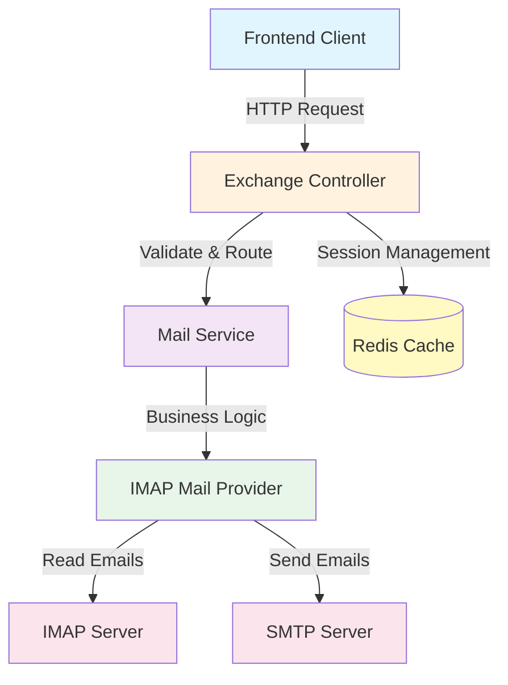
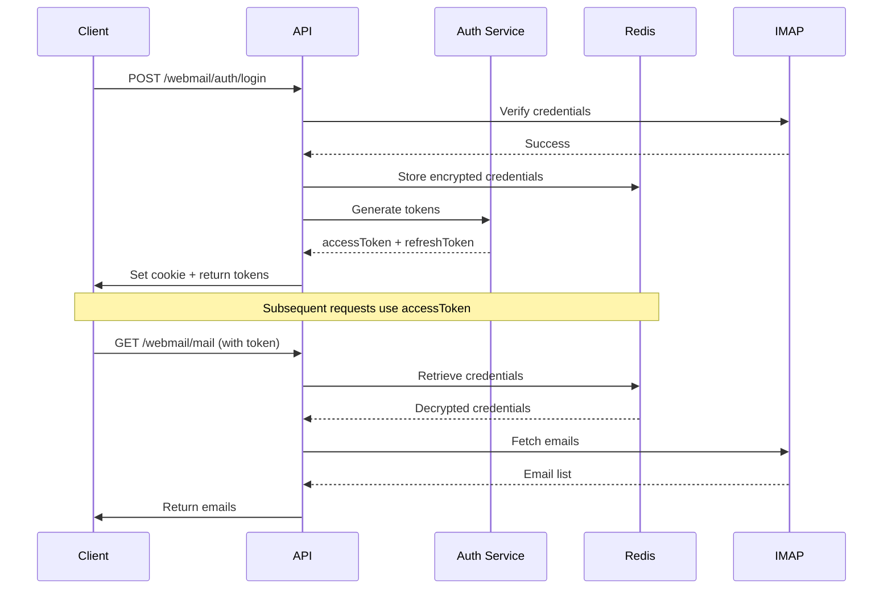

This file is a merged representation of the entire codebase, combined into a single document by Repomix.

# File Summary

## Purpose
This file contains a packed representation of the entire repository's contents.
It is designed to be easily consumable by AI systems for analysis, code review,
or other automated processes.

## File Format
The content is organized as follows:
1. This summary section
2. Repository information
3. Directory structure
4. Repository files (if enabled)
5. Multiple file entries, each consisting of:
  a. A header with the file path (## File: path/to/file)
  b. The full contents of the file in a code block

## Usage Guidelines
- This file should be treated as read-only. Any changes should be made to the
  original repository files, not this packed version.
- When processing this file, use the file path to distinguish
  between different files in the repository.
- Be aware that this file may contain sensitive information. Handle it with
  the same level of security as you would the original repository.

## Notes
- Some files may have been excluded based on .gitignore rules and Repomix's configuration
- Binary files are not included in this packed representation. Please refer to the Repository Structure section for a complete list of file paths, including binary files
- Files matching patterns in .gitignore are excluded
- Files matching default ignore patterns are excluded
- Files are sorted by Git change count (files with more changes are at the bottom)

# Directory Structure
```
.dockerignore
.env.example
.gitignore
.prettierrc
audit_log_implementation_notes.md
dockerfile
docs/BATCH_MAIL_APIS.md
docs/EXCHANGE_API_DOCUMENTATION.md
docs/PERMANENT_DELETE_MAIL_API.md
docs/PROJECT_IMPLEMENTED_FEATURES.md
docs/REQUIREMENTS_2_2_STATUS.md
eslint.config.mjs
mikro-orm.config.ts
MOVE_MAIL_API.md
nest-cli.json
package.json
src/app.controller.spec.ts
src/app.controller.ts
src/app.module.ts
src/app.service.ts
src/audit/audit-log.interceptor.ts
src/audit/audit.module.ts
src/audit/audit.service.ts
src/auth/auth.controller.ts
src/auth/auth.module.ts
src/auth/auth.service.ts
src/auth/decorators/current-user.decorator.ts
src/auth/dto/login.dto.ts
src/auth/dto/register.dto.ts
src/auth/dto/reset-password.dto.ts
src/auth/guards/exchange-auth.guard.ts
src/auth/guards/jwt-auth.guard.ts
src/auth/strategies/jwt.strategy.ts
src/common/cache/cache.module.ts
src/common/cache/dragonfly.service.ts
src/common/common.module.ts
src/common/context/request.context.ts
src/common/exceptions/invalid-query.exception.ts
src/common/interceptors/request-context.interceptor.ts
src/common/localization/vi.ts
src/common/permissions/permission.service.ts
src/config/auth.config.ts
src/config/database.config.ts
src/config/dragonfly.config.ts
src/config/ews.config.ts
src/config/query.config.ts
src/config/storage.config.ts
src/database/entities/audit-log.entity.ts
src/database/entities/file.entity.ts
src/database/entities/permission.entity.ts
src/database/entities/role.entity.ts
src/database/entities/user.entity.ts
src/database/migrations/.snapshot-postgres.json
src/database/migrations/Migration20260204095049.ts
src/database/migrations/Migration20260223120000.ts
src/dto/post/create-post.dto.ts
src/dto/post/update-post.dto.ts
src/exchange/constants/mail-folders.constant.ts
src/exchange/controllers/exchange.controller.ts
src/exchange/dto/exchange.dto.ts
src/exchange/exchange.module.ts
src/exchange/interceptors/exchange-error.interceptor.ts
src/exchange/interfaces/mail-provider.interface.ts
src/exchange/services/ews-mail.provider.ts
src/exchange/services/exchange-auth.service.ts
src/exchange/services/imap-mail.provider.ts
src/exchange/services/mail.service.ts
src/exchange/services/smtp-sender.service.ts
src/exchange/utils/json.helper.ts
src/files/dto/commit-file.dto.ts
src/files/dto/temp-upload-response.dto.ts
src/files/files.controller.ts
src/files/files.module.ts
src/files/files.scheduler.ts
src/files/files.service.ts
src/main.ts
src/meta/entity-registry.service.ts
src/meta/meta.module.ts
src/meta/metadata-reader.service.ts
src/storage/local-storage.adapter.ts
src/storage/storage.interface.ts
src/storage/storage.service.ts
storage/temp/01KFQ0PEXVFWHRZ9ZFDM75E8DZ
storage/temp/01KFQ1GENRTN714S1EQM13ZJJ1
storage/uploads/01KFQ3SQA8JEBXYGP6AZNJBNZ8
storage/uploads/f2efddd8-26e6-4ad8-89ae-eef6e40a33b8
test/app.e2e-spec.ts
test/jest-e2e.json
tsconfig.build.json
tsconfig.json
web_mail_server.tar
```

# Files

## File: .dockerignore
````
docs
*.md
````

## File: .prettierrc
````
{
  "singleQuote": true,
  "trailingComma": "all"
}
````

## File: audit_log_implementation_notes.md
````markdown
# Audit Log Implementation Notes and Justification

This document explains the rationale behind the approach chosen for integrating `AuditLogService` into the application, specifically addressing the interaction between singleton services and request-scoped contexts in NestJS.

## The Problem: Scope Mismatch between Singleton Service and Request-Scoped Context

When implementing the audit logging feature, the goal was to log user actions (`create`, `update`, `delete`) within the `ItemsService`. The `AuditLogService` requires information about the `User` performing the action. This user information is available in the `RequestContext` (managed by `RequestContextInterceptor`) and is `Scope.REQUEST`, meaning a new instance is created for each incoming HTTP request.

`ItemsService`, by default, is a **singleton** in NestJS. This means only one instance of `ItemsService` is created and reused throughout the application's lifecycle.

A fundamental rule in NestJS dependency injection is that a **singleton service cannot reliably inject a request-scoped provider.** If `ItemsService` were to directly inject `RequestContext`, NestJS would resolve `RequestContext` only once when `ItemsService` is first instantiated (e.g., at application startup). At that time, there is no active HTTP request, so the `RequestContext` would be empty or contain stale data. All subsequent requests processed by this singleton `ItemsService` would then operate with the same, incorrect `RequestContext` instance, leading to inaccurate audit logs (e.g., logging the wrong user or no user at all).

## Why Passing UserContext from the Controller is the Solution

The `ItemsController` (like all controllers) is inherently **request-scoped**. This means for every incoming HTTP request, a new instance of the controller (or at least its methods) is invoked, and it has direct access to the context of *that specific request*.

The solution implemented involves:

1.  **Extracting `UserContext` in the Controller:** The `@CurrentUser()` decorator is used in the `ItemsController`'s `create`, `update`, and `delete` methods to reliably extract the `UserContext` (which correctly originates from `request.user` populated by `JwtStrategy` and `RequestContextInterceptor`) for the current request.

2.  **Passing `UserContext` as a Method Argument to the Service:** The extracted `UserContext` is then explicitly passed as an argument to the corresponding `ItemsService` methods (`itemsService.create(user, collection, data)`).

This approach ensures:

*   **Scope Safety:** The singleton `ItemsService` does not directly inject a request-scoped `RequestContext`. Instead, it receives the *already resolved and request-specific* `UserContext` as a method parameter. This completely avoids the scope mismatch problem.
*   **Explicitness:** The method signatures of `ItemsService` (`async create(user: UserContext, collection: string, data: any)`) clearly indicate that these operations depend on user context. This improves code readability and maintainability.
*   **Testability:** `ItemsService` methods become easier to unit test, as `UserContext` can be directly mocked and passed as an argument, without needing to simulate the entire NestJS request lifecycle.
*   **Handling Anonymous/Public Actions:** If an endpoint does not require authentication (e.g., if `JwtAuthGuard` is not applied or the user is not logged in), the `@CurrentUser()` decorator will provide `null` (or an object indicating no user). This `null` can then be passed to the `AuditLogService`, allowing it to correctly log actions by anonymous users or simply ignore logging if no user is present.
*   **Preserving Singleton Benefits:** `ItemsService` remains a singleton, benefiting from better performance and resource utilization by avoiding re-instantiation for every request.

## Alternatives Considered (and why they were not chosen)

*   **Making `ItemsService` Request-Scoped:** While this would resolve the scope mismatch, it would mean `ItemsService` (and potentially other services that depend on it) would be instantiated for every request, which can have performance implications. It also complicates the overall service architecture by introducing more request-scoped components than necessary.
*   **Using `ModuleRef` to Dynamically Resolve `RequestContext`:** NestJS provides `ModuleRef` which can be used within a singleton service to dynamically resolve request-scoped providers. However, this adds more boilerplate code and complexity (`this.moduleRef.resolve(RequestContext, { strict: false })`) compared to the straightforward method parameter passing. For this specific use case, direct parameter passing is cleaner.

In conclusion, while `JwtStrategy` and `RequestContextInterceptor` correctly prepare the user context, the most robust and idiomatic way for a singleton service to access this request-specific information is to have it explicitly passed down from a request-scoped component like a controller.
````

## File: dockerfile
````dockerfile
# ----------------------------------------------------------------
# Stage 1: Base Image & Dependencies (deps)
# Cài đặt dependencies để tận dụng Docker layer caching
# ----------------------------------------------------------------
FROM node:22-alpine AS base
FROM base AS deps

# Cần libc6-compat cho một số package Node.js trên Alpine
RUN apk add --no-cache libc6-compat
WORKDIR /app

# Sao chép các file quản lý dependency
COPY package.json yarn.lock* package-lock.json* pnpm-lock.yaml* .npmrc* ./

# Cài đặt dependencies dựa trên lockfile được tìm thấy
RUN \
  if [ -f yarn.lock ]; then yarn --frozen-lockfile; \
  elif [ -f package-lock.json ]; then npm ci; \
  elif [ -f pnpm-lock.yaml ]; then corepack enable pnpm && pnpm i --frozen-lockfile; \
  else echo "Lockfile not found." && exit 1; \
  fi

# ----------------------------------------------------------------
# Stage 2: Builder
# Thực hiện quá trình build (tsc)
# ----------------------------------------------------------------
FROM base AS builder
WORKDIR /app

# Sao chép node_modules từ stage deps
COPY --from=deps /app/node_modules ./node_modules
# Sao chép source code
COPY . .

# Thực hiện build NestJS (chuyển TypeScript sang JavaScript)
# Lệnh 'build' thường được định nghĩa trong package.json
# Ví dụ: "build": "nest build"
RUN \
  if [ -f yarn.lock ]; then yarn run build; \
  elif [ -f package-lock.json ]; then npm run build; \
  elif [ -f pnpm-lock.yaml ]; then corepack enable pnpm && pnpm run build; \
  else echo "Build command not found." && exit 1; \
  fi

# ----------------------------------------------------------------
# Stage 3: Runner (Final Image)
# Image cuối cùng, nhỏ nhất, chỉ chứa code đã build và dependencies cần thiết
# ----------------------------------------------------------------
FROM base AS runner
WORKDIR /app

ENV NODE_ENV=production

# Tạo user và group không phải root để tăng cường bảo mật
# UID/GID tùy ý, miễn là không phải 0 (root)
RUN addgroup --system --gid 1001 nodejs
RUN adduser --system --uid 1001 nestjs

# Sao chép node_modules cần thiết cho môi trường production
# (Chỉ bao gồm production dependencies)
COPY --from=deps /app/node_modules ./node_modules

# Sao chép thư mục dist đã build từ stage builder (đầu ra của 'nest build')
COPY --from=builder --chown=nestjs:nodejs /app/dist ./dist
# Sao chép package.json (cần cho lệnh 'node dist/main')
COPY package.json .

# Chuyển sang user không phải root
USER nestjs

# Thiết lập cổng và export
EXPOSE 3001
ENV PORT=3001
ENV HOSTNAME="0.0.0.0"

# Chạy ứng dụng đã được build
# Giả định file khởi chạy là 'main.js' trong thư mục 'dist'
CMD ["node", "dist/main.js"]
````

## File: docs/BATCH_MAIL_APIS.md
````markdown
# Batch Mail APIs (Dev + QA Guide)

Tai lieu nhanh cho 2 API moi:
- `POST /webmail/mail/mark-as-read`
- `POST /webmail/mail/move-batch`

## 1. Preconditions

- Da login Exchange, co `accessToken` hop le.
- Header:
  - `Authorization: Bearer <ACCESS_TOKEN>`
  - `Content-Type: application/json`
- Co it nhat 1 email id de test (`id` dang base64 `folder:uid`, lay tu API list mail).

## 2. API: Mark As Read

### Endpoint

`POST /webmail/mail/mark-as-read`

### Mode A: Mark theo danh sach ids

```json
{
  "ids": ["SU5CT1g6MTIzNDU=", "SU5CT1g6MTIzNDY="],
  "isRead": true
}
```

### Mode B: Mark toan bo folder

```json
{
  "all": true,
  "folder": "inbox",
  "isRead": false
}
```

### Success response

```json
{
  "success": true
}
```

### Curl test

```bash
curl -X POST http://localhost:3000/webmail/mail/mark-as-read \
  -H "Authorization: Bearer YOUR_ACCESS_TOKEN" \
  -H "Content-Type: application/json" \
  -d '{
    "ids": ["SU5CT1g6MTIzNDU="],
    "isRead": true
  }'
```

## 3. API: Move Batch

### Endpoint

`POST /webmail/mail/move-batch`

### Mode A: Move theo danh sach ids

```json
{
  "ids": ["SU5CT1g6MTIzNDU=", "SU5CT1g6MTIzNDY="],
  "targetFolder": "trash"
}
```

### Mode B: Move toan bo email trong source folder

```json
{
  "all": true,
  "sourceFolder": "spam",
  "targetFolder": "inbox"
}
```

### Success response

```json
{
  "success": true
}
```

### Curl test

```bash
curl -X POST http://localhost:3000/webmail/mail/move-batch \
  -H "Authorization: Bearer YOUR_ACCESS_TOKEN" \
  -H "Content-Type: application/json" \
  -d '{
    "ids": ["SU5CT1g6MTIzNDU="],
    "targetFolder": "trash"
  }'
```

## 4. Folder Mapping

- `inbox` -> `INBOX`
- `sent` -> `Sent Items`
- `starred` -> `Starred`
- `drafts` -> `Drafts`
- `trash` -> `Trash`
- `spam` -> `Spam`

## 5. QA Checklist

- Mark 1 email as read -> list API tra ve `isRead = true`.
- Mark 1 email as unread -> list API tra ve `isRead = false`.
- Mark all inbox as read -> random sample trong inbox deu `isRead = true`.
- Move selected emails to trash -> khong con trong source folder, co trong trash.
- Move all spam to inbox -> spam giam, inbox tang.
- Goi API voi token het han -> tra `401`.
- Goi API voi payload thieu field bat buoc -> tra `400`.

## 6. Dev Notes

- Controller:
  - `src/exchange/controllers/exchange.controller.ts`
- DTO:
  - `src/exchange/dto/exchange.dto.ts` (`MarkReadDto`, `MoveBatchDto`)
- Service:
  - `src/exchange/services/mail.service.ts`
- Provider:
  - `src/exchange/services/imap-mail.provider.ts`
````

## File: docs/PERMANENT_DELETE_MAIL_API.md
````markdown
# Permanent Delete Mail API (Dev FE + QA Guide)

Tai lieu nhanh cho API xoa vinh vien email:
- `POST /webmail/mail/permanent-delete`

## 1. Preconditions

- Da login Exchange thanh cong.
- Co session hop le qua:
  - Cookie `exchange_session`, hoac
  - Header `Authorization: Bearer <accessToken>` (neu FE dang truyen token theo header).
- Header `Content-Type: application/json`.
- Co it nhat 1 email id de test (`id` dang base64 `folder:uid`, lay tu API list mail).

## 2. Endpoint

`POST /webmail/mail/permanent-delete`

## 3. Request Modes

Chi duoc gui dung 1 mode trong 3 mode sau.

### Mode A: Xoa 1 email cu the

```json
{
  "messageId": "SU5CT1g6MTIzNDU="
}
```

### Mode B: Xoa theo danh sach ids

```json
{
  "ids": ["SU5CT1g6MTIzNDU=", "SU5CT1g6MTIzNDY="]
}
```

Co the kem `sourceFolder` de backend validate tat ca ids thuoc cung folder:

```json
{
  "ids": ["U3BhbToxMDA=", "U3BhbToxMDE="],
  "sourceFolder": "spam"
}
```

### Mode C: Xoa toan bo email trong 1 folder

```json
{
  "all": true,
  "sourceFolder": "trash"
}
```

## 4. Success Response

```json
{
  "success": true,
  "deletedCount": 2
}
```

- `deletedCount`: so email da duoc xoa vinh vien.

## 5. Error Responses

### 400 Bad Request (payload khong hop le)

Vi du:
- Gui dong thoi `messageId` va `ids`.
- Gui `all: true` nhung thieu `sourceFolder`.
- Gui `ids` + `sourceFolder` nhung co id khong thuoc folder da khai bao.

Mau response:

```json
{
  "statusCode": 400,
  "message": "Payload khong hop le. Chon dung 1 mode: messageId, ids, hoac all + sourceFolder",
  "error": "Bad Request"
}
```

### 401 Unauthorized

- Session het han/khong hop le.
- Chua login.

## 6. Folder Mapping

- `inbox` -> `INBOX`
- `sent` -> `Sent Items`
- `starred` -> `Starred` (virtual folder)
- `drafts` -> `Drafts`
- `trash` -> `Trash`
- `spam` -> `Spam`

## 7. cURL Samples (QA)

### Xoa 1 email

```bash
curl -X POST http://localhost:3000/webmail/mail/permanent-delete \
  -H "Content-Type: application/json" \
  -H "Cookie: exchange_session=YOUR_SESSION_TOKEN" \
  -d '{
    "messageId": "SU5CT1g6MTIzNDU="
  }'
```

### Xoa nhieu email

```bash
curl -X POST http://localhost:3000/webmail/mail/permanent-delete \
  -H "Content-Type: application/json" \
  -H "Cookie: exchange_session=YOUR_SESSION_TOKEN" \
  -d '{
    "ids": ["U3BhbToxMDA=", "U3BhbToxMDE="],
    "sourceFolder": "spam"
  }'
```

### Xoa toan bo folder

```bash
curl -X POST http://localhost:3000/webmail/mail/permanent-delete \
  -H "Content-Type: application/json" \
  -H "Cookie: exchange_session=YOUR_SESSION_TOKEN" \
  -d '{
    "all": true,
    "sourceFolder": "trash"
  }'
```

## 8. FE Integration Notes

- API nay la hard-delete: email bi xoa khoi mailbox, khong move qua folder khac.
- Sau khi goi thanh cong, FE nen:
  - Reload danh sach mail folder hien tai.
  - Reload folder counts (`GET /webmail/folders/counts`).
  - Clear selected ids trong UI.
- Neu co trang chi tiet mail dang mo va mail vua xoa, dieu huong ve list page.

## 9. QA Checklist

- Xoa 1 email trong inbox -> email bien mat khoi list inbox, `deletedCount = 1`.
- Xoa nhieu email trong spam -> cac email do khong con trong spam, `deletedCount` dung so luong.
- Xoa toan bo trash -> list trash rong, `deletedCount` >= 0 dung voi so mail truoc do.
- Gui payload sai mode (vi du co ca `messageId` va `all`) -> tra `400`.
- Gui `all: true` nhung thieu `sourceFolder` -> tra `400`.
- Gui id khong thuoc `sourceFolder` khi co validate -> tra `400`.
- Dung session het han -> tra `401`.

## 10. Backend References

- Controller: `src/exchange/controllers/exchange.controller.ts`
- DTO: `src/exchange/dto/exchange.dto.ts` (`PermanentDeleteMailDto`)
- Service: `src/exchange/services/mail.service.ts` (`permanentDelete`)
- Provider: `src/exchange/services/imap-mail.provider.ts` (`permanentlyDeleteMessages`, `permanentlyDeleteAllMessages`)
````

## File: docs/PROJECT_IMPLEMENTED_FEATURES.md
````markdown
# Project Implemented Features

Cap nhat den: 2026-02-12

Tai lieu nay tong hop cac chuc nang da duoc trien khai trong du an `nestjs-base-be`.

## 1. Nen tang he thong

- Framework backend: NestJS.
- ORM: MikroORM voi PostgreSQL.
- Cache: Dragonfly/Redis (qua `DragonflyService`).
- Global request context interceptor da duoc ap dung.
- Global audit interceptor da duoc ap dung cho CUD requests.

## 2. Module Auth (`/auth`)

Chuc nang hien co:
- `GET /auth/me`
- Xac thuc bang JWT (`JwtAuthGuard`).
- Tra thong tin user hien tai tu database.

Ghi chu:
- Cac endpoint login/refresh/logout khong nam o module `auth`, ma nam trong module `exchange` voi prefix `/webmail/auth`.

## 3. Module Exchange Webmail (`/webmail`)

### 3.1 Exchange Authentication

- `POST /webmail/auth/login`
  - Dang nhap Exchange (email/password).
  - Tao `accessToken` + `refreshToken`.
  - Set cookie `exchange_session`.
  - Tu dong khoi tao mailbox folders neu chua co.
- `POST /webmail/auth/refresh`
  - Rotate refresh token.
  - Cap lai access token va cookie session.
- `POST /webmail/auth/logout`
  - Xoa session token va revoke refresh token.

### 3.2 Mailbox APIs

- `GET /webmail/folders`
  - Lay danh sach folder tieu chuan.
- `GET /webmail/folders/counts`
  - Lay tong so mail va so unread theo folder.
  - Co cache theo user/folder.
- `GET /webmail/mail?folder=&page=&pageSize=`
  - Lay danh sach mail co phan trang.
- `GET /webmail/mail/search?q=&page=`
  - Tim kiem mail.
- `GET /webmail/mail/:id`
  - Lay chi tiet 1 mail.

### 3.3 Mail Actions

- `POST /webmail/mail/send`
  - Gui email (to/cc/bcc/replyTo/attachments).
  - Append vao Sent Items.
- `POST /webmail/mail/move`
  - Move 1 email sang folder khac.
- `POST /webmail/mail/mark-as-read`
  - Danh dau read/unread theo ids hoac all trong folder.
- `POST /webmail/mail/move-batch`
  - Move hang loat theo ids hoac all trong source folder.
- `POST /webmail/mail/permanent-delete`
  - Xoa vinh vien theo 3 mode:
    - 1 message (`messageId`)
    - danh sach ids (`ids[]`)
    - toan bo mail trong folder (`all + sourceFolder`)

### 3.4 Bao mat va ky thuat trong Exchange

- Session credentials duoc ma hoa trong cache.
- Refresh token duoc hash va rotate.
- Folder alias mapping (`inbox/sent/drafts/spam/trash/starred`) da ho tro.
- Starred duoc xu ly theo flagged mails.
- Co interceptor chuan hoa loi Exchange API.

## 4. Module Files (`/files`, `/assets`)

### 4.1 Upload va quan ly file

- `POST /files/upload`
  - Upload file vao temp storage.
  - Validate mime type va max file size.
- `GET /files/temp/:id/preview`
  - Preview file temp (stream).
- `POST /files/commit`
  - Commit file tu temp sang permanent storage.
  - Cap nhat metadata (extraMetadata, originalName).
- `GET /files/:id`
  - Lay metadata file.
- `GET /assets/:id`
  - Stream file permanent (inline/download).

### 4.2 Storage

- Local storage adapter da trien khai:
  - Save temp
  - Move to permanent
  - Stream file
  - Delete file
  - Check exists
  - Get size

### 4.3 Scheduler

- Job cleanup temp files da trien khai.
- Chu ky: 5 ngay/lan (UTC midnight theo cron cau hinh hien tai).
- Xoa temp files cu hon 5 ngay va don record database.

## 5. Module Audit

- Audit log interceptor global cho cac request POST/PATCH/PUT/DELETE.
- Dev logs + user audit logs da phan tach.
- Mask sensitive fields trong logs (`password`, `token`, `refreshToken`, ...).
- Luu audit trail vao bang `audit_log`.
- Audit service ho tro truy van logs theo user, action, collection, time range.

## 6. Module Meta

- Da co `EntityRegistryService` va `MetadataReaderService` de ho tro metadata/entity registry cho he thong.

## 7. Database Entities da dung

- `User`
- `File`
- `AuditLog`

## 8. Tai lieu API da co trong repo

- `docs/EXCHANGE_API_DOCUMENTATION.md`
- `docs/BATCH_MAIL_APIS.md`
- `docs/PERMANENT_DELETE_MAIL_API.md`
````

## File: docs/REQUIREMENTS_2_2_STATUS.md
````markdown
# 2.2 Yêu cầu chức năng - đối chiếu với source code

Cập nhật: 2026-02-23
Phạm vi đối chiếu: source code hiện có trong repo `nestjs-base-be`.

Quy ước:
- `x`: Đã có trong source code.
- `~`: Mới có một phần, cần bổ sung thêm để đúng như yêu cầu.
- `` (trong cột Có): Chưa thấy trong source code hiện tại.

## I. Chức năng dành cho người dùng

| Stt | Nhóm chức năng/chức năng | Có | Trạng thái code | Ghi chú |
|---|---|---|---|---|
| 1 | Gửi/nhận thư điện tử (trong và ngoài cơ quan) | x | Đã có | Có API gửi mail (`POST /webmail/mail/send`) và API đọc/list mail (`GET /webmail/mail`, `GET /webmail/mail/:id`). |
| 2 | Gửi/nhận kèm tệp (file Word, Excel, ảnh, PDF...) | x | Đã có | `SendMailDto.attachments` + xử lý attachment trong SMTP/IMAP; có module file upload/stream. |
| 3 | Lưu thư nháp để gửi sau. | ~ | Một phần | Có folder `Drafts` để đọc/list; chưa thấy API tạo/lưu draft riêng trước khi gửi. |
| 4 | Chuyển tiếp hoặc trả lời thư | ~ | Một phần | Có API gửi mail tổng quát; có field `replyTo`; chưa có endpoint `reply/forward` chuyên biệt. |
| 5 | Đánh dấu thư quan trọng, lọc thư chưa đọc. | ~ | Một phần | Có folder `Starred` (flagged) và API mark read/unread; chưa có API bật/tắt `star` và query filter unread riêng. |
| 6 | Sắp xếp thư vào các thư mục riêng. | x | Đã có | Có API move 1 mail và move batch (`/webmail/mail/move`, `/webmail/mail/move-batch`). |
| 7 | Tìm kiếm và lọc thư | ~ | Một phần | Có API search (`/webmail/mail/search`); chưa có bộ filter đầy đủ theo nhiều điều kiện. |
| 8 | Tìm thư theo người gửi, tiêu đề, nội dung, ngày tháng. | ~ | Một phần | Search hiện tại theo `from/subject/body`; chưa thấy filter theo ngày tháng. |
| 9 | Lọc thư có file đính kèm hoặc theo trạng thái (đã đọc/chưa đọc/...) |  | Chưa có | API list trả về `hasAttachments`, `isRead` nhưng chưa có filter query theo các trạng thái này. |
| 10 | Hộp thư đến (Inbox) | x | Đã có | Có mapping folder `INBOX` và API list folder/mail. |
| 11 | Hộp thư đi (Outbox) |  | Chưa có | Chưa thấy folder/API outbox riêng. |
| 12 | Thư đã gửi (Sent Items) | x | Đã có | Có folder `Sent Items`; mail gửi xong được append vào Sent. |
| 13 | Thư nháp (Drafts) | ~ | Một phần | Có folder `Drafts` để truy xuất; chưa có luồng tạo draft riêng. |
| 14 | Thư đã xóa (Deleted Items) | x | Đã có | Có mapping `Trash` alias `Deleted Items`; có move vào trash và permanent delete. |
| 15 | Thư rác (Junk Email) | x | Đã có | Có mapping folder `Spam` alias `Junk Email`. |
| 16 | Nguồn tin RSS (RSS Feeds): Nhận tin tức tự động từ các trang web đăng ký. |  | Chưa có | Chưa thấy module/API RSS. |
| 17 | Lịch làm việc và nhắc việc |  | Chưa có | Chưa thấy module/API calendar/reminder. |
| 18 | Tạo lịch làm việc |  | Chưa có | Chưa thấy API tạo sự kiện lịch. |
| 19 | Hẹn giờ, đặt lời nhắc |  | Chưa có | Chưa thấy API reminder/alarm. |
| 20 | Lặp lại lịch theo ngày, tuần, tháng. |  | Chưa có | Chưa thấy recurrence rule cho lịch. |
| 21 | Quản lý danh bạ |  | Chưa có | Chưa thấy module/API contacts. |
| 22 | Tra cứu danh bạ |  | Chưa có | Chưa thấy API tìm kiếm danh bạ. |
| 23 | Ghi chú và sổ tay |  | Chưa có | Chưa thấy module/API notes. |
| 24 | Sử dụng trên máy tính, điện thoại, hoặc qua trình duyệt web. | ~ | Một phần | Backend REST API có thể dùng cho web/mobile; repo hiện tại không chứa client desktop/mobile/webmail UI đầy đủ. |
| 25 | Đồng bộ dữ liệu giữa các thiết bị. | ~ | Một phần | Dữ liệu mail đồng bộ theo Exchange/IMAP; chưa có cơ chế đồng bộ thiết bị riêng ở backend này. |

## II. Chức năng dành cho quản trị

### Quản lý tài khoản

| Stt | Nhóm chức năng/chức năng | Có | Trạng thái code | Ghi chú |
|---|---|---|---|---|
| 26 | Tạo tài khoản email | ~ | Một phần | Có tạo bản ghi `User` nội bộ khi login Exchange lần đầu; chưa có API/provisioning tạo mailbox email quản trị. |
| 27 | Xóa hoặc tạm khóa tài khoản |  | Chưa có | Chưa thấy API disable/delete account. |
| 28 | Quản lý hộp thư dùng chung cho nhóm hoặc phòng ban. |  | Chưa có | Chưa thấy shared mailbox management. |
| 29 | Cài đặt giới hạn dung lượng hộp thư. |  | Chưa có | Chưa thấy quota setting APIs. |

### Bảo mật và lọc thư

| Stt | Nhóm chức năng/chức năng | Có | Trạng thái code | Ghi chú |
|---|---|---|---|---|
| 30 | Ngăn thư rác (spam) và thư chứa mã độc | ~ | Một phần | Có folder Spam/Junk để xử lý ở mức mailbox; chưa thấy engine/rule lọc spam-malware tại backend này. |
| 31 | Đặt quy tắc để tự động xử lý hoặc chặn thư theo điều kiện. |  | Chưa có | Chưa thấy message rules/filter rules APIs. |

### Theo dõi và báo cáo

| Stt | Nhóm chức năng/chức năng | Có | Trạng thái code | Ghi chú |
|---|---|---|---|---|
| 32 | Xem thống kê số lượng thư gửi/nhận | ~ | Một phần | Có `GET /webmail/folders/counts` (total/unread theo folder); chưa có báo cáo gửi/nhận theo kỳ. |
| 33 | Xem lịch sử đăng nhập, gửi nhận | ~ | Một phần | Có audit interceptor ghi CUD vào DB; chưa thấy API UI quản trị để xem lịch sử đăng nhập/gửi-nhận đầy đủ. |
| 34 | Cảnh báo khi dung lượng hộp thư hoặc máy chủ sắp đầy |  | Chưa có | Chưa thấy cảnh báo quota/server capacity. |

### Sao lưu và phục hồi

| Stt | Nhóm chức năng/chức năng | Có | Trạng thái code | Ghi chú |
|---|---|---|---|---|
| 35 | Sao lưu toàn bộ dữ liệu email. |  | Chưa có | Chưa thấy backup service/API. |
| 36 | Khôi phục từng thư hoặc cả hộp thư khi cần. |  | Chưa có | Chưa thấy restore mail/mailbox APIs. |

## Bằng chứng source code chính

- Mail APIs: `src/exchange/controllers/exchange.controller.ts`
- Mail business logic: `src/exchange/services/mail.service.ts`
- IMAP/SMTP provider: `src/exchange/services/imap-mail.provider.ts`
- Folder mapping (Inbox/Sent/Drafts/Spam/Trash/Starred): `src/exchange/constants/mail-folders.constant.ts`
- Exchange auth + khởi tạo folder mailbox: `src/exchange/services/exchange-auth.service.ts`
- Audit interceptor/service: `src/audit/audit-log.interceptor.ts`, `src/audit/audit.service.ts`
- File upload/asset APIs: `src/files/files.controller.ts`, `src/files/files.service.ts`
````

## File: eslint.config.mjs
````javascript
// @ts-check
import eslint from '@eslint/js';
import eslintPluginPrettierRecommended from 'eslint-plugin-prettier/recommended';
import globals from 'globals';
import tseslint from 'typescript-eslint';

export default tseslint.config(
  {
    ignores: ['eslint.config.mjs'],
  },
  eslint.configs.recommended,
  ...tseslint.configs.recommendedTypeChecked,
  eslintPluginPrettierRecommended,
  {
    languageOptions: {
      globals: {
        ...globals.node,
        ...globals.jest,
      },
      sourceType: 'commonjs',
      parserOptions: {
        projectService: true,
        tsconfigRootDir: import.meta.dirname,
      },
    },
  },
  {
    rules: {
      '@typescript-eslint/no-explicit-any': 'off',
      '@typescript-eslint/no-floating-promises': 'warn',
      '@typescript-eslint/no-unsafe-argument': 'warn',
      "prettier/prettier": ["error", { endOfLine: "auto" }],
    },
  },
);
````

## File: nest-cli.json
````json
{
  "$schema": "https://json.schemastore.org/nest-cli",
  "collection": "@nestjs/schematics",
  "sourceRoot": "src",
  "compilerOptions": {
    "deleteOutDir": true
  }
}
````

## File: src/app.controller.spec.ts
````typescript
import { Test, TestingModule } from '@nestjs/testing';
import { AppController } from './app.controller';
import { AppService } from './app.service';

describe('AppController', () => {
  let appController: AppController;

  beforeEach(async () => {
    const app: TestingModule = await Test.createTestingModule({
      controllers: [AppController],
      providers: [AppService],
    }).compile();

    appController = app.get<AppController>(AppController);
  });

  describe('root', () => {
    it('should return "Hello World!"', () => {
      expect(appController.getHello()).toBe('Hello World!');
    });
  });
});
````

## File: src/app.controller.ts
````typescript
import { Controller, Get } from '@nestjs/common';
import { AppService } from './app.service';

@Controller()
export class AppController {
  constructor(private readonly appService: AppService) {}

  @Get()
  getHello(): string {
    return this.appService.getHello();
  }
}
````

## File: src/app.service.ts
````typescript
import { Injectable } from '@nestjs/common';

@Injectable()
export class AppService {
  getHello(): string {
    return 'Hello World!';
  }
}
````

## File: src/audit/audit.module.ts
````typescript
import { Module } from '@nestjs/common';
import { MikroOrmModule } from '@mikro-orm/nestjs';
import { APP_INTERCEPTOR } from '@nestjs/core';
import { AuditLog } from '../database/entities/audit-log.entity';
import { AuditLogService } from './audit.service';
import { AuditLogInterceptor } from './audit-log.interceptor';
import { CommonModule } from '../common/common.module';

@Module({
  imports: [
    MikroOrmModule.forFeature([AuditLog]),
    CommonModule,
  ],
  providers: [
    AuditLogService,
    {
      provide: APP_INTERCEPTOR,
      useClass: AuditLogInterceptor,
    },
  ],
  exports: [AuditLogService],
})
export class AuditLogModule {}
````

## File: src/auth/decorators/current-user.decorator.ts
````typescript
import { createParamDecorator, ExecutionContext } from '@nestjs/common';

export const CurrentUser = createParamDecorator(
  (data: unknown, ctx: ExecutionContext) => {
    const request = ctx.switchToHttp().getRequest();
    return request.user;
  },
);
````

## File: src/auth/dto/register.dto.ts
````typescript
import { IsEmail, IsOptional, IsString, MinLength } from 'class-validator';
import { ApiProperty } from '@nestjs/swagger';

export class RegisterDto {
  @ApiProperty({ example: 'user@example.com' })
  @IsEmail()
  email!: string;

  @ApiProperty({ example: 'P@ssw0rd123' })
  @IsString()
  @MinLength(6)
  password!: string;

  @ApiProperty({ example: 'Nguyen Van A', required: false })
  @IsString()
  @IsOptional()
  name?: string;
}
````

## File: src/auth/dto/reset-password.dto.ts
````typescript
import { IsString, MinLength } from 'class-validator';

export class ResetPasswordDto {
  @IsString()
  token!: string;

  @IsString()
  @MinLength(6)
  newPassword!: string;
}
````

## File: src/common/cache/cache.module.ts
````typescript
import { Module, Global } from '@nestjs/common';
import { ConfigModule } from '@nestjs/config';
import dragonflyConfig from '../../config/dragonfly.config';
import { DragonflyService } from './dragonfly.service';

@Global()
@Module({
  imports: [ConfigModule.forFeature(dragonflyConfig)],
  providers: [DragonflyService],
  exports: [DragonflyService],
})
export class CacheModule {}
````

## File: src/common/exceptions/invalid-query.exception.ts
````typescript
import { BadRequestException } from '@nestjs/common';

export class InvalidQueryException extends BadRequestException {
  constructor(message: string) {
    super(message);
  }
}
````

## File: src/common/interceptors/request-context.interceptor.ts
````typescript
import {
  Injectable,
  NestInterceptor,
  ExecutionContext,
  CallHandler,
  Scope,
  Inject,
} from '@nestjs/common';
import { Observable } from 'rxjs';
import { RequestContext } from '../context/request.context';

@Injectable({ scope: Scope.REQUEST })
export class RequestContextInterceptor implements NestInterceptor {
  constructor(@Inject(RequestContext) private readonly requestContext: RequestContext) {
    console.log('🏗️ RequestContextInterceptor created, requestContext:', !!this.requestContext);
  }

  intercept(context: ExecutionContext, next: CallHandler): Observable<any> {
    const request = context.switchToHttp().getRequest();
    
    // ✅ Sau khi JwtStrategy validate, gắn user từ request.user vào RequestContext
    if (request.user) {
      this.requestContext.user = request.user;
    }

    return next.handle();
  }
}
````

## File: src/common/localization/vi.ts
````typescript
export const collectionTranslations: Record<string, string> = {
  posts: 'Bài viết',
  users: 'Người dùng',
  comments: 'Bình luận',
  roles: 'Vai trò',
  permissions: 'Quyền',
  files: 'Tệp tin',
  reports: 'Báo cáo',
  items: 'Dữ liệu',
};

export const actionTranslations: Record<string, string> = {
  read: 'Xem',
  create: 'Tạo mới',
  update: 'Cập nhật',
  delete: 'Xóa',
  publish: 'Xuất bản',
  generate: 'Tạo',
  export_pdf: 'Xuất file PDF',
  view_sales: 'Xem doanh số',
  manage_users: 'Quản lý người dùng',
};
````

## File: src/config/dragonfly.config.ts
````typescript
import { registerAs } from '@nestjs/config';

export default registerAs('dragonfly', () => ({
  enabled: process.env.DRAGONFLY_ENABLED === 'true' || false,
  host: process.env.DRAGONFLY_HOST || 'localhost',
  port: parseInt(process.env.DRAGONFLY_PORT || '6379', 10),
  password: process.env.DRAGONFLY_PASSWORD || '',
  ttl: parseInt(process.env.DRAGONFLY_TTL || '300', 10), // Default 5 minutes
}));
````

## File: src/config/ews.config.ts
````typescript
import { registerAs } from '@nestjs/config';

export default registerAs('ews', () => ({
  url: process.env.EWS_URL || '',
  tokenUrl: process.env.EWS_TOKEN_URL || '',
  clientId: process.env.EWS_CLIENT_ID || '',
  clientSecret: process.env.EWS_CLIENT_SECRET || '',
  scope: process.env.EWS_SCOPE || '',
  resource: process.env.EWS_RESOURCE || '',
  version: process.env.EWS_VERSION || 'Exchange2016',
  impersonate: process.env.EWS_IMPERSONATE === 'true',
  validateOnLogin: process.env.EWS_VALIDATE_ON_LOGIN === 'true',
  ssoEnabled: process.env.EWS_SSO_ENABLED !== 'false',
  tlsRejectUnauthorized: process.env.EWS_TLS_REJECT_UNAUTHORIZED !== 'false',
}));
````

## File: src/config/query.config.ts
````typescript
import { registerAs } from '@nestjs/config';

export default registerAs('query', () => ({
  maxDepth: parseInt(process.env.QUERY_MAX_DEPTH || '3', 10),
  maxConditions: parseInt(process.env.QUERY_MAX_CONDITIONS || '20', 10),
  maxSortFields: parseInt(process.env.QUERY_MAX_SORT_FIELDS || '3', 10),
  allowRegex: process.env.QUERY_ALLOW_REGEX === 'true',
}));
````

## File: src/config/storage.config.ts
````typescript
import { registerAs } from '@nestjs/config';

export default registerAs('storage', () => ({
  driver: process.env.STORAGE_DRIVER || 'local',
  path: process.env.FILE_STORAGE_PATH || './storage',
}));
````

## File: src/database/entities/audit-log.entity.ts
````typescript
import { Entity, PrimaryKey, Property, ManyToOne, Index } from '@mikro-orm/core';
import { User } from './user.entity';

@Entity({ tableName: 'audit_logs' })
@Index({ properties: ['collection', 'targetId'] })
export class AuditLog {
  @PrimaryKey({ type: 'bigint' })
  id!: string;

  @ManyToOne(() => User, { nullable: true, index: 'audit_log_user_id_index' })
  user?: User;

  @Property({ length: 100, index: 'audit_log_collection_index' })
  collection!: string;

  @Property({ length: 50 })
  action!: string;

  @Property({ length: 255, index: 'audit_log_target_id_index' })
  targetId!: string;

  @Property({ type: 'json', nullable: true })
  details?: Record<string, any>;

  @Property({ onCreate: () => new Date() })
  timestamp = new Date();
}
````

## File: src/database/entities/file.entity.ts
````typescript
import {
  Entity,
  PrimaryKey,
  Property,
  Enum,
  Index,
} from '@mikro-orm/core';

/**
 * File status enum for tracking lifecycle
 * TEMP - Temporary upload, not yet committed
 * ACTIVE - Committed and available
 * DELETED - Soft-deleted (for cleanup)
 */
export enum FileStatus {
  TEMP = 'TEMP',
  ACTIVE = 'ACTIVE',
  DELETED = 'DELETED',
}

/**
 * File entity for managing uploaded files
 * Uses ULID as primary key for globally unique, sortable IDs
 */
@Entity({ tableName: 'files'})
export class File {
  /**
   * Primary key using PostgreSQL UUID
   * Auto-generated by database using gen_random_uuid()
   */
  @PrimaryKey({ type: 'uuid', defaultRaw: 'gen_random_uuid()' })
  id!: string;

  /**
   * Original filename from user upload
   */
  @Property()
  originalName!: string;

  /**
   * Stored filename on filesystem (typically same as ID)
   */
  @Property()
  storedName!: string;

  /**
   * MIME type of the file (e.g., 'image/jpeg', 'application/pdf')
   */
  @Property()
  mimeType!: string;

  /**
   * File size in bytes
   * Using bigint to support large files (though enforced max is 100MB)
   */
  @Property({ type: 'bigint' })
  size!: bigint;

  /**
   * Relative storage path from storage root
   * e.g., 'temp/{id}' or 'uploads/{id}'
   */
  @Property()
  storagePath!: string;

  /**
   * File lifecycle status
   * Indexed for efficient cleanup queries
   */
  @Enum(() => FileStatus)
  @Index()
  status: FileStatus = FileStatus.TEMP;

  /**
   * Optional custom metadata as JSON
   * Can store user-provided tags, descriptions, etc.
   */
  @Property({ type: 'jsonb', nullable: true })
  customMetadata?: Record<string, any>;

  /**
   * Timestamp when file was created
   */
  @Property()
  createdAt: Date = new Date();

  /**
   * Timestamp when file was last updated
   */
  @Property({ onUpdate: () => new Date() })
  updatedAt: Date = new Date();
}
````

## File: src/database/migrations/Migration20260204095049.ts
````typescript
import { Migration } from '@mikro-orm/migrations';

export class Migration20260204095049 extends Migration {

  override async up(): Promise<void> {
    this.addSql(`alter table "roles_permissions" drop constraint "roles_permissions_permission_id_foreign";`);

    this.addSql(`alter table "roles_permissions" drop constraint "roles_permissions_role_id_foreign";`);

    this.addSql(`create table "users" ("id" varchar(255) not null, "email" varchar(255) not null, "is_active" boolean not null default true, "mailbox_initialized" boolean not null default false, "created_at" timestamptz not null, "updated_at" timestamptz not null, constraint "users_pkey" primary key ("id"));`);
    this.addSql(`alter table "users" add constraint "users_email_unique" unique ("email");`);

    this.addSql(`create table "audit_logs" ("id" bigserial primary key, "user_id" varchar(255) null, "collection" varchar(100) not null, "action" varchar(50) not null, "target_id" varchar(255) not null, "details" jsonb null, "timestamp" timestamptz not null);`);
    this.addSql(`create index "audit_log_user_id_index" on "audit_logs" ("user_id");`);
    this.addSql(`create index "audit_log_collection_index" on "audit_logs" ("collection");`);
    this.addSql(`create index "audit_log_target_id_index" on "audit_logs" ("target_id");`);
    this.addSql(`create index "audit_logs_collection_target_id_index" on "audit_logs" ("collection", "target_id");`);

    this.addSql(`alter table "audit_logs" add constraint "audit_logs_user_id_foreign" foreign key ("user_id") references "users" ("id") on update cascade on delete set null;`);

    this.addSql(`drop table if exists "permissions" cascade;`);

    this.addSql(`drop table if exists "roles" cascade;`);

    this.addSql(`drop table if exists "roles_permissions" cascade;`);

    this.addSql(`alter table "files" alter column "id" drop default;`);
    this.addSql(`alter table "files" alter column "id" type uuid using ("id"::text::uuid);`);
    this.addSql(`alter table "files" alter column "id" set default gen_random_uuid();`);
  }

  override async down(): Promise<void> {
    this.addSql(`alter table "audit_logs" drop constraint "audit_logs_user_id_foreign";`);

    this.addSql(`create table "permissions" ("id" serial primary key, "collection" varchar(255) not null, "action" varchar(255) not null, "description" varchar(255) null);`);
    this.addSql(`create index "permissions_collection_action_index" on "permissions" ("collection", "action");`);

    this.addSql(`create table "roles" ("id" serial primary key, "name" varchar(255) not null, "description" varchar(255) null);`);
    this.addSql(`alter table "roles" add constraint "roles_name_unique" unique ("name");`);

    this.addSql(`create table "roles_permissions" ("role_id" int4 not null, "permission_id" int4 not null, constraint "roles_permissions_pkey" primary key ("role_id", "permission_id"));`);

    this.addSql(`alter table "roles_permissions" add constraint "roles_permissions_permission_id_foreign" foreign key ("permission_id") references "permissions" ("id") on update cascade on delete cascade;`);
    this.addSql(`alter table "roles_permissions" add constraint "roles_permissions_role_id_foreign" foreign key ("role_id") references "roles" ("id") on update cascade on delete cascade;`);

    this.addSql(`drop table if exists "users" cascade;`);

    this.addSql(`drop table if exists "audit_logs" cascade;`);

    this.addSql(`alter table "files" alter column "id" drop default;`);
    this.addSql(`alter table "files" alter column "id" drop default;`);
    this.addSql(`alter table "files" alter column "id" type uuid using ("id"::text::uuid);`);
  }

}
````

## File: src/database/migrations/Migration20260223120000.ts
````typescript
import { Migration } from '@mikro-orm/migrations';

export class Migration20260223120000 extends Migration {
  override async up(): Promise<void> {
    this.addSql(
      `create table "roles" ("id" serial primary key, "name" varchar(255) not null, "description" varchar(255) null);`,
    );
    this.addSql(
      `alter table "roles" add constraint "roles_name_unique" unique ("name");`,
    );

    this.addSql(
      `create table "permissions" ("id" serial primary key, "collection" varchar(255) not null, "action" varchar(255) not null, "description" varchar(255) null);`,
    );
    this.addSql(
      `create index "permissions_collection_action_index" on "permissions" ("collection", "action");`,
    );

    this.addSql(
      `create table "roles_permissions" ("role_id" int4 not null, "permission_id" int4 not null, constraint "roles_permissions_pkey" primary key ("role_id", "permission_id"));`,
    );
    this.addSql(
      `alter table "roles_permissions" add constraint "roles_permissions_role_id_foreign" foreign key ("role_id") references "roles" ("id") on update cascade on delete cascade;`,
    );
    this.addSql(
      `alter table "roles_permissions" add constraint "roles_permissions_permission_id_foreign" foreign key ("permission_id") references "permissions" ("id") on update cascade on delete cascade;`,
    );

    this.addSql(
      `create table "user_roles" ("user_id" varchar(255) not null, "role_id" int4 not null, constraint "user_roles_pkey" primary key ("user_id", "role_id"));`,
    );
    this.addSql(
      `alter table "user_roles" add constraint "user_roles_user_id_foreign" foreign key ("user_id") references "users" ("id") on update cascade on delete cascade;`,
    );
    this.addSql(
      `alter table "user_roles" add constraint "user_roles_role_id_foreign" foreign key ("role_id") references "roles" ("id") on update cascade on delete cascade;`,
    );

    this.addSql(`alter table "users" add column "name" varchar(255) null;`);
    this.addSql(`alter table "users" add column "password" varchar(255) null;`);
  }

  override async down(): Promise<void> {
    this.addSql(`alter table "user_roles" drop constraint "user_roles_role_id_foreign";`);
    this.addSql(`alter table "user_roles" drop constraint "user_roles_user_id_foreign";`);
    this.addSql(`alter table "roles_permissions" drop constraint "roles_permissions_permission_id_foreign";`);
    this.addSql(`alter table "roles_permissions" drop constraint "roles_permissions_role_id_foreign";`);

    this.addSql(`drop table if exists "user_roles" cascade;`);
    this.addSql(`drop table if exists "roles_permissions" cascade;`);
    this.addSql(`drop table if exists "permissions" cascade;`);
    this.addSql(`drop table if exists "roles" cascade;`);

    this.addSql(`alter table "users" drop column "name";`);
    this.addSql(`alter table "users" drop column "password";`);
  }
}
````

## File: src/dto/post/create-post.dto.ts
````typescript
import { IsString, IsNotEmpty, IsOptional, IsNumber, IsDefined } from 'class-validator';

export class CreatePostDto {
  @IsDefined({message: "Tiêu đề không được để trống"})
  @IsNotEmpty({ message: 'Tiêu đề không được để trống' })
  @IsString({message: "Tiêu đề phải là chuỗi"})
  title: string;
  
  @IsString({message: "Nội dung phải là chuỗi"})
  @IsOptional()
  content?: string;

  @IsNotEmpty({message: "Tác giả không được để trống"})
  author: number;
}
````

## File: src/dto/post/update-post.dto.ts
````typescript
import { PartialType } from '@nestjs/mapped-types';
import { CreatePostDto } from './create-post.dto';

export class UpdatePostDto extends PartialType(CreatePostDto) {}
````

## File: src/exchange/constants/mail-folders.constant.ts
````typescript
export type MailFolderType =
  | 'inbox'
  | 'sent'
  | 'starred'
  | 'drafts'
  | 'spam'
  | 'trash';

export type MailFolderDefinition = {
  id: string;
  type: MailFolderType;
  name: string;
  aliases: string[];
};

export const MAIL_FOLDERS: MailFolderDefinition[] = [
  {
    id: 'INBOX',
    type: 'inbox',
    name: 'Hộp thư đến',
    aliases: ['INBOX'],
  },
  {
    id: 'Sent Items',
    type: 'sent',
    name: 'Đã gửi',
    aliases: ['Sent Items', 'Sent'],
  },
  {
    id: 'Starred',
    type: 'starred',
    name: 'Có gắn dấu sao',
    aliases: ['Starred'],
  },
  {
    id: 'Drafts',
    type: 'drafts',
    name: 'Thư nháp',
    aliases: ['Drafts'],
  },
  {
    id: 'Spam',
    type: 'spam',
    name: 'Thư rác',
    aliases: ['Spam', 'Junk Email'],
  },
  {
    id: 'Trash',
    type: 'trash',
    name: 'Thùng rác',
    aliases: ['Trash', 'Deleted Items'],
  },
];

export const DEFAULT_FOLDER_ID = 'INBOX';

function normalize(input: string): string {
  return input.trim().toLowerCase();
}

export function resolveFolderId(input: string, fallback = DEFAULT_FOLDER_ID): string {
  const normalized = normalize(input);

  for (const folder of MAIL_FOLDERS) {
    if (
      normalize(folder.id) === normalized ||
      normalize(folder.type) === normalized ||
      folder.aliases.some((alias) => normalize(alias) === normalized)
    ) {
      return folder.id;
    }
  }

  return fallback;
}

export function resolveFolderType(input: string): string {
  const normalized = normalize(input);

  for (const folder of MAIL_FOLDERS) {
    if (
      normalize(folder.id) === normalized ||
      normalize(folder.type) === normalized ||
      folder.aliases.some((alias) => normalize(alias) === normalized)
    ) {
      return folder.type;
    }
  }

  return normalized.replace(/\s+/g, '_');
}

export function getFolderAliases(input: string): string[] {
  const folderId = resolveFolderId(input, input);
  const folder = MAIL_FOLDERS.find((item) => item.id === folderId);
  if (!folder) return [input];
  return Array.from(new Set([folder.id, ...folder.aliases]));
}
````

## File: src/exchange/utils/json.helper.ts
````typescript
/**
 * Safely stringify objects that may contain BigInt values
 * @param obj - The object to stringify
 * @returns JSON string with BigInt values converted to strings
 */
export function safeStringify(obj: any): string {
  return JSON.stringify(obj, (_, value) =>
    typeof value === 'bigint' ? value.toString() : value,
  );
}
````

## File: src/files/files.module.ts
````typescript
import { Module } from '@nestjs/common';
import { MikroOrmModule } from '@mikro-orm/nestjs';
import { ScheduleModule } from '@nestjs/schedule';
import { File } from '../database/entities/file.entity';
import { FilesController, AssetsController } from './files.controller';
import { FilesService } from './files.service';
import { FilesScheduler } from './files.scheduler';
import { StorageService } from '../storage/storage.service';
import { LocalStorageAdapter } from '../storage/local-storage.adapter';

@Module({
  imports: [MikroOrmModule.forFeature([File]), ScheduleModule.forRoot()],
  controllers: [FilesController, AssetsController],
  providers: [FilesService, FilesScheduler, StorageService, LocalStorageAdapter],
  exports: [FilesService],
})
export class FilesModule {}
````

## File: src/files/files.scheduler.ts
````typescript
import { Injectable, Logger } from '@nestjs/common';
import { Cron, CronExpression } from '@nestjs/schedule';
import { FilesService } from './files.service';

/**
 * Scheduled task for cleanup of old temporary files
 * Runs every 5 days
 */
@Injectable()
export class FilesScheduler {
  private readonly logger = new Logger(FilesScheduler.name);

  constructor(private readonly filesService: FilesService) {}

  /**
   * Delete temp files older than 5 days
   * Runs every 5 days at midnight
   */
  @Cron('0 0 */5 * *', {
    name: 'cleanup-temp-files',
    timeZone: 'UTC',
  })
  async handleTempFileCleanup() {
    this.logger.log('Starting temp file cleanup task');

    const fiveDaysAgo = new Date();
    fiveDaysAgo.setDate(fiveDaysAgo.getDate() - 5);

    try {
      const deletedCount =
        await this.filesService.cleanupTempFiles(fiveDaysAgo);
      this.logger.log(`Deleted ${deletedCount} old temp files`);
    } catch (error) {
      this.logger.error('Error during temp file cleanup:', error);
    }
  }
}
````

## File: src/files/files.service.ts
````typescript
import {
  Injectable,
  NotFoundException,
  BadRequestException,
} from '@nestjs/common';
import { InjectRepository } from '@mikro-orm/nestjs';
import { EntityRepository } from '@mikro-orm/postgresql';
import { File, FileStatus } from '../database/entities/file.entity';
import { StorageService } from '../storage/storage.service';
import { ConfigService } from '@nestjs/config';
import { TempUploadResponseDto } from './dto/temp-upload-response.dto';
import { ReadStream } from 'fs';

@Injectable()
export class FilesService {
  private readonly maxFileSize: number;
  private readonly allowedMimeTypes: string[];

  constructor(
    @InjectRepository(File)
    private readonly fileRepository: EntityRepository<File>,
    private readonly storageService: StorageService,
    private readonly configService: ConfigService,
  ) {
    // Default 100MB = 104857600 bytes
    this.maxFileSize =
      this.configService.get<number>('FILE_MAX_SIZE') || 104857600;

    const allowedTypes = this.configService.get<string>('FILE_ALLOWED_TYPES');
    this.allowedMimeTypes = allowedTypes
      ? allowedTypes.split(',')
      : [
          'image/jpeg',
          'image/png',
          'image/gif',
          'application/pdf',
          'text/plain',
        ];
  }

  /**
   * Upload file to temporary storage
   * Creates temp database record for tracking
   */
  async uploadTemp(file: Express.Multer.File): Promise<TempUploadResponseDto> {
    // Validate file size
    if (file.size > this.maxFileSize) {
      throw new BadRequestException(
        `File size exceeds maximum allowed size of ${this.maxFileSize} bytes`,
      );
    }

    // Validate MIME type
    if (!this.allowedMimeTypes.includes(file.mimetype)) {
      throw new BadRequestException(
        `File type ${file.mimetype} is not allowed. Allowed types: ${this.allowedMimeTypes.join(', ')}`,
      );
    }

    // Create temp database record (id will be auto-generated by database)
    const tempFile = this.fileRepository.create({
      originalName: file.originalname,
      storedName: '', // Will be updated after we get the id
      mimeType: file.mimetype,
      size: BigInt(file.size),
      storagePath: '', // Will be updated after we get the id
      status: FileStatus.TEMP,
      customMetadata: null,
      createdAt: new Date(),
      updatedAt: new Date(),
    });

    await this.fileRepository.getEntityManager().persistAndFlush(tempFile);

    // Now we have the auto-generated id, save file to storage
    const storageResult = await this.storageService.saveTemp(file, tempFile.id);

    // Update the record with storage info
    tempFile.storedName = storageResult.storedName;
    tempFile.storagePath = storageResult.storagePath;
    await this.fileRepository.getEntityManager().flush();

    return new TempUploadResponseDto({
      id: tempFile.id,
      originalName: file.originalname,
      mimeType: file.mimetype,
      size: file.size,
      previewUrl: `/files/temp/${tempFile.id}/preview`,
    });
  }

  /**
   * Commit file from temp to permanent storage
   * Updates database record status
   */
  async commitFile(
    id: string,
    extraMetadata?: Record<string, any>,
    originalName?: string,
  ): Promise<File> {
    // Find existing temp file
    const tempFile = await this.fileRepository.findOne({ 
      id,
      status: FileStatus.TEMP 
    });
    
    if (!tempFile) {
      throw new NotFoundException('Temporary file not found or already committed');
    }

    const tempPath = `temp/${id}`;
    const permanentPath = `uploads/${id}`;

    // Verify temp file exists in storage
    const exists = await this.storageService.exists(tempPath);
    if (!exists) {
      throw new NotFoundException('Temporary file not found in storage');
    }

    // Move to permanent storage
    await this.storageService.moveToPermanent(tempPath, permanentPath);

    // Update record to active status
    tempFile.storagePath = permanentPath;
    tempFile.status = FileStatus.ACTIVE;
    if (originalName) {
      tempFile.originalName = originalName;
    }
    tempFile.customMetadata = extraMetadata || tempFile.customMetadata;
    tempFile.updatedAt = new Date();

    await this.fileRepository.getEntityManager().persistAndFlush(tempFile);

    return tempFile;
  }

  /**
   * Get file metadata from database
   */
  async getMetadata(id: string): Promise<File> {
    const file = await this.fileRepository.findOne({ id });
    if (!file) {
      throw new NotFoundException('File not found');
    }
    return file;
  }

  /**
   * Get file stream for downloading/previewing
   */
  async getFileStream(id: string): Promise<{ file: File; stream: ReadStream }> {
    const file = await this.getMetadata(id);

    const stream = await this.storageService.getStream(file.storagePath);

    return { file, stream };
  }

  /**
   * Get temp file stream for preview
   */
  async getTempFileStream(id: string): Promise<ReadStream> {
    const tempPath = `temp/${id}`;

    const exists = await this.storageService.exists(tempPath);
    if (!exists) {
      throw new NotFoundException('Temporary file not found');
    }

    return this.storageService.getStream(tempPath);
  }

  /**
   * Cleanup old temporary files
   * Called by scheduled task
   */
  async cleanupTempFiles(olderThan: Date): Promise<number> {
    // Find temp files older than threshold
    const oldTempFiles = await this.fileRepository.find({
      status: FileStatus.TEMP,
      createdAt: { $lt: olderThan },
    });

    let deletedCount = 0;

    for (const file of oldTempFiles) {
      try {
        // Delete from storage
        await this.storageService.delete(file.storagePath);

        // Delete from database
        await this.fileRepository.getEntityManager().removeAndFlush(file);

        deletedCount++;
      } catch (error) {
        console.error(`Failed to delete temp file ${file.id}:`, error);
      }
    }

    return deletedCount;
  }
}
````

## File: src/meta/meta.module.ts
````typescript
import { Module, Global } from '@nestjs/common';
import { MikroOrmModule } from '@mikro-orm/nestjs';
import { EntityRegistryService } from './entity-registry.service';
import { MetadataReaderService } from './metadata-reader.service';

@Global()
@Module({
  imports: [MikroOrmModule.forFeature([])], // No specific entities here, just need provider access
  providers: [EntityRegistryService, MetadataReaderService],
  exports: [EntityRegistryService, MetadataReaderService],
})
export class MetaModule {}
````

## File: src/meta/metadata-reader.service.ts
````typescript
import { Injectable } from '@nestjs/common';
import { EntityMetadata, ReferenceKind } from '@mikro-orm/core';
import { EntityRegistryService } from './entity-registry.service';

@Injectable()
export class MetadataReaderService {
  constructor(private readonly registry: EntityRegistryService) {}

  getRelationType(collection: string, field: string): 'm:1' | '1:m' | 'm:n' | '1:1' | null {
    const meta = this.registry.getMetadata(collection);
    const prop = meta.properties[field] as any;
    
    if (!prop) return null;

    if (prop.reference === ReferenceKind.MANY_TO_ONE) return 'm:1';
    if (prop.reference === ReferenceKind.ONE_TO_MANY) return '1:m';
    if (prop.reference === ReferenceKind.MANY_TO_MANY) return 'm:n';
    if (prop.reference === ReferenceKind.ONE_TO_ONE) return '1:1';
    
    return null;
  }

  isRelation(collection: string, field: string): boolean {
    return this.getRelationType(collection, field) !== null;
  }

  getRelatedCollection(collection: string, field: string): string | null {
    const meta = this.registry.getMetadata(collection);
    const prop = meta.properties[field] as any;
    
    if (!prop || !prop.target) return null;

    // Resolve target entity metadata to get its table name
    // Note: MikroORM metadata target can be a function or string or class
    // We assume standard usage where the ORM has resolved it or we can resolve it via registry if needed
    // For now, let's treat it as the EntityName (className) and find the tableName from registry if possible
    // or relying on how MikroORM exposes it.
    
    // Actually, prop.targetMeta is the safest if populated
    if (prop.targetMeta) {
      return prop.targetMeta.tableName;
    }
    
    return null;
  }
}
````

## File: src/storage/storage.service.ts
````typescript
import { Injectable } from '@nestjs/common';
import { ReadStream } from 'fs';
import { IStorageAdapter, StorageResult } from './storage.interface';
import { LocalStorageAdapter } from './local-storage.adapter';

/**
 * Storage service wrapper
 * Provides high-level storage operations
 */
@Injectable()
export class StorageService {
  constructor(private readonly adapter: LocalStorageAdapter) {}

  async saveTemp(
    file: Express.Multer.File,
    id: string,
  ): Promise<StorageResult> {
    return this.adapter.saveTemp(file, id);
  }

  async moveToPermanent(
    tempPath: string,
    permanentPath: string,
  ): Promise<void> {
    return this.adapter.moveToPermanent(tempPath, permanentPath);
  }

  async getStream(path: string): Promise<ReadStream> {
    return this.adapter.getStream(path);
  }

  async delete(path: string): Promise<void> {
    return this.adapter.delete(path);
  }

  async exists(path: string): Promise<boolean> {
    return this.adapter.exists(path);
  }

  async getSize(path: string): Promise<number> {
    return this.adapter.getSize(path);
  }
}
````

## File: test/app.e2e-spec.ts
````typescript
import { Test, TestingModule } from '@nestjs/testing';
import { INestApplication } from '@nestjs/common';
import request from 'supertest';
import { App } from 'supertest/types';
import { AppModule } from './../src/app.module';

describe('AppController (e2e)', () => {
  let app: INestApplication<App>;

  beforeEach(async () => {
    const moduleFixture: TestingModule = await Test.createTestingModule({
      imports: [AppModule],
    }).compile();

    app = moduleFixture.createNestApplication();
    await app.init();
  });

  it('/ (GET)', () => {
    return request(app.getHttpServer())
      .get('/')
      .expect(200)
      .expect('Hello World!');
  });
});
````

## File: test/jest-e2e.json
````json
{
  "moduleFileExtensions": ["js", "json", "ts"],
  "rootDir": ".",
  "testEnvironment": "node",
  "testRegex": ".e2e-spec.ts$",
  "transform": {
    "^.+\\.(t|j)s$": "ts-jest"
  }
}
````

## File: tsconfig.build.json
````json
{
  "extends": "./tsconfig.json",
  "exclude": ["node_modules", "test", "dist", "**/*spec.ts"]
}
````

## File: tsconfig.json
````json
{
  "compilerOptions": {
    "module": "nodenext",
    "moduleResolution": "nodenext",
    "resolvePackageJsonExports": true,
    "esModuleInterop": true,
    "isolatedModules": true,
    "declaration": true,
    "removeComments": true,
    "emitDecoratorMetadata": true,
    "experimentalDecorators": true,
    "allowSyntheticDefaultImports": true,
    "target": "ES2023",
    "sourceMap": true,
    "outDir": "./dist",
    "baseUrl": "./",
    "incremental": true,
    "skipLibCheck": true,
    "strictNullChecks": true,
    "forceConsistentCasingInFileNames": true,
    "noImplicitAny": false,
    "strictBindCallApply": false,
    "noFallthroughCasesInSwitch": false
  }
}
````

## File: .gitignore
````
# compiled output
/dist
/node_modules
/build

# Logs
logs
*.log
npm-debug.log*
pnpm-debug.log*
yarn-debug.log*
yarn-error.log*
lerna-debug.log*

# OS
.DS_Store

# Tests
/coverage
/.nyc_output

# IDEs and editors
/.idea
.project
.classpath
.c9/
*.launch
.settings/
*.sublime-workspace

# IDE - VSCode
.vscode/*
!.vscode/settings.json
!.vscode/tasks.json
!.vscode/launch.json
!.vscode/extensions.json

# dotenv environment variable files
.env
.env.development.local
.env.test.local
.env.production.local
.env.local

# temp directory
.temp
.tmp

# Runtime data
pids
*.pid
*.seed
*.pid.lock

# Diagnostic reports (https://nodejs.org/api/report.html)
report.[0-9]*.[0-9]*.[0-9]*.[0-9]*.json

repomix-output.md
````

## File: docs/EXCHANGE_API_DOCUMENTATION.md
````markdown
# Exchange Webmail API Documentation

> **Tài liệu API cho Module Exchange Webmail**  
> Phiên bản: 1.0.0 | Cập nhật: 2026-02-09

---

## 📋 Mục Lục

1. [Giới Thiệu](#giới-thiệu)
2. [Kiến Trúc](#kiến-trúc)
3. [Bắt Đầu Nhanh](#bắt-đầu-nhanh)
4. [Authentication APIs](#authentication-apis)
5. [Mail Operations APIs](#mail-operations-apis)
6. [Data Models](#data-models)
7. [Error Handling](#error-handling)
8. [Frontend Integration Guide](#frontend-integration-guide)
9. [Testing Guide](#testing-guide)

---

## Giới Thiệu

Exchange Webmail Module cung cấp một bộ RESTful APIs hoàn chỉnh để xây dựng ứng dụng webmail tích hợp với Exchange Server thông qua IMAP/SMTP protocol.

### Tính Năng Chính

- ✅ **Authentication** với JWT tokens và refresh tokens
- ✅ **Email Management** - Đọc, gửi, tìm kiếm, di chuyển email
- ✅ **Folder Management** - Quản lý các thư mục (Inbox, Sent, Starred, Drafts, Spam, Trash)
- ✅ **Attachment Support** - Gửi và nhận file đính kèm
- ✅ **Search Functionality** - Tìm kiếm email theo subject, from, body
- ✅ **Auto-save Sent Items** - Tự động lưu email đã gửi vào Sent folder

### Base URL

```
Development: http://localhost:3000
Production: https://your-domain.com
```

Tất cả endpoints đều có prefix: `/webmail`

---

## Kiến Trúc

### Architecture Overview



### Authentication Flow



### Session Management

- **Access Token**: JWT token, expires in 1 hour
- **Refresh Token**: Stored in Redis, expires in 7 days
- **Credentials**: Encrypted and stored in Redis with session token
- **Cookie**: `exchange_session` cookie for browser clients (optional)

---

## Bắt Đầu Nhanh

### 1. Login và Lấy Token

```bash
curl -X POST http://localhost:3000/webmail/auth/login \
  -H "Content-Type: application/json" \
  -d '{
    "email": "user@company.com",
    "password": "your-password"
  }'
```

**Response:**

```json
{
  "success": true,
  "accessToken": "eyJhbGciOiJIUzI1NiIsInR5cCI6IkpXVCJ9...",
  "refreshToken": "550e8400-e29b-41d4-a716-446655440000.abc123..."
}
```

### 2. Sử Dụng Token Để Gọi API

**Option 1: Authorization Header (Recommended)**

```bash
curl -X GET http://localhost:3000/webmail/folders \
  -H "Authorization: Bearer YOUR_ACCESS_TOKEN"
```

**Option 2: Cookie (Auto-set by login)**

```bash
curl -X GET http://localhost:3000/webmail/folders \
  --cookie "exchange_session=YOUR_ACCESS_TOKEN"
```

### 3. Ví Dụ JavaScript/TypeScript

```typescript
// Login
const loginResponse = await fetch('http://localhost:3000/webmail/auth/login', {
  method: 'POST',
  headers: { 'Content-Type': 'application/json' },
  body: JSON.stringify({
    email: 'user@company.com',
    password: 'your-password',
  }),
  credentials: 'include', // Important for cookies
});

const { accessToken, refreshToken } = await loginResponse.json();

// Store tokens
localStorage.setItem('accessToken', accessToken);
localStorage.setItem('refreshToken', refreshToken);

// Use token in subsequent requests
const foldersResponse = await fetch('http://localhost:3000/webmail/folders', {
  headers: {
    Authorization: `Bearer ${accessToken}`,
  },
  credentials: 'include',
});

const folders = await foldersResponse.json();
```

---

## Authentication APIs

### 1. Login

Xác thực người dùng với Exchange server và tạo session.

**Endpoint:** `POST /webmail/auth/login`

**Request Body:**

```typescript
{
  email: string; // Email Exchange của user
  password: string; // Mật khẩu Exchange
}
```

**Response:**

```typescript
{
  success: boolean;
  accessToken: string; // JWT token, expires in 1h
  refreshToken: string; // Refresh token, expires in 7d
}
```

**Example:**

```bash
curl -X POST http://localhost:3000/webmail/auth/login \
  -H "Content-Type: application/json" \
  -d '{
    "email": "john.doe@company.com",
    "password": "SecurePass123"
  }'
```

**Success Response (200):**

```json
{
  "success": true,
  "accessToken": "eyJhbGciOiJIUzI1NiIsInR5cCI6IkpXVCJ9.eyJlbWFpbCI6ImpvaG4uZG9lQGNvbXBhbnkuY29tIiwiaWF0IjoxNzA3NDc2NDAwLCJleHAiOjE3MDc0ODAwMDB9.xyz",
  "refreshToken": "550e8400-e29b-41d4-a716-446655440000.abc123def456"
}
```

**Error Response (401):**

```json
{
  "statusCode": 401,
  "message": "Invalid credentials",
  "error": "Unauthorized"
}
```

---

### 2. Refresh Token

Làm mới access token khi hết hạn.

**Endpoint:** `POST /webmail/auth/refresh`

**Request Body:**

```typescript
{
  refreshToken: string;
}
```

**Response:**

```typescript
{
  accessToken: string;
  refreshToken: string; // New refresh token
}
```

**Example:**

```bash
curl -X POST http://localhost:3000/webmail/auth/refresh \
  -H "Content-Type: application/json" \
  -d '{
    "refreshToken": "550e8400-e29b-41d4-a716-446655440000.abc123def456"
  }'
```

**Success Response (200):**

```json
{
  "accessToken": "eyJhbGciOiJIUzI1NiIsInR5cCI6IkpXVCJ9...",
  "refreshToken": "660f9511-f39c-52e5-b827-557766551111.def789ghi012"
}
```

**JavaScript Example:**

```typescript
async function refreshAccessToken() {
  const refreshToken = localStorage.getItem('refreshToken');

  const response = await fetch('http://localhost:3000/webmail/auth/refresh', {
    method: 'POST',
    headers: { 'Content-Type': 'application/json' },
    body: JSON.stringify({ refreshToken }),
    credentials: 'include',
  });

  if (response.ok) {
    const { accessToken, refreshToken: newRefreshToken } =
      await response.json();
    localStorage.setItem('accessToken', accessToken);
    localStorage.setItem('refreshToken', newRefreshToken);
    return accessToken;
  }

  throw new Error('Failed to refresh token');
}
```

---

### 3. Logout

Đăng xuất và xóa session.

**Endpoint:** `POST /webmail/auth/logout`

**Authentication:** Required (Cookie or Header)

**Request Body:**

```typescript
{
  refreshToken?: string;  // Optional
}
```

**Response:**

```typescript
{
  success: boolean;
  message: string;
}
```

**Example:**

```bash
curl -X POST http://localhost:3000/webmail/auth/logout \
  -H "Authorization: Bearer YOUR_ACCESS_TOKEN" \
  -H "Content-Type: application/json" \
  -d '{
    "refreshToken": "550e8400-e29b-41d4-a716-446655440000.abc123def456"
  }'
```

**Success Response (200):**

```json
{
  "success": true,
  "message": "Đăng xuất thành công"
}
```

---

## Mail Operations APIs

### 1. Get Folders

Lấy danh sách các thư mục email.

**Endpoint:** `GET /webmail/folders`

**Authentication:** Required

**Response:**

```typescript
Array<{
  id: string; // e.g., "INBOX", "Sent Items", "Starred", "Drafts", "Spam", "Trash"
  name: string; // Tên hiển thị tiếng Việt
}>;
```

**Example:**

```bash
curl -X GET http://localhost:3000/webmail/folders \
  -H "Authorization: Bearer YOUR_ACCESS_TOKEN"
```

**Success Response (200):**

```json
[
  { "id": "INBOX", "name": "Hộp thư đến" },
  { "id": "Sent Items", "name": "Đã gửi" },
  { "id": "Starred", "name": "Có gắn dấu sao" },
  { "id": "Drafts", "name": "Thư nháp" },
  { "id": "Spam", "name": "Thư rác" },
  { "id": "Trash", "name": "Thùng rác" }
]
```

**JavaScript Example:**

```typescript
async function getFolders() {
  const response = await fetch('http://localhost:3000/webmail/folders', {
    headers: {
      Authorization: `Bearer ${localStorage.getItem('accessToken')}`,
    },
  });

  return await response.json();
}
```

---

### 2. List Emails

Lấy danh sách email từ một folder với phân trang.

**Endpoint:** `GET /webmail/mail`

**Authentication:** Required

**Query Parameters:**

```typescript
{
  folder?: string;    // Default: "inbox" (inbox, sent, starred, drafts, spam, trash)
  page?: number;      // Default: 1
  pageSize?: number;  // Default: 20
}
```

**Response:**

```typescript
{
  items: Array<{
    id: string; // Base64 encoded ID
    subject: string;
    from: { name: string; email: string };
    receivedAt: Date;
    isRead: boolean;
    hasAttachments: boolean;
    preview: string;
  }>;
  total: number;
}
```

**Example:**

```bash
# Get inbox emails, page 1
curl -X GET "http://localhost:3000/webmail/mail?folder=inbox&page=1&pageSize=20" \
  -H "Authorization: Bearer YOUR_ACCESS_TOKEN"

# Get sent emails
curl -X GET "http://localhost:3000/webmail/mail?folder=sent&page=1" \
  -H "Authorization: Bearer YOUR_ACCESS_TOKEN"
```

**Success Response (200):**

```json
{
  "items": [
    {
      "id": "SU5CT1g6MTIzNDU=",
      "subject": "Meeting Tomorrow",
      "from": {
        "name": "Jane Smith",
        "email": "jane.smith@company.com"
      },
      "receivedAt": "2026-02-09T08:30:00.000Z",
      "isRead": false,
      "hasAttachments": true,
      "preview": "Hi team, just a reminder about our meeting..."
    }
  ],
  "total": 145
}
```

**TypeScript Example:**

```typescript
interface EmailListParams {
  folder?: 'inbox' | 'sent' | 'starred' | 'drafts' | 'spam' | 'trash';
  page?: number;
  pageSize?: number;
}

async function getEmails(params: EmailListParams = {}) {
  const queryParams = new URLSearchParams({
    folder: params.folder || 'inbox',
    page: String(params.page || 1),
    pageSize: String(params.pageSize || 20),
  });

  const response = await fetch(
    `http://localhost:3000/webmail/mail?${queryParams}`,
    {
      headers: {
        Authorization: `Bearer ${localStorage.getItem('accessToken')}`,
      },
    },
  );

  return await response.json();
}

// Usage
const inboxEmails = await getEmails({ folder: 'inbox', page: 1 });
const sentEmails = await getEmails({ folder: 'sent', page: 1, pageSize: 50 });
```

---

### 3. Get Single Email

Lấy chi tiết đầy đủ của một email.

**Endpoint:** `GET /webmail/mail/:id`

**Authentication:** Required

**Path Parameters:**

- `id`: Email ID (base64 encoded, lấy từ list emails)

**Response:**

```typescript
{
  id: string;
  subject: string;
  from: {
    name: string;
    email: string;
  }
  to: Array<{ name: string; email: string }>;
  cc: Array<{ name: string; email: string }>;
  receivedAt: Date;
  body: string; // HTML or plain text
  isHtml: boolean;
  hasAttachments: boolean;
  isRead: boolean;
  preview: string;
}
```

**Example:**

```bash
curl -X GET "http://localhost:3000/webmail/mail/SU5CT1g6MTIzNDU=" \
  -H "Authorization: Bearer YOUR_ACCESS_TOKEN"
```

**Success Response (200):**

```json
{
  "id": "SU5CT1g6MTIzNDU=",
  "subject": "Meeting Tomorrow",
  "from": {
    "name": "Jane Smith",
    "email": "jane.smith@company.com"
  },
  "to": [{ "name": "John Doe", "email": "john.doe@company.com" }],
  "cc": [{ "name": "Team Lead", "email": "lead@company.com" }],
  "receivedAt": "2026-02-09T08:30:00.000Z",
  "body": "<html><body><p>Hi team,</p><p>Just a reminder about our meeting tomorrow at 10 AM.</p></body></html>",
  "isHtml": true,
  "hasAttachments": true,
  "isRead": true,
  "preview": "Hi team, just a reminder about our meeting..."
}
```

**Note:** Email sẽ tự động được đánh dấu là đã đọc (`isRead: true`) sau khi gọi endpoint này.

---

### 4. Search Emails

Tìm kiếm email theo subject, from, hoặc body.

**Endpoint:** `GET /webmail/mail/search`

**Authentication:** Required

**Query Parameters:**

```typescript
{
  q: string;       // Search query (required)
  page?: number;   // Default: 1
}
```

**Response:** Same as List Emails

**Example:**

```bash
curl -X GET "http://localhost:3000/webmail/mail/search?q=meeting&page=1" \
  -H "Authorization: Bearer YOUR_ACCESS_TOKEN"
```

**Success Response (200):**

```json
{
  "items": [
    {
      "id": "SU5CT1g6MTIzNDU=",
      "subject": "Meeting Tomorrow",
      "from": { "name": "Jane Smith", "email": "jane.smith@company.com" },
      "receivedAt": "2026-02-09T08:30:00.000Z",
      "isRead": false,
      "hasAttachments": true
    }
  ],
  "total": 3
}
```

**TypeScript Example:**

```typescript
async function searchEmails(query: string, page: number = 1) {
  const params = new URLSearchParams({ q: query, page: String(page) });

  const response = await fetch(
    `http://localhost:3000/webmail/mail/search?${params}`,
    {
      headers: {
        Authorization: `Bearer ${localStorage.getItem('accessToken')}`,
      },
    },
  );

  return await response.json();
}

// Usage
const results = await searchEmails('meeting', 1);
```

---

### 5. Send Email

Gửi email mới (hỗ trợ HTML, plain text, và attachments).

**Endpoint:** `POST /webmail/mail/send`

**Authentication:** Required

**Request Body:**

```typescript
{
  to: string[];              // Required, email addresses
  cc?: string[];             // Optional
  bcc?: string[];            // Optional
  replyTo?: string[];        // Optional
  subject: string;           // Required
  text?: string;             // Plain text version
  html?: string;             // HTML version
  attachments?: Array<{
    filename: string;
    contentType?: string;
    content: string;         // Base64 encoded
  }>;
}
```

**Response:**

```typescript
{
  success: boolean;
  messageId?: string;
}
```

**Example 1: Simple Text Email**

```bash
curl -X POST http://localhost:3000/webmail/mail/send \
  -H "Authorization: Bearer YOUR_ACCESS_TOKEN" \
  -H "Content-Type: application/json" \
  -d '{
    "to": ["recipient@company.com"],
    "subject": "Test Email",
    "text": "This is a test email."
  }'
```

**Example 2: HTML Email with CC**

```bash
curl -X POST http://localhost:3000/webmail/mail/send \
  -H "Authorization: Bearer YOUR_ACCESS_TOKEN" \
  -H "Content-Type: application/json" \
  -d '{
    "to": ["recipient@company.com"],
    "cc": ["manager@company.com"],
    "subject": "Project Update",
    "html": "<h1>Project Update</h1><p>The project is on track.</p>"
  }'
```

**Example 3: Email with Attachment**

```javascript
// Convert file to base64
function fileToBase64(file) {
  return new Promise((resolve, reject) => {
    const reader = new FileReader();
    reader.onload = () => {
      const base64 = reader.result.split(',')[1];
      resolve(base64);
    };
    reader.onerror = reject;
    reader.readAsDataURL(file);
  });
}

// Send email with attachment
async function sendEmailWithAttachment(file) {
  const base64Content = await fileToBase64(file);

  const response = await fetch('http://localhost:3000/webmail/mail/send', {
    method: 'POST',
    headers: {
      Authorization: `Bearer ${localStorage.getItem('accessToken')}`,
      'Content-Type': 'application/json',
    },
    body: JSON.stringify({
      to: ['recipient@company.com'],
      subject: 'Document Attached',
      html: '<p>Please find the attached document.</p>',
      attachments: [
        {
          filename: file.name,
          contentType: file.type,
          content: base64Content,
        },
      ],
    }),
  });

  return await response.json();
}
```

**Success Response (200):**

```json
{
  "success": true,
  "messageId": "<abc123@mail.company.com>"
}
```

**Note:** Email đã gửi sẽ tự động được lưu vào folder "Sent Items" của người gửi.

---

### 6. Move Email

Di chuyển email từ folder này sang folder khác.

**Endpoint:** `POST /webmail/mail/move`

**Authentication:** Required

**Request Body:**

```typescript
{
  messageId: string; // Email ID to move
  targetFolder: string; // Target folder (inbox, sent, starred, drafts, spam, trash)
}
```

**Response:**

```typescript
{
  success: boolean;
}
```

**Example:**

```bash
# Move email to trash
curl -X POST http://localhost:3000/webmail/mail/move \
  -H "Authorization: Bearer YOUR_ACCESS_TOKEN" \
  -H "Content-Type: application/json" \
  -d '{
    "messageId": "SU5CT1g6MTIzNDU=",
    "targetFolder": "trash"
  }'

# Move email to drafts
curl -X POST http://localhost:3000/webmail/mail/move \
  -H "Authorization: Bearer YOUR_ACCESS_TOKEN" \
  -H "Content-Type: application/json" \
  -d '{
    "messageId": "SU5CT1g6MTIzNDU=",
    "targetFolder": "drafts"
  }'
```

**Success Response (200):**

```json
{
  "success": true
}
```

**TypeScript Example:**

```typescript
async function moveEmail(messageId: string, targetFolder: string) {
  const response = await fetch('http://localhost:3000/webmail/mail/move', {
    method: 'POST',
    headers: {
      Authorization: `Bearer ${localStorage.getItem('accessToken')}`,
      'Content-Type': 'application/json',
    },
    body: JSON.stringify({ messageId, targetFolder }),
  });

  return await response.json();
}

// Usage
await moveEmail('SU5CT1g6MTIzNDU=', 'trash'); // Delete email
await moveEmail('SU5CT1g6MTIzNDU=', 'inbox'); // Restore from trash
```

**Folder Mapping:**

- `inbox` → `INBOX`
- `sent` → `Sent Items`
- `starred` → `Starred`
- `drafts` → `Drafts`
- `trash` → `Trash`
- `spam` → `Spam`

---

## Data Models

### MailMessage (Full)

```typescript
interface MailMessage {
  id: string; // Base64(folder:uid)
  subject: string;
  from: { name: string; email: string };
  to: { name: string; email: string }[];
  cc: { name: string; email: string }[];
  receivedAt: Date;
  body: string; // HTML or plain text
  isHtml: boolean;
  hasAttachments: boolean;
  isRead: boolean;
  preview: string; // First 100 chars
  importance?: string;
}
```

### MailMessage (List View)

```typescript
interface MailMessagePreview {
  id: string;
  subject: string;
  from: { name: string; email: string };
  receivedAt: Date;
  isRead: boolean;
  hasAttachments: boolean;
  preview: string;
}
```

### MailFolder

```typescript
interface MailFolder {
  id: string; // "INBOX", "Sent Items", "Drafts", etc.
  name: string; // Display name in Vietnamese
}
```

### SendMailDto

```typescript
interface SendMailDto {
  to: string[]; // Required, valid email addresses
  cc?: string[];
  bcc?: string[];
  replyTo?: string[];
  subject: string; // Required, not empty
  text?: string;
  html?: string;
  attachments?: Attachment[];
}
```

### Attachment

```typescript
interface Attachment {
  filename: string; // Required
  contentType?: string; // e.g., "application/pdf", "image/png"
  content: string; // Required, base64 encoded
}
```

### MoveMailDto

```typescript
interface MoveMailDto {
  messageId: string; // Required
  targetFolder: string; // Required (inbox, sent, drafts, trash, spam)
}
```

---

## Error Handling

### Error Response Format

Tất cả errors đều follow chuẩn NestJS exception format:

```typescript
{
  statusCode: number;
  message: string | string[];
  error: string;
}
```

### Common HTTP Status Codes

| Code | Meaning               | Common Causes                          |
| ---- | --------------------- | -------------------------------------- |
| 400  | Bad Request           | Invalid input, validation failed       |
| 401  | Unauthorized          | Missing/invalid token, session expired |
| 403  | Forbidden             | Insufficient permissions               |
| 404  | Not Found             | Email/folder not found                 |
| 500  | Internal Server Error | Server/IMAP connection error           |

### Error Examples

**Validation Error (400):**

```json
{
  "statusCode": 400,
  "message": ["to must be an array", "subject should not be empty"],
  "error": "Bad Request"
}
```

**Authentication Error (401):**

```json
{
  "statusCode": 401,
  "message": "Session expired or invalid. Please login again.",
  "error": "Unauthorized"
}
```

**IMAP Connection Error (500):**

```json
{
  "statusCode": 500,
  "message": "Client not connected. Call connect() first.",
  "error": "Internal Server Error"
}
```

### Handling Errors in Frontend

```typescript
async function apiCall(url: string, options: RequestInit) {
  try {
    const response = await fetch(url, options);

    if (!response.ok) {
      const error = await response.json();

      // Handle specific error codes
      if (response.status === 401) {
        // Token expired, try refresh
        const newToken = await refreshAccessToken();
        // Retry with new token
        return apiCall(url, {
          ...options,
          headers: {
            ...options.headers,
            Authorization: `Bearer ${newToken}`,
          },
        });
      }

      throw new Error(error.message);
    }

    return await response.json();
  } catch (error) {
    console.error('API Error:', error);
    throw error;
  }
}
```

### Common Issues & Solutions

| Issue                  | Cause                   | Solution                                  |
| ---------------------- | ----------------------- | ----------------------------------------- |
| "Session expired"      | Access token expired    | Use refresh token to get new access token |
| "Invalid credentials"  | Wrong email/password    | Verify Exchange credentials               |
| "Client not connected" | IMAP connection lost    | Retry the request (auto-reconnects)       |
| "Message not found"    | Email was deleted/moved | Refresh email list                        |
| Validation errors      | Invalid request data    | Check request body matches DTO schema     |

---

## Frontend Integration Guide

### Complete API Client Example

```typescript
// api-client.ts
class ExchangeAPIClient {
  private baseURL = 'http://localhost:3000/webmail';
  private accessToken: string | null = null;
  private refreshToken: string | null = null;

  constructor() {
    this.accessToken = localStorage.getItem('accessToken');
    this.refreshToken = localStorage.getItem('refreshToken');
  }

  // Authentication
  async login(email: string, password: string) {
    const response = await fetch(`${this.baseURL}/auth/login`, {
      method: 'POST',
      headers: { 'Content-Type': 'application/json' },
      body: JSON.stringify({ email, password }),
      credentials: 'include',
    });

    if (!response.ok) throw new Error('Login failed');

    const data = await response.json();
    this.accessToken = data.accessToken;
    this.refreshToken = data.refreshToken;

    localStorage.setItem('accessToken', data.accessToken);
    localStorage.setItem('refreshToken', data.refreshToken);

    return data;
  }

  async logout() {
    await this.request('/auth/logout', {
      method: 'POST',
      body: JSON.stringify({ refreshToken: this.refreshToken }),
    });

    this.accessToken = null;
    this.refreshToken = null;
    localStorage.removeItem('accessToken');
    localStorage.removeItem('refreshToken');
  }

  async refreshAccessToken() {
    const response = await fetch(`${this.baseURL}/auth/refresh`, {
      method: 'POST',
      headers: { 'Content-Type': 'application/json' },
      body: JSON.stringify({ refreshToken: this.refreshToken }),
      credentials: 'include',
    });

    if (!response.ok) {
      this.logout();
      throw new Error('Refresh failed');
    }

    const data = await response.json();
    this.accessToken = data.accessToken;
    this.refreshToken = data.refreshToken;

    localStorage.setItem('accessToken', data.accessToken);
    localStorage.setItem('refreshToken', data.refreshToken);

    return data.accessToken;
  }

  // Generic request handler with auto-refresh
  private async request(endpoint: string, options: RequestInit = {}) {
    const url = `${this.baseURL}${endpoint}`;
    const headers = {
      'Content-Type': 'application/json',
      ...options.headers,
      ...(this.accessToken && { Authorization: `Bearer ${this.accessToken}` }),
    };

    let response = await fetch(url, {
      ...options,
      headers,
      credentials: 'include',
    });

    // Auto-refresh on 401
    if (response.status === 401 && this.refreshToken) {
      await this.refreshAccessToken();
      response = await fetch(url, {
        ...options,
        headers: {
          ...headers,
          Authorization: `Bearer ${this.accessToken}`,
        },
        credentials: 'include',
      });
    }

    if (!response.ok) {
      const error = await response.json();
      throw new Error(error.message);
    }

    return response.json();
  }

  // Mail operations
  async getFolders() {
    return this.request('/folders');
  }

  async getEmails(folder = 'inbox', page = 1, pageSize = 20) {
    const params = new URLSearchParams({
      folder,
      page: String(page),
      pageSize: String(pageSize),
    });
    return this.request(`/mail?${params}`);
  }

  async getEmail(id: string) {
    return this.request(`/mail/${id}`);
  }

  async searchEmails(query: string, page = 1) {
    const params = new URLSearchParams({ q: query, page: String(page) });
    return this.request(`/mail/search?${params}`);
  }

  async sendEmail(data: any) {
    return this.request('/mail/send', {
      method: 'POST',
      body: JSON.stringify(data),
    });
  }

  async moveEmail(messageId: string, targetFolder: string) {
    return this.request('/mail/move', {
      method: 'POST',
      body: JSON.stringify({ messageId, targetFolder }),
    });
  }
}

// Export singleton instance
export const exchangeAPI = new ExchangeAPIClient();
```

### React Hook Example

```typescript
// useExchangeAPI.ts
import { useState, useEffect } from 'react';
import { exchangeAPI } from './api-client';

export function useEmails(folder = 'inbox', page = 1) {
  const [emails, setEmails] = useState([]);
  const [total, setTotal] = useState(0);
  const [loading, setLoading] = useState(true);
  const [error, setError] = useState(null);

  useEffect(() => {
    async function fetchEmails() {
      try {
        setLoading(true);
        const data = await exchangeAPI.getEmails(folder, page);
        setEmails(data.items);
        setTotal(data.total);
        setError(null);
      } catch (err) {
        setError(err.message);
      } finally {
        setLoading(false);
      }
    }

    fetchEmails();
  }, [folder, page]);

  return { emails, total, loading, error };
}

// Usage in component
function EmailList() {
  const { emails, total, loading, error } = useEmails('inbox', 1);

  if (loading) return <div>Loading...</div>;
  if (error) return <div>Error: {error}</div>;

  return (
    <div>
      <h2>Emails ({total})</h2>
      {emails.map(email => (
        <div key={email.id}>
          <h3>{email.subject}</h3>
          <p>{email.from.name} - {email.receivedAt}</p>
        </div>
      ))}
    </div>
  );
}
```

### Best Practices

1. **Token Management**
   - Store tokens in localStorage or sessionStorage
   - Implement auto-refresh logic
   - Clear tokens on logout

2. **Error Handling**
   - Always handle 401 errors with token refresh
   - Show user-friendly error messages
   - Log errors for debugging

3. **Performance**
   - Implement pagination for email lists
   - Cache folder list (rarely changes)
   - Debounce search queries

4. **Security**
   - Use HTTPS in production
   - Don't log sensitive data (passwords, tokens)
   - Implement CSRF protection if using cookies

---

## Testing Guide

### Manual Testing Checklist

#### Authentication Flow

- [ ] Login with valid credentials → Success
- [ ] Login with invalid credentials → 401 error
- [ ] Refresh token before expiry → New tokens
- [ ] Refresh with invalid token → Error
- [ ] Logout → Session cleared

#### Email Operations

- [ ] List inbox emails → Returns paginated list
- [ ] Get single email → Returns full details + marks as read
- [ ] Search emails → Returns matching results
- [ ] Send plain text email → Success + appears in Sent folder
- [ ] Send HTML email → Success
- [ ] Send email with attachment → Success
- [ ] Move email to trash → Email moved
- [ ] Move email back to inbox → Email restored

### Postman Collection

Create a collection with these requests:

**1. Login**

```
POST {{baseUrl}}/webmail/auth/login
Body:
{
  "email": "{{email}}",
  "password": "{{password}}"
}

Tests:
pm.test("Login successful", function() {
  pm.response.to.have.status(200);
  const json = pm.response.json();
  pm.environment.set("accessToken", json.accessToken);
  pm.environment.set("refreshToken", json.refreshToken);
});
```

**2. Get Folders**

```
GET {{baseUrl}}/webmail/folders
Headers:
Authorization: Bearer {{accessToken}}

Tests:
pm.test("Folders returned", function() {
  pm.response.to.have.status(200);
  const folders = pm.response.json();
  pm.expect(folders).to.be.an('array');
});
```

**3. List Emails**

```
GET {{baseUrl}}/webmail/mail?folder=inbox&page=1&pageSize=10
Headers:
Authorization: Bearer {{accessToken}}

Tests:
pm.test("Emails returned", function() {
  pm.response.to.have.status(200);
  const data = pm.response.json();
  pm.expect(data).to.have.property('items');
  pm.expect(data).to.have.property('total');
  if (data.items.length > 0) {
    pm.environment.set("testEmailId", data.items[0].id);
  }
});
```

**4. Send Email**

```
POST {{baseUrl}}/webmail/mail/send
Headers:
Authorization: Bearer {{accessToken}}
Body:
{
  "to": ["test@example.com"],
  "subject": "Test from Postman",
  "text": "This is a test email"
}

Tests:
pm.test("Email sent", function() {
  pm.response.to.have.status(200);
  const json = pm.response.json();
  pm.expect(json.success).to.be.true;
});
```

### Environment Variables

```json
{
  "baseUrl": "http://localhost:3000",
  "email": "your-email@company.com",
  "password": "your-password",
  "accessToken": "",
  "refreshToken": "",
  "testEmailId": ""
}
```

### Test Scenarios

**Scenario 1: Complete Email Workflow**

1. Login
2. Get folders
3. List inbox emails
4. Get first email details
5. Send a reply
6. Move original email to trash
7. Logout

**Scenario 2: Token Refresh**

1. Login
2. Wait for token to expire (or manually expire)
3. Make API call → Should auto-refresh
4. Verify new token works

**Scenario 3: Search and Filter**

1. Login
2. Search for "meeting"
3. Verify results contain keyword
4. Try different folders
5. Test pagination

---

## Appendix

### Folder ID Mapping

| Short Name | Full Folder ID | Vietnamese Name |
| ---------- | -------------- | --------------- |
| inbox      | INBOX          | Hộp thư đến     |
| sent       | Sent Items     | Đã gửi          |
| starred    | Starred        | Có gắn dấu sao  |
| drafts     | Drafts         | Thư nháp        |
| spam       | Spam           | Thư rác         |
| trash      | Trash          | Thùng rác       |

### Message ID Format

Email IDs are base64 encoded strings in format: `folder:uid`

Example:

- Original: `INBOX:12345`
- Encoded: `SU5CT1g6MTIzNDU=`

To decode in JavaScript:

```javascript
const decoded = atob('SU5CT1g6MTIzNDU='); // "INBOX:12345"
const [folder, uid] = decoded.split(':');
```

### Rate Limiting

Currently no rate limiting is implemented. Consider implementing in production:

- Login: 5 attempts per 15 minutes
- API calls: 100 requests per minute per user

### CORS Configuration

For frontend development, ensure CORS is enabled in backend:

```typescript
// main.ts
app.enableCors({
  origin: ['http://localhost:3000', 'http://localhost:5173'],
  credentials: true,
});
```

---

## Support & Contact

For issues or questions:

- **Backend Team**: backend@company.com
- **Documentation**: [GitHub Wiki](https://github.com/your-repo/wiki)
- **Bug Reports**: [GitHub Issues](https://github.com/your-repo/issues)

---

**Last Updated:** 2026-02-09  
**Version:** 1.0.0  
**Maintainer:** Backend Team
````

## File: MOVE_MAIL_API.md
````markdown
# Move Mail API Documentation

## Endpoint

```
POST /webmail/mail/move
```

## Description

Di chuyển email từ folder này sang folder khác sử dụng IMAP MOVE command native.

## Authentication

Yêu cầu `ExchangeAuthGuard` - cần có session token hợp lệ trong cookie hoặc Authorization header.

## Request Body

```typescript
{
  "messageId": string,    // ID của email cần di chuyển (base64 encoded: folder:uid)
  "targetFolder": string  // Folder đích (có thể dùng tên ngắn hoặc tên đầy đủ)
}
```

### Supported Target Folders

Bạn có thể sử dụng tên ngắn (sẽ được map tự động):

- `inbox` → `INBOX`
- `sent` → `Sent Items`
- `starred` → `Starred`
- `drafts` → `Drafts`
- `trash` → `Trash`
- `spam` → `Spam`

Hoặc sử dụng tên folder đầy đủ trực tiếp (ví dụ: `Sent Items`, `Drafts`, etc.)

## Example Requests

### 1. Di chuyển email từ Inbox sang Trash

```bash
curl -X POST http://localhost:3000/webmail/mail/move \
  -H "Content-Type: application/json" \
  -H "Cookie: exchange_session=YOUR_SESSION_TOKEN" \
  -d '{
    "messageId": "SU5CT1g6MTIzNDU=",
    "targetFolder": "trash"
  }'
```

### 2. Di chuyển email từ Inbox sang Drafts

```bash
curl -X POST http://localhost:3000/webmail/mail/move \
  -H "Content-Type: application/json" \
  -H "Cookie: exchange_session=YOUR_SESSION_TOKEN" \
  -d '{
    "messageId": "SU5CT1g6MTIzNDU=",
    "targetFolder": "drafts"
  }'
```

### 3. Di chuyển email sang folder với tên đầy đủ

```bash
curl -X POST http://localhost:3000/webmail/mail/move \
  -H "Content-Type: application/json" \
  -H "Cookie: exchange_session=YOUR_SESSION_TOKEN" \
  -d '{
    "messageId": "SU5CT1g6MTIzNDU=",
    "targetFolder": "Sent Items"
  }'
```

## Response

### Success Response

```json
{
  "success": true
}
```

### Error Response

```json
{
  "statusCode": 400,
  "message": "Error message here",
  "error": "Bad Request"
}
```

## Implementation Details

### Backend Flow

1. **Controller** (`exchange.controller.ts`):
   - Nhận request với `MoveMailDto`
   - Validate dữ liệu đầu vào
   - Gọi `mailService.moveMessage()`

2. **Service** (`mail.service.ts`):
   - Map folder type sang folder ID thực tế
   - Gọi provider với connection management (`withProvider`)

3. **Provider** (`imap-mail.provider.ts`):
   - Decode messageId để lấy source folder và UID
   - Sử dụng `client.messageMove()` với native IMAP MOVE command
   - Lock source folder trong quá trình di chuyển
   - Log kết quả

### Technical Notes

- Sử dụng **native IMAP MOVE command** (RFC 6851) - hiệu quả hơn COPY + DELETE
- Tự động lock mailbox trong quá trình di chuyển để tránh race conditions
- Message ID được encode dưới dạng base64: `folder:uid`
- Hỗ trợ đầy đủ error handling và logging

## Validation Rules

- `messageId`: Bắt buộc, phải là string không rỗng
- `targetFolder`: Bắt buộc, phải là string không rỗng

## Error Cases

- Message không tồn tại
- Folder đích không tồn tại
- Không có quyền truy cập folder
- Session hết hạn hoặc không hợp lệ
- IMAP connection error
````

## File: src/audit/audit-log.interceptor.ts
````typescript
import {
  Injectable,
  NestInterceptor,
  ExecutionContext,
  CallHandler,
  Logger,
  Scope,
} from '@nestjs/common';
import { Observable } from 'rxjs';
import { tap, catchError } from 'rxjs/operators';
import { AuditLogService } from './audit.service';
import { RequestContext } from '../common/context/request.context';

/**
 * AuditLogInterceptor - Tự động ghi log cho các thao tác CUD
 * 
 * Phân loại logs:
 * 1. DEV LOGS (Console/Logger): Chi tiết kỹ thuật, response time, errors
 * 2. USER LOGS (Database): Audit trail cho business - ai làm gì, lúc nào
 * 
 * Chỉ ghi User Log cho các thao tác thay đổi dữ liệu (POST, PATCH, PUT, DELETE)
 * GET requests chỉ ghi Dev Log
 */
@Injectable({ scope: Scope.REQUEST })
export class AuditLogInterceptor implements NestInterceptor {
  private readonly logger = new Logger('AuditLog');

  constructor(
    private readonly auditLogService: AuditLogService,
    private readonly requestContext: RequestContext,
  ) {}

  intercept(context: ExecutionContext, next: CallHandler): Observable<any> {
    const request = context.switchToHttp().getRequest();
    const { method, url, body, params, ip, headers } = request;
    const userAgent = headers['user-agent'] || 'Unknown';
    const startTime = Date.now();

    // Extract collection and id from params (for /items/:collection/:id routes)
    const collection = params.collection || this.extractCollectionFromUrl(url);
    const targetId = params.id || null;

    // Get user from context
    const user = this.requestContext.user;
    const userId = user?.id || 'anonymous';

    // ========== DEV LOG: Request Start ==========
    this.logger.log(
      `📥 [${method}] ${url} | User: ${userId} | IP: ${ip}`,
    );

    if (method !== 'GET' && body && Object.keys(body).length > 0) {
      // Mask sensitive fields in dev log
      const sanitizedBody = this.sanitizeForDevLog(body);
      this.logger.debug(`   Body: ${JSON.stringify(sanitizedBody)}`);
    }

    return next.handle().pipe(
      tap(async (response) => {
        const duration = Date.now() - startTime;

        // ========== DEV LOG: Request Success ==========
        this.logger.log(
          `✅ [${method}] ${url} | ${duration}ms | User: ${userId}`,
        );

        // ========== USER LOG: Only for CUD operations ==========
        if (this.shouldLogToDatabase(method)) {
          await this.logUserAction({
            userId,
            method,
            collection,
            targetId: targetId || this.extractIdFromResponse(response),
            action: this.mapMethodToAction(method),
            success: true,
            ip,
            userAgent,
            // Don't log full body to DB - only essential info
            details: this.sanitizeForUserLog(body, response),
          });
        }
      }),
      catchError(async (error) => {
        const duration = Date.now() - startTime;

        // ========== DEV LOG: Request Error ==========
        this.logger.error(
          `❌ [${method}] ${url} | ${duration}ms | User: ${userId} | Error: ${error.message}`,
        );
        this.logger.debug(`   Stack: ${error.stack}`);

        // ========== USER LOG: Failed CUD operations ==========
        if (this.shouldLogToDatabase(method)) {
          await this.logUserAction({
            userId,
            method,
            collection,
            targetId,
            action: this.mapMethodToAction(method),
            success: false,
            ip,
            userAgent,
            details: {
              error: error.message,
              errorCode: error.status || 500,
            },
          });
        }

        throw error;
      }),
    );
  }

  /**
   * Xác định có nên ghi vào database không
   * Chỉ ghi cho các thao tác thay đổi dữ liệu
   */
  private shouldLogToDatabase(method: string): boolean {
    return ['POST', 'PATCH', 'PUT', 'DELETE'].includes(method.toUpperCase());
  }

  /**
   * Map HTTP method sang action name cho User Log
   */
  private mapMethodToAction(method: string): string {
    const actionMap: Record<string, string> = {
      POST: 'create',
      PATCH: 'update',
      PUT: 'update',
      DELETE: 'delete',
    };
    return actionMap[method.toUpperCase()] || method.toLowerCase();
  }

  /**
   * Extract collection name from URL nếu không có trong params
   * Ví dụ: /items/posts/1 -> posts, /auth/login -> auth
   */
  private extractCollectionFromUrl(url: string): string {
    const parts = url.split('/').filter(Boolean);
    // Remove query params
    const cleanParts = parts.map(p => p.split('?')[0]);
    
    // If URL starts with /items/, the collection is the next part
    if (cleanParts[0] === 'items' && cleanParts[1]) {
      return cleanParts[1];
    }
    
    // Otherwise use the first part as collection (e.g., /auth/login -> auth)
    return cleanParts[0] || 'unknown';
  }

  /**
   * Extract ID từ response nếu là create operation
   */
  private extractIdFromResponse(response: any): string | null {
    if (response && typeof response === 'object') {
      return String(response.id || response.data?.id || null);
    }
    return null;
  }

  /**
   * Sanitize body cho DEV LOG - ẩn sensitive fields
   */
  private sanitizeForDevLog(body: any): any {
    if (!body || typeof body !== 'object') return body;

    const sensitiveFields = ['password', 'token', 'refreshToken', 'secret', 'apiKey', 'accessToken'];
    const sanitized = { ...body };

    for (const field of sensitiveFields) {
      if (sanitized[field]) {
        sanitized[field] = '***HIDDEN***';
      }
    }

    return sanitized;
  }

  /**
   * Sanitize data cho USER LOG - chỉ giữ thông tin cần thiết
   * Không lưu passwords, tokens, hoặc data quá lớn
   */
  private sanitizeForUserLog(body: any, response: any): Record<string, any> {
    const details: Record<string, any> = {};

    // Chỉ log các fields quan trọng, không log sensitive data
    if (body && typeof body === 'object') {
      const allowedFields = ['title', 'name', 'email', 'status', 'role', 'collection'];
      for (const field of allowedFields) {
        if (body[field] !== undefined) {
          details[`input_${field}`] = body[field];
        }
      }
    }

    // Log result ID nếu có
    if (response?.id) {
      details.resultId = response.id;
    }

    return Object.keys(details).length > 0 ? details : {};
  }

  /**
   * Ghi User Log vào database
   */
  private async logUserAction(data: {
    userId: string | number;
    method: string;
    collection: string;
    targetId: string | null;
    action: string;
    success: boolean;
    ip: string;
    userAgent: string;
    details?: Record<string, any>;
  }): Promise<void> {
    try {
      await this.auditLogService.logAction(
        data.userId !== 'anonymous' ? { id: data.userId } as any : null,
        data.action,
        data.collection,
        data.targetId || 'new',
        {
          ...data.details,
          success: data.success,
          ip: data.ip,
          userAgent: data.userAgent,
        },
      );
    } catch (error) {
      // Không để audit log failure làm fail request chính
      this.logger.error(`Failed to save audit log: ${error.message}`);
    }
  }
}
````

## File: src/audit/audit.service.ts
````typescript
import { Injectable, Logger } from '@nestjs/common';
import { InjectRepository } from '@mikro-orm/nestjs';
import { EntityRepository, EntityManager, FilterQuery } from '@mikro-orm/core';
import { AuditLog } from '../database/entities/audit-log.entity';
import { User } from '../database/entities/user.entity';

/**
 * AuditLogService - Quản lý User Logs (Business Audit Trail)
 * 
 * User Logs được lưu vào database để:
 * - Tracking ai đã làm gì, lúc nào
 * - Compliance và security audit
 * - Rollback/debugging khi cần
 */
@Injectable()
export class AuditLogService {
  private readonly logger = new Logger('AuditLogService');

  constructor(
    @InjectRepository(AuditLog)
    private readonly auditLogRepository: EntityRepository<AuditLog>,
    private readonly em: EntityManager,
  ) {}

  /**
   * Ghi một User Log entry vào database
   * 
   * @param user - User object hoặc { id } object, null nếu anonymous
   * @param action - Hành động: 'create', 'update', 'delete', 'login', 'logout', etc.
   * @param collection - Collection/entity bị ảnh hưởng
   * @param targetId - ID của record bị ảnh hưởng
   * @param details - Chi tiết bổ sung (không chứa sensitive data)
   */
  async logAction(
    user: User | { id: string | number } | null,
    action: string,
    collection: string,
    targetId: string,
    details?: Record<string, any>,
  ): Promise<void> {
    try {
      const logEntry = this.em.create(AuditLog, {
        user: user ? { id: String((user as any).id) } as User : undefined,
        action,
        collection,
        targetId: String(targetId),
        details,
        timestamp: new Date(),
      });

      await this.em.persistAndFlush(logEntry);
      
      this.logger.debug(
        `📝 Audit: [${action}] ${collection}/${targetId} by user ${(user as any)?.id || 'anonymous'}`,
      );
    } catch (error) {
      // Log error but don't throw - audit should not break main flow
      this.logger.error(`Failed to save audit log: ${error.message}`);
    }
  }

  /**
   * Ghi log cho authentication events
   */
  async logAuth(
    userId: string | number | null,
    action: 'login' | 'logout' | 'login_failed' | 'token_refresh' | 'password_reset',
    details?: Record<string, any>,
  ): Promise<void> {
    await this.logAction(
      userId ? { id: userId } : null,
      action,
      'auth',
      String(userId || 'anonymous'),
      details,
    );
  }

  /**
   * Query User Logs với filters
   * Useful cho admin dashboard hoặc compliance reports
   */
  async findLogs(options: {
    userId?: string;
    collection?: string;
    action?: string;
    fromDate?: Date;
    toDate?: Date;
    limit?: number;
    offset?: number;
  }): Promise<{ data: AuditLog[]; total: number }> {
    const where: FilterQuery<AuditLog> = {};

    if (options.userId) {
      where.user = { id: options.userId };
    }
    if (options.collection) {
      where.collection = options.collection;
    }
    if (options.action) {
      where.action = options.action;
    }
    if (options.fromDate || options.toDate) {
      where.timestamp = {};
      if (options.fromDate) {
        where.timestamp.$gte = options.fromDate;
      }
      if (options.toDate) {
        where.timestamp.$lte = options.toDate;
      }
    }

    const [data, total] = await this.auditLogRepository.findAndCount(where, {
      orderBy: { timestamp: 'DESC' },
      limit: options.limit || 50,
      offset: options.offset || 0,
      populate: ['user'],
    });

    return { data, total };
  }

  /**
   * Lấy logs của một user cụ thể
   */
  async getLogsByUser(userId: string, limit = 20): Promise<AuditLog[]> {
    return this.auditLogRepository.find(
      { user: { id: userId } },
      {
        orderBy: { timestamp: 'DESC' },
        limit,
      },
    );
  }

  /**
   * Lấy logs của một record cụ thể (history của 1 item)
   */
  async getLogsByTarget(collection: string, targetId: string): Promise<AuditLog[]> {
    return this.auditLogRepository.find(
      { collection, targetId },
      {
        orderBy: { timestamp: 'DESC' },
        populate: ['user'],
      },
    );
  }
}
````

## File: src/auth/dto/login.dto.ts
````typescript
import { IsEmail, IsString, MinLength } from 'class-validator';
import { ApiProperty } from '@nestjs/swagger';

export class LoginDto {
  @ApiProperty({ example: 'user@example.com' })
  @IsEmail()
  email!: string;

  @ApiProperty({ example: 'P@ssw0rd123' })
  @IsString()
  @MinLength(6)
  password!: string;
}
````

## File: src/auth/guards/exchange-auth.guard.ts
````typescript
// guards/exchange-auth.guard.ts
import { Injectable, CanActivate, ExecutionContext, UnauthorizedException } from '@nestjs/common';
import { Request } from 'express';
import { ExchangeAuthService } from '../../exchange/services/exchange-auth.service';

@Injectable()
export class ExchangeAuthGuard implements CanActivate {
  constructor(private readonly authService: ExchangeAuthService) {}

  async canActivate(context: ExecutionContext): Promise<boolean> {
    const request = context.switchToHttp().getRequest<Request>();
    const cookieToken = request.cookies?.['exchange_session'];
    const authHeader = request.headers?.authorization;
    const bearerToken =
      authHeader && authHeader.startsWith('Bearer ')
        ? authHeader.slice('Bearer '.length).trim()
        : undefined;
    const sessionToken = cookieToken || bearerToken;

    if (!sessionToken) {
      throw new UnauthorizedException('No session token provided');
    }

    const isValid = await this.authService.validateSession(sessionToken);
    
    if (!isValid) {
      throw new UnauthorizedException('Invalid or expired session');
    }

    // Refresh session on each request
    await this.authService.refreshSession(sessionToken);
    
    // Attach session token to request
    request['exchangeSession'] = sessionToken;
    
    return true;
  }
}
````

## File: src/auth/guards/jwt-auth.guard.ts
````typescript
import { Injectable, UnauthorizedException } from '@nestjs/common';
import { AuthGuard } from '@nestjs/passport';

@Injectable()
export class JwtAuthGuard extends AuthGuard('jwt') {
  handleRequest(err, user, info) {
    if (err || !user) {
      console.log('🔴 [DEBUG] JwtAuthGuard Failure:');
      console.log('   Error:', err);
      console.log('   Info:', info?.message || info);
      let message = (info?.message || info).toLowerCase();
      if (message === 'jwt expired') {
        message = 'Token hết hạn vui lòng đăng nhập lại !';
      } else if (message === 'invalid signature' || message === 'jwt malformed' || message === 'no auth token') {
        message = 'Token không hợp lệ !';
      }
      throw err || new UnauthorizedException(message);
    }
    return user;
  }
}
````

## File: src/config/auth.config.ts
````typescript
import { registerAs } from '@nestjs/config';

export default registerAs('auth', () => ({
  jwtSecret: process.env.JWT_SECRET || 'your-secret-key-change-in-production',
  jwtExpiresIn: process.env.JWT_EXPIRES_IN || '15m',
  refreshExpiresIn: process.env.REFRESH_EXPIRES_IN || '7d',
  maxFailedRefreshInfo: parseInt(process.env.AUTH_MAX_FAILED_REFRESH || '5', 10),
  logLevel: process.env.AUTH_LOG_LEVEL || 'basic',
}));
````

## File: src/config/database.config.ts
````typescript
import { registerAs } from '@nestjs/config';

export default registerAs('database', () => ({
  host: process.env.DB_HOST || 'localhost',
  port: parseInt(process.env.DB_PORT || '5432', 10),
  user: process.env.DB_USER || 'postgres',
  password: process.env.DB_PASSWORD || '123',
  name: process.env.DB_NAME || 'postgres',
  allowGlobalContext: process.env.DB_ALLOW_GLOBAL_CONTEXT === 'true' || process.env.NODE_ENV !== 'production',
}));
````

## File: src/exchange/interceptors/exchange-error.interceptor.ts
````typescript
import { Injectable, NestInterceptor, ExecutionContext, CallHandler, HttpException, Logger } from '@nestjs/common';
import { Observable, throwError } from 'rxjs';
import { catchError } from 'rxjs/operators';

@Injectable()
export class ExchangeErrorInterceptor implements NestInterceptor {
  intercept(context: ExecutionContext, next: CallHandler): Observable<any> {
    return next.handle().pipe(
      catchError(err => {
        if (err instanceof HttpException) {
          return throwError(() => err);
        }

        // Map EWS errors to HTTP Status
        // err.name or err.message often contains the code
        const msg = err.message || '';
        
        if (
            msg.includes('ErrorInvalidCredentials') ||
            msg.includes('401') ||
            msg.includes('No session token') ||
            msg.includes('Session expired or invalid')
        ) {
            return throwError(() => new HttpException('Sai thông tin đăng nhập Exchange', 401));
        }
        if (msg.includes('AccountIsLocked') || msg.includes('ErrorImpersonationDenied')) {
            return throwError(() => new HttpException('Tài khoản bị khóa hoặc không có quyền truy cập', 403));
        }
        if (msg.includes('ErrorServerBusy')) {
            return throwError(() => new HttpException('Máy chủ đang bận, vui lòng thử lại sau', 429));
        }
         if (msg.includes('ETIMEDOUT') || msg.includes('timeout')) {
            return throwError(() => new HttpException('Mất kết nối đến Exchange Server', 504));
        }

        // Default
        Logger.error(`EWS Error: ${msg}`, err.stack);
        return throwError(() => new HttpException('Lỗi kết nối Exchange Webmail', 500));
      }),
    );
  }
}
````

## File: src/exchange/services/smtp-sender.service.ts
````typescript
import { Injectable, Logger, OnModuleDestroy } from '@nestjs/common';
import { ConfigService } from '@nestjs/config';
import * as nodemailer from 'nodemailer';

type SmtpCredentials = {
  email: string;
  password: string;
};

type MailboxTransporter = {
  transporter: nodemailer.Transporter;
  password: string;
  lastUsedAt: number;
};

@Injectable()
export class SmtpSenderService implements OnModuleDestroy {
  private readonly logger = new Logger(SmtpSenderService.name);
  private readonly transporters = new Map<string, MailboxTransporter>();
  private readonly idleTtlMs: number;

  constructor(private readonly configService: ConfigService) {
    this.idleTtlMs = this.configService.get<number>(
      'SMTP_POOL_IDLE_TTL_MS',
      30 * 60 * 1000,
    );
  }

  async sendMail(
    credentials: SmtpCredentials,
    options: nodemailer.SendMailOptions,
  ): Promise<nodemailer.SentMessageInfo> {
    this.cleanupIdleTransporters();
    const entry = await this.getOrCreateTransporter(credentials);
    entry.lastUsedAt = Date.now();
    return entry.transporter.sendMail(options);
  }

  async onModuleDestroy(): Promise<void> {
    for (const [email, entry] of this.transporters.entries()) {
      try {
        entry.transporter.close();
      } catch (error) {
        this.logger.warn(
          `Failed to close SMTP transporter for ${email}: ${error.message}`,
        );
      }
    }
    this.transporters.clear();
  }

  private async getOrCreateTransporter(
    credentials: SmtpCredentials,
  ): Promise<MailboxTransporter> {
    const existing = this.transporters.get(credentials.email);

    if (existing && existing.password === credentials.password) {
      return existing;
    }

    if (existing) {
      try {
        existing.transporter.close();
      } catch (error) {
        this.logger.warn(
          `Failed to close old SMTP transporter for ${credentials.email}: ${error.message}`,
        );
      }
    }

    const transporter = nodemailer.createTransport(
      this.buildSmtpConfig(credentials) as any,
    );

    const entry: MailboxTransporter = {
      transporter,
      password: credentials.password,
      lastUsedAt: Date.now(),
    };

    this.transporters.set(credentials.email, entry);
    this.logger.log(`Initialized SMTP pool for ${credentials.email}`);
    return entry;
  }

  private buildSmtpConfig(credentials: SmtpCredentials) {
    const host = this.configService.get<string>('SMTP_HOST', 'smtp.office365.com');
    const port = this.configService.get<number>('SMTP_PORT', 587);
    const secure = this.configService.get<string>('SMTP_SECURE', 'false') === 'true';
    const maxConnections = this.configService.get<number>(
      'SMTP_POOL_MAX_CONNECTIONS',
      2,
    );
    const maxMessages = this.configService.get<number>(
      'SMTP_POOL_MAX_MESSAGES',
      100,
    );
    const rateLimit = this.configService.get<number>('SMTP_RATE_LIMIT', 3);
    const rateDelta = this.configService.get<number>('SMTP_RATE_DELTA_MS', 1000);

    return {
      host,
      port,
      secure,
      requireTLS: true,
      auth: {
        user: credentials.email,
        pass: credentials.password,
      },
      tls: {
        minVersion: 'TLSv1.2',
        rejectUnauthorized: false,
      },
      debug: true, 
      logger: true,
      pool: true,
      maxConnections,
      maxMessages,
      rateLimit,
      rateDelta,
    };
  }

  private cleanupIdleTransporters(): void {
    const now = Date.now();

    for (const [email, entry] of this.transporters.entries()) {
      if (now - entry.lastUsedAt < this.idleTtlMs) {
        continue;
      }

      try {
        entry.transporter.close();
      } catch (error) {
        this.logger.warn(
          `Failed to close idle SMTP transporter for ${email}: ${error.message}`,
        );
      }
      this.transporters.delete(email);
    }
  }
}
````

## File: src/files/dto/commit-file.dto.ts
````typescript
import { IsString, IsOptional, IsObject } from 'class-validator';
import { ApiProperty } from '@nestjs/swagger';

export class CommitFileDto {
  @ApiProperty({ example: '01KFQ3SQA8JEBXYGP6AZNJBNZ8' })
  @IsString()
  id!: string;

  @ApiProperty({ example: 'report.pdf', required: false })
  @IsOptional()
  @IsString()
  originalName?: string;

  @ApiProperty({ example: { category: 'contract' }, required: false })
  @IsOptional()
  @IsObject()
  extraMetadata?: Record<string, any>;
}
````

## File: src/files/dto/temp-upload-response.dto.ts
````typescript
import { ApiProperty } from '@nestjs/swagger';

export class TempUploadResponseDto {
  @ApiProperty({ example: '01KFQ3SQA8JEBXYGP6AZNJBNZ8' })
  id!: string;
  @ApiProperty({ example: 'report.pdf' })
  originalName!: string;
  @ApiProperty({ example: 'application/pdf' })
  mimeType!: string;
  @ApiProperty({ example: 123456 })
  size!: number;
  @ApiProperty({ example: '/files/temp/01KFQ3SQA8JEBXYGP6AZNJBNZ8/preview' })
  previewUrl!: string;

  constructor(partial: Partial<TempUploadResponseDto>) {
    Object.assign(this, partial);
  }
}
````

## File: src/files/files.controller.ts
````typescript
import {
  Controller,
  Post,
  Get,
  Body,
  Param,
  UseInterceptors,
  UploadedFile,
  Res,
  Query,
  BadRequestException,
  StreamableFile,
  Header,
} from '@nestjs/common';
import { FileInterceptor } from '@nestjs/platform-express';
import type { Response } from 'express';
import { FilesService } from './files.service';
import { CommitFileDto } from './dto/commit-file.dto';
import { TempUploadResponseDto } from './dto/temp-upload-response.dto';
import { ApiBody, ApiConsumes, ApiOperation, ApiResponse, ApiTags } from '@nestjs/swagger';

@ApiTags('Files')
@Controller('files')
export class FilesController {
  constructor(private readonly filesService: FilesService) {}

  /**
   * POST /files/upload
   * Upload file to temporary storage
   */
  @Post('upload')
  @UseInterceptors(FileInterceptor('file'))
  @ApiOperation({ summary: 'Upload file tạm' })
  @ApiConsumes('multipart/form-data')
  @ApiBody({
    schema: {
      type: 'object',
      properties: {
        file: { type: 'string', format: 'binary' },
      },
      required: ['file'],
    },
  })
  @ApiResponse({ status: 201, type: TempUploadResponseDto })
  async uploadTemp(
    @UploadedFile() file: Express.Multer.File,
  ): Promise<TempUploadResponseDto> {
    if (!file) {
      throw new BadRequestException('No file provided');
    }

    return this.filesService.uploadTemp(file);
  }

  /**
   * GET /files/temp/:id/preview
   * Stream temporary file for preview
   */
  @Get('temp/:id/preview')
  @ApiOperation({ summary: 'Preview file tạm' })
  async previewTemp(@Param('id') id: string, @Res() res: Response) {
    const fileMetadata = await this.filesService.getMetadata(id);
    const stream = await this.filesService.getTempFileStream(id);

    // Set headers for inline preview with full info for Postman
    res.setHeader('Content-Type', fileMetadata.mimeType);
    res.setHeader(
      'Content-Disposition',
      `inline; filename="${fileMetadata.originalName}"`,
    );
    res.setHeader('Content-Length', fileMetadata.size.toString());
    res.setHeader('Cache-Control', 'public, max-age=3600'); // 1 hour cache for temp preview
    res.setHeader('Accept-Ranges', 'bytes');

    stream.pipe(res);
  }

  /**
   * POST /files/commit
   * Commit file from temp to permanent storage
   */
  @Post('commit')
  @ApiOperation({ summary: 'Commit file từ temp sang permanent' })
  @ApiResponse({ status: 200, description: 'Commit thành công' })
  async commitFile(@Body() dto: CommitFileDto) {
    return this.filesService.commitFile(dto.id, dto.extraMetadata, dto.originalName);
  }

  /**
   * GET /files/:id
   * Get file metadata only (no streaming)
   */
  @Get(':id')
  @ApiOperation({ summary: 'Lấy metadata file' })
  async getFileMetadata(@Param('id') id: string) {
    const file = await this.filesService.getMetadata(id);

    // Convert bigint to string for JSON serialization
    return {
      ...file,
      size: file.size.toString(),
    };
  }
}

@ApiTags('Assets')
@Controller('assets')
export class AssetsController {
  constructor(private readonly filesService: FilesService) {}

  /**
   * GET /assets/:id
   * Stream permanent file with Range support
   */
  @Get(':id')
  @ApiOperation({ summary: 'Stream file permanent' })
  async streamAsset(
    @Param('id') id: string,
    @Query('download') download: string,
    @Res() res: Response,
  ) {
    const { file, stream } = await this.filesService.getFileStream(id);

    // Set Content-Disposition based on download parameter
    const disposition = download === 'true' ? 'attachment' : 'inline';
    res.setHeader(
      'Content-Disposition',
      `${disposition}; filename="${file.originalName}"`,
    );

    // Set Content-Type
    res.setHeader('Content-Type', file.mimeType);

    // Set Content-Length
    res.setHeader('Content-Length', file.size.toString());

    // Set Cache-Control as requested
    res.setHeader('Cache-Control', 'public, max-age=31536000'); // 1 year cache

    // Enable Range requests
    res.setHeader('Accept-Ranges', 'bytes');

    // For now, stream entire file (Range handling can be added here)
    stream.pipe(res);
  }
}
````

## File: src/meta/entity-registry.service.ts
````typescript
import { Injectable, OnModuleInit, Logger, NotFoundException } from '@nestjs/common';
import { MikroORM, EntityMetadata } from '@mikro-orm/core';

@Injectable()
export class EntityRegistryService implements OnModuleInit {
  private readonly logger = new Logger(EntityRegistryService.name);
  private readonly collectionMap = new Map<string, string>(); // collectionName -> EntityClassName
  private readonly entityMap = new Map<string, EntityMetadata>(); // EntityClassName -> Metadata

  constructor(private readonly orm: MikroORM) {}

  async onModuleInit() {
    this.scanEntities();
  }

  private scanEntities() {
    const metadata = this.orm.getMetadata().getAll();
    for (const meta of Object.values(metadata)) {
      // Use tableName as the collection identifier
      const collectionName = meta.tableName;
      const entityName = meta.className;

      if (!collectionName) {
        continue;
      }

      this.collectionMap.set(collectionName, entityName);
      this.entityMap.set(entityName, meta);
      
      this.logger.log(`Registered collection: ${collectionName} -> ${entityName}`);
    }
  }

  getEntityName(collection: string): string {
    const entityName = this.collectionMap.get(collection);
    if (!entityName) {
      throw new NotFoundException(`Collection ${collection} not found`);
    }
    return entityName;
  }

  getMetadata(collection: string): EntityMetadata {
    const entityName = this.getEntityName(collection);
    return this.entityMap.get(entityName)!;
  }

  hasCollection(collection: string): boolean {
    console.log("collectionMap",this.collectionMap);
    return this.collectionMap.has(collection);
  }
}
````

## File: src/storage/local-storage.adapter.ts
````typescript
import { Injectable } from '@nestjs/common';
import { ConfigService } from '@nestjs/config';
import { promises as fs, createReadStream, ReadStream } from 'fs';
import { join, dirname } from 'path';
import { pipeline } from 'stream/promises';
import {
  IStorageAdapter,
  StorageResult,
} from './storage.interface';

/**
 * Local filesystem storage adapter
 * Handles file operations using Node.js fs module with streaming
 */
@Injectable()
export class LocalStorageAdapter implements IStorageAdapter {
  private readonly storagePath: string;

  constructor(private readonly configService: ConfigService) {
    this.storagePath =
      this.configService.get<string>('FILE_STORAGE_PATH') || './storage';
  }

  async upload(file: Express.Multer.File, path: string): Promise<StorageResult> {
    const fullPath = join(this.storagePath, path);
    await this.ensureDir(dirname(fullPath));
    await fs.writeFile(fullPath, file.buffer);
    return {
        storedName: path.split('/').pop() || path,
        storagePath: path,
        size: file.size,
    };
  }

  async getSignedUrl(path: string): Promise<string> {
      // For local storage, we just return the relative path. 
      // In a real app, this might need to be prefixed with the API host URL 
      // or mapped to a static file serve route.
      return path;
  }

  /**
   * Save uploaded file to temporary storage
   */
  async saveTemp(
    file: Express.Multer.File,
    id: string,
  ): Promise<StorageResult> {
    const tempDir = join(this.storagePath, 'temp');
    await this.ensureDir(tempDir);

    const storedName = id;
    const storagePath = `temp/${storedName}`;
    const fullPath = join(this.storagePath, storagePath);

    // Write file using stream (no memory buffering)
    await fs.writeFile(fullPath, file.buffer);

    return {
      storedName,
      storagePath,
      size: file.size,
    };
  }

  /**
   * Move file from temp to permanent storage
   * Uses atomic rename operation when possible
   */
  async moveToPermanent(
    tempPath: string,
    permanentPath: string,
  ): Promise<void> {
    const fullTempPath = join(this.storagePath, tempPath);
    const fullPermanentPath = join(this.storagePath, permanentPath);

    // Ensure permanent directory exists
    await this.ensureDir(dirname(fullPermanentPath));

    // Atomic move (rename syscall)
    await fs.rename(fullTempPath, fullPermanentPath);
  }

  /**
   * Get readable stream for file
   * Enables streaming without loading entire file into memory
   */
  async getStream(path: string): Promise<ReadStream> {
    const fullPath = join(this.storagePath, path);

    // Verify file exists before creating stream
    await fs.access(fullPath);

    return createReadStream(fullPath);
  }

  /**
   * Delete file from storage
   */
  async delete(path: string): Promise<void> {
    const fullPath = join(this.storagePath, path);
    await fs.unlink(fullPath);
  }

  /**
   * Check if file exists
   */
  async exists(path: string): Promise<boolean> {
    try {
      const fullPath = join(this.storagePath, path);
      await fs.access(fullPath);
      return true;
    } catch {
      return false;
    }
  }

  /**
   * Get file size in bytes
   */
  async getSize(path: string): Promise<number> {
    const fullPath = join(this.storagePath, path);
    const stats = await fs.stat(fullPath);
    return stats.size;
  }

  /**
   * Ensure directory exists, create if it doesn't
   */
  private async ensureDir(dir: string): Promise<void> {
    try {
      await fs.mkdir(dir, { recursive: true });
    } catch (error) {
      // Ignore if directory already exists
      if ((error as NodeJS.ErrnoException).code !== 'EEXIST') {
        throw error;
      }
    }
  }
}
````

## File: src/storage/storage.interface.ts
````typescript
import { ReadStream } from 'fs';

export interface StorageResult {
  storedName: string;
  storagePath: string;
  size: number;
}

/**
 * Storage adapter interface for abstracting file storage operations
 * Enables swapping between local filesystem, S3, GCS, etc.
 */
export interface IStorageAdapter {
  /**
   * Save file to storage (Generic Upload)
   * This is the preferred method for general upload usage.
   */
  upload?(file: Express.Multer.File, path: string): Promise<StorageResult>;

  /**
   * Get a signed URL for public or temporary access.
   * For local storage, this might return a relative publicly accessible path.
   */
  getSignedUrl?(path: string, expiresIn?: number): Promise<string>;

  /**
   * Save file to temporary storage
   * @param file Multer file object
   * @param id ULID identifier for the file
   * @returns Storage metadata
   */
  saveTemp(file: Express.Multer.File, id: string): Promise<StorageResult>;

  /**
   * Move file from temporary to permanent storage
   * @param tempPath Temporary storage path
   * @param permanentPath Permanent storage path
   */
  moveToPermanent(tempPath: string, permanentPath: string): Promise<void>;

  /**
   * Get a readable stream for a file
   * @param path Storage path
   * @returns Readable stream
   */
  getStream(path: string): Promise<ReadStream>;

  /**
   * Delete a file from storage
   * @param path Storage path
   */
  delete(path: string): Promise<void>;

  /**
   * Check if file exists in storage
   * @param path Storage path
   * @returns True if file exists
   */
  exists(path: string): Promise<boolean>;

  /**
   * Get file size
   * @param path Storage path
   * @returns File size in bytes
   */
  getSize(path: string): Promise<number>;
}
````

## File: .env.example
````
# ==============================================================================
# SERVER CONFIGURATION
# ==============================================================================
PORT=3000
NODE_ENV=development
# Set to 'true' to run seed data on startup (creates default admin/roles)
RUN_SEEDING=false

# ==============================================================================
# DATABASE CONFIGURATION (PostgreSQL)
# ==============================================================================
DB_HOST=localhost
DB_PORT=5432
DB_USER=postgres
DB_PASSWORD=your_password
DB_NAME=nestjs_base_db
# Allow global context for simpler MikroORM usage (default false for strictness)
DB_ALLOW_GLOBAL_CONTEXT=false

# ==============================================================================
# AUTHENTICATION & SECURITY
# ==============================================================================
# JWT Secret Key - CHANGE THIS IN PRODUCTION!
JWT_SECRET=your-super-secret-key-change-it-now
# Access Token Lifetime
JWT_EXPIRES_IN=15m
# Refresh Token Lifetime
REFRESH_EXPIRES_IN=7d
# Max number of failed refresh attempts before blocking context (optional)
AUTH_MAX_FAILED_REFRESH=5
# Logging level for auth events: 'basic' or 'verbose'
AUTH_LOG_LEVEL=basic

# ==============================================================================
# CACHE CONFIGURATION (DragonflyDB / Redis)
# ==============================================================================
# Enable caching layer (Optional)
DRAGONFLY_ENABLED=false
DRAGONFLY_HOST=localhost
DRAGONFLY_PORT=6379
DRAGONFLY_PASSWORD=
# Default Cache TTL in seconds (e.g. 300 = 5 minutes)
DRAGONFLY_TTL=300

# ==============================================================================
# QUERY ENGINE CONFIGURATION
# ==============================================================================
# Max nested depth for filtering/relations
QUERY_MAX_DEPTH=3
# Max number of conditions in a single query (hard limit for safety)
QUERY_MAX_CONDITIONS=50
# Max number of fields allowed in sort
QUERY_MAX_SORT_FIELDS=3
# Allow regex in filters? (Warning: performance impact)
QUERY_ALLOW_REGEX=false

# ==============================================================================
# FILE STORAGE
# ==============================================================================
# Driver: 'local' | 's3' (future support)
STORAGE_DRIVER=local
FILE_STORAGE_PATH=./storage

# ==============================================================================
# EXCHANGE WEBMAIL CONFIGURATION (MVP)
# ==============================================================================
# Secret used to derive encryption keys for storing Exchange credentials in Redis
# MUST be a long, random string. NEVER use JWT_SECRET for this.
EXCHANGE_CRED_SECRET=change_this_to_a_complex_random_string_mvp_only

# EWS Endpoint URL (e.g., Office 365)
# Default: https://outlook.office365.com/EWS/Exchange.asmx
EWS_URL=https://outlook.office365.com/EWS/Exchange.asmx
EWS_TOKEN_URL=
EWS_CLIENT_ID=
EWS_CLIENT_SECRET=
# Use either EWS_SCOPE (OAuth2 v2) or EWS_RESOURCE (OAuth2 v1/ADFS)
EWS_SCOPE=
EWS_RESOURCE=
# Example: Exchange2013, Exchange2016, Exchange2019
EWS_VERSION=Exchange2016
# Impersonate mailbox by SMTP address (app-only OAuth2)
EWS_IMPERSONATE=true
# Validate EWS connectivity on login
EWS_VALIDATE_ON_LOGIN=false
# Temporarily disable SSO (EWS OAuth2)
EWS_SSO_ENABLED=true
# Allow self-signed certificates (dev only)
EWS_TLS_REJECT_UNAUTHORIZED=true
````

## File: src/auth/strategies/jwt.strategy.ts
````typescript
import { Injectable } from '@nestjs/common';
import { PassportStrategy } from '@nestjs/passport';
import { ExtractJwt, Strategy } from 'passport-jwt';

console.log('🔵 JwtStrategy FILE LOADED');

import { ConfigService } from '@nestjs/config';

@Injectable()
export class JwtStrategy extends PassportStrategy(Strategy, 'jwt') {
  constructor(private readonly configService: ConfigService) {
    super({
      jwtFromRequest: ExtractJwt.fromAuthHeaderAsBearerToken(),
      ignoreExpiration: false,
      secretOrKey: configService.get<string>('JWT_SECRET') || 'your-secret-key-change-in-production',
    });
  }

  async validate(payload: any) {
    if (!payload || !payload.sub) {
      return null;
    }
    
    const user = {
      id: payload.sub,
      email: payload.email,
    };
    
    return user;
  }
}
````

## File: src/common/cache/dragonfly.service.ts
````typescript
import { Injectable, OnModuleDestroy, Logger, Inject } from '@nestjs/common';
import Redis from 'ioredis';
import dragonflyConfig from '../../config/dragonfly.config';

@Injectable()
export class DragonflyService implements OnModuleDestroy {
  private readonly logger = new Logger(DragonflyService.name);
  private client: Redis | null = null;
  private isConnected = false;

  constructor(
    @Inject(dragonflyConfig.KEY)
    private readonly config: any,
  ) {
    if (this.config.enabled) {
      this.initClient();
    }
  }

  private initClient() {
    this.logger.log(`Initializing DragonflyDB connection to ${this.config.host}:${this.config.port}`);
    
    this.client = new Redis({
      host: this.config.host,
      port: this.config.port,
      password: this.config.password,
      // Retry strategy: keep trying to reconnect but don't block
      retryStrategy: (times) => {
        const delay = Math.min(times * 50, 2000);
        return delay;
      },
      // Don't crash on connection error
      enableOfflineQueue: false, 
      lazyConnect: true, // Don't connect immediately in constructor
    });

    this.client.connect().catch(err => {
        this.logger.error(`Failed to connect to DragonflyDB initialy: ${err.message}`);
    });

    this.client.on('connect', () => {
      this.logger.log('✅ Connected to DragonflyDB');
      this.isConnected = true;
    });

    this.client.on('error', (err) => {
      this.logger.error(`❌ DragonflyDB Error: ${err.message}`);
      this.isConnected = false;
    });
    
    this.client.on('close', () => {
       if (this.isConnected) {
           this.logger.warn('DragonflyDB connection closed');
           this.isConnected = false;
       }
    });
  }

  async onModuleDestroy() {
    if (this.client) {
      await this.client.quit();
    }
  }

  get enabled(): boolean {
    return this.config.enabled && this.isConnected && !!this.client;
  }

  /**
   * Get value from cache safely. Returns null if error or miss.
   */
  async get<T>(key: string): Promise<T | null> {
    if (!this.enabled || !this.client) return null;

    try {
      const data = await this.client.get(key);
      if (!data) return null;
      return JSON.parse(data) as T;
    } catch (error) {
      this.logger.warn(`Failed to get cache key ${key}: ${error.message}`);
      return null;
    }
  }

  /**
   * Set value to cache safely.
   */
  async set(key: string, value: any, ttl?: number): Promise<void> {
    if (!this.enabled || !this.client) return;

    try {
      const serialized = JSON.stringify(value);
      const effectiveTTL = ttl || this.config.ttl;
      
      if (effectiveTTL > 0) {
        await this.client.set(key, serialized, 'EX', effectiveTTL);
      } else {
        await this.client.set(key, serialized);
      }
    } catch (error) {
      this.logger.warn(`Failed to set cache key ${key}: ${error.message}`);
    }
  }

  /**
   * Delete key from cache safely
   */
  async del(key: string): Promise<void> {
     if (!this.enabled || !this.client) return;
     try {
         await this.client.del(key);
     } catch (error) {
         this.logger.warn(`Failed to del cache key ${key}: ${error.message}`);
     }
  }
  /**
   * Check if a key exists in cache
   * @param key - The cache key to check
   * @returns true if key exists, false otherwise
   */
  async exists(key: string): Promise<boolean> {
    if (!this.enabled || !this.client) return false;

    try {
      const result = await this.client.exists(key);
      return result === 1; // Redis EXISTS returns number of keys that exist (1 or 0 for single key)
    } catch (error) {
      this.logger.warn(`Failed to check existence of key ${key}: ${error.message}`);
      return false;
    }
  }
   /**
   * Set expiration time for a key (in seconds)
   * @param key - The cache key
   * @param ttl - Time to live in seconds
   * @returns true if expiration was set, false otherwise
   */
  async expire(key: string, ttl: number): Promise<boolean> {
    if (!this.enabled || !this.client) return false;

    try {
      const result = await this.client.expire(key, ttl);
      return result === 1; // Redis EXPIRE returns 1 if successful, 0 if key doesn't exist
    } catch (error) {
      this.logger.warn(`Failed to set expiration for key ${key}: ${error.message}`);
      return false;
    }
  }
  /**
   * Set value ONLY if it does not exist (SET NX).
   * @returns true if set, false if already exists
   */
  async setIfNotExist(key: string, value: any, ttlSeconds: number): Promise<boolean> {
    if (!this.enabled || !this.client) return false;

    try {
      const serialized = JSON.stringify(value);
      const result = await this.client.set(key, serialized, 'EX', ttlSeconds, 'NX');
      return result === 'OK';
    } catch (error) {
      this.logger.warn(`Failed to set NX cache key ${key}: ${error.message}`);
      return false;
    }
  }
}
````

## File: src/common/context/request.context.ts
````typescript
import { Injectable, Scope } from '@nestjs/common';

export interface UserContext {
  id: string | number;
  role?: string;
  email?: string;
  permissions?: any[];
}

@Injectable({ scope: Scope.REQUEST })
export class RequestContext {
  private _user: UserContext | null = null;
  private _tenantId: string | null = null;

  get user(): UserContext | null {
    return this._user;
  }

  set user(user: UserContext | null) {
    this._user = user;
  }

  
  get tenantId(): string | null {
    return this._tenantId;
  }

  set tenantId(id: string | null) {
    this._tenantId = id;
  }
}
````

## File: src/database/migrations/.snapshot-postgres.json
````json
{
  "namespaces": [
    "public"
  ],
  "name": "public",
  "tables": [
    {
      "columns": {
        "id": {
          "name": "id",
          "type": "uuid",
          "unsigned": false,
          "autoincrement": false,
          "primary": false,
          "nullable": false,
          "default": "gen_random_uuid()",
          "mappedType": "uuid"
        },
        "original_name": {
          "name": "original_name",
          "type": "varchar(255)",
          "unsigned": false,
          "autoincrement": false,
          "primary": false,
          "nullable": false,
          "length": 255,
          "mappedType": "string"
        },
        "stored_name": {
          "name": "stored_name",
          "type": "varchar(255)",
          "unsigned": false,
          "autoincrement": false,
          "primary": false,
          "nullable": false,
          "length": 255,
          "mappedType": "string"
        },
        "mime_type": {
          "name": "mime_type",
          "type": "varchar(255)",
          "unsigned": false,
          "autoincrement": false,
          "primary": false,
          "nullable": false,
          "length": 255,
          "mappedType": "string"
        },
        "size": {
          "name": "size",
          "type": "bigint",
          "unsigned": false,
          "autoincrement": false,
          "primary": false,
          "nullable": false,
          "mappedType": "bigint"
        },
        "storage_path": {
          "name": "storage_path",
          "type": "varchar(255)",
          "unsigned": false,
          "autoincrement": false,
          "primary": false,
          "nullable": false,
          "length": 255,
          "mappedType": "string"
        },
        "status": {
          "name": "status",
          "type": "text",
          "unsigned": false,
          "autoincrement": false,
          "primary": false,
          "nullable": false,
          "default": "'TEMP'",
          "enumItems": [
            "TEMP",
            "ACTIVE",
            "DELETED"
          ],
          "mappedType": "enum"
        },
        "custom_metadata": {
          "name": "custom_metadata",
          "type": "jsonb",
          "unsigned": false,
          "autoincrement": false,
          "primary": false,
          "nullable": true,
          "mappedType": "json"
        },
        "created_at": {
          "name": "created_at",
          "type": "timestamptz",
          "unsigned": false,
          "autoincrement": false,
          "primary": false,
          "nullable": false,
          "length": 6,
          "mappedType": "datetime"
        },
        "updated_at": {
          "name": "updated_at",
          "type": "timestamptz",
          "unsigned": false,
          "autoincrement": false,
          "primary": false,
          "nullable": false,
          "length": 6,
          "mappedType": "datetime"
        }
      },
      "name": "files",
      "schema": "public",
      "indexes": [
        {
          "columnNames": [
            "status"
          ],
          "composite": false,
          "keyName": "files_status_index",
          "constraint": false,
          "primary": false,
          "unique": false
        },
        {
          "keyName": "files_pkey",
          "columnNames": [
            "id"
          ],
          "composite": false,
          "constraint": true,
          "primary": true,
          "unique": true
        }
      ],
      "checks": [],
      "foreignKeys": {},
      "nativeEnums": {}
    },
    {
      "columns": {
        "id": {
          "name": "id",
          "type": "varchar(255)",
          "unsigned": false,
          "autoincrement": false,
          "primary": false,
          "nullable": false,
          "length": 255,
          "mappedType": "string"
        },
        "email": {
          "name": "email",
          "type": "varchar(255)",
          "unsigned": false,
          "autoincrement": false,
          "primary": false,
          "nullable": false,
          "length": 255,
          "mappedType": "string"
        },
        "is_active": {
          "name": "is_active",
          "type": "boolean",
          "unsigned": false,
          "autoincrement": false,
          "primary": false,
          "nullable": false,
          "default": "true",
          "mappedType": "boolean"
        },
        "mailbox_initialized": {
          "name": "mailbox_initialized",
          "type": "boolean",
          "unsigned": false,
          "autoincrement": false,
          "primary": false,
          "nullable": false,
          "default": "false",
          "mappedType": "boolean"
        },
        "created_at": {
          "name": "created_at",
          "type": "timestamptz",
          "unsigned": false,
          "autoincrement": false,
          "primary": false,
          "nullable": false,
          "length": 6,
          "mappedType": "datetime"
        },
        "updated_at": {
          "name": "updated_at",
          "type": "timestamptz",
          "unsigned": false,
          "autoincrement": false,
          "primary": false,
          "nullable": false,
          "length": 6,
          "mappedType": "datetime"
        }
      },
      "name": "users",
      "schema": "public",
      "indexes": [
        {
          "columnNames": [
            "email"
          ],
          "composite": false,
          "keyName": "users_email_unique",
          "constraint": true,
          "primary": false,
          "unique": true
        },
        {
          "keyName": "users_pkey",
          "columnNames": [
            "id"
          ],
          "composite": false,
          "constraint": true,
          "primary": true,
          "unique": true
        }
      ],
      "checks": [],
      "foreignKeys": {},
      "nativeEnums": {}
    },
    {
      "columns": {
        "id": {
          "name": "id",
          "type": "bigserial",
          "unsigned": false,
          "autoincrement": true,
          "primary": true,
          "nullable": false,
          "mappedType": "bigint"
        },
        "user_id": {
          "name": "user_id",
          "type": "varchar(255)",
          "unsigned": false,
          "autoincrement": false,
          "primary": false,
          "nullable": true,
          "length": 255,
          "mappedType": "string"
        },
        "collection": {
          "name": "collection",
          "type": "varchar(100)",
          "unsigned": false,
          "autoincrement": false,
          "primary": false,
          "nullable": false,
          "length": 100,
          "mappedType": "string"
        },
        "action": {
          "name": "action",
          "type": "varchar(50)",
          "unsigned": false,
          "autoincrement": false,
          "primary": false,
          "nullable": false,
          "length": 50,
          "mappedType": "string"
        },
        "target_id": {
          "name": "target_id",
          "type": "varchar(255)",
          "unsigned": false,
          "autoincrement": false,
          "primary": false,
          "nullable": false,
          "length": 255,
          "mappedType": "string"
        },
        "details": {
          "name": "details",
          "type": "jsonb",
          "unsigned": false,
          "autoincrement": false,
          "primary": false,
          "nullable": true,
          "mappedType": "json"
        },
        "timestamp": {
          "name": "timestamp",
          "type": "timestamptz",
          "unsigned": false,
          "autoincrement": false,
          "primary": false,
          "nullable": false,
          "length": 6,
          "mappedType": "datetime"
        }
      },
      "name": "audit_logs",
      "schema": "public",
      "indexes": [
        {
          "columnNames": [
            "user_id"
          ],
          "composite": false,
          "keyName": "audit_log_user_id_index",
          "constraint": false,
          "primary": false,
          "unique": false
        },
        {
          "columnNames": [
            "collection"
          ],
          "composite": false,
          "keyName": "audit_log_collection_index",
          "constraint": false,
          "primary": false,
          "unique": false
        },
        {
          "columnNames": [
            "target_id"
          ],
          "composite": false,
          "keyName": "audit_log_target_id_index",
          "constraint": false,
          "primary": false,
          "unique": false
        },
        {
          "keyName": "audit_logs_collection_target_id_index",
          "columnNames": [
            "collection",
            "target_id"
          ],
          "composite": true,
          "constraint": false,
          "primary": false,
          "unique": false
        },
        {
          "keyName": "audit_logs_pkey",
          "columnNames": [
            "id"
          ],
          "composite": false,
          "constraint": true,
          "primary": true,
          "unique": true
        }
      ],
      "checks": [],
      "foreignKeys": {
        "audit_logs_user_id_foreign": {
          "constraintName": "audit_logs_user_id_foreign",
          "columnNames": [
            "user_id"
          ],
          "localTableName": "public.audit_logs",
          "referencedColumnNames": [
            "id"
          ],
          "referencedTableName": "public.users",
          "deleteRule": "set null",
          "updateRule": "cascade"
        }
      },
      "nativeEnums": {}
    }
  ],
  "nativeEnums": {}
}
````

## File: src/exchange/services/ews-mail.provider.ts
````typescript
import {
  Injectable,
  Scope,
  Inject,
  Logger,
  UnauthorizedException,
} from '@nestjs/common';
import { REQUEST } from '@nestjs/core';
import { ConfigService } from '@nestjs/config';
import {
  ExchangeService,
  ExchangeVersion,
  WebCredentials,
  Uri,
  WellKnownFolderName,
  Folder,
  FolderId,
  ItemView,
  SearchFilter,
  LogicalOperator,
  SortDirection,
  PropertySet,
  BasePropertySet,
  EmailMessage,
  EmailAddress,
  MessageBody,
  BodyType,
  FolderSchema,
  EmailMessageSchema,
  ItemSchema,
  ItemId,
  DeleteMode,
  SendCancellationsMode,
  AffectedTaskOccurrence,
  ConflictResolutionMode,
  ServiceResponseCollection,
  ServiceError,
  ExtendedPropertyDefinition,
  MapiPropertyType,
} from 'ews-javascript-api';
import { XhrApi } from '@ewsjs/xhr';
import { DragonflyService } from '../../common/cache/dragonfly.service';
import { ExchangeAuthService } from './exchange-auth.service';
import { SmtpSenderService } from './smtp-sender.service';
import {
  MAIL_FOLDERS,
  resolveFolderId,
} from '../constants/mail-folders.constant';
import {
  IMailProvider,
  MailFolder,
  MailMessage,
  SendMailOptions,
} from '../interfaces/mail-provider.interface';

(ExchangeService as any).XHRApi = new XhrApi();

// ─── MAPI Extended Properties cho Flag/Star ───────────────────────────────────
// Đây là cách chuẩn và đáng tin nhất với Exchange 2019 on-premises.
// EmailMessageSchema.Flag thường không đồng bộ đúng qua EWS.

/** PR_FLAG_STATUS (0x1090) — 0=NoFlag, 1=Flagged(Starred), 2=Complete */
const PR_FLAG_STATUS = new ExtendedPropertyDefinition(0x1090, MapiPropertyType.Integer);
/** PR_TODO_TITLE (0x0E2B) — thường là "Follow up" khi flag */
const PR_TODO_TITLE  = new ExtendedPropertyDefinition(0x0E2B, MapiPropertyType.String);
/** PR_FOLLOWUP_ICON (0x1095) — màu flag, 6 = red (default Outlook star) */
const PR_FOLLOWUP_ICON = new ExtendedPropertyDefinition(0x1095, MapiPropertyType.Integer);
/** PR_SENDER_SMTP_ADDRESS (0x5D01) — SMTP thực của sender, không bị X500 */
const PR_SENDER_SMTP_ADDRESS = new ExtendedPropertyDefinition(0x5D01, MapiPropertyType.String);
/** PR_SENT_REPRESENTING_SMTP_ADDRESS (0x5D02) — SMTP của người được đại diện gửi */
const PR_SENT_REPRESENTING_SMTP_ADDRESS = new ExtendedPropertyDefinition(0x5D02, MapiPropertyType.String);

enum FlagStatus {
  NoFlag   = 0,
  Flagged  = 1,
  Complete = 2,
}

// ─── PropertySets tái sử dụng ─────────────────────────────────────────────────

/** Dùng cho list — không load body để tối ưu tốc độ */
const LIST_PROPS = new PropertySet(
  BasePropertySet.IdOnly,
  ItemSchema.Subject,
  ItemSchema.DateTimeReceived,
  EmailMessageSchema.From,
  EmailMessageSchema.IsRead,
  ItemSchema.HasAttachments,
  ItemSchema.Categories,
  PR_FLAG_STATUS,
  PR_SENDER_SMTP_ADDRESS,
  PR_SENT_REPRESENTING_SMTP_ADDRESS,
);

/** Dùng khi load chi tiết message */
const DETAIL_PROPS = new PropertySet(
  BasePropertySet.FirstClassProperties,
  ItemSchema.Categories,
  PR_FLAG_STATUS,
  PR_TODO_TITLE,
  PR_FOLLOWUP_ICON,
  PR_SENDER_SMTP_ADDRESS,
  PR_SENT_REPRESENTING_SMTP_ADDRESS,
);

/** Dùng khi chỉ cần set/unset flag */
const FLAG_ONLY_PROPS = new PropertySet(
  BasePropertySet.IdOnly,
  ItemSchema.Categories,
  PR_FLAG_STATUS,
  PR_TODO_TITLE,
  PR_FOLLOWUP_ICON,
);

@Injectable({ scope: Scope.REQUEST })
export class EwsMailProvider implements IMailProvider {
  private readonly logger = new Logger(EwsMailProvider.name);
  private service: ExchangeService | null = null;
  private email: string | null = null;
  private credentials: { email: string; password: string } | null = null;

  constructor(
    private readonly configService: ConfigService,
    private readonly cache: DragonflyService,
    private readonly authService: ExchangeAuthService,
    private readonly smtpSenderService: SmtpSenderService,
    @Inject(REQUEST) private readonly request: any,
  ) {}


  private parseEmailAddress(value: string): { name: string; email: string } {
    const trimmed = value?.trim?.() ?? '';
    if (!trimmed) return { name: '', email: '' };

    const angleMatch = trimmed.match(/^(.+?)<([^>]+)>$/);
    if (angleMatch) {
      return {
        name: angleMatch[1].replace(/\"/g, '').trim(),
        email: angleMatch[2].trim(),
      };
    }

    const emailMatch = trimmed.match(/[A-Z0-9._%+-]+@[A-Z0-9.-]+\.[A-Z]{2,}/i);
    if (emailMatch) {
      return { name: '', email: emailMatch[0] };
    }

    return { name: '', email: '' };
  }

  private toEmailAddress(value: string): EmailAddress | null {
    const { name, email } = this.parseEmailAddress(value);
    if (!email) return null;
    const addr = name ? new EmailAddress(name, email) : new EmailAddress(email);
    addr.RoutingType = 'SMTP';
    return addr;
  }

  // ─── Config ───────────────────────────────────────────────────────────────

  private get ewsConfig() {
    return {
      url:     this.configService.get<string>('EWS_URL') ?? '',
      version: this.configService.get<string>('EWS_VERSION') ?? 'Exchange2016',
      tlsRejectUnauthorized:
        this.configService.get<string>('EWS_TLS_REJECT_UNAUTHORIZED') !== 'false',
    };
  }

  // ─── Connect / Disconnect ─────────────────────────────────────────────────

  async connect(): Promise<void> {
    const sessionToken = this.request.cookies?.['exchange_session'];
    if (!sessionToken) throw new UnauthorizedException('No session token provided');

    const creds = await this.authService.getCredentials(sessionToken);
    if (!creds)  throw new UnauthorizedException('Session expired or invalid');
    if (!creds.password) throw new UnauthorizedException('Password not found in credentials');

    this.email = creds.email;
    this.credentials = { email: creds.email, password: creds.password };

    const cfg = this.ewsConfig;
    if (!cfg.url) throw new Error('EWS_URL is not configured');

    if (!cfg.tlsRejectUnauthorized) {
      process.env.NODE_TLS_REJECT_UNAUTHORIZED = '0';
    }

    // Exchange 2019 on-premises tương thích với ExchangeVersion.Exchange2016
    const version =
      ExchangeVersion[cfg.version as keyof typeof ExchangeVersion] ??
      ExchangeVersion.Exchange2016;

    const service       = new ExchangeService(version);
    service.Url         = new Uri(cfg.url);
    service.Credentials = new WebCredentials(creds.email, creds.password);

    this.service = service;
  }

  async disconnect(): Promise<void> {
    this.service = null;
    this.credentials = null;
  }

  // ─── Folder helpers ───────────────────────────────────────────────────────

  private resolveFolderName(folderId: string): WellKnownFolderName {
    const resolved = resolveFolderId(folderId, folderId).toLowerCase();
    switch (resolved) {
      case 'inbox':
        return WellKnownFolderName.Inbox;
      case 'sent items':
      case 'sent':
        return WellKnownFolderName.SentItems;
      case 'drafts':
        return WellKnownFolderName.Drafts;
      case 'spam':
      case 'junkemail':
      case 'junk':
        return WellKnownFolderName.JunkEmail;
      case 'trash':
      case 'deleteditems':
      case 'deleted':
        return WellKnownFolderName.DeletedItems;
      default:
        return WellKnownFolderName.Inbox;
    }
  }

  private toFolderId(folder: WellKnownFolderName): FolderId {
    return new FolderId(folder);
  }

  // ─── ID helpers ───────────────────────────────────────────────────────────

  private encodeId(folder: string, itemId: string): string {
    return Buffer.from(`${folder}:${itemId}`).toString('base64');
  }

  private decodeId(id: string): { folder: string; itemId: string } {
    const decoded    = Buffer.from(id, 'base64').toString('utf8');
    const colonIndex = decoded.indexOf(':');
    return {
      folder: decoded.slice(0, colonIndex),
      // Dùng indexOf tránh split sai nếu EWS UniqueId chứa ':'
      itemId: decoded.slice(colonIndex + 1),
    };
  }

  // ─── Type helpers ─────────────────────────────────────────────────────────

  private toJsDate(value: any): Date {
    if (!value)                               return new Date();
    if (value instanceof Date)                return value;
    if (typeof value.ToDate === 'function')   return value.ToDate();
    if (typeof value.ToISOString === 'function') return new Date(value.ToISOString());
    return new Date(value);
  }

  /**
   * Kiểm tra xem address có phải X500/X400 DN không.
   * Exchange on-premises lưu internal senders dưới dạng:
   *   /O=ORGNAME/OU=GROUP/CN=RECIPIENTS/CN=hash-USERNAME
   */
  private isX500Address(address: string): boolean {
    const upper = address.toUpperCase();
    return (
      upper.startsWith('/O=') ||
      upper.startsWith('/OU=') ||
      upper.startsWith('/CN=') ||
      upper.startsWith('C=') ||
      upper.startsWith('G=')
    );
  }

  /**
   * Lấy SMTP thực từ MAPI extended properties PR_SENDER_SMTP_ADDRESS (0x5D01)
   * hoặc PR_SENT_REPRESENTING_SMTP_ADDRESS (0x5D02).
   *
   * Đây là cách đáng tin nhất để lấy email thật với Sent Items,
   * vì EmailMessage.From.Address thường là X500 DN với Exchange on-premises.
   */
  private getSenderSmtpFromExtProps(item: any): string {
    const extProps: any[] = item?.ExtendedProperties?.items ?? item?.ExtendedProperties ?? [];
    for (const ep of extProps) {
      const tag = ep?.PropertyDefinition?.Tag ?? ep?.Tag;
      // 0x5D01 = PR_SENDER_SMTP_ADDRESS, 0x5D02 = PR_SENT_REPRESENTING_SMTP_ADDRESS
      if ((tag === 0x5D01 || tag === 0x5D02) && ep.Value) {
        return String(ep.Value);
      }
    }
    return '';
  }

  private getFrom(item: any): { name: string; email: string } {
    const raw = item?.From ?? item?.Sender;
    const name = raw?.Name ?? '';
    const rawAddress = raw?.Address ?? '';
    // Nếu address là X500 DN → thử lấy SMTP thực từ MAPI extended properties
    if (!rawAddress || this.isX500Address(rawAddress)) {
      const smtpFromMapi = this.getSenderSmtpFromExtProps(item);
      // Fallback: nếu MAPI cũng không có, trả về X500 gốc để không mất data
      return { name, email: smtpFromMapi || rawAddress };
    }

    return { name, email: rawAddress };
  }

  private getRecipients(collection: any): { name: string; email: string }[] {
    const items: any[] = collection?.items ?? collection?.Items ?? [];
    return items.map((a: any) => {
      const addr = a.Address ?? '';
      return {
        name:  a.Name ?? '',
        // Recipients thường dùng SMTP, nhưng vẫn check X500 phòng trường hợp
        email: this.isX500Address(addr) ? '' : addr,
      };
    });
  }

  // ─── Starred helpers ──────────────────────────────────────────────────────

  /**
   * Đọc trạng thái starred từ MAPI PR_FLAG_STATUS.
   * Fallback sang EmailMessageSchema.Flag rồi Categories.
   *
   * Trên Exchange 2019 on-premises, PR_FLAG_STATUS là nguồn đáng tin nhất.
   * EmailMessageSchema.Flag đôi khi không serialize đúng qua ews-javascript-api.
   */
  private isItemStarred(item: any): boolean {
    try {
      // Ưu tiên: MAPI extended property PR_FLAG_STATUS
      const extProps: any[] =
        item.ExtendedProperties?.items ?? item.ExtendedProperties ?? [];

      for (const ep of extProps) {
        const tag = ep?.PropertyDefinition?.Tag ?? ep?.Tag;
        if (tag === 0x1090) {
          return Number(ep.Value) === FlagStatus.Flagged;
        }
      }

      // Fallback 1: EmailMessageSchema.Flag object
      const flagStatus = item.Flag?.FlagStatus ?? item.FlagStatus;
      if (flagStatus !== undefined && flagStatus !== null) {
        return Number(flagStatus) === FlagStatus.Flagged;
      }

      // Fallback 2: Categories chứa "Starred" (Outlook on mobile thường dùng cách này)
      const cats: any[] = item.Categories?.items ?? item.Categories ?? [];
      return cats.some((c) => String(c).toLowerCase() === 'starred');
    } catch {
      return false;
    }
  }

  /**
   * Set/unset flag trên message qua MAPI extended properties.
   * Đây là cách chuẩn cho Exchange 2019 on-premises — đồng bộ với Outlook client.
   */
  private async setFlag(message: EmailMessage, starred: boolean): Promise<void> {
    if (starred) {
      message.SetExtendedProperty(PR_FLAG_STATUS,   FlagStatus.Flagged);
      message.SetExtendedProperty(PR_TODO_TITLE,    'Follow up');
      message.SetExtendedProperty(PR_FOLLOWUP_ICON, 6); // Red flag (default Outlook star)
    } else {
      message.SetExtendedProperty(PR_FLAG_STATUS,   FlagStatus.NoFlag);
      message.SetExtendedProperty(PR_TODO_TITLE,    '');
      message.SetExtendedProperty(PR_FOLLOWUP_ICON, 0);
    }
    await message.Update(ConflictResolutionMode.AlwaysOverwrite);
  }

  // ─── Folders ──────────────────────────────────────────────────────────────

  async getFolders(): Promise<MailFolder[]> {
    if (!this.service) throw new Error('EWS service not connected');

    const folders: MailFolder[] = [];
    for (const folder of MAIL_FOLDERS) {
      if (folder.id === 'Starred') {
        folders.push({ id: folder.id, name: folder.name });
        continue;
      }
      try {
        await Folder.Bind(this.service, new FolderId(this.resolveFolderName(folder.id)));
        folders.push({ id: folder.id, name: folder.name });
      } catch (err) {
        this.logger.warn(`Cannot bind folder ${folder.id}: ${err.message}`);
      }
    }
    return folders;
  }

  async getFolderCounts(): Promise<Record<string, { total: number; unread: number }>> {
    if (!this.service) throw new Error('EWS service not connected');

    const counts: Record<string, { total: number; unread: number }> = {};
    const countProps = new PropertySet(
      BasePropertySet.IdOnly,
      FolderSchema.TotalCount,
      FolderSchema.UnreadCount,
    );

    for (const folder of MAIL_FOLDERS) {
      if (folder.id === 'Starred') {
        counts[folder.id] = await this.getStarredCounts();
        continue;
      }
      try {
        const bound = await Folder.Bind(
          this.service,
          new FolderId(this.resolveFolderName(folder.id)),
          countProps,
        );
        counts[folder.id] = {
          total:  bound.TotalCount  ?? 0,
          unread: bound.UnreadCount ?? 0,
        };
      } catch (err) {
        this.logger.warn(`getFolderCounts ${folder.id}: ${err.message}`);
        counts[folder.id] = { total: 0, unread: 0 };
      }
    }
    return counts;
  }

  private async getStarredCounts(): Promise<{ total: number; unread: number }> {
    if (!this.service) throw new Error('EWS service not connected');
    try {
      const countView     = new ItemView(1, 0);
      // Dùng MAPI filter để tìm đúng flagged items
      const starredFilter = new SearchFilter.IsEqualTo(PR_FLAG_STATUS, FlagStatus.Flagged);

      const totalResult = await this.service.FindItems(
        WellKnownFolderName.Inbox,
        starredFilter,
        countView,
      );

      if (!totalResult.TotalCount) return { total: 0, unread: 0 };

      const unreadResult = await this.service.FindItems(
        WellKnownFolderName.Inbox,
        new SearchFilter.SearchFilterCollection(LogicalOperator.And, [
          starredFilter,
          new SearchFilter.IsEqualTo(EmailMessageSchema.IsRead, false),
        ]),
        countView,
      );

      return {
        total:  totalResult.TotalCount  ?? 0,
        unread: unreadResult.TotalCount ?? 0,
      };
    } catch (err) {
      this.logger.warn(`getStarredCounts: ${err.message}`);
      return { total: 0, unread: 0 };
    }
  }

  // ─── Messages ─────────────────────────────────────────────────────────────

  async getMessages(
    folderId: string,
    page: number,
    limit: number,
  ): Promise<{ items: Partial<MailMessage>[]; total: number }> {
    if (!this.service) throw new Error('EWS service not connected');

    const resolvedId     = resolveFolderId(folderId, folderId);
    const resolvedFolder = this.resolveFolderName(folderId);
    const offset         = (page - 1) * limit;

    const view = new ItemView(limit, offset);
    view.OrderBy.Add(ItemSchema.DateTimeReceived, SortDirection.Descending);
    view.PropertySet = LIST_PROPS;

    let result: any;

    if (resolvedId === 'Starred') {
      try {
        const filter = new SearchFilter.IsEqualTo(PR_FLAG_STATUS, FlagStatus.Flagged);
        result = await this.service.FindItems(WellKnownFolderName.Inbox, filter, view);
      } catch (err) {
        this.logger.warn(`Starred getMessages: ${err.message}`);
        return { items: [], total: 0 };
      }
    } else {
      result = await this.service.FindItems(resolvedFolder, view);
    }

    const items: Partial<MailMessage>[] = result.Items.map((item: any) => ({
      id:             this.encodeId(resolvedId, item.Id?.UniqueId ?? ''),
      subject:        item.Subject       ?? '(No Subject)',
      from:           this.getFrom(item),
      receivedAt:     this.toJsDate(item.DateTimeReceived),
      isRead:         item.IsRead         ?? false,
      hasAttachments: item.HasAttachments  ?? false,
      preview:        '',
      isStarred:      this.isItemStarred(item),
    }));

    return { items, total: result.TotalCount ?? 0 };
  }

  async getMessage(id: string): Promise<MailMessage> {
    if (!this.service) throw new Error('EWS service not connected');

    const { itemId } = this.decodeId(id);
    const message    = await EmailMessage.Bind(
      this.service,
      new ItemId(itemId),
      DETAIL_PROPS,
    );

    if (!(message as any).IsRead) {
      (message as any).IsRead = true;
      await message.Update(ConflictResolutionMode.AlwaysOverwrite);
    }

    const bodyText = message.Body?.Text ?? '';

    return {
      id,
      subject:        message.Subject ?? '(No Subject)',
      from:           { name: message.From?.Name ?? '', email: message.From?.Address ?? '' },
      to:             this.getRecipients(message.ToRecipients),
      cc:             this.getRecipients(message.CcRecipients),
      receivedAt:     this.toJsDate(message.DateTimeReceived),
      body:           bodyText,
      isHtml:         message.Body?.BodyType === BodyType.HTML,
      hasAttachments: message.HasAttachments ?? false,
      isRead:         true,
      isStarred:      this.isItemStarred(message),
      preview:        bodyText.substring(0, 150),
    };
  }

  // ─── Send ─────────────────────────────────────────────────────────────────

  async sendMessage(options: SendMailOptions): Promise<{ success: boolean; messageId?: string }> {
    if (!this.service) throw new Error('EWS service not connected');
    if (!this.credentials) throw new Error('SMTP credentials not available');

    const attachments = options.attachments?.map((att) => ({
      filename: att.filename,
      contentType: att.contentType,
      content: Buffer.from(att.content, 'base64'),
    }));

    const mailOptions = {
      from: this.credentials.email,
      to: options.to,
      cc: options.cc,
      bcc: options.bcc,
      replyTo: options.replyTo,
      subject: options.subject,
      text: options.text,
      html: options.html,
      attachments,
    };

    const info = await this.smtpSenderService.sendMail(
      this.credentials,
      mailOptions,
    );

    // Save a copy to Sent Items using EWS (do not re-send)
    try {
      const message   = new EmailMessage(this.service);
      message.Subject = options.subject ?? '';
      message.Body    = new MessageBody(
        options.html ? BodyType.HTML : BodyType.Text,
        options.html ?? options.text ?? '',
      );

      if (this.email) {
        const fromAddr = new EmailAddress(this.email);
        fromAddr.RoutingType = 'SMTP';
        message.From = fromAddr;
      }

      for (const r of options.to ?? []) {
        const addr = this.toEmailAddress(r);
        if (addr) message.ToRecipients.Add(addr);
      }
      for (const r of options.cc ?? []) {
        const addr = this.toEmailAddress(r);
        if (addr) message.CcRecipients.Add(addr);
      }
      for (const r of options.bcc ?? []) {
        const addr = this.toEmailAddress(r);
        if (addr) message.BccRecipients.Add(addr);
      }
      for (const r of options.replyTo ?? []) {
        const addr = this.toEmailAddress(r);
        if (addr) message.ReplyTo.Add(addr);
      }

      for (const att of options.attachments ?? []) {
        const file = message.Attachments.AddFileAttachment(att.filename, att.content);
        if (att.contentType) file.ContentType = att.contentType;
      }

      await message.Save(WellKnownFolderName.SentItems);
    } catch (error) {
      this.logger.warn(`Failed to save sent copy via EWS: ${error.message}`);
    }

    return { success: true, messageId: info?.messageId };
  }

  // ─── Search ───────────────────────────────────────────────────────────────

  async search(
    query: string,
    page: number,
    limit: number,
  ): Promise<{ items: Partial<MailMessage>[]; total: number }> {
    if (!this.service) throw new Error('EWS service not connected');

    const view = new ItemView(limit, (page - 1) * limit);
    view.OrderBy.Add(ItemSchema.DateTimeReceived, SortDirection.Descending);
    view.PropertySet = LIST_PROPS;

    // Tìm theo Subject và From.Name — tránh search Body (rất chậm trên Exchange on-premises)
    // Lưu ý: không có SenderName schema; dùng EmailMessageSchema.From không support ContainsSubstring
    // → chỉ search Subject; nếu muốn search sender thì dùng AQS string query (Exchange 2013+)
    const filter = new SearchFilter.ContainsSubstring(ItemSchema.Subject, query);

    try {
      const result = await this.service.FindItems(WellKnownFolderName.Inbox, filter, view);
      const items: Partial<MailMessage>[] = result.Items.map((item: any) => ({
        id:             this.encodeId('INBOX', item.Id?.UniqueId ?? ''),
        subject:        item.Subject       ?? '(No Subject)',
        from:           this.getFrom(item),
        receivedAt:     this.toJsDate(item.DateTimeReceived),
        isRead:         item.IsRead         ?? false,
        hasAttachments: item.HasAttachments  ?? false,
        isStarred:      this.isItemStarred(item),
      }));
      return { items, total: result.TotalCount ?? 0 };
    } catch (err) {
      this.logger.error(`Search error: ${err.message}`);
      return { items: [], total: 0 };
    }
  }

  // ─── Move ─────────────────────────────────────────────────────────────────

  async moveMessage(messageId: string, targetFolder: string): Promise<{ success: boolean }> {
    if (!this.service) throw new Error('EWS service not connected');

    const { itemId } = this.decodeId(messageId);
    await this.service.MoveItems(
      [new ItemId(itemId)],
      this.toFolderId(this.resolveFolderName(targetFolder)),
    );
    return { success: true };
  }

  async moveMessagesBatch(ids: string[], targetFolder: string): Promise<void> {
    if (!this.service) throw new Error('EWS service not connected');

    await this.service.MoveItems(
      ids.map((id) => new ItemId(this.decodeId(id).itemId)),
      this.toFolderId(this.resolveFolderName(targetFolder)),
    );
  }

  async moveAllMessages(sourceFolder: string, targetFolder: string): Promise<void> {
    if (!this.service) throw new Error('EWS service not connected');

    const source = this.resolveFolderName(sourceFolder);
    const target = this.resolveFolderName(targetFolder);
    let more     = true;

    while (more) {
      // Luôn query offset=0 — sau khi move items đã bị remove khỏi source
      const view = new ItemView(200, 0);
      view.PropertySet = new PropertySet(BasePropertySet.IdOnly);

      const result = await this.service.FindItems(source, view);
      if (!result.Items.length) break;

      await this.service.MoveItems(
        result.Items.map((item) => new ItemId(item.Id!.UniqueId)),
        this.toFolderId(target),
      );
      more = result.MoreAvailable ?? false;
    }
  }

  // ─── Mark read/unread ─────────────────────────────────────────────────────

  async markMessages(ids: string[], isRead: boolean): Promise<void> {
    if (!this.service) throw new Error('EWS service not connected');

    const props = new PropertySet(BasePropertySet.IdOnly, EmailMessageSchema.IsRead);
    for (const id of ids) {
      const { itemId } = this.decodeId(id);
      const msg        = await EmailMessage.Bind(this.service, new ItemId(itemId), props);
      if ((msg as any).IsRead !== isRead) {
        (msg as any).IsRead = isRead;
        await msg.Update(ConflictResolutionMode.AlwaysOverwrite);
      }
    }
  }

  async markAllMessages(folder: string, isRead: boolean): Promise<void> {
    if (!this.service) throw new Error('EWS service not connected');

    const resolved = this.resolveFolderName(folder);
    const props    = new PropertySet(BasePropertySet.IdOnly, EmailMessageSchema.IsRead);
    let offset     = 0;
    let more       = true;

    while (more) {
      const view = new ItemView(200, offset);
      view.PropertySet = props;

      const result = await this.service.FindItems(resolved, view);
      if (!result.Items.length) break;

      for (const item of result.Items) {
        const msg = await EmailMessage.Bind(this.service, new ItemId(item.Id!.UniqueId), props);
        if ((msg as any).IsRead !== isRead) {
          (msg as any).IsRead = isRead;
          await msg.Update(ConflictResolutionMode.AlwaysOverwrite);
        }
      }

      offset += result.Items.length;
      more    = result.MoreAvailable ?? false;
    }
  }

  // ─── Star / Unstar ────────────────────────────────────────────────────────

  async markMessagesStar(ids: string[], starred: boolean): Promise<void> {
    if (!this.service) throw new Error('EWS service not connected');

    for (const id of ids) {
      const { itemId } = this.decodeId(id);
      const message    = await EmailMessage.Bind(
        this.service,
        new ItemId(itemId),
        FLAG_ONLY_PROPS,
      );
      await this.setFlag(message, starred);
    }
  }

  async markAllMessagesStar(folder: string, starred: boolean): Promise<void> {
    if (!this.service) throw new Error('EWS service not connected');

    const resolved = this.resolveFolderName(folder);
    let offset     = 0;
    let more       = true;

    while (more) {
      const view = new ItemView(200, offset);
      view.PropertySet = FLAG_ONLY_PROPS;

      const result = await this.service.FindItems(resolved, view);
      if (!result.Items.length) break;

      for (const item of result.Items) {
        const message = await EmailMessage.Bind(
          this.service,
          new ItemId(item.Id!.UniqueId),
          FLAG_ONLY_PROPS,
        );
        await this.setFlag(message, starred);
      }

      offset += result.Items.length;
      more    = result.MoreAvailable ?? false;
    }
  }

  // ─── Delete ───────────────────────────────────────────────────────────────

  async permanentlyDeleteMessages(ids: string[]): Promise<number> {
    if (!this.service) throw new Error('EWS service not connected');

    const response: ServiceResponseCollection<any> = await this.service.DeleteItems(
      ids.map((id) => new ItemId(this.decodeId(id).itemId)),
      DeleteMode.HardDelete,
      SendCancellationsMode.SendToNone,
      AffectedTaskOccurrence.AllOccurrences,
    );
    return response.Responses.filter((r) => r.ErrorCode === ServiceError.NoError).length;
  }

  async permanentlyDeleteAllMessages(folder: string): Promise<number> {
    if (!this.service) throw new Error('EWS service not connected');

    const resolved = this.resolveFolderName(folder);
    let offset     = 0;
    let more       = true;
    let deleted    = 0;

    while (more) {
      const view = new ItemView(200, offset);
      view.PropertySet = new PropertySet(BasePropertySet.IdOnly);

      const result = await this.service.FindItems(resolved, view);
      if (!result.Items.length) break;

      const response: ServiceResponseCollection<any> = await this.service.DeleteItems(
        result.Items.map((item) => new ItemId(item.Id!.UniqueId)),
        DeleteMode.HardDelete,
        SendCancellationsMode.SendToNone,
        AffectedTaskOccurrence.AllOccurrences,
      );

      deleted += response.Responses.filter((r) => r.ErrorCode === ServiceError.NoError).length;
      offset  += result.Items.length;
      more     = result.MoreAvailable ?? false;
    }

    return deleted;
  }
}
````

## File: src/auth/auth.controller.ts
````typescript
import { Controller, Post, Get, Body, UseGuards, Res } from '@nestjs/common';
import { AuthService } from './auth.service';
import { LoginDto } from './dto/login.dto';
import { ResetPasswordDto } from './dto/reset-password.dto';
import { RegisterDto } from './dto/register.dto';
import { JwtAuthGuard } from './guards/jwt-auth.guard';
import { CurrentUser } from './decorators/current-user.decorator';
import type { Response } from 'express';
import { ApiBearerAuth, ApiBody, ApiOperation, ApiResponse, ApiTags } from '@nestjs/swagger';

/**
 * AuthController - Handles authentication endpoints.
 * 
 * Endpoints:
 * - POST /auth/login - Login with email/password
 * - POST /auth/refresh - Rotate refresh token
 * - POST /auth/logout - Revoke refresh token
 * - POST /auth/reset-password-request - Request password reset token
 * - POST /auth/reset-password - Reset password with token
 * - GET /auth/me - Get current user info (requires JWT)
 */
@ApiTags('Auth')
@Controller('auth')
export class AuthController {
  constructor(private readonly authService: AuthService) {}

  @Post('login')
  @ApiOperation({ summary: 'Đăng nhập hệ thống' })
  @ApiBody({ type: LoginDto })
  @ApiResponse({ status: 200, description: 'JWT + exchange session token' })
  async login(
    @Body() dto: LoginDto,
    @Res({ passthrough: true }) res: Response,
  ) {
    const tokens = await this.authService.login(dto.email, dto.password);

    res.cookie('exchange_session', tokens.exchangeAccessToken, {
      httpOnly: true,
      secure: process.env.NODE_ENV === 'production',
      sameSite: 'strict',
      maxAge: 3600000,
    });

    return tokens;
  }

  @Post('register')
  @ApiOperation({ summary: 'Tạo tài khoản hệ thống' })
  @ApiBody({ type: RegisterDto })
  @ApiResponse({ status: 201, description: 'Tạo user thành công' })
  async register(@Body() dto: RegisterDto) {
    return this.authService.register(dto.email, dto.password, dto.name);
  }

  @Get('me')
  @UseGuards(JwtAuthGuard)
  @ApiBearerAuth('jwt')
  @ApiOperation({ summary: 'Lấy thông tin user hiện tại' })
  @ApiResponse({ status: 200, description: 'Thông tin user' })
  async getMe(@CurrentUser() user: { id: string; email: string }) {
    return this.authService.getMe(user.id);
  }
}
````

## File: src/common/common.module.ts
````typescript
import { Module, Global } from '@nestjs/common';
import { RequestContext } from './context/request.context';
import { RequestContextInterceptor } from './interceptors/request-context.interceptor';
import { APP_INTERCEPTOR } from '@nestjs/core';
import { DragonflyService } from './cache/dragonfly.service';
import { CacheModule } from './cache/cache.module';
import { PermissionService } from './permissions/permission.service';

@Global()
@Module({
  imports: [CacheModule],
  providers: [
    RequestContext, 
    {
      provide: APP_INTERCEPTOR,
      useClass: RequestContextInterceptor,
    },
    PermissionService,
  ],
  exports: [RequestContext, CacheModule, PermissionService],
})
export class CommonModule {}
````

## File: src/database/entities/permission.entity.ts
````typescript
import {
  Entity,
  PrimaryKey,
  Property,
  ManyToMany,
  Collection,
  Index,
} from '@mikro-orm/core';
import { Role } from './role.entity';

@Entity({ tableName: 'permissions' })
@Index({ name: 'permissions_collection_action_index', properties: ['collection', 'action'] })
export class Permission {
  @PrimaryKey()
  id!: number;

  @Property()
  collection!: string;

  @Property()
  action!: string;

  @Property({ nullable: true })
  description?: string;

  @ManyToMany(() => Role, (role) => role.permissions)
  roles = new Collection<Role>(this);
}
````

## File: src/database/entities/role.entity.ts
````typescript
import { Entity, PrimaryKey, Property, ManyToMany, Collection } from '@mikro-orm/core';
import { Permission } from './permission.entity';
import { User } from './user.entity';

@Entity({ tableName: 'roles' })
export class Role {
  @PrimaryKey()
  id!: number;

  @Property({ unique: true })
  name!: string;

  @Property({ nullable: true })
  description?: string;

  @ManyToMany(() => Permission, (permission) => permission.roles, {
    owner: true,
    pivotTable: 'roles_permissions',
  })
  permissions = new Collection<Permission>(this);

  @ManyToMany(() => User, (user) => user.roles)
  users = new Collection<User>(this);
}
````

## File: src/exchange/exchange.module.ts
````typescript
import { Module } from '@nestjs/common';
import { ExchangeController } from './controllers/exchange.controller';
import { ExchangeAuthService } from './services/exchange-auth.service';
import { CacheModule } from '../common/cache/cache.module';
import { CommonModule } from '../common/common.module';
import { MailService } from './services/mail.service';
import { EwsMailProvider } from './services/ews-mail.provider';
import { SmtpSenderService } from './services/smtp-sender.service';

@Module({
  imports: [CacheModule, CommonModule],
  controllers: [ExchangeController],
  providers: [
    ExchangeAuthService,
    SmtpSenderService,
    EwsMailProvider,
    MailService,
  ],
  exports: [MailService, ExchangeAuthService],
})
export class ExchangeModule {}
````

## File: src/auth/auth.module.ts
````typescript
import { Module } from '@nestjs/common';
import { JwtModule } from '@nestjs/jwt';
import { ConfigService } from '@nestjs/config';
import { PassportModule } from '@nestjs/passport';
import { MikroOrmModule } from '@mikro-orm/nestjs';
import { AuthService } from './auth.service';
import { AuthController } from './auth.controller';
import { JwtStrategy } from './strategies/jwt.strategy';
import { User } from '../database/entities/user.entity';
import { CommonModule } from '../common/common.module';
import { JwtAuthGuard } from './guards/jwt-auth.guard';
import { AuditLogModule } from '../audit/audit.module';
import { ExchangeModule } from '../exchange/exchange.module';

@Module({
  imports: [
    CommonModule,
    AuditLogModule,
    ExchangeModule,
    PassportModule.register({defaultStrategy: 'jwt'}),
    JwtModule.registerAsync({
      inject: [ConfigService],
      useFactory: (configService: ConfigService) => ({
        secret: configService.get<string>('JWT_SECRET') || 'your-secret-key-change-in-production',
        signOptions: {
          expiresIn: configService.get<any>('JWT_EXPIRES_IN') || '15m',
        },
      }),
    }),
    MikroOrmModule.forFeature([User]),
  ],
  providers: [AuthService, JwtStrategy,JwtAuthGuard],
  controllers: [AuthController],
  exports: [AuthService, JwtStrategy, PassportModule,JwtModule,JwtAuthGuard],
})
export class AuthModule {}
````

## File: src/database/entities/user.entity.ts
````typescript
import {
  Entity,
  PrimaryKey,
  Property,
  ManyToMany,
  Collection,
} from '@mikro-orm/core';
import { ulid } from 'ulid';
import { Role } from './role.entity';

@Entity({ tableName: 'users' })
export class User {
  @PrimaryKey()
  id: string = ulid();

  @Property({ unique: true })
  email!: string;

  @Property({ nullable: true })
  name?: string;

  @Property({ nullable: true, hidden: true })
  password?: string;

  @Property({ default: true })
  isActive: boolean = true;

  @Property({ default: false })
  mailboxInitialized: boolean = false;

  @Property({ onCreate: () => new Date() })
  createdAt = new Date();

  @Property({ onUpdate: () => new Date() })
  updatedAt = new Date();

  @ManyToMany(() => Role, (role) => role.users, {
    owner: true,
    pivotTable: 'user_roles',
  })
  roles = new Collection<Role>(this);
}
````

## File: src/main.ts
````typescript
import { NestFactory } from '@nestjs/core';
import { AppModule } from './app.module';
import {
  BadRequestException,
  ValidationPipe,
} from '@nestjs/common';
import cookieParser from 'cookie-parser';
import { DocumentBuilder, SwaggerModule } from '@nestjs/swagger';

async function bootstrap() {
  const app = await NestFactory.create(AppModule);

  app.useGlobalPipes(
    new ValidationPipe({
      whitelist: true,
      transform: true,
      stopAtFirstError: true,
      exceptionFactory: (validationErrors) => {
        const errors = {};

        for (const err of validationErrors) {
          const field = err.property;
          const messages = Object.values(err.constraints || {});
          errors[field] = messages.length === 1 ? messages[0] : messages;
        }
        console.log('Validation Errors:', JSON.stringify(validationErrors, null, 2));
        return new BadRequestException({
          errors,
        });
      },
    }),
  );

  app.use(cookieParser());

  const config = new DocumentBuilder()
    .setTitle('Webmail API')
    .setDescription('API tài liệu cho frontend')
    .setVersion('1.0')
    .addBearerAuth({ type: 'http', scheme: 'bearer', bearerFormat: 'JWT' }, 'jwt')
    .addCookieAuth('exchange_session', {
      type: 'apiKey',
      in: 'cookie',
    }, 'exchange_cookie')
    .build();

  const document = SwaggerModule.createDocument(app, config);
  SwaggerModule.setup('docs', app, document);

  await app.listen(process.env.PORT ?? 3000);
}
bootstrap();
````

## File: mikro-orm.config.ts
````typescript
import 'dotenv/config'; // Ensure .env is loaded for CLI
import { defineConfig } from '@mikro-orm/postgresql';
import { User } from './src/database/entities/user.entity';
import { File } from './src/database/entities/file.entity';
import { AuditLog } from './src/database/entities/audit-log.entity';

export default defineConfig({
  entities: [User, File, AuditLog],
  dbName: process.env.DB_NAME || 'postgres',
  host: process.env.DB_HOST || 'localhost',
  port: parseInt(process.env.DB_PORT || '5432', 10),
  user: process.env.DB_USER || 'postgres',
  password: process.env.DB_PASSWORD || '123',
  debug: process.env.NODE_ENV !== 'production',
  allowGlobalContext: process.env.DB_ALLOW_GLOBAL_CONTEXT === 'true', // CLI/Migration usage
  migrations: {
    path: './src/database/migrations',
    pathTs: './src/database/migrations',
  },
});
````

## File: src/auth/auth.service.ts
````typescript
import { Injectable, UnauthorizedException, Logger, ConflictException } from '@nestjs/common';
import { JwtService } from '@nestjs/jwt';
import { EntityManager } from '@mikro-orm/core';
import { User } from '../database/entities/user.entity';
import { AuditLogService } from '../audit/audit.service';
import * as argon2 from 'argon2';
import { ExchangeAuthService } from '../exchange/services/exchange-auth.service';

@Injectable()
export class AuthService {
  private readonly logger = new Logger(AuthService.name);

  constructor(
    private readonly jwtService: JwtService,
    private readonly em: EntityManager,
    private readonly auditLogService: AuditLogService,
    private readonly exchangeAuthService: ExchangeAuthService,
  ) {}

  async login(
    email: string,
    password: string,
  ): Promise<{
    accessToken: string;
    exchangeAccessToken: string;
    exchangeRefreshToken: string;
  }> {
    const user = await this.em.findOne(User, { email });
    if (!user || !user.isActive || !user.password) {
      await this.auditLogService.logAuth(null, 'login_failed', { email });
      throw new UnauthorizedException('Thông tin đăng nhập không hợp lệ!');
    }

    const isValid = await argon2.verify(user.password, password);
    if (!isValid) {
      await this.auditLogService.logAuth(user.id, 'login_failed', { email });
      throw new UnauthorizedException('Thông tin đăng nhập không hợp lệ!');
    }

    const accessToken = await this.jwtService.signAsync({
      sub: user.id,
      email: user.email,
    });

    const exchangeTokens =
      await this.exchangeAuthService.createSessionFromCredentials(
        user.email,
        password,
      );

    await this.auditLogService.logAuth(user.id, 'login', { email });

    return {
      accessToken,
      exchangeAccessToken: exchangeTokens.accessToken,
      exchangeRefreshToken: exchangeTokens.refreshToken,
    };
  }

  async register(
    email: string,
    password: string,
    name?: string,
  ): Promise<User> {
    const existing = await this.em.findOne(User, { email });
    if (existing) {
      throw new ConflictException('Email đã tồn tại!');
    }

    // Ensure mailbox exists in Exchange (EWS). This does not provision a mailbox.
    await this.exchangeAuthService.ensureMailboxExists(email, password);

    const hash = await argon2.hash(password);
    const now = new Date();

    const user = this.em.create(User, {
      email,
      password: hash,
      name,
      isActive: true,
      mailboxInitialized: false,
      createdAt: now,
      updatedAt: now,
    });

    await this.em.persistAndFlush(user);
    await this.auditLogService.logAuth(user.id, 'login', { email, action: 'register' });
    return user;
  }

  async getMe(userId: string): Promise<User> {
    const user = await this.em.findOne(User, { id: userId });
    if (!user) {
      throw new UnauthorizedException('Người dùng không tồn tại !');
    }
    return user;
  }
}
````

## File: src/common/permissions/permission.service.ts
````typescript
import { ForbiddenException, Injectable } from '@nestjs/common';
import { EntityManager } from '@mikro-orm/core';
import { RequestContext } from '../context/request.context';
import { User } from '../../database/entities/user.entity';

@Injectable()
export class PermissionService {
  constructor(
    private readonly requestContext: RequestContext,
    private readonly em: EntityManager,
  ) {}

  private async loadUserWithPermissions(userId: string) {
    return this.em.findOne(User, { id: userId }, {
      populate: ['roles', 'roles.permissions'],
    });
  }

  async hasRole(roleName: string): Promise<boolean> {
    const user = this.requestContext.user;
    if (!user?.id) return false;

    const entity = await this.loadUserWithPermissions(String(user.id));
    if (!entity) return false;

    return entity.roles.getItems().some((role) => role.name === roleName);
  }

  async can(collection: string, action: string): Promise<any> {
    const user = this.requestContext.user;
    if (!user?.id) return false;

    const entity = await this.loadUserWithPermissions(String(user.id));
    if (!entity) return false;

    const roles = entity.roles.getItems();
    if (roles.some((role) => role.name === 'admin')) {
      return {};
    }

    const hasPermission = roles.some((role) =>
      role.permissions.getItems().some(
        (permission) =>
          permission.collection === collection &&
          permission.action === action,
      ),
    );

    return hasPermission ? {} : false;
  }

  async assert(collection: string, action: string | string[]): Promise<void> {
    const actions = Array.isArray(action) ? action : [action];

    for (const item of actions) {
      const allowed = await this.can(collection, item);
      if (allowed === false) {
        throw new ForbiddenException(
          `Permission denied: ${item} on ${collection}`,
        );
      }
    }
  }
}
````

## File: src/exchange/interfaces/mail-provider.interface.ts
````typescript
export interface MailMessage {
  id: string; // Composite ID: Base64(folder:uid)
  subject: string;
  from: { name: string; email: string };
  to: { name: string; email: string }[];
  cc: { name: string; email: string }[];
  receivedAt: Date;
  body: string;
  isHtml: boolean;
  hasAttachments: boolean;
  isRead: boolean;
  preview: string;
  importance?: string;
  isStarred?: boolean;
}

export interface MailFolder {
  id: string; // e.g., 'INBOX', 'Sent Items', 'Starred', 'Drafts', 'Spam', 'Trash'
  name: string;
}

export interface Attachment {
  filename: string;
  contentType?: string;
  content: string; // Base64 encoded
}

export interface SendMailOptions {
  from?: string;
  to: string[];
  cc?: string[];
  bcc?: string[];
  replyTo?: string[];
  subject: string;
  text?: string; // Plain text version
  html?: string; // HTML version
  attachments?: Attachment[];
}

export interface IMailProvider {
  /**
   * Connect to the mail server
   */
  connect(): Promise<void>;

  /**
   * Disconnect from the mail server
   */
  disconnect(): Promise<void>;

  /**
   * Get list of standard folders
   */
  getFolders(): Promise<MailFolder[]>;

  /**
   * Get messages from a folder with pagination
   */
  getMessages(
    folderId: string,
    page: number,
    limit: number,
  ): Promise<{ items: Partial<MailMessage>[]; total: number }>;

  /**
   * Get a single message by its composite ID
   */
  getMessage(id: string): Promise<MailMessage>;

  /**
   * Send an email
   */
  sendMessage(
    options: SendMailOptions,
  ): Promise<{ success: boolean; messageId?: string }>;

  /**
   * Search messages
   */
  search(
    query: string,
    page: number,
    limit: number,
  ): Promise<{ items: Partial<MailMessage>[]; total: number }>;

  /**
   * Move message to another folder
   */
  moveMessage(
    messageId: string,
    targetFolder: string,
  ): Promise<{ success: boolean }>;
}
````

## File: src/exchange/services/exchange-auth.service.ts
````typescript
import { Injectable, Logger, UnauthorizedException } from '@nestjs/common';
import { ConfigService } from '@nestjs/config';
import { EntityManager } from '@mikro-orm/core';
import { User } from 'src/database/entities/user.entity';
import { DragonflyService } from 'src/common/cache/dragonfly.service';
import { ulid } from 'ulid';
import * as crypto from 'crypto';
import * as argon2 from 'argon2';
import {
  ExchangeService,
  ExchangeVersion,
  OAuthCredentials,
  WebCredentials,
  Uri,
  WellKnownFolderName,
  Folder,
  FolderView,
  FolderSchema,
  BasePropertySet,
  PropertySet,
  ImpersonatedUserId,
  ConnectingIdType,
} from 'ews-javascript-api';
import { XhrApi } from '@ewsjs/xhr';

// exchange-auth.service.ts
@Injectable()
export class ExchangeAuthService {
  private readonly logger = new Logger(ExchangeAuthService.name);
  private readonly SESSION_TTL = 3600; // 1 hour
  private readonly REFRESH_TTL = 7 * 24 * 3600; // 7 days

  constructor(
    private readonly cache: DragonflyService,
    private readonly configService: ConfigService,
    private readonly em: EntityManager,
  ) {}

  /**
   * Generate secure session token
   */
  private generateSessionToken(): string {
    return ulid(); // or crypto.randomBytes(32).toString('hex')
  }

  /**
   * Derive encryption key from session token
   */
  private async deriveKey(sessionToken: string): Promise<Buffer> {
    const secret = this.configService.get<string>('EXCHANGE_CRED_SECRET');
    if (!secret) {
      throw new Error('EXCHANGE_CRED_SECRET is not configured');
    }
    
    const hash = await argon2.hash(secret, {
      salt: Buffer.from(sessionToken.slice(0, 16)), // Use part of token as salt
      raw: true,
      hashLength: 32,
      timeCost: 3,
      memoryCost: 65536, // 64 MB
      parallelism: 1,
      type: argon2.argon2id
    });
    
    return hash;
  }

  private encrypt(text: string, key: Buffer): string {
    const iv = crypto.randomBytes(16);
    const cipher = crypto.createCipheriv('aes-256-gcm', key, iv);
    let encrypted = cipher.update(text, 'utf8', 'hex');
    encrypted += cipher.final('hex');
    const authTag = cipher.getAuthTag().toString('hex');
    return `${iv.toString('hex')}:${authTag}:${encrypted}`;
  }

  private decrypt(encryptedText: string, key: Buffer): string {
    const [ivHex, authTagHex, contentHex] = encryptedText.split(':');
    if (!ivHex || !authTagHex || !contentHex) {
      throw new Error('Invalid encrypted format');
    }

    const decipher = crypto.createDecipheriv('aes-256-gcm', key, Buffer.from(ivHex, 'hex'));
    decipher.setAuthTag(Buffer.from(authTagHex, 'hex'));
    let decrypted = decipher.update(contentHex, 'hex', 'utf8');
    decrypted += decipher.final('utf8');
    return decrypted;
  }

  /**
   * Login and return access and refresh tokens
   */
  async login(email: string, password: string): Promise<{ accessToken: string, refreshToken: string ,email: string}> {
    // Ensure user exists and verify password in DB
    let user = await this.em.findOne(User, { email });
    if (!user) {
      const now = new Date();
      const passwordHash = await argon2.hash(password);
      user = this.em.create(User, {
        email,
        password: passwordHash,
        isActive: true,
        mailboxInitialized: false,
        createdAt: now,
        updatedAt: now,
      });
      await this.em.persistAndFlush(user);
    } else {
      if (!user.password) {
        user.password = await argon2.hash(password);
        await this.em.persistAndFlush(user);
      } else {
        const valid = await argon2.verify(user.password, password);
        if (!valid) {
          throw new UnauthorizedException('Invalid Exchange credentials');
        }
      }
    }

    const ssoEnabled = this.configService.get<string>('EWS_SSO_ENABLED') !== 'false';
    if (ssoEnabled) {
      // 1. Verify credentials against Exchange/EWS (SSO)
      await this.verifyExchangeCredentials(email);
    } else {
      // 1. Verify credentials against Exchange/EWS (basic)
      await this.verifyExchangeCredentialsBasic(email, password);
    }

    // 2. Ensure mailbox folders are initialized once per account
    await this.initializeMailboxIfNeeded(email, password);

    // 3. Issue tokens
    return this.issueTokens(email, password);
  }

  /**
   * Internal helper to issue both tokens
   */
  private async issueTokens(email: string, password: string): Promise<{ accessToken: string, refreshToken: string ,email: string}> {
    // A. Issue Access Token (Session)
    const accessToken = this.generateSessionToken();
    const accessKey = await this.deriveKey(accessToken);
    const encryptedEmail = this.encrypt(email, accessKey);
    const encryptedPass = this.encrypt(password, accessKey);

    await this.cache.set(
      `exchange:session:${accessToken}`, 
      { e: encryptedEmail, p: encryptedPass, createdAt: Date.now() }, 
      this.SESSION_TTL
    );

    // B. Issue Refresh Token
    const tokenId = ulid();
    const tokenSecret = crypto.randomBytes(32).toString('base64url');
    const secretHash = await argon2.hash(tokenSecret);
    
    // We encrypt credentials for the refresh token record too, using tokenId as salt basis
    const refreshKey = await this.deriveKey(tokenId);
    const re = this.encrypt(email, refreshKey);
    const rp = this.encrypt(password, refreshKey);

    await this.cache.set(
      `exchange:refresh:${tokenId}`,
      { h: secretHash, e: re, p: rp },
      this.REFRESH_TTL
    );

    return { 
      email,
      accessToken, 
      refreshToken: `${tokenId}.${tokenSecret}` 
    };
  }

  /**
   * Rotate refresh token
   */
  async rotateRefreshToken(fullToken: string): Promise<{ accessToken: string, refreshToken: string }> {
    const [tokenId, tokenSecret] = fullToken.split('.');
    
    if (!tokenId || !tokenSecret) {
      throw new UnauthorizedException('Token không hợp lệ !');
    }

    const stored = await this.cache.get<{ h: string, e: string, p: string }>(
      `exchange:refresh:${tokenId}`
    );

    if (!stored) {
      throw new UnauthorizedException('Token đã hết hạn hoặc không tồn tại !');
    }

    // Verify secret
    const isValid = await argon2.verify(stored.h, tokenSecret);
    if (!isValid) {
      throw new UnauthorizedException('Token không hợp lệ !');
    }

    // Decrypt credentials from refresh record
    try {
      const key = await this.deriveKey(tokenId);
      const email = this.decrypt(stored.e, key);
      const password = this.decrypt(stored.p, key);

      // Revoke old refresh token
      await this.cache.del(`exchange:refresh:${tokenId}`);

      // Issue new tokens
      this.logger.log(`Exchange tokens rotated for ${email}`);
      return this.issueTokens(email, password);
    } catch (error) {
      this.logger.error(`Failed to rotate exchange token: ${error.message}`);
      throw new UnauthorizedException('Không thể làm mới token !');
    }
  }

  /**
   * Verify Exchange credentials
   */
  private async verifyExchangeCredentials(email: string): Promise<void> {
    const ssoEnabled = this.configService.get<string>('EWS_SSO_ENABLED') !== 'false';
    if (!ssoEnabled) {
      return;
    }
    const validate = this.configService.get<boolean>('EWS_VALIDATE_ON_LOGIN');
    if (!validate) {
      this.logger.log(`Skip EWS validation for ${email}`);
      return;
    }

    const service = await this.createEwsService(email);
    try {
      await Folder.Bind(service, WellKnownFolderName.Inbox);
      this.logger.log(`EWS authentication successful for ${email}`);
    } catch (error) {
      this.logger.warn(`EWS authentication failed for ${email}: ${error.message}`);
      throw new UnauthorizedException('Invalid Exchange credentials');
    }
  }

  private async initializeMailboxIfNeeded(email: string, password: string): Promise<void> {
    let user = await this.em.findOne(User, { email });

    if (!user) {
      const now = new Date();
      user = this.em.create(User, {
        email,
        isActive: true,
        mailboxInitialized: false,
        createdAt: now,
        updatedAt: now,
      });
      await this.em.persistAndFlush(user);
    }

    if (user.mailboxInitialized) {
      return;
    }

    try {
      const service = await this.createEwsService(email, password);
      await this.ensureSystemFolders(service);
      user.mailboxInitialized = true;
    } catch (error) {
      this.logger.warn(
        `Failed to verify default folders for ${email}: ${error.message}`,
      );
      user.mailboxInitialized = false;
    }

    await this.em.persistAndFlush(user);
  }

  async createSessionFromCredentials(
    email: string,
    password: string,
  ): Promise<{ accessToken: string; refreshToken: string }> {
    return this.issueTokens(email, password);
  }

  async ensureMailboxExists(email: string, password?: string): Promise<void> {
    const service = await this.createEwsService(email, password);
    await Folder.Bind(service, WellKnownFolderName.Inbox);
  }

  private async createEwsService(
    email: string,
    password?: string,
  ): Promise<ExchangeService> {
    const rejectUnauthorized =
      this.configService.get<string>('EWS_TLS_REJECT_UNAUTHORIZED') !== 'false';
    if (!rejectUnauthorized) {
      process.env.NODE_TLS_REJECT_UNAUTHORIZED = '0';
    }

    const url = this.configService.get<string>('EWS_URL');
    const tokenUrl = this.configService.get<string>('EWS_TOKEN_URL');
    const clientId = this.configService.get<string>('EWS_CLIENT_ID');
    const clientSecret = this.configService.get<string>('EWS_CLIENT_SECRET');
    const scope = this.configService.get<string>('EWS_SCOPE');
    const resource = this.configService.get<string>('EWS_RESOURCE');
    const version =
      this.configService.get<string>('EWS_VERSION') || 'Exchange2019';

    if (!url) {
      throw new Error('EWS_URL is not configured');
    }

    (ExchangeService as any).XHRApi = new XhrApi();
    const service = new ExchangeService(
      ExchangeVersion[version as keyof typeof ExchangeVersion] ||
        ExchangeVersion.Exchange2016,
    );
    const ssoEnabled = this.configService.get<string>('EWS_SSO_ENABLED') !== 'false';
    if (ssoEnabled) {
      if (!tokenUrl || !clientId || !clientSecret) {
        throw new Error('EWS OAuth2 config is missing');
      }

      const body = new URLSearchParams();
      body.set('client_id', clientId);
      body.set('client_secret', clientSecret);
      body.set('grant_type', 'client_credentials');
      if (scope) {
        body.set('scope', scope);
      } else if (resource) {
        body.set('resource', resource);
      }

      const response = await fetch(tokenUrl, {
        method: 'POST',
        headers: { 'Content-Type': 'application/x-www-form-urlencoded' },
        body: body.toString(),
      });

      if (!response.ok) {
        const text = await response.text();
        throw new UnauthorizedException(`Failed to fetch EWS token: ${text}`);
      }

      const payload = (await response.json()) as { access_token: string };
      service.Credentials = new OAuthCredentials(payload.access_token);
    } else {
      if (!password) {
        throw new UnauthorizedException('Missing password for basic auth');
      }
      service.Credentials = new WebCredentials(email, password);
    }
    service.Url = new Uri(url);

    if (this.configService.get<string>('EWS_IMPERSONATE') === 'true' && ssoEnabled) {
      service.ImpersonatedUserId = new ImpersonatedUserId(
        ConnectingIdType.SmtpAddress,
        email,
      );
    }

    return service;
  }

  private async verifyExchangeCredentialsBasic(email: string, password: string): Promise<void> {
    const service = await this.createEwsService(email, password);
    try {
      await Folder.Bind(service, WellKnownFolderName.Inbox);
      this.logger.log(`EWS basic authentication successful for ${email}`);
    } catch (error) {
      this.logger.warn(`EWS basic authentication failed for ${email}: ${error.message}`);
      throw new UnauthorizedException('Invalid Exchange credentials');
    }
  }

  private async ensureSystemFolders(service: ExchangeService): Promise<void> {
    const targetFolders = [
      WellKnownFolderName.Inbox,
      WellKnownFolderName.SentItems,
      WellKnownFolderName.Drafts,
      WellKnownFolderName.DeletedItems,
      WellKnownFolderName.JunkEmail,
    ];

    const view = new FolderView(200);
    view.PropertySet = new PropertySet(BasePropertySet.IdOnly, FolderSchema.DisplayName);

    const result = await service.FindFolders(
      WellKnownFolderName.MsgFolderRoot,
      view,
    );

    const existing = new Set(
      result.Folders.map((folder) => folder.DisplayName?.toLowerCase() || ''),
    );

    for (const name of targetFolders) {
      if (!existing.has(String(name).toLowerCase())) {
        // Attempt to bind to ensure system folders exist; Exchange normally creates them.
        await Folder.Bind(service, name);
      }
    }
  }

  /**
   * Get credentials by session token
   */
  async getCredentials(sessionToken: string): Promise<{email: string, password: string} | null> {
    const session = await this.cache.get<{e: string, p: string, createdAt: number}>(
      `exchange:session:${sessionToken}`
    );
    
    if (!session) {
      return null;
    }

    try {
      const key = await this.deriveKey(sessionToken);
      const email = this.decrypt(session.e, key);
      const password = this.decrypt(session.p, key);
      
      return { email, password };
    } catch (error) {
      this.logger.error(`Failed to decrypt credentials for session ${sessionToken}`);
      await this.logout(sessionToken); // Clean up corrupted session
      return null;
    }
  }

  /**
   * Refresh session TTL
   */
  async refreshSession(sessionToken: string): Promise<boolean> {
    const session = await this.cache.get(`exchange:session:${sessionToken}`);
    if (!session) {
      return false;
    }
    
    await this.cache.expire(`exchange:session:${sessionToken}`, this.SESSION_TTL);
    return true;
  }

  /**
   * Logout and clear session
   */
  async logout(sessionToken: string): Promise<void> {
    await this.cache.del(`exchange:session:${sessionToken}`);
    this.logger.log(`Session ${sessionToken} terminated`);
  }

  /**
   * Validate session exists and is valid
   */
  async validateSession(sessionToken: string): Promise<boolean> {
    const exists = await this.cache.exists(`exchange:session:${sessionToken}`);
    return exists;
  }
}
````

## File: package.json
````json
{
  "name": "nestjs-base-be",
  "version": "0.0.1",
  "description": "",
  "author": "",
  "private": true,
  "license": "UNLICENSED",
  "scripts": {
    "build": "nest build",
    "format": "prettier --write \"src/**/*.ts\" \"test/**/*.ts\"",
    "start": "nest start",
    "start:dev": "nest start --watch",
    "start:debug": "nest start --debug --watch",
    "start:prod": "node dist/main",
    "lint": "eslint \"{src,apps,libs,test}/**/*.ts\" --fix",
    "test": "jest",
    "test:watch": "jest --watch",
    "test:cov": "jest --coverage",
    "test:debug": "node --inspect-brk -r tsconfig-paths/register -r ts-node/register node_modules/.bin/jest --runInBand",
    "test:e2e": "jest --config ./test/jest-e2e.json",
    "migration:create": "mikro-orm migration:create",
    "migration:up": "mikro-orm migration:up",
    "migration:down": "mikro-orm migration:down"
  },
  "dependencies": {
    "@ewsjs/xhr": "^3.1.3",
    "@mikro-orm/core": "^6.6.4",
    "@mikro-orm/nestjs": "^6.1.1",
    "@mikro-orm/postgresql": "^6.6.4",
    "@nestjs/common": "^11.0.1",
    "@nestjs/config": "^4.0.2",
    "@nestjs/core": "^11.0.1",
    "@nestjs/jwt": "^11.0.2",
    "@nestjs/mapped-types": "^2.1.0",
    "@nestjs/passport": "^11.0.5",
    "@nestjs/platform-express": "^11.0.1",
    "@nestjs/schedule": "^6.1.0",
    "@nestjs/swagger": "^11.2.0",
    "argon2": "^0.44.0",
    "class-transformer": "^0.5.1",
    "class-validator": "^0.14.3",
    "cookie-parser": "^1.4.7",
    "ews-javascript-api": "^0.15.3",
    "imapflow": "^1.2.8",
    "ioredis": "^5.9.2",
    "mailparser": "^3.9.3",
    "nodemailer": "^7.0.13",
    "passport": "^0.7.0",
    "passport-jwt": "^4.0.1",
    "reflect-metadata": "^0.2.2",
    "rxjs": "^7.8.1",
    "swagger-ui-express": "^5.0.1",
    "ulid": "^3.0.2"
  },
  "devDependencies": {
    "@eslint/eslintrc": "^0.1.0",
    "@eslint/js": "^9.18.0",
    "@mikro-orm/cli": "^6.6.4",
    "@mikro-orm/migrations": "^6.6.4",
    "@nestjs/cli": "^11.0.16",
    "@nestjs/schematics": "^11.0.9",
    "@nestjs/testing": "^11.0.1",
    "@types/cookie-parser": "^1.4.10",
    "@types/express": "^5.0.0",
    "@types/jest": "^30.0.0",
    "@types/mailparser": "^3.4.6",
    "@types/multer": "^2.0.0",
    "@types/node": "^22.10.7",
    "@types/nodemailer": "^7.0.9",
    "@types/passport-jwt": "^4.0.1",
    "@types/supertest": "^6.0.2",
    "eslint": "^10.0.1",
    "eslint-config-prettier": "^10.0.1",
    "eslint-plugin-prettier": "^5.2.2",
    "globals": "^16.0.0",
    "jest": "^30.1.3",
    "prettier": "^3.4.2",
    "source-map-support": "^0.5.21",
    "supertest": "^7.0.0",
    "ts-jest": "^29.2.6",
    "ts-loader": "^9.5.2",
    "ts-node": "^10.9.2",
    "tsconfig-paths": "^4.2.0",
    "typescript": "^5.7.3",
    "typescript-eslint": "^8.21.0"
  },
  "jest": {
    "moduleFileExtensions": [
      "js",
      "json",
      "ts"
    ],
    "rootDir": "src",
    "testRegex": ".*\\.spec\\.ts$",
    "transform": {
      "^.+\\.(t|j)s$": "ts-jest"
    },
    "collectCoverageFrom": [
      "**/*.(t|j)s"
    ],
    "coverageDirectory": "../coverage",
    "testEnvironment": "node"
  }
}
````

## File: src/app.module.ts
````typescript
import { Module } from '@nestjs/common';
import { ConfigModule, ConfigService } from '@nestjs/config';
import { MikroOrmModule } from '@mikro-orm/nestjs';
import databaseConfig from './config/database.config';
import authConfig from './config/auth.config';
import queryConfig from './config/query.config';
import storageConfig from './config/storage.config';
import ewsConfig from './config/ews.config';
import { MetaModule } from './meta/meta.module';
import { CommonModule } from './common/common.module';
import { AuthModule } from './auth/auth.module';
import { FilesModule } from './files/files.module';
import { User } from './database/entities/user.entity';
import { File } from './database/entities/file.entity';
import { AuditLog } from './database/entities/audit-log.entity';
import { Role } from './database/entities/role.entity';
import { Permission } from './database/entities/permission.entity';
import { AuditLogModule } from './audit/audit.module';
import { ExchangeModule } from './exchange/exchange.module';
import { PostgreSqlDriver } from '@mikro-orm/postgresql';

@Module({
  imports: [
    ConfigModule.forRoot({
      isGlobal: true,
      load: [databaseConfig, authConfig, queryConfig, storageConfig, ewsConfig],
    }),
    MikroOrmModule.forRootAsync({
      imports: [ConfigModule],
      useFactory: (configService: ConfigService) => ({
        driver: PostgreSqlDriver,
        entities: [User, File, AuditLog, Role, Permission],
        dbName: configService.get<string>('database.name'),
        host: configService.get<string>('database.host'),
        port: configService.get<number>('database.port'),
        user: configService.get<string>('database.user'),
        password: configService.get<string>('database.password'),
        debug: configService.get<string>('NODE_ENV') !== 'production',
        allowGlobalContext: configService.get<boolean>('database.allowGlobalContext'),
        migrations: {
            path: './src/database/migrations',
            pathTs: './src/database/migrations',
        },
      }),
      inject: [ConfigService],
    }),
    MetaModule,
    CommonModule,
    AuthModule,
    FilesModule,
    AuditLogModule,
    ExchangeModule,
  ],
  controllers: [],
  providers: [],
})
export class AppModule {}
````

## File: src/exchange/services/mail.service.ts
````typescript
import { BadRequestException, Inject, Injectable, Logger, Scope } from '@nestjs/common';
import { REQUEST } from '@nestjs/core';
import { EwsMailProvider } from './ews-mail.provider';
import { MailMessage } from '../interfaces/mail-provider.interface';
import {
  SendMailDto,
  MarkReadDto,
  MoveBatchDto,
  PermanentDeleteMailDto,
  StarMailDto,
} from '../dto/exchange.dto';
import { DragonflyService } from '../../common/cache/dragonfly.service';
import { ExchangeAuthService } from './exchange-auth.service';
import {
  DEFAULT_FOLDER_ID,
  MAIL_FOLDERS,
  resolveFolderId,
  resolveFolderType,
} from '../constants/mail-folders.constant';

@Injectable({ scope: Scope.REQUEST })
export class MailService {
  private readonly logger = new Logger(MailService.name);

  constructor(
    private readonly provider: EwsMailProvider,
    private readonly dragonfly: DragonflyService,
    private readonly authService: ExchangeAuthService,
    @Inject(REQUEST) private readonly request: any,
  ) {}

  private async withProvider<T>(operation: () => Promise<T>): Promise<T> {
    try {
      await this.provider.connect();
      return await operation();
    } catch (error) {
      this.logger.error(`Mail operation failed: ${error.message}`, error.stack);
      throw error;
    } finally {
      await this.provider.disconnect();
    }
  }

  private async getEmailFromSession(): Promise<string | null> {
    const token = this.request.cookies?.['exchange_session'];
    if (!token) return null;
    const creds = await this.authService.getCredentials(token);
    return creds?.email || null;
  }

  private mapFolderTypeToId(type: string, defaultValue?: string): string {
    return resolveFolderId(type, defaultValue ?? DEFAULT_FOLDER_ID);
  }

  private mapIdToFolderType(id: string): string {
    return resolveFolderType(id);
  }

  async getFolderCounts() {
    const email = await this.getEmailFromSession();
    if (!email) {
      return this.withProvider(() => this.provider.getFolderCounts());
    }

    const standardFolders = MAIL_FOLDERS.map((f) => f.id);
    const cacheKeys = standardFolders.map((f) => `exchange:count:${email}:${f}`);

    if (this.dragonfly.enabled) {
      const cachedValues = await Promise.all(
        cacheKeys.map((key) => this.dragonfly.get(key)),
      );

      const result: Record<string, { total: number; unread: number }> = {};
      let allFound = true;

      standardFolders.forEach((folder, index) => {
        if (cachedValues[index]) {
          const type = this.mapIdToFolderType(folder);
          result[type] = cachedValues[index] as any;
        } else {
          allFound = false;
        }
      });

      if (allFound) {
        return result;
      }
    }

    const counts = await this.withProvider(() => this.provider.getFolderCounts());

    if (this.dragonfly.enabled) {
      const ttl = 300;
      await Promise.all(
        Object.entries(counts).map(([folder, count]) =>
          this.dragonfly.set(`exchange:count:${email}:${folder}`, count, ttl),
        ),
      );
    }

    const mappedCounts: Record<string, { total: number; unread: number }> = {};
    for (const [id, count] of Object.entries(counts)) {
      const type = this.mapIdToFolderType(id);
      mappedCounts[type] = count;
    }

    return mappedCounts;
  }

  async getFolders() {
    return this.withProvider(() => this.provider.getFolders());
  }

  async getMessages(folderType: string, page: number = 1, pageSize: number = 20) {
    const folderId = this.mapFolderTypeToId(folderType);
    return this.withProvider(() =>
      this.provider.getMessages(folderId, page, pageSize),
    );
  }

  async getMessage(id: string) {
    const message = await this.withProvider(() => this.provider.getMessage(id));

    try {
      const email = await this.getEmailFromSession();
      if (email && this.dragonfly.enabled) {
        const decoded = Buffer.from(id, 'base64').toString('utf8');
        const [rawFolder] = decoded.split(':');
        const folder = resolveFolderId(rawFolder, rawFolder);

        const key = `exchange:count:${email}:${folder}`;
        const current = await this.dragonfly.get<{ total: number; unread: number }>(key);

        if (current && current.unread > 0) {
          await this.dragonfly.del(key);
        }
      }
    } catch (e) {
      // ignore cache errors
    }

    return message;
  }

  async sendMessage(dto: SendMailDto) {
    const result = await this.withProvider(() => this.provider.sendMessage(dto));

    const email = await this.getEmailFromSession();
    if (email && this.dragonfly.enabled) {
      await this.dragonfly.del(`exchange:count:${email}:Sent Items`);
      await this.dragonfly.del(`exchange:count:${email}:INBOX`);
    }

    return result;
  }

  async searchMessages(query: string, page: number = 1, pageSize: number = 20) {
    return this.withProvider(() => this.provider.search(query, page, pageSize));
  }

  async moveMessage(messageId: string, targetFolderType: string) {
    const targetFolderId = this.mapFolderTypeToId(targetFolderType, targetFolderType);
    return this.withProvider(() =>
      this.provider.moveMessage(messageId, targetFolderId),
    );
  }

  async markAsRead(dto: MarkReadDto) {
    const email = await this.getEmailFromSession();

    await this.withProvider(async () => {
      if (dto.all && dto.folder) {
        const folderId = this.mapFolderTypeToId(dto.folder);
        await this.provider.markAllMessages(folderId, dto.isRead);

        if (email && this.dragonfly.enabled) {
          const key = `exchange:count:${email}:${folderId}`;
          await this.dragonfly.del(key);
        }
      } else if (dto.ids && dto.ids.length > 0) {
        await this.provider.markMessages(dto.ids, dto.isRead);

        if (email && this.dragonfly.enabled) {
          const folders = new Set<string>();
          for (const id of dto.ids) {
            try {
              const decoded = Buffer.from(id, 'base64').toString('utf8');
              const [rawFolder] = decoded.split(':');
              const folder = resolveFolderId(rawFolder, rawFolder);
              if (folder) folders.add(folder);
            } catch (e) {}
          }

          for (const folder of folders) {
            const key = `exchange:count:${email}:${folder}`;
            await this.dragonfly.del(key);
          }
        }
      }
    });

    if (email) {
      await this.getFolderCounts();
    }

    return { success: true };
  }

  async moveMessagesBatch(dto: MoveBatchDto) {
    const email = await this.getEmailFromSession();
    const targetFolderId = this.mapFolderTypeToId(
      dto.targetFolder,
      dto.targetFolder,
    );

    await this.withProvider(async () => {
      if (dto.all && dto.sourceFolder) {
        const sourceFolderId = this.mapFolderTypeToId(dto.sourceFolder);
        await this.provider.moveAllMessages(sourceFolderId, targetFolderId);

        if (email && this.dragonfly.enabled) {
          await this.dragonfly.del(
            `exchange:count:${email}:${sourceFolderId}`,
          );
          await this.dragonfly.del(
            `exchange:count:${email}:${targetFolderId}`,
          );
        }
      } else if (dto.ids && dto.ids.length > 0) {
        await this.provider.moveMessagesBatch(dto.ids, targetFolderId);

        if (email && this.dragonfly.enabled) {
          const folders = new Set<string>();
          folders.add(targetFolderId);

          for (const id of dto.ids) {
            try {
              const decoded = Buffer.from(id, 'base64').toString('utf8');
              const [rawFolder] = decoded.split(':');
              const folder = resolveFolderId(rawFolder, rawFolder);
              if (folder) folders.add(folder);
            } catch (e) {}
          }

          for (const folder of folders) {
            const key = `exchange:count:${email}:${folder}`;
            await this.dragonfly.del(key);
          }
        }
      }
    });

    if (email) {
      await this.getFolderCounts();
    }

    return { success: true };
  }

  async permanentDelete(dto: PermanentDeleteMailDto) {
    const hasSingle = !!dto.messageId;
    const hasMany = Array.isArray(dto.ids) && dto.ids.length > 0;
    const hasDeleteAll = !!dto.all && !!dto.sourceFolder;

    const selectedModes = [hasSingle, hasMany, hasDeleteAll].filter(Boolean).length;
    if (selectedModes !== 1) {
      throw new BadRequestException(
        'Payload khong hop le. Chon dung 1 mode: messageId, ids, hoac all + sourceFolder',
      );
    }

    const email = await this.getEmailFromSession();
    const affectedFolders = new Set<string>();

    const deletedCount = await this.withProvider(async () => {
      if (hasSingle && dto.messageId) {
        const decoded = Buffer.from(dto.messageId, 'base64').toString('utf8');
        const [rawFolder] = decoded.split(':');
        const folder = resolveFolderId(rawFolder, rawFolder);
        if (folder) affectedFolders.add(folder);
        return this.provider.permanentlyDeleteMessages([dto.messageId]);
      }

      if (hasMany && dto.ids) {
        for (const id of dto.ids) {
          try {
            const decoded = Buffer.from(id, 'base64').toString('utf8');
            const [rawFolder] = decoded.split(':');
            const folder = resolveFolderId(rawFolder, rawFolder);
            if (folder) affectedFolders.add(folder);
          } catch (e) {}
        }

        if (dto.sourceFolder) {
          const sourceFolderId = this.mapFolderTypeToId(dto.sourceFolder);
          const invalidId = dto.ids.find((id) => {
            try {
              const decoded = Buffer.from(id, 'base64').toString('utf8');
              const [rawFolder] = decoded.split(':');
              return resolveFolderId(rawFolder, rawFolder) !== sourceFolderId;
            } catch (e) {
              return true;
            }
          });

          if (invalidId) {
            throw new BadRequestException(
              'Danh sach ids co mail khong thuoc sourceFolder',
            );
          }
        }

        return this.provider.permanentlyDeleteMessages(dto.ids);
      }

      const sourceFolderId = this.mapFolderTypeToId(dto.sourceFolder!);
      affectedFolders.add(sourceFolderId);
      return this.provider.permanentlyDeleteAllMessages(sourceFolderId);
    });

    if (email && this.dragonfly.enabled) {
      for (const folder of affectedFolders) {
        await this.dragonfly.del(`exchange:count:${email}:${folder}`);
      }
    }

    if (email) {
      await this.getFolderCounts();
    }

    return { success: true, deletedCount };
  }

  async markStar(dto: StarMailDto) {
    const email = await this.getEmailFromSession();

    await this.withProvider(async () => {
      if (dto.all && dto.folder) {
        const folderId = this.mapFolderTypeToId(dto.folder);
        await this.provider.markAllMessagesStar(folderId, true);

        if (email && this.dragonfly.enabled) {
          const key = `exchange:count:${email}:${folderId}`;
          await this.dragonfly.del(key);
        }
      } else if (dto.ids && dto.ids.length > 0) {
        await this.provider.markMessagesStar(dto.ids, true);

        if (email && this.dragonfly.enabled) {
          const folders = new Set<string>();
          for (const id of dto.ids) {
            try {
              const decoded = Buffer.from(id, 'base64').toString('utf8');
              const [rawFolder] = decoded.split(':');
              const folder = resolveFolderId(rawFolder, rawFolder);
              if (folder) folders.add(folder);
            } catch (e) {}
          }

          for (const folder of folders) {
            const key = `exchange:count:${email}:${folder}`;
            await this.dragonfly.del(key);
          }
        }
      } else {
        throw new BadRequestException('Payload khong hop le. Can ids hoac all + folder');
      }
    });

    if (email) {
      await this.getFolderCounts();
    }

    return { success: true };
  }

  async unmarkStar(dto: StarMailDto) {
    const email = await this.getEmailFromSession();

    await this.withProvider(async () => {
      if (dto.all && dto.folder) {
        const folderId = this.mapFolderTypeToId(dto.folder);
        await this.provider.markAllMessagesStar(folderId, false);

        if (email && this.dragonfly.enabled) {
          const key = `exchange:count:${email}:${folderId}`;
          await this.dragonfly.del(key);
        }
      } else if (dto.ids && dto.ids.length > 0) {
        await this.provider.markMessagesStar(dto.ids, false);

        if (email && this.dragonfly.enabled) {
          const folders = new Set<string>();
          for (const id of dto.ids) {
            try {
              const decoded = Buffer.from(id, 'base64').toString('utf8');
              const [rawFolder] = decoded.split(':');
              const folder = resolveFolderId(rawFolder, rawFolder);
              if (folder) folders.add(folder);
            } catch (e) {}
          }

          for (const folder of folders) {
            const key = `exchange:count:${email}:${folder}`;
            await this.dragonfly.del(key);
          }
        }
      } else {
        throw new BadRequestException('Payload khong hop le. Can ids hoac all + folder');
      }
    });

    if (email) {
      await this.getFolderCounts();
    }

    return { success: true };
  }
}
````

## File: src/exchange/controllers/exchange.controller.ts
````typescript
import {
  Controller,
  Post,
  Body,
  Get,
  UseGuards,
  Query,
  Param,
  UseInterceptors,
  Req,
  Res,
} from '@nestjs/common';
import { JwtAuthGuard } from '../../auth/guards/jwt-auth.guard';
import { ExchangeAuthService } from '../services/exchange-auth.service';
import { MailService } from '../services/mail.service';
import {
  ExchangeLoginDto,
  SendMailDto,
  MoveMailDto,
  MarkReadDto,
  MoveBatchDto,
  PermanentDeleteMailDto,
  StarMailDto,
} from '../dto/exchange.dto';
import { ExchangeErrorInterceptor } from '../interceptors/exchange-error.interceptor';
import type { Request, Response } from 'express';
import { ExchangeAuthGuard } from 'src/auth/guards/exchange-auth.guard';
import {
  ApiBearerAuth,
  ApiBody,
  ApiOperation,
  ApiQuery,
  ApiResponse,
  ApiTags,
} from '@nestjs/swagger';

@ApiTags('Webmail')
@Controller('webmail')
@UseInterceptors(ExchangeErrorInterceptor)
export class ExchangeController {
  constructor(
    private readonly authService: ExchangeAuthService,
    private readonly mailService: MailService,
  ) {}

  @Post('auth/login')
  @ApiOperation({ summary: 'Dang nhap mailbox' })
  @ApiBody({ type: ExchangeLoginDto })
  @ApiResponse({ status: 200, description: 'Exchange session tokens' })
  async login(
    @Body() dto: ExchangeLoginDto,
    @Res({ passthrough: true }) res: Response,
  ) {
    const { accessToken, refreshToken, email } =
      await this.authService.login(dto.email, dto.password);

    res.cookie('exchange_session', accessToken, {
      httpOnly: true,
      secure: process.env.NODE_ENV === 'production',
      sameSite: 'strict',
      maxAge: 3600000,
    });

    return {
      success: true,
      email,
      accessToken,
      refreshToken,
    };
  }

  @Post('auth/refresh')
  @ApiOperation({ summary: 'Refresh exchange token' })
  async refresh(
    @Body('refreshToken') refreshToken: string,
    @Res({ passthrough: true }) res: Response,
  ) {
    const tokens = await this.authService.rotateRefreshToken(refreshToken);

    res.cookie('exchange_session', tokens.accessToken, {
      httpOnly: true,
      secure: process.env.NODE_ENV === 'production',
      sameSite: 'strict',
      maxAge: 3600000,
    });

    return tokens;
  }

  @Post('auth/logout')
  @ApiOperation({ summary: 'Logout exchange session' })
  async logout(
    @Body('refreshToken') refreshToken: string,
    @Req() req: Request,
    @Res({ passthrough: true }) res: Response,
  ) {
    const sessionToken = req.cookies['exchange_session'];

    if (sessionToken) {
      await this.authService.logout(sessionToken);
    }

    if (refreshToken) {
      const [tokenId] = refreshToken.split('.');
      if (tokenId) {
        await (this.authService as any).cache.del(`exchange:refresh:${tokenId}`);
      }
    }

    res.clearCookie('exchange_session');
    return { success: true, message: 'Dang xuat thanh cong' };
  }

  @UseGuards(ExchangeAuthGuard)
  @Get('folders')
  @ApiBearerAuth('exchange_cookie')
  @ApiOperation({ summary: 'Danh sach folder' })
  async getFolders() {
    return this.mailService.getFolders();
  }

  @UseGuards(ExchangeAuthGuard)
  @Get('folders/counts')
  @ApiBearerAuth('exchange_cookie')
  @ApiOperation({ summary: 'Dem mail theo folder' })
  async getFolderCounts() {
    return this.mailService.getFolderCounts();
  }

  @UseGuards(ExchangeAuthGuard)
  @Get('mail')
  @ApiBearerAuth('exchange_cookie')
  @ApiOperation({ summary: 'Danh sach mail theo folder' })
  @ApiQuery({ name: 'folder', required: false })
  @ApiQuery({ name: 'page', required: false })
  @ApiQuery({ name: 'pageSize', required: false })
  async list(
    @Query('folder') folder: string = 'inbox',
    @Query('page') page: number = 1,
    @Query('pageSize') pageSize: number = 20,
  ) {
    return this.mailService.getMessages(folder, Number(page), Number(pageSize));
  }

  @UseGuards(ExchangeAuthGuard)
  @Get('mail/search')
  @ApiBearerAuth('exchange_cookie')
  @ApiOperation({ summary: 'Tim kiem mail' })
  @ApiQuery({ name: 'q', required: true })
  @ApiQuery({ name: 'page', required: false })
  async search(@Query('q') q: string, @Query('page') page: number = 1) {
    return this.mailService.searchMessages(q, Number(page));
  }

  @UseGuards(ExchangeAuthGuard)
  @Get('mail/:id')
  @ApiBearerAuth('exchange_cookie')
  @ApiOperation({ summary: 'Chi tiết mail' })
  async check(@Param('id') id: string) {
    return this.mailService.getMessage(id);
  }

  @UseGuards(ExchangeAuthGuard)
  @Post('mail/send')
  @ApiBearerAuth('exchange_cookie')
  @ApiOperation({ summary: 'Gửi mail' })
  @ApiBody({ type: SendMailDto })
  async send(@Body() dto: SendMailDto) {
    return this.mailService.sendMessage(dto);
  }

  @UseGuards(ExchangeAuthGuard)
  @Post('mail/move')
  @ApiBearerAuth('exchange_cookie')
  @ApiOperation({ summary: 'Move 1 mail' })
  @ApiBody({ type: MoveMailDto })
  async move(@Body() dto: MoveMailDto) {
    return this.mailService.moveMessage(dto.messageId, dto.targetFolder);
  }

  @UseGuards(ExchangeAuthGuard)
  @Post('mail/mark-as-read')
  @ApiBearerAuth('exchange_cookie')
  @ApiOperation({ summary: 'Mark read/unread' })
  @ApiBody({ type: MarkReadDto })
  async markAsRead(@Body() dto: MarkReadDto) {
    return this.mailService.markAsRead(dto);
  }

  @UseGuards(ExchangeAuthGuard)
  @Post('mail/move-batch')
  @ApiBearerAuth('exchange_cookie')
  @ApiOperation({ summary: 'Move batch mail' })
  @ApiBody({ type: MoveBatchDto })
  async moveBatch(@Body() dto: MoveBatchDto) {
    return this.mailService.moveMessagesBatch(dto);
  }

  @UseGuards(ExchangeAuthGuard)
  @Post('mail/permanent-delete')
  @ApiBearerAuth('exchange_cookie')
  @ApiOperation({ summary: 'Xoa vinh vien mail' })
  @ApiBody({ type: PermanentDeleteMailDto })
  async permanentDelete(@Body() dto: PermanentDeleteMailDto) {
    return this.mailService.permanentDelete(dto);
  }

  @UseGuards(ExchangeAuthGuard)
  @Post('mail/star')
  @ApiBearerAuth('exchange_cookie')
  @ApiOperation({ summary: 'Danh dau sao' })
  @ApiBody({ type: StarMailDto })
  async star(@Body() dto: StarMailDto) {
    return this.mailService.markStar(dto);
  }

  @UseGuards(ExchangeAuthGuard)
  @Post('mail/unstar')
  @ApiBearerAuth('exchange_cookie')
  @ApiOperation({ summary: 'Bo danh dau sao' })
  @ApiBody({ type: StarMailDto })
  async unstar(@Body() dto: StarMailDto) {
    return this.mailService.unmarkStar(dto);
  }
}
````

## File: src/exchange/dto/exchange.dto.ts
````typescript
import { IsString, IsEmail, IsNotEmpty, IsOptional, IsArray } from 'class-validator';
import { ApiProperty } from '@nestjs/swagger';

export class ExchangeLoginDto {
  @ApiProperty({ example: 'user@example.com' })
  @IsString()
  @IsNotEmpty()
  email!: string;

  @ApiProperty({ example: 'P@ssw0rd123' })
  @IsString()
  @IsNotEmpty()
  password!: string;
}

export class AttachmentDto {
  @ApiProperty({ example: 'report.pdf' })
  @IsString()
  @IsNotEmpty()
  filename!: string;

  @ApiProperty({ example: 'application/pdf', required: false })
  @IsString()
  @IsOptional()
  contentType?: string;

  @ApiProperty({ example: 'BASE64_ENCODED_CONTENT' })
  @IsString()
  @IsNotEmpty()
  content!: string; // Base64 encoded content
}

export class SendMailDto {
  @ApiProperty({ example: ['to@example.com'] })
  @IsArray()
  @IsEmail({}, {
    each: true,
    message: 'Thong tin nguoi nhan khong hop le!'
  })
  to!: string[];

  @ApiProperty({ example: ['cc@example.com'], required: false })
  @IsArray()
  @IsOptional()
  @IsEmail({}, { each: true, message: 'Thong tin CC khong hop le!' })
  cc?: string[];

  @ApiProperty({ example: ['bcc@example.com'], required: false })
  @IsArray()
  @IsOptional()
  @IsEmail({}, { each: true, message: 'Thong tin BCC khong hop le!' })
  bcc?: string[];

  @ApiProperty({ example: ['reply@example.com'], required: false })
  @IsArray()
  @IsOptional()
  @IsEmail({}, { each: true, message: 'Thong tin Reply-To khong hop le!' })
  replyTo?: string[];

  @ApiProperty({ example: 'Tieu de email' })
  @IsString()
  @IsNotEmpty({ message: 'Tieu de email khong duoc de trong!' })
  subject!: string;

  @ApiProperty({ example: 'Noi dung text', required: false })
  @IsString()
  @IsOptional()
  text?: string; // Plain text version

  @ApiProperty({ example: '<p>Noi dung HTML</p>', required: false })
  @IsString()
  @IsOptional()
  html?: string; // HTML version

  @ApiProperty({ type: [AttachmentDto], required: false })
  @IsArray()
  @IsOptional()
  attachments?: AttachmentDto[];
}

export class MoveMailDto {
  @ApiProperty({ example: 'SU5CT1g6MTIzNDU=' })
  @IsString()
  @IsNotEmpty()
  messageId!: string;

  @ApiProperty({ example: 'trash' })
  @IsString()
  @IsNotEmpty()
  targetFolder!: string;
}

export class MarkReadDto {
  @ApiProperty({ example: ['SU5CT1g6MTIzNDU='], required: false })
  @IsArray()
  @IsOptional()
  @IsString({ each: true })
  ids?: string[];

  @ApiProperty({ example: true, required: false })
  @IsOptional()
  all?: boolean;

  @ApiProperty({ example: true })
  @IsNotEmpty()
  isRead!: boolean;

  @ApiProperty({ example: 'inbox', required: false })
  @IsString()
  @IsOptional()
  folder?: string;
}

export class MoveBatchDto {
  @ApiProperty({ example: ['SU5CT1g6MTIzNDU='], required: false })
  @IsArray()
  @IsOptional()
  @IsString({ each: true })
  ids?: string[];

  @ApiProperty({ example: true, required: false })
  @IsOptional()
  all?: boolean;

  @ApiProperty({ example: 'spam', required: false })
  @IsString()
  @IsOptional()
  sourceFolder?: string;

  @ApiProperty({ example: 'trash' })
  @IsString()
  @IsNotEmpty()
  targetFolder!: string;
}

export class PermanentDeleteMailDto {
  @ApiProperty({ example: 'SU5CT1g6MTIzNDU=', required: false })
  @IsString()
  @IsOptional()
  messageId?: string;

  @ApiProperty({ example: ['SU5CT1g6MTIzNDU='], required: false })
  @IsArray()
  @IsOptional()
  @IsString({ each: true })
  ids?: string[];

  @ApiProperty({ example: true, required: false })
  @IsOptional()
  all?: boolean;

  @ApiProperty({ example: 'trash', required: false })
    @IsString()
    @IsOptional()
    sourceFolder?: string;
}

export class StarMailDto {
    @ApiProperty({ example: ['SU5CT1g6MTIzNDU='], required: false })
    @IsArray()
    @IsOptional()
    @IsString({ each: true })
    ids?: string[];

    @ApiProperty({ example: true, required: false })
    @IsOptional()
    all?: boolean;

    @ApiProperty({ example: 'inbox', required: false })
    @IsString()
    @IsOptional()
    folder?: string;
}
````

## File: src/exchange/services/imap-mail.provider.ts
````typescript
import {
  Injectable,
  Scope,
  Inject,
  Logger,
  UnauthorizedException,
} from '@nestjs/common';
import { REQUEST } from '@nestjs/core';
import { ConfigService } from '@nestjs/config';
import { ImapFlow } from 'imapflow';
import * as mailparser from 'mailparser';
import {
  IMailProvider,
  MailFolder,
  MailMessage,
  SendMailOptions,
} from '../interfaces/mail-provider.interface';
import {
  getFolderAliases,
  MAIL_FOLDERS,
  resolveFolderId,
} from '../constants/mail-folders.constant';
import { ExchangeAuthService } from './exchange-auth.service';
import { SmtpSenderService } from './smtp-sender.service';
import { safeStringify } from '../utils/json.helper';

@Injectable({ scope: Scope.REQUEST })
export class ImapMailProvider implements IMailProvider {
  private readonly logger = new Logger(ImapMailProvider.name);
  private client: ImapFlow;
  private credentials: { email: string; password: string };
  private sessionToken: string;

  constructor(
    private readonly configService: ConfigService,
    private readonly authService: ExchangeAuthService,
    private readonly smtpSenderService: SmtpSenderService,
    @Inject(REQUEST) private readonly request: any,
  ) {}

  private getImapConfig() {
    const host = this.configService.get<string>(
      'IMAP_HOST',
      'outlook.office365.com',
    );
    const port = this.configService.get<number>('IMAP_PORT', 993);
    const secure = this.configService.get<boolean>('IMAP_SECURE', true);

    return {
      host,
      port,
      secure,
      auth: {
        user: this.credentials.email,
        pass: this.credentials.password,
      },
      tls: {
        minVersion: 'TLSv1.2',
        rejectUnauthorized: false,
      },
      logger: false,
    };
  }


  async connect(): Promise<void> {
    // Get session token from cookie
    this.sessionToken = this.request.cookies?.['exchange_session'];

    if (!this.sessionToken) {
      throw new UnauthorizedException(
        'No session token provided. Please login first.',
      );
    }

    // Get credentials from session
    const creds = await this.authService.getCredentials(this.sessionToken);

    if (!creds) {
      throw new UnauthorizedException(
        'Session expired or invalid. Please login again.',
      );
    }

    this.credentials = creds;

    // IMAP
    this.client = new ImapFlow(this.getImapConfig() as any);
    await this.client.connect();
    this.logger.log(`IMAP connected for ${this.credentials.email}`);

  }

  async disconnect(): Promise<void> {
    if (this.client) {
      try {
        await this.client.logout();
        this.logger.log('IMAP disconnected');
      } catch (error) {
        this.logger.warn(`Error disconnecting IMAP: ${error.message}`);
      }
    }
  }

  private encodeId(folder: string, uid: string): string {
    return Buffer.from(`${folder}:${uid}`).toString('base64');
  }

  private decodeId(id: string): { folder: string; uid: string } {
    const decoded = Buffer.from(id, 'base64').toString('utf8');
    const [folder, uid] = decoded.split(':');
    return { folder, uid };
  }

  private normalizeFolderName(folder: string): string {
    return folder.trim().toLowerCase();
  }

  private getSpecialUseHints(folder: string): string[] {
    const canonicalFolder = resolveFolderId(folder, folder);

    switch (canonicalFolder) {
      case 'INBOX':
        return ['\\Inbox'];
      case 'Sent Items':
        return ['\\Sent'];
      case 'Drafts':
        return ['\\Drafts'];
      case 'Spam':
        return ['\\Junk'];
      case 'Trash':
        return ['\\Trash'];
      default:
        return [];
    }
  }

  private async getMailboxPathMap(): Promise<Map<string, string>> {
    const list = await this.client.list();
    const mailboxMap = new Map<string, string>();
    for (const mailbox of list) {
      mailboxMap.set(this.normalizeFolderName(mailbox.path), mailbox.path);
    }
    return mailboxMap;
  }

  private async resolveMailboxPath(folder: string): Promise<string | null> {
    const mailboxList = await this.client.list();
    const mailboxMap = new Map<string, string>();
    for (const mailbox of mailboxList) {
      mailboxMap.set(this.normalizeFolderName(mailbox.path), mailbox.path);
    }

    return this.resolveMailboxPathFromMap(folder, mailboxMap, mailboxList);
  }

  private resolveMailboxPathFromMap(
    folder: string,
    mailboxMap: Map<string, string>,
    mailboxList?: any[],
  ): string | null {
    const specialUseHints = this.getSpecialUseHints(folder);
    if (mailboxList?.length && specialUseHints.length) {
      for (const mailbox of mailboxList) {
        const specialUse = mailbox?.specialUse;
        const flags = mailbox?.flags;
        const hasSpecialUse =
          (typeof specialUse === 'string' && specialUseHints.includes(specialUse)) ||
          (flags && typeof flags.has === 'function' &&
            specialUseHints.some((hint) => flags.has(hint)));

        if (hasSpecialUse) {
          return mailbox.path;
        }
      }
    }

    const aliases = getFolderAliases(folder);

    for (const alias of aliases) {
      const found = mailboxMap.get(this.normalizeFolderName(alias));
      if (found) {
        return found;
      }
    }

    return null;
  }

  private async getStarredCounts(): Promise<{ total: number; unread: number }> {
    const mailboxList = await this.client.list();
    const mailboxMap = new Map<string, string>();
    for (const mailbox of mailboxList) {
      mailboxMap.set(this.normalizeFolderName(mailbox.path), mailbox.path);
    }

    const inboxPath = this.resolveMailboxPathFromMap(
      'INBOX',
      mailboxMap,
      mailboxList,
    );
    if (!inboxPath) {
      return { total: 0, unread: 0 };
    }

    const lock = await this.client.getMailboxLock(inboxPath);
    try {
      const searchResult = await this.client.search(
        { flagged: true },
        { uid: true },
      );
      const flaggedUids = Array.isArray(searchResult) ? searchResult : [];
      if (!flaggedUids.length) {
        return { total: 0, unread: 0 };
      }

      let unread = 0;
      const uidSet = flaggedUids.join(',');
      for await (const msg of this.client.fetch(
        uidSet,
        { flags: true, uid: true },
        { uid: true },
      )) {
        if (!msg.flags?.has('\\Seen')) unread++;
      }

      return { total: flaggedUids.length, unread };
    } catch (error) {
      this.logger.warn(`Failed to count Starred messages: ${error.message}`);
      return { total: 0, unread: 0 };
    } finally {
      lock.release();
    }
  }

  async getFolders(): Promise<MailFolder[]> {
    if (!this.client) {
      throw new Error('Client not connected. Call connect() first.');
    }

    const mailboxList = await this.client.list();
    const mailboxMap = new Map<string, string>();
    for (const mailbox of mailboxList) {
      mailboxMap.set(this.normalizeFolderName(mailbox.path), mailbox.path);
    }

    const folders: MailFolder[] = [];

    for (const folder of MAIL_FOLDERS) {
      // Starred is virtual (Flagged in INBOX), show only when INBOX exists.
      if (folder.id === 'Starred') {
        if (mailboxMap.has('inbox')) {
          folders.push({ id: folder.id, name: folder.name });
        }
        continue;
      }

      const exists = !!this.resolveMailboxPathFromMap(
        folder.id,
        mailboxMap,
        mailboxList,
      );

      if (exists) {
        folders.push({ id: folder.id, name: folder.name });
      }
    }

    return folders;
  }

  async getFolderCounts(): Promise<Record<string, { total: number; unread: number }>> {
    if (!this.client) {
      throw new Error('Client not connected. Call connect() first.');
    }

    const counts: Record<string, { total: number; unread: number }> = {};
    const mailboxList = await this.client.list();
    const mailboxMap = new Map<string, string>();
    for (const mailbox of mailboxList) {
      mailboxMap.set(this.normalizeFolderName(mailbox.path), mailbox.path);
    }

    for (const folder of MAIL_FOLDERS) {
      try {
        if (folder.id === 'Starred') {
          counts[folder.id] = await this.getStarredCounts();
          continue;
        }

        const mailboxPath = this.resolveMailboxPathFromMap(
          folder.id,
          mailboxMap,
          mailboxList,
        );
        if (!mailboxPath) {
          counts[folder.id] = { total: 0, unread: 0 };
          continue;
        }

        const lock = await this.client.getMailboxLock(mailboxPath);
        try {
          const status = await this.client.status(mailboxPath, {
            messages: true,
            unseen: true,
          });
          counts[folder.id] = {
            total: status.messages || 0,
            unread: status.unseen || 0,
          };
        } finally {
          lock.release();
        }
      } catch (error) {
        this.logger.warn(
          `Failed to get count for folder ${folder.id}: ${error.message}`,
        );
        counts[folder.id] = { total: 0, unread: 0 };
      }
    }

    return counts;
  }

  async getMessages(
    folderId: string,
    page: number,
    limit: number,
  ): Promise<{ items: Partial<MailMessage>[]; total: number }> {
    if (!this.client) {
      throw new Error('Client not connected. Call connect() first.');
    }

    const canonicalFolderId = resolveFolderId(folderId, folderId);
    const isSentFolder = canonicalFolderId === 'Sent Items';
    if (canonicalFolderId === 'Starred') {
      return this.getStarredMessages(page, limit);
    }

    const mailboxPath = await this.resolveMailboxPath(canonicalFolderId);
    if (!mailboxPath) {
      return { items: [], total: 0 };
    }

    const lock = await this.client.getMailboxLock(mailboxPath);
    try {
      const status = await this.client.status(mailboxPath, { messages: true });
      const total = status.messages || 0;

      if (total === 0) {
        return { items: [], total: 0 };
      }

      // Tính toán range cho pagination (newest first)
      const to = Math.max(1, total - (page - 1) * limit);
      const from = Math.max(1, to - limit + 1);

      if (to < 1) {
        return { items: [], total };
      }

      const seqRange = `${from}:${to}`;

      // Fetch messages
      const messages: any[] = [];
      for await (const msg of this.client.fetch(seqRange, {
        envelope: true,
        internalDate: true,
        bodyStructure: true,
        flags: true,
        uid: true,
        source: {
          maxLength: 1024,
        },
      })) {
        messages.push(msg);
      }
      // Reverse to show newest first
      messages.reverse();

      console.log('messages==', messages);

      const items = await Promise.all(
        messages.map(async (msg) => {
          let preview = '';
          let parsed: any = null;
          if (msg.source) {
            try {
              parsed = await mailparser.simpleParser(msg.source);
              if (parsed.text) {
                preview = parsed.text;
              } else if (parsed.html) {
                preview = parsed.html.replace(/<[^>]*>?/gm, ' ');
              }

              if (preview) {
                preview = preview.replace(/\s+/g, ' ').trim().substring(0, 200);
              }
            } catch (error) {
              // Ignore
            }
          }

          const from = this.resolveFrom(msg, parsed, {
            fallbackEmail: this.credentials?.email,
            preferFallbackWhenX500: isSentFolder,
          });

          return {
            id: this.encodeId(mailboxPath, msg.uid.toString()),
            subject: msg.envelope.subject || '(No Subject)',
            from,
            receivedAt: msg.internalDate,
            isRead: msg.flags.has('\\Seen'),
            hasAttachments: this.checkAttachments(msg.bodyStructure),
            preview,
          };
        }),
      );

      return { items, total };
    } catch (error) {
      this.logger.error(
        `Error fetching messages from ${folderId}: ${error.message}`,
      );
      throw error;
    } finally {
      lock.release();
    }
  }

  private async getStarredMessages(
    page: number,
    limit: number,
  ): Promise<{ items: Partial<MailMessage>[]; total: number }> {
    const inboxPath = await this.resolveMailboxPath('INBOX');
    if (!inboxPath) {
      return { items: [], total: 0 };
    }

    const lock = await this.client.getMailboxLock(inboxPath);
    try {
      const flaggedUids: number[] = [];
      for await (const msg of this.client.fetch('1:*', { uid: true, flags: true })) {
        if (msg.flags?.has('\\Flagged')) {
          flaggedUids.push(msg.uid);
        }
      }

      if (flaggedUids.length === 0) {
        return { items: [], total: 0 };
      }

      flaggedUids.sort((a, b) => b - a);
      const total = flaggedUids.length;
      const slicedUids = flaggedUids.slice((page - 1) * limit, page * limit);

      if (slicedUids.length === 0) {
        return { items: [], total };
      }

      const uidSet = slicedUids.join(',');
      const messages: any[] = [];

      for await (const msg of this.client.fetch(
        uidSet,
        {
          envelope: true,
          internalDate: true,
          bodyStructure: true,
          flags: true,
          uid: true,
          source: { maxLength: 1024 },
        },
        { uid: true },
      )) {
        messages.push(msg);
      }

      const items = await Promise.all(
        messages.map(async (msg) => {
          let preview = '';
          let parsed: any = null;
          if (msg.source) {
            try {
              parsed = await mailparser.simpleParser(msg.source);
              if (parsed.text) {
                preview = parsed.text;
              } else if (parsed.html) {
                preview = parsed.html.replace(/<[^>]*>?/gm, ' ');
              }

              if (preview) {
                preview = preview.replace(/\s+/g, ' ').trim().substring(0, 200);
              }
            } catch (error) {
              // Ignore parsing errors in list preview
            }
          }

          const from = this.resolveFrom(msg, parsed);

          return {
            id: this.encodeId(inboxPath, msg.uid.toString()),
            subject: msg.envelope.subject || '(No Subject)',
            from,
            receivedAt: msg.internalDate,
            isRead: msg.flags.has('\\Seen'),
            hasAttachments: this.checkAttachments(msg.bodyStructure),
            preview,
          };
        }),
      );

      return { items, total };
    } finally {
      lock.release();
    }
  }

  private mapAddress(addr: any): { name: string; email: string } {
    const address =
      addr.address ||
      (addr.mailbox && addr.host ? `${addr.mailbox}@${addr.host}` : '');

    const email =
      address && address.includes('@') && !address.startsWith('/')
        ? address
        : '';

    return {
      name: addr.name || '',
      email,
    };
  }

  private extractEmailFromHeader(value: unknown): string {
    if (typeof value !== 'string') return '';
    const match = value.match(
      /[A-Z0-9._%+-]+@[A-Z0-9.-]+\.[A-Z]{2,}/i,
    );
    return match ? match[0] : '';
  }

  private formatAddressHeader(value: unknown): string {
    if (Array.isArray(value)) {
      return value.map((v) => this.formatAddressHeader(v)).join(', ');
    }

    if (typeof value !== 'string') return '';

    if (value.includes('<') && value.includes('>')) {
      return value;
    }

    const email = this.extractEmailFromHeader(value);
    if (!email) return value;

    const name = value
      .replace(email, '')
      .replace(/[<>"]/g, '')
      .trim();

    return name ? `"${name}" <${email}>` : `<${email}>`;
  }

  private resolveFrom(
    msg: any,
    parsed?: any,
    options?: { fallbackEmail?: string; preferFallbackWhenX500?: boolean },
  ): { name: string; email: string } {
    console.log('msg==', msg);
    console.log('parsed==', parsed);
    const fallbackEmail = options?.fallbackEmail || '';
    const preferFallback = !!options?.preferFallbackWhenX500;
    const parsedFrom = parsed?.from?.value?.[0];
    const parsedName = parsedFrom?.name || '';
    const parsedEmail = parsedFrom?.address || '';

    if (parsedEmail && parsedEmail.includes('@') && !parsedEmail.startsWith('/')) {
      return { name: parsedName, email: parsedEmail };
    }
    if (preferFallback && parsedEmail.startsWith('/') && fallbackEmail) {
      return { name: parsedName, email: fallbackEmail };
    }

    const headerSender = this.extractEmailFromHeader(
      parsed?.headers?.get?.('sender'),
    );
    if (headerSender) {
      return { name: parsedName, email: headerSender };
    }

    const headerFrom = this.extractEmailFromHeader(
      parsed?.headers?.get?.('from'),
    );
    if (headerFrom) {
      return { name: parsedName, email: headerFrom };
    }

    if (msg?.envelope?.from?.[0]) {
      const mapped = this.mapAddress(msg.envelope.from[0]);
      if (!mapped.email && preferFallback && fallbackEmail) {
        return { name: mapped.name || parsedName, email: fallbackEmail };
      }
      return {
        name: mapped.name || parsedName,
        email: mapped.email,
      };
    }

    if (preferFallback && fallbackEmail) {
      return { name: parsedName, email: fallbackEmail };
    }

    return { name: parsedName, email: '' };
  }

  private checkAttachments(struct: any): boolean {
    if (!struct) return false;

    if (struct.childNodes) {
      return struct.childNodes.some(
        (node: any) =>
          node.disposition === 'attachment' ||
          (node.parameters && node.parameters.name),
      );
    }

    return false;
  }

  async getMessage(id: string): Promise<MailMessage> {
    if (!this.client) {
      throw new Error('Client not connected. Call connect() first.');
    }

    const { folder, uid } = this.decodeId(id);
    const lock = await this.client.getMailboxLock(folder);

    try {
      // Fetch message
      const msg = await this.client.fetchOne(
        uid,
        { source: true, flags: true, uid: true },
        { uid: true },
      );

      if (!msg) {
        throw new Error('Message not found');
      }

      // Mark as read if not already
      if (msg.flags && !msg.flags.has('\\Seen')) {
        await this.client.messageFlagsAdd(uid, ['\\Seen'], { uid: true });
      }

      if (!msg.source) {
        throw new Error('Message source not available');
      }

      // Parse email
      const parsed: any = await mailparser.simpleParser(msg.source);

      const canonicalFolderId = resolveFolderId(folder, folder);
      const from = this.resolveFrom(msg, parsed, {
        fallbackEmail: this.credentials?.email,
        preferFallbackWhenX500: canonicalFolderId === 'Sent Items',
      });

      return {
        id: id,
        subject: parsed.subject || '(No Subject)',
        from,
        to: this.parseAddressList(parsed.to),
        cc: this.parseAddressList(parsed.cc),
        receivedAt: parsed.date || new Date(),
        body: parsed.html || parsed.textAsHtml || parsed.text || '',
        isHtml: !!parsed.html,
        hasAttachments: parsed.attachments && parsed.attachments.length > 0,
        isRead: true,
        preview: parsed.text ? parsed.text.substring(0, 100) : '',
      };
    } catch (error) {
      this.logger.error(`Error fetching message ${id}: ${error.message}`);
      throw error;
    } finally {
      lock.release();
    }
  }

  private parseAddressList(
    addressData: any,
  ): { name: string; email: string }[] {
    if (!addressData) return [];

    if (Array.isArray(addressData)) {
      return addressData.map((addr: any) => ({
        name: addr.name || '',
        email: addr.address || '',
      }));
    }

    if (addressData.value && Array.isArray(addressData.value)) {
      return addressData.value.map((addr: any) => ({
        name: addr.name || '',
        email: addr.address || '',
      }));
    }

    return [];
  }

  async sendMessage(
    options: SendMailOptions,
  ): Promise<{ success: boolean; messageId?: string }> {
    if (!this.client) {
      throw new Error('IMAP client not connected. Call connect() first.');
    }

    try {
      // Build attachments array if provided
      const attachments = options.attachments?.map((att) => ({
        filename: att.filename,
        contentType: att.contentType,
        content: Buffer.from(att.content, 'base64'),
      }));

      const mailOptions = {
        from: this.credentials.email,
        to: options.to,
        cc: options.cc,
        bcc: options.bcc,
        replyTo: options.replyTo,
        subject: options.subject,
        text: options.text,
        html: options.html,
        attachments,
      };

      // Send email via shared SMTP pool (singleton service)
      const info = await this.smtpSenderService.sendMail(
        this.credentials,
        mailOptions,
      );

      this.logger.log(`Email sent successfully. MessageId: ${info.messageId}`);

      // Append to Sent Items while IMAP connection is still alive
      if (info.messageId) {
        try {
          await this.appendToSentFolder(mailOptions, info.messageId);
          this.logger.log(`Email appended to Sent Items folder`);
        } catch (err) {
          this.logger.warn(
            `Failed to append email to Sent Items: ${err.message}`,
          );
        }
      } else {
        this.logger.warn('Skip appending to Sent Items because messageId is missing');
      }

      return {
        success: !!info.messageId,
        messageId: info.messageId,
      };
    } catch (error) {
      this.logger.error(`Error sending email: ${error.message}`);
      throw error;
    }
  }

  private buildRFC822Message(mailOptions: any, messageId: string): string {
    const lines: string[] = [];

    // Headers
    lines.push(`Message-ID: ${messageId}`);
    lines.push(`Date: ${new Date().toUTCString()}`);
    const fromHeader = this.formatAddressHeader(mailOptions.from);
    lines.push(`From: ${fromHeader}`);
    const senderEmail = this.extractEmailFromHeader(fromHeader);
    if (senderEmail) {
      lines.push(`Sender: <${senderEmail}>`);
    }
    
    if (mailOptions.to) {
      const toAddresses = Array.isArray(mailOptions.to)
        ? mailOptions.to.join(', ')
        : mailOptions.to;
      lines.push(`To: ${toAddresses}`);
    }

    if (mailOptions.cc) {
      const ccAddresses = Array.isArray(mailOptions.cc)
        ? mailOptions.cc.join(', ')
        : mailOptions.cc;
      lines.push(`Cc: ${ccAddresses}`);
    }

    if (mailOptions.replyTo) {
      const replyToHeader = this.formatAddressHeader(mailOptions.replyTo);
      lines.push(`Reply-To: ${replyToHeader}`);
    }

    lines.push(`Subject: ${mailOptions.subject || '(No Subject)'}`);
    lines.push(`MIME-Version: 1.0`);

    // Handle multipart message (HTML + text or with attachments)
    if (mailOptions.attachments && mailOptions.attachments.length > 0) {
      const boundary = `----=_Part_${Date.now()}_${Math.random().toString(36).substring(7)}`;
      lines.push(`Content-Type: multipart/mixed; boundary="${boundary}"`);
      lines.push('');
      
      // Text/HTML part
      lines.push(`--${boundary}`);
      if (mailOptions.html) {
        lines.push(`Content-Type: text/html; charset=utf-8`);
        lines.push(`Content-Transfer-Encoding: quoted-printable`);
        lines.push('');
        lines.push(mailOptions.html);
      } else if (mailOptions.text) {
        lines.push(`Content-Type: text/plain; charset=utf-8`);
        lines.push(`Content-Transfer-Encoding: quoted-printable`);
        lines.push('');
        lines.push(mailOptions.text);
      }

      // Attachments
      for (const att of mailOptions.attachments) {
        lines.push(`--${boundary}`);
        lines.push(`Content-Type: ${att.contentType || 'application/octet-stream'}`);
        lines.push(`Content-Transfer-Encoding: base64`);
        lines.push(`Content-Disposition: attachment; filename="${att.filename}"`);
        lines.push('');
        lines.push(att.content.toString('base64'));
      }

      lines.push(`--${boundary}--`);
    } else if (mailOptions.html) {
      // HTML only
      lines.push(`Content-Type: text/html; charset=utf-8`);
      lines.push(`Content-Transfer-Encoding: quoted-printable`);
      lines.push('');
      lines.push(mailOptions.html);
    } else {
      // Plain text only
      lines.push(`Content-Type: text/plain; charset=utf-8`);
      lines.push(`Content-Transfer-Encoding: quoted-printable`);
      lines.push('');
      lines.push(mailOptions.text || '');
    }

    return lines.join('\r\n');
  }

  /**
   * Append sent email to Sent Items folder using IMAP APPEND
   */
  private async appendToSentFolder(mailOptions: any, messageId: string): Promise<void> {
    // Find the Sent Items folder
    const sentData = this.buildRFC822Message(mailOptions, messageId);
    const sentFolder = (await this.resolveMailboxPath('Sent Items')) ?? 'Sent Items';

    try {
      // Append message to Sent Items
      await this.client.append(sentFolder, sentData, ['\\Seen'], new Date());
      this.logger.log(`Successfully appended message to ${sentFolder}`);
    } catch (error) {
      this.logger.error(`Error appending to ${sentFolder}: ${error.message}`);
      throw error;
    }
  }

  async search(
    query: string,
    page: number,
    limit: number,
  ): Promise<{ items: Partial<MailMessage>[]; total: number }> {
    if (!this.client) {
      throw new Error('Client not connected. Call connect() first.');
    }

    const folderId = (await this.resolveMailboxPath('INBOX')) ?? 'INBOX';
    const lock = await this.client.getMailboxLock(folderId);

    try {
      // IMAP SEARCH
      const searchCriteria = {
        or: [
          { header: { key: 'subject', value: query } },
          { header: { key: 'from', value: query } },
          { body: query },
        ],
      };

      const uids = await this.client.search(searchCriteria, { uid: true });

      if (!uids || uids.length === 0) {
        return { items: [], total: 0 };
      }

      const total = uids.length;

      // Pagination (newest first)
      uids.reverse();
      const slicedUids = uids.slice((page - 1) * limit, page * limit);

      if (slicedUids.length === 0) {
        return { items: [], total };
      }

      // Fetch messages
      const messages: any[] = [];
      const uidSet = slicedUids.join(',');

      for await (const msg of this.client.fetch(
        uidSet,
        {
          envelope: true,
          internalDate: true,
          uid: true,
          flags: true,
          source: { maxLength: 1024 },
        },
        { uid: true },
      )) {
        messages.push(msg);
      }

      const items = await Promise.all(
        messages.map(async (msg) => {
          let parsed: any = null;
          if (msg.source) {
            try {
              parsed = await mailparser.simpleParser(msg.source);
            } catch (error) {
              // Ignore parsing errors in search result
            }
          }

          return {
            id: this.encodeId(folderId, msg.uid.toString()),
            subject: msg.envelope.subject || '(No Subject)',
            from: this.resolveFrom(msg, parsed),
            receivedAt: msg.internalDate,
            isRead: msg.flags.has('\\Seen'),
            hasAttachments: false, // Skip for search results performance
          };
        }),
      );

      // Sort by date descending
      items.sort((a, b) => b.receivedAt.getTime() - a.receivedAt.getTime());

      return { items, total };
    } catch (error) {
      this.logger.error(`Error searching messages: ${error.message}`);
      throw error;
    } finally {
      lock.release();
    }
  }

  /**
   * Move message to another folder using IMAP MOVE
   */
  async moveMessage(
    messageId: string,
    targetFolder: string,
  ): Promise<{ success: boolean }> {
    if (!this.client) {
      throw new Error('Client not connected. Call connect() first.');
    }

    try {
      // Decode message ID to get source folder and UID
      const { folder: sourceFolder, uid } = this.decodeId(messageId);

      const resolvedTargetFolder =
        (await this.resolveMailboxPath(targetFolder)) ?? targetFolder;

      this.logger.log(
        `Moving message UID ${uid} from ${sourceFolder} to ${resolvedTargetFolder}`,
      );

      // Get lock on source folder
      const lock = await this.client.getMailboxLock(sourceFolder);

      try {
        // Use native IMAP MOVE command
        const result = await this.client.messageMove(
          uid,
          resolvedTargetFolder,
          { uid: true },
        );

        this.logger.log(
          `Successfully moved message to ${resolvedTargetFolder}. Result: ${safeStringify(result)}`,
        );

        return { success: true };
      } finally {
        lock.release();
      }
    } catch (error) {
      this.logger.error(`Error moving message: ${error.message}`);
      throw error;
    }
  }

  async markMessages(ids: string[], isRead: boolean): Promise<void> {
    if (!this.client) {
      throw new Error('Client not connected. Call connect() first.');
    }

    // Group by folder
    const groups: Record<string, string[]> = {};
    for (const id of ids) {
      const { folder, uid } = this.decodeId(id);
      if (!groups[folder]) groups[folder] = [];
      groups[folder].push(uid);
    }

    // Process each folder
    for (const [folder, uids] of Object.entries(groups)) {
      const lock = await this.client.getMailboxLock(folder);
      try {
        const uidSet = uids.join(',');
        if (isRead) {
          await this.client.messageFlagsAdd(uidSet, ['\\Seen'], { uid: true });
        } else {
          await this.client.messageFlagsRemove(uidSet, ['\\Seen'], {
            uid: true,
          });
        }
      } catch (error) {
        this.logger.error(
          `Error marking messages in ${folder}: ${error.message}`,
        );
      } finally {
        lock.release();
      }
    }
  }

  async markAllMessages(folder: string, isRead: boolean): Promise<void> {
    if (!this.client) {
      throw new Error('Client not connected. Call connect() first.');
    }

    const resolvedFolder = (await this.resolveMailboxPath(folder)) ?? folder;
    const lock = await this.client.getMailboxLock(resolvedFolder);
    try {
      if (isRead) {
        await this.client.messageFlagsAdd('1:*', ['\\Seen']);
      } else {
        await this.client.messageFlagsRemove('1:*', ['\\Seen']);
      }
    } catch (error) {
      this.logger.error(
        `Error marking all messages in ${resolvedFolder}: ${error.message}`,
      );
      throw error;
    } finally {
      lock.release();
    }
  }

  async moveMessagesBatch(ids: string[], targetFolder: string): Promise<void> {
    if (!this.client) {
      throw new Error('Client not connected. Call connect() first.');
    }

    const resolvedTargetFolder =
      (await this.resolveMailboxPath(targetFolder)) ?? targetFolder;

    // Group by source folder
    const groups: Record<string, string[]> = {};
    for (const id of ids) {
      const { folder, uid } = this.decodeId(id);
      if (!groups[folder]) groups[folder] = [];
      groups[folder].push(uid);
    }

    // Process each source folder
    for (const [sourceFolder, uids] of Object.entries(groups)) {
      if (sourceFolder === resolvedTargetFolder) continue; // Skip if same folder

      const lock = await this.client.getMailboxLock(sourceFolder);
      try {
        const uidSet = uids.join(',');
        await this.client.messageMove(uidSet, resolvedTargetFolder, { uid: true });
        this.logger.log(
          `Moved ${uids.length} messages from ${sourceFolder} to ${resolvedTargetFolder}`,
        );
      } catch (error) {
        this.logger.error(
          `Error moving messages from ${sourceFolder}: ${error.message}`,
        );
      } finally {
        lock.release();
      }
    }
  }

  async moveAllMessages(
    sourceFolder: string,
    targetFolder: string,
  ): Promise<void> {
    if (!this.client) {
      throw new Error('Client not connected. Call connect() first.');
    }

    const resolvedSourceFolder =
      (await this.resolveMailboxPath(sourceFolder)) ?? sourceFolder;
    const resolvedTargetFolder =
      (await this.resolveMailboxPath(targetFolder)) ?? targetFolder;

    if (resolvedSourceFolder === resolvedTargetFolder) return;

    const lock = await this.client.getMailboxLock(resolvedSourceFolder);
    try {
      await this.client.messageMove('1:*', resolvedTargetFolder);
      this.logger.log(
        `Moved all messages from ${resolvedSourceFolder} to ${resolvedTargetFolder}`,
      );
    } catch (error) {
      this.logger.error(
        `Error moving all messages from ${resolvedSourceFolder}: ${error.message}`,
      );
      throw error;
    } finally {
      lock.release();
    }
  }

  async permanentlyDeleteMessages(ids: string[]): Promise<number> {
    if (!this.client) {
      throw new Error('Client not connected. Call connect() first.');
    }

    const groups: Record<string, string[]> = {};
    for (const id of ids) {
      const { folder, uid } = this.decodeId(id);
      if (!groups[folder]) groups[folder] = [];
      groups[folder].push(uid);
    }

    let deletedCount = 0;

    for (const [folder, uids] of Object.entries(groups)) {
      const lock = await this.client.getMailboxLock(folder);
      try {
        const uidSet = uids.join(',');
        await this.client.messageDelete(uidSet, { uid: true });
        deletedCount += uids.length;
      } catch (error) {
        this.logger.error(
          `Error permanently deleting messages in ${folder}: ${error.message}`,
        );
        throw error;
      } finally {
        lock.release();
      }
    }

    return deletedCount;
  }

  async permanentlyDeleteAllMessages(folder: string): Promise<number> {
    if (!this.client) {
      throw new Error('Client not connected. Call connect() first.');
    }

    const canonicalFolderId = resolveFolderId(folder, folder);

    if (canonicalFolderId === 'Starred') {
      const inboxPath = await this.resolveMailboxPath('INBOX');
      if (!inboxPath) {
        return 0;
      }

      const lock = await this.client.getMailboxLock(inboxPath);
      try {
        const flaggedUids: number[] = [];
        for await (const msg of this.client.fetch('1:*', { uid: true, flags: true })) {
          if (msg.flags?.has('\\Flagged')) {
            flaggedUids.push(msg.uid);
          }
        }

        if (!flaggedUids.length) {
          return 0;
        }

        await this.client.messageDelete(flaggedUids.join(','), { uid: true });
        return flaggedUids.length;
      } finally {
        lock.release();
      }
    }

    const resolvedFolder = (await this.resolveMailboxPath(canonicalFolderId)) ?? canonicalFolderId;
    const lock = await this.client.getMailboxLock(resolvedFolder);

    try {
      const status = await this.client.status(resolvedFolder, { messages: true });
      const total = status.messages || 0;
      if (!total) {
        return 0;
      }

      await this.client.messageDelete('1:*');
      return total;
    } catch (error) {
      this.logger.error(
        `Error permanently deleting all messages in ${resolvedFolder}: ${error.message}`,
      );
      throw error;
    } finally {
      lock.release();
    }
  }
}
````
